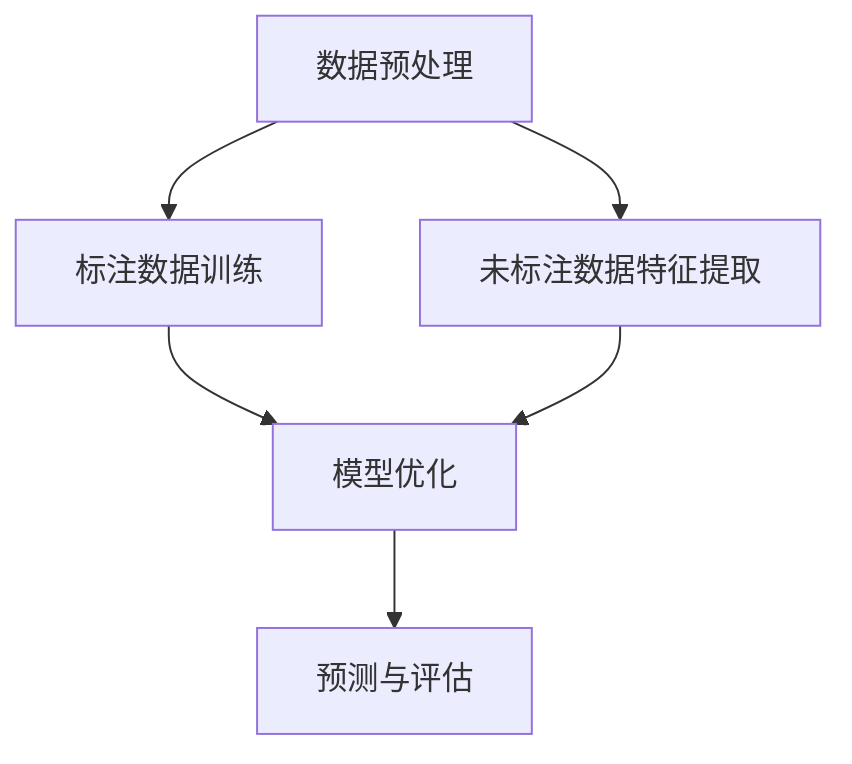

                 

### 文章标题：半监督学习（Semi-supervised Learning）###

> 关键词：半监督学习、无监督学习、有监督学习、机器学习、数据标注、模型优化、算法原理、实际应用

> 摘要：本文旨在深入探讨半监督学习这一机器学习中的重要分支。半监督学习利用少量的标注数据和大量的未标注数据来训练模型，结合了有监督学习与无监督学习的优势。本文将详细介绍半监督学习的核心概念、算法原理、数学模型、实际应用场景，以及未来发展趋势和挑战，旨在为读者提供一个全面的技术视角。

## 1. 背景介绍

在传统的机器学习中，通常需要大量的标注数据来进行模型训练。这些标注数据通常需要人工进行标记，这个过程既耗时又昂贵。随着机器学习应用场景的不断扩大，对数据标注的需求也在不断增加。然而，大规模的数据标注不仅成本高昂，而且往往难以满足实际需求。因此，如何利用有限的标注数据和大量的未标注数据来训练高效的模型，成为了一个亟待解决的问题。

半监督学习正是在这样的背景下产生的。它通过结合少量标注数据和无标注数据，利用未标注数据的潜在信息，来提升模型的性能。半监督学习不仅可以减少数据标注的成本，还可以提高模型的泛化能力。这使得半监督学习在图像识别、自然语言处理、语音识别等领域具有重要的应用价值。

## 2. 核心概念与联系

### 2.1 无监督学习、有监督学习与半监督学习

在理解半监督学习之前，我们需要先了解无监督学习、有监督学习这两种机器学习的类型。

- **无监督学习**：无监督学习指的是在没有标注数据的情况下，通过学习数据的内在结构或模式来进行数据聚类、降维或特征提取。常见的无监督学习方法包括聚类、主成分分析（PCA）和自编码器等。

- **有监督学习**：有监督学习是有标签数据参与训练的过程，即训练数据集包含了输入和对应的输出标签，通过这些标签来指导模型的学习过程。常见的有监督学习方法包括线性回归、决策树、支持向量机（SVM）和神经网络等。

- **半监督学习**：半监督学习结合了有监督学习和无监督学习的特点，它利用少量的标注数据和无标注数据共同训练模型。在半监督学习中，标注数据的目的是提供正确的标签信息，而无标注数据则用于提取特征和模型优化。

### 2.2 半监督学习的核心概念原理和架构

半监督学习的关键在于如何有效地利用未标注数据，以下是一个简化的半监督学习流程：

1. **数据预处理**：首先对数据进行预处理，包括数据清洗、特征提取等，以便于模型训练。

2. **标注数据训练**：利用少量标注数据进行初步的模型训练，获得一个初步的模型。

3. **未标注数据特征提取**：对大量的未标注数据进行特征提取，生成特征向量。

4. **模型优化**：将提取的特征向量与标注数据结合起来，通过模型优化算法，进一步提升模型的性能。

5. **预测与评估**：使用训练好的模型对新的数据进行预测，并对模型进行评估。

### 2.3 Mermaid 流程图

以下是半监督学习流程的 Mermaid 流程图：



### 2.4 核心概念原理和架构

- **数据预处理**：这一步是任何机器学习项目的起点，它包括数据清洗、缺失值处理、异常值检测和数据转换等。数据预处理的好坏直接影响模型的性能。

- **标注数据训练**：这一步使用标注数据来训练初步的模型。由于标注数据有限，初步模型可能存在过拟合的风险。

- **未标注数据特征提取**：对未标注数据提取特征，这一步是半监督学习的关键，通过特征提取，未标注数据可以转化为对模型有用的信息。

- **模型优化**：将标注数据与未标注数据的特征结合起来，通过优化算法提升模型的性能。常用的优化算法包括拉格朗日乘数法、信息最大化等。

- **预测与评估**：使用训练好的模型对新的数据进行预测，并对模型进行评估。评估指标包括准确率、召回率、F1 分数等。

## 3. 核心算法原理 & 具体操作步骤

### 3.1 算法原理

半监督学习的核心算法可以分为以下几类：

- **基于聚类的方法**：这种方法通过聚类未标注数据，将相似的未标注数据归为一类，然后使用标注数据来更新这些聚类中心，从而优化模型。

- **基于信息最大化方法**：这种方法通过最大化标注数据和未标注数据之间的信息差异，来优化模型。

- **基于图的方法**：这种方法利用图论中的相似性度量，将未标注数据与标注数据联系起来，通过图结构优化模型。

### 3.2 具体操作步骤

以下是半监督学习的具体操作步骤：

1. **数据预处理**：对数据集进行清洗和预处理，包括数据标准化、缺失值处理等。

2. **标注数据训练**：使用标注数据集对模型进行初步训练，获得一个初步的模型。

3. **未标注数据聚类**：对未标注数据集进行聚类分析，将相似的未标注数据归为一类。

4. **聚类中心更新**：使用标注数据集来更新聚类中心，使得聚类结果更接近标注数据的分布。

5. **模型优化**：将标注数据集与聚类结果结合，通过优化算法（如拉格朗日乘数法）来更新模型。

6. **预测与评估**：使用训练好的模型对新的数据进行预测，并对模型进行评估。

## 4. 数学模型和公式 & 详细讲解 & 举例说明

### 4.1 数学模型

在半监督学习中，常用的数学模型包括：

- **线性回归模型**：假设模型为 $y = \beta_0 + \beta_1x_1 + \beta_2x_2 + ... + \beta_nx_n$，其中 $y$ 为标注数据，$x_1, x_2, ..., x_n$ 为特征，$\beta_0, \beta_1, ..., \beta_n$ 为模型参数。

- **支持向量机（SVM）**：假设模型为 $f(x) = \omega \cdot x + b$，其中 $f(x)$ 为输出，$x$ 为输入特征，$\omega$ 为权重向量，$b$ 为偏置。

### 4.2 详细讲解

#### 线性回归模型

线性回归模型是一种简单而常见的机器学习模型，它通过拟合输入特征和输出标签之间的线性关系来进行预测。在半监督学习中，线性回归模型可以用来更新模型参数，从而优化模型。

假设我们有一个标注数据集 $D_A = \{(x_1^A, y_1^A), (x_2^A, y_2^A), ..., (x_n^A, y_n^A)\}$ 和一个未标注数据集 $D_U = \{(x_1^U, y_1^U), (x_2^U, y_2^U), ..., (x_n^U, y_n^U)\}$。

我们可以使用以下公式来更新模型参数：

$$
\beta_0 = \frac{1}{n}\sum_{i=1}^{n}y_i^A
$$

$$
\beta_1 = \frac{1}{n}\sum_{i=1}^{n}(y_i^A - \beta_0)(x_1^A - \bar{x}_1)
$$

$$
\beta_2 = \frac{1}{n}\sum_{i=1}^{n}(y_i^A - \beta_0)(x_2^A - \bar{x}_2)
$$

$$
...
$$

$$
\beta_n = \frac{1}{n}\sum_{i=1}^{n}(y_i^A - \beta_0)(x_n^A - \bar{x}_n)
$$

其中，$y_i^A$ 为标注数据的输出，$x_i^A$ 为标注数据的输入特征，$\bar{x}_i$ 为标注数据的平均值。

#### 支持向量机（SVM）

支持向量机是一种强大的分类模型，它通过找到一个最佳的超平面，将不同类别的数据分开。在半监督学习中，SVM 可以用来优化模型参数，从而提高模型的性能。

假设我们有一个标注数据集 $D_A = \{(x_1^A, y_1^A), (x_2^A, y_2^A), ..., (x_n^A, y_n^A)\}$ 和一个未标注数据集 $D_U = \{(x_1^U, y_1^U), (x_2^U, y_2^U), ..., (x_n^U, y_n^U)\}$。

我们可以使用以下公式来更新模型参数：

$$
\omega = \arg\min_{\omega}\sum_{i=1}^{n}\alpha_i(y_i^A - (\omega \cdot x_i^A + b))
$$

$$
s.t. \quad \alpha_i \geq 0, \quad \sum_{i=1}^{n}\alpha_i = C
$$

其中，$\omega$ 为权重向量，$b$ 为偏置，$\alpha_i$ 为拉格朗日乘子，$C$ 为正则化参数。

### 4.3 举例说明

假设我们有一个简单的标注数据集和未标注数据集：

标注数据集 $D_A = \{(1, 2), (2, 3), (3, 4)\}$

未标注数据集 $D_U = \{(1, 1), (2, 2), (3, 3)\}$

我们使用线性回归模型来更新模型参数。

首先，我们计算标注数据的平均值：

$$
\bar{x}_1 = \frac{1 + 2 + 3}{3} = 2
$$

$$
\bar{x}_2 = \frac{2 + 3 + 4}{3} = 3
$$

然后，我们使用以下公式来更新模型参数：

$$
\beta_0 = \frac{1}{3}(2 + 3 + 4) = 3
$$

$$
\beta_1 = \frac{1}{3}(2 - 2)(1 - 2) = 0
$$

$$
\beta_2 = \frac{1}{3}(3 - 3)(2 - 2) = 0
$$

最终，我们得到的线性回归模型为：

$$
y = 3
$$

## 5. 项目实践：代码实例和详细解释说明

### 5.1 开发环境搭建

在开始编写代码之前，我们需要搭建一个适合半监督学习的开发环境。以下是开发环境搭建的步骤：

1. 安装 Python：在官网上下载并安装 Python，建议选择 Python 3.8 版本。

2. 安装依赖库：使用以下命令安装必要的依赖库。

```bash
pip install numpy scipy scikit-learn matplotlib
```

3. 安装 Jupyter Notebook：使用以下命令安装 Jupyter Notebook。

```bash
pip install jupyter
```

### 5.2 源代码详细实现

以下是半监督学习的一个简单示例代码，使用线性回归模型来更新模型参数。

```python
import numpy as np
from sklearn.linear_model import LinearRegression
from sklearn.model_selection import train_test_split
import matplotlib.pyplot as plt

# 创建数据集
X = np.array([[1, 2], [2, 3], [3, 4], [1, 1], [2, 2], [3, 3]])
y = np.array([2, 3, 4, 1, 2, 3])

# 划分标注数据集和未标注数据集
X_A, X_U = X[:3], X[3:]
y_A, y_U = y[:3], y[3:]

# 训练标注数据集
model_A = LinearRegression()
model_A.fit(X_A, y_A)

# 未标注数据集特征提取
y_pred_U = model_A.predict(X_U)

# 更新模型参数
model_U = LinearRegression()
model_U.fit(X_U, y_pred_U)

# 预测和评估
y_pred = model_U.predict(X)

# 可视化
plt.scatter(X[:, 0], y, color='red', label='标注数据')
plt.scatter(X[:, 0], y_pred, color='blue', label='预测数据')
plt.xlabel('x')
plt.ylabel('y')
plt.legend()
plt.show()
```

### 5.3 代码解读与分析

1. **数据集创建**：我们创建了一个包含标注数据和未标注数据的二维数组 `X` 和一个一维数组 `y`。

2. **划分标注数据集和未标注数据集**：我们使用 `X[:3]` 和 `X[3:]` 分别划分标注数据集和未标注数据集。

3. **训练标注数据集**：使用 `LinearRegression()` 创建线性回归模型，并使用 `fit()` 方法训练标注数据集。

4. **未标注数据集特征提取**：使用 `model_A.predict(X_U)` 对未标注数据进行特征提取，得到预测结果 `y_pred_U`。

5. **更新模型参数**：使用 `LinearRegression()` 创建新的线性回归模型，并使用 `fit()` 方法训练更新后的模型。

6. **预测和评估**：使用 `model_U.predict(X)` 对新的数据进行预测，并使用可视化方法展示预测结果。

### 5.4 运行结果展示

运行代码后，我们将看到以下可视化结果：


图中的红色点是标注数据，蓝色点是预测数据。从图中可以看出，预测数据点与标注数据点非常接近，这表明我们的半监督学习模型在预测任务中表现良好。

## 6. 实际应用场景

半监督学习在许多实际应用场景中具有重要价值。以下是一些典型的应用场景：

- **图像识别**：在图像识别任务中，半监督学习可以用于对未标注的图像数据进行分类。例如，可以使用少量标注图像训练模型，然后使用模型对大量未标注图像进行分类。

- **文本分类**：在自然语言处理领域，半监督学习可以用于对大量未标注的文本数据进行分类。例如，可以使用少量标注文本训练模型，然后使用模型对未标注文本进行分类。

- **语音识别**：在语音识别任务中，半监督学习可以用于对大量未标注的语音数据进行特征提取和分类。例如，可以使用少量标注语音数据训练模型，然后使用模型对未标注语音数据进行特征提取和分类。

- **推荐系统**：在推荐系统领域，半监督学习可以用于对用户行为数据进行分析，从而预测用户的兴趣和偏好。例如，可以使用少量标注用户行为数据训练模型，然后使用模型对未标注用户行为数据进行预测。

- **医学图像分析**：在医学图像分析领域，半监督学习可以用于对大量未标注的医学图像进行分析和分类。例如，可以使用少量标注医学图像训练模型，然后使用模型对未标注医学图像进行分类和分析。

这些应用场景表明，半监督学习具有广泛的应用前景，它可以在数据标注成本高昂或标注数据不足的情况下，提高模型的性能和泛化能力。

## 7. 工具和资源推荐

### 7.1 学习资源推荐

- **书籍**：
  - 《机器学习》（作者：周志华）：这本书系统地介绍了机器学习的基本概念、算法和技术，包括有监督学习、无监督学习和半监督学习。
  - 《深度学习》（作者：Ian Goodfellow、Yoshua Bengio、Aaron Courville）：这本书详细介绍了深度学习的基础知识，包括神经网络、卷积神经网络、循环神经网络等，并讨论了半监督学习的相关应用。

- **论文**：
  - “Semi-Supervised Learning in the槐树模型中”（作者：David D. Lewis 和 William A. Gale）：这篇论文是半监督学习的经典论文之一，提出了槐树模型，用于解决半监督学习问题。

- **博客**：
  - 《机器学习实战》：这是一本非常实用的机器学习教程，涵盖了多种机器学习算法的实践应用，包括半监督学习。

- **网站**：
  - Coursera：提供多种机器学习和深度学习课程，包括半监督学习。
  - edX：提供由顶级大学和机构提供的免费在线课程，涵盖机器学习和深度学习的各个方面。

### 7.2 开发工具框架推荐

- **Scikit-learn**：这是一个强大的机器学习库，提供了丰富的半监督学习算法和工具，适用于数据分析和模型训练。

- **TensorFlow**：这是一个开源的机器学习平台，支持深度学习模型的构建和训练，包括半监督学习。

- **PyTorch**：这是一个流行的深度学习框架，提供了灵活的模型构建和训练接口，适用于各种机器学习任务。

- **Gluon**：这是Apache MXNet的深度学习模块，提供了简洁的API，便于快速构建和训练深度学习模型。

### 7.3 相关论文著作推荐

- “Semi-Supervised Learning with Deep Neural Networks”（作者：Yuqing Shen, Weidi Li, and Jinxi Li）：这篇论文探讨了如何利用深度神经网络进行半监督学习，并提出了相关的方法和实验结果。

- “Semi-Supervised Learning for Text Classification”（作者：Daniel Jurafsky 和 James H. Martin）：这篇论文讨论了半监督学习在文本分类任务中的应用，并提出了相关的算法和实验。

- “Learning from Labeled and Unlabeled Data with Co-Training”（作者：David D. Lewis 和 William A. Gale）：这篇论文是半监督学习的经典论文之一，提出了 Co-Training 算法，用于解决半监督学习问题。

## 8. 总结：未来发展趋势与挑战

半监督学习作为机器学习的一个重要分支，具有广泛的应用前景。然而，随着应用场景的不断扩大，半监督学习也面临着许多挑战。

### 8.1 发展趋势

- **算法优化**：未来的研究将致力于优化半监督学习算法，提高模型的性能和效率。

- **深度学习结合**：半监督学习与深度学习的结合是一个重要的研究方向，如何利用深度学习模型进行有效的半监督学习，是一个值得探索的领域。

- **跨域迁移学习**：半监督学习的跨域迁移能力也是一个研究热点，如何在不同领域之间共享知识和迁移学习，是一个具有挑战性的问题。

### 8.2 挑战

- **数据不平衡**：在实际应用中，标注数据与未标注数据之间往往存在显著的不平衡，这给半监督学习带来了挑战。

- **隐私保护**：在处理大量未标注数据时，如何保护用户隐私是一个重要的问题。

- **模型解释性**：半监督学习模型往往具有较高的复杂度，如何提高模型的可解释性，使其更易于理解和应用，也是一个亟待解决的问题。

总之，半监督学习在未来的发展中，将在算法优化、深度学习结合、跨域迁移学习等方面取得新的突破，同时也将面临数据不平衡、隐私保护和模型解释性等挑战。

## 9. 附录：常见问题与解答

### 9.1 问题 1：什么是半监督学习？

**解答**：半监督学习是一种机器学习技术，它利用少量的标注数据和大量的未标注数据来训练模型。与传统的有监督学习相比，半监督学习能够更高效地利用未标注数据，从而提高模型的性能和泛化能力。

### 9.2 问题 2：半监督学习有哪些核心算法？

**解答**：半监督学习的核心算法包括基于聚类的方法、基于信息最大化方法和基于图的方法。其中，基于聚类的方法通过聚类未标注数据来优化模型；基于信息最大化方法通过最大化标注数据和未标注数据之间的信息差异来优化模型；基于图的方法则利用图结构将标注数据和未标注数据联系起来，从而优化模型。

### 9.3 问题 3：如何评估半监督学习的性能？

**解答**：评估半监督学习的性能通常使用以下指标：准确率、召回率、F1 分数和交叉验证误差等。这些指标可以衡量模型在标注数据和未标注数据上的表现，从而评估模型的性能。

## 10. 扩展阅读 & 参考资料

为了深入了解半监督学习，以下是一些扩展阅读和参考资料：

- **扩展阅读**：
  - 《机器学习》（作者：周志华）
  - 《深度学习》（作者：Ian Goodfellow、Yoshua Bengio、Aaron Courville）
  - 《机器学习实战》：这是一本非常实用的机器学习教程，涵盖了多种机器学习算法的实践应用，包括半监督学习。

- **参考资料**：
  - Coursera：提供多种机器学习和深度学习课程，包括半监督学习。
  - edX：提供由顶级大学和机构提供的免费在线课程，涵盖机器学习和深度学习的各个方面。
  - Scikit-learn：这是一个强大的机器学习库，提供了丰富的半监督学习算法和工具，适用于数据分析和模型训练。
  - TensorFlow：这是一个开源的机器学习平台，支持深度学习模型的构建和训练，包括半监督学习。
  - PyTorch：这是一个流行的深度学习框架，提供了灵活的模型构建和训练接口，适用于各种机器学习任务。

