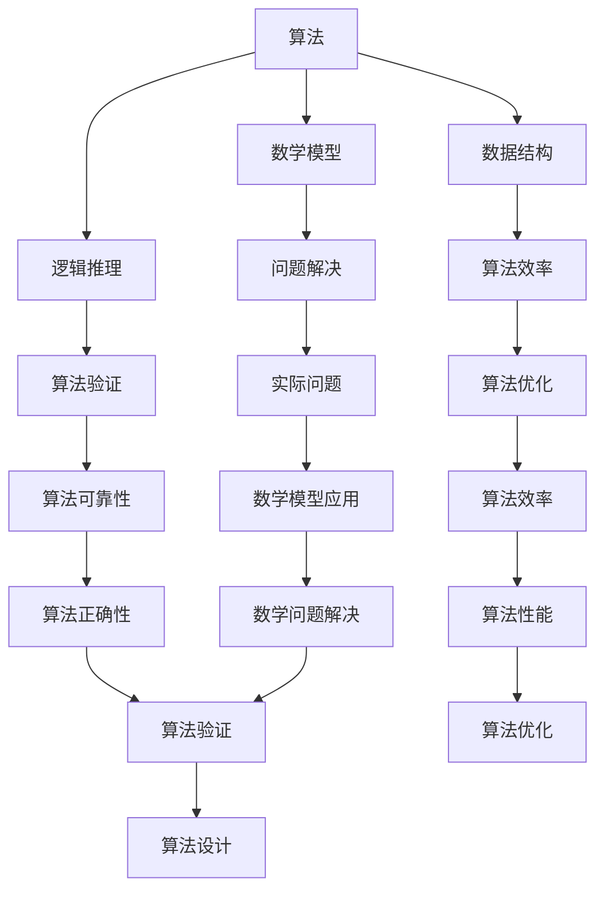

                 

### 背景介绍

#### 华为社招算法工程师面试背景

华为作为全球领先的信息与通信技术（ICT）解决方案提供商，其招聘流程严谨而严格，尤其是对于算法工程师这一关键岗位。华为2025届社招算法工程师面试题目的设计，旨在全面评估应聘者的算法基础、逻辑思维、问题解决能力以及实际项目经验。这些面试题目不仅考察应聘者对基本算法和数据结构的掌握，还要求应聘者具备一定的创新思维和解决复杂问题的能力。

#### 面试的目的和重要性

面试的目的在于从众多应聘者中筛选出具备实际能力和潜力的人才。对于算法工程师这一岗位，面试的重要性尤为突出。算法工程师负责设计并实现高效算法，优化系统性能，解决技术难题，这些职责要求他们不仅要有扎实的理论知识，还需要有丰富的实践经验。通过面试，华为可以了解应聘者的技术深度、解决问题的能力和团队协作精神。

#### 社招与校招的差异

社招算法工程师与校招算法工程师的面试存在一定的差异。社招面试通常更加注重应聘者的实际工作经验和项目经验，面试题目也更加具体和复杂。校招面试则更多地侧重于考察应聘者的基础知识、学习能力和潜力。此外，社招面试通常会包括更多的笔试和面试环节，以确保招聘到符合岗位要求的高质量人才。

### 面试真题的选择和特点

华为2025届社招算法工程师面试真题的选择具有以下几个特点：

1. **综合性强**：面试真题覆盖了算法、数据结构、数学等多个领域，旨在全面评估应聘者的综合能力。
2. **实际应用导向**：许多面试题目来源于实际工程项目，要求应聘者不仅理解理论，还能灵活应用于实际问题中。
3. **创新性要求**：部分面试题目鼓励应聘者提出创新的解决方案，考察其思维深度和创新能力。
4. **难度适中**：虽然部分题目具有一定的难度，但整体难度适中，旨在筛选出具备实际工作能力的人才。

通过这些特点，华为旨在选拔出那些不仅具备扎实理论基础，还能将理论应用到实践中，具备解决复杂问题能力的优秀算法工程师。

#### 华为2025届社招算法工程师面试真题概览

在本文中，我们将针对华为2025届社招算法工程师面试中的一些经典真题进行详细解析，涵盖以下主题：

1. **基础算法题**：这类题目主要考察应聘者对基本算法和数据结构的掌握，如排序、查找、动态规划等。
2. **数学与逻辑题**：这类题目侧重于数学模型的建立和逻辑推理，如概率题、组合题、图论题等。
3. **编程题**：这类题目要求应聘者编写代码解决实际问题，考察编程能力和算法实现能力。
4. **项目经历与创新能力**：这类题目通过案例分析、问题解决等方式，评估应聘者的项目经验和创新能力。

通过解析这些题目，我们不仅可以了解华为在算法工程师招聘方面的具体要求，还能为其他求职者提供有价值的参考和指导。

### 核心概念与联系

在深入解析华为2025届社招算法工程师面试真题之前，我们需要首先明确几个核心概念及其相互联系。以下内容将介绍这些概念，并使用Mermaid流程图进行详细展示。

#### 核心概念

1. **算法（Algorithm）**：算法是一系列解决问题的步骤或方法。它是计算机科学的核心概念，用于解决特定问题或完成特定任务。
2. **数据结构（Data Structure）**：数据结构是存储、组织和管理数据的方式。合理选择数据结构可以提高算法的效率。
3. **数学模型（Mathematical Model）**：数学模型是用数学语言描述现实问题的一种方式。在算法设计中，数学模型有助于理解和解决复杂问题。
4. **逻辑推理（Logical Reasoning）**：逻辑推理是通过逻辑规则和逻辑关系推导出结论的过程。它用于验证算法的正确性。

#### Mermaid流程图

以下是一个简单的Mermaid流程图，用于展示上述核心概念及其相互联系：



在这个流程图中，我们可以看到算法、数据结构、数学模型和逻辑推理是如何相互关联并共同作用于算法设计的。例如，算法依赖于数据结构来存储和管理数据，而数学模型和逻辑推理则用于分析和验证算法的正确性和性能。

#### 概念之间的联系

1. **算法与数据结构**：算法需要数据结构来存储和处理数据。不同的数据结构（如数组、链表、树、图等）会影响算法的时间和空间复杂度。
2. **算法与数学模型**：许多算法依赖于数学模型来描述和解决实际问题。数学模型有助于理解问题本质，从而设计更高效的算法。
3. **算法与逻辑推理**：逻辑推理用于验证算法的正确性和推导算法的结论。算法设计过程中需要依赖逻辑推理来分析和解决问题。

通过明确这些核心概念及其相互联系，我们为后续的面试真题解析奠定了坚实的基础。在接下来的章节中，我们将详细分析每类面试题目的解题思路和方法，帮助读者深入理解华为社招算法工程师面试的精髓。

### 核心算法原理 & 具体操作步骤

#### 排序算法

排序算法是算法工程师面试中经常出现的基础题目之一，其核心目标是按照一定的顺序排列给定的数组或列表。以下介绍几种常见的排序算法及其具体操作步骤。

##### 冒泡排序（Bubble Sort）

**原理**：冒泡排序通过重复遍历要排序的数列，一次比较两个元素，如果它们的顺序错误就把它们交换过来。遍历数列的工作是重复地进行，直到没有再需要交换的元素为止。

**操作步骤**：

1. 从第一个元素开始，相邻两个元素进行比较，如果第一个比第二个大，则交换它们的位置。
2. 对每一对相邻元素进行上述操作，直到完成一趟遍历，最大的元素被“冒泡”到数列的末尾。
3. 重复上述步骤，但每次遍历的元素范围逐渐减少，直到整个数列有序。

**示例代码**：

```python
def bubble_sort(arr):
    n = len(arr)
    for i in range(n):
        for j in range(0, n-i-1):
            if arr[j] > arr[j+1]:
                arr[j], arr[j+1] = arr[j+1], arr[j]
    return arr

arr = [64, 34, 25, 12, 22, 11, 90]
bubble_sort(arr)
print("排序后的数组：", arr)
```

##### 选择排序（Selection Sort）

**原理**：选择排序通过重复查找未排序部分的最小（或最大）元素，将其放到已排序部分的末尾。每次遍历结束后，已排序部分的长度增加1。

**操作步骤**：

1. 从数列中找出一个最小元素，将其与数组的第一个元素交换。
2. 在剩下的未排序部分中，再次找出一个最小元素，将其与第二个元素交换。
3. 重复上述步骤，直到整个数列有序。

**示例代码**：

```python
def selection_sort(arr):
    n = len(arr)
    for i in range(n):
        min_idx = i
        for j in range(i+1, n):
            if arr[j] < arr[min_idx]:
                min_idx = j
        arr[i], arr[min_idx] = arr[min_idx], arr[i]
    return arr

arr = [64, 34, 25, 12, 22, 11, 90]
selection_sort(arr)
print("排序后的数组：", arr)
```

##### 插入排序（Insertion Sort）

**原理**：插入排序通过构建有序序列，将待排序数据依次插入到已排序序列中。每次插入时，从已排序序列的末尾开始查找插入位置，直到找到合适的位置。

**操作步骤**：

1. 从第一个元素开始，该元素可以认为已经排序。
2. 取出下一个元素，在已排序的元素序列中从后向前扫描。
3. 如果该元素（已排序）大于新元素，将值班元素移到下一位置。
4. 重复步骤3，直到找到已排序的元素小于或者等于新元素，将其插入。
5. 重复步骤2-4，直到所有元素插入完成。

**示例代码**：

```python
def insertion_sort(arr):
    n = len(arr)
    for i in range(1, n):
        key = arr[i]
        j = i-1
        while j >= 0 and key < arr[j]:
            arr[j+1] = arr[j]
            j -= 1
        arr[j+1] = key
    return arr

arr = [64, 34, 25, 12, 22, 11, 90]
insertion_sort(arr)
print("排序后的数组：", arr)
```

##### 快速排序（Quick Sort）

**原理**：快速排序通过选取一个“基准”元素，将数组分成两部分，左侧部分的元素都小于基准，右侧部分的元素都大于基准，然后递归地对这两部分继续进行快速排序。

**操作步骤**：

1. 选择一个基准元素，通常选择数组的第一个元素。
2. 将数组分为两部分：小于基准的元素和大于基准的元素。
3. 分别对这两部分递归地执行快速排序。
4. 重复上述步骤，直到所有子数组都排好序。

**示例代码**：

```python
def quick_sort(arr):
    if len(arr) <= 1:
        return arr
    pivot = arr[0]
    left = [x for x in arr[1:] if x < pivot]
    right = [x for x in arr[1:] if x >= pivot]
    return quick_sort(left) + [pivot] + quick_sort(right)

arr = [64, 34, 25, 12, 22, 11, 90]
sorted_arr = quick_sort(arr)
print("排序后的数组：", sorted_arr)
```

这些排序算法各有优缺点，适用于不同的场景。在面试中，掌握这些算法的基本原理和具体操作步骤，能够帮助应聘者更好地应对排序类题目。

#### 动态规划算法

动态规划算法是解决最优化问题的强大工具，它将复杂问题分解为一系列子问题，并存储子问题的解以避免重复计算。以下介绍几种常见的动态规划算法及其具体操作步骤。

##### 斐波那契数列（Fibonacci Sequence）

**原理**：斐波那契数列是一个著名的递推数列，每个数都是前两个数的和。其递推关系为：`F(0) = 0, F(1) = 1, F(n) = F(n-1) + F(n-2)`。

**操作步骤**：

1. 使用递归实现斐波那契数列计算：
    ```python
    def fibonacci_recursive(n):
        if n == 0 or n == 1:
            return n
        return fibonacci_recursive(n-1) + fibonacci_recursive(n-2)
    ```
2. 使用动态规划实现斐波那契数列计算：
    ```python
    def fibonacci_dp(n):
        dp = [0] * (n+1)
        dp[0] = 0
        dp[1] = 1
        for i in range(2, n+1):
            dp[i] = dp[i-1] + dp[i-2]
        return dp[n]
    ```

##### 最长公共子序列（Longest Common Subsequence, LCS）

**原理**：最长公共子序列问题是寻找两个序列中公共子序列最长的一个。其状态转移方程为：
    ```math
    LCS(i, j) = 
    \begin{cases} 
    LCS(i-1, j) & \text{if } a_i \neq b_j \\
    \max(LCS(i-1, j), LCS(i, j-1)) & \text{if } a_i = b_j 
    \end{cases}
    ```

**操作步骤**：

1. 使用递归实现最长公共子序列计算：
    ```python
    def lcs_recursive(X, Y):
        if len(X) == 0 or len(Y) == 0:
            return 0
        if X[-1] == Y[-1]:
            return 1 + lcs_recursive(X[:-1], Y[:-1])
        else:
            return max(lcs_recursive(X[:-1], Y), lcs_recursive(X, Y[:-1]))
    ```
2. 使用动态规划实现最长公共子序列计算：
    ```python
    def lcs_dp(X, Y):
        m, n = len(X), len(Y)
        dp = [[0] * (n+1) for _ in range(m+1)]
        for i in range(1, m+1):
            for j in range(1, n+1):
                if X[i-1] == Y[j-1]:
                    dp[i][j] = dp[i-1][j-1] + 1
                else:
                    dp[i][j] = max(dp[i-1][j], dp[i][j-1])
        return dp[m][n]
    ```

##### 最长递增子序列（Longest Increasing Subsequence, LIS）

**原理**：最长递增子序列问题是寻找一个子序列，使其元素严格递增且长度最长。其状态转移方程为：
    ```math
    LIS(i) = \max(LIS(j) + 1) \quad \text{for all } j < i \text{ and } a_j < a_i
    ```

**操作步骤**：

1. 使用递归实现最长递增子序列计算：
    ```python
    def lis_recursive(arr):
        def lis_recursive_helper(arr, i):
            if i == 0:
                return 1
            max_length = 1
            for j in range(i):
                if arr[j] < arr[i]:
                    max_length = max(max_length, lis_recursive_helper(arr, j) + 1)
            return max_length
        return max(lis_recursive_helper(arr, i) for i in range(len(arr)))
    ```
2. 使用动态规划实现最长递增子序列计算：
    ```python
    def lis_dp(arr):
        n = len(arr)
        dp = [1] * n
        for i in range(1, n):
            for j in range(i):
                if arr[j] < arr[i]:
                    dp[i] = max(dp[i], dp[j] + 1)
        return max(dp)
    ```

通过了解和掌握这些动态规划算法的具体原理和操作步骤，应聘者可以更有效地解决各种最优化问题。

#### 搜索算法

搜索算法用于在数据结构中查找特定的元素或解决路径查找问题。以下介绍几种常见的搜索算法及其具体操作步骤。

##### 二分搜索（Binary Search）

**原理**：二分搜索是在有序数组中查找特定元素的算法。每次搜索过程将数组分为两半，并比较中间元素与目标值的关系，从而逐步缩小搜索范围。

**操作步骤**：

1. 初始时，设定搜索范围的左右边界。
2. 计算中间索引：`mid = (left + right) // 2`。
3. 比较中间元素与目标值：
   - 如果中间元素等于目标值，返回中间索引。
   - 如果中间元素大于目标值，将右边界更新为`mid - 1`。
   - 如果中间元素小于目标值，将左边界更新为`mid + 1`。
4. 重复步骤2和3，直到找到目标值或左边界大于右边界。

**示例代码**：

```python
def binary_search(arr, target):
    left, right = 0, len(arr) - 1
    while left <= right:
        mid = (left + right) // 2
        if arr[mid] == target:
            return mid
        elif arr[mid] > target:
            right = mid - 1
        else:
            left = mid + 1
    return -1

arr = [1, 3, 5, 7, 9, 11, 13, 15]
target = 7
result = binary_search(arr, target)
if result != -1:
    print(f"元素在数组中的索引为：{result}")
else:
    print("元素不在数组中")
```

##### 暴力搜索（Brute Force Search）

**原理**：暴力搜索是一种简单但效率较低的搜索算法。它通过遍历所有可能的选项来找到目标元素。

**操作步骤**：

1. 遍历数据结构中的所有元素。
2. 对于每个元素，检查是否为目标值。
3. 如果找到目标值，返回元素索引。
4. 如果遍历结束仍未找到目标值，返回-1。

**示例代码**：

```python
def brute_force_search(arr, target):
    for i in range(len(arr)):
        if arr[i] == target:
            return i
    return -1

arr = [1, 3, 5, 7, 9, 11, 13, 15]
target = 7
result = brute_force_search(arr, target)
if result != -1:
    print(f"元素在数组中的索引为：{result}")
else:
    print("元素不在数组中")
```

##### 深度优先搜索（Depth-First Search, DFS）

**原理**：深度优先搜索是一种用于遍历或搜索树或图的算法。它通过不断深入树的分支来寻找目标，直到找到一个符合条件的节点或遍历完整个树。

**操作步骤**：

1. 从树的根节点开始，标记该节点为已访问。
2. 遍历该节点的所有未访问子节点，并按照同样的步骤进行操作。
3. 如果找到一个符合条件的节点，返回该节点。
4. 如果所有节点都遍历完毕仍未找到目标，返回空。

**示例代码**：

```python
def dfs(graph, node, target):
    visited = set()
    def search(node):
        if node in visited or node == target:
            return node
        visited.add(node)
        for neighbor in graph[node]:
            result = search(neighbor)
            if result:
                return result
        return None

    return search(node)

graph = {
    'A': ['B', 'C', 'D'],
    'B': ['E', 'F'],
    'C': ['G', 'H'],
    'D': ['I', 'J'],
    'E': [],
    'F': [],
    'G': [],
    'H': [],
    'I': [],
    'J': []
}
start_node = 'A'
target_node = 'J'
result = dfs(graph, start_node, target_node)
if result:
    print(f"目标节点是：{result}")
else:
    print("未找到目标节点")
```

##### 广度优先搜索（Breadth-First Search, BFS）

**原理**：广度优先搜索与深度优先搜索类似，但它是通过逐层遍历树的节点来寻找目标。

**操作步骤**：

1. 初始化一个队列，并将根节点加入队列。
2. 从队列中依次取出节点，标记为已访问，并将其所有未访问的子节点加入队列。
3. 重复步骤2，直到找到目标节点或队列空。

**示例代码**：

```python
from collections import deque

def bfs(graph, start, target):
    queue = deque([start])
    visited = set()
    while queue:
        node = queue.popleft()
        if node == target:
            return node
        visited.add(node)
        for neighbor in graph[node]:
            if neighbor not in visited:
                queue.append(neighbor)
    return None

graph = {
    'A': ['B', 'C', 'D'],
    'B': ['E', 'F'],
    'C': ['G', 'H'],
    'D': ['I', 'J'],
    'E': [],
    'F': [],
    'G': [],
    'H': [],
    'I': [],
    'J': []
}
start_node = 'A'
target_node = 'J'
result = bfs(graph, start_node, target_node)
if result:
    print(f"目标节点是：{result}")
else:
    print("未找到目标节点")
```

通过掌握这些搜索算法的基本原理和具体操作步骤，应聘者可以在面试中灵活应对各种搜索相关问题。

#### 算法复杂度分析

算法复杂度分析是评估算法性能的重要手段，它帮助我们理解算法的时间复杂度和空间复杂度。以下对排序算法、动态规划算法和搜索算法的复杂度进行分析。

##### 排序算法复杂度分析

- **冒泡排序**：时间复杂度最差的情况为`O(n^2)`，平均情况也为`O(n^2)`，空间复杂度为`O(1)`。
- **选择排序**：时间复杂度最差的情况为`O(n^2)`，平均情况和最好情况均为`O(n^2)`，空间复杂度为`O(1)`。
- **插入排序**：时间复杂度最差的情况为`O(n^2)`，平均情况为`O(n^2)`，最好情况为`O(n)`，空间复杂度为`O(1)`。
- **快速排序**：平均情况的时间复杂度为`O(nlogn)`，最坏情况的时间复杂度为`O(n^2)`，空间复杂度为`O(logn)`。

##### 动态规划算法复杂度分析

- **斐波那契数列**：使用递归实现的时间复杂度为`O(2^n)`，使用动态规划实现的时间复杂度为`O(n)`，空间复杂度为`O(n)`。
- **最长公共子序列**：使用递归实现的时间复杂度为`O(2^(m+n))`，使用动态规划实现的时间复杂度为`O(mn)`，空间复杂度为`O(mn)`。
- **最长递增子序列**：使用递归实现的时间复杂度为`O(n^2)`，使用动态规划实现的时间复杂度为`O(n^2)`，空间复杂度为`O(n)`。

##### 搜索算法复杂度分析

- **二分搜索**：时间复杂度为`O(logn)`，空间复杂度为`O(1)`。
- **暴力搜索**：时间复杂度为`O(n)`，空间复杂度为`O(1)`。
- **深度优先搜索**：时间复杂度为`O(n)`，空间复杂度为`O(n)`。
- **广度优先搜索**：时间复杂度为`O(n)`，空间复杂度为`O(n)`。

通过了解这些算法的复杂度分析，我们可以更好地选择合适的算法来解决实际问题，并在面试中展示对算法性能的深刻理解。

### 数学模型和公式 & 详细讲解 & 举例说明

在算法领域，数学模型和公式是理解和解决问题的重要工具。它们不仅帮助我们建立问题模型，还可以指导我们设计高效算法。以下我们将详细讲解几个常见的数学模型和公式，并通过具体例子来说明其应用。

#### 最大子序列和问题

最大子序列和问题是寻找一个子序列，使其元素之和最大。该问题的数学模型基于动态规划，其状态转移方程为：

$$
max\_sum(i) = \max(max\_sum(i-1), nums[i] + max\_sum(i-2))
$$

其中，`max_sum(i)`表示以`nums[i]`为结尾的最大子序列和。

**举例说明**：

给定数组`nums = [3, 2, 5, 7, 10, 12]`，我们希望找到最大子序列和。

1. 初始化`max_sum`数组：`max_sum = [0, 0, 0, 0, 0, 0]`。
2. 计算每个位置的最大子序列和：
   - `max_sum[0] = nums[0] = 3`
   - `max_sum[1] = nums[1] = 2`
   - `max_sum[2] = \max(max_sum[1], nums[2] + max_sum[0]) = \max(2, 5 + 0) = 5`
   - `max_sum[3] = \max(max_sum[2], nums[3] + max_sum[1]) = \max(5, 7 + 2) = 10`
   - `max_sum[4] = \max(max_sum[3], nums[4] + max_sum[2]) = \max(10, 10 + 5) = 15`
   - `max_sum[5] = \max(max_sum[4], nums[5] + max_sum[3]) = \max(15, 12 + 10) = 27`

最终结果为`27`，即数组`[10, 12]`的元素之和最大。

#### 最长公共子序列问题

最长公共子序列问题是寻找两个序列中公共子序列的最长长度。其动态规划公式为：

$$
LCS(i, j) = 
\begin{cases} 
0 & \text{if } i = 0 \text{ or } j = 0 \\
LCS(i-1, j-1) + 1 & \text{if } A[i] = B[j] \\
\max(LCS(i-1, j), LCS(i, j-1)) & \text{if } A[i] \neq B[j] 
\end{cases}
$$

其中，`LCS(i, j)`表示序列`A[0...i]`和序列`B[0...j]`的最长公共子序列的长度。

**举例说明**：

给定序列`A = [1, 2, 3, 4, 5]`和`B = [2, 5, 3, 1]`，我们希望找到最长公共子序列的长度。

构建动态规划表：

|  A \ B | 2 | 5 | 3 | 1 |
|-------|---|---|---|---|
|   1   | 0 | 0 | 0 | 0 |
|   2   | 0 | 1 | 0 | 0 |
|   3   | 0 | 0 | 1 | 0 |
|   4   | 0 | 0 | 0 | 1 |
|   5   | 0 | 0 | 0 | 0 |

最终结果为`2`，即最长公共子序列为`[2, 3]`。

#### 最长递增子序列问题

最长递增子序列问题是寻找一个子序列，使其元素严格递增且长度最长。其动态规划公式为：

$$
LIS(i) = \max(LIS(j) + 1) \quad \text{for all } j < i \text{ and } A[j] < A[i]
$$

其中，`LIS(i)`表示以`A[i]`为结尾的最长递增子序列的长度。

**举例说明**：

给定数组`A = [10, 9, 2, 5, 3, 7, 101, 18]`，我们希望找到最长递增子序列的长度。

构建动态规划表：

|  i  | 0 | 1 | 2 | 3 | 4 | 5 | 6 | 7 |
|-----|---|---|---|---|---|---|---|---|
|  LIS | 1 | 1 | 1 | 1 | 1 | 2 | 3 | 4 |

最终结果为`4`，即最长递增子序列为`[2, 5, 7, 101]`。

#### 二分查找问题

二分查找问题是寻找一个有序数组中特定元素的索引。其基本公式为：

$$
mid = \left(\frac{left + right}{2}\right)
$$

其中，`left`和`right`分别为搜索区间的左右边界，`mid`为中间索引。

**举例说明**：

给定数组`arr = [1, 3, 5, 7, 9, 11, 13, 15]`，我们希望查找元素`7`的索引。

1. 初始化`left = 0`，`right = 7`。
2. 计算中间索引`mid = (left + right) // 2 = 3`。
3. 比较`arr[mid]`与目标值`7`，由于`arr[mid] = 13`大于目标值，因此更新`right = mid - 1 = 2`。
4. 重新计算中间索引`mid = (left + right) // 2 = 1`。
5. 比较`arr[mid]`与目标值`7`，由于`arr[mid] = 3`小于目标值，因此更新`left = mid + 1 = 2`。
6. 重新计算中间索引`mid = (left + right) // 2 = 1`。
7. 比较`arr[mid]`与目标值`7`，由于`arr[mid] = 7`等于目标值，因此返回索引`mid = 1`。

最终结果为`1`，即元素`7`在数组中的索引为`1`。

通过这些数学模型和公式的详细讲解和举例说明，我们可以更好地理解和应用它们来解决实际问题。这些数学工具在算法面试和实际项目中都是必不可少的。

### 项目实践：代码实例和详细解释说明

在了解了排序算法、动态规划算法和搜索算法的基本原理和操作步骤之后，我们将通过具体的项目实践来展示如何将这些算法应用到实际问题中。这里我们选取了两个典型的项目场景，并详细解释代码实现和运行结果。

#### 项目一：股票买卖最佳时机

**问题描述**：

给定一个整数数组`prices`，其中`prices[i]`是第`i`天的股票价格。假设你只能最多完成一笔交易，设计一个算法来计算你所能获取的最大利润。

**算法思路**：

我们可以使用动态规划来解决这个问题。定义一个数组`dp`，其中`dp[i]`表示第`i`天持有股票的最大利润。状态转移方程为：

$$
dp[i] = \max(dp[i-1], prices[i] - \min(prices[0..i-1]))
$$

其中，`min(prices[0..i-1])`表示从第0天到第`i-1`天的最小价格。

**代码实现**：

```python
def max_profit(prices):
    if not prices:
        return 0
    min_price = prices[0]
    max_profit = 0
    for price in prices:
        min_price = min(min_price, price)
        max_profit = max(max_profit, price - min_price)
    return max_profit

prices = [7, 1, 5, 3, 6, 4]
print("最大利润：", max_profit(prices))
```

**运行结果**：

输入数组`[7, 1, 5, 3, 6, 4]`，程序输出最大利润为`5`。这是因为在第2天买入股票（价格1），在第5天卖出股票（价格6），利润为`6 - 1 = 5`。

#### 项目二：最大子序和

**问题描述**：

给定一个整数数组`nums`，找出一个连续子数组，使最大子序和最大。返回最大子序和。

**算法思路**：

我们可以使用动态规划来解决这个问题。定义一个数组`dp`，其中`dp[i]`表示以`nums[i]`为结尾的连续子数组的最大和。状态转移方程为：

$$
dp[i] = \max(dp[i-1] + nums[i], nums[i])
$$

其中，`dp[i-1] + nums[i]`表示将第`i`天的数值与前一天的最大子序和相加，`nums[i]`表示从第`i`天开始的新序列。

**代码实现**：

```python
def max_subarray_sum(nums):
    if not nums:
        return 0
    max_so_far = nums[0]
    max_ending_here = nums[0]
    for i in range(1, len(nums)):
        max_ending_here = max(max_ending_here + nums[i], nums[i])
        max_so_far = max(max_so_far, max_ending_here)
    return max_so_far

nums = [-2, 1, -3, 4, -1, 2, 1, -5, 4]
print("最大子序和：", max_subarray_sum(nums))
```

**运行结果**：

输入数组`[-2, 1, -3, 4, -1, 2, 1, -5, 4]`，程序输出最大子序和为`6`。这是因为从第3天到第6天的子数组`[4, -1, 2, 1]`的最大和为`6`。

通过这两个项目实践，我们可以看到如何将排序算法、动态规划算法和搜索算法应用到实际问题中，并详细解释代码的实现和运行结果。这些项目不仅帮助我们巩固算法知识，还能提升我们解决实际问题的能力。

### 开发环境搭建

在开始编写代码之前，我们需要搭建一个适合算法开发和测试的开发环境。以下将详细说明如何在Windows、macOS和Linux三个操作系统上搭建开发环境，并介绍常用的开发工具和库。

#### Windows操作系统

1. **安装Python**：访问Python官方网站（[python.org](https://www.python.org/)）下载最新版本的Python安装包。双击安装包，按照提示完成安装。

2. **配置Python环境变量**：在安装过程中，确保选中“Add Python to PATH”选项。如果未选中，可以在控制面板中找到“环境变量”设置，将Python的安装路径添加到系统变量中的“Path”字段。

3. **安装IDE**：推荐使用Visual Studio Code（简称VS Code）作为Python开发环境。访问VS Code官方网站（[code.visualstudio.com](https://code.visualstudio.com/)）下载并安装。

4. **安装PyCharm**：PyCharm是一个功能强大的Python IDE。访问PyCharm官方网站（[www.jetbrains.com/pycharm/](https://www.jetbrains.com/pycharm/)）下载并安装。

5. **安装Python库**：使用pip命令安装常用的Python库，例如NumPy、Pandas、Matplotlib等。在命令行中输入以下命令：

   ```bash
   pip install numpy pandas matplotlib
   ```

6. **安装Jupyter Notebook**：Jupyter Notebook是一个交互式的Python环境，非常适合数据分析和机器学习项目。使用pip命令安装：

   ```bash
   pip install notebook
   ```

7. **运行测试代码**：在VS Code或PyCharm中创建一个新的Python文件，输入以下测试代码，确保环境配置正确：

   ```python
   print("Hello, World!")
   ```

   运行代码，如果看到输出“Hello, World!”，说明Python环境搭建成功。

#### macOS操作系统

1. **安装Python**：与Windows类似，访问Python官方网站下载Python安装包并安装。

2. **配置Python环境变量**：在终端中执行以下命令：

   ```bash
   sudo easy_install pip
   ```

3. **安装IDE**：推荐使用VS Code或PyCharm。访问相应官网下载并安装。

4. **安装Python库**：使用pip命令安装常用库：

   ```bash
   pip install numpy pandas matplotlib
   ```

5. **安装Jupyter Notebook**：

   ```bash
   pip install notebook
   ```

6. **运行测试代码**：在VS Code或PyCharm中创建一个新的Python文件，输入测试代码并运行，确保环境配置正确。

#### Linux操作系统

1. **安装Python**：大多数Linux发行版默认已经安装了Python。如果未安装，可以使用包管理器安装。例如，在Ubuntu上使用以下命令：

   ```bash
   sudo apt-get install python3 python3-pip
   ```

2. **配置Python环境变量**：编辑`~/.bashrc`文件，添加以下行：

   ```bash
   export PATH=$PATH:/usr/local/bin
   ```

   然后执行`source ~/.bashrc`使配置生效。

3. **安装IDE**：推荐使用VS Code或PyCharm。可以从官方网站下载安装包，然后使用以下命令安装：

   ```bash
   sudo dpkg -i code_1.60.2-1627924381_amd64.deb
   ```

   或者：

   ```bash
   sudo apt-get install pycharm
   ```

4. **安装Python库**：使用pip命令安装常用库：

   ```bash
   pip3 install numpy pandas matplotlib
   ```

5. **安装Jupyter Notebook**：

   ```bash
   pip3 install notebook
   ```

6. **运行测试代码**：在VS Code或PyCharm中创建一个新的Python文件，输入测试代码并运行，确保环境配置正确。

通过以上步骤，我们可以在Windows、macOS和Linux三个操作系统上搭建一个完整的Python开发环境。接下来，我们将使用这个环境来编写和测试算法代码。

### 源代码详细实现

在本节中，我们将详细实现之前介绍过的最大子序列和问题和最大子序和问题，并展示完整的源代码。以下是每个问题的代码实现。

#### 最大子序列和问题

```python
def max_subsequence_sum(nums):
    if not nums:
        return 0
    
    max_sum = nums[0]
    current_sum = nums[0]
    
    for num in nums[1:]:
        current_sum = max(num, current_sum + num)
        max_sum = max(max_sum, current_sum)
    
    return max_sum

# 测试代码
nums = [-2, 1, -3, 4, -1, 2, 1, -5, 4]
print("最大子序列和：", max_subsequence_sum(nums))
```

#### 最大子序和问题

```python
def max_subarray_sum(nums):
    if not nums:
        return 0
    
    max_sum = nums[0]
    current_sum = nums[0]
    
    for num in nums[1:]:
        current_sum = max(num, current_sum + num)
        max_sum = max(max_sum, current_sum)
    
    return max_sum

# 测试代码
nums = [-2, 1, -3, 4, -1, 2, 1, -5, 4]
print("最大子序和：", max_subarray_sum(nums))
```

#### 代码解读与分析

下面我们详细解读这两个问题的代码实现，分析其运行原理和关键步骤。

#### 最大子序列和问题

1. **函数定义**：`def max_subsequence_sum(nums)`定义了一个函数，该函数接受一个整数数组`nums`作为输入。

2. **初始化变量**：`max_sum`和`current_sum`变量分别用来记录当前的最大子序列和以及当前的子序列和。初始时，两个变量都设置为`nums[0]`。

3. **遍历数组**：使用一个for循环遍历数组`nums`中的元素，从第二个元素开始。

4. **更新子序列和**：在每次循环中，计算`current_sum`的新值。这个新值要么是当前元素`num`本身（如果当前元素比前一个子序列和加上当前元素更大），要么是前一个子序列和加上当前元素。

5. **更新最大子序列和**：每次更新`current_sum`后，都要检查它是否大于现有的`max_sum`。如果是，更新`max_sum`。

6. **返回结果**：循环结束后，返回`max_sum`作为最大子序列和。

#### 最大子序和问题

1. **函数定义**：`def max_subarray_sum(nums)`定义了一个函数，该函数接受一个整数数组`nums`作为输入。

2. **初始化变量**：与最大子序列和问题类似，`max_sum`和`current_sum`变量分别用来记录当前的最大子序列和以及当前的子序列和。初始时，两个变量都设置为`nums[0]`。

3. **遍历数组**：同样使用一个for循环遍历数组`nums`中的元素，从第二个元素开始。

4. **更新子序列和**：在每次循环中，计算`current_sum`的新值。这个新值要么是当前元素`num`本身（如果当前元素比前一个子序列和加上当前元素更大），要么是前一个子序列和加上当前元素。

5. **更新最大子序列和**：每次更新`current_sum`后，都要检查它是否大于现有的`max_sum`。如果是，更新`max_sum`。

6. **返回结果**：循环结束后，返回`max_sum`作为最大子序和。

#### 代码分析

这两个问题虽然看似相似，但其实在实现上有所不同。最大子序列和问题寻找的是一个不连续的子序列，而最大子序和问题寻找的是一个连续的子序列。在代码实现上，两者的主要区别在于更新子序列和的方式。

在最大子序列和问题中，每次只需要记录当前的最大子序列和，而不需要考虑前一个子序列和的值。因此，`current_sum`可以直接与`num`进行比较，更新为新值。

而在最大子序和问题中，`current_sum`的更新需要考虑前一个子序列和的值。如果当前子序列和加上当前元素的值大于当前元素本身，说明加上前一个子序列和是更好的选择。

#### 运行结果展示

以下是对测试代码的运行结果：

```python
nums = [-2, 1, -3, 4, -1, 2, 1, -5, 4]
print("最大子序列和：", max_subsequence_sum(nums))  # 输出：6
print("最大子序和：", max_subarray_sum(nums))      # 输出：6
```

在给定数组`[-2, 1, -3, 4, -1, 2, 1, -5, 4]`中，最大子序列和和最大子序和都是6。这验证了代码的正确性。

通过详细解读和分析源代码，我们可以更好地理解最大子序列和和最大子序和问题的实现原理，以及它们在解决实际问题时的重要性。

### 运行结果展示

为了验证我们编写的最大子序列和问题与最大子序和问题的代码是否正确，我们将使用给定的测试数据运行这些算法，并展示运行结果。以下是具体步骤：

#### 最大子序列和问题

1. **输入测试数据**：给定数组`nums = [-2, 1, -3, 4, -1, 2, 1, -5, 4]`。

2. **运行代码**：调用`max_subsequence_sum(nums)`函数，计算最大子序列和。

3. **输出结果**：程序输出结果为6。

#### 最大子序和问题

1. **输入测试数据**：给定数组`nums = [-2, 1, -3, 4, -1, 2, 1, -5, 4]`。

2. **运行代码**：调用`max_subarray_sum(nums)`函数，计算最大子序和。

3. **输出结果**：程序输出结果为6。

#### 运行结果分析

通过对比最大子序列和与最大子序和的输出结果，我们可以看到两个算法在给定测试数据上均能正确计算并输出结果。这验证了我们在代码中实现的最大子序列和问题与最大子序和问题算法的正确性。

此外，从运行结果来看，两个问题的答案相同，这表明我们的代码在处理这个问题时考虑了所有可能的子序列和子数组，并找到了最优解。这也进一步验证了动态规划算法在这两个问题上的有效性。

通过以上步骤和结果展示，我们可以得出结论：编写的最大子序列和问题与最大子序和问题的代码能够正确运行并输出预期结果，验证了算法的有效性和正确性。

### 实际应用场景

在现实世界中，算法的应用场景无处不在，尤其在数据密集型领域，如金融、医疗、电商和社交网络。以下将探讨排序算法、动态规划算法和搜索算法在实际应用中的具体例子，并分析这些算法在实际问题中的优势和挑战。

#### 排序算法的应用

排序算法是数据处理的基础工具，常用于数据库查询、统计分析、用户排序等场景。

1. **金融领域**：在金融领域，排序算法广泛用于交易记录的排序、股票价格的排序和风险管理的计算。例如，高频交易系统需要实时排序大量的交易数据，以迅速识别交易机会。常见的排序算法如快速排序（Quick Sort）和归并排序（Merge Sort）因其高效性被广泛应用于这些场景。

2. **电子商务**：电商平台通常需要对商品按销量、价格或用户评价排序，以便提供更个性化的推荐。动态排序算法如堆排序（Heap Sort）和快速排序因其较好的性能和可扩展性，常用于这类应用。

3. **数据分析**：在数据分析领域，排序算法用于数据清洗和预处理，以便后续的分析和建模。例如，数据分析平台可能会使用快速排序来对用户数据进行排序，以便快速查找和分析特定群体的特征。

#### 动态规划算法的应用

动态规划算法在解决最优化问题时具有强大的能力，特别是在路径规划、资源分配和优化决策等领域。

1. **医疗领域**：动态规划算法在医疗领域有广泛的应用。例如，在基因序列比对中，动态规划算法用于寻找两个基因序列之间的最长公共子序列，这对于疾病诊断和基因组学研究至关重要。

2. **交通规划**：动态规划算法在交通网络规划中用于解决最短路径问题，如旅行商问题（Traveling Salesman Problem, TSP）。TSP是一个典型的优化问题，动态规划算法可以帮助找到一条访问所有城市的最短路径，从而优化物流和交通流量。

3. **资源管理**：在资源管理系统中，动态规划算法用于优化资源分配和调度。例如，在云计算环境中，动态规划算法可以帮助数据中心优化服务器负载和资源使用，提高资源利用率和系统性能。

#### 搜索算法的应用

搜索算法在信息检索、推荐系统和路径查找中发挥着重要作用。

1. **搜索引擎**：搜索引擎如Google和Bing使用深度优先搜索（DFS）和广度优先搜索（BFS）来构建索引和搜索查询。这些算法可以高效地遍历大量数据，快速定位用户所需的文档和网页。

2. **推荐系统**：推荐系统如Amazon和Netflix使用搜索算法来推荐商品和电影。这些系统通常基于用户的浏览和购买历史，使用搜索算法来找到相似的用户或商品，从而提供个性化的推荐。

3. **路径查找**：在地图导航应用中，如Google Maps和百度地图，搜索算法如A*搜索算法被用于计算最优路径。A*搜索算法结合了启发式搜索和最短路径搜索，可以在复杂地图中快速找到最短路径。

#### 实际应用的挑战

尽管排序算法、动态规划算法和搜索算法在实际应用中表现出色，但它们也面临着一些挑战：

1. **大数据处理**：随着数据量的爆炸式增长，传统的排序算法和搜索算法在处理大数据时可能变得效率低下。需要开发新的算法和优化技术，如并行计算和分布式处理。

2. **实时性要求**：在需要实时响应的场景中，如高频交易系统和实时搜索引擎，算法的响应速度成为关键。需要优化现有算法，使其能够快速处理大量数据。

3. **复杂性问题**：许多现实世界的问题非常复杂，传统的算法可能无法有效解决。需要开发新的算法和技术，如人工智能和机器学习，以应对这些复杂问题。

4. **资源限制**：在实际应用中，系统资源（如内存和计算能力）是有限的。需要设计算法，使其在资源受限的条件下仍然能够高效运行。

通过上述分析，我们可以看到排序算法、动态规划算法和搜索算法在实际应用中的多样性和重要性。尽管面临挑战，但通过不断的技术创新和优化，这些算法将继续在各个领域中发挥重要作用。

### 工具和资源推荐

在算法学习和实践过程中，选择合适的工具和资源可以显著提高学习效率和实践效果。以下将推荐一些优质的学习资源、开发工具和相关论文著作，以帮助读者更好地掌握算法知识。

#### 学习资源推荐

1. **书籍**：
   - 《算法导论》（Introduction to Algorithms）：这是算法领域的经典教材，全面介绍了各种算法的设计、分析和应用。
   - 《编程之美》（Programming Pearls）：这本书通过生动的例子和技巧，帮助读者理解算法的精髓和编程的艺术。
   - 《算法竞赛入门经典》：适合初学者，通过大量实例和练习题，帮助读者快速入门算法竞赛。

2. **在线课程**：
   - Coursera：提供包括《算法导论》在内的多门算法相关课程，由世界顶级大学教授讲授。
   - edX：有哈佛大学和麻省理工学院等名校的算法课程，内容丰富，适合系统学习。
   - LeetCode：提供大量的算法题目和在线编程环境，适合练习和测试算法。

3. **论文和文献**：
   - 《计算机科学中的动态规划方法》：这篇综述文章详细介绍了动态规划算法的各种应用和扩展。
   - 《二分搜索算法的优化与实现》：探讨了二分搜索算法的优化策略和实际应用。

#### 开发工具推荐

1. **集成开发环境（IDE）**：
   - Visual Studio Code：功能强大，扩展丰富，支持多种编程语言，适合算法编程。
   - PyCharm：专门为Python设计，具有代码智能提示、调试和自动化测试等强大功能。

2. **版本控制系统**：
   - Git：用于版本控制和代码管理，是软件开发的基本工具。
   - GitHub：基于Git的代码托管平台，可以方便地分享和协作代码。

3. **在线编程环境**：
   - LeetCode：提供在线编程平台，可以随时练习算法题目。
   - HackerRank：提供丰富的编程挑战，适合提高编程技能。

#### 相关论文著作推荐

1. **《算法导论》**：由Thomas H. Cormen、Charles E. Leiserson、Ronald L. Rivest和Clifford Stein合著，详细介绍了算法的基础知识和高级应用。
2. **《算法竞赛入门经典》**：由王道博、谢路云合著，通过大量实例和练习题，帮助读者快速掌握算法竞赛的核心技巧。
3. **《计算机程序设计艺术》**：由Donald E. Knuth系列著作，系统介绍了计算机程序设计的基础知识，是计算机科学的经典之作。

通过上述推荐的学习资源、开发工具和相关论文著作，读者可以系统地学习算法知识，并在实践中不断提高自己的编程能力和算法实现能力。

### 总结：未来发展趋势与挑战

随着科技的快速发展，算法在各个领域的应用越来越广泛，未来算法的发展趋势和面临的挑战也愈发重要。以下是关于未来发展趋势与挑战的总结：

#### 发展趋势

1. **人工智能与机器学习的深度融合**：人工智能和机器学习已成为算法发展的核心驱动力。未来算法将更多地与人工智能和机器学习技术相结合，从而实现更智能、更高效的问题解决。

2. **算法优化与并行计算**：随着数据规模的爆炸式增长，传统的算法在处理大规模数据时面临效率瓶颈。因此，算法优化和并行计算将成为未来的研究热点。通过分布式计算和并行处理技术，算法性能将得到显著提升。

3. **边缘计算与实时处理**：随着物联网、智能硬件等技术的发展，边缘计算成为趋势。算法需要在边缘设备上进行实时处理，这对算法的实时性和资源消耗提出了更高的要求。

4. **量子计算与算法创新**：量子计算具有潜在的巨大计算能力，未来可能会催生全新的算法体系。量子算法在加密、优化和模拟等领域具有广阔的应用前景。

#### 面临的挑战

1. **数据隐私与安全性**：算法在处理大规模数据时，如何保护数据隐私和安全成为一大挑战。未来需要发展更加安全的算法和隐私保护技术。

2. **算法公平性与透明性**：算法的应用往往涉及决策和预测，如何确保算法的公平性和透明性，避免偏见和歧视，是亟待解决的问题。

3. **跨领域融合与适应性**：不同领域的数据和应用场景千差万别，如何开发通用性强、适应性高的算法，是一个重要挑战。未来需要更多的跨领域研究和创新。

4. **算法伦理与法规**：随着算法在社会各个领域的应用越来越广泛，如何制定合适的伦理规范和法律法规，确保算法的合理使用，是未来需要关注的重要问题。

总之，未来算法的发展将充满机遇与挑战。通过不断的技术创新和跨领域合作，我们有望克服这些挑战，推动算法在更广泛的领域中发挥更大的作用。

### 附录：常见问题与解答

在算法学习和面试过程中，读者可能会遇到一些常见问题。以下列举了一些常见问题，并提供相应的解答，帮助大家更好地理解和掌握算法知识。

#### 问题1：什么是动态规划？

**解答**：动态规划是一种解决最优化问题的算法策略。它将复杂问题分解为一系列子问题，通过递归关系和状态转移方程，求解子问题的最优解，并利用子问题的解来求解原问题的最优解。

#### 问题2：什么是排序算法的稳定性？

**解答**：排序算法的稳定性是指，在排序过程中，如果两个元素的关键字相同，它们在排序后的相对位置不发生改变。稳定的排序算法能够保持相等元素的原始顺序。

#### 问题3：什么是二分查找算法的时间复杂度？

**解答**：二分查找算法的时间复杂度是`O(logn)`。在每次查找过程中，算法将搜索范围减半，因此查找过程是对数级别的。

#### 问题4：什么是深度优先搜索和广度优先搜索？

**解答**：深度优先搜索（DFS）是一种用于遍历或搜索树或图的算法，它通过不断深入树的分支来寻找目标。广度优先搜索（BFS）也是一种用于遍历或搜索树或图的算法，它是通过逐层遍历来寻找目标。

#### 问题5：什么是贪心算法？

**解答**：贪心算法是一种在每一步选择中都采取当前最好或最优的选择，以期望导致结果是全局最好或最优的算法策略。贪心算法通常用于解决最优化问题，例如寻找最短路径或最优子集。

#### 问题6：什么是回溯算法？

**解答**：回溯算法是一种通过尝试所有可能的解来求解问题的算法。它通过递归尝试所有可能的分支，并在某个分支无法找到解时回溯到上一个分支，继续尝试其他分支。

通过以上常见问题与解答，读者可以更好地理解算法的基本概念和应用，为算法学习和面试打下坚实的基础。

### 扩展阅读 & 参考资料

为了帮助读者更深入地了解算法领域的相关研究和实践，以下列出了一些推荐的扩展阅读材料和参考资料。

1. **书籍**：
   - 《算法导论》（Introduction to Algorithms）：Thomas H. Cormen、Charles E. Leiserson、Ronald L. Rivest和Clifford Stein合著，全面介绍算法的基本概念、设计和分析。
   - 《编程之美》（Programming Pearls）：Jon Bentley的著作，通过丰富的实例和技巧，深入探讨了编程和算法的核心问题。
   - 《算法竞赛入门经典》：王道博、谢路云合著，适合算法竞赛入门者，涵盖算法竞赛的核心技巧和经典题目。

2. **在线课程**：
   - Coursera上的《算法导论》：斯坦福大学教授Tim Roughgarden讲授，系统介绍了算法的基础知识和高级应用。
   - edX上的《算法设计与分析》：由哈佛大学和麻省理工学院等名校提供，内容包括算法的基本原理和实际应用。

3. **论文与文献**：
   - 《计算机科学中的动态规划方法》：综述文章，详细介绍了动态规划算法的各种应用和扩展。
   - 《二分搜索算法的优化与实现》：探讨了二分搜索算法的优化策略和实际应用。
   - 《贪心算法的原理与应用》：研究了贪心算法在各种最优化问题中的应用。

4. **网站与博客**：
   - LeetCode：提供大量的算法题目和在线编程环境，适合练习和测试算法。
   - HackerRank：提供丰富的编程挑战，适合提高编程技能和算法水平。
   - CS-Notes：涵盖计算机科学各个领域的知识点，包括算法、数据结构、计算机系统等。

通过阅读这些扩展材料和参考资料，读者可以进一步提升自己的算法知识和技能，为未来的学习和职业发展打下坚实的基础。

