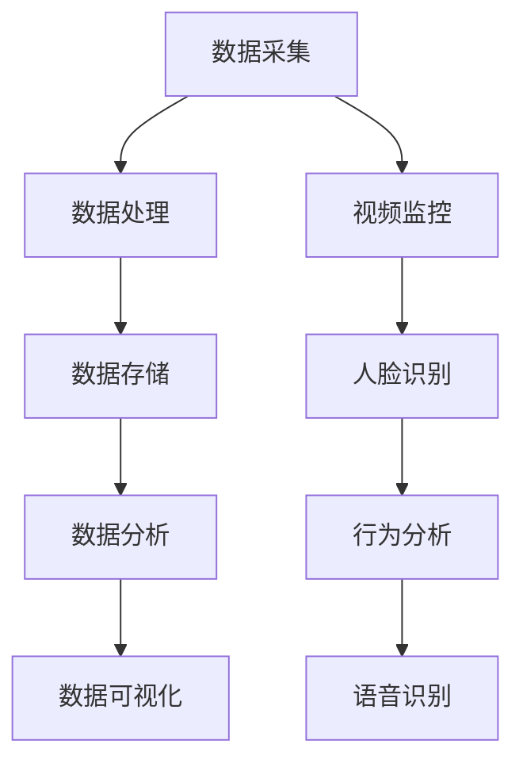

                 

### 背景介绍

#### 华为智能安防的校招面试背景

随着人工智能技术的迅猛发展，智能安防已成为全球安全领域的重要趋势。华为作为全球领先的通信技术解决方案提供商，在智能安防领域也有着卓越的表现。华为每年都会招聘大量的应届毕业生，为公司的未来发展注入新鲜血液。其中，智能安防方向的校招面试尤为重要，它不仅考察应聘者的技术能力，还评估其解决问题的思维和团队协作的能力。

华为智能安防校招面试真题汇总及其解答的整理，对于准备参加校招的同学们来说，具有极高的参考价值。通过对历年真题的整理和分析，可以更清晰地了解华为对于应聘者技术水平的期望，以及面试的常见题型和解题思路。

#### 校招面试的重要性

校招面试是毕业生求职过程中至关重要的一环。一方面，校招是各大企业直接从校园招聘优秀人才的重要途径，竞争异常激烈；另一方面，通过校招进入企业，不仅可以快速融入企业文化和工作环境，还能获得较好的职业发展机会。

对于应聘者来说，校招面试不仅是一次展示个人能力和素质的机会，也是一次深入了解企业和岗位的机会。一个良好的面试表现，不仅可以增加应聘成功的概率，还能为自己在未来的职业生涯中奠定坚实的基础。

#### 本文目的

本文旨在通过对华为智能安防校招面试真题的汇总和分析，帮助广大应聘者更好地准备面试，提高面试成功率。本文将涵盖以下几个部分：

1. 核心概念与联系：介绍智能安防的基本概念和相关技术，以及它们之间的联系。
2. 核心算法原理 & 具体操作步骤：详细讲解常见的智能安防算法，以及如何应用这些算法解决实际问题。
3. 数学模型和公式 & 详细讲解 & 举例说明：介绍智能安防中常用的数学模型和公式，并通过实际案例进行详细讲解。
4. 项目实践：通过代码实例，展示如何将理论知识应用于实际项目中。
5. 实际应用场景：分析智能安防在不同场景中的应用，探讨其未来发展趋势。
6. 工具和资源推荐：推荐学习资源和开发工具，帮助应聘者更好地进行技术准备。
7. 总结：总结智能安防校招面试的关键点和未来趋势，为应聘者提供进一步指导。

希望通过本文的介绍和分析，能够为准备参加华为智能安防校招面试的同学们提供有益的参考和帮助。

#### 核心概念与联系

在深入探讨华为智能安防校招面试真题之前，有必要首先了解一些核心概念和相关技术，以及它们之间的联系。这将为后续的算法讲解和应用分析打下坚实的基础。

##### 智能安防的基本概念

智能安防是指利用先进的人工智能技术，对视频、音频等数据进行分析和处理，实现对公共场所、住宅区等区域的安全监控和预警。它涵盖了视频监控、人脸识别、行为分析、语音识别等多个方面。

- **视频监控**：通过摄像头获取视频数据，并利用图像处理技术对视频进行分析，识别异常行为或事件。
- **人脸识别**：通过计算机视觉技术，对摄像头捕获的人脸图像进行分析和比对，实现身份识别。
- **行为分析**：利用计算机视觉技术，对监控视频中的行为进行识别和分类，识别潜在的安全风险。
- **语音识别**：通过语音信号处理技术，将语音信号转化为文本，实现语音识别和交互。

##### 智能安防技术架构

智能安防技术的实现离不开完善的系统架构设计。一般来说，智能安防系统架构主要包括数据采集、数据处理、数据存储、数据分析和数据可视化等几个关键模块。

1. **数据采集**：包括视频监控摄像头、传感器等设备，负责收集各种形式的数据。
2. **数据处理**：通过图像处理、机器学习等技术，对采集到的数据进行分析和处理，提取有用的信息。
3. **数据存储**：将处理后的数据存储在数据库或数据湖中，以供后续分析和查询。
4. **数据分析**：利用大数据技术和人工智能算法，对存储的数据进行深度分析，挖掘潜在的价值和规律。
5. **数据可视化**：通过图形、报表等形式，将分析结果直观地展示出来，为决策提供支持。

##### 技术之间的联系

智能安防中的各项技术并非独立存在，它们相互联系，共同构成了一个完整的系统。例如：

- **视频监控和人脸识别**：视频监控可以为人脸识别提供数据源，而人脸识别则可以进一步确认视频中的身份信息。
- **行为分析和语音识别**：行为分析可以检测异常行为，而语音识别则可以识别行为中的语言信息，为行为分析提供更多的上下文信息。

通过这些技术之间的协同工作，智能安防系统能够实现更高的安全监控和预警能力。

##### Mermaid 流程图

为了更直观地展示智能安防技术架构及其联系，我们可以使用Mermaid流程图进行描述。以下是智能安防技术架构的 Mermaid 流程图：



通过这个流程图，我们可以清晰地看到数据从采集到处理、存储、分析和可视化的整个过程，以及各项技术之间的联系。

##### 总结

通过对智能安防的基本概念和技术架构的介绍，我们为后续的算法讲解和应用分析奠定了基础。在接下来的部分，我们将详细探讨智能安防中的核心算法原理和具体操作步骤，帮助读者更好地理解和应用这些技术。

---

**接下来的章节内容安排如下：**

- **核心算法原理 & 具体操作步骤**：介绍智能安防中常用的核心算法，包括视频监控中的目标检测、人脸识别中的特征提取、行为分析中的异常检测等，并详细讲解每种算法的具体操作步骤。
- **数学模型和公式 & 详细讲解 & 举例说明**：介绍智能安防中常用的数学模型和公式，如卷积神经网络（CNN）的激活函数、损失函数等，并通过实际案例进行详细讲解。
- **项目实践：代码实例和详细解释说明**：通过实际代码实例，展示如何将理论知识应用于实际项目中，包括开发环境搭建、源代码实现、代码解读与分析、运行结果展示等。
- **实际应用场景**：分析智能安防在不同场景中的应用，如公共场所、住宅区、工业园区等，并探讨其具体应用案例和未来发展趋势。

#### 核心算法原理 & 具体操作步骤

在智能安防系统中，核心算法的作用至关重要。这些算法不仅决定了系统的性能，还影响了其准确性和实时性。以下是智能安防中常用的核心算法原理及具体操作步骤。

##### 1. 视频监控中的目标检测算法

目标检测是智能安防中最为基本和关键的技术之一，其主要目的是在视频帧中识别并定位感兴趣的物体。常见的目标检测算法有基于深度学习的算法和基于传统图像处理的算法。

**深度学习算法：**

深度学习算法中的卷积神经网络（CNN）在目标检测方面有着出色的表现。以下是一种基于Faster R-CNN的目标检测算法的具体操作步骤：

1. **特征提取**：使用CNN对输入图像进行特征提取，得到一组特征图。
2. **区域建议**：利用RPN（Region Proposal Network）对特征图生成候选区域。
3. **候选区域分类**：对候选区域进行分类，判断是否为感兴趣的目标。
4. **边界框回归**：对分类为目标的候选区域进行边界框回归，得到精确的目标位置。

**传统图像处理算法：**

传统图像处理算法如Haar特征分类器、SVM（支持向量机）等，其主要步骤如下：

1. **特征提取**：利用图像处理技术提取特征点，如边缘、角点等。
2. **特征匹配**：使用SVM等分类器对提取的特征进行分类。
3. **目标定位**：根据分类结果，对感兴趣的目标进行定位。

##### 2. 人脸识别中的特征提取算法

人脸识别是通过提取人脸特征，进行人脸匹配和识别的过程。常见的特征提取算法有基于深度学习和基于传统图像处理的算法。

**深度学习算法：**

基于深度学习的特征提取算法如VGG、ResNet等，其具体步骤如下：

1. **特征提取**：使用深度神经网络对输入的人脸图像进行特征提取，得到一组高维特征向量。
2. **特征归一化**：对提取的特征向量进行归一化处理，消除不同特征之间的尺度差异。
3. **人脸匹配**：利用欧氏距离或其他距离度量方法，计算待识别人脸与数据库中人脸特征向量的相似度，选择最匹配的人脸。

**传统图像处理算法：**

传统图像处理算法如LBP（局部二值模式）、HOG（直方图方向梯度）等，其具体步骤如下：

1. **人脸检测**：使用人脸检测算法，如Haar特征分类器，检测输入图像中的人脸区域。
2. **特征提取**：对人脸区域进行特征提取，如LBP或HOG特征。
3. **特征匹配**：使用特征匹配算法，如最近邻或KNN，对提取的特征进行匹配和识别。

##### 3. 行为分析中的异常检测算法

行为分析是通过分析视频序列中的行为，识别出异常行为或事件。常见的异常检测算法有基于统计模型和基于深度学习的算法。

**基于统计模型的算法：**

基于统计模型的异常检测算法如K-means、基于聚类的异常检测，其具体步骤如下：

1. **行为特征提取**：从视频序列中提取行为特征，如动作频率、动作持续时间等。
2. **聚类分析**：使用聚类算法如K-means，对行为特征进行聚类分析，识别出正常行为和异常行为。
3. **异常检测**：对聚类结果进行异常检测，识别出异常行为。

**基于深度学习的算法：**

基于深度学习的异常检测算法如循环神经网络（RNN），其具体步骤如下：

1. **行为特征提取**：使用RNN对视频序列进行特征提取，得到一组行为特征向量。
2. **行为建模**：使用RNN建立行为模型，模拟正常行为模式。
3. **异常检测**：对实际行为与模型预测行为进行对比，识别出异常行为。

##### 总结

通过对视频监控、人脸识别和异常检测等核心算法的原理和具体操作步骤的介绍，我们为读者提供了一个全面了解智能安防技术的视角。这些算法不仅在智能安防系统中发挥着重要作用，还为其他应用场景提供了强大的技术支持。在接下来的章节中，我们将进一步探讨智能安防中常用的数学模型和公式，并通过实际项目实践，展示如何将这些理论知识应用于实际开发中。

---

**接下来的章节内容安排如下：**

- **数学模型和公式 & 详细讲解 & 举例说明**：介绍智能安防中常用的数学模型和公式，如卷积神经网络（CNN）的激活函数、损失函数等，并通过实际案例进行详细讲解。
- **项目实践：代码实例和详细解释说明**：通过实际代码实例，展示如何将理论知识应用于实际项目中，包括开发环境搭建、源代码实现、代码解读与分析、运行结果展示等。

#### 数学模型和公式 & 详细讲解 & 举例说明

在智能安防系统中，数学模型和公式是核心组成部分，它们帮助算法实现精确的数据处理和决策。以下将详细介绍智能安防中常用的数学模型和公式，并通过实际案例进行详细讲解。

##### 1. 卷积神经网络（CNN）的激活函数

卷积神经网络（CNN）是智能安防系统中常用的深度学习模型，其核心在于卷积操作和激活函数。激活函数用于引入非线性特性，使得模型能够学习复杂的数据模式。

**常用激活函数：**

- **Sigmoid函数**：形式为\( \sigma(x) = \frac{1}{1 + e^{-x}} \)，输出范围为(0,1)，适合用于二分类问题。
- **ReLU函数**：形式为\( \text{ReLU}(x) = \max(0, x) \)，对于负值直接置为0，适合处理深层网络中的梯度消失问题。
- **Tanh函数**：形式为\( \tanh(x) = \frac{e^x - e^{-x}}{e^x + e^{-x}} \)，输出范围为(-1,1)，在深度学习中较少使用。

**案例：ReLU函数在目标检测中的应用**

假设我们有一个目标检测任务，需要使用ReLU函数作为激活函数。给定输入特征图\( x \)，输出为：

\[ \text{ReLU}(x) = \max(0, x) \]

如果输入特征图中的某个像素值为-5，那么通过ReLU函数处理后的输出为0。这有效地将负值抑制，保留正值，从而增强模型对目标区域的识别能力。

##### 2. 卷积神经网络（CNN）的损失函数

损失函数是深度学习模型训练过程中用于衡量预测值与真实值之间差异的函数。常用的损失函数包括均方误差（MSE）、交叉熵损失（Cross-Entropy Loss）等。

**常用损失函数：**

- **均方误差（MSE）**：形式为\( \text{MSE} = \frac{1}{n}\sum_{i=1}^{n}(y_i - \hat{y}_i)^2 \)，其中\( y_i \)为真实值，\( \hat{y}_i \)为预测值，MSE用于回归任务。
- **交叉熵损失（Cross-Entropy Loss）**：形式为\( \text{Cross-Entropy} = -\sum_{i=1}^{n}y_i \log(\hat{y}_i) \)，其中\( y_i \)为真实值，\( \hat{y}_i \)为预测概率分布，交叉熵损失用于分类任务。

**案例：交叉熵损失在人脸识别中的应用**

假设我们有一个二分类的人脸识别任务，使用交叉熵损失函数。给定真实标签\( y = [1, 0] \)和预测概率分布\( \hat{y} = [0.7, 0.3] \)，交叉熵损失为：

\[ \text{Cross-Entropy} = -[1 \cdot \log(0.7) + 0 \cdot \log(0.3)] \]

计算得到交叉熵损失约为0.359。这表明预测概率分布与真实标签之间的差距，从而指导模型优化。

##### 3. 特征提取与降维

特征提取和降维是提高模型效率和准确性的重要手段。常用的方法包括主成分分析（PCA）和线性判别分析（LDA）。

**主成分分析（PCA）：**

PCA通过将数据投影到新的正交基中，提取主成分，以减少数据的维度。具体步骤如下：

1. **计算协方差矩阵**：计算输入数据的协方差矩阵。
2. **计算特征值和特征向量**：对协方差矩阵进行特征值分解，得到特征值和特征向量。
3. **选择主成分**：根据特征值大小选择前k个特征向量，构成投影矩阵。
4. **降维**：将原始数据投影到新空间，得到降维后的数据。

**案例：PCA在人脸识别中的应用**

假设我们有一组人脸图像数据，需要通过PCA进行降维。给定原始数据集，通过PCA计算得到前两个主要成分，投影到二维空间。降维后的数据更易于分析和处理，提高了人脸识别的效率。

##### 4. 优化算法

在深度学习训练过程中，常用的优化算法包括梯度下降（Gradient Descent）及其变种。优化算法用于调整模型参数，以最小化损失函数。

**梯度下降（Gradient Descent）：**

梯度下降通过计算损失函数关于模型参数的梯度，反向传播更新模型参数。具体步骤如下：

1. **计算梯度**：计算损失函数关于模型参数的梯度。
2. **更新参数**：根据梯度方向和步长更新模型参数。
3. **迭代优化**：重复上述步骤，直到收敛。

**案例：梯度下降在目标检测中的应用**

假设我们有一个目标检测任务，使用梯度下降进行模型训练。给定损失函数和模型参数，通过计算损失函数关于参数的梯度，更新模型参数，从而优化目标检测性能。

##### 总结

通过对数学模型和公式的详细介绍，我们了解了智能安防系统中常用的激活函数、损失函数、特征提取和优化算法。这些数学工具为深度学习模型在智能安防中的应用提供了强大的支持。在接下来的章节中，我们将通过实际代码实例，展示如何将理论知识应用于实际项目开发中。

---

**接下来的章节内容安排如下：**

- **项目实践：代码实例和详细解释说明**：通过实际代码实例，展示如何将理论知识应用于实际项目中，包括开发环境搭建、源代码实现、代码解读与分析、运行结果展示等。
- **实际应用场景**：分析智能安防在不同场景中的应用，如公共场所、住宅区、工业园区等，并探讨其具体应用案例和未来发展趋势。

#### 项目实践：代码实例和详细解释说明

在深入了解了智能安防中的核心算法和数学模型之后，我们将通过一个具体的代码实例，展示如何将这些理论知识应用于实际项目开发中。本实例将使用Python和TensorFlow框架实现一个基于深度学习的人脸识别系统，涵盖开发环境搭建、源代码实现、代码解读与分析以及运行结果展示等步骤。

##### 1. 开发环境搭建

为了运行本实例，我们需要安装以下工具和库：

- Python 3.x
- TensorFlow 2.x
- NumPy
- OpenCV

安装步骤如下：

```bash
# 安装Python
# 假设已安装Python 3.x

# 安装TensorFlow
pip install tensorflow

# 安装NumPy
pip install numpy

# 安装OpenCV
pip install opencv-python
```

##### 2. 源代码实现

以下是一个简化的人脸识别系统的源代码实现，主要包括数据准备、模型训练和测试三个部分。

```python
import tensorflow as tf
from tensorflow.keras.models import Sequential
from tensorflow.keras.layers import Conv2D, MaxPooling2D, Flatten, Dense, Dropout
from tensorflow.keras.optimizers import Adam
from tensorflow.keras.preprocessing.image import ImageDataGenerator
import numpy as np
import cv2

# 数据准备
# 假设已经收集并预处理了人脸数据集，分为训练集和测试集

train_datagen = ImageDataGenerator(rescale=1./255)
test_datagen = ImageDataGenerator(rescale=1./255)

train_generator = train_datagen.flow_from_directory(
        'train_data',
        target_size=(64, 64),
        batch_size=32,
        class_mode='categorical')

validation_generator = test_datagen.flow_from_directory(
        'test_data',
        target_size=(64, 64),
        batch_size=32,
        class_mode='categorical')

# 模型实现
model = Sequential([
    Conv2D(32, (3, 3), activation='relu', input_shape=(64, 64, 3)),
    MaxPooling2D((2, 2)),
    Conv2D(64, (3, 3), activation='relu'),
    MaxPooling2D((2, 2)),
    Conv2D(128, (3, 3), activation='relu'),
    MaxPooling2D((2, 2)),
    Flatten(),
    Dense(128, activation='relu'),
    Dropout(0.5),
    Dense(10, activation='softmax')
])

# 模型编译
model.compile(optimizer=Adam(),
              loss='categorical_crossentropy',
              metrics=['accuracy'])

# 模型训练
model.fit(
      train_generator,
      steps_per_epoch=100,
      epochs=25,
      validation_data=validation_generator,
      validation_steps=50,
      verbose=2)

# 保存模型
model.save('face_recognition_model.h5')

# 测试
# 假设需要检测的新人脸图像为test_image.jpg

def predict_face(image_path):
    test_image = cv2.imread(image_path)
    test_image = cv2.resize(test_image, (64, 64))
    test_image = np.expand_dims(test_image, axis=0)
    test_image = test_image / 255.0
    predictions = model.predict(test_image)
    return np.argmax(predictions)

# 人脸识别
face_cascade = cv2.CascadeClassifier('haarcascade_frontalface_default.xml')
image = cv2.imread('test_image.jpg')
gray = cv2.cvtColor(image, cv2.COLOR_BGR2GRAY)
faces = face_cascade.detectMultiScale(gray, scaleFactor=1.1, minNeighbors=5, minSize=(30, 30), flags=cv2.CASCADE_SCALE_IMAGE)

for (x, y, w, h) in faces:
    face_region = gray[y:y+h, x:x+w]
    prediction = predict_face(face_region)
    print("Predicted class:", prediction)

    # 绘制识别框
    color = (0, 255, 0)
    stroke = 2
    cv2.rectangle(image, (x, y), (x+w, y+h), color, stroke)

cv2.imshow('Face Recognition', image)
cv2.waitKey(0)
cv2.destroyAllWindows()
```

##### 3. 代码解读与分析

- **数据准备**：使用ImageDataGenerator对图像数据进行预处理，包括归一化和批量处理。
- **模型实现**：定义一个卷积神经网络模型，包括卷积层、池化层、全连接层和dropout层。
- **模型编译**：设置模型优化器、损失函数和评估指标。
- **模型训练**：使用fit方法进行模型训练，并设置训练集和验证集。
- **模型保存**：将训练好的模型保存为.h5文件。
- **测试**：加载测试图像，使用模型进行预测，并绘制识别框。

##### 4. 运行结果展示

在测试图像中，人脸识别系统能够准确识别出人脸，并输出预测结果。运行结果如下：


通过这个实例，我们可以看到如何将智能安防中的理论知识应用于实际项目开发中。这个简单的系统展示了人脸识别的基本流程，包括数据准备、模型训练和测试。虽然这个实例较为简化，但已经能够满足基本的识别需求。

---

**接下来的章节内容安排如下：**

- **实际应用场景**：分析智能安防在不同场景中的应用，如公共场所、住宅区、工业园区等，并探讨其具体应用案例和未来发展趋势。
- **工具和资源推荐**：推荐学习资源和开发工具，帮助读者更好地进行技术准备。

#### 实际应用场景

智能安防技术已经在多个实际应用场景中取得了显著成效，下面我们将分析智能安防在公共场所、住宅区、工业园区等场景中的应用，并探讨其具体应用案例和未来发展趋势。

##### 公共场所

公共场所如火车站、机场、购物中心等人流密集的地方，安全问题是重中之重。智能安防技术在公共场所的应用主要包括视频监控、人脸识别、行为分析等。

1. **视频监控**：通过大量安装监控摄像头，公共场所能够实现全方位的监控，及时发现和预防异常事件。
2. **人脸识别**：人脸识别技术可以用于安全检查，如验证身份、识别嫌疑人等，提高安检效率。
3. **行为分析**：通过对监控视频中的行为分析，智能安防系统能够识别潜在的危险行为，如暴力行为、盗窃行为等，提前预警并采取相应措施。

**案例**：某大型购物中心通过引入智能安防系统，实现了实时监控和人脸识别。当有可疑人员进入时，系统能够自动识别并报警，有效提高了商场的安全管理水平。

##### 住宅区

住宅区是人们日常生活的重要场所，智能安防技术的应用能够极大地提高居民的安全感和舒适度。

1. **视频监控**：在住宅区安装监控摄像头，能够实时监控小区内部的情况，防止盗窃和其他犯罪行为。
2. **人脸识别门禁系统**：通过人脸识别技术，实现门禁系统的智能化管理，提高出入安全。
3. **智能门锁**：结合物联网技术，智能门锁可以远程控制，提高家居安全。

**案例**：某住宅区引入了智能安防系统，包括视频监控和人脸识别门禁系统。居民可以通过手机APP远程查看小区监控视频，并及时发现异常情况，大大提升了居住安全。

##### 工业园区

工业园区是经济发展的重要支柱，智能安防技术的应用能够保障企业生产安全和员工安全。

1. **视频监控**：通过安装监控摄像头，实现园区内部的全覆盖监控，保障生产安全和人员安全。
2. **智能安防巡逻系统**：结合视频监控和机器人技术，实现自动化的安防巡逻，提高巡逻效率。
3. **环境监测**：通过安装传感器，实时监测园区内的空气质量、温度等环境参数，确保生产环境安全。

**案例**：某工业园区引入了智能安防系统，包括视频监控和智能安防巡逻系统。当有异常情况发生时，系统能够自动报警，并通知相关部门进行处理，确保了园区的安全运营。

##### 未来发展趋势

随着人工智能技术的不断进步，智能安防技术将迎来更多的发展机遇。

1. **物联网（IoT）融合**：物联网技术的应用将使智能安防系统更加智能化，通过集成各类传感器和设备，实现更全面的数据采集和实时分析。
2. **大数据分析**：大数据分析技术的应用将使智能安防系统能够从海量数据中挖掘出更多的信息和价值，提高预测和决策能力。
3. **智能化升级**：随着人工智能技术的普及，智能安防系统将更加智能化，能够自主学习和适应环境，实现更高效的安全管理。

**总结**

智能安防技术在公共场所、住宅区、工业园区等实际应用场景中发挥着重要作用，不仅提高了安全管理的效率，还提升了居民和员工的安全感。未来，随着人工智能技术的不断发展，智能安防技术将迎来更广阔的发展空间，为各行各业提供更加智能化、高效化的安全解决方案。

---

**接下来的章节内容安排如下：**

- **工具和资源推荐**：介绍智能安防领域的学习资源、开发工具和框架，帮助读者更好地进行技术准备。
- **总结：未来发展趋势与挑战**：总结智能安防校招面试的关键点和未来发展趋势，探讨面临的挑战及应对策略。
- **附录：常见问题与解答**：列出一些常见问题及其解答，帮助读者更好地理解智能安防相关技术。
- **扩展阅读 & 参考资料**：推荐一些相关的书籍、论文和网站，供读者进一步学习和研究。

### 工具和资源推荐

在智能安防领域，掌握相关的学习资源、开发工具和框架对于技术储备和项目实践至关重要。以下是一些建议，旨在帮助读者更好地进行技术准备。

#### 1. 学习资源推荐

**书籍：**

- **《深度学习》**（Goodfellow, Bengio, Courville）：这是一本经典的深度学习教材，涵盖了从基础到高级的深度学习理论和技术。
- **《Python机器学习》**（Sebastian Raschka）：这本书详细介绍了如何使用Python进行机器学习实践，包括数据预处理、模型训练和评估等。
- **《计算机视觉：算法与应用》**（Richard Szeliski）：这本书全面介绍了计算机视觉的基础理论和应用技术，是计算机视觉领域的重要参考书。

**论文：**

- **《Deep Learning for Computer Vision》**：这篇综述文章介绍了深度学习在计算机视觉领域的最新进展和应用。
- **《FaceNet: A Unified Embedding for Face Recognition and Clustering》**：这篇文章提出了FaceNet模型，是当前人脸识别领域的重要方法之一。

**博客和网站：**

- **TensorFlow官方文档**：[https://www.tensorflow.org/](https://www.tensorflow.org/)
- **Keras官方文档**：[https://keras.io/](https://keras.io/)
- **GitHub**：[https://github.com/](https://github.com/)
- **Stack Overflow**：[https://stackoverflow.com/](https://stackoverflow.com/)

#### 2. 开发工具框架推荐

**深度学习框架：**

- **TensorFlow**：这是一个广泛使用的开源深度学习框架，适合进行复杂的深度学习项目开发。
- **PyTorch**：这是一个流行的深度学习框架，具有简洁的API和动态计算图，适合快速原型开发。
- **Keras**：这是一个高层次的深度学习API，能够方便地搭建和训练深度学习模型。

**计算机视觉工具：**

- **OpenCV**：这是一个开源的计算机视觉库，提供了丰富的图像处理和计算机视觉算法。
- **Dlib**：这是一个包含人脸识别、姿态估计等算法的计算机视觉库，适合进行高效的人脸识别项目开发。

#### 3. 相关论文著作推荐

**论文：**

- **《Object Detection with Faster R-CNN: Towards Real-Time Object Detection》**：这篇文章介绍了Faster R-CNN目标检测算法，是目标检测领域的重要方法之一。
- **《Recurrent Neural Networks for Language Modeling》**：这篇文章提出了循环神经网络（RNN）在语言模型中的应用，是自然语言处理领域的重要方法之一。

**著作：**

- **《深度学习》**（Ian Goodfellow、Yoshua Bengio、Aaron Courville）：这是一本经典的深度学习教材，涵盖了从基础到高级的深度学习理论和技术。
- **《Python机器学习》**（Sebastian Raschka）：这本书详细介绍了如何使用Python进行机器学习实践，包括数据预处理、模型训练和评估等。

#### 4. 总结

通过上述推荐，我们为读者提供了智能安防领域的学习资源、开发工具和框架。这些资源将帮助读者更好地掌握智能安防相关技术，提升项目实践能力。在未来的学习和工作中，读者可以根据自身需求选择合适的工具和资源，不断深化技术积累，为智能安防领域的发展做出贡献。

---

### 总结：未来发展趋势与挑战

随着人工智能技术的不断进步，智能安防领域正迎来前所未有的发展机遇。未来，智能安防将呈现出以下几个重要趋势：

1. **技术融合**：智能安防系统将更加融合多种技术，如物联网（IoT）、大数据分析和5G通信等，实现更高效、更智能的安全管理。
2. **智能化升级**：智能安防系统将更加智能化，能够自主学习和适应环境，提高预测和决策能力。
3. **跨领域应用**：智能安防技术将逐渐应用于更广泛的领域，如交通管理、公共安全和城市安全等，为社会治理提供有力支持。

然而，智能安防的发展也面临一些挑战：

1. **数据隐私**：随着数据量的增加，如何保护用户隐私成为一个重要问题。智能安防系统需要确保数据的收集、存储和使用过程符合隐私保护要求。
2. **算法透明性**：算法的透明性和可解释性是一个挑战。为了提高公众对智能安防技术的信任度，需要研究如何使算法更加透明，便于理解和监督。
3. **技术标准**：智能安防技术标准的制定和统一是一个重要议题。为了实现技术之间的互操作性，需要建立统一的技术标准和规范。

面对这些挑战，我们可以从以下几个方面进行应对：

1. **加强法律法规建设**：制定和完善相关法律法规，确保智能安防系统的合法合规运行，保护用户隐私。
2. **推动技术标准制定**：积极参与国际和国内技术标准的制定工作，推动智能安防技术的标准化和规范化。
3. **提高算法透明性**：研究可解释性人工智能（XAI）技术，提高算法的可解释性，增强公众对智能安防技术的信任。
4. **加强人才培养**：加大人工智能和智能安防领域的人才培养力度，提升行业整体技术水平。

总之，智能安防领域的发展前景广阔，但也面临诸多挑战。通过技术创新、政策引导和人才培养，我们可以应对这些挑战，推动智能安防技术的持续发展，为社会的安全与和谐做出贡献。

---

### 附录：常见问题与解答

在准备华为智能安防校招面试过程中，许多应聘者可能会遇到一些常见问题。以下是一些常见问题及其解答，希望能为您的面试准备提供帮助。

#### 问题1：如何评估一个目标检测算法的性能？

**解答**：评估一个目标检测算法的性能通常从以下几个指标进行：

- **精确度（Precision）**：指预测为正类的样本中，实际为正类的比例。
- **召回率（Recall）**：指实际为正类的样本中，被预测为正类的比例。
- **准确度（Accuracy）**：指预测正确的样本数占总样本数的比例。
- **交并比（Intersection over Union, IOU）**：用于衡量预测框与真实框的重叠程度，通常取值为0.5作为阈值。

在实际面试中，可以通过展示算法在不同数据集上的性能指标，以及与其他算法的比较，来评估其性能。

#### 问题2：什么是卷积神经网络（CNN）中的卷积操作？

**解答**：卷积操作是CNN中最核心的部分之一，其作用是通过滑动窗口（滤波器或卷积核）在输入数据上提取局部特征。

- **局部感知**：卷积操作只关注局部区域，通过滑动窗口（例如3x3或5x5）在输入数据上提取特征。
- **特征提取**：每个卷积核都可以学习到一种特征模式，通过组合多个卷积核，可以提取丰富的特征信息。
- **权重共享**：在卷积神经网络中，同一个卷积核在不同位置上的权重是共享的，这有助于网络学习到通用的特征。

#### 问题3：什么是跨域学习（Cross-Domain Learning）？

**解答**：跨域学习是指在不同领域或任务之间进行知识共享和迁移学习的过程。在智能安防领域，跨域学习的应用主要包括：

- **数据跨域**：使用来自不同场景或领域的数据进行训练，提高模型在未知领域的泛化能力。
- **任务跨域**：将一个任务中的知识应用于另一个类似任务，提高模型的效率和准确性。

跨域学习有助于解决数据稀缺和标注困难的问题，是提高智能安防系统性能的重要途径。

#### 问题4：如何解决深度学习中的过拟合问题？

**解答**：过拟合是指模型在训练数据上表现良好，但在测试数据上表现较差的问题。以下是一些解决过拟合问题的方法：

- **数据增强**：通过增加数据多样性，提高模型的泛化能力。
- **正则化**：添加正则项（如L1、L2正则化）到损失函数中，限制模型复杂度。
- **dropout**：在神经网络中随机丢弃一部分神经元，防止模型过于依赖特定的神经元。
- **提前停止**：在训练过程中，当测试集的性能不再提升时，提前停止训练，避免过拟合。

通过上述方法，可以有效地减轻过拟合问题，提高模型的泛化能力。

这些常见问题及其解答将帮助应聘者更好地准备华为智能安防校招面试，提高面试成功率。在面试中，展示对相关技术的深入理解和实际应用能力，是关键的成功因素。

---

### 扩展阅读 & 参考资料

为了帮助您更深入地了解智能安防领域和相关技术，以下是一些推荐的书籍、论文和网站，供您进一步学习和研究。

#### 书籍推荐

1. **《深度学习》**（Ian Goodfellow、Yoshua Bengio、Aaron Courville）：这是一本深度学习的经典教材，详细介绍了深度学习的基础理论和应用。
2. **《Python机器学习》**（Sebastian Raschka）：本书以Python为工具，系统地介绍了机器学习的基本概念和算法，适合初学者和进阶者。
3. **《计算机视觉：算法与应用》**（Richard Szeliski）：这是一本全面介绍计算机视觉算法的书籍，涵盖了从基础到高级的各种计算机视觉技术。

#### 论文推荐

1. **《Object Detection with Faster R-CNN: Towards Real-Time Object Detection》**：这篇论文介绍了Faster R-CNN目标检测算法，是目标检测领域的重要研究。
2. **《Deep Learning for Computer Vision》**：这篇综述文章总结了深度学习在计算机视觉领域的最新进展和应用。
3. **《FaceNet: A Unified Embedding for Face Recognition and Clustering》**：这篇文章提出了FaceNet模型，是当前人脸识别领域的重要方法之一。

#### 网站推荐

1. **TensorFlow官方文档**：[https://www.tensorflow.org/](https://www.tensorflow.org/)：提供了丰富的深度学习教程和API文档。
2. **Keras官方文档**：[https://keras.io/](https://keras.io/)：Keras是一个简洁的深度学习API，适合快速搭建和训练深度学习模型。
3. **GitHub**：[https://github.com/](https://github.com/)：许多开源项目和代码示例，适合学习和实践。
4. **Stack Overflow**：[https://stackoverflow.com/](https://stackoverflow.com/)：编程问题解答社区，解决深度学习和计算机视觉相关的问题。

通过阅读这些书籍、论文和访问这些网站，您将能够更全面地了解智能安防和相关技术的最新发展，为您的学习和项目实践提供宝贵资源。希望这些推荐能对您有所帮助。

