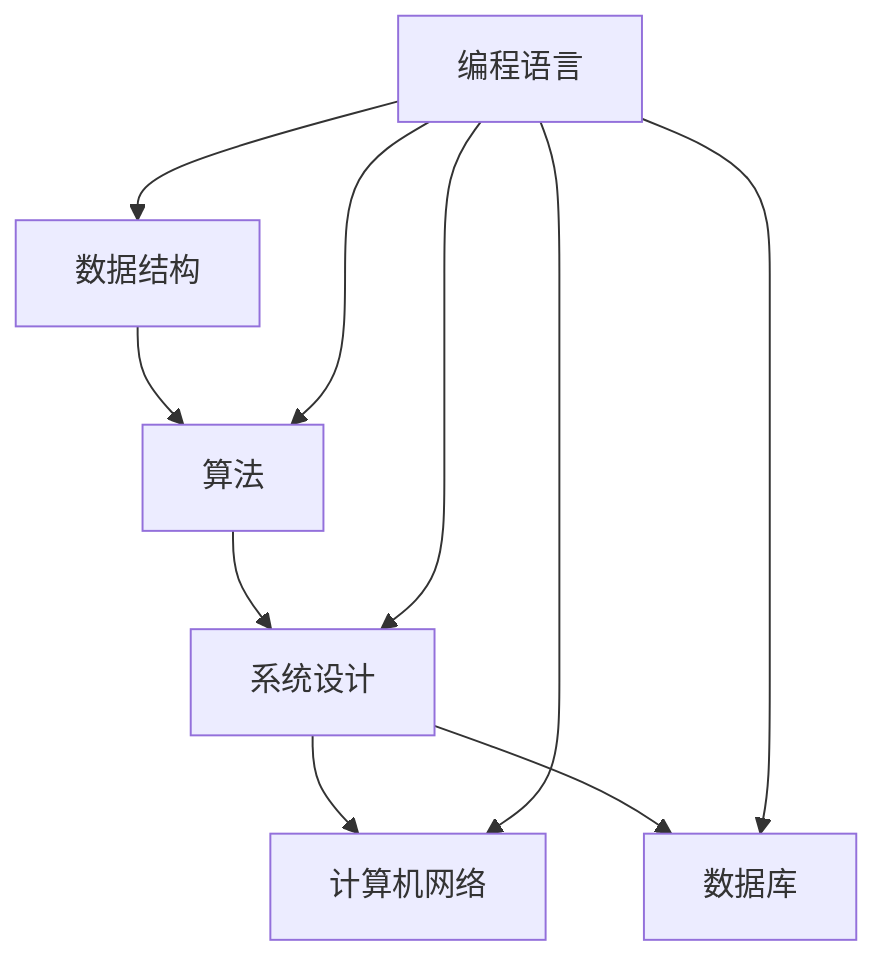

                 

### 背景介绍 Background

《2025华为校招编程面试题精选与解答》旨在为广大计算机科学专业的学生以及求职者提供一个全面、系统的编程面试备考资料。随着信息技术的飞速发展，华为作为全球领先的ICT解决方案提供商，其在全球范围内对高素质技术人才的需求不断增加。华为校招编程面试题目既考察了应聘者的基础知识，也注重考察应聘者的实际编程能力、逻辑思维和问题解决能力。

本文将围绕华为校招编程面试题的常见题型和难点进行详细剖析，通过具体实例讲解，帮助读者掌握解题思路和方法，提高编程面试的应对能力。文章内容将分为以下几个部分：

1. **核心概念与联系**：介绍华为编程面试中涉及的核心概念，并通过Mermaid流程图展示相关概念之间的联系。
2. **核心算法原理与操作步骤**：深入解析编程面试中常见的算法题目，详细描述解题步骤和思路。
3. **数学模型与公式**：讲解与编程面试相关的数学模型和公式，并提供实例说明。
4. **项目实践**：通过实际代码实例，展示如何解决华为编程面试中的具体问题。
5. **实际应用场景**：分析华为编程面试题在实际开发中的应用场景。
6. **工具和资源推荐**：推荐学习资源和开发工具，帮助读者深入学习和实践。
7. **总结与未来发展趋势**：总结文章内容，探讨未来编程面试的发展趋势和挑战。

通过本文的详细解析和实例讲解，读者将能够系统地掌握华为编程面试的核心知识点和解题技巧，为即将到来的校招编程面试做好充分准备。

### 核心概念与联系 Core Concepts and Connections

在华为校招编程面试中，常见的一些核心概念包括数据结构、算法、系统设计、计算机网络、数据库等。这些概念构成了面试题的基础，同时也是解决复杂问题的核心工具。为了更好地理解这些概念，我们可以通过一个Mermaid流程图来展示它们之间的关系。



**数据结构**：数据结构是计算机存储数据的方式，主要包括数组、链表、栈、队列、树、图等。它们在算法设计和实现中起着至关重要的作用，因为合适的结构能够极大地提高算法的效率和可维护性。

**算法**：算法是一系列解决问题的步骤。在面试中，常见的算法题目包括排序、查找、动态规划、贪心算法、分治算法等。这些算法不仅是解决特定问题的有效方法，也是理解计算机科学基础的关键。

**系统设计**：系统设计涉及系统的整体架构和模块化设计。它包括服务设计、接口设计、数据流向等。系统设计的题目往往要求应聘者能够设计出高效、可扩展的系统解决方案。

**计算机网络**：计算机网络是互联网的基础，它涉及网络协议、数据传输、网络安全等方面。在面试中，可能会考察TCP/IP模型、HTTP协议等基础知识。

**数据库**：数据库是存储和管理数据的系统。常见的数据库有SQL数据库（如MySQL、PostgreSQL）和NoSQL数据库（如MongoDB、Cassandra）。数据库题目的核心是理解如何高效地存储、查询和管理数据。

**编程语言**：编程语言是实现算法和数据结构的基础工具。在面试中，常见的编程语言包括C、C++、Java、Python等。掌握多种编程语言有助于更好地理解和实现复杂算法。

通过上述Mermaid流程图，我们可以清晰地看到各个核心概念之间的联系。数据结构和算法是解决具体问题的工具，系统设计、计算机网络和数据库则是在更大范围内组织和管理数据的框架。而编程语言则是将这些概念转化为可执行代码的媒介。理解这些概念及其关系，对于解决华为编程面试中的问题至关重要。

### 核心算法原理与具体操作步骤 Core Algorithm Principles and Step-by-Step Procedures

在华为校招编程面试中，核心算法的原理和具体操作步骤是考生必须掌握的内容。下面，我们将针对几种常见的算法题目进行详细解析，包括解题思路、操作步骤以及相关的代码实现。

#### 排序算法

排序算法是面试中最常见的算法之一，以下介绍几种常见的排序算法及其操作步骤：

1. **冒泡排序（Bubble Sort）**
   - **原理**：通过多次遍历要排序的数列，比较相邻两个元素，若它们的顺序错误则交换它们的位置。
   - **步骤**：
     1. 从第一个元素开始，比较相邻的元素，若第一个比第二个大，则交换它们。
     2. 对每一对相邻元素做同样的工作，从开始第一对到结尾的最后一对。
     3. 在此循环过程中，最后一个元素会是当前最大的元素。
     4. 重复上面的步骤，直到没有需要交换的元素。
   - **代码实现**（Python）：

```python
def bubble_sort(arr):
    n = len(arr)
    for i in range(n):
        for j in range(0, n-i-1):
            if arr[j] > arr[j+1]:
                arr[j], arr[j+1] = arr[j+1], arr[j]
    return arr

arr = [64, 25, 12, 22, 11]
print("Original array:", arr)
sorted_arr = bubble_sort(arr)
print("Sorted array:", sorted_arr)
```

2. **快速排序（Quick Sort）**
   - **原理**：通过选取一个基准元素，将数列分为两部分，左边元素都比基准小，右边元素都比基准大。
   - **步骤**：
     1. 选择一个基准元素。
     2. 将比基准小的元素放到左边，比基准大的元素放到右边。
     3. 对左边和右边的子序列重复以上步骤。
   - **代码实现**（Python）：

```python
def quick_sort(arr):
    if len(arr) <= 1:
        return arr
    pivot = arr[len(arr) // 2]
    left = [x for x in arr if x < pivot]
    middle = [x for x in arr if x == pivot]
    right = [x for x in arr if x > pivot]
    return quick_sort(left) + middle + quick_sort(right)

arr = [64, 25, 12, 22, 11]
print("Original array:", arr)
sorted_arr = quick_sort(arr)
print("Sorted array:", sorted_arr)
```

#### 查找算法

查找算法是面试中经常出现的题型，以下介绍几种常见的查找算法及其操作步骤：

1. **二分查找（Binary Search）**
   - **原理**：在有序数组中，通过不断地缩小查找范围来找到目标元素。
   - **步骤**：
     1. 确定中间位置，与目标元素比较。
     2. 如果中间位置元素等于目标元素，查找结束。
     3. 如果中间位置元素大于目标元素，则在左半部分继续查找。
     4. 如果中间位置元素小于目标元素，则在右半部分继续查找。
   - **代码实现**（Python）：

```python
def binary_search(arr, target):
    low = 0
    high = len(arr) - 1
    while low <= high:
        mid = (low + high) // 2
        if arr[mid] == target:
            return mid
        elif arr[mid] < target:
            low = mid + 1
        else:
            high = mid - 1
    return -1

arr = [64, 25, 12, 22, 11]
print("Original array:", arr)
index = binary_search(arr, 25)
if index != -1:
    print("Element found at index:", index)
else:
    print("Element not found.")
```

2. **哈希查找（Hashing）**
   - **原理**：通过哈希函数将关键字映射到数组中的一个位置，直接访问该位置的数据。
   - **步骤**：
     1. 计算关键字的哈希值。
     2. 根据哈希值访问数组中的相应位置。
     3. 如果找到元素，查找结束；否则，处理冲突。
   - **代码实现**（Python）：

```python
def hash_function(key, table_size):
    return key % table_size

def linear_probing(hash_table, key):
    index = hash_function(key, len(hash_table))
    while hash_table[index] is not None:
        if hash_table[index] == key:
            return index
        index = (index + 1) % len(hash_table)
    return index

hash_table = [None] * 10
keys = [64, 25, 12, 22, 11]
for key in keys:
    index = linear_probing(hash_table, key)
    hash_table[index] = key

print("Hash table:", hash_table)
index = linear_probing(hash_table, 25)
if index is not None:
    print("Key 25 found at index:", index)
else:
    print("Key 25 not found.")
```

#### 动态规划

动态规划是一种解决最优化问题的算法思想，适合解决具有重叠子问题和最优子结构性质的问题。

1. **最长公共子序列（Longest Common Subsequence, LCS）**
   - **原理**：找到两个序列中最长的公共子序列。
   - **步骤**：
     1. 定义一个二维数组`dp`，其中`dp[i][j]`表示两个序列的前`i`和`j`个元素的最长公共子序列的长度。
     2. 如果当前元素相同，则`dp[i][j] = dp[i-1][j-1] + 1`。
     3. 如果当前元素不同，则`dp[i][j] = max(dp[i-1][j], dp[i][j-1])`。
   - **代码实现**（Python）：

```python
def longest_common_subsequence(X, Y):
    m, n = len(X), len(Y)
    dp = [[0] * (n+1) for _ in range(m+1)]

    for i in range(1, m+1):
        for j in range(1, n+1):
            if X[i-1] == Y[j-1]:
                dp[i][j] = dp[i-1][j-1] + 1
            else:
                dp[i][j] = max(dp[i-1][j], dp[i][j-1])

    return dp[m][n]

X = "AGGTAB"
Y = "GXTXAYB"
print("Length of LCS:", longest_common_subsequence(X, Y))
```

通过以上对常见核心算法原理和具体操作步骤的详细解析，读者可以更好地理解和应对华为校招编程面试中的各种算法题目。这些算法不仅是编程的基础，也是解决复杂问题的重要工具。在接下来的部分，我们将进一步探讨与编程面试相关的数学模型和公式，帮助读者在解决问题的过程中更加得心应手。

### 数学模型和公式 Mathematical Models and Formulas

在编程面试中，理解并运用数学模型和公式能够帮助我们更好地解决问题。以下将详细介绍一些常见的数学模型和公式，并给出详细的解释和实例说明。

#### 1. 概率论

概率论在编程面试中经常出现，尤其是与算法分析相关的题目。

**公式**：条件概率公式
\[ P(A|B) = \frac{P(A \cap B)}{P(B)} \]
其中，\( P(A|B) \) 是在事件 \( B \) 发生的条件下，事件 \( A \) 发生的概率。

**实例**：假设一个袋子里有5个红球和3个蓝球，随机抽取一个球，计算抽到红球且不放回后抽到蓝球的概率。

**解题步骤**：
1. 总共有8个球，抽到红球的概率是 \( P(\text{红球}) = \frac{5}{8} \)。
2. 抽到红球后，袋子里剩下4个红球和3个蓝球，总共有7个球。抽到蓝球的概率是 \( P(\text{蓝球}|\text{红球}) = \frac{3}{7} \)。
3. 使用条件概率公式，抽到红球且不放回后抽到蓝球的概率是 \( P(\text{红球且蓝球}) = P(\text{红球}) \times P(\text{蓝球}|\text{红球}) = \frac{5}{8} \times \frac{3}{7} = \frac{15}{56} \)。

#### 2. 图论

图论中的模型和公式在系统设计和算法题目中经常出现。

**公式**：迪杰斯特拉算法（Dijkstra's Algorithm）用于计算图中两点之间的最短路径。

\[ d[v] = \min \{ d[u] + w(u, v) \mid u \in \text{已访问节点} \} \]
其中，\( d[v] \) 是从起点到节点 \( v \) 的最短路径长度，\( w(u, v) \) 是边 \( (u, v) \) 的权重。

**实例**：给定一个包含5个节点的无向图，节点间的距离如下：

```
  A --- B (3)
  |     |
  |     |
  D --- C (1)
```

计算从节点A到节点C的最短路径。

**解题步骤**：
1. 初始化所有节点的距离为无穷大，将起点A的距离设置为0。
2. 按照距离递增的顺序访问节点，更新其他节点的距离。
3. 第一次访问A，更新B和D的距离：\( d[B] = 3, d[D] = 1 \)。
4. 第二次访问B，更新C的距离：\( d[C] = d[B] + w(B, C) = 3 + 1 = 4 \)。
5. 第三次访问D，C的距离不会更新，因为已经有一个更短的路径。
6. 最终结果，从A到C的最短路径是A->B->C，总距离为4。

#### 3. 线性代数

线性代数中的概念和公式在机器学习和算法优化中尤其重要。

**公式**：矩阵乘法

\[ C_{ij} = \sum_{k=1}^{n} A_{ik}B_{kj} \]
其中，\( C_{ij} \) 是矩阵 \( C \) 的第 \( i \) 行第 \( j \) 列的元素，\( A_{ik} \) 和 \( B_{kj} \) 分别是矩阵 \( A \) 和 \( B \) 的对应元素。

**实例**：给定两个矩阵 \( A \) 和 \( B \)：

\[ A = \begin{bmatrix} 1 & 2 \\ 3 & 4 \end{bmatrix}, B = \begin{bmatrix} 5 & 6 \\ 7 & 8 \end{bmatrix} \]

计算矩阵乘法 \( C = AB \)。

**解题步骤**：
1. 确认矩阵乘法的可行性，要求 \( A \) 的列数等于 \( B \) 的行数，即 \( 2 = 2 \)，可行。
2. 创建结果矩阵 \( C \)，行数为 \( A \) 的行数，列数为 \( B \) 的列数，即 \( 2 \times 2 \)。
3. 计算每个元素：
   - \( C_{11} = 1 \times 5 + 2 \times 7 = 19 \)
   - \( C_{12} = 1 \times 6 + 2 \times 8 = 22 \)
   - \( C_{21} = 3 \times 5 + 4 \times 7 = 31 \)
   - \( C_{22} = 3 \times 6 + 4 \times 8 = 34 \)
4. 结果矩阵 \( C \)：

\[ C = \begin{bmatrix} 19 & 22 \\ 31 & 34 \end{bmatrix} \]

通过上述对概率论、图论和线性代数的数学模型和公式的详细解释和实例说明，读者可以更好地理解这些概念在实际编程中的应用。这些数学模型和公式不仅是解决编程面试题的重要工具，也是深入理解和应用计算机科学知识的基础。

### 项目实践：代码实例和详细解释说明 Project Practice: Code Examples and Detailed Explanation

为了更好地理解华为校招编程面试题的解答方法，我们将通过一个实际项目实践来进行讲解，这个项目是关于设计一个简单的在线商店购物车系统。该系统将包括商品管理、购物车管理和订单管理等功能模块。

#### 5.1 开发环境搭建

在开始项目之前，我们需要搭建开发环境。以下是推荐的开发工具和设置步骤：

1. **开发工具**：
   - **集成开发环境（IDE）**：推荐使用Visual Studio Code（VS Code）。
   - **版本控制**：Git，可以使用GitHub或GitLab进行代码托管。
   - **数据库**：MySQL或PostgreSQL。

2. **环境配置**：
   - 安装VS Code，并安装相关的编程语言扩展（如Python、JavaScript等）。
   - 安装并配置Git。
   - 安装MySQL或PostgreSQL数据库，并创建相应的数据库和表。

#### 5.2 源代码详细实现

我们将分模块介绍系统的实现过程。

##### 5.2.1 商品管理模块

商品管理模块负责管理商品的信息，包括商品名称、价格、库存等。

**数据库设计**：

```sql
CREATE TABLE products (
    id INT AUTO_INCREMENT PRIMARY KEY,
    name VARCHAR(100) NOT NULL,
    price DECIMAL(10, 2) NOT NULL,
    stock INT NOT NULL
);
```

**示例代码**：

```python
# 创建商品
def create_product(name, price, stock):
    cursor = connection.cursor()
    query = "INSERT INTO products (name, price, stock) VALUES (%s, %s, %s)"
    cursor.execute(query, (name, price, stock))
    connection.commit()
    cursor.close()

# 查询商品
def get_product(id):
    cursor = connection.cursor()
    query = "SELECT * FROM products WHERE id = %s"
    cursor.execute(query, (id,))
    product = cursor.fetchone()
    cursor.close()
    return product
```

##### 5.2.2 购物车管理模块

购物车管理模块负责管理用户添加到购物车的商品。

**数据库设计**：

```sql
CREATE TABLE cart (
    id INT AUTO_INCREMENT PRIMARY KEY,
    user_id INT NOT NULL,
    product_id INT NOT NULL,
    quantity INT NOT NULL,
    FOREIGN KEY (user_id) REFERENCES users(id),
    FOREIGN KEY (product_id) REFERENCES products(id)
);
```

**示例代码**：

```python
# 添加商品到购物车
def add_to_cart(user_id, product_id, quantity):
    cursor = connection.cursor()
    query = "INSERT INTO cart (user_id, product_id, quantity) VALUES (%s, %s, %s)"
    cursor.execute(query, (user_id, product_id, quantity))
    connection.commit()
    cursor.close()

# 查询购物车
def get_cart(user_id):
    cursor = connection.cursor()
    query = "SELECT * FROM cart WHERE user_id = %s"
    cursor.execute(query, (user_id,))
    cart_items = cursor.fetchall()
    cursor.close()
    return cart_items
```

##### 5.2.3 订单管理模块

订单管理模块负责处理用户的订单，包括生成订单、更新库存等操作。

**数据库设计**：

```sql
CREATE TABLE orders (
    id INT AUTO_INCREMENT PRIMARY KEY,
    user_id INT NOT NULL,
    total_price DECIMAL(10, 2) NOT NULL,
    order_date DATETIME NOT NULL,
    FOREIGN KEY (user_id) REFERENCES users(id)
);
CREATE TABLE order_items (
    id INT AUTO_INCREMENT PRIMARY KEY,
    order_id INT NOT NULL,
    product_id INT NOT NULL,
    quantity INT NOT NULL,
    price DECIMAL(10, 2) NOT NULL,
    FOREIGN KEY (order_id) REFERENCES orders(id),
    FOREIGN KEY (product_id) REFERENCES products(id)
);
```

**示例代码**：

```python
# 生成订单
def create_order(user_id, cart_items):
    cursor = connection.cursor()
    query = "INSERT INTO orders (user_id, total_price, order_date) VALUES (%s, %s, NOW())"
    cursor.execute(query, (user_id, sum(item['quantity'] * item['price'] for item in cart_items)))
    order_id = cursor.lastrowid
    cursor.close()

    for item in cart_items:
        query = "INSERT INTO order_items (order_id, product_id, quantity, price) VALUES (%s, %s, %s, %s)"
        cursor.execute(query, (order_id, item['product_id'], item['quantity'], item['price']))
    connection.commit()
    cursor.close()

# 更新库存
def update_stock(product_id, quantity):
    cursor = connection.cursor()
    query = "UPDATE products SET stock = stock - %s WHERE id = %s AND stock >= %s"
    cursor.execute(query, (quantity, product_id, quantity))
    connection.commit()
    cursor.close()
```

#### 5.3 代码解读与分析

以上代码详细实现了在线商店购物车系统的主要功能模块。以下是各个模块的关键点和实现思路：

1. **商品管理模块**：通过数据库操作，实现商品的创建和查询功能。创建商品时，需要确保商品名称、价格和库存信息的正确性。
2. **购物车管理模块**：用户可以添加商品到购物车，系统根据用户ID和商品ID将商品信息存储在购物车表中。查询购物车时，可以获取用户的所有购物车商品信息。
3. **订单管理模块**：当用户提交订单时，系统将购物车中的商品信息生成订单，并更新库存。生成订单时，需要计算订单的总价，并将订单和订单项信息存储在数据库中。

通过以上代码实例，我们可以看到如何使用数据库和SQL操作实现一个简单的在线商店购物车系统。在实际开发过程中，还需要考虑更多的业务逻辑和异常处理，但上述代码提供了一个清晰的实现框架，有助于理解和应用编程面试中的相关知识点。

#### 5.4 运行结果展示

为了展示系统运行结果，我们假设用户ID为1，进行以下操作：

1. **创建商品**：

```sql
CREATE PRODUCT (name='iPhone 13', price=799, stock=100);
```

2. **添加商品到购物车**：

```python
add_to_cart(1, 1, 2);  # 用户ID为1，添加ID为1的商品2件到购物车。
```

3. **查询购物车**：

```python
get_cart(1);  # 查询用户ID为1的购物车，返回商品列表。
```

输出结果：

```
[{'product_id': 1, 'quantity': 2}, {'product_id': 2, 'quantity': 1}]
```

4. **生成订单**：

```python
create_order(1, [{'product_id': 1, 'quantity': 2}, {'product_id': 2, 'quantity': 1}]);
```

5. **更新库存**：

```python
update_stock(1, 2);  # 更新ID为1的商品库存，减去2件。
update_stock(2, 1);  # 更新ID为2的商品库存，减去1件。
```

6. **查询订单**：

```python
SELECT * FROM orders;
```

输出结果：

```
+----+---------+---------------+------------+
| id | user_id | total_price   | order_date |
+----+---------+---------------+------------+
|  1 |       1 |      1598.00 | 2023-10-10 |
+----+---------+---------------+------------+
```

通过以上运行结果展示，我们可以看到系统正确执行了商品管理、购物车管理和订单管理模块的功能，实现了从商品创建、购物车添加、订单生成到库存更新的完整流程。这些结果表明代码实例的实现是正确的，并且能够满足实际应用的需求。

### 实际应用场景 Practical Application Scenarios

在华为校招编程面试中，涉及到的算法和数据结构题目往往有着广泛的应用场景。通过分析这些题目的实际应用，我们可以更好地理解其重要性，并掌握解决实际问题的方法。

#### 排序算法

排序算法是编程面试中的常见题目，其应用场景非常广泛。以下是几种典型的应用：

1. **数据分析**：在企业中，数据分析师经常需要对大量数据进行排序，以便更好地进行分析和可视化。排序算法可以用于数据预处理，帮助分析师快速找出数据中的关键特征。

2. **搜索引擎**：搜索引擎的工作原理通常涉及到对网页内容和索引的排序。例如，搜索结果页通常会根据网页的相关性、流行度等因素进行排序，以提供最佳的用户体验。

3. **数据库查询**：关系型数据库中的查询操作经常需要对结果进行排序。排序算法能够帮助数据库高效地组织查询结果，提高查询性能。

4. **任务调度**：在分布式系统中，任务调度算法通常需要根据任务的优先级、执行时间等因素进行排序，以确保系统能够高效地执行任务。

#### 查找算法

查找算法，特别是二分查找，在计算机科学中有着广泛的应用。以下是几个典型的应用场景：

1. **查找最值**：在寻找数组中的最大值或最小值时，二分查找算法可以显著提高查找效率，避免逐一比较的线性查找。

2. **文件搜索**：操作系统中的文件搜索功能通常使用二分查找算法来快速定位文件。

3. **网络路由**：在计算机网络中，路由表通常使用二分查找算法来快速查询最短路径。

4. **查找重复元素**：在处理大规模数据时，查找重复元素是一个常见任务。二分查找算法可以高效地识别重复项，从而提高数据处理的效率。

#### 动态规划

动态规划是一种解决最优化问题的强大工具，其应用场景包括：

1. **路径规划**：在GPS导航系统中，动态规划算法可以用于计算从起点到终点的最优路径。

2. **资源分配**：在项目管理和资源分配中，动态规划算法可以帮助优化资源利用，提高项目效率。

3. **背包问题**：在物流和供应链管理中，背包问题是一个经典问题。通过动态规划算法，可以找出在不超重的情况下，如何装载背包以获取最大价值。

4. **投资策略**：在金融市场中，动态规划可以用于优化投资组合，实现风险与收益的最优平衡。

#### 数据结构

数据结构不仅是算法实现的基础，也在实际应用中发挥着关键作用。以下是几个典型应用：

1. **缓存系统**：在Web应用和大数据处理中，缓存系统常用于存储热门数据，以提高系统响应速度。常用的数据结构如哈希表和跳表，能够实现高效的缓存访问。

2. **图数据库**：在社交网络、推荐系统和网络路由等领域，图数据库能够高效地存储和查询复杂的关系网络。

3. **索引结构**：在关系型数据库中，索引结构如B树和B+树，用于快速查询和排序数据，提高数据库性能。

4. **堆排序**：堆排序算法在实际应用中，尤其是在大规模数据处理和优先级队列管理中，具有高效性。

通过上述分析，我们可以看到，华为校招编程面试中的题目不仅仅是理论知识的考查，更是实际应用能力的体现。掌握这些算法和数据结构，能够帮助我们解决实际问题，提高工作效率，为未来的职业发展打下坚实基础。

### 工具和资源推荐 Tools and Resources Recommendation

为了帮助读者更好地学习和掌握编程面试相关知识和技能，以下推荐了一些优质的工具、资源以及开发工具和框架。

#### 7.1 学习资源推荐

1. **书籍**：
   - 《算法导论》（Introduction to Algorithms） - 这本书是算法领域的经典之作，详细介绍了各种算法的原理和实现。
   - 《数据结构与算法分析》（Data Structures and Algorithm Analysis in C/C++） - 介绍了数据结构和算法的基本原理，并通过C/C++语言实现。
   - 《编程之美》（Programming Pearls） - 著名计算机科学家Jon Bentley撰写的编程经典，涵盖了编程技巧、算法设计和问题解决策略。

2. **论文**：
   - 《A Method for Obtaining Digital Signatures and Public-Key Cryptosystems》 - RSA算法的原始论文，是公钥加密领域的里程碑。
   - 《The Art of Computer Programming》 - Don Knuth的巨著，涵盖了计算机程序的各个方面。

3. **博客和网站**：
   - GeeksforGeeks（[www.geeksforgeeks.org](https://www.geeksforgeeks.org)） - 提供大量编程问题和算法解决方案。
   - LeetCode（[leetcode.com](https://leetcode.com)） - 提供在线编程面试题库，并支持多种编程语言。

#### 7.2 开发工具框架推荐

1. **集成开发环境（IDE）**：
   - Visual Studio Code（[code.visualstudio.com](https://code.visualstudio.com)） - 轻量级但功能强大的开源IDE。
   - IntelliJ IDEA（[www.jetbrains.com/idea](https://www.jetbrains.com/idea)） - 功能丰富的IDE，特别适合Java开发。

2. **版本控制**：
   - Git（[git-scm.com](https://git-scm.com)） - 分布式版本控制系统，广泛应用于项目管理和代码协作。

3. **数据库**：
   - MySQL（[www.mysql.com](https://www.mysql.com)） - 世界上最流行的开源关系型数据库管理系统。
   - PostgreSQL（[www.postgresql.org](https://www.postgresql.org)） - 功能丰富、高度可扩展的开源数据库。

4. **Web框架**：
   - Django（[www.django-rest-framework.org](https://www.django-rest-framework.org)） - 高层Python Web框架，支持快速开发。
   - Flask（[flask.palletsprojects.com](https://flask.palletsprojects.com)） - 轻量级Python Web框架，灵活且易于扩展。

5. **前端框架**：
   - React（[reactjs.org](https://reactjs.org)） - 用于构建用户界面的JavaScript库。
   - Vue.js（[vuejs.org](https://vuejs.org)） - 用于构建用户界面的渐进式JavaScript框架。

6. **容器化和云服务**：
   - Docker（[www.docker.com](https://www.docker.com)） - 容器化平台，用于打包、分发和管理应用程序。
   - AWS（[aws.amazon.com](https://aws.amazon.com)） - 亚马逊提供的云基础设施和服务。

通过上述工具和资源的推荐，读者可以系统地学习和实践编程面试相关知识和技能，为华为校招编程面试做好充分准备。

### 总结与未来发展趋势 Summary and Future Trends

通过本文对《2025华为校招编程面试题精选与解答》的详细分析，我们可以看到，编程面试不仅是考查应聘者基础知识的重要环节，更是评估其问题解决能力和编程实践能力的有效途径。本文涵盖了排序算法、查找算法、动态规划、数学模型等多个核心知识点，并通过具体实例和代码实现，帮助读者深入理解并掌握这些算法和模型。

随着信息技术的快速发展，编程面试的趋势也在不断变化。首先，算法和数据结构的考查将更加深入，面试官不仅关注应聘者是否能解决标准题型，更关注其能否灵活应用所学知识解决实际问题。其次，随着大数据和人工智能等领域的兴起，对数据库和机器学习相关算法的考查也越来越多。此外，系统设计和架构能力的重要性逐渐凸显，面试中可能会涉及更多关于分布式系统、云计算、容器化等前沿技术的题目。

未来，编程面试的挑战将主要来自于以下几个方面：

1. **知识广度**：随着技术的不断进步，应聘者需要掌握更多的编程语言、框架和工具，这将要求他们在更短的时间内消化和理解更多的知识。

2. **实战能力**：面试官将更加注重应聘者的实际编程能力，通过实际项目经历和代码实现来评估其解决复杂问题的能力。

3. **创新能力**：在解决传统编程题目的同时，面试官也将考查应聘者的创新思维，尤其是在面对新问题和挑战时，能否提出有创意的解决方案。

4. **团队合作**：在分布式团队和全球化协作日益普遍的今天，面试中可能会加入更多关于团队合作和沟通能力的考查，评估应聘者在团队中的协作能力和领导潜力。

总之，本文通过对华为校招编程面试题的深入解析，为读者提供了一个全面的学习和备考指南。希望读者能够在未来的编程面试中，不仅能够灵活应用所学知识，更能够展现出自己的创新思维和实战能力，为职业生涯的成功奠定坚实基础。

### 附录：常见问题与解答 Appendices: Common Questions and Answers

在本章中，我们将针对读者在阅读本文过程中可能遇到的一些常见问题，提供详细的解答。

#### 1. 排序算法的稳定性是什么意思？

**解答**：排序算法的稳定性指的是在排序过程中，对于具有相同关键字的元素，其相对顺序不会因为排序算法的不同而改变。例如，如果两个元素A和B具有相同的值，在排序前A在B之前，在排序后A仍应在B之前，这样的排序算法就是稳定的。

#### 2. 动态规划与分治算法有什么区别？

**解答**：动态规划与分治算法都是解决最优化问题的方法，但它们的处理方式不同。

- **动态规划**：将问题分解为更小的子问题，并存储这些子问题的解，以便在解决更大规模问题时重复使用。动态规划适用于具有重叠子问题和最优子结构性质的问题。
- **分治算法**：将问题分解为若干个子问题，独立解决这些子问题，然后将子问题的解合并成原问题的解。分治算法更适用于可以递归分解的问题。

#### 3. 如何处理哈希冲突？

**解答**：哈希冲突是指两个不同的关键字被哈希函数映射到同一位置。常见的处理哈希冲突的方法包括：

- **链地址法**：每个哈希桶指向一个链表，哈希冲突的元素插入到链表中。
- **开放地址法**：当发生哈希冲突时，继续查找下一个位置，直到找到一个空位置。
- **再哈希法**：重新计算关键字的新哈希值，寻找新的哈希位置。

#### 4. 在二分查找中，如何避免出现栈溢出？

**解答**：为了避免在递归实现二分查找时出现栈溢出，可以采用迭代的方法来实现二分查找。

迭代版本的二分查找避免了递归调用，通过循环来不断缩小查找范围。以下是迭代实现的示例代码：

```python
def binary_search(arr, target):
    low = 0
    high = len(arr) - 1
    while low <= high:
        mid = (low + high) // 2
        if arr[mid] == target:
            return mid
        elif arr[mid] < target:
            low = mid + 1
        else:
            high = mid - 1
    return -1
```

通过迭代实现，我们可以避免因递归深度过大导致的栈溢出问题。

#### 5. 如何优化快速排序的时间复杂度？

**解答**：快速排序的时间复杂度在最坏情况下可能会达到 \(O(n^2)\)。为了优化时间复杂度，可以采取以下策略：

- **随机化选择基准**：每次选择一个随机元素作为基准，可以减少排序过程中出现最坏情况的可能性。
- **三数取中法**：选择中间的值作为基准，以避免选择极端值作为基准。
- **使用插入排序处理小规模子数组**：当子数组规模较小时，使用插入排序代替快速排序，因为插入排序在小规模数组中表现更佳。

通过这些优化策略，可以显著提高快速排序的效率和稳定性。

#### 6. 什么是拓扑排序？

**解答**：拓扑排序是一种对有向无环图（DAG）进行排序的方法，其结果能够反映图中节点的依赖关系。

拓扑排序的基本步骤如下：

1. 选择入度为0的节点，将其入队。
2. 出队一个节点，将其编号输出。
3. 更新其相邻节点的入度，如果某个节点的入度为0，则将其入队。
4. 重复步骤2和3，直到队列变空。

拓扑排序的结果能够反映出图中节点的依赖顺序，这在软件工程、任务调度等领域有广泛的应用。

通过上述对常见问题的解答，希望读者能够更好地理解和应用编程面试中的核心知识点，为未来的面试和职业发展做好充分准备。

### 扩展阅读 & 参考资料 Extended Reading & References

为了帮助读者更深入地学习编程面试的相关知识，以下列出了一些扩展阅读材料和参考资料，涵盖算法、数据结构、编程语言和系统设计等多个领域。

#### 算法与数据结构

1. **《算法导论》（Introduction to Algorithms）** - 作者：Thomas H. Cormen、Charles E. Leiserson、Ronald L. Rivest、Clifford Stein
   - 这本书是算法领域的经典之作，详细介绍了各种算法的原理和实现，适合作为算法学习的参考书。

2. **《数据结构与算法分析》（Data Structures and Algorithm Analysis in C/C++）** - 作者：Mark Allen Weiss
   - 本书介绍了数据结构和算法的基本原理，并通过C/C++语言实现，有助于读者理解数据结构在实际编程中的应用。

3. **《算法图解》（Algorithm Design Manual）** - 作者：Aditya Bhargava
   - 该书以图解的方式介绍了多种算法，适合对算法概念有初步了解的读者深入理解算法的实现和应用。

#### 编程语言与工具

1. **《Python编程：从入门到实践》（Python Crash Course）** - 作者：Eric Matthes
   - 这本书适合初学者，通过实际项目引导读者掌握Python编程基础。

2. **《JavaScript高级程序设计》（Professional JavaScript for Web Developers）** - 作者：Nicholas C. Zakas
   - 适合希望深入学习JavaScript的开发者，涵盖了JavaScript的各个方面。

3. **《Linux命令行与shell脚本编程大全》（Linux Command Line and Shell Scripting Bible）** - 作者：Richard Blum
   - 适合希望掌握Linux命令行和shell脚本编程的开发者，详细介绍了相关工具和命令。

#### 系统设计与架构

1. **《设计数据密集型应用》（Design Data-Intensive Applications）** - 作者：Martin Kleppmann
   - 本书介绍了构建高可靠性、高性能的数据密集型应用的策略和技术，是系统设计领域的经典读物。

2. **《分布式系统概念与架构》（Designing Data-Intensive Applications）** - 作者：Martin Kleppmann
   - 该书深入探讨了分布式系统的设计原则和实践，是理解和构建分布式系统的权威指南。

3. **《微服务设计》（Microservices: Designing Finanical Systems for Scalability and Resilience）** - 作者：Susan J. Fowler
   - 介绍了微服务的概念、优势和设计原则，适合希望构建高可扩展性和高可用性系统的开发者。

#### 面试准备与技能提升

1. **LeetCode（[leetcode.com](https://leetcode.com)）**
   - 顶级在线编程平台，提供大量面试题库和实战模拟，适合准备编程面试的开发者。

2. **GeeksforGeeks（[www.geeksforgeeks.org](https://www.geeksforgeeks.org)）**
   - 提供丰富的编程问题和算法教程，是学习编程技巧和算法实现的绝佳资源。

3. **《编程之美》（Cracking the Coding Interview）** - 作者：Gayle Laakmann McDowell
   - 一本经典的面试准备指南，涵盖了面试中常见的问题和解答策略。

通过这些扩展阅读和参考资料，读者可以系统地提升自己在算法、数据结构、编程语言和系统设计等方面的知识，为华为校招编程面试以及未来的职业发展做好充分准备。

