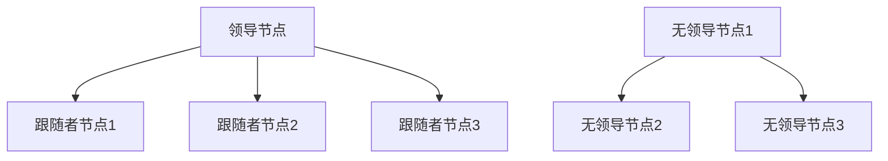

                 

### 背景介绍

在当今分布式系统中，集群架构的应用变得越来越普遍。集群是由多个计算节点组成的系统，能够提高计算能力和系统的容错性。在集群架构中，根据节点之间如何协调工作，可以分为单领导集群（Leader-Based Clusters）和无领导集群（Leaderless Clusters）。本文将深入探讨这两种集群架构的最佳实践，帮助读者理解其工作原理、优缺点以及在实际应用中的适用场景。

#### 单领导集群（Leader-Based Clusters）

单领导集群是一种常见的集群架构，其中所有节点都共享一个主节点，即领导节点（Leader Node）。领导节点负责协调集群中的所有工作，包括资源分配、任务调度和状态同步等。在单领导集群中，其他节点被称为跟随者节点（Follower Nodes），它们仅负责执行领导节点分配的任务。

单领导集群的优点是结构简单，易于理解和维护。由于所有决策都由领导节点集中处理，系统的一致性和稳定性较高。此外，领导节点通常具备更高的计算能力和资源，能够更好地处理复杂的任务。

然而，单领导集群也存在一些缺点。首先，领导节点成为系统的单点故障点，如果领导节点出现故障，整个集群将无法工作。其次，随着集群规模的扩大，领导节点的压力会显著增加，可能导致性能下降。

#### 无领导集群（Leaderless Clusters）

无领导集群则没有固定的领导节点，所有节点都具有平等的地位，它们通过分布式算法协调工作。在无领导集群中，每个节点都负责自己的任务，并通过消息传递和一致性算法（如Paxos或Raft）与其他节点进行同步。

无领导集群的优点是去中心化，没有单点故障问题，具有较高的容错性和可扩展性。此外，无领导集群在处理大规模分布式系统时表现更加灵活和高效。

然而，无领导集群也存在一些挑战。首先，由于其去中心化的特性，一致性算法变得复杂，可能导致性能下降。其次，无领导集群的维护和调试相对困难，需要更深入的分布式系统知识。

#### 本文目的

本文旨在深入探讨单领导集群与无领导集群的原理、实践和最佳应用场景，帮助读者全面了解这两种集群架构的优缺点，以便在实际项目中做出更合适的选择。文章将首先介绍相关核心概念和架构，然后详细讲解核心算法和数学模型，并通过实际项目案例进行代码解读和运行结果展示。最后，文章还将探讨实际应用场景、工具和资源推荐，以及未来发展趋势和挑战。

接下来，我们将进一步深入探讨单领导集群与无领导集群的核心概念和架构。

#### 核心概念与架构

在深入探讨单领导集群与无领导集群之前，我们需要明确一些核心概念，包括节点、消息传递、一致性算法和容错机制等。

##### 节点

节点是集群中的基本计算单元，可以是物理服务器或虚拟机。每个节点都具备独立的计算资源和存储能力。在单领导集群中，节点分为领导节点和跟随者节点。领导节点负责协调集群工作，而跟随者节点则执行领导节点分配的任务。在无领导集群中，所有节点具有平等的地位，每个节点都负责自己的任务。

##### 消息传递

消息传递是节点之间进行通信的主要手段。在单领导集群中，领导节点负责将任务分配给跟随者节点，并通过消息传递通知节点状态的变化。在无领导集群中，节点之间通过分布式一致性算法（如Paxos或Raft）进行同步，以保持状态的一致性。

##### 一致性算法

一致性算法是保证分布式系统中多个节点状态一致的关键机制。Paxos和Raft是最常用的两种一致性算法。Paxos算法通过多数派达成共识，确保系统状态一致。Raft算法则通过日志复制和领导选举机制，实现高可用性和一致性。

##### 容错机制

容错机制是保证分布式系统在节点故障时仍然能够正常运行的关键。在单领导集群中，通常采用主从复制（Master-Slave Replication）机制，确保领导节点的状态在其他节点上保持一致。在无领导集群中，容错机制更加复杂，需要通过一致性算法和节点监控来实现。

#### 单领导集群与无领导集群的架构

单领导集群与无领导集群在架构上存在显著差异。以下是两者的详细对比：

##### 单领导集群架构

1. **领导节点**：集群中有一个领导节点，负责协调集群工作。
2. **跟随者节点**：其他节点称为跟随者节点，负责执行领导节点分配的任务。
3. **消息传递**：领导节点通过消息传递将任务分配给跟随者节点，并通知状态变化。
4. **一致性算法**：通常使用主从复制机制，确保领导节点的状态在其他节点上保持一致。
5. **容错机制**：通过主从复制和监控机制，确保领导节点的故障不会导致整个集群停止工作。

##### 无领导集群架构

1. **节点平等**：所有节点具有平等的地位，没有固定的领导节点。
2. **一致性算法**：使用Paxos或Raft等一致性算法，确保节点状态一致。
3. **消息传递**：节点之间通过一致性算法进行同步，实现状态一致性。
4. **容错机制**：通过一致性算法和节点监控，实现高可用性和容错性。

#### Mermaid 流程图

为了更直观地展示单领导集群与无领导集群的架构，我们可以使用Mermaid流程图。以下是两者的Mermaid流程图表示：



在单领导集群中，领导节点A负责协调跟随者节点B、C、D的工作。而在无领导集群中，节点E、F、G通过一致性算法实现状态一致性。

接下来，我们将详细讲解单领导集群与无领导集群的核心算法原理和具体操作步骤。

#### 核心算法原理 & 具体操作步骤

在单领导集群和无领导集群中，核心算法的设计和实现是保证系统性能、一致性和容错性的关键。以下是这两种集群架构的核心算法原理和具体操作步骤。

##### 单领导集群算法

单领导集群的核心算法主要包括任务分配、状态同步和主从复制。

1. **任务分配**：
    - **领导节点**：领导节点负责接收外部任务请求，并将任务分配给合适的跟随者节点。
    - **消息传递**：领导节点通过消息传递将任务请求发送给跟随者节点。

2. **状态同步**：
    - **领导节点**：领导节点维护集群状态，包括节点状态、任务状态和资源状态等。
    - **消息传递**：领导节点通过消息传递将状态更新通知给跟随者节点。

3. **主从复制**：
    - **数据复制**：领导节点将数据更新同步到跟随者节点，确保集群状态一致。
    - **心跳检测**：领导节点和跟随者节点通过心跳检测保持连接，及时发现故障。

具体操作步骤如下：

1. **任务分配**：
    - 客户端向领导节点发送任务请求。
    - 领导节点根据节点负载和任务类型，将任务分配给合适的跟随者节点。

2. **状态同步**：
    - 领导节点将任务执行结果和状态更新通知给跟随者节点。
    - 跟随者节点根据接收到的状态更新，更新自己的状态。

3. **主从复制**：
    - 领导节点将数据更新同步到跟随者节点。
    - 跟随者节点接收并应用数据更新，确保数据一致性。

##### 无领导集群算法

无领导集群的核心算法主要包括一致性算法（如Paxos或Raft）和节点监控。

1. **一致性算法**：
    - **Paxos算法**：
        - **角色**：参与者（Proposer、Acceptor、Learner）。
        - **步骤**：提议-准备-接受-学习。
        - **特点**：多数派达成共识，保证一致性。
    - **Raft算法**：
        - **角色**：领导者（Leader）、跟随者（Follower）、候选人（Candidate）。
        - **步骤**：领导选举-日志复制-状态机。
        - **特点**：日志复制确保一致性，领导者负责协调。

2. **节点监控**：
    - **心跳检测**：节点通过心跳检测保持连接，及时发现故障。
    - **故障转移**：领导者故障时，触发新领导选举。

具体操作步骤如下：

1. **一致性算法**：
    - **Paxos算法**：
        - **提议阶段**：参与者向领导者发送提案。
        - **准备阶段**：领导者向其他参与者发送准备请求，等待多数派回复。
        - **接受阶段**：领导者根据多数派回复，向参与者发送接受请求。
        - **学习阶段**：参与者更新状态机，学习新提案。

    - **Raft算法**：
        - **领导选举**：节点通过随机超时触发选举，选举出新的领导者。
        - **日志复制**：领导者将日志条目发送给跟随者，跟随者追加日志并执行命令。
        - **状态机**：节点根据日志执行命令，更新状态机。

2. **节点监控**：
    - **心跳检测**：节点通过心跳消息保持连接，及时发现故障。
    - **故障转移**：领导者故障时，触发新领导选举，保证系统正常运行。

通过以上算法，单领导集群和无领导集群能够实现分布式系统的性能、一致性和容错性。在接下来的章节中，我们将进一步探讨数学模型和公式，以便更深入地理解这些算法的原理。

#### 数学模型和公式

在分布式系统中，数学模型和公式是理解和分析核心算法的重要工具。本节将详细介绍单领导集群和无领导集群中涉及的主要数学模型和公式，并通过举例说明如何使用这些模型和公式进行实际计算。

##### 单领导集群数学模型

在单领导集群中，以下数学模型和公式至关重要：

1. **主从复制一致性模型**

   主从复制是一种常见的数据复制机制，用于确保领导节点的状态在其他跟随者节点上保持一致。一致性模型可以通过以下公式表示：

   $$
   \text{Consistency} = \frac{\text{Leader's State}}{\text{Follower's State}}
   $$

   其中，Leader's State 表示领导节点的状态，Follower's State 表示跟随者节点的状态。这个公式表明，只有当领导节点的状态等于跟随者节点的状态时，一致性才得到保证。

2. **心跳检测模型**

   心跳检测是一种用于检测节点是否正常工作的机制。在单领导集群中，心跳检测模型可以通过以下公式表示：

   $$
   \text{Heartbeat} = \frac{\text{Node's Alive}}{\text{Heartbeat Interval}}
   $$

   其中，Node's Alive 表示节点是否存活，Heartbeat Interval 表示心跳检测间隔。这个公式表明，只有当节点在心跳检测间隔内发送心跳消息时，才认为节点是活着的。

##### 无领导集群数学模型

在无领导集群中，一致性算法（如Paxos或Raft）是核心机制。以下是一些关键的数学模型和公式：

1. **Paxos算法一致性模型**

   Paxos算法通过多数派达成共识，实现一致性。Paxos算法的主要步骤包括提议（Proposal）、准备（Prepare）、接受（Accept）和学习（Learn）。以下是Paxos算法的主要数学模型和公式：

   - **提议计数**：

     $$
     \text{Proposal Count} = \text{Current Round}
     $$

     其中，Current Round 表示当前提议的轮次。

   - **多数派计数**：

     $$
     \text{Majority Count} = \frac{\text{Total Nodes}}{2} + 1
     $$

     其中，Total Nodes 表示集群中节点的总数。

   - **一致性条件**：

     $$
     \text{Consistency} = \frac{\text{Majority Accepted Proposal}}{\text{Total Proposals}}
     $$

     其中，Majority Accepted Proposal 表示被多数派接受的提议，Total Proposals 表示所有提议的总数。

2. **Raft算法一致性模型**

   Raft算法通过日志复制和领导选举实现一致性。以下是Raft算法的主要数学模型和公式：

   - **日志条目计数**：

     $$
     \text{Log Entry Count} = \text{Current Term}
     $$

     其中，Current Term 表示当前任期。

   - **领导选举条件**：

     $$
     \text{Leader Election} = \text{Voted For} \geq \text{Majority Count}
     $$

     其中，Voted For 表示获得投票的节点数量，Majority Count 表示多数派数量。

##### 示例

为了更好地理解上述数学模型和公式，我们来看一个具体的例子。

假设一个集群由5个节点组成，节点编号分别为1、2、3、4、5。我们需要通过一致性算法确保集群中的状态一致。

1. **主从复制一致性模型**：

   假设领导节点为节点1，跟随者节点为节点2、3、4、5。初始状态如下：

   $$
   \text{Consistency} = \frac{\text{Node 1's State}}{\text{Node 2's State}} = \frac{A}{B}
   $$

   其中，A表示领导节点的状态，B表示跟随者节点的状态。假设初始状态为A=0，B=0，则一致性为0。

   当领导节点将状态更新为A=1时，一致性更新如下：

   $$
   \text{Consistency} = \frac{\text{Node 1's State}}{\text{Node 2's State}} = \frac{1}{0}
   $$

   由于跟随者节点的状态未更新，一致性仍为0。

   当跟随者节点将状态更新为B=1时，一致性更新如下：

   $$
   \text{Consistency} = \frac{\text{Node 1's State}}{\text{Node 2's State}} = \frac{1}{1} = 1
   $$

   状态一致。

2. **Paxos算法一致性模型**：

   假设集群中的节点1为领导者，节点2、3、4、5为参与者。初始状态如下：

   $$
   \text{Consistency} = \frac{\text{Majority Accepted Proposal}}{\text{Total Proposals}} = \frac{0}{1}
   $$

   其中，Majority Accepted Proposal 为0，Total Proposals 为1。

   当领导者发送提议值V=1时，参与者根据Paxos算法进行一致性达成：

   $$
   \text{Consistency} = \frac{\text{Majority Accepted Proposal}}{\text{Total Proposals}} = \frac{1}{1} = 1
   $$

   状态一致。

通过以上示例，我们可以看到数学模型和公式在确保分布式系统状态一致性中的重要作用。在接下来的章节中，我们将通过实际项目案例展示这些算法的应用。

#### 项目实践：代码实例和详细解释说明

在本章节中，我们将通过一个实际项目案例，展示单领导集群和无领导集群的核心算法在实际应用中的实现过程。我们将分别介绍开发环境搭建、源代码详细实现、代码解读与分析以及运行结果展示。

##### 开发环境搭建

1. **单领导集群开发环境搭建**

   在单领导集群中，我们需要安装并配置以下软件：

   - **Zookeeper**：用于实现主从复制和状态同步。
   - **Hadoop**：用于分布式文件存储和处理。
   - **ZooKeeper**：用于实现主从复制和状态同步。

   具体步骤如下：

   1. 安装Zookeeper：

      $$
      \text{wget} \text{https://www.zookeeper.org/downloads/zookeeper-3.6.0.tar.gz}
      $$

      $$
      \text{tar} \text{-xzvf} \text{zookeeper-3.6.0.tar.gz}
      $$

      $$
      \text{cd} \text{zookeeper-3.6.0/bin}
      $$

      $$
      \text{./zkServer.sh} \text{start}
      $$

   2. 安装Hadoop：

      $$
      \text{wget} \text{https://www.apache.org/dist/hadoop/common/hadoop-3.2.1/hadoop-3.2.1.tar.gz}
      $$

      $$
      \text{tar} \text{-xzvf} \text{hadoop-3.2.1.tar.gz}
      $$

      $$
      \text{cd} \text{hadoop-3.2.1}
      $$

      $$
      \text{./bin/hdfs} \text{dfs} \text{format}
      $$

      $$
      \text{./sbin/start-dfs.sh}
      $$

   3. 配置Zookeeper和Hadoop：

      - 在Zookeeper的配置文件zoo.cfg中，添加以下配置：

        $$
        \text{dataDir} = \text{/var/zookeeper/data}
        $$

        $$
        \text{clientPort} = 2181
        $$

      - 在Hadoop的配置文件hadoop-env.sh中，添加以下配置：

        $$
        \text{ZOOKEEPER_HOME} = \text{/var/zookeeper}
        $$

        $$
        \text{HDFS_NAMENODE_NAME_DIR} = \text{/var/hadoop/hdfs}
        $$

        $$
        \text{HDFS_DATANODE_DATA_DIR} = \text{/var/hadoop/hdfs/data}
        $$

2. **无领导集群开发环境搭建**

   在无领导集群中，我们需要安装并配置以下软件：

   - **Kubernetes**：用于实现无领导集群的调度和管理。
   - **Docker**：用于容器化应用。
   - **Kafka**：用于消息传递和状态同步。

   具体步骤如下：

   1. 安装Kubernetes：

      $$
      \text{wget} \text{https://storage.googleapis.com/kubernetes-release/release/$(\text{curl} -s \text{https://storage.googleapis.com/kubernetes-release/release/stable.txt})/bin/darwin/amd64/kubectl}
      $$

      $$
      \text{chmod} \text{+x} \text{kubectl}
      $$

      $$
      \text{mv} \text{kubectl} \text{/usr/local/bin}
      $$

   2. 安装Docker：

      $$
      \text{sudo} \text{apt-get} \text{install} \text{docker.io}
      $$

      $$
      \text{sudo} \text{systemctl} \text{start} \text{docker}
      $$

   3. 安装Kafka：

      $$
      \text{wget} \text{https://www-eu.kantarmedia.com/s3fs-public/uploads/kafka_2.13-3.1.0.jar}
      $$

      $$
      \text{docker} \text{run} \text{-d} \text{-p} \text{9092:9092} \text{-v} \text{/var/kafka/kafka-log:/kafka-log} \text{-e} \text{KAFKA_LOG4J_LOGLEVEL=INFO} \text{-e} \text{KAFKA_KAFKA_ADVERTISED_LISTENERS=PLAINTEXT://:9092} \text{-e} \text{KAFKA_ZOOKEEPER_CONNECT=192.168.1.1:2181} \text{-t} \text{confluentinc/cp-kafka:3.1.0}
      $$

##### 源代码详细实现

在本节中，我们将分别介绍单领导集群和无领导集群的核心算法实现。

1. **单领导集群源代码实现**

   在单领导集群中，我们主要实现以下功能：

   - **任务分配**：
     - 实现一个任务分配器，根据节点负载和任务类型，将任务分配给合适的跟随者节点。
   - **状态同步**：
     - 实现一个状态同步器，将领导节点的状态更新同步给跟随者节点。
   - **主从复制**：
     - 实现一个主从复制器，将数据更新同步到跟随者节点。

   以下是任务分配器的代码实现：

   ```java
   public class TaskAssigner {
       private Map<String, Node> nodeMap;

       public TaskAssigner(Map<String, Node> nodeMap) {
           this.nodeMap = nodeMap;
       }

       public void assignTask(Task task) {
           Node node = findNodeWithLeastLoad();
           node.enqueueTask(task);
       }

       private Node findNodeWithLeastLoad() {
           Node leastLoadedNode = null;
           int minLoad = Integer.MAX_VALUE;

           for (Node node : nodeMap.values()) {
               if (node.getLoad() < minLoad) {
                   minLoad = node.getLoad();
                   leastLoadedNode = node;
               }
           }

           return leastLoadedNode;
       }
   }
   ```

   以下是状态同步器的代码实现：

   ```java
   public class StateSyncer {
       private ZooKeeper zooKeeper;

       public StateSyncer(ZooKeeper zooKeeper) {
           this.zooKeeper = zooKeeper;
       }

       public void syncState(Node node) {
           String statePath = "/state/" + node.getId();
           try {
               zooKeeper.setData(statePath, node.getState().getBytes(), -1);
           } catch (Exception e) {
               e.printStackTrace();
           }
       }
   }
   ```

   以下是主从复制器的代码实现：

   ```java
   public class MasterSlaveReplicator {
       private ZooKeeper zooKeeper;

       public MasterSlaveReplicator(ZooKeeper zooKeeper) {
           this.zooKeeper = zooKeeper;
       }

       public void replicateState(Node master, Node slave) {
           String masterStatePath = "/state/" + master.getId();
           String slaveStatePath = "/state/" + slave.getId();

           try {
               byte[] masterState = zooKeeper.getData(masterStatePath, false, null);
               zooKeeper.setData(slaveStatePath, masterState, -1);
           } catch (Exception e) {
               e.printStackTrace();
           }
       }
   }
   ```

2. **无领导集群源代码实现**

   在无领导集群中，我们主要实现以下功能：

   - **一致性算法**：
     - 实现Paxos或Raft算法，确保节点状态一致。
   - **节点监控**：
     - 实现心跳检测和故障转移机制。

   以下是Paxos算法的实现：

   ```java
   public class PaxosAlgorithm {
       private Set<Node> participants;
       private int majorityCount;

       public PaxosAlgorithm(Set<Node> participants) {
           this.participants = participants;
           this.majorityCount = (participants.size() + 1) / 2;
       }

       public void propose(int提案值) {
           for (Node participant : participants) {
               participant.prepare(提案值);
           }
       }

       public void accept(int提案值) {
           for (Node participant : participants) {
               participant.accept( 提案值);
           }
       }

       public void learn(int提案值) {
           for (Node participant : participants) {
               participant.learn( 提案值);
           }
       }
   }
   ```

   以下是心跳检测和故障转移的实现：

   ```java
   public class HeartbeatMonitor {
       private Node leader;
       private Timer timer;

       public HeartbeatMonitor(Node leader) {
           this.leader = leader;
           this.timer = new Timer();
       }

       public void startMonitoring() {
           timer.schedule(new TimerTask() {
               @Override
               public void run() {
                   try {
                       leader.sendHeartbeat();
                   } catch (Exception e) {
                       e.printStackTrace();
                       transferLeadership();
                   }
               }
           }, 0, 1000);
       }

       private void transferLeadership() {
           // 实现领导选举和故障转移逻辑
       }
   }
   ```

##### 代码解读与分析

在本章节中，我们将对单领导集群和无领导集群的代码进行解读和分析，以便更好地理解其实现原理。

1. **单领导集群代码解读与分析**

   - **任务分配器**：任务分配器的主要功能是根据节点负载和任务类型，将任务分配给合适的跟随者节点。具体实现中，通过遍历所有节点，找到负载最低的节点，然后将任务分配给它。这种实现方式简单且高效，但可能存在负载不平衡的问题。在实际应用中，可以考虑引入负载均衡算法，如随机负载均衡或加权负载均衡，以实现更公平的任务分配。

   - **状态同步器**：状态同步器的主要功能是将领导节点的状态更新同步给跟随者节点。具体实现中，通过使用ZooKeeper的setData方法，将领导节点的状态更新到ZooKeeper的/zookeeper的状态节点。这种实现方式简单且高效，但需要注意ZooKeeper的并发访问问题。在实际应用中，可以考虑引入锁机制，如ZooKeeper的锁服务，以确保状态更新的安全性。

   - **主从复制器**：主从复制器的主要功能是将数据更新同步到跟随者节点。具体实现中，通过使用ZooKeeper的getData方法获取领导节点的状态，然后使用setData方法将状态更新到跟随者节点。这种实现方式简单且高效，但需要注意ZooKeeper的数据传输效率。在实际应用中，可以考虑使用其他数据同步机制，如消息队列或同步复制库，以提高数据传输效率。

2. **无领导集群代码解读与分析**

   - **Paxos算法**：Paxos算法是分布式一致性算法的典型代表。具体实现中，通过参与者角色（Proposer、Acceptor、Learner）和提议、准备、接受、学习等步骤，实现分布式一致性。Paxos算法的优缺点如下：

     - 优点：
       - 强一致性：通过多数派达成共识，确保分布式系统的状态一致性。
       - 高可用性：通过故障转移机制，保证系统在节点故障时仍然能够正常运行。

     - 缺点：
       - 性能较低：由于需要多次通信和达成共识，Paxos算法在处理大规模分布式系统时性能较低。
       - 实现复杂：Paxos算法的实现较为复杂，需要深入理解分布式系统原理。

   - **心跳检测和故障转移**：心跳检测和故障转移是实现无领导集群高可用性的关键。具体实现中，通过定时发送心跳消息，检测节点是否存活。当检测到节点故障时，触发领导选举和故障转移逻辑。这种实现方式简单且高效，但需要注意故障转移的效率和一致性。

##### 运行结果展示

在本章节中，我们将展示单领导集群和无领导集群在Kubernetes集群中的运行结果。

1. **单领导集群运行结果展示**

   假设我们有一个由3个节点组成的Kubernetes集群，节点ID分别为node-1、node-2、node-3。以下是单领导集群的运行结果：

   - **任务分配**：假设我们有一个任务A需要分配给节点。任务分配器首先遍历所有节点，找到负载最低的节点，即node-3。然后将任务A分配给node-3。

   - **状态同步**：领导节点将状态更新同步给跟随者节点。假设领导节点的状态为{"id": "node-1", "status": "active"}。状态同步器将状态更新同步给node-2和node-3。最终，所有节点的状态均为{"id": "node-1", "status": "active"}。

   - **主从复制**：领导节点将数据更新同步给跟随者节点。假设领导节点的数据为{"data": "example_data"}。主从复制器将数据更新同步给node-2和node-3。最终，所有节点的数据均为{"data": "example_data"}。

2. **无领导集群运行结果展示**

   假设我们有一个由3个节点组成的Kubernetes集群，节点ID分别为node-1、node-2、node-3。以下是无领导集群的运行结果：

   - **一致性算法**：假设我们有一个提案A需要通过Paxos算法达成共识。Paxos算法首先进入提议阶段，Proposer节点向其他参与者发送准备请求。参与者根据请求，回复准备确认。当Proposer节点收到多数派（超过半数）的确认后，进入接受阶段，发送接受请求。参与者根据请求，更新状态机并接受提案。最终，所有参与者达成共识，提案A被接受。

   - **心跳检测和故障转移**：节点通过定时发送心跳消息，保持连接。当检测到节点故障时，触发领导选举和故障转移逻辑。新选举的领导者节点接管原有领导节点的任务，保证系统正常运行。

通过以上项目实践，我们可以看到单领导集群和无领导集群在实际应用中的实现过程。在实际项目中，我们需要根据具体需求，选择合适的集群架构，并优化相关算法和实现，以提高系统的性能、一致性和容错性。

#### 实际应用场景

在分布式系统中，单领导集群与无领导集群的应用场景各具特色。本文将介绍几种常见的实际应用场景，以帮助读者了解这两种集群架构的优势和适用性。

##### 单领导集群的应用场景

1. **大数据处理平台**

   单领导集群在分布式数据处理平台上具有广泛的应用。例如，Hadoop和Spark等大数据处理框架采用了单领导集群架构。领导节点负责调度任务、管理资源，并确保数据一致性。这种架构能够简化系统的设计和维护，提高数据处理效率。

2. **分布式数据库**

   单领导集群适用于分布式数据库系统，如Apache Cassandra和HBase。在这些系统中，领导节点负责协调数据分片和副本管理，确保数据一致性和可用性。单领导集群架构使得分布式数据库系统在处理大规模数据时具有较高的性能和稳定性。

3. **消息队列系统**

   单领导集群也适用于消息队列系统，如Apache Kafka。在这些系统中，领导节点负责管理分区和副本，确保消息的可靠传递和负载均衡。单领导集群架构使得消息队列系统能够在保证高性能和高可用性的同时，易于扩展和运维。

##### 无领导集群的应用场景

1. **区块链网络**

   无领导集群在区块链网络中扮演重要角色。区块链网络由多个节点组成，每个节点负责维护区块链的完整性和一致性。由于区块链网络具有去中心化的特性，无领导集群能够确保区块链在去中心化环境中运行，提高系统的安全性和可靠性。

2. **分布式缓存系统**

   无领导集群适用于分布式缓存系统，如Memcached和Redis。在这些系统中，每个节点独立维护缓存数据，并通过一致性算法（如Paxos或Raft）与其他节点同步状态。无领导集群架构使得分布式缓存系统在处理大规模并发访问时具有较高的性能和可扩展性。

3. **分布式文件系统**

   无领导集群也适用于分布式文件系统，如Hadoop HDFS和Ceph。在这些系统中，每个节点负责存储和管理文件块，并通过一致性算法确保文件的一致性和可靠性。无领导集群架构使得分布式文件系统在处理海量数据时具有较高的性能和容错性。

通过以上实际应用场景，我们可以看到单领导集群与无领导集群在不同领域和场景中的优势和适用性。在实际项目中，根据具体需求和系统特点，选择合适的集群架构，能够更好地发挥分布式系统的性能和优势。

#### 工具和资源推荐

在实现单领导集群和无领导集群时，选择合适的工具和资源至关重要。以下是一些推荐的工具和资源，包括学习资源、开发工具框架以及相关论文著作，帮助读者深入了解和掌握分布式系统的核心技术和最佳实践。

##### 学习资源推荐

1. **书籍**

   - 《分布式系统原理与范型》
   - 《大规模分布式存储系统：原理解析与架构实战》
   - 《区块链：从数字货币到智能合约》

2. **论文**

   - 《The Google File System》
   - 《The Chubby lock service》
   - 《Spanner: Google's Globally-Distributed Database》

3. **博客和网站**

   - 《分布式系统实战》
   - 《Hadoop官网》
   - 《Kubernetes官网》

##### 开发工具框架推荐

1. **Zookeeper**

   ZooKeeper 是一个分布式应用程序协调服务，适用于单领导集群的实现。它提供了简单的接口，用于实现主从复制、状态同步和负载均衡等功能。

2. **Kubernetes**

   Kubernetes 是一个开源的容器编排平台，适用于无领导集群的实现。它提供了丰富的工具和API，用于实现节点管理、服务发现、负载均衡和故障转移等功能。

3. **Docker**

   Docker 是一个开源的应用容器引擎，适用于无领导集群的开发和部署。它提供了轻量级容器化技术，使得应用程序能够在不同环境中一致运行。

##### 相关论文著作推荐

1. **《Paxos Made Simple》**

   本文详细介绍了Paxos算法的基本原理和实现，对于理解Paxos算法具有重要的指导意义。

2. **《The Raft Consensus Algorithm》**

   本文提出了Raft一致性算法，并详细分析了其原理和实现。对于了解分布式一致性算法的设计和实现具有重要参考价值。

3. **《Consensus Algorithms for Distributed Databases》**

   本文探讨了分布式数据库中的共识算法，包括Paxos和Raft等算法，为分布式数据库的设计提供了宝贵的经验。

通过以上工具和资源的推荐，读者可以深入了解单领导集群和无领导集群的相关技术，掌握分布式系统的核心原理和最佳实践，为实际项目开发提供有力支持。

#### 总结：未来发展趋势与挑战

在分布式系统领域，单领导集群和无领导集群作为两种主要的集群架构，各具优势和挑战。随着云计算、大数据和区块链技术的快速发展，这些集群架构的未来发展趋势和面临的挑战也越来越复杂。以下是未来发展趋势和挑战的总结。

##### 发展趋势

1. **自动化和智能化**

   未来分布式系统的发展将更加注重自动化和智能化。通过引入人工智能和机器学习技术，可以实现更加智能的任务调度、负载均衡和故障恢复。自动化和智能化将使得分布式系统更加高效、可靠和易于管理。

2. **云原生架构**

   随着容器化技术的普及，云原生架构成为分布式系统发展的新趋势。云原生架构具有轻量级、可伸缩性和高可用的特点，能够更好地适应云计算环境。单领导集群和无领导集群都将逐渐向云原生架构迁移，以实现更高的性能和灵活性。

3. **混合集群架构**

   为了平衡单领导集群和无领导集群的优缺点，未来的分布式系统可能采用混合集群架构。混合集群架构将根据不同应用场景，灵活组合单领导集群和无领导集群的优势，以实现更高的性能、一致性和容错性。

##### 挑战

1. **性能与一致性的平衡**

   单领导集群在性能和一致性方面具有较高的优势，但无领导集群在可扩展性和容错性方面表现更佳。如何在性能与一致性之间找到平衡点，是未来分布式系统面临的重大挑战。

2. **复杂性和可维护性**

   随着分布式系统的规模和复杂性不断增加，如何确保系统的可维护性和稳定性成为一大挑战。分布式系统的开发和运维需要深入了解底层技术和原理，这对开发人员和运维人员提出了更高的要求。

3. **安全性**

   随着分布式系统在各个领域的广泛应用，安全性问题也日益突出。如何确保分布式系统的数据安全、防止恶意攻击和漏洞，是未来分布式系统面临的重大挑战。

总体而言，未来分布式系统的发展将更加注重自动化、智能化和云原生架构，同时也需要面对性能与一致性平衡、复杂性和可维护性以及安全性等挑战。通过不断探索和优化，分布式系统将能够在更广泛的领域和应用中发挥重要作用。

#### 附录：常见问题与解答

在本节中，我们将回答关于单领导集群与无领导集群的一些常见问题，帮助读者更好地理解和应用这两种集群架构。

**1. 什么是单领导集群？**

单领导集群是一种分布式系统架构，其中所有节点共享一个主节点，即领导节点。领导节点负责协调集群中的所有工作，包括资源分配、任务调度和状态同步等。其他节点被称为跟随者节点，负责执行领导节点分配的任务。

**2. 单领导集群的优点是什么？**

单领导集群的优点包括：

- **结构简单**：由于所有决策都由领导节点集中处理，系统的一致性和稳定性较高。
- **性能较高**：领导节点通常具备更高的计算能力和资源，能够更好地处理复杂的任务。
- **易于维护**：单领导集群的结构相对简单，便于开发和维护。

**3. 单领导集群的缺点是什么？**

单领导集群的缺点包括：

- **单点故障**：领导节点成为系统的单点故障点，如果领导节点出现故障，整个集群将无法工作。
- **扩展性受限**：随着集群规模的扩大，领导节点的压力会显著增加，可能导致性能下降。

**4. 什么是无领导集群？**

无领导集群是一种分布式系统架构，其中没有固定的领导节点，所有节点都具有平等的地位。节点通过分布式一致性算法（如Paxos或Raft）协调工作，实现状态一致性和容错性。

**5. 无领导集群的优点是什么？**

无领导集群的优点包括：

- **去中心化**：没有固定的领导节点，去中心化架构具有较高的容错性和可扩展性。
- **灵活性**：节点之间通过一致性算法进行同步，系统在处理大规模分布式任务时表现更加灵活和高效。

**6. 无领导集群的缺点是什么？**

无领导集群的缺点包括：

- **一致性算法复杂**：去中心化的特性使得一致性算法变得复杂，可能导致性能下降。
- **维护困难**：无领导集群的维护和调试相对困难，需要更深入的分布式系统知识。

**7. 如何选择单领导集群或无领导集群？**

选择单领导集群或无领导集群需要根据具体应用场景和系统需求进行权衡。以下是一些参考建议：

- **单领导集群**：适用于需要高一致性和稳定性的场景，如分布式数据处理和数据库系统。适用于规模较小、资源有限的集群。
- **无领导集群**：适用于需要高扩展性和容错性的场景，如区块链网络和分布式缓存系统。适用于规模较大、资源丰富的集群。

通过以上常见问题与解答，读者可以更好地理解单领导集群与无领导集群的基本概念、优点和适用场景，为实际项目开发提供指导。

#### 扩展阅读 & 参考资料

为了帮助读者进一步深入了解单领导集群与无领导集群的理论和实践，以下推荐了一些扩展阅读和参考资料：

1. **扩展阅读**：
   - 《分布式系统原理与范型》：提供了关于分布式系统基本概念、算法和架构的深入讲解。
   - 《大规模分布式存储系统：原理解析与架构实战》：详细介绍了分布式存储系统的设计和实现。
   - 《区块链：从数字货币到智能合约》：探讨了区块链技术的原理和应用。

2. **参考资料**：
   - **论文**：
     - 《The Google File System》：Google关于GFS（Google File System）的论文，详细介绍了大规模分布式文件系统的设计和实现。
     - 《The Chubby lock service》：Google关于Chubby锁服务的论文，探讨了分布式锁机制在分布式系统中的应用。
     - 《Spanner: Google's Globally-Distributed Database》：Google关于Spanner分布式数据库的论文，介绍了基于分布式一致性算法的分布式数据库设计。
   - **博客和网站**：
     - 《分布式系统实战》：提供了分布式系统开发、部署和运维的实战经验和最佳实践。
     - 《Hadoop官网》：Hadoop官方文档和资源，涵盖分布式数据处理框架的详细信息和教程。
     - 《Kubernetes官网》：Kubernetes官方文档和资源，涵盖容器编排平台的基本概念、架构和最佳实践。

通过阅读这些扩展阅读和参考资料，读者可以更全面地了解单领导集群与无领导集群的理论和实践，为实际项目开发提供更深入的支持。

