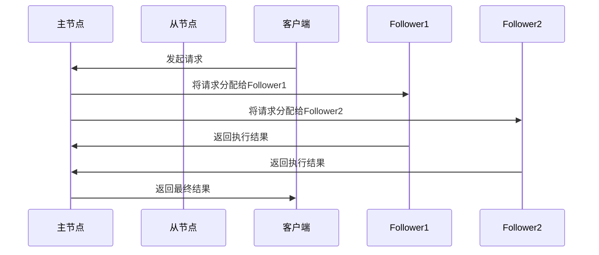
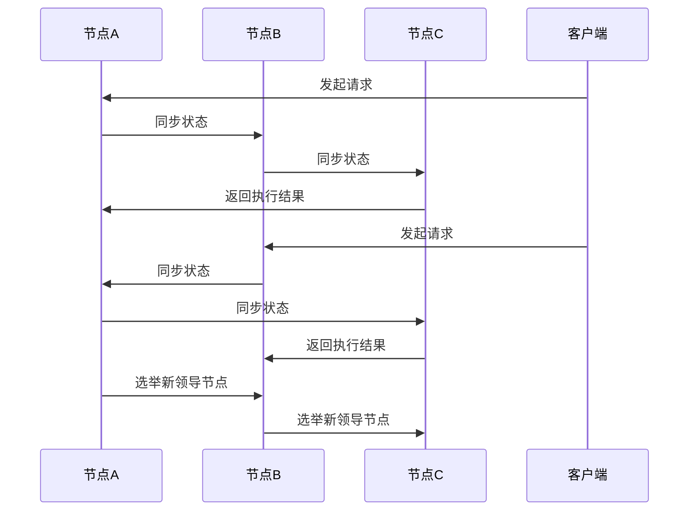

                 

### 背景介绍 ###

单领导集群与无领导集群是分布式系统设计中两种不同的架构模式。这两种模式各有特点，适用于不同的应用场景，理解它们的差异和适用范围对于构建高效的分布式系统至关重要。

#### 单领导集群

单领导集群（SINGLE-LEADER CLUSTER）模式，顾名思义，是指集群中只有一个主节点（leader）负责协调和管理整个集群的运行。这个主节点通常承担以下职责：

- **状态同步**：主节点负责与其他节点同步状态，确保所有节点的一致性。
- **决策执行**：主节点接收客户端请求并做出决策，然后将决策结果下发给其他节点执行。
- **负载均衡**：主节点负责根据节点的负载情况，动态地分配请求到不同的节点。

单领导集群的主要优势在于其易于管理和维护，因为所有决策都集中在主节点上，减少了协调的复杂性。然而，单领导集群也存在单点故障的风险，一旦主节点宕机，整个集群将无法工作。

#### 无领导集群

无领导集群（LEADERLESS CLUSTER）模式则不需要一个固定的领导节点，而是通过节点之间的协作来共同完成工作。每个节点都可以担任领导角色，并且这种角色可以随时改变。无领导集群的主要特点包括：

- **去中心化**：没有固定的主节点，所有节点都是平等的，共同参与系统的管理和决策。
- **高可用性**：由于没有单点故障的问题，整个系统更加稳定和可靠。
- **容错性**：当一个节点出现问题时，其他节点可以立即接管其任务，从而确保系统持续运行。

无领导集群的优势在于其高可用性和去中心化的特性，但同时也带来了更高的复杂性和协调难度。

在接下来的章节中，我们将深入探讨单领导集群与无领导集群的核心概念、算法原理、数学模型以及实际应用场景。通过逐步分析，我们将理解这两种模式在分布式系统设计中的具体应用，并探讨各自的优势和挑战。

---

### 核心概念与联系 ###

为了更好地理解单领导集群与无领导集群，我们首先需要明确它们的核心概念和联系。本章节将介绍这两个架构模式的基本原理，并使用Mermaid流程图展示其架构关系。

#### 单领导集群

在单领导集群中，集群由一个主节点（leader）和多个从节点（followers）组成。主节点负责协调整个集群的运行，并承担以下核心职责：

1. **状态同步**：主节点定期与其他节点同步状态，确保所有节点状态的一致性。这通常通过心跳机制实现。
2. **决策执行**：主节点接收客户端请求，并根据集群的状态做出决策。决策结果随后下发给从节点执行。
3. **负载均衡**：主节点根据节点的负载情况，动态地分配请求到不同的节点，以实现负载均衡。

以下是单领导集群的Mermaid流程图表示：



#### 无领导集群

在无领导集群中，没有固定的主节点，所有节点都是平等的，并共同参与系统的管理和决策。每个节点可以随时担任领导角色，并承担以下核心职责：

1. **状态同步**：每个节点与其他节点同步状态，确保系统的一致性。这通常通过 gossip 协议实现。
2. **决策执行**：每个节点都可以接收客户端请求并做出决策，然后将决策结果执行。
3. **角色选举**：当现有领导节点失效时，其他节点可以通过选举机制选择新的领导节点。

以下是无领导集群的Mermaid流程图表示：



通过上述流程图，我们可以清晰地看到单领导集群与无领导集群在架构上的差异。单领导集群依赖于中心化的主节点，而无领导集群则通过去中心化的方式实现协作。

#### 关键概念

- **状态同步**：确保集群中所有节点状态一致的过程。
- **决策执行**：根据集群状态执行相应操作的过程。
- **负载均衡**：根据节点负载情况，动态分配请求到不同节点的过程。
- **角色选举**：在无领导集群中，选举新领导节点的过程。

这些关键概念在单领导集群与无领导集群中都至关重要，但实现方式和具体应用场景有所不同。

在下一章节中，我们将深入探讨单领导集群与无领导集群的核心算法原理，并逐步分析其具体操作步骤。

---

### 核心算法原理 & 具体操作步骤 ###

在深入探讨单领导集群与无领导集群的核心算法原理之前，我们需要先理解一些基础的概念和术语，这将有助于我们更好地理解这两种集群的工作原理。

#### 单领导集群算法原理

单领导集群的核心算法主要包括状态同步、决策执行和负载均衡。以下是对这些算法的详细解释和具体操作步骤：

1. **状态同步**：
   - **初始化**：在集群启动时，主节点（leader）与其他从节点（followers）建立连接，并初始化状态。
   - **定期同步**：主节点定期向从节点发送心跳信号，以确保所有节点的状态保持一致。心跳信号通常包含主节点的当前状态信息。
   - **状态更新**：从节点在接收到心跳信号后，更新自己的状态信息，并与主节点进行状态同步。

2. **决策执行**：
   - **请求处理**：客户端发送请求到主节点，主节点根据当前集群状态做出决策。
   - **决策分发**：主节点将决策结果下发给从节点执行。决策结果通常包括具体的操作指令和执行顺序。

3. **负载均衡**：
   - **监控负载**：主节点定期监控各个从节点的负载情况。
   - **负载调整**：根据节点的负载情况，主节点动态调整请求的分配策略，以确保系统资源得到充分利用。

#### 无领导集群算法原理

无领导集群的核心算法主要包括状态同步、决策执行和角色选举。以下是对这些算法的详细解释和具体操作步骤：

1. **状态同步**：
   - **初始化**：每个节点在启动时，初始化自己的状态信息。
   - **随机同步**：节点以一定的概率与其他节点进行状态同步，通常使用 gossip 协议实现。
   - **状态更新**：节点在接收到其他节点的状态更新后，更新自己的状态信息，并继续进行同步。

2. **决策执行**：
   - **请求处理**：节点接收到客户端请求后，根据当前状态做出决策。
   - **本地执行**：节点执行决策结果，并将结果返回给客户端。

3. **角色选举**：
   - **触发条件**：当当前领导节点失效时，系统触发角色选举。
   - **选举过程**：节点通过选举算法（如 Raft 或 Paxos）选择新的领导节点。
   - **状态同步**：新领导节点与所有其他节点同步状态，确保系统一致性。

#### 操作步骤示例

为了更直观地理解这些算法，我们可以通过一个简单的示例来展示单领导集群与无领导集群的操作步骤。

**单领导集群操作步骤示例**：

1. **初始化**：
   - 主节点（leader）启动，与其他从节点（followers）建立连接，初始化状态。

2. **状态同步**：
   - 主节点定期发送心跳信号，从节点更新状态信息。

3. **请求处理**：
   - 客户端发送请求到主节点，主节点根据状态做出决策。

4. **决策执行**：
   - 主节点将决策结果下发给从节点执行。

5. **负载均衡**：
   - 主节点监控负载情况，动态调整请求分配策略。

**无领导集群操作步骤示例**：

1. **初始化**：
   - 每个节点启动，初始化状态信息。

2. **状态同步**：
   - 节点以一定概率与其他节点进行状态同步。

3. **请求处理**：
   - 节点接收到客户端请求后，根据状态做出决策。

4. **决策执行**：
   - 节点执行决策结果，并将结果返回给客户端。

5. **角色选举**：
   - 当领导节点失效时，节点触发选举过程，选择新领导节点。

6. **状态同步**：
   - 新领导节点与所有其他节点同步状态。

通过上述示例，我们可以看到单领导集群与无领导集群在操作步骤上的差异。单领导集群依赖于中心化的主节点，而无领导集群则通过去中心化的方式实现协作。

在下一章节中，我们将探讨单领导集群与无领导集群的数学模型和公式，并详细讲解这些模型如何应用在实际系统中。

---

### 数学模型和公式 & 详细讲解 & 举例说明 ###

在理解单领导集群与无领导集群的算法原理和操作步骤后，我们需要进一步探讨它们的数学模型和公式，这些模型和公式有助于我们更深入地分析这两种集群的性能和稳定性。

#### 单领导集群数学模型

单领导集群的数学模型主要涉及负载均衡和状态同步。以下是一些关键指标和公式：

1. **负载均衡**：

   - **平均响应时间**（\( T_{avg} \)）：
     \[
     T_{avg} = \frac{\sum_{i=1}^{N} T_i}{N}
     \]
     其中，\( T_i \) 为第 \( i \) 个节点的响应时间，\( N \) 为节点总数。

   - **节点负载率**（\( L_i \)）：
     \[
     L_i = \frac{T_i}{T_{avg}}
     \]
     节点负载率表示第 \( i \) 个节点的负载相对于整个集群的平均负载。

   - **负载均衡系数**（\( B \)）：
     \[
     B = \frac{T_{avg}}{\max(T_i)}
     \]
     负载均衡系数用于衡量集群负载的均衡程度，值越接近1，表示负载越均衡。

2. **状态同步**：

   - **同步时间**（\( T_{sync} \)）：
     \[
     T_{sync} = \max(T_i) + T_d
     \]
     其中，\( T_i \) 为节点之间的延迟，\( T_d \) 为节点状态更新的延迟。

   - **同步频率**（\( F_{sync} \)）：
     \[
     F_{sync} = \frac{1}{T_{sync}}
     \]
     同步频率表示节点状态更新的频率，越高意味着状态同步越频繁。

#### 无领导集群数学模型

无领导集群的数学模型主要涉及状态同步和角色选举。以下是一些关键指标和公式：

1. **状态同步**：

   - **平均同步时间**（\( T_{avg\_sync} \)）：
     \[
     T_{avg\_sync} = \frac{\sum_{i=1}^{N} T_i}{N}
     \]
     其中，\( T_i \) 为节点之间的平均同步时间。

   - **状态更新频率**（\( F_{update} \)）：
     \[
     F_{update} = \frac{1}{T_{avg\_sync}}
     \]
     状态更新频率表示节点状态更新的频率，越高意味着状态同步越频繁。

2. **角色选举**：

   - **选举时间**（\( T_{elect} \)）：
     \[
     T_{elect} = \max(T_i) + T_e
     \]
     其中，\( T_i \) 为节点之间的延迟，\( T_e \) 为选举算法的执行时间。

   - **选举频率**（\( F_{elect} \)）：
     \[
     F_{elect} = \frac{1}{T_{elect}}
     \]
     选举频率表示角色选举的频率，越高意味着角色变更越频繁。

#### 举例说明

为了更好地理解这些数学模型和公式，我们可以通过一个简单的例子来说明如何计算单领导集群和无领导集群的性能指标。

**单领导集群举例**：

假设我们有一个包含3个节点的单领导集群，节点A为主节点，节点B和节点C为从节点。以下是一些假设的数据：

- 节点A的响应时间：\( T_A = 2 \)秒
- 节点B的响应时间：\( T_B = 3 \)秒
- 节点C的响应时间：\( T_C = 1 \)秒

1. **负载均衡**：

   - 平均响应时间：
     \[
     T_{avg} = \frac{T_A + T_B + T_C}{3} = \frac{2 + 3 + 1}{3} = 2 \text{秒}
     \]
   - 节点负载率：
     \[
     L_A = \frac{T_A}{T_{avg}} = \frac{2}{2} = 1
     \]
     \[
     L_B = \frac{T_B}{T_{avg}} = \frac{3}{2} = 1.5
     \]
     \[
     L_C = \frac{T_C}{T_{avg}} = \frac{1}{2} = 0.5
     \]
   - 负载均衡系数：
     \[
     B = \frac{T_{avg}}{\max(T_i)} = \frac{2}{3} = 0.67
     \]

2. **状态同步**：

   - 同步时间：
     \[
     T_{sync} = \max(T_A, T_B, T_C) + T_d = \max(2, 3, 1) + 0.5 = 4.5 \text{秒}
     \]
   - 同步频率：
     \[
     F_{sync} = \frac{1}{T_{sync}} = \frac{1}{4.5} \approx 0.22 \text{次/秒}
     \]

**无领导集群举例**：

假设我们有一个包含3个节点的无领导集群，节点A、节点B和节点C均为平等节点。以下是一些假设的数据：

- 节点A与节点B的平均同步时间：\( T_{AB} = 2 \)秒
- 节点A与节点C的平均同步时间：\( T_{AC} = 3 \)秒
- 选举算法的执行时间：\( T_e = 1 \)秒

1. **状态同步**：

   - 平均同步时间：
     \[
     T_{avg\_sync} = \frac{T_{AB} + T_{AC}}{2} = \frac{2 + 3}{2} = 2.5 \text{秒}
     \]
   - 状态更新频率：
     \[
     F_{update} = \frac{1}{T_{avg\_sync}} = \frac{1}{2.5} \approx 0.4 \text{次/秒}
     \]

2. **角色选举**：

   - 选举时间：
     \[
     T_{elect} = \max(T_{AB}, T_{AC}) + T_e = \max(2, 3) + 1 = 4 \text{秒}
     \]
   - 选举频率：
     \[
     F_{elect} = \frac{1}{T_{elect}} = \frac{1}{4} = 0.25 \text{次/秒}
     \]

通过上述举例，我们可以看到如何使用数学模型和公式来计算单领导集群和无领导集群的性能指标。这些指标对于评估集群的性能和稳定性至关重要。

在下一章节中，我们将通过具体的代码实例来展示单领导集群和无领导集群的实现，并对代码进行详细解读和分析。

---

### 项目实践：代码实例和详细解释说明

在本章节中，我们将通过具体的代码实例来展示单领导集群和无领导集群的实现，并对其关键部分进行详细解释和分析。

#### 单领导集群实现

以下是一个简单的单领导集群实现示例。在这个示例中，我们将使用Python语言和Golang语言分别实现单领导集群的客户端和服务端。

##### Python 客户端

```python
import socket

def send_request_to_leader(leader_ip, request_data):
    client_socket = socket.socket(socket.AF_INET, socket.SOCK_STREAM)
    client_socket.connect((leader_ip, 8080))
    client_socket.sendall(request_data.encode('utf-8'))
    response = client_socket.recv(1024)
    client_socket.close()
    return response.decode('utf-8')

if __name__ == "__main__":
    leader_ip = "127.0.0.1"
    request_data = "GET /resource1"
    response = send_request_to_leader(leader_ip, request_data)
    print(response)
```

**解释**：

1. **创建客户端**：使用 `socket` 库创建客户端。
2. **连接到主节点**：客户端连接到主节点的IP地址和端口号（默认为8080）。
3. **发送请求**：客户端将请求数据发送到主节点。
4. **接收响应**：客户端接收主节点的响应数据。
5. **关闭连接**：关闭客户端与主节点的连接。

##### Golang 主节点

```go
package main

import (
    "fmt"
    "net/http"
)

func handleRequest(w http.ResponseWriter, r *http.Request) {
    request_data := r.URL.Path
    fmt.Fprintf(w, "Received request: %s", request_data)
}

func main() {
    http.HandleFunc("/", handleRequest)
    listener, _ := net.Listen("tcp", ":8080")
    defer listener.Close()
    fmt.Println("Server started on port 8080")
    http.Serve(listener, nil)
}
```

**解释**：

1. **HTTP服务器**：使用 `http` 库创建HTTP服务器。
2. **处理请求**：定义处理请求的函数，将请求路径作为响应返回。
3. **监听端口**：服务器监听8080端口，处理来自客户端的请求。

##### Golang 从节点

```go
package main

import (
    "fmt"
    "net/http"
)

func handleRequest(w http.ResponseWriter, r *http.Request) {
    request_data := r.URL.Path
    fmt.Fprintf(w, "Received request: %s", request_data)
}

func main() {
    http.HandleFunc("/", handleRequest)
    listener, _ := net.Listen("tcp", ":8081")
    defer listener.Close()
    fmt.Println("Follower server started on port 8081")
    http.Serve(listener, nil)
}
```

**解释**：

1. **HTTP服务器**：与主节点类似，使用 `http` 库创建HTTP服务器。
2. **处理请求**：定义处理请求的函数，将请求路径作为响应返回。
3. **监听端口**：从节点监听8081端口，处理来自客户端的请求。

#### 无领导集群实现

以下是一个简单的无领导集群实现示例。在这个示例中，我们将使用Python语言和Golang语言分别实现无领导集群的客户端和服务端。

##### Python 客户端

```python
import requests

def send_request_to_node(node_ip, request_data):
    response = requests.get(f"http://{node_ip}:8080/{request_data}")
    return response.text

if __name__ == "__main__":
    node_ips = ["127.0.0.1", "127.0.0.2", "127.0.0.3"]
    request_data = "resource1"
    for node_ip in node_ips:
        response = send_request_to_node(node_ip, request_data)
        print(f"Response from {node_ip}: {response}")
```

**解释**：

1. **创建客户端**：使用 `requests` 库创建客户端。
2. **轮询节点**：客户端轮询所有节点，尝试发送请求并接收响应。
3. **打印响应**：客户端打印每个节点的响应结果。

##### Golang 节点

```go
package main

import (
    "fmt"
    "net/http"
)

func handleRequest(w http.ResponseWriter, r *http.Request) {
    request_data := r.URL.Path
    fmt.Fprintf(w, "Received request: %s", request_data)
}

func main() {
    http.HandleFunc("/", handleRequest)
    listener, _ := net.Listen("tcp", ":8080")
    defer listener.Close()
    fmt.Println("Node server started on port 8080")
    http.Serve(listener, nil)
}
```

**解释**：

1. **HTTP服务器**：使用 `http` 库创建HTTP服务器。
2. **处理请求**：定义处理请求的函数，将请求路径作为响应返回。
3. **监听端口**：节点监听8080端口，处理来自客户端的请求。

通过上述示例，我们可以看到如何使用Python和Golang实现单领导集群和无领导集群的基本功能。在实际应用中，这些实现可以进一步扩展和优化，以应对更复杂的分布式系统需求。

在下一章节中，我们将探讨单领导集群与无领导集群在实际应用场景中的具体应用。

---

### 实际应用场景 ###

单领导集群和无领导集群在实际应用中各有其独特的优势，适用于不同的场景。以下是一些典型的应用场景，以及它们如何利用这两种集群架构实现高效和可靠的分布式系统。

#### 单领导集群的应用场景

1. **金融交易系统**：
   - **场景描述**：金融交易系统需要处理大量高频交易请求，要求低延迟和高一致性。
   - **应用优势**：单领导集群通过集中式的状态同步和决策执行，可以确保系统的高效运行。主节点负责处理所有交易请求，从而减少了协调的复杂性，提高了系统的响应速度。
   - **挑战**：单点故障是一个重大挑战，一旦主节点宕机，整个系统将无法工作。因此，在金融交易系统中，通常会采用高可用性架构，如主从备份和故障切换，来避免单点故障。

2. **数据存储系统**：
   - **场景描述**：数据存储系统需要处理大量数据的读写请求，要求高可用性和数据一致性。
   - **应用优势**：单领导集群可以通过主节点进行状态同步和负载均衡，确保数据的一致性和高效性。主节点可以动态调整读写请求的分配，优化系统的性能。
   - **挑战**：单点故障仍然是主要的挑战，特别是在大规模数据存储系统中，数据的完整性和一致性要求非常高。因此，实现一个高可用性的数据存储系统需要谨慎设计备份和恢复策略。

3. **电商交易系统**：
   - **场景描述**：电商交易系统需要处理大量的商品订单和支付请求，要求快速响应和准确记录。
   - **应用优势**：单领导集群可以通过主节点集中处理订单和支付请求，确保交易的一致性和高效性。主节点可以实时监控订单状态，并优化请求处理流程。
   - **挑战**：单点故障可能导致大量订单无法处理，影响用户体验。因此，电商系统通常需要实现复杂的故障转移和备份机制，确保交易数据的安全和稳定。

#### 无领导集群的应用场景

1. **社交网络系统**：
   - **场景描述**：社交网络系统需要处理大量的用户请求，包括用户动态的发布、评论和点赞等。
   - **应用优势**：无领导集群的去中心化特性使其非常适合处理大量的用户请求。每个节点都可以独立处理请求，并且通过随机同步保持状态一致性。这种架构能够有效应对大规模用户请求，提高系统的扩展性和容错性。
   - **挑战**：去中心化带来了更高的复杂性和协调难度。节点之间的同步和决策过程可能需要更复杂的算法，以确保系统的一致性和性能。

2. **物联网系统**：
   - **场景描述**：物联网系统需要处理大量的传感器数据和设备控制请求，要求高可用性和高容错性。
   - **应用优势**：无领导集群的高可用性和去中心化特性使其非常适合物联网系统。每个节点都可以独立处理来自传感器的数据，并通过随机同步保持系统状态的一致性。这种架构能够有效应对设备故障和通信中断。
   - **挑战**：物联网系统的数据量和复杂度通常较高，因此需要设计高效的同步和决策算法，以保持系统的性能和稳定性。

3. **区块链系统**：
   - **场景描述**：区块链系统需要处理大量的交易请求，要求高安全性和去中心化。
   - **应用优势**：无领导集群的去中心化特性与区块链的核心理念高度契合。每个节点都可以参与交易的验证和记录，确保系统的透明性和安全性。
   - **挑战**：区块链系统的复杂性较高，需要设计高效的共识算法和同步机制，以处理大量的交易请求并保持系统的一致性。

通过上述实际应用场景的讨论，我们可以看到单领导集群和无领导集群在分布式系统设计中的重要性。选择合适的集群架构，结合具体应用场景的需求，是实现高效、可靠分布式系统的基础。

在下一章节中，我们将推荐一些相关的学习资源和开发工具框架，以帮助读者深入了解单领导集群与无领导集群的设计和实现。

---

### 工具和资源推荐 ###

为了帮助读者更好地理解和掌握单领导集群与无领导集群的设计和实现，以下是一些建议的学习资源和开发工具框架。

#### 学习资源推荐

1. **书籍**：
   - 《分布式系统原理与范型》：详细介绍了分布式系统的基本原理和常见范型，包括单领导集群和无领导集群。
   - 《大规模分布式存储系统》：探讨了大规模分布式存储系统的设计原理和实现，特别关注了无领导集群的应用。
   - 《分布式系统设计指南》：提供了分布式系统设计的最佳实践，包括集群架构、状态同步、决策执行等方面的详细解释。

2. **论文**：
   - “The Google File System”：介绍了Google File System的设计原理和实现，对分布式文件系统的设计和实现有很高的参考价值。
   - “The Chubby lock service”：探讨了Chubby锁服务的实现，是理解分布式锁和服务同步的重要论文。
   - “The Raft consensus algorithm”：详细介绍了Raft共识算法，是构建无领导集群的核心算法之一。

3. **博客**：
   - 《大规模分布式系统实战》：提供了大量分布式系统实战案例和经验，对分布式系统的设计和实现有很高的实践价值。
   - 《分布式系统架构与实战》：详细介绍了分布式系统架构的设计原则和实践，包括集群管理、负载均衡、故障处理等方面的内容。
   - 《分布式系统设计与实践》：结合实际项目经验，分享了分布式系统的设计思路和实现细节，对初学者和进阶者都有很大的帮助。

4. **网站**：
   - 《分布式系统教程》：提供了分布式系统的基本概念、原理和实践教程，适合初学者入门。
   - 《分布式系统实战指南》：总结了分布式系统开发的最佳实践，包括系统设计、性能优化、容错处理等方面的内容。
   - 《分布式系统原理与实践》：详细介绍了分布式系统的设计原理、实现方法和应用场景，对深入理解分布式系统有很大的帮助。

#### 开发工具框架推荐

1. **Kubernetes**：
   - Kubernetes是一个开源的容器编排平台，支持单领导集群和无领导集群的部署和管理。它提供了丰富的工具和资源，方便开发人员构建和运维分布式系统。

2. **Apache ZooKeeper**：
   - Apache ZooKeeper是一个分布式应用程序协调服务，提供了高可用性和去中心化的集群管理。它广泛应用于分布式系统的状态同步、负载均衡和角色选举等方面。

3. **Apache Kafka**：
   - Apache Kafka是一个分布式流处理平台，提供了无领导集群的消息队列和流处理功能。它适用于大规模数据收集、传输和实时处理场景。

4. **Consul**：
   - Consul是一个开源的服务发现和配置工具，支持无领导集群的部署和管理。它提供了自动服务注册、健康检查和负载均衡等功能，方便开发人员构建分布式服务架构。

5. **etcd**：
   - etcd是一个分布式键值存储，提供了高可用性和去中心化的数据存储。它适用于构建分布式系统中的配置中心、状态同步和元数据管理。

通过这些工具和资源，读者可以更好地了解单领导集群与无领导集群的设计和实现，掌握分布式系统的关键技术和最佳实践。

---

### 总结：未来发展趋势与挑战 ###

单领导集群与无领导集群作为分布式系统设计中的重要模式，各自具有独特的优势和挑战。在未来，随着云计算、物联网和区块链等技术的发展，这两种集群模式将继续演进，以适应更加复杂和多变的应用场景。

#### 发展趋势

1. **智能化**：随着人工智能技术的发展，分布式系统中的决策和优化过程将变得更加智能化。单领导集群和无领导集群将利用机器学习和数据挖掘技术，实现更高效的资源分配、负载均衡和故障恢复。

2. **自适应**：未来的分布式系统将具备更强的自适应能力，能够根据实际运行情况动态调整架构和策略。单领导集群和无领导集群将利用自适应算法，实时调整节点角色和任务分配，以应对负载波动和节点失效等挑战。

3. **安全性**：随着网络安全威胁的日益严峻，分布式系统需要具备更高的安全性。单领导集群和无领导集群将加强对数据加密、访问控制和隐私保护的支持，确保系统的安全性和可靠性。

4. **兼容性**：未来的分布式系统将更加注重与现有技术和平台的兼容性。单领导集群和无领导集群将支持跨平台部署，提供统一的接口和协议，方便开发者在不同环境中构建分布式应用。

#### 挑战

1. **性能优化**：随着数据规模和计算需求的增长，分布式系统的性能优化成为关键挑战。单领导集群和无领导集群需要设计更高效的状态同步和决策算法，以降低延迟和提升吞吐量。

2. **高可用性**：单点故障是分布式系统的主要风险之一。单领导集群和无领导集群需要设计完善的故障检测和恢复机制，确保系统的持续运行和高可用性。

3. **可扩展性**：分布式系统需要具备良好的可扩展性，以应对不断增长的数据和用户规模。单领导集群和无领导集群需要设计灵活的扩展机制，支持动态扩容和负载均衡。

4. **运维管理**：分布式系统的运维管理复杂度高，需要专业的知识和技能。单领导集群和无领导集群需要提供简洁易用的运维工具，降低运维成本和提高运维效率。

总之，单领导集群与无领导集群在未来的发展中，将面临诸多挑战，但同时也蕴含着巨大的机遇。通过持续的技术创新和优化，这两种集群模式将在分布式系统领域发挥更加重要的作用。

---

### 附录：常见问题与解答 ###

#### 问题1：单领导集群与无领导集群的主要区别是什么？

**解答**：单领导集群（SINGLE-LEADER CLUSTER）与无领导集群（LEADERLESS CLUSTER）的主要区别在于节点的角色和组织方式。单领导集群中有一个固定的主节点负责协调和管理整个集群的运行，而无领导集群中没有固定的主节点，所有节点都是平等的，通过协作来完成系统任务。

#### 问题2：单领导集群有哪些优点和缺点？

**解答**：单领导集群的优点包括：
- 管理简单：所有决策集中在主节点，便于管理和维护。
- 低延迟：主节点直接处理请求，减少了节点间的通信延迟。

单领导集群的缺点包括：
- 单点故障：如果主节点宕机，整个集群将无法工作。
- 扩展性受限：主节点成为性能瓶颈，难以支持大规模扩展。

#### 问题3：无领导集群有哪些优点和缺点？

**解答**：无领导集群的优点包括：
- 高可用性：没有单点故障问题，系统更加稳定和可靠。
- 去中心化：所有节点平等参与系统运行，提高了系统的容错性和灵活性。

无领导集群的缺点包括：
- 协调复杂：节点间的协作和同步过程更复杂，需要更复杂的算法和协议。
- 性能波动：由于节点角色和任务的动态变化，可能导致性能波动。

---

### 扩展阅读 & 参考资料 ###

为了更全面地了解单领导集群与无领导集群，以下是推荐的扩展阅读和参考资料：

1. **《大规模分布式存储系统》**：详细介绍了分布式存储系统的设计和实现，包括单领导集群和无领导集群。
2. **《分布式系统设计指南》**：提供了分布式系统设计的最佳实践，包括集群架构、状态同步、决策执行等方面的详细解释。
3. **《分布式系统原理与范型》**：介绍了分布式系统的基本原理和常见范型，包括单领导集群和无领导集群。
4. **《The Google File System》**：介绍了Google File System的设计原理和实现，对分布式文件系统的设计和实现有很高的参考价值。
5. **《The Chubby lock service》**：探讨了Chubby锁服务的实现，是理解分布式锁和服务同步的重要论文。
6. **《The Raft consensus algorithm》**：详细介绍了Raft共识算法，是构建无领导集群的核心算法之一。
7. **《大规模分布式系统实战》**：提供了大量分布式系统实战案例和经验，对分布式系统的设计和实现有很高的实践价值。
8. **《分布式系统架构与实战》**：详细介绍了分布式系统架构的设计原则和实践，包括集群管理、负载均衡、故障处理等方面的内容。
9. **《分布式系统设计与实践》**：结合实际项目经验，分享了分布式系统的设计思路和实现细节，对初学者和进阶者都有很大的帮助。

通过这些资料，读者可以更深入地了解单领导集群与无领导集群的理论基础和实际应用，为分布式系统的设计和实现提供有力的支持。

