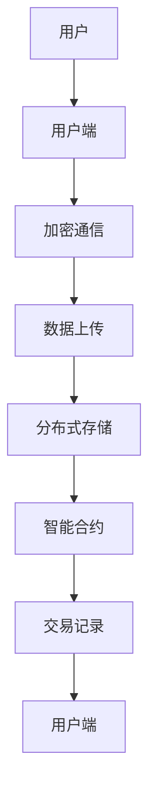

                 

### 背景介绍

#### 互联网社交网络的现状

随着互联网技术的迅猛发展，社交网络已经成为人们日常生活中不可或缺的一部分。从 Facebook、Twitter 到微信、QQ，人们通过社交网络来分享信息、交流思想、建立社交关系。然而，传统的社交网络架构大多集中在中心化的模式下，这意味着所有数据和服务都集中在一个或几个中心服务器上。这种模式带来了几个主要问题：

1. **数据安全风险**：由于数据集中存储，一旦中心服务器受到攻击，所有用户的数据都面临泄露的风险。
2. **隐私保护挑战**：中心化的社交网络常常面临用户隐私泄露的问题，用户数据可以被第三方公司滥用。
3. **内容审查与言论限制**：中心化的平台可能会对某些内容进行审查或限制，影响用户的言论自由。

#### Web3.0 与去中心化社交网络

Web3.0 是下一代互联网的愿景，它强调去中心化、开放性和用户主权。去中心化社交网络（Decentralized Social Network，简称 DSN）是 Web3.0 的重要组成部分，它通过区块链技术和其他分布式计算技术，实现了数据的分布式存储和智能合约的自动化执行。去中心化社交网络的几个关键优势包括：

1. **数据安全**：去中心化的存储方式使得数据更加分散和安全，降低了被攻击的风险。
2. **隐私保护**：用户对自己的数据拥有完全的控制权，可以自主选择是否分享和如何分享。
3. **内容自由**：去中心化的平台不会对用户的内容进行审查，保障了言论自由。

本文将深入探讨去中心化社交网络的核心概念、技术原理、实现方法以及实际应用，以期为读者提供全面的技术指南。

### 核心概念与联系

#### 去中心化社交网络（DSN）的基本概念

去中心化社交网络（Decentralized Social Network，简称 DSN）是一种基于区块链和其他分布式技术的社交网络架构，它通过去中心化的方式来存储和管理用户数据，实现社交网络的去中心化和自主化。去中心化社交网络的核心概念包括：

1. **分布式存储**：数据不是集中存储在一个中心服务器上，而是分布在全球多个节点上。
2. **加密技术**：用户数据在传输和存储过程中使用加密技术，确保数据的安全性和隐私性。
3. **智能合约**：利用智能合约来执行社交网络中的交易和规则，实现自动化和透明化。
4. **用户主权**：用户对自己的数据和内容拥有完全的控制权，可以自由选择分享和访问。

#### 去中心化社交网络的优势

1. **安全性**：去中心化的存储方式使得数据更加分散和安全，降低了被攻击的风险。
2. **隐私性**：用户对自己的数据拥有完全的控制权，可以自主选择是否分享和如何分享。
3. **开放性**：去中心化的平台不会对用户的内容进行审查，保障了言论自由。
4. **经济激励**：用户可以通过参与社交网络的活动来获得奖励，实现经济上的自我激励。

#### Mermaid 流程图

以下是一个简单的 Mermaid 流程图，展示了去中心化社交网络的核心组件和它们之间的联系：



- **A 用户**：社交网络的终端用户，负责发布内容、评论和互动。
- **B 用户端**：用户设备上的客户端应用程序，负责加密通信和数据上传。
- **C 加密通信**：通过加密技术确保用户之间的通信和数据传输安全。
- **D 数据上传**：用户发布的内容和数据被上传到分布式存储网络。
- **E 分布式存储**：数据在全球多个节点上存储，确保数据的安全性和可靠性。
- **F 智能合约**：执行社交网络中的交易和规则，确保数据的正确处理和执行。
- **G 交易记录**：记录社交网络中的所有交易活动，确保透明和不可篡改。
- **H 用户端**：用户通过客户端应用程序查看和交互已上传的数据。

通过这个 Mermaid 流程图，我们可以清晰地看到去中心化社交网络中的核心组件和它们之间的工作流程。每个组件都发挥着重要的作用，共同构成了一个安全、透明、自由的社交网络生态系统。

#### 核心算法原理 & 具体操作步骤

去中心化社交网络（DSN）的核心算法和原理主要涉及区块链技术、加密技术和分布式存储。以下是一步步详细解析这些技术原理和操作步骤。

##### 1. 区块链技术

区块链技术是去中心化社交网络的基础，它通过分布式账本和共识算法实现了数据的去中心化和安全性。

**原理**：
- **分布式账本**：区块链是一个分布式数据库，数据不是存储在单一服务器上，而是分布在网络中的多个节点上。每个节点都保存着完整的账本副本。
- **共识算法**：区块链通过共识算法确保所有节点对数据的认可和一致性。常见的共识算法有工作量证明（Proof of Work，PoW）和权益证明（Proof of Stake，PoS）。

**操作步骤**：
1. **节点加入网络**：用户或服务提供商加入区块链网络，成为节点，获得对账本的访问权限。
2. **数据记录**：节点接收用户上传的数据，并将其打包成交易记录。
3. **交易验证**：节点通过共识算法验证交易的有效性和一致性。
4. **区块生成**：将验证过的交易记录打包成区块，并添加到区块链中。
5. **分布式存储**：每个节点都保存完整的区块链账本，确保数据不丢失和不被篡改。

##### 2. 加密技术

加密技术用于保护用户数据和通信的安全性，包括对称加密、非对称加密和哈希函数。

**原理**：
- **对称加密**：加密和解密使用相同的密钥，如AES算法。
- **非对称加密**：加密和解密使用不同的密钥，如RSA算法。
- **哈希函数**：将数据转换成固定长度的字符串，如SHA-256。

**操作步骤**：
1. **密钥生成**：用户生成一对加密密钥（公钥和私钥）。
2. **数据加密**：用户使用对方的公钥对数据进行加密。
3. **数据解密**：接收方使用自己的私钥对加密数据进行解密。
4. **哈希验证**：使用哈希函数对数据进行校验，确保数据的完整性和一致性。

##### 3. 分布式存储

分布式存储是去中心化社交网络的数据存储机制，通过将数据分散存储在多个节点上，提高了数据的安全性和可靠性。

**原理**：
- **数据分割**：将大文件分割成小块，并分配到不同的节点上存储。
- **冗余存储**：每个数据块在多个节点上备份，确保数据不丢失。
- **去重机制**：检测和去除重复的数据块，节省存储空间。

**操作步骤**：
1. **数据分割**：将用户上传的数据分割成小块。
2. **数据上传**：将数据块上传到网络中的节点。
3. **数据备份**：在每个节点上对数据块进行备份。
4. **数据检索**：用户请求数据时，节点根据备份进行数据检索和传输。

##### 4. 智能合约

智能合约是去中心化社交网络中的自动化规则和交易执行机制，通过区块链上的编程语言编写，确保交易的自动化和透明化。

**原理**：
- **编程语言**：常见的智能合约编程语言有Solidity、Vyper等。
- **交易触发**：智能合约通过触发事件来执行特定的操作。
- **共识执行**：智能合约在区块链上的共识机制下执行，确保交易的不可篡改。

**操作步骤**：
1. **合约编写**：开发者编写智能合约代码，定义交易规则和逻辑。
2. **合约部署**：将智能合约部署到区块链上，公开其接口和地址。
3. **合约调用**：用户通过合约接口发起交易，触发智能合约执行。
4. **结果验证**：交易结果通过共识算法验证，并写入区块链。

通过以上详细解析，我们可以看到去中心化社交网络是如何利用区块链、加密技术和分布式存储等技术实现数据的安全、隐私和去中心化的。这些技术的综合运用，为去中心化社交网络提供了坚实的基础，推动了 Web3.0 的创新实践。

### 数学模型和公式 & 详细讲解 & 举例说明

去中心化社交网络（DSN）的设计和实现涉及多个数学模型和公式，这些模型和公式在保障数据安全性、隐私性和去中心化方面起到了关键作用。在本节中，我们将详细讲解这些数学模型和公式，并通过具体例子来说明它们在实际应用中的意义。

#### 1. 非对称加密算法

非对称加密算法是去中心化社交网络中的核心技术之一，它通过公钥和私钥的配对来实现数据加密和解密。

**数学模型**：
- **加密过程**：设公钥为 \( (n, e) \)，私钥为 \( (n, d) \)，明文为 \( M \)，密文为 \( C \)。加密公式为：
  \[
  C = M^e \mod n
  \]
- **解密过程**：设密文为 \( C \)，私钥为 \( (n, d) \)，明文为 \( M \)。解密公式为：
  \[
  M = C^d \mod n
  \]

**举例说明**：
假设用户 Alice 和 Bob 需要使用非对称加密进行通信。

- **公钥和私钥生成**：
  \[
  n = 35, e = 3, d = 19
  \]
- **加密**：
  \[
  M = 5 \quad \text{（明文）}
  \]
  \[
  C = 5^3 \mod 35 = 15 \quad \text{（密文）}
  \]
- **解密**：
  \[
  M = 15^7 \mod 35 = 5 \quad \text{（明文）}
  \]

通过上述例子，我们可以看到非对称加密算法如何确保数据的保密性，即使密文被拦截，也无法解密出明文内容。

#### 2. 哈希函数

哈希函数用于确保数据的完整性和一致性，常见算法有 SHA-256。

**数学模型**：
- **哈希计算**：设输入为 \( M \)，输出为 \( H(M) \)。
  \[
  H(M) = \text{SHA-256}(M)
  \]

**举例说明**：
假设我们需要计算字符串 "Hello, World!" 的哈希值。

- **哈希计算**：
  \[
  H(M) = \text{SHA-256}("Hello, World!") = 2cf24dba5fb0a30e26e83b2ac5b9e29e1b161e5c1fa7425e730433621b2a4489
  \]

通过哈希函数，我们可以确保数据在传输和存储过程中不被篡改，因为任何微小的改动都会导致哈希值发生巨大变化。

#### 3. 智能合约的数学模型

智能合约是基于数学模型和编程逻辑实现的，常见语言有 Solidity。

**数学模型**：
- **状态转换**：智能合约通过接收输入 \( I \) 和内部状态 \( S \) 进行状态转换，输出新的状态 \( S' \)。
  \[
  S' = f(I, S)
  \]

**举例说明**：
假设有一个简单的智能合约，用于存储和检索数据。

- **合约代码**（Solidity）：
  ```solidity
  contract SimpleStorage {
      mapping(uint => uint) public data;

      function setData(uint x) public {
          data[msg.sender] = x;
      }

      function getData(uint x) public view returns (uint) {
          return data[x];
      }
  }
  ```

- **状态转换**：
  - **设定值**：
    \[
    S' = \{(msg.sender, x)\} \quad \text{（新状态）}
    \]
  - **检索值**：
    \[
    S' = \{data[x]\} \quad \text{（新状态）}
    \]

通过智能合约，我们可以实现自动化和透明的交易和规则执行，确保去中心化社交网络的运行效率和安全。

通过上述数学模型和公式的讲解，我们可以看到去中心化社交网络在保障数据安全性、隐私性和去中心化方面的具体实现方式。这些数学模型不仅提供了理论基础，也为实际应用提供了重要的技术支持。

### 项目实践：代码实例和详细解释说明

在本节中，我们将通过一个实际的去中心化社交网络项目来展示如何使用区块链和智能合约技术构建去中心化社交网络。我们将使用以太坊（Ethereum）区块链平台，以及 Solidity 编程语言来实现这个项目。

#### 开发环境搭建

1. **安装 Node.js 和 npm**：
   - 访问 [Node.js 官网](https://nodejs.org/)，下载并安装 Node.js。
   - 安装 npm，通过命令 `npm install -g npm`。

2. **安装 Truffle**：
   - 使用 npm 安装 Truffle，通过命令 `npm install -g truffle`。

3. **安装 Ganache**：
   - Ganache 是一个本地以太坊节点，用于测试智能合约。访问 [Ganache 官网](https://www.ganache.io/)，下载并安装。

4. **创建项目**：
   - 在终端中创建一个新的 Truffle 项目，通过命令 `truffle init`。
   - 进入项目文件夹，通过命令 `npm install` 安装项目依赖。

5. **配置 Truffle**：
   - 修改 `truffle-config.js` 文件，配置以太坊节点和编译器版本。

```javascript
module.exports = {
  networks: {
    development: {
      host: "127.0.0.1",
      port: 8545,
      network_id: "*",
    },
  },
  compilers: {
    solc: {
      version: "^0.8.0",
    },
  },
};
```

#### 源代码详细实现

以下是一个简单的去中心化社交网络智能合约示例，它允许用户发布和查看帖子。

```solidity
// SPDX-License-Identifier: MIT
pragma solidity ^0.8.0;

contract SocialNetwork {
    mapping(address => bool) public isAdmin;
    mapping(uint256 => Post) public posts;

    struct Post {
        address author;
        string content;
        uint256 timestamp;
    }

    event PostCreated(uint256 id, address author, string content);

    constructor() {
        isAdmin[msg.sender] = true;
    }

    modifier onlyAdmin() {
        require(isAdmin[msg.sender], "Not an admin");
        _;
    }

    function createPost(string memory content) public {
        require(bytes(content).length > 0, "Content cannot be empty");
        posts[msg.sender] = Post(msg.sender, content, block.timestamp);
        emit PostCreated(msg.sender, content);
    }

    function getPostByAddress(address user) public view returns (Post memory) {
        return posts[user];
    }

    function grantAdmin(address user) public onlyAdmin {
        isAdmin[user] = true;
    }
}
```

#### 代码解读与分析

1. **合同结构**：
   - `SocialNetwork` 合同定义了去中心化社交网络的基本功能。
   - 使用 `mapping` 数据结构存储用户地址和是否是管理员的状态。
   - `Post` 结构体定义了帖子包含的信息，如作者、内容、时间戳。

2. **构造函数**：
   - 构造函数初始化合同，将合约创建者设为管理员。

3. **创建帖子**：
   - `createPost` 函数允许用户发布帖子，需要提供有效的帖子内容。

4. **获取帖子**：
   - `getPostByAddress` 函数根据用户地址获取用户的帖子信息。

5. **管理员权限**：
   - `onlyAdmin` 是一个修饰符，确保只有管理员可以执行特定函数。

#### 运行结果展示

1. **部署合约**：
   - 使用 Truffle 部署智能合约到本地以太坊节点。

```bash
$ truffle migrate --network development
```

2. **测试合约**：
   - 使用 Truffle 测试合约代码。

```bash
$ truffle test
```

3. **模拟用户操作**：
   - 使用 MetaMask 钱包模拟用户发布帖子。

```javascript
// 在 MetaMask 中调用 createPost 函数
await socialNetworkContract.createPost("Hello, World!");
```

- 合约将记录用户的帖子，并在事件日志中显示 `PostCreated` 事件。

通过这个简单的示例，我们可以看到如何使用智能合约在去中心化社交网络中实现帖子发布和检索功能。这个示例虽然简单，但展示了去中心化社交网络的核心机制和实现方法。

### 实际应用场景

去中心化社交网络（DSN）凭借其去中心化、安全性和隐私保护的特点，在多个实际应用场景中展现出巨大的潜力。以下是一些典型的应用场景：

#### 1. 内容创作与分发

去中心化社交网络可以打破传统中心化平台对内容创作与分发的垄断，让创作者能够直接与受众互动，减少中间环节，从而获得更多的收益。例如，YouTube 和 Twitter 等传统社交平台对创作者的分成和广告收入分配存在一定的不公平性，而去中心化平台可以采用基于区块链的智能合约来自动化收益分配，确保创作者获得公平的收益。

#### 2. 跨境支付与汇款

区块链技术的去中心化特性使得跨境支付和汇款变得更加高效和低成本。传统跨境支付系统往往需要通过多个中介机构，导致交易速度慢、手续费高。去中心化社交网络可以利用区块链的分布式账本技术，实现实时、透明的跨境支付，大幅降低交易成本和时间。

#### 3. 隐私保护

去中心化社交网络通过加密技术和分布式存储，保护用户的隐私。在传统社交网络中，用户数据容易成为黑客攻击的目标，而去中心化平台上的数据是分散存储的，提高了数据的安全性。此外，用户对数据的控制权也得到了保障，用户可以自主选择是否分享信息，从而有效防止隐私泄露。

#### 4. 去中心化自治组织（DAO）

去中心化社交网络为去中心化自治组织（DAO）提供了技术支持。DAO 是一种基于区块链的分布式组织形式，通过智能合约来实现成员间的投票和决策。去中心化社交网络可以为 DAO 提供一个沟通和协作的平台，成员可以在平台上交流意见、提议和投票，实现去中心化的管理和运作。

#### 5. 虚拟资产交易

去中心化社交网络也为虚拟资产的交易提供了新的途径。通过区块链技术，用户可以方便地买卖数字货币、NFT（非同质化代币）等虚拟资产，而无需通过中心化交易平台，从而减少交易费用，提高交易透明度。

#### 6. 社区治理

去中心化社交网络可以为社区治理提供一种新的模式。通过智能合约和分布式账本技术，社区成员可以参与社区规则的制定和执行，实现去中心化的治理。这种模式可以增强社区的自治能力，促进社区的可持续发展。

#### 7. 医疗记录管理

去中心化社交网络可以用于医疗记录的管理和共享。通过区块链技术，患者可以控制自己的医疗记录，并与医生、保险公司等第三方共享关键信息。这种模式可以提高医疗信息的透明度和安全性，减少医疗欺诈和错误。

通过以上应用场景的探讨，我们可以看到去中心化社交网络在多个领域具有广泛的应用前景。随着技术的不断成熟，去中心化社交网络将为人们的生活和工作带来更多便利和可能性。

### 工具和资源推荐

#### 学习资源推荐

对于想要深入了解去中心化社交网络（DSN）的读者，以下是一些优质的学习资源：

1. **书籍**：
   - 《精通区块链》（Mastering Blockchain）—— 这是一个全面介绍区块链技术和应用的书籍，涵盖了从基础知识到高级应用的各个方面。
   - 《区块链革命》（Blockchain Revolution）—— 该书详细阐述了区块链技术的起源、原理以及在社会、经济等领域的影响。

2. **论文**：
   - "Decentralized Social Networks: A Vision for the Future of Social Media" —— 这篇论文探讨了去中心化社交网络的概念、架构和技术挑战，为读者提供了全面的视角。
   - "On-Demand Content Distribution Using Decentralized Social Networks" —— 该论文研究了去中心化社交网络在内容分发中的应用，为实践提供了理论支持。

3. **博客**：
   - medium.com/ethereum —— 以太坊官方博客，提供了大量关于区块链和去中心化应用的技术文章。
   - blockchain.coursera.org —— Coursera 上的区块链课程博客，提供了丰富的学习资源和实践指导。

4. **网站**：
   - blockchain.org —— 以太坊基金会官方网站，提供了关于以太坊技术的详细文档和教程。
   - truffleframework.com —— Truffle 官方网站，提供了智能合约开发工具和文档。

#### 开发工具框架推荐

在进行去中心化社交网络的开发时，以下工具和框架可以大大提高开发效率和代码质量：

1. **Truffle**：Truffle 是一个用于以太坊智能合约开发、测试和部署的完整平台。它提供了丰富的工具集，包括开发环境、测试框架和部署脚本。

2. **Hardhat**：Hardhat 是一个流行的本地以太坊开发环境，提供了强大的功能，如智能合约调试、测试和本地区块链模拟。它支持 TypeScript，使得开发更加便捷。

3. **Solidity**：Solidity 是以太坊智能合约的主要编程语言。学习 Solidity 是开发去中心化社交网络的基础。Ethereum.org 提供了全面的 Solidity 教程和文档。

4. **Ethers.js**：Ethers.js 是一个用于以太坊 JavaScript API 的库，它提供了处理以太坊网络和智能合约的简单接口。它是前端开发人员用于与以太坊互动的首选库。

5. **Web3.js**：Web3.js 是一个通用的 Web3 API 库，可以用于与任何区块链进行交互。它在浏览器和 Node.js 环境中都表现良好，适用于各种开发场景。

6. **Infura**：Infura 是一个提供即时代码运行环境的云服务，可以方便地进行以太坊智能合约的部署和测试。它是开发者和初创公司的常用选择。

#### 相关论文著作推荐

对于希望深入研究去中心化社交网络技术的读者，以下几篇论文和著作提供了有价值的理论和实践指导：

1. "Decentralized Social Networks: A Survey" —— 该论文对去中心化社交网络的研究进行了全面的综述，分析了现有技术和挑战。

2. "Blockchain for Social Good" —— 这篇论文探讨了区块链技术在非营利组织和公益项目中的应用，包括去中心化社交网络。

3. "Decentralized Autonomous Organizations: Revisiting the Traditional Corporation" —— 该著作详细介绍了 DAO 的概念、架构和应用场景，对理解去中心化治理模式提供了重要参考。

4. "Smart Contracts: Building and Running Programs Outside the Web" —— 这本著作深入探讨了智能合约的原理、设计和实现，是学习智能合约开发的重要资料。

通过上述学习资源和工具推荐，读者可以全面掌握去中心化社交网络的相关知识，并能够在实际项目中灵活运用。

### 总结：未来发展趋势与挑战

去中心化社交网络（DSN）作为 Web3.0 的重要组成部分，展示了其在安全性、隐私性和去中心化方面的显著优势。随着区块链技术的不断成熟，DSN 的应用前景将更加广阔，未来可能带来以下几方面的发展趋势：

1. **更广泛的应用场景**：去中心化社交网络的应用不仅限于社交领域，还将扩展到金融、医疗、教育等多个行业。例如，利用 DSN 实现医疗记录的去中心化管理和跨境支付。

2. **更高的安全性**：随着区块链技术的进步，DSN 的安全性将进一步提高。通过更先进的加密技术和共识算法，DSN 可以更好地保护用户数据和隐私。

3. **更高效的运营模式**：去中心化社交网络通过智能合约实现了运营的自动化和透明化，减少了人工干预，提高了运营效率。

4. **更公平的经济模式**：去中心化社交网络通过加密货币和代币经济激励用户参与，实现收益的公平分配，为用户提供了新的经济机会。

然而，DSN 的发展也面临一些挑战：

1. **技术门槛**：区块链和智能合约技术相对复杂，开发者需要具备一定的技术背景，这对普及 DSN 造成了障碍。

2. **用户体验**：现有的 DSN 产品在用户体验方面与传统的中心化社交网络相比仍存在差距，需要进一步优化和改进。

3. **监管政策**：各国对区块链和加密货币的监管政策不一，这可能会影响 DSN 的发展和应用。

4. **网络安全**：虽然区块链技术在安全性方面有优势，但仍然存在智能合约漏洞和网络攻击的风险。

总之，去中心化社交网络具有巨大的发展潜力，但也面临诸多挑战。随着技术的不断进步和政策的逐渐明确，DSN 将在未来几年迎来快速发展，成为 Web3.0 时代的重要力量。

### 附录：常见问题与解答

#### 1. 去中心化社交网络（DSN）与传统社交网络有什么区别？

DSN 与传统社交网络的主要区别在于其架构和数据管理方式。传统社交网络通常采用中心化架构，数据存储在中心服务器上，用户数据集中管理。而 DSN 采用去中心化架构，数据分布在多个节点上，通过区块链和智能合约进行管理。DSN 具有更高的安全性和隐私性，同时用户对自己的数据拥有更多的控制权。

#### 2. 去中心化社交网络如何保护用户隐私？

去中心化社交网络通过加密技术和分布式存储来保护用户隐私。用户数据在传输和存储过程中使用加密技术，确保数据不被未经授权的第三方访问。此外，数据分布在多个节点上，即使某个节点被攻击，其他节点的数据仍然安全。智能合约则用于确保数据处理的透明性和规范性，防止隐私泄露。

#### 3. 去中心化社交网络是否存在安全漏洞？

去中心化社交网络并非完全没有安全漏洞，但其安全性相对较高。区块链技术本身具有较高的安全性，但智能合约可能会存在漏洞，需要开发者进行严格的代码审查和测试。此外，网络攻击也是威胁 DSN 安全的因素之一，需要不断改进安全防护措施。

#### 4. 如何确保去中心化社交网络的数据一致性？

去中心化社交网络通过共识算法来确保数据的一致性。共识算法使得所有节点对数据的认可保持一致，从而保证了数据的一致性。常见的共识算法包括工作量证明（PoW）和权益证明（PoS）等。通过这些算法，可以确保数据在分布式网络中的正确处理和存储。

#### 5. 去中心化社交网络的经济模型是怎样的？

去中心化社交网络通常采用代币经济模型，通过发行和分配代币来激励用户参与网络。用户可以通过参与社交活动、创建内容或提供服务等获得代币奖励，这些代币可以用于支付费用、购买服务或参与决策。代币经济模型实现了用户价值的变现和公平分配。

#### 6. 去中心化社交网络是否会取代传统社交网络？

去中心化社交网络不会完全取代传统社交网络，而是与之并存。传统社交网络在用户体验、内容分发等方面有优势，而 DSN 在安全性、隐私性和去中心化方面具有明显优势。未来，两者可能会相互借鉴和融合，为用户提供更丰富、更安全的社交体验。

### 扩展阅读 & 参考资料

为了帮助读者更深入地了解去中心化社交网络（DSN）的技术原理和应用，以下是几篇推荐的扩展阅读和参考资料：

1. **“Decentralized Social Networks: A Vision for the Future of Social Media”** —— 这篇论文详细探讨了 DSN 的概念、架构和技术挑战，为读者提供了全面的视角。
2. **“Blockchain for Social Good”** —— 该论文研究了区块链技术在非营利组织和公益项目中的应用，包括去中心化社交网络。
3. **“Decentralized Autonomous Organizations: Revisiting the Traditional Corporation”** —— 这本著作详细介绍了 DAO 的概念、架构和应用场景，对理解去中心化治理模式提供了重要参考。
4. **“Smart Contracts: Building and Running Programs Outside the Web”** —— 这本著作深入探讨了智能合约的原理、设计和实现，是学习智能合约开发的重要资料。
5. **“The Basics of Blockchain Technology”** —— 这篇博客文章为初学者提供了关于区块链技术的基础知识，包括加密、分布式存储和共识算法等。

通过阅读这些资料，读者可以进一步加深对去中心化社交网络的理解，并探索其在未来互联网发展中的潜力。

