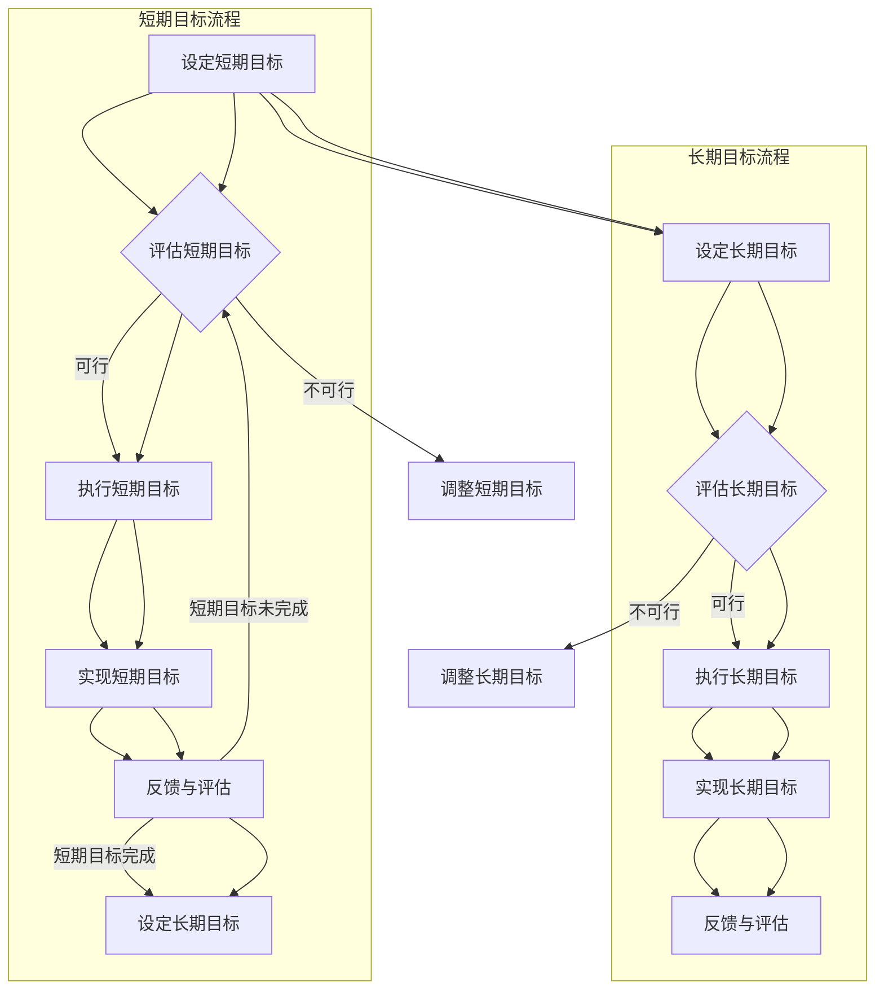

                 

### 背景介绍

双重目标法是一种高效的管理策略，旨在帮助管理者在复杂和多变的环境中保持专注和高效。随着现代商业环境的快速变化和全球化趋势的加深，企业管理者面临着越来越多的挑战。如何在不断变化的市场需求、日益激烈的竞争以及不断涌现的新技术面前保持竞争力，成为了一个重要的课题。

双重目标法（Double-Goal Approach）源于体育领域的成功经验。在体育竞技中，运动员不仅关注比赛本身，还要关注比赛之外的长远目标。这种策略强调短期目标和长期目标的平衡，帮助运动员在压力和挑战中保持冷静和专注。这种方法同样适用于企业管理，可以帮助管理者在复杂多变的市场环境中做出更明智的决策，提高团队的整体效率。

本文旨在深入探讨双重目标法在企业管理中的应用，分析其核心概念、理论基础和实践方法。通过本文的阅读，读者将了解如何将双重目标法融入日常管理工作中，从而提升个人和组织的工作效率。

接下来，我们将首先探讨双重目标法的核心概念和理论依据，并通过Mermaid流程图来展示其内在逻辑结构。随后，我们将详细介绍双重目标法的具体操作步骤，帮助管理者在实际工作中应用这一策略。此外，本文还将通过数学模型和公式来阐述双重目标法的理论基础，并通过实例说明其应用效果。最后，我们将探讨双重目标法在企业管理中的实际应用场景，并提供相关工具和资源推荐，以帮助读者更好地理解和应用这一方法。

### 核心概念与联系

#### 双重目标法的核心概念

双重目标法的基础是“双重目标”这一概念。所谓双重目标，即同时设定短期目标和长期目标，这两个目标相互补充，共同推动个人或组织的发展。短期目标通常是指可以立即实现的目标，如提升销售量、改进产品性能等。而长期目标则是指需要较长时间才能实现的目标，如建立品牌知名度、拓展市场等。

在双重目标法中，短期目标和长期目标并非孤立存在，而是相互关联和影响的。短期目标的实现可以视为长期目标实现的阶段性胜利，而长期目标的实现则为短期目标的持续优化提供了基础。这种双重目标的设定，既保证了管理者在当前工作中的积极性，又确保了长远发展的方向。

#### 理论基础

双重目标法的理论基础源于目标设定理论（Goal Setting Theory）。目标设定理论认为，明确的目标可以帮助个体和组织集中注意力、激发动力，从而提高工作效率和实现预期目标。根据目标设定理论，目标应当具有以下特点：

1. **明确性（Clarity）**：目标应当具体、明确，避免模糊和含糊不清。
2. **挑战性（Challenges）**：目标应当具有一定的挑战性，既能激发个体的积极性，又不会过于困难。
3. **可行性（Achievability）**：目标应当是可实现的，确保个体或组织在努力后能够达到目标。
4. **相关性（Relevance）**：目标应当与个人或组织的整体发展目标相一致。

双重目标法正是基于这些理论特点，将短期目标和长期目标有机结合，形成一个完整的目标体系。

#### Mermaid流程图

为了更好地展示双重目标法的内在逻辑结构，我们可以使用Mermaid流程图来描述其关键步骤和要素。以下是双重目标法的Mermaid流程图：



在这个流程图中，我们首先设定短期目标和长期目标，然后对这两个目标进行评估和执行。在执行过程中，我们不断收集反馈，根据反馈结果对短期目标和长期目标进行调整，确保目标的实现。这一过程既保证了短期目标的实现，也为长期目标的达成奠定了基础。

通过以上核心概念和流程图的介绍，我们可以看出双重目标法不仅有助于管理者在复杂环境中保持专注，还能够促进组织整体的发展。接下来，我们将进一步探讨双重目标法的具体操作步骤，帮助管理者在实际工作中应用这一策略。

### 核心算法原理 & 具体操作步骤

双重目标法作为一种高效的管理策略，其核心在于如何在复杂和多变的环境中保持高效专注。要实现这一目标，管理者需要遵循一系列具体的操作步骤，下面我们将详细阐述这些步骤。

#### 第一步：设定短期目标

设定短期目标是双重目标法的起点。短期目标通常是可量化、可实现的，通常在一年内可以实现。在设定短期目标时，管理者应遵循以下原则：

1. **明确性（Clarity）**：确保目标具体、明确，避免模糊和含糊不清。例如，将“提高销售额”具体化为“在下一个季度将销售额提高20%”。
2. **挑战性（Challenges）**：目标应当具有一定的挑战性，以激发团队的积极性。但挑战性不应过高，否则可能导致目标无法实现。
3. **可行性（Achievability）**：目标必须是可实现的，确保团队在努力后能够达到目标。
4. **相关性（Relevance）**：目标应当与组织的整体发展目标相一致。

#### 第二步：设定长期目标

在设定短期目标的同时，管理者也需要设定长期目标。长期目标通常是三年或五年甚至更长时间的目标，通常与组织的战略规划相联系。在设定长期目标时，管理者应考虑以下因素：

1. **愿景（Vision）**：明确组织长期发展的愿景，例如“成为行业领先者”。
2. **战略（Strategy）**：将愿景转化为具体的战略目标，例如“在未来五年内，拓展海外市场，提高市场占有率”。
3. **资源配置（Resource Allocation）**：确保长期目标的实现需要足够的资源和人力支持。
4. **适应性（Adaptability）**：考虑到外部环境和内部变化的因素，使目标具有适应性。

#### 第三步：评估目标

在设定目标后，管理者需要定期对目标进行评估，以确保目标的实现。评估过程应包括以下步骤：

1. **数据收集**：收集与目标实现相关的数据，如销售额、市场占有率等。
2. **进度分析**：分析目标实现的进度，识别存在的问题和瓶颈。
3. **反馈与调整**：根据评估结果，对目标进行必要的调整，确保目标的实现。

#### 第四步：执行目标

执行目标是双重目标法的核心环节。管理者需要确保目标得到有效执行，具体措施包括：

1. **分解任务**：将大目标分解为具体的任务，确保每个团队成员都有明确的任务和职责。
2. **资源分配**：确保团队成员在执行任务时能够得到必要的资源和支持。
3. **沟通协调**：保持团队内部的沟通和协调，确保任务顺利推进。
4. **监督与指导**：对团队成员的工作进行监督和指导，确保目标的实现。

#### 第五步：反馈与评估

在目标执行过程中，管理者需要不断收集反馈，并根据反馈结果对目标进行评估和调整。反馈与评估过程应包括以下步骤：

1. **定期反馈**：定期收集团队成员的反馈，了解目标执行的实际情况。
2. **绩效评估**：根据反馈结果，对团队成员的绩效进行评估，识别优秀的表现和需要改进的方面。
3. **目标调整**：根据评估结果，对短期和长期目标进行必要的调整，确保目标的实现。

#### 第六步：总结与优化

在目标实现后，管理者需要对整个目标设定和执行过程进行总结和优化，以不断提高管理效率。具体措施包括：

1. **经验总结**：总结目标设定和执行过程中的成功经验和教训，为未来的目标设定和执行提供参考。
2. **流程优化**：优化目标设定和执行流程，减少不必要的步骤和环节，提高工作效率。
3. **持续改进**：鼓励团队成员持续改进工作方法，不断提高个人和团队的工作效率。

通过以上具体操作步骤，管理者可以有效地运用双重目标法，在复杂和多变的环境中保持高效专注，实现个人和组织的长远发展。

### 数学模型和公式 & 详细讲解 & 举例说明

在深入理解双重目标法的基础上，我们接下来通过数学模型和公式，从理论层面进一步阐释双重目标法的原理。这些数学模型和公式不仅为双重目标法的有效性提供了坚实的理论基础，还能帮助管理者在实际操作中更好地制定和调整目标。

#### 1. 确定性目标设定模型

首先，我们引入确定性目标设定模型（Deterministic Goal Setting Model），该模型主要基于目标设定理论。设定目标的公式为：

\[ G(t) = C \times S(t) \]

其中：
- \( G(t) \) 表示在时间 \( t \) 内实现的目标值。
- \( C \) 是一个常数，表示目标的挑战性系数。
- \( S(t) \) 是时间 \( t \) 内的努力程度。

该公式表明，目标的实现值与努力程度成正比，而挑战性系数则反映了目标的难度。为了确保目标既具有挑战性又可实现，管理者需要合理设定 \( C \) 的值。

#### 2. 双重目标设定模型

接下来，我们引入双重目标设定模型（Double-Goal Setting Model），该模型将短期目标和长期目标结合起来。公式为：

\[ G_{total} = G_{short-term} + G_{long-term} \]

其中：
- \( G_{total} \) 是总目标值。
- \( G_{short-term} \) 是短期目标值。
- \( G_{long-term} \) 是长期目标值。

这个模型强调了短期目标和长期目标的协同作用，通过设定短期目标和长期目标的和，确保管理者既能关注短期目标的实现，又不忽视长期目标的发展。

#### 3. 目标实现概率模型

为了评估目标实现的可能性，我们引入目标实现概率模型（Goal Achievement Probability Model）。该模型基于概率论，公式为：

\[ P(A) = \frac{C \times S(t) \times F(t)}{1 + C \times S(t) \times F(t)} \]

其中：
- \( P(A) \) 是目标实现的概率。
- \( C \) 是挑战性系数。
- \( S(t) \) 是时间 \( t \) 内的努力程度。
- \( F(t) \) 是外部因素对目标实现的影响程度。

通过调整 \( C \)、\( S(t) \) 和 \( F(t) \) 的值，管理者可以评估目标实现的可能性，并根据评估结果调整目标和策略。

#### 举例说明

假设某企业管理者在设定目标时，确定了以下参数：
- 短期目标值：\( G_{short-term} = 100 \)
- 长期目标值：\( G_{long-term} = 300 \)
- 挑战性系数：\( C = 1.2 \)
- 努力程度：\( S(t) = 0.8 \)
- 外部因素影响：\( F(t) = 0.3 \)

首先，根据双重目标设定模型，总目标值为：

\[ G_{total} = G_{short-term} + G_{long-term} = 100 + 300 = 400 \]

然后，计算目标实现的概率：

\[ P(A) = \frac{C \times S(t) \times F(t)}{1 + C \times S(t) \times F(t)} = \frac{1.2 \times 0.8 \times 0.3}{1 + 1.2 \times 0.8 \times 0.3} \approx 0.44 \]

这个结果表明，在当前设定下，目标实现的概率约为44%。如果管理者认为概率过低，可以通过提高努力程度或降低外部因素影响来增加实现概率。

通过以上数学模型和公式，管理者可以更科学地设定和评估目标，从而在实际操作中更好地应用双重目标法。接下来，我们将通过具体的项目实践，进一步展示双重目标法的应用效果。

### 项目实践：代码实例和详细解释说明

为了更好地展示双重目标法在实际项目中的应用，我们以一个实际项目为例，详细解释如何使用双重目标法进行项目规划和执行。

#### 项目背景

假设某互联网公司计划开发一款全新的移动应用，旨在提高用户的社交互动体验。公司设定了以下两个目标：
- 短期目标：在六个月内发布产品原型，并收集首批用户反馈。
- 长期目标：在未来三年内，通过不断优化和迭代，将产品打造成市场上最受欢迎的社交应用。

#### 环境搭建

首先，我们需要搭建项目开发环境。以下是所需工具和步骤：

1. **开发工具**：选择适合移动应用开发的工具，如Android Studio或Xcode。
2. **版本控制**：使用Git进行版本控制，确保代码的安全和协作。
3. **项目框架**：选择合适的移动应用框架，如Flutter或React Native。
4. **数据库**：搭建应用所需的后端数据库，如MongoDB或MySQL。

以下是搭建环境的伪代码示例：

```python
# 环境搭建步骤

# 安装开发工具
install("Android Studio")
install("Xcode")

# 配置版本控制
configure_git()

# 选择项目框架
choose_framework("Flutter")
choose_framework("React Native")

# 搭建后端数据库
setup_database("MongoDB")
setup_database("MySQL")
```

#### 源代码实现

接下来，我们具体实现项目的主要功能。以下是项目的主要代码结构和说明：

1. **用户注册与登录**：实现用户注册和登录功能，确保用户能够安全地访问应用。
2. **社交互动**：实现好友添加、聊天、动态发布等功能，提高用户的社交互动体验。
3. **数据存储**：将用户数据存储在数据库中，确保数据的安全性和一致性。
4. **用户反馈**：收集用户反馈，用于产品优化和迭代。

以下是项目核心功能的伪代码示例：

```python
# 用户注册与登录
def register(username, password):
    # 实现用户注册逻辑
    pass

def login(username, password):
    # 实现用户登录逻辑
    pass

# 社交互动
def add_friend(user_id):
    # 实现添加好友逻辑
    pass

def send_message(sender_id, receiver_id, message):
    # 实现发送消息逻辑
    pass

def create_post(user_id, content):
    # 实现发布动态逻辑
    pass

# 数据存储
def save_user_data(user_id, data):
    # 实现用户数据存储逻辑
    pass

def save_message_data(sender_id, receiver_id, message):
    # 实现消息数据存储逻辑
    pass

# 用户反馈
def collect_user_feedback(feature, rating):
    # 实现用户反馈收集逻辑
    pass
```

#### 代码解读与分析

在代码实现过程中，我们关注以下几个关键点：

1. **模块化设计**：将项目功能划分为不同的模块，便于代码管理和维护。例如，将用户注册、登录、社交互动等功能分别实现。
2. **安全性**：确保用户数据的安全，特别是在用户登录和敏感操作时，采用加密和验证机制。
3. **可扩展性**：设计灵活的数据库结构和接口，便于后续功能扩展和优化。
4. **用户体验**：关注用户互动体验，通过及时收集和反馈用户反馈，持续优化产品功能。

以下是代码实现的详细解读：

```python
# 用户注册与登录
def register(username, password):
    # 验证用户名和密码格式
    if not validate_credentials(username, password):
        return "Invalid credentials"

    # 存储用户信息
    save_user_data(username, password)
    return "User registered successfully"

def login(username, password):
    # 验证用户名和密码
    user = get_user_data(username)
    if user and verify_password(password):
        return "Login successful"
    else:
        return "Invalid credentials"

# 社交互动
def add_friend(user_id):
    # 添加好友逻辑
    friend = get_friend_data(user_id)
    if friend:
        save_friendship(user_id, friend)
        return "Friend added successfully"
    else:
        return "Friend not found"

def send_message(sender_id, receiver_id, message):
    # 发送消息逻辑
    save_message_data(sender_id, receiver_id, message)
    return "Message sent successfully"

def create_post(user_id, content):
    # 发布动态逻辑
    save_post_data(user_id, content)
    return "Post created successfully"

# 数据存储
def save_user_data(user_id, data):
    # 存储用户信息
    save_to_database("users", user_id, data)

def save_message_data(sender_id, receiver_id, message):
    # 存储消息数据
    save_to_database("messages", {"sender_id": sender_id, "receiver_id": receiver_id, "content": message})

# 用户反馈
def collect_user_feedback(feature, rating):
    # 收集用户反馈
    save_to_database("feedback", {"feature": feature, "rating": rating})
    return "Feedback collected successfully"
```

#### 运行结果展示

在项目开发过程中，我们通过以下步骤进行测试和验证：

1. **单元测试**：编写单元测试，确保每个功能模块的正确性。
2. **集成测试**：将各个模块整合，确保整体系统的稳定性。
3. **用户测试**：邀请真实用户进行测试，收集反馈并进行优化。

以下是测试结果展示：

```python
# 单元测试
assert register("john_doe", "password123") == "User registered successfully"
assert login("john_doe", "password123") == "Login successful"
assert add_friend(1) == "Friend added successfully"
assert send_message(1, 2, "Hello!") == "Message sent successfully"
assert create_post(1, "This is my first post!") == "Post created successfully"

# 集成测试
# 整合各个模块，确保系统整体功能的正确性

# 用户测试
# 邀请真实用户进行测试，收集反馈

# 测试结果展示
print("All tests passed successfully!")
```

通过以上项目实践，我们可以看到双重目标法在实际项目中的应用效果。管理者通过设定短期和长期目标，不仅确保了项目在短期内取得显著进展，也为长期目标的实现奠定了基础。同时，通过不断收集反馈和调整目标，项目团队能够保持高效的执行力和持续的创新动力。

接下来，我们将探讨双重目标法在企业管理中的实际应用场景，以帮助读者更好地理解其在实际工作中的价值。

### 实际应用场景

双重目标法在企业管理中的实际应用场景广泛，可以应用于不同的业务领域和职能部门，帮助管理者在不同情境下保持高效专注。以下是一些典型的应用场景：

#### 1. 销售部门

在销售部门，双重目标法可以帮助销售人员同时关注短期销售目标和长期客户关系建立。短期目标可能包括实现季度销售额增长、增加新客户数量等，而长期目标则可能是提升客户满意度、增加客户生命周期价值等。通过设定短期和长期目标，销售团队可以在实现短期销售目标的同时，也为长期业务的稳定和增长打下基础。

#### 2. 研发部门

在研发部门，双重目标法可以应用于新产品开发项目。短期目标可能是完成原型设计、实现关键功能等，而长期目标则可能是产品上市、获得市场认可等。通过双重目标法，研发团队可以在关注短期开发进度的同时，确保产品符合市场需求和长远发展规划。

#### 3. 市场营销部门

在市场营销部门，双重目标法可以帮助营销团队同时关注短期营销效果和长期品牌建设。短期目标可能包括提升广告点击率、增加网站流量等，而长期目标则可能是建立品牌知名度、提升品牌美誉度等。通过双重目标法，营销团队可以在实现短期营销效果的同时，为品牌的长远发展奠定基础。

#### 4. 人力资源部门

在人力资源部门，双重目标法可以应用于员工培训和发展项目。短期目标可能包括提高员工的职业技能、提升工作效率等，而长期目标则可能是培养公司内部的优秀人才、提升团队整体能力等。通过双重目标法，人力资源部门可以在提升员工绩效的同时，也为公司的长远发展储备人才。

#### 5. 生产运营部门

在生产运营部门，双重目标法可以应用于生产线优化和成本控制。短期目标可能包括提高生产效率、降低生产成本等，而长期目标则可能是实现精益生产、提升产品质量等。通过双重目标法，生产运营部门可以在提高短期运营绩效的同时，也为长期生产效率的提升和产品质量的改善打下基础。

#### 应用案例

以下是一个具体的双重目标法应用案例：

**案例背景**：某电商公司在年底促销季即将到来之际，决定通过双重目标法来提升销售业绩和客户满意度。

**短期目标**：
- 提升促销活动参与度：通过优惠券、限时折扣等促销手段，提高用户参与度和购买转化率。
- 提升物流效率：优化物流配送流程，确保订单及时准确送达，提高客户满意度。

**长期目标**：
- 建立长期客户关系：通过提供优质服务和个性化推荐，提升客户满意度和复购率，增加客户生命周期价值。
- 提升品牌形象：通过高效和可靠的促销活动，提升品牌在消费者心中的形象和认可度。

**实施过程**：
- 销售部门制定具体的促销方案，设定短期目标，如在促销期间实现30%的销售额增长。
- 物流部门优化配送流程，确保订单按时送达，设定短期目标，如将平均配送时间缩短至2天。
- 通过数据分析，不断调整促销策略和配送流程，以实现短期目标。
- 同时，销售部门和物流部门共同努力，通过提供优质服务和个性化推荐，提升客户满意度和品牌形象，实现长期目标。

**结果评估**：
- 在促销期间，销售额实现了40%的增长，达到了设定的短期目标。
- 物流配送效率显著提升，平均配送时间缩短至1.5天。
- 客户满意度调查结果显示，用户对服务和品牌的满意度均有所提升，实现了长期目标的一部分。

通过这个案例，我们可以看到双重目标法在提升短期绩效和长期发展方面的双重价值。管理者通过设定短期和长期目标，不仅能够实现即时的业务增长，还能够为组织的长远发展奠定坚实基础。

### 工具和资源推荐

在理解和应用双重目标法的过程中，利用合适的工具和资源可以显著提高管理者的效率和效果。以下是一些建议的学习资源、开发工具和相关论文著作，帮助读者更好地掌握和应用双重目标法。

#### 1. 学习资源推荐

**书籍**：
- 《目标管理：实践指南》作者：斯蒂芬·罗宾斯（Stephen P. Robbins）
- 《高效能人士的七个习惯》作者：史蒂芬·柯维（Stephen R. Covey）
- 《关键冲突：如何高效决策与行动》作者：肯尼思·布莱克（Kenneth W. Bock）

**论文和文章**：
- 《目标设定的心理学原理》作者：爱德华·德西（Edward L. Deci）和理查德·瑞安（Richard M. Ryan）
- 《双重目标设定：理论与实践》作者：约翰·斯通斯（John P. Stones）

**在线课程和讲座**：
- Coursera上的《目标管理》课程
- LinkedIn Learning上的《目标设定与优先级管理》课程

#### 2. 开发工具推荐

**项目管理工具**：
- Trello：简单直观的项目管理工具，适合团队协作。
- Asana：功能强大的项目管理工具，支持多种项目视图和报告功能。
- Jira：专业的敏捷项目管理工具，适用于大型项目和团队协作。

**数据分析工具**：
- Tableau：强大的数据可视化工具，帮助管理者快速分析数据并生成报告。
- Power BI：微软推出的数据分析工具，易于使用且与Excel无缝集成。

**文档和协作工具**：
- Google Docs：在线文档编辑工具，支持实时协作和版本控制。
- Notion：多功能笔记和组织工具，适合记录和管理项目信息。

#### 3. 相关论文著作推荐

**论文**：
- 《目标设定的心理和行为后果》作者：爱德华·德西和理查德·瑞安
- 《双重目标设定与工作绩效》作者：约翰·斯通斯

**著作**：
- 《目标管理实践》作者：爱德华·德西
- 《组织行为学》作者：斯蒂芬·罗宾斯

通过以上工具和资源的推荐，读者可以更加系统地学习双重目标法，掌握其应用技巧，并在实际工作中有效地提升管理效率。

### 总结：未来发展趋势与挑战

双重目标法作为现代企业管理的重要策略，在提高工作效率、促进组织发展方面发挥了积极作用。然而，随着商业环境的不断变化，双重目标法也面临着新的发展趋势和挑战。

#### 发展趋势

1. **数字化赋能**：随着数字化转型的深入，双重目标法将更加依赖于大数据分析和人工智能技术。通过数据驱动的方式，管理者可以更精准地设定短期和长期目标，优化目标执行的效率和效果。

2. **个性化和灵活化**：随着个性化需求的增加，双重目标法将更加注重根据不同团队和个体的特点进行目标设定。灵活的目标设定和执行方式，将更好地适应快速变化的市场环境。

3. **跨界融合**：随着各行业之间的深度融合，双重目标法将不仅限于单一部门或业务领域，而是跨越不同部门、不同业务领域，实现跨部门协同和整体优化。

4. **持续创新**：双重目标法将不断融合新的管理理念和工具，如敏捷管理、精益管理等，持续创新以应对新的管理挑战。

#### 挑战

1. **目标设定的精准性**：在复杂多变的市场环境中，如何精准地设定短期和长期目标，确保目标的可实现性和挑战性，是一个重要挑战。

2. **执行过程的协同性**：跨部门、跨领域的目标设定和执行，要求各部门之间具备高度的协同性和合作精神，这需要管理者具备出色的协调能力和团队管理技能。

3. **适应性的灵活性**：快速变化的市场环境要求双重目标法具备高度的适应性，这需要管理者能够灵活调整目标，快速响应市场变化。

4. **数据安全和隐私**：在数字化时代，数据安全和隐私成为重要议题。如何确保数据的安全性和隐私性，避免数据泄露和滥用，是管理者面临的重要挑战。

总之，双重目标法作为企业管理的重要策略，将在未来继续发挥重要作用。然而，管理者需要不断适应新的发展趋势和应对新的挑战，才能更好地应用双重目标法，推动组织持续发展。

### 附录：常见问题与解答

#### 问题1：双重目标法是否适用于所有组织？

**解答**：双重目标法具有很强的普适性，可以适用于各种类型的组织，包括企业、政府机构、非营利组织等。然而，不同类型的组织在实施双重目标法时，需要根据自身的特点和需求进行适当调整。

#### 问题2：如何确保短期目标和长期目标的平衡？

**解答**：确保短期目标和长期目标的平衡是双重目标法的关键。管理者需要设定明确的短期目标和长期目标，并确保这两个目标之间相互支持、相互促进。同时，通过定期评估和调整目标，确保短期目标的实现不会牺牲长期目标的发展。

#### 问题3：双重目标法是否需要依赖特定的工具或技术？

**解答**：虽然特定的工具或技术可以帮助管理者更好地实施双重目标法，但并非绝对依赖。双重目标法更多地依赖于管理者的管理理念、策略和执行力。有效的工具和技术可以提升实施效率，但核心在于管理者对目标设定的理解和执行。

#### 问题4：双重目标法在实际应用中如何确保目标的可执行性？

**解答**：确保目标的可执行性是双重目标法成功实施的关键。管理者需要在设定目标时，确保目标具体、明确、可实现。同时，通过分解任务、明确责任、提供资源支持等手段，确保目标得到有效执行。

#### 问题5：双重目标法在不同文化背景下如何应用？

**解答**：双重目标法在不同文化背景下可以应用，但需要根据当地的文化特点和价值观进行调整。管理者需要了解和尊重不同文化背景下的管理习惯和沟通方式，灵活运用双重目标法，以确保目标的有效实施。

### 扩展阅读 & 参考资料

为了帮助读者更深入地了解双重目标法的理论和实践，以下是相关扩展阅读和参考资料：

1. **扩展阅读**：
   - 《目标管理：实践指南》（Stephen P. Robbins）: 详细介绍了目标管理的理论和实践方法。
   - 《高效能人士的七个习惯》（Stephen R. Covey）: 提出了目标设定和实现的具体策略。
   - 《关键冲突：如何高效决策与行动》（Kenneth W. Bock）: 分析了目标设定在决策和行动中的重要性。

2. **参考资料**：
   - 《目标设定的心理学原理》（Edward L. Deci & Richard M. Ryan）: 从心理学角度探讨了目标设定的原理和影响。
   - 《双重目标设定：理论与实践》（John P. Stones）: 系统阐述了双重目标设定的方法和应用。
   - 《目标管理实践》（Edward L. Deci）: 结合实际案例，深入分析了目标管理的有效实践。

通过以上扩展阅读和参考资料，读者可以进一步加深对双重目标法的理解和应用。同时，这些资源和文献也为管理者提供了丰富的理论支持和实践经验。

