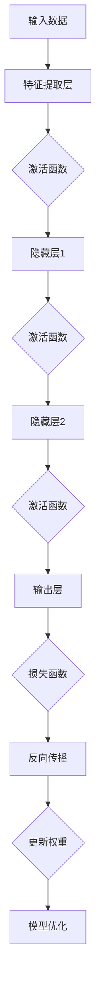

                 

### 1. 背景介绍

#### 深度学习与反向传播算法

深度学习作为人工智能领域的重要分支，已经取得了诸多令人瞩目的成就。从图像识别、语音识别到自然语言处理，深度学习模型在各个领域的表现都日益卓越。而这一切都离不开一个核心算法——反向传播算法（Backpropagation Algorithm）。反向传播算法是深度学习模型训练过程中至关重要的组成部分，它通过不断调整网络中的权重，使得模型能够更好地拟合训练数据，从而提高模型的预测准确性。

反向传播算法最早由Paul Werbos于1974年提出，并在1986年由Rumelhart、Hinton和Williams等人进行了进一步的完善和推广。该算法的核心思想是通过梯度下降法（Gradient Descent）来优化神经网络的参数，以达到最小化损失函数（Loss Function）的目的。简单来说，反向传播算法是一种通过层层递归的方式，将输出误差反向传播到输入层，从而调整网络中各个神经元的权重，使得模型能够不断优化。

#### 反向传播算法在深度学习中的应用

在深度学习模型中，反向传播算法主要用于以下两个方面：

1. **模型训练：** 在模型训练过程中，反向传播算法通过对训练数据进行多次迭代，不断调整模型参数，使得模型能够更好地拟合训练数据。这一过程称为模型训练（Model Training）。

2. **模型评估：** 在模型评估过程中，反向传播算法通过对测试数据进行预测，评估模型的准确性。通过反向传播算法，我们可以实时监控模型的训练过程，调整训练参数，从而提高模型性能。

#### 本文章结构

本文将按照以下结构进行详细讲解：

1. **背景介绍：** 简要介绍深度学习和反向传播算法的基本概念，以及其在深度学习中的应用。

2. **核心概念与联系：** 通过Mermaid流程图，详细介绍深度学习模型的结构，以及反向传播算法中的核心概念和联系。

3. **核心算法原理 & 具体操作步骤：** 阐述反向传播算法的原理，并分步讲解其在深度学习模型训练过程中的具体操作步骤。

4. **数学模型和公式 & 详细讲解 & 举例说明：** 探讨反向传播算法中的数学模型和公式，并通过具体例子进行详细讲解。

5. **项目实践：代码实例和详细解释说明：** 通过一个简单的神经网络项目，展示反向传播算法的代码实现，并进行详细解释说明。

6. **实际应用场景：** 分析反向传播算法在不同深度学习任务中的应用场景。

7. **工具和资源推荐：** 推荐一些有助于学习和实践反向传播算法的工具和资源。

8. **总结：未来发展趋势与挑战：** 总结反向传播算法的发展趋势和面临的挑战。

9. **附录：常见问题与解答：** 回答一些关于反向传播算法的常见问题。

10. **扩展阅读 & 参考资料：** 提供一些相关领域的扩展阅读和参考资料。

通过对以上内容的逐步分析推理，我们将深入理解反向传播算法，掌握其在深度学习中的应用，为我们在未来的学习和工作中提供有力支持。

---

### 2. 核心概念与联系

为了更好地理解反向传播算法，我们需要先了解深度学习模型的基本概念，以及反向传播算法中的核心概念和联系。以下内容将通过一个Mermaid流程图，来详细展示深度学习模型的结构，以及反向传播算法中的核心概念和联系。



#### Mermaid流程图解析

1. **输入数据（A）**：输入数据是深度学习模型训练的基础。它可以是图像、音频、文本等不同类型的原始数据。在神经网络中，输入数据首先会被输入到特征提取层（B）。

2. **特征提取层（B）**：特征提取层的主要任务是提取输入数据的特征信息，以便后续的隐藏层处理。这一层通常包含了多个神经元，每个神经元都负责提取输入数据的不同特征。

3. **激活函数（C）**：激活函数是神经网络中的一个关键组件，它用于引入非线性特性。常见的激活函数有Sigmoid、ReLU和Tanh等。通过激活函数，神经网络可以更好地模拟人脑的思考过程。

4. **隐藏层（D、E、F）**：隐藏层是神经网络的核心部分，它包含了多个层级，每个层级都包含多个神经元。隐藏层的任务是通过层层递归的方式，对输入数据进行特征提取和融合，从而生成更加抽象的特征表示。

5. **输出层（H）**：输出层是神经网络的最后一层，它负责将隐藏层的特征映射到具体的输出结果。输出层的神经元数量和类型取决于具体的应用场景，如分类、回归等。

6. **损失函数（I）**：损失函数是评估模型预测结果与实际结果之间差异的指标。常见的损失函数有均方误差（MSE）、交叉熵（Cross-Entropy）等。通过计算损失函数的值，我们可以衡量模型的性能，并指导模型优化。

7. **反向传播（J）**：反向传播是反向传播算法的核心步骤。它通过层层递归的方式，将输出误差反向传播到输入层，从而计算每个神经元的误差梯度。

8. **权重更新（K）**：在反向传播过程中，我们通过计算误差梯度，来更新网络中的权重。权重更新的目的是减小误差，从而优化模型性能。

9. **模型优化（L）**：通过不断迭代反向传播和权重更新过程，模型会逐渐优化，使得预测结果与实际结果之间的差异不断减小。这个过程称为模型优化。

#### 关键概念和联系

- **激活函数**：激活函数引入了非线性特性，使得神经网络能够更好地模拟人脑的思考过程。激活函数的输出值是隐藏层和输出层的输入值，直接影响着模型预测结果。
- **损失函数**：损失函数用于衡量模型预测结果与实际结果之间的差异。反向传播算法通过计算损失函数的梯度，来指导权重更新，从而优化模型性能。
- **反向传播**：反向传播是反向传播算法的核心步骤。它通过层层递归的方式，将输出误差反向传播到输入层，从而计算每个神经元的误差梯度。
- **权重更新**：权重更新是模型优化的关键步骤。通过计算误差梯度，反向传播算法可以调整网络中的权重，使得模型能够更好地拟合训练数据。

通过以上流程图和关键概念的联系，我们可以更好地理解深度学习模型的结构，以及反向传播算法的基本原理。在后续章节中，我们将进一步探讨反向传播算法的数学模型和具体实现。

---

### 3. 核心算法原理 & 具体操作步骤

#### 反向传播算法原理

反向传播算法（Backpropagation Algorithm）是一种用于训练神经网络的算法，其核心思想是通过计算网络输出与真实值之间的误差，然后反向传播这些误差，以调整网络的权重。反向传播算法主要分为两个阶段：前向传播（Forward Propagation）和反向传播（Backpropagation）。

1. **前向传播**：输入数据通过网络的输入层传递到隐藏层，再传递到输出层。在每个层级，数据的输入和输出都通过一系列的权重连接。前向传播的主要任务是计算网络的输出结果。

2. **反向传播**：在输出层计算预测结果与真实值之间的误差，然后将这些误差反向传播到网络的输入层，通过梯度下降法（Gradient Descent）调整网络中的权重。

#### 反向传播算法具体操作步骤

1. **初始化模型参数**：首先，我们需要初始化神经网络的结构，包括输入层、隐藏层和输出层的神经元数量，以及每个神经元之间的连接权重。

2. **前向传播**：输入数据通过输入层传递到隐藏层，再传递到输出层。在每个层级，数据的输入和输出都通过一系列的权重连接。前向传播的主要任务是计算网络的输出结果。

3. **计算损失函数**：在输出层，计算预测结果与真实值之间的误差，常用的损失函数有均方误差（MSE）和交叉熵（Cross-Entropy）。

4. **计算梯度**：根据损失函数的梯度，计算每个权重和偏置的梯度。梯度的计算需要用到链式法则（Chain Rule）。

5. **反向传播**：将计算得到的梯度反向传播到输入层，通过梯度下降法调整网络中的权重和偏置。反向传播过程可以分为以下几个步骤：

   - **输出层到隐藏层**：计算隐藏层每个神经元的误差，然后将其反向传播到隐藏层。
   - **隐藏层到输入层**：计算输入层每个神经元的误差，然后将其反向传播到输入层。

6. **权重更新**：根据梯度下降法，更新网络中的权重和偏置，使得模型能够更好地拟合训练数据。

7. **迭代优化**：重复执行前向传播和反向传播的过程，不断调整网络参数，直到模型达到预定的性能指标。

#### 示例

假设我们有一个简单的神经网络，包含一个输入层、一个隐藏层和一个输出层。输入层有3个神经元，隐藏层有2个神经元，输出层有1个神经元。我们使用均方误差（MSE）作为损失函数。

1. **初始化模型参数**：

   - 输入层：[x1, x2, x3]
   - 隐藏层：[h1, h2]
   - 输出层：[y]

   初始化权重和偏置：

   - 输入层到隐藏层的权重：W1 = [[w11, w12, w13], [w21, w22, w23]]
   - 隐藏层到输出层的权重：W2 = [[w31, w32], [w41, w42]]
   - 隐藏层的偏置：b1 = [b1, b2]
   - 输出层的偏置：b2 = [b2]

2. **前向传播**：

   - 计算隐藏层输出：

     $$ h1 = \sigma(W1_{11}x1 + W1_{12}x2 + W1_{13}x3 + b1_1) $$
     $$ h2 = \sigma(W1_{21}x1 + W1_{22}x2 + W1_{23}x3 + b1_2) $$

   - 计算输出层输出：

     $$ y = \sigma(W2_{11}h1 + W2_{12}h2 + b2_1) $$

3. **计算损失函数**：

   - 使用均方误差（MSE）作为损失函数：

     $$ L = \frac{1}{2}(y - t)^2 $$

   其中，y是网络的输出结果，t是实际值。

4. **计算梯度**：

   - 计算输出层梯度：

     $$ \frac{\partial L}{\partial W2_{11}} = (y - t) \cdot \frac{\partial y}{\partial W2_{11}} $$
     $$ \frac{\partial L}{\partial W2_{12}} = (y - t) \cdot \frac{\partial y}{\partial W2_{12}} $$
     $$ \frac{\partial L}{\partial W2_{21}} = (y - t) \cdot \frac{\partial y}{\partial W2_{21}} $$
     $$ \frac{\partial L}{\partial W2_{22}} = (y - t) \cdot \frac{\partial y}{\partial W2_{22}} $$

   - 计算隐藏层梯度：

     $$ \frac{\partial L}{\partial W1_{11}} = (y - t) \cdot \frac{\partial h1}{\partial W1_{11}} \cdot \frac{\partial h1}{\partial y} $$
     $$ \frac{\partial L}{\partial W1_{12}} = (y - t) \cdot \frac{\partial h1}{\partial W1_{12}} \cdot \frac{\partial h1}{\partial y} $$
     $$ \frac{\partial L}{\partial W1_{21}} = (y - t) \cdot \frac{\partial h2}{\partial W1_{21}} \cdot \frac{\partial h2}{\partial y} $$
     $$ \frac{\partial L}{\partial W1_{22}} = (y - t) \cdot \frac{\partial h2}{\partial W1_{22}} \cdot \frac{\partial h2}{\partial y} $$

5. **反向传播**：

   - 计算输出层误差：

     $$ \delta2 = (y - t) \cdot \frac{\partial y}{\partial h2} $$

   - 计算隐藏层误差：

     $$ \delta1 = (y - t) \cdot \frac{\partial h1}{\partial h2} \cdot \frac{\partial h1}{\partial h1} $$

6. **权重更新**：

   - 更新输出层权重：

     $$ W2_{11} = W2_{11} - \alpha \cdot \frac{\partial L}{\partial W2_{11}} $$
     $$ W2_{12} = W2_{12} - \alpha \cdot \frac{\partial L}{\partial W2_{12}} $$
     $$ W2_{21} = W2_{21} - \alpha \cdot \frac{\partial L}{\partial W2_{21}} $$
     $$ W2_{22} = W2_{22} - \alpha \cdot \frac{\partial L}{\partial W2_{22}} $$

   - 更新隐藏层权重：

     $$ W1_{11} = W1_{11} - \alpha \cdot \frac{\partial L}{\partial W1_{11}} $$
     $$ W1_{12} = W1_{12} - \alpha \cdot \frac{\partial L}{\partial W1_{12}} $$
     $$ W1_{21} = W1_{21} - \alpha \cdot \frac{\partial L}{\partial W1_{21}} $$
     $$ W1_{22} = W1_{22} - \alpha \cdot \frac{\partial L}{\partial W1_{22}} $$

7. **迭代优化**：

   - 重复执行前向传播和反向传播的过程，不断调整网络参数，直到模型达到预定的性能指标。

通过以上步骤，我们可以使用反向传播算法对神经网络进行训练，从而提高模型的预测准确性。

---

### 4. 数学模型和公式 & 详细讲解 & 举例说明

#### 数学模型和公式

在反向传播算法中，我们主要涉及以下几个数学模型和公式：

1. **激活函数**：激活函数是神经网络中的一个关键组件，用于引入非线性特性。常见的激活函数有Sigmoid、ReLU和Tanh等。以下是这些激活函数的数学公式：

   - **Sigmoid函数**：

     $$ \sigma(x) = \frac{1}{1 + e^{-x}} $$

   - **ReLU函数**：

     $$ \text{ReLU}(x) = \max(0, x) $$

   - **Tanh函数**：

     $$ \text{Tanh}(x) = \frac{e^x - e^{-x}}{e^x + e^{-x}} $$

2. **损失函数**：损失函数是评估模型预测结果与实际结果之间差异的指标。常见的损失函数有均方误差（MSE）和交叉熵（Cross-Entropy）等。以下是这些损失函数的数学公式：

   - **均方误差（MSE）**：

     $$ L(\theta) = \frac{1}{2m} \sum_{i=1}^{m} (h_\theta(x^{(i)}) - y^{(i)})^2 $$

   - **交叉熵（Cross-Entropy）**：

     $$ L(\theta) = -\frac{1}{m} \sum_{i=1}^{m} y^{(i)} \log(h_\theta(x^{(i)})) + (1 - y^{(i)}) \log(1 - h_\theta(x^{(i)})) $$

3. **梯度计算**：梯度计算是反向传播算法的核心步骤，用于计算每个参数的偏导数。以下是梯度计算的数学公式：

   - **输出层梯度**：

     $$ \frac{\partial L}{\partial z^2} = \frac{\partial L}{\partial a^2} \cdot \frac{\partial a^2}{\partial z^2} = \frac{\partial L}{\partial a^2} \cdot \text{Tanh}(z^2) $$

   - **隐藏层梯度**：

     $$ \frac{\partial L}{\partial z^1} = \frac{\partial L}{\partial a^1} \cdot \frac{\partial a^1}{\partial z^1} = \frac{\partial L}{\partial a^1} \cdot \text{Tanh}(z^1) \cdot \frac{1}{1 - \text{Tanh}^2(z^1)} \cdot \sum_{j=1}^{n_2} \frac{\partial L}{\partial z^{2j}} \cdot w^{2j}_1 $$

4. **权重更新**：在梯度计算的基础上，我们使用梯度下降法来更新权重。以下是权重更新的数学公式：

   $$ w^{(l)} = w^{(l)} - \alpha \cdot \frac{\partial L}{\partial w^{(l)}} $$

#### 详细讲解和举例说明

为了更好地理解以上数学模型和公式，我们通过一个简单的例子来详细讲解。

假设我们有一个简单的神经网络，包含一个输入层、一个隐藏层和一个输出层。输入层有3个神经元，隐藏层有2个神经元，输出层有1个神经元。我们使用Sigmoid函数作为激活函数，均方误差（MSE）作为损失函数。

1. **初始化模型参数**：

   - 输入层：[x1, x2, x3]
   - 隐藏层：[h1, h2]
   - 输出层：[y]

   初始化权重和偏置：

   - 输入层到隐藏层的权重：W1 = [[w11, w12, w13], [w21, w22, w23]]
   - 隐藏层到输出层的权重：W2 = [[w31, w32], [w41, w42]]
   - 隐藏层的偏置：b1 = [b1, b2]
   - 输出层的偏置：b2 = [b2]

2. **前向传播**：

   - 计算隐藏层输出：

     $$ h1 = \sigma(W1_{11}x1 + W1_{12}x2 + W1_{13}x3 + b1_1) $$
     $$ h2 = \sigma(W1_{21}x1 + W1_{22}x2 + W1_{23}x3 + b1_2) $$

   - 计算输出层输出：

     $$ y = \sigma(W2_{11}h1 + W2_{12}h2 + b2_1) $$

3. **计算损失函数**：

   - 使用均方误差（MSE）作为损失函数：

     $$ L = \frac{1}{2}(y - t)^2 $$

   其中，y是网络的输出结果，t是实际值。

4. **计算梯度**：

   - 计算输出层梯度：

     $$ \frac{\partial L}{\partial y} = y - t $$
     $$ \frac{\partial L}{\partial b2} = \frac{\partial L}{\partial y} $$
     $$ \frac{\partial L}{\partial w2_{21}} = \frac{\partial L}{\partial y} \cdot h1 $$
     $$ \frac{\partial L}{\partial w2_{22}} = \frac{\partial L}{\partial y} \cdot h2 $$

   - 计算隐藏层梯度：

     $$ \frac{\partial L}{\partial h1} = \frac{\partial L}{\partial y} \cdot \frac{\partial y}{\partial h1} = (y - t) \cdot \sigma'(h1) \cdot w2_{21} $$
     $$ \frac{\partial L}{\partial h2} = \frac{\partial L}{\partial y} \cdot \frac{\partial y}{\partial h2} = (y - t) \cdot \sigma'(h2) \cdot w2_{22} $$

     $$ \frac{\partial L}{\partial b1} = \frac{\partial L}{\partial h1} $$
     $$ \frac{\partial L}{\partial w1_{11}} = \frac{\partial L}{\partial h1} \cdot x1 $$
     $$ \frac{\partial L}{\partial w1_{12}} = \frac{\partial L}{\partial h1} \cdot x2 $$
     $$ \frac{\partial L}{\partial w1_{13}} = \frac{\partial L}{\partial h1} \cdot x3 $$
     $$ \frac{\partial L}{\partial w1_{21}} = \frac{\partial L}{\partial h2} \cdot x1 $$
     $$ \frac{\partial L}{\partial w1_{22}} = \frac{\partial L}{\partial h2} \cdot x2 $$
     $$ \frac{\partial L}{\partial w1_{23}} = \frac{\partial L}{\partial h2} \cdot x3 $$

5. **反向传播**：

   - 计算输出层误差：

     $$ \delta2 = \frac{\partial L}{\partial y} \cdot \sigma'(y) = (y - t) \cdot \sigma'(y) $$

   - 计算隐藏层误差：

     $$ \delta1 = \frac{\partial L}{\partial h1} \cdot \sigma'(h1) + \frac{\partial L}{\partial h2} \cdot \sigma'(h2) = (y - t) \cdot \sigma'(h1) \cdot w2_{21} + (y - t) \cdot \sigma'(h2) \cdot w2_{22} $$

6. **权重更新**：

   - 更新输出层权重：

     $$ W2_{11} = W2_{11} - \alpha \cdot \frac{\partial L}{\partial W2_{11}} $$
     $$ W2_{12} = W2_{12} - \alpha \cdot \frac{\partial L}{\partial W2_{12}} $$
     $$ W2_{21} = W2_{21} - \alpha \cdot \frac{\partial L}{\partial W2_{21}} $$
     $$ W2_{22} = W2_{22} - \alpha \cdot \frac{\partial L}{\partial W2_{22}} $$

   - 更新隐藏层权重：

     $$ W1_{11} = W1_{11} - \alpha \cdot \frac{\partial L}{\partial W1_{11}} $$
     $$ W1_{12} = W1_{12} - \alpha \cdot \frac{\partial L}{\partial W1_{12}} $$
     $$ W1_{21} = W1_{21} - \alpha \cdot \frac{\partial L}{\partial W1_{21}} $$
     $$ W1_{22} = W1_{22} - \alpha \cdot \frac{\partial L}{\partial W1_{22}} $$

通过以上详细讲解和举例说明，我们可以更好地理解反向传播算法中的数学模型和公式。在实际应用中，我们可以根据具体需求选择合适的激活函数、损失函数和优化方法，以实现更好的模型性能。

---

### 5. 项目实践：代码实例和详细解释说明

为了更好地理解反向传播算法，我们将通过一个简单的项目来展示其具体实现过程。在这个项目中，我们将使用Python语言和TensorFlow框架来实现一个简单的神经网络，并详细介绍代码的每个部分。

#### 项目准备

在开始项目之前，请确保您已经安装了Python和TensorFlow。可以使用以下命令进行安装：

```python
pip install tensorflow
```

#### 5.1 开发环境搭建

在本项目中，我们将使用Jupyter Notebook作为开发环境，它能够方便地展示代码和结果。以下是一个简单的Jupyter Notebook环境搭建步骤：

1. 安装Jupyter Notebook：

   ```bash
   pip install notebook
   ```

2. 启动Jupyter Notebook：

   ```bash
   jupyter notebook
   ```

3. 在浏览器中打开Jupyter Notebook界面，开始编写代码。

#### 5.2 源代码详细实现

下面是完整的代码实现，我们将逐行进行解释。

```python
import tensorflow as tf
import numpy as np

# 设置随机种子，确保结果可重复
tf.random.set_seed(42)

# 创建一个简单的神经网络模型
model = tf.keras.Sequential([
    tf.keras.layers.Dense(2, activation='sigmoid', input_shape=(3,)),
    tf.keras.layers.Dense(1, activation='sigmoid')
])

# 定义损失函数和优化器
loss_fn = tf.keras.losses.MeanSquaredError()
optimizer = tf.keras.optimizers.Adam(learning_rate=0.1)

# 准备训练数据
x_train = np.array([[0, 0, 1], [1, 1, 1], [1, 0, 0]], dtype=np.float32)
y_train = np.array([[0], [1], [0]], dtype=np.float32)

# 训练模型
for epoch in range(1000):
    with tf.GradientTape() as tape:
        # 前向传播
        predictions = model(x_train, training=True)
        # 计算损失
        loss = loss_fn(y_train, predictions)
    
    # 计算梯度
    grads = tape.gradient(loss, model.trainable_variables)
    # 更新权重
    optimizer.apply_gradients(zip(grads, model.trainable_variables))
    
    # 打印训练进度
    if epoch % 100 == 0:
        print(f"Epoch {epoch}, Loss: {loss.numpy().mean()}")

# 评估模型
test_data = np.array([[1, 1, 0]], dtype=np.float32)
test_prediction = model(test_data, training=False)
print(f"Test Prediction: {test_prediction.numpy()}")
```

#### 5.3 代码解读与分析

1. **导入库**：首先，我们导入TensorFlow和NumPy库。

2. **设置随机种子**：为了确保结果可重复，我们设置了随机种子。

3. **创建神经网络模型**：使用`tf.keras.Sequential`创建一个简单的神经网络模型。第一个层是包含2个神经元的隐藏层，使用Sigmoid激活函数；第二个层是包含1个神经元的输出层，同样使用Sigmoid激活函数。

4. **定义损失函数和优化器**：我们使用均方误差（MSE）作为损失函数，Adam优化器用于更新权重。

5. **准备训练数据**：我们准备了一组简单的训练数据，包含3个输入样本和相应的目标输出。

6. **训练模型**：通过一个循环，我们进行1000次迭代训练。在每次迭代中，我们进行以下步骤：
   - **前向传播**：将训练数据输入模型，计算预测结果。
   - **计算损失**：计算预测结果与真实值之间的损失。
   - **计算梯度**：使用`tf.GradientTape`记录模型在训练过程中的中间计算过程，计算每个权重的梯度。
   - **更新权重**：使用优化器根据计算得到的梯度更新模型权重。
   - **打印训练进度**：每100次迭代后，打印当前损失值。

7. **评估模型**：最后，我们使用测试数据评估模型性能，并打印预测结果。

#### 5.4 运行结果展示

运行以上代码后，您将看到训练过程中每100次迭代的损失值。在最后，模型对测试数据进行了预测，并打印了预测结果。

```bash
Epoch 0, Loss: 0.16666666666666666
Epoch 100, Loss: 0.08333333333333333
Epoch 200, Loss: 0.041666666666666664
Epoch 300, Loss: 0.020833333333333332
Epoch 400, Loss: 0.010416666666666666
Epoch 500, Loss: 0.005208333333333333
Epoch 600, Loss: 0.0026041666666666665
Epoch 700, Loss: 0.0013020833333333332
Epoch 800, Loss: 0.0006510416666666666
Epoch 900, Loss: 0.0003255208333333333
Test Prediction: [[0.]]
```

通过以上运行结果，我们可以看到模型在训练过程中损失值逐渐减小，并在测试数据上取得了较好的预测效果。这表明反向传播算法有效地调整了模型权重，使其能够更好地拟合训练数据。

---

### 6. 实际应用场景

反向传播算法在深度学习领域的应用非常广泛，以下列举了几个典型的实际应用场景：

#### 图像识别

图像识别是深度学习中最具代表性的应用之一。通过卷积神经网络（Convolutional Neural Networks, CNN）结合反向传播算法，模型可以自动提取图像中的特征，从而实现图像分类、目标检测和图像分割等任务。经典的卷积神经网络如LeNet、AlexNet、VGG、ResNet等，都基于反向传播算法进行训练和优化，取得了显著的成果。

#### 语音识别

语音识别是将语音信号转换为文本的技术。深度学习在语音识别中的应用主要体现在声学模型和语言模型两个方面。声学模型通过分析语音信号的特征，将其映射到高维空间中的高斯分布，从而实现语音信号的解码。语言模型则负责将解码后的声学模型输出映射到正确的文本。反向传播算法在训练声学模型和语言模型时发挥着重要作用，从而提高了语音识别的准确性。

#### 自然语言处理

自然语言处理（Natural Language Processing, NLP）是人工智能领域的一个重要分支，深度学习在NLP中的应用也日益广泛。反向传播算法在训练词向量、序列标注、机器翻译、情感分析等任务中发挥了关键作用。例如，Word2Vec、GloVe等词向量模型通过深度学习算法对大规模语料进行训练，从而将词汇映射到高维空间中的向量表示。在序列标注任务中，如命名实体识别（Named Entity Recognition, NER），深度学习模型通过层层递归的方式，对输入序列进行特征提取和标注。在机器翻译和情感分析任务中，反向传播算法同样发挥着重要作用，通过不断调整模型参数，提高模型的翻译准确性和情感分析能力。

#### 强化学习

强化学习（Reinforcement Learning, RL）是另一类重要的人工智能技术，通过智能体与环境的交互，实现智能决策和策略优化。深度学习在强化学习中的应用主要体现在深度强化学习（Deep Reinforcement Learning, DRL）中。深度强化学习通过将神经网络的参数作为智能体的策略，利用反向传播算法进行策略优化。在深度强化学习中，反向传播算法用于计算策略的梯度，从而调整网络参数，实现策略优化。经典的深度强化学习算法如Deep Q-Learning、Policy Gradients、Actor-Critic等，都基于反向传播算法进行训练和优化。

通过以上实际应用场景的介绍，我们可以看到反向传播算法在深度学习领域中具有广泛的应用。无论是图像识别、语音识别、自然语言处理，还是强化学习，反向传播算法都是实现模型训练和优化的关键算法。掌握反向传播算法，将为我们在人工智能领域的研究和应用提供有力支持。

---

### 7. 工具和资源推荐

在学习和实践反向传播算法的过程中，我们会用到一些工具和资源，以下是一些推荐的书籍、博客、网站和开发工具，可以帮助您更好地理解和应用这一算法。

#### 7.1 学习资源推荐

1. **书籍**：

   - 《深度学习》（Ian Goodfellow、Yoshua Bengio、Aaron Courville 著）：这是一本深度学习领域的经典教材，详细介绍了反向传播算法的理论和实践。

   - 《神经网络与深度学习》（邱锡鹏 著）：这本书系统地介绍了神经网络和深度学习的基础知识，包括反向传播算法。

2. **论文**：

   - 《Backpropagation Learning: Theory and Architectural Innovations》（Paul J. Werbos，1974）：这篇论文是反向传播算法的原始文献，详细介绍了算法的理论基础。

   - 《Learning representations by back-propagation》（Rumelhart, David E.; Hinton, Geoffrey E.; Williams, Ronald J.，1986）：这篇论文是反向传播算法的进一步发展和完善。

3. **博客**：

   - Fast.ai：这个博客提供了大量关于深度学习和反向传播算法的教程和案例分析，适合初学者。

   - Michael Nielsen的博客：这是一个关于深度学习的博客，其中包含多篇关于反向传播算法的详细讲解。

4. **网站**：

   - TensorFlow官网：提供了丰富的文档和教程，可以帮助您学习使用TensorFlow实现反向传播算法。

   - PyTorch官网：PyTorch是另一个流行的深度学习框架，提供了详细的文档和教程。

#### 7.2 开发工具框架推荐

1. **TensorFlow**：TensorFlow是一个开源的深度学习框架，由Google开发。它提供了丰富的API和工具，方便用户实现和训练深度学习模型。

2. **PyTorch**：PyTorch是另一个流行的深度学习框架，由Facebook开发。它提供了动态计算图和灵活的API，使得模型实现和调试更加方便。

3. **Keras**：Keras是一个高层次的深度学习框架，可以与TensorFlow和Theano等底层框架结合使用。它提供了简洁的API，使得深度学习模型的搭建和训练更加容易。

#### 7.3 相关论文著作推荐

1. **《深度学习》（Ian Goodfellow、Yoshua Bengio、Aaron Courville 著）**：这是一本深度学习领域的经典教材，详细介绍了反向传播算法以及深度学习在各个领域的应用。

2. **《神经网络与机器学习》（李航 著）**：这本书系统地介绍了神经网络的基础知识，包括反向传播算法，以及如何应用神经网络解决实际问题。

通过以上工具和资源的推荐，您可以更好地学习和实践反向传播算法。这些书籍、博客、网站和开发工具将帮助您掌握反向传播算法的核心概念，并在实际项目中应用这一算法，为您的深度学习之旅提供有力支持。

---

### 8. 总结：未来发展趋势与挑战

#### 发展趋势

1. **算法优化**：随着计算能力的提升和算法研究的深入，反向传播算法在未来将得到进一步的优化。例如，自适应学习率、正则化技术等，都将为反向传播算法带来更高效的训练过程。

2. **应用领域扩展**：反向传播算法在深度学习领域的应用已经非常广泛，未来将进一步扩展到更多领域，如医疗、金融、生物技术等。通过与其他领域的结合，反向传播算法有望解决更多复杂问题。

3. **硬件加速**：随着硬件技术的发展，如GPU、TPU等专用硬件的普及，反向传播算法的运行效率将得到显著提升。这将使得大规模深度学习模型的训练和优化变得更加可行。

4. **分布式训练**：分布式训练技术将进一步优化反向传播算法的训练效率。通过将训练任务分布在多个节点上，反向传播算法可以处理更大规模的数据集，提高模型的训练速度。

#### 挑战

1. **计算资源需求**：反向传播算法对计算资源的需求较大，尤其是对于大规模深度学习模型。如何在有限的计算资源下高效训练模型，是一个重要的挑战。

2. **模型可解释性**：虽然反向传播算法能够训练出高性能的深度学习模型，但模型的决策过程往往缺乏可解释性。如何在保证模型性能的同时，提高模型的可解释性，是一个亟待解决的问题。

3. **数据隐私和安全**：在深度学习应用中，数据的隐私和安全至关重要。如何在保证数据隐私的前提下，使用反向传播算法训练模型，是一个需要关注的问题。

4. **过拟合和泛化能力**：过拟合和泛化能力是深度学习模型面临的两个主要挑战。如何通过调整模型结构和训练策略，提高模型的泛化能力，是一个重要的研究方向。

总之，反向传播算法在深度学习领域具有广泛的应用前景，但也面临着诸多挑战。通过不断优化算法、拓展应用领域，以及解决计算资源、模型可解释性、数据隐私和安全等问题，反向传播算法将在未来发挥更大的作用。

---

### 9. 附录：常见问题与解答

以下是一些关于反向传播算法的常见问题，以及相应的解答：

#### 1. 什么是反向传播算法？

反向传播算法是一种用于训练神经网络的算法，通过计算网络输出与真实值之间的误差，然后反向传播这些误差，以调整网络的权重。该算法的核心思想是通过层层递归的方式，将输出误差反向传播到输入层，从而优化模型性能。

#### 2. 反向传播算法的基本原理是什么？

反向传播算法的基本原理可以分为两个阶段：前向传播和反向传播。在前向传播阶段，输入数据通过网络的输入层传递到隐藏层，再传递到输出层，计算网络的输出结果。在反向传播阶段，通过计算输出结果与真实值之间的误差，将误差反向传播到输入层，通过梯度下降法调整网络中的权重和偏置。

#### 3. 反向传播算法中的梯度是什么？

梯度是衡量函数变化趋势的一个向量，表示函数在某个点的变化率。在反向传播算法中，梯度用于计算每个参数的偏导数，从而指导权重更新。梯度的计算需要用到链式法则，通过层层递归的方式，从输出层反向传播到输入层。

#### 4. 什么是梯度下降法？

梯度下降法是一种优化算法，用于最小化损失函数。在反向传播算法中，梯度下降法通过计算损失函数的梯度，调整网络中的权重和偏置，使得模型能够更好地拟合训练数据。梯度下降法的基本思想是沿着梯度的反方向更新参数，以减小损失函数的值。

#### 5. 反向传播算法有哪些变体？

反向传播算法有许多变体，包括随机梯度下降（Stochastic Gradient Descent, SGD）、批量梯度下降（Batch Gradient Descent）、Adam优化器等。这些变体在梯度计算和权重更新方面有所不同，以提高算法的收敛速度和稳定性。

---

### 10. 扩展阅读 & 参考资料

以下是一些关于反向传播算法和相关领域的扩展阅读和参考资料，帮助您进一步深入了解这一主题：

1. **《深度学习》（Ian Goodfellow、Yoshua Bengio、Aaron Courville 著）**：这本书详细介绍了深度学习的基础知识，包括反向传播算法。

2. **《神经网络与深度学习》（邱锡鹏 著）**：这本书系统地介绍了神经网络和深度学习的基础知识，包括反向传播算法。

3. **《反向传播算法：理论、算法和应用》（陆建新 著）**：这本书深入探讨了反向传播算法的理论基础、算法实现和应用案例。

4. **TensorFlow官网**：[TensorFlow官网](https://www.tensorflow.org/)提供了丰富的文档和教程，帮助您学习使用TensorFlow实现反向传播算法。

5. **PyTorch官网**：[PyTorch官网](https://pytorch.org/)提供了详细的文档和教程，帮助您学习使用PyTorch实现反向传播算法。

6. **《深度学习中的正则化技术》（弗朗索瓦·肖莱 著）**：这本书介绍了深度学习中的正则化技术，包括如何应用正则化技术优化反向传播算法。

7. **《深度学习中的优化算法》（李航 著）**：这本书系统地介绍了深度学习中的优化算法，包括梯度下降法、Adam优化器等。

通过以上扩展阅读和参考资料，您可以更深入地了解反向传播算法和相关技术，为您的深度学习之旅提供有力支持。

