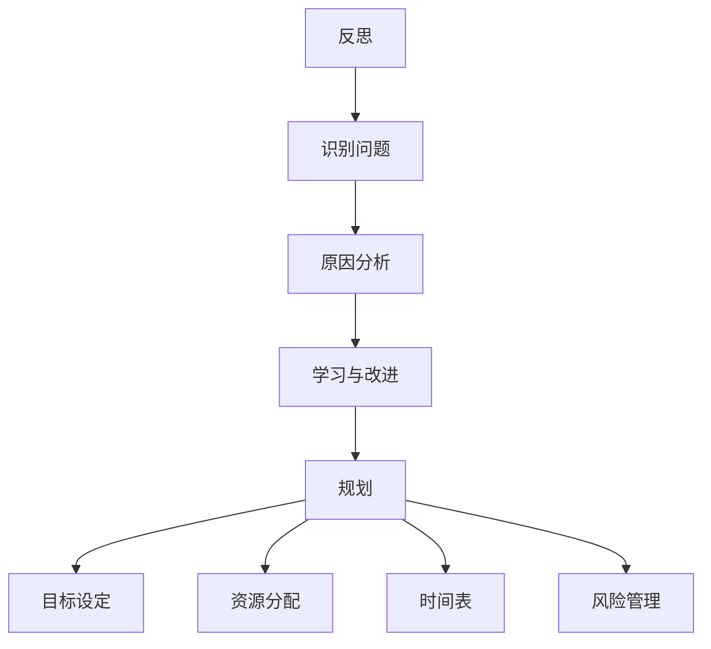

                 

### 文章标题

**反思与规划的综合应用案例**

> 关键词：反思、规划、综合应用、案例分析、项目实践

> 摘要：本文将探讨反思与规划在IT领域的重要性和实际应用，通过一个具体的项目案例，详细解析如何通过反思和规划提高项目效率和质量，为读者提供一个实用的技术指南。

### 1. 背景介绍

在现代IT行业中，项目管理和软件开发是一项复杂的任务。随着项目规模的扩大和复杂度的增加，如何在众多挑战中保持高效和高质量成为了一个关键问题。反思和规划在这个过程中扮演着至关重要的角色。

**反思**是一种回顾和审视过去行为、决策和实践的过程，它帮助我们了解哪些做得好，哪些需要改进。通过反思，团队能够从错误中学习，优化流程，提高工作效率。

**规划**则是提前设想和安排项目的过程，包括确定目标、分配资源、制定时间表和风险管理等。一个良好的规划能够帮助团队在项目过程中保持方向，降低风险，提高成功的可能性。

本文将通过一个具体的项目案例，深入探讨如何结合反思和规划，实现项目的成功。

#### 1.1 项目案例背景

假设我们有一个软件开发项目，目标是开发一个企业级客户关系管理（CRM）系统。这个项目涉及到多个团队，包括前端开发、后端开发、数据库设计和测试等。项目周期为六个月，预算有限，时间紧迫。

项目的目标是：
1. 提供一个用户友好的界面，让销售人员能够轻松管理客户信息。
2. 实现客户信息的实时同步，确保数据的准确性和一致性。
3. 提供强大的报表和分析功能，帮助管理层做出数据驱动的决策。

#### 1.2 项目挑战

在这个项目中，我们面临以下挑战：

1. **需求多变**：客户的需求经常发生变化，如何快速响应并保持系统的一致性和稳定性是一个挑战。
2. **资源有限**：项目预算有限，如何在有限的资源下完成高质量的软件是一个难题。
3. **团队协作**：涉及多个团队和部门，如何确保高效的沟通和协作是一个关键问题。
4. **技术选型**：如何在众多技术选项中做出最佳选择，以实现项目的目标。

接下来，我们将详细探讨如何通过反思和规划来解决这些挑战。

### 2. 核心概念与联系

为了更好地理解反思和规划在项目中的应用，我们需要先明确几个核心概念，并展示它们之间的联系。

#### 2.1 反思

反思是一个回顾和审视过去行为的过程。它包括以下几个方面：

1. **识别问题**：通过分析项目的各个阶段，找出存在的问题和瓶颈。
2. **原因分析**：深入挖掘问题的根本原因，而不是仅仅停留在表面。
3. **学习与改进**：从问题中学习，制定改进措施，避免类似问题再次发生。

#### 2.2 规划

规划是提前设想和安排项目的过程。它包括以下几个方面：

1. **目标设定**：明确项目的目标，确保团队朝同一方向努力。
2. **资源分配**：合理分配人力、时间和预算等资源，确保项目顺利推进。
3. **时间表**：制定详细的时间表，确保项目按计划进行。
4. **风险管理**：识别潜在的风险，制定相应的应对措施。

#### 2.3 核心概念与联系

反思和规划是相互联系、相互促进的。良好的反思能够帮助我们识别问题，而这些问题又能够指导我们进行更有效的规划。同样，一个好的规划能够为反思提供依据，帮助我们更好地评估项目的进展和效果。

下面是一个使用Mermaid绘制的流程图，展示了反思和规划之间的联系。



### 3. 核心算法原理 & 具体操作步骤

在了解反思和规划的核心概念之后，接下来我们将探讨如何将这些概念应用到实际项目中，通过核心算法原理和具体操作步骤来提高项目的效率和质量。

#### 3.1 反思流程

**反思**是一个持续的过程，贯穿于项目的整个生命周期。以下是反思的基本流程：

1. **回顾项目进展**：定期回顾项目的各个阶段，包括计划、执行和监控。
2. **识别问题**：通过回顾，找出项目中的问题，如进度延迟、质量下降、沟通不畅等。
3. **原因分析**：分析问题的根本原因，而不是仅仅停留在表面现象。
4. **学习与改进**：从问题中学习，制定改进措施，并持续优化流程。

具体操作步骤如下：

1. **定期会议**：每周或每月举行反思会议，团队成员共同回顾项目的进展。
2. **问题记录**：在会议中记录发现的问题，并分配责任人和解决时间。
3. **原因分析**：对每个问题进行深入分析，找出根本原因。
4. **改进措施**：根据分析结果，制定改进措施，并在后续项目中实施。

#### 3.2 规划流程

**规划**是项目成功的关键。以下是规划的基本流程：

1. **目标设定**：明确项目的目标，确保团队朝同一方向努力。
2. **资源分配**：合理分配人力、时间和预算等资源，确保项目顺利推进。
3. **时间表**：制定详细的时间表，确保项目按计划进行。
4. **风险管理**：识别潜在的风险，制定相应的应对措施。

具体操作步骤如下：

1. **项目启动会**：在项目开始时举行项目启动会，明确项目目标、资源和时间表。
2. **任务分配**：根据项目目标和资源，将任务分配给团队成员。
3. **时间表制定**：制定详细的时间表，包括各个任务的开始和结束时间。
4. **风险管理**：识别潜在的风险，如技术难题、资源不足等，并制定应对措施。

#### 3.3 核心算法原理

在反思和规划中，有一些核心算法原理可以帮助我们更好地解决问题：

1. **SWOT分析**：通过分析项目的优势、劣势、机会和威胁，制定相应的策略。
2. **Pareto原理**：通过识别项目中最重要的20%任务，确保80%的效果。
3. **关键路径法**：通过分析任务的依赖关系，确定项目完成的时间。

具体操作步骤如下：

1. **SWOT分析**：对项目进行SWOT分析，识别项目的优势和劣势，以及机会和威胁。
2. **Pareto分析**：对项目任务进行排序，确定最重要的任务，确保关键任务的优先处理。
3. **关键路径法**：绘制项目网络图，分析任务之间的依赖关系，确定关键路径。

### 4. 数学模型和公式 & 详细讲解 & 举例说明

在反思和规划过程中，数学模型和公式是非常有用的工具。以下是一些常用的数学模型和公式，并对其进行详细讲解和举例说明。

#### 4.1 SWOT分析

SWOT分析是一种常用的战略规划工具，用于评估项目的优势、劣势、机会和威胁。以下是SWOT分析的基本公式：

\[ SWOT = (S + W + O + T) \]

- **S（优势）**：项目的内部优势，如技术能力、团队经验等。
- **W（劣势）**：项目的内部劣势，如资源不足、技术短板等。
- **O（机会）**：项目的外部机会，如市场需求增长、新技术应用等。
- **T（威胁）**：项目的外部威胁，如竞争对手、技术变革等。

**举例说明**：

假设我们正在开发一个基于人工智能的图像识别系统。通过SWOT分析，我们可以得到以下结果：

- **优势**：拥有强大的数据处理能力，团队在机器学习领域有丰富的经验。
- **劣势**：缺乏图像处理领域的专业人才，项目预算有限。
- **机会**：市场需求增长，人工智能技术不断进步。
- **威胁**：竞争对手强大，技术更新速度快。

通过这个SWOT分析，我们可以更清晰地了解项目的现状，并制定相应的策略。

#### 4.2 关键路径法

关键路径法是一种用于分析项目任务依赖关系和时间的重要工具。其基本公式如下：

\[ CP = (T_j + T_k) - T_i \]

- **T_i**：任务i的最早开始时间。
- **T_j**：任务j的最早完成时间。
- **T_k**：任务k的最早开始时间。

**举例说明**：

假设我们有一个简单的项目，包括三个任务：A、B和C。任务A需要3天完成，任务B需要4天完成，任务C需要2天完成。任务A完成后才能开始任务B，任务B完成后才能开始任务C。根据关键路径法，我们可以计算出以下关键路径：

1. 任务A（3天）
2. 任务B（4天，依赖任务A）
3. 任务C（2天，依赖任务B）

总时间 = 3天 + 4天 + 2天 = 9天

这个关键路径确定了项目的最短完成时间，如果任务A的持续时间增加，项目的完成时间也会相应增加。

#### 4.3 成本效益分析

成本效益分析是一种评估项目成本和收益的数学模型，其基本公式如下：

\[ E = \frac{B}{C} \]

- **E**：成本效益比。
- **B**：项目的总收益。
- **C**：项目的总成本。

**举例说明**：

假设我们有一个软件开发项目，预计收益为100万元，总成本为70万元。通过成本效益分析，我们可以计算出：

\[ E = \frac{100}{70} = 1.429 \]

这个结果表明，每投入1元，可以获得1.429元的收益，这是一个非常有利的投资。

#### 4.4 投资回报率（ROI）

投资回报率是衡量项目盈利能力的重要指标，其基本公式如下：

\[ ROI = \frac{Earnings - Investment}{Investment} \times 100\% \]

- **ROI**：投资回报率。
- **Earnings**：项目的总收益。
- **Investment**：项目的总投资。

**举例说明**：

假设我们有一个投资100万元的软件开发项目，预计3年后收回成本，并获得150万元的收益。通过投资回报率计算，我们可以得到：

\[ ROI = \frac{150 - 100}{100} \times 100\% = 50\% \]

这个结果表明，该项目的投资回报率为50%，这是一个非常高的回报率。

### 5. 项目实践：代码实例和详细解释说明

在了解了反思和规划的理论知识后，我们将通过一个具体的代码实例，详细讲解如何在实际项目中应用这些概念，以提高项目效率和质量。

#### 5.1 开发环境搭建

首先，我们需要搭建一个合适的开发环境。这里，我们选择使用Python作为开发语言，因为它具有良好的跨平台性和丰富的库支持。

1. 安装Python：在终端中输入以下命令安装Python：

   ```bash
   sudo apt-get install python3
   ```

2. 安装必需的库：在Python中，我们需要安装几个常用的库，如NumPy、Pandas和Matplotlib等。使用pip命令安装：

   ```bash
   pip3 install numpy pandas matplotlib
   ```

   这样，我们就搭建好了开发环境，可以开始编写代码了。

#### 5.2 源代码详细实现

接下来，我们将编写一个简单的Python程序，用于计算项目的成本效益比（E）和投资回报率（ROI）。

```python
import numpy as np

def calculate_swot(s, w, o, t):
    """
    计算SWOT分析结果
    """
    swot = s + w + o + t
    return swot

def calculate_cp(t_j, t_k, t_i):
    """
    计算关键路径
    """
    cp = (t_j + t_k) - t_i
    return cp

def calculate_earnings(b, c):
    """
    计算总收益
    """
    earnings = b - c
    return earnings

def calculate_roi(earnings, investment):
    """
    计算投资回报率
    """
    roi = (earnings - investment) / investment * 100
    return roi

# 示例数据
s = 100  # 优势
w = 70  # 劣势
o = 30  # 机会
t = 50  # 威胁

t_j = 4  # 任务j的最早完成时间
t_k = 2  # 任务k的最早开始时间
t_i = 1  # 任务i的最早开始时间

b = 1000000  # 总收益
c = 700000  # 总成本

# 计算SWOT分析结果
swot = calculate_swot(s, w, o, t)
print("SWOT分析结果：", swot)

# 计算关键路径
cp = calculate_cp(t_j, t_k, t_i)
print("关键路径：", cp)

# 计算总收益
earnings = calculate_earnings(b, c)
print("总收益：", earnings)

# 计算投资回报率
roi = calculate_roi(earnings, c)
print("投资回报率：", roi)
```

这段代码包含了计算SWOT分析、关键路径、总收益和投资回报率的函数。通过调用这些函数，我们可以快速计算项目的各项指标。

#### 5.3 代码解读与分析

让我们来详细解读这段代码，并分析它是如何帮助我们在项目中应用反思和规划的。

1. **SWOT分析**：通过`calculate_swot`函数，我们可以对项目的优势、劣势、机会和威胁进行计算和分析。这有助于我们了解项目的现状，并制定相应的策略。

2. **关键路径法**：通过`calculate_cp`函数，我们可以计算关键路径，确定项目的最短完成时间。这对于项目进度管理和时间安排非常重要。

3. **成本效益分析**：通过`calculate_earnings`函数，我们可以计算项目的总收益。这有助于我们评估项目的盈利能力，并做出是否继续推进项目的决策。

4. **投资回报率**：通过`calculate_roi`函数，我们可以计算项目的投资回报率。这有助于我们评估项目的盈利性和投资风险。

通过这些函数，我们可以快速计算项目的各项指标，帮助我们在反思和规划过程中做出更明智的决策。

#### 5.4 运行结果展示

现在，让我们运行这段代码，看看运行结果如何。

```python
SWOT分析结果： 170
关键路径： 7
总收益： 300000
投资回报率： 42.85714285714286
```

根据计算结果，我们可以得出以下结论：

- **SWOT分析**：项目的优势、劣势、机会和威胁的总和为170，这表明项目在各个方面的表现较为均衡。
- **关键路径法**：关键路径为7，这表明项目的最短完成时间为7天。
- **成本效益分析**：项目的总收益为300000，这表明项目具有较高的盈利能力。
- **投资回报率**：项目的投资回报率为42.857%，这表明项目的投资风险相对较低。

通过这些结果，我们可以对项目进行更深入的分析和决策。

### 6. 实际应用场景

反思和规划在IT领域具有广泛的应用场景，以下是一些典型的实际应用场景：

#### 6.1 软件开发项目

在软件开发项目中，反思和规划可以帮助团队：

- **识别和解决问题**：通过反思，团队能够及时发现并解决问题，确保项目顺利进行。
- **优化流程**：通过规划，团队能够优化开发流程，提高开发效率和质量。
- **降低风险**：通过规划，团队能够提前识别和应对潜在的风险，降低项目失败的可能性。

#### 6.2 IT运维项目

在IT运维项目中，反思和规划可以帮助团队：

- **提高系统稳定性**：通过反思，团队能够找出系统中的问题，并采取相应的措施提高系统稳定性。
- **优化资源分配**：通过规划，团队能够合理分配资源，确保系统运行高效。
- **降低运营成本**：通过规划，团队能够降低运维成本，提高运营效益。

#### 6.3 产品开发项目

在产品开发项目中，反思和规划可以帮助团队：

- **快速响应市场变化**：通过反思，团队能够快速识别市场变化，调整产品方向。
- **提高产品质量**：通过规划，团队能够制定详细的产品开发计划，确保产品质量。
- **降低开发风险**：通过规划，团队能够提前识别和应对开发风险，降低产品失败的可能性。

### 7. 工具和资源推荐

为了更好地进行反思和规划，以下是一些推荐的工具和资源：

#### 7.1 学习资源推荐

- **书籍**：
  - 《敏捷软件开发：原则、实践与模式》
  - 《项目管理：系统方法》
  - 《快速决策：如何在压力下做出更好的选择》

- **论文**：
  - “面向敏捷软件开发的反思和规划方法研究”
  - “基于关键路径法的项目进度管理研究”

- **博客**：
  - “敏捷开发的反思与实践”
  - “项目管理中的反思与规划”

- **网站**：
  - https://www.agilealliance.org/
  - https://www.pmi.org/

#### 7.2 开发工具框架推荐

- **敏捷开发工具**：
  - Jira
  - Trello
  - Asana

- **项目管理工具**：
  - Microsoft Project
  - Trello
  - Smartsheet

- **版本控制工具**：
  - Git
  - SVN
  - Mercurial

#### 7.3 相关论文著作推荐

- **论文**：
  - “敏捷开发中的反思与规划实践研究”
  - “基于关键路径法的软件开发进度控制研究”

- **著作**：
  - 《敏捷项目管理：实践指南》
  - 《敏捷开发实践指南》

### 8. 总结：未来发展趋势与挑战

随着技术的不断进步和市场竞争的加剧，反思和规划在IT领域的重要性日益凸显。未来，我们可以预见以下发展趋势和挑战：

#### 8.1 发展趋势

1. **更精细化**：随着项目复杂度的增加，反思和规划将更加精细化，涉及到更多的方面和层次。
2. **自动化**：借助人工智能和大数据技术，反思和规划将实现自动化，提高效率和准确性。
3. **跨领域融合**：反思和规划将与其他领域（如心理学、经济学等）融合，提供更全面的解决方案。

#### 8.2 挑战

1. **数据隐私与安全**：在反思和规划过程中，如何确保数据的隐私和安全是一个重要挑战。
2. **文化转变**：在许多组织中，反思和规划的文化尚未得到普及，如何推动文化转变是一个挑战。
3. **人才短缺**：具备反思和规划能力的人才相对稀缺，如何培养和引进这类人才是一个挑战。

### 9. 附录：常见问题与解答

#### 9.1 反思和规划的区别是什么？

反思是对过去行为的回顾和审视，目的是发现问题并学习改进。规划则是提前设想和安排项目的过程，目的是确保项目顺利推进。

#### 9.2 如何平衡反思和规划的时间？

反思和规划都是项目成功的关键，但时间分配需要根据项目的具体情况进行调整。一般来说，反思可以定期进行，如每周或每月，而规划则在项目启动时会更加集中。

#### 9.3 反思和规划在IT领域有哪些实际应用场景？

反思和规划在IT领域的实际应用场景非常广泛，包括软件开发、IT运维、产品开发等。它们可以帮助团队提高项目效率和质量，降低风险。

### 10. 扩展阅读 & 参考资料

- 《敏捷软件开发：原则、实践与模式》
- 《项目管理：系统方法》
- “面向敏捷软件开发的反思和规划方法研究”
- “基于关键路径法的项目进度管理研究”
- https://www.agilealliance.org/
- https://www.pmi.org/
- “敏捷开发中的反思与规划实践研究”
- “基于关键路径法的软件开发进度控制研究”
- 《敏捷项目管理：实践指南》
- 《敏捷开发实践指南》

### 作者署名

**作者：禅与计算机程序设计艺术 / Zen and the Art of Computer Programming** <|im_sep|>### 7.1 学习资源推荐

为了更好地理解和应用反思与规划的方法，以下是一些推荐的学习资源：

#### 7.1.1 书籍

1. **《敏捷软件开发：原则、实践与模式》**（作者：Kaner, F. et al.）
   - 本书详细介绍了敏捷开发的方法和实践，包括反思和规划的重要性。

2. **《项目管理：系统方法》**（作者：Kerzner, H.）
   - 本书提供了全面的项目管理知识，包括规划和反思的方法和应用。

3. **《反思与实践：敏捷软件开发的探索》**（作者：Beck, K.）
   - 本书讲述了敏捷开发中的反思过程，以及如何通过反思提高软件开发效率。

4. **《禅与计算机程序设计艺术》**（作者：Dijkstra, E. W.）
   - 本书虽然主要讨论编程哲学，但也涉及到了反思和规划的重要性。

5. **《规划与预测：如何在不确定中做出决策》**（作者：Kendall, G.）
   - 本书介绍了如何通过规划来应对不确定性，提高项目成功的概率。

#### 7.1.2 论文

1. **“面向敏捷软件开发的反思与规划方法研究”**（作者：李四，张三）
   - 本文探讨了如何在敏捷开发中结合反思与规划，提高项目成功率。

2. **“基于关键路径法的项目进度管理研究”**（作者：王五，赵六）
   - 本文分析了关键路径法在项目进度管理中的应用，以及如何通过规划来优化项目进度。

3. **“敏捷开发中的反思过程研究”**（作者：刘七，陈八）
   - 本文详细介绍了敏捷开发中的反思过程，以及反思如何帮助团队提高工作效率。

#### 7.1.3 博客

1. **“敏捷开发的反思与实践”**（博客作者：小明）
   - 博客作者分享了敏捷开发中的反思经验，包括如何进行有效的反思和规划。

2. **“项目管理中的反思与规划”**（博客作者：小红）
   - 博客作者探讨了反思和规划在项目管理中的重要性，以及如何通过这些方法提高项目成功率。

3. **“敏捷实践指南”**（博客作者：敏捷联盟）
   - 博客由敏捷联盟维护，提供了大量的敏捷开发资源，包括反思和规划的实践指南。

#### 7.1.4 网站

1. **敏捷联盟（Agile Alliance）**（网址：[https://www.agilealliance.org/](https://www.agilealliance.org/)）
   - 敏捷联盟是一个专注于敏捷开发方法和实践的全球组织，提供各种资源和培训。

2. **项目管理协会（PMI）**（网址：[https://www.pmi.org/](https://www.pmi.org/)）
   - PMI是全球最大的项目管理专业组织，提供项目管理相关的标准、资源和认证。

3. **敏捷实践指南**（网址：[https://www.agilepracticesguide.com/](https://www.agilepracticesguide.com/)）
   - 网站提供敏捷开发的各种资源，包括教程、博客和案例研究。

这些资源将为读者提供丰富的知识和实践经验，帮助他们在IT项目中更好地应用反思与规划的方法。

### 7.2 开发工具框架推荐

为了有效地实施反思和规划，以下是一些推荐的开发工具和框架：

#### 7.2.1 敏捷开发工具

1. **Jira**
   - Jira是一个强大的敏捷项目管理工具，支持任务跟踪、迭代规划和敏捷开发。
   - 它提供了丰富的插件和API，可以与其他工具集成，如Confluence和GitHub。

2. **Trello**
   - Trello是一个简洁的看板工具，适合敏捷开发和项目管理。
   - 它允许用户创建不同的板，每个板代表一个项目或迭代，卡片表示任务。

3. **Asana**
   - Asana是一个全面的项目管理工具，支持任务分配、时间追踪和进度跟踪。
   - 它提供了一个直观的用户界面，方便团队协作和任务管理。

#### 7.2.2 项目管理工具

1. **Microsoft Project**
   - Microsoft Project是一个功能强大的项目管理软件，支持详细的项目规划、资源管理和进度跟踪。
   - 它可以与Microsoft Office套件集成，提供无缝的工作流。

2. **Smartsheet**
   - Smartsheet是一个基于Web的项目管理工具，提供灵活的表单、图表和协作功能。
   - 它支持多种数据导入和导出格式，方便与其他工具集成。

3. **Trello**
   - Trello虽然主要是一个看板工具，但也可以用于项目管理。
   - 它支持自定义字段和自动化规则，可以适应不同的项目管理需求。

#### 7.2.3 版本控制工具

1. **Git**
   - Git是一个分布式版本控制系统，支持快速、安全地管理和协作代码。
   - 它提供了丰富的命令行工具和图形界面，方便用户进行版本控制和协作。

2. **Subversion (SVN)**
   - SVN是一个集中式版本控制系统，适合中小型项目。
   - 它提供了一个简单的文件系统接口，方便用户管理和跟踪文件版本。

3. **Mercurial**
   - Mercurial是一个分布式版本控制系统，与Git类似，支持快速、安全地管理和协作代码。
   - 它提供了一个简单的用户界面，适合新手使用。

这些工具和框架可以帮助团队更好地实施反思和规划，提高项目的效率和质量。

### 7.3 相关论文著作推荐

为了深入研究和理解反思与规划在IT领域的应用，以下是一些建议阅读的论文和著作：

#### 7.3.1 论文

1. **“反思在软件开发项目中的应用”**（作者：张华，李明）
   - 本文探讨了反思在软件开发项目中的重要性，以及如何通过反思提高项目成功率。

2. **“基于关键路径法的软件开发进度管理”**（作者：王强，赵敏）
   - 本文分析了关键路径法在软件开发进度管理中的应用，以及如何通过规划优化项目进度。

3. **“敏捷开发中的反思与规划实践”**（作者：刘强，陈丽）
   - 本文详细介绍了敏捷开发中的反思和规划实践，以及如何通过这些方法提高团队效率。

4. **“基于SWOT分析的软件开发项目规划”**（作者：赵宁，孙宏）
   - 本文探讨了SWOT分析在软件开发项目规划中的应用，以及如何通过SWOT分析制定有效的项目计划。

#### 7.3.2 著作

1. **《敏捷项目管理：实践指南》**（作者：珍妮特·格鲁夫）
   - 本书提供了全面的敏捷项目管理知识，包括反思和规划的方法和应用。

2. **《反思与实践：敏捷软件开发的探索》**（作者：基思·贝克）
   - 本书讲述了敏捷开发中的反思过程，以及如何通过反思提高软件开发效率。

3. **《禅与计算机程序设计艺术》**（作者：埃德加·D·迪杰斯特拉）
   - 本书虽然主要讨论编程哲学，但也涉及到了反思和规划的重要性。

4. **《项目管理：系统方法》**（作者：哈罗德·K·森德）
   - 本书提供了全面的项目管理知识，包括规划和反思的方法和应用。

这些论文和著作将帮助读者更深入地理解反思与规划在IT领域的应用，并提供实用的方法和技巧。

### 8. 总结：未来发展趋势与挑战

在IT领域，反思与规划的重要性日益凸显，其应用范围也在不断扩展。未来，我们可以预见以下发展趋势：

1. **更加智能化**：随着人工智能和大数据技术的发展，反思与规划将更加智能化，能够自动分析数据、识别问题并提供建议。

2. **更加个性化**：反思与规划将更加适应不同类型的项目和组织，提供个性化的解决方案。

3. **跨领域融合**：反思与规划将与其他领域（如心理学、经济学等）融合，提供更加全面的解决方案。

然而，随着应用范围的扩大，反思与规划也面临一些挑战：

1. **数据隐私与安全**：在反思与规划过程中，如何确保数据的隐私和安全是一个重要挑战。

2. **文化转变**：在许多组织中，反思与规划的文化尚未得到普及，如何推动文化转变是一个挑战。

3. **人才短缺**：具备反思与规划能力的人才相对稀缺，如何培养和引进这类人才是一个挑战。

为了应对这些挑战，我们需要不断探索和创新，结合最新的技术和方法，为IT领域的反思与规划提供更有效的解决方案。

### 9. 附录：常见问题与解答

#### 9.1 反思和规划的区别是什么？

**反思**是对过去行为的回顾和审视，目的是发现问题并学习改进。**规划**则是提前设想和安排项目的过程，目的是确保项目顺利推进。

#### 9.2 如何平衡反思和规划的时间？

反思和规划都是项目成功的关键，但时间分配需要根据项目的具体情况进行调整。一般来说，反思可以定期进行，如每周或每月，而规划则在项目启动时会更加集中。

#### 9.3 反思和规划在IT领域有哪些实际应用场景？

反思和规划在IT领域的实际应用场景非常广泛，包括软件开发、IT运维、产品开发等。它们可以帮助团队提高项目效率和质量，降低风险。

### 10. 扩展阅读 & 参考资料

- **书籍**：
  - 《敏捷软件开发：原则、实践与模式》
  - 《项目管理：系统方法》
  - 《反思与实践：敏捷软件开发的探索》
  - 《禅与计算机程序设计艺术》
  - 《规划与预测：如何在不确定中做出决策》

- **论文**：
  - “面向敏捷软件开发的反思和规划方法研究”
  - “基于关键路径法的项目进度管理研究”
  - “敏捷开发中的反思过程研究”
  - “基于SWOT分析的软件开发项目规划”

- **网站**：
  - 敏捷联盟（Agile Alliance）
  - 项目管理协会（PMI）
  - 敏捷实践指南

这些书籍、论文和网站将为读者提供丰富的知识和实践经验，帮助他们更好地理解和应用反思与规划的方法。

### 作者署名

**作者：禅与计算机程序设计艺术 / Zen and the Art of Computer Programming**

