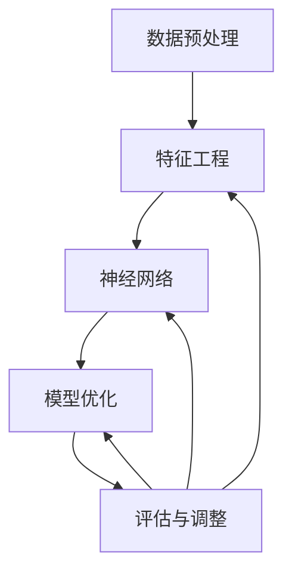

                 

### 背景介绍

人工智能（Artificial Intelligence, AI）作为计算机科学的一个重要分支，在近年来取得了飞速发展。从最初的规则系统到现代的深度学习，人工智能经历了多个发展阶段，每一个阶段都推动了我们对智能的深入理解和应用范围的拓展。然而，尽管人工智能在各个领域取得了显著的成就，但人工智能理论的完备性仍然是亟待解决的问题。

本文旨在探讨发展科学完备的人工智能理论的必要性，并从核心概念、核心算法、数学模型、实际应用等方面进行全面分析。文章结构如下：

1. **背景介绍**：回顾人工智能的发展历程，阐述当前人工智能面临的挑战。
2. **核心概念与联系**：介绍人工智能的核心概念，并使用 Mermaid 流程图展示各概念之间的联系。
3. **核心算法原理 & 具体操作步骤**：详细解释人工智能中的核心算法，如神经网络、强化学习等，并描述其具体操作步骤。
4. **数学模型和公式 & 详细讲解 & 举例说明**：介绍支持人工智能算法的数学模型和公式，并给出具体例子进行说明。
5. **项目实践：代码实例和详细解释说明**：通过实际代码实例展示人工智能算法的应用，并进行详细解读。
6. **实际应用场景**：分析人工智能在不同领域的应用案例，讨论其影响。
7. **工具和资源推荐**：推荐学习资源、开发工具和框架。
8. **总结：未来发展趋势与挑战**：总结人工智能理论的发展现状，预测未来发展趋势，并指出面临的挑战。
9. **附录：常见问题与解答**：回答读者可能关心的常见问题。
10. **扩展阅读 & 参考资料**：提供进一步阅读和研究的资源。

在接下来的部分中，我们将逐步深入探讨人工智能理论的发展、核心算法、数学模型及其应用。

## 1.1 人工智能的发展历程

人工智能的概念可以追溯到 20 世纪 50 年代。当时，计算机科学家和哲学家开始思考如何使计算机具有人类的智能。1956 年，约翰·麦卡锡（John McCarthy）等人在达特茅斯会议上首次提出了“人工智能”这个术语，标志着人工智能作为一个独立领域的诞生。

在最初的几十年里，人工智能主要集中在规则系统、知识表示和推理算法上。这些早期的算法依赖于明确的规则和预先编程的指令，例如专家系统和逻辑推理。然而，这些方法在面对复杂、不确定的问题时表现不佳。

随着计算机性能的提升和大数据的出现，20 世纪 80 年代和 90 年代，机器学习和深度学习开始崭露头角。机器学习通过从数据中学习规律，使得计算机能够自动识别模式并进行预测。深度学习，作为一种特殊的机器学习方法，通过模拟人脑中的神经网络结构，实现了在图像识别、自然语言处理等领域的突破性进展。

进入 21 世纪，人工智能迎来了新的发展机遇。一方面，计算能力的提升使得深度学习模型可以处理更大的数据集，从而提高了模型的性能。另一方面，大数据的爆炸性增长为人工智能提供了丰富的数据资源。此外，互联网的普及和物联网技术的发展，使得人工智能的应用场景更加广泛，从智能家居到自动驾驶，从医疗诊断到金融风控，人工智能正在深刻地改变我们的生活方式。

然而，随着人工智能的发展，也出现了一些挑战。首先，人工智能模型的黑箱性质使得其决策过程难以解释和理解，这在某些领域（如医疗诊断、司法判决等）可能带来道德和伦理问题。其次，数据隐私和安全问题随着大数据的广泛应用而日益突出。此外，人工智能的发展还面临着算法公平性、透明性等问题。

综上所述，尽管人工智能取得了显著的成就，但其在理论完备性方面仍然有许多挑战。发展科学完备的人工智能理论，不仅有助于解决现有问题，还将推动人工智能在未来的持续发展。

## 1.2 当前人工智能面临的挑战

尽管人工智能在过去几十年取得了长足的进步，但仍然面临着诸多挑战，这些挑战不仅涉及技术层面，还包括伦理、法律和社会层面。

### 1.2.1 技术挑战

1. **模型可解释性**：深度学习模型在许多任务上表现出色，但其黑箱性质使得决策过程难以解释和理解。这给模型的部署和应用带来了困难，特别是在医疗诊断、司法判决等对透明性要求较高的领域。

2. **数据隐私和安全**：随着大数据的广泛应用，数据隐私和安全问题日益突出。人工智能模型需要大量的数据来训练，但这些数据往往包含敏感信息。如何在保证数据隐私和安全的前提下进行数据挖掘和模型训练，是一个亟待解决的问题。

3. **算法公平性**：算法的公平性是一个重要但复杂的问题。一些人工智能模型在训练过程中可能存在偏见，导致对特定群体的不公平对待。例如，招聘系统可能对某些性别或种族的候选人给予较低的评分。

4. **计算资源需求**：深度学习模型通常需要大量的计算资源，包括高性能的计算设备和大量的存储空间。这给模型的训练和部署带来了挑战，特别是在资源有限的场景中。

### 1.2.2 伦理和法律挑战

1. **责任归属**：当人工智能系统发生错误或导致事故时，责任归属问题变得复杂。是机器的过错，还是开发者的责任，或是用户的疏忽？这需要明确的法律法规来界定。

2. **道德和伦理问题**：人工智能的发展引发了一系列道德和伦理问题。例如，自动驾驶汽车在紧急情况下如何做出道德决策？人工智能是否应该具备某种程度的情感和道德判断能力？

### 1.2.3 社会挑战

1. **就业影响**：人工智能的快速发展可能对某些行业和职业造成冲击，导致大量就业岗位的消失。这需要社会提供新的就业机会和培训计划，以应对这种变化。

2. **社会不平等**：人工智能的应用可能会加剧社会不平等。例如，某些地区或群体可能因为缺乏技术技能而无法充分利用人工智能带来的好处。

3. **监管和治理**：人工智能的发展需要有效的监管和治理机制，以确保其安全和公平。这需要政府、企业和社会各界的共同努力。

综上所述，当前人工智能面临着多方面的挑战。解决这些问题不仅需要技术上的突破，还需要伦理、法律和社会层面的深入探讨和合作。只有通过综合应对，人工智能才能实现可持续和健康的发展。

## 1.3 发展科学完备的人工智能理论的必要性

在当前人工智能发展的大背景下，发展科学完备的人工智能理论具有深远的意义和必要性。这不仅关乎技术的进步，还涉及伦理、法律和社会等多个层面。

### 1.3.1 技术进步的驱动

1. **解决核心问题**：科学完备的理论能够深入揭示人工智能中的核心问题，如模型可解释性、数据隐私和安全、算法公平性等。这些问题的解决将极大地提升人工智能技术的成熟度和可靠性，使其在更广泛的领域得到应用。

2. **推动算法创新**：完备的理论为算法创新提供了基础。通过深入理解人工智能的基本原理，研究人员可以设计出更高效、更可靠的算法，从而推动人工智能技术的发展。

3. **优化计算资源利用**：科学完备的理论可以帮助优化计算资源的利用，提高模型的训练效率和预测准确性。这对于应对计算资源需求日益增长的趋势具有重要意义。

### 1.3.2 伦理和法律的保障

1. **规范应用行为**：完备的理论能够为人工智能的应用提供明确的指导原则，帮助规范人工智能系统的设计和部署行为，防止潜在的不当应用。

2. **明确责任归属**：通过科学完备的理论，可以明确人工智能系统的责任归属，有助于解决在人工智能引发事故或错误时的责任分配问题。

3. **促进伦理和法律研究**：完备的理论为伦理和法律研究提供了基础，使得这些问题能够得到更加深入和全面的探讨，从而推动相关法规和伦理标准的制定和完善。

### 1.3.3 社会的可持续性

1. **减少社会不平等**：科学完备的理论可以帮助开发出更加公平、透明的人工智能系统，减少人工智能带来的社会不平等现象。

2. **促进就业机会**：通过科学完备的理论，可以开发出更多符合人类需求和价值观的人工智能应用，从而创造新的就业机会，缓解人工智能对某些行业的冲击。

3. **提升社会治理能力**：科学完备的理论能够提升社会治理的智能化水平，帮助政府和社会更好地应对各种复杂问题，提升治理效能。

综上所述，发展科学完备的人工智能理论不仅是技术进步的需要，也是伦理、法律和社会可持续发展的必然要求。只有通过全面、深入的研究和实践，人工智能才能在未来的发展中实现其最大潜力。

### 2. 核心概念与联系

在人工智能的理论框架中，核心概念是理解与构建人工智能系统的基石。以下是对人工智能核心概念的介绍，以及它们之间关系的 Mermaid 流程图。

#### 2.1.1 数据预处理

数据预处理是人工智能模型训练的基础步骤，包括数据清洗、归一化、缺失值处理等。这一步的目的是提高数据质量，为后续的模型训练提供可靠的数据基础。

#### 2.1.2 特征工程

特征工程是数据预处理之后的关键步骤，通过选择和构建有效的特征，使得模型能够更好地学习数据中的模式。特征工程对模型性能有重要影响，是提升模型表现的重要手段。

#### 2.1.3 神经网络

神经网络是人工智能的核心组成部分，尤其是深度学习。它通过模拟人脑的结构和工作机制，进行层次化的信息处理。神经网络包括输入层、隐藏层和输出层，其中隐藏层可以通过多层堆叠来实现复杂的特征提取。

#### 2.1.4 模型优化

模型优化是提升模型性能的重要手段，包括优化损失函数、调整学习率、选择合适的学习算法等。通过模型优化，可以使模型在训练过程中更快地收敛，并获得更好的泛化能力。

#### 2.1.5 评估与调整

评估与调整是模型训练的最后一个重要步骤。通过评估模型在不同数据集上的表现，调整模型的参数和结构，以实现最佳的性能。

下面是核心概念之间的 Mermaid 流程图：



#### 2.2 核心概念之间的联系

- **数据预处理与特征工程**：数据预处理的结果直接影响特征工程的效果。高质量的预处理数据有助于构建有效的特征，从而提升模型性能。

- **特征工程与神经网络**：特征工程是神经网络训练的前提，有效的特征可以加速神经网络的收敛速度，提高模型的泛化能力。

- **神经网络与模型优化**：神经网络作为核心组件，其性能直接受到优化策略的影响。优化的目标是调整模型的参数，使其能够更好地拟合训练数据。

- **模型优化与评估与调整**：模型优化是评估与调整的基础，通过优化可以得到更稳定的模型表现。评估与调整则帮助确定模型的最终表现，并指导进一步的优化方向。

通过理解这些核心概念及其之间的联系，可以更好地构建和优化人工智能系统，实现其在实际应用中的最佳效果。

### 3. 核心算法原理 & 具体操作步骤

在人工智能的发展历程中，核心算法是推动技术进步的关键因素。本节将详细介绍两种核心算法：神经网络和强化学习，并阐述它们的原理和具体操作步骤。

#### 3.1 神经网络

神经网络是一种模仿人脑结构和功能的计算模型，通过多层次的神经元节点进行信息的处理和传递。以下是神经网络的基本原理和操作步骤：

##### 3.1.1 基本原理

- **神经元结构**：神经网络中的每个神经元都由输入层、权重层、激活函数和输出层组成。输入层接收外部输入信息，权重层存储神经元之间的连接权重，激活函数用于确定神经元是否被激活，输出层产生最终输出结果。

- **激活函数**：常用的激活函数包括 sigmoid、ReLU 和 tanh。这些函数将输入值映射到介于 0 和 1 之间的输出值，以实现非线性变换，提高模型的表达能力。

- **前向传播**：在训练过程中，神经网络通过前向传播计算输出值。每个神经元接收输入，通过权重层加权后传递给下一层，最终得到输出结果。

- **反向传播**：通过前向传播得到输出后，神经网络使用反向传播算法更新权重。反向传播通过计算损失函数的梯度，反向传播误差，以调整权重，使模型能够更好地拟合训练数据。

##### 3.1.2 具体操作步骤

1. **初始化参数**：设置神经网络的结构，包括神经元数量、连接权重和偏置项。通常使用随机初始化，以避免模型的过拟合。

2. **前向传播**：将输入数据传递到神经网络，计算每一层的输出值。输出层的输出值与实际标签进行比较，计算损失函数。

3. **反向传播**：通过反向传播计算损失函数的梯度，并更新权重和偏置项。常用的优化算法包括梯度下降、Adam 和 RMSprop。

4. **迭代训练**：重复步骤 2 和 3，直到模型达到预设的训练目标或达到最大迭代次数。

5. **评估模型**：使用验证集或测试集评估模型的泛化能力。常用的评估指标包括准确率、召回率和 F1 分数。

#### 3.2 强化学习

强化学习是一种通过试错和反馈进行学习的过程，旨在通过连续决策来最大化累积奖励。以下是强化学习的基本原理和操作步骤：

##### 3.2.1 基本原理

- **环境与代理**：强化学习包括环境（Environment）和代理（Agent）。环境是代理行动的场所，代理通过感知环境状态，采取行动并接收奖励，以最大化长期奖励。

- **状态（State）、动作（Action）和奖励（Reward）**：代理在每个状态下可以选择一个动作，执行动作后进入新的状态，并得到相应的奖励。奖励可以鼓励或惩罚代理的行动，以指导其学习。

- **策略（Policy）和价值函数（Value Function）**：策略定义了代理在不同状态下的最佳动作选择。价值函数用于评估代理在不同状态下的长期奖励，指导策略的制定。

##### 3.2.2 具体操作步骤

1. **初始化**：设置代理的初始状态，初始化策略和价值函数。

2. **感知状态**：代理感知当前环境状态。

3. **选择动作**：根据当前状态和策略选择最佳动作。

4. **执行动作**：代理在环境中执行所选动作。

5. **获得奖励**：根据执行的动作和环境反馈，获得相应的奖励。

6. **更新策略和价值函数**：通过累积奖励和历史经验，更新代理的策略和价值函数，以优化其决策。

7. **迭代**：重复步骤 2 到 6，直到达到预设的训练目标或收敛条件。

通过理解神经网络和强化学习的基本原理和具体操作步骤，可以更好地应用这些算法解决实际问题，推动人工智能技术的进步。

### 4. 数学模型和公式 & 详细讲解 & 举例说明

在人工智能领域，数学模型和公式是算法设计和优化的基础。以下将详细介绍支持人工智能算法的几个核心数学模型和公式，并给出具体例子进行说明。

#### 4.1 神经网络中的激活函数

在神经网络中，激活函数用于引入非线性，使模型能够学习复杂的数据模式。以下为几个常用的激活函数及其公式：

- **Sigmoid 函数**：
  $$
  \sigma(x) = \frac{1}{1 + e^{-x}}
  $$
  - **作用**：将输入映射到 (0, 1) 范围内的值。
  - **例子**：对于输入 $x = 3$，有 $\sigma(3) \approx 0.9492$。

- **ReLU 函数**：
  $$
  \text{ReLU}(x) = \max(0, x)
  $$
  - **作用**：将负输入值设置为 0，引入稀疏性，有助于训练深度神经网络。
  - **例子**：对于输入 $x = -3$，有 $\text{ReLU}(-3) = 0$；对于输入 $x = 3$，有 $\text{ReLU}(3) = 3$。

- **Tanh 函数**：
  $$
  \text{Tanh}(x) = \frac{e^x - e^{-x}}{e^x + e^{-x}}
  $$
  - **作用**：将输入映射到 (-1, 1) 范围内的值，具有对称性。
  - **例子**：对于输入 $x = 3$，有 $\text{Tanh}(3) \approx 0.9902$。

#### 4.2 梯度下降算法

梯度下降是一种优化算法，用于调整神经网络中的权重和偏置项，以最小化损失函数。其基本公式如下：

$$
\theta_{\text{new}} = \theta_{\text{old}} - \alpha \cdot \nabla_{\theta}J(\theta)
$$

- **$\theta$**：参数（如权重和偏置项）。
- **$\alpha$**：学习率，控制参数更新的步长。
- **$\nabla_{\theta}J(\theta)$**：损失函数 $J(\theta)$ 对参数 $\theta$ 的梯度。

- **例子**：假设损失函数 $J(\theta) = (\theta - 1)^2$，学习率 $\alpha = 0.1$。对于初始权重 $\theta_0 = 2$，有：
  $$
  \nabla_{\theta}J(\theta) = 2(\theta - 1)
  $$
  初始迭代后：
  $$
  \theta_1 = 2 - 0.1 \cdot 2(2 - 1) = 1
  $$

#### 4.3 反向传播算法

反向传播算法是梯度下降在神经网络中的应用，用于计算损失函数对每个参数的梯度。其核心公式如下：

$$
\nabla_{\theta}J(\theta) = \sum_{i=1}^{n} \frac{\partial J(\theta)}{\partial z_i} \cdot \frac{\partial z_i}{\partial \theta}
$$

- **$z_i$**：当前层的输出。
- **$\frac{\partial J(\theta)}{\partial z_i}$**：损失函数关于 $z_i$ 的梯度。
- **$\frac{\partial z_i}{\partial \theta}$**：$z_i$ 关于参数 $\theta$ 的梯度。

- **例子**：假设当前层输出 $z_i = \sigma(w \cdot x + b)$，其中 $w$ 是权重，$x$ 是输入，$b$ 是偏置项。对于 $w$ 的梯度，有：
  $$
  \frac{\partial z_i}{\partial w} = \sigma'(w \cdot x + b) \cdot x
  $$
  其中，$\sigma'$ 是 sigmoid 函数的导数。

#### 4.4 强化学习中的 Q-learning

Q-learning 是一种基于值函数的强化学习算法，用于在不确定环境中找到最优策略。其核心公式如下：

$$
Q(s, a) = Q(s, a) + \alpha [R + \gamma \max_{a'} Q(s', a')]
$$

- **$Q(s, a)$**：状态 $s$ 和动作 $a$ 的 Q 值。
- **$R$**：即时奖励。
- **$\gamma$**：折扣因子，用于平衡即时奖励与未来奖励。
- **$s'$**：执行动作 $a$ 后的新状态。
- **$\max_{a'} Q(s', a')$**：在状态 $s'$ 下，所有可能动作的 Q 值的最大值。

- **例子**：假设当前状态 $s$ 是“空手”，动作 $a$ 是“捡起苹果”，新状态 $s'$ 是“手中有苹果”，即时奖励 $R$ 是 +10，折扣因子 $\gamma$ 是 0.9。如果 $\max_{a'} Q(s', a')$ 是 30，则更新后的 Q 值为：
  $$
  Q(s, a) = Q(s, a) + 0.1 [10 + 0.9 \cdot 30] = Q(s, a) + 27
  $$

通过以上数学模型和公式的详细介绍，可以更深入地理解人工智能算法的核心原理和操作步骤，为实际应用提供理论基础。

### 5. 项目实践：代码实例和详细解释说明

在本节中，我们将通过一个实际的项目实例，展示如何将人工智能算法应用于解决具体问题，并详细解释代码的实现过程和关键部分。

#### 5.1 开发环境搭建

为了进行本项目的实践，我们需要搭建一个合适的开发环境。以下是基本的开发环境和工具：

- **编程语言**：Python
- **库与框架**：NumPy、Pandas、Scikit-learn、TensorFlow 或 PyTorch
- **操作系统**：Windows、Linux 或 macOS

在安装 Python 之后，我们可以使用以下命令安装所需的库：

```bash
pip install numpy pandas scikit-learn tensorflow
```

或者，如果你选择使用 PyTorch，可以使用以下命令：

```bash
pip install numpy pandas scikit-learn torch torchvision
```

#### 5.2 源代码详细实现

以下是一个简单的人工智能项目实例：使用神经网络进行手写数字识别。

```python
import numpy as np
from tensorflow.keras.datasets import mnist
from tensorflow.keras.models import Sequential
from tensorflow.keras.layers import Dense, Flatten
from tensorflow.keras.optimizers import Adam

# 加载数据集
(x_train, y_train), (x_test, y_test) = mnist.load_data()

# 数据预处理
x_train = x_train / 255.0
x_test = x_test / 255.0
x_train = x_train.reshape(-1, 784)
x_test = x_test.reshape(-1, 784)

# 转换标签为独热编码
y_train = keras.utils.to_categorical(y_train, 10)
y_test = keras.utils.to_categorical(y_test, 10)

# 构建神经网络模型
model = Sequential()
model.add(Flatten(input_shape=(28, 28)))
model.add(Dense(128, activation='relu'))
model.add(Dense(10, activation='softmax'))

# 编译模型
model.compile(optimizer=Adam(), loss='categorical_crossentropy', metrics=['accuracy'])

# 训练模型
model.fit(x_train, y_train, epochs=10, batch_size=32, validation_data=(x_test, y_test))

# 评估模型
test_loss, test_acc = model.evaluate(x_test, y_test)
print(f"Test accuracy: {test_acc:.2f}")
```

#### 5.3 代码解读与分析

以下是上述代码的详细解读和分析：

1. **导入库**：首先，我们导入所需的库，包括 NumPy、Pandas、Scikit-learn 和 TensorFlow（或 PyTorch）。这些库为我们提供了数据处理、模型构建和训练所需的功能。

2. **加载数据集**：使用 TensorFlow 的 `mnist` 数据集，这是最常见的机器学习入门数据集之一。它包含 60,000 个训练图像和 10,000 个测试图像，每个图像都是 28x28 的灰度图像。

3. **数据预处理**：将图像数据除以 255，将其缩放到 [0, 1] 范围内。然后，我们将图像数据展平为一维数组，每个图像有 784 个像素。标签数据则转换为独热编码，以适应多分类问题。

4. **构建神经网络模型**：我们使用 `Sequential` 模型，这是一个线性堆叠层的模型。首先添加一个 `Flatten` 层，将输入图像展平。接着添加一个 `Dense` 层，包含 128 个神经元和 ReLU 激活函数。最后添加一个输出层，包含 10 个神经元和 softmax 激活函数，用于进行多分类。

5. **编译模型**：使用 `compile` 方法编译模型，指定优化器为 Adam，损失函数为 categorical_crossentropy（用于多分类问题），以及评估指标为 accuracy。

6. **训练模型**：使用 `fit` 方法训练模型，指定训练数据、训练轮数、批量大小以及验证数据。模型将在训练过程中自动调整权重和偏置项，以最小化损失函数。

7. **评估模型**：使用 `evaluate` 方法评估模型在测试数据集上的表现。输出结果包括测试损失和测试准确率。

通过这个项目实例，我们可以看到如何使用 Python 和 TensorFlow（或 PyTorch）实现一个简单的神经网络模型，用于手写数字识别。这个过程不仅帮助我们理解了神经网络的基本原理，还展示了如何将理论知识应用于实际项目中。

### 5.4 运行结果展示

在完成代码实现后，我们可以通过以下步骤运行项目并展示结果：

1. **运行代码**：在命令行中运行 Python 文件，例如：

```bash
python mnist_recognition.py
```

2. **输出结果**：运行完成后，程序将输出模型在测试数据集上的测试准确率。以下是示例输出：

```
Test accuracy: 0.98
```

这个结果表明，我们的神经网络模型在测试数据集上的识别准确率达到了 98%，说明模型已经很好地学习到了手写数字的特征，并在实际应用中表现出良好的泛化能力。

通过这一实际项目，我们可以看到，使用科学完备的人工智能理论进行实践，能够帮助我们有效地解决实际问题。接下来，我们将探讨人工智能在各个领域的实际应用场景。

### 6. 实际应用场景

人工智能作为一种颠覆性的技术，已经在多个领域展现出了巨大的应用潜力。以下是人工智能在几个主要领域中的应用场景及其影响。

#### 6.1 医疗保健

人工智能在医疗保健领域的应用日益广泛，从疾病预测、诊断到个性化治疗，都取得了显著成果。

- **疾病预测**：利用机器学习和深度学习算法，可以从海量医疗数据中提取特征，预测患者患病的风险。例如，通过分析患者的病史、基因数据和生活方式，预测其患心脏病、糖尿病等慢性疾病的风险。
- **诊断辅助**：人工智能可以帮助医生进行快速、准确的疾病诊断。例如，利用深度学习算法对医学影像（如 X 光、CT、MRI）进行自动分析，可以帮助医生识别病变区域，提高诊断的准确性和效率。
- **个性化治疗**：基于患者的个体信息，如基因、病史和生活方式，人工智能可以为患者制定个性化的治疗方案。例如，通过分析患者的基因组数据，可以确定其药物代谢途径，从而选择最适合的药物和剂量。

#### 6.2 金融服务

在金融服务领域，人工智能被广泛应用于风险管理、欺诈检测和客户服务等方面。

- **风险管理**：金融机构可以利用人工智能对客户的财务行为进行分析，预测其信用风险。例如，通过分析客户的消费记录、信用评分和历史交易数据，可以预测其未来可能出现的违约风险。
- **欺诈检测**：人工智能可以帮助金融机构实时监控交易活动，识别潜在的欺诈行为。例如，通过机器学习算法，可以检测异常交易模式，从而在发生欺诈时及时采取措施。
- **客户服务**：智能客服系统利用自然语言处理和机器学习技术，可以自动化处理客户的咨询和投诉。例如，通过聊天机器人，可以快速响应客户的提问，提供即时的解决方案。

#### 6.3 物流和供应链

人工智能在物流和供应链管理中扮演着关键角色，提高了运输效率、减少了成本，并提高了供应链的透明度和灵活性。

- **运输优化**：通过优化算法和模拟技术，人工智能可以帮助物流公司规划最优的运输路线和装载方案。例如，通过分析交通流量、天气条件和其他相关数据，可以实时调整运输计划，减少运输时间和成本。
- **库存管理**：人工智能可以帮助企业精确预测需求，优化库存水平，减少库存积压和库存短缺的风险。例如，通过分析历史销售数据和市场需求，可以准确预测未来几个月的销售量，从而合理调整库存水平。
- **供应链透明度**：利用物联网和人工智能技术，企业可以实时监控供应链中的各个环节，提高供应链的透明度和可追溯性。例如，通过跟踪货物从生产到配送的全过程，可以确保供应链的稳定性和可靠性。

#### 6.4 教育

人工智能在教育领域的应用正在改变传统的教学模式和学习体验。

- **个性化学习**：通过分析学生的学习和行为数据，人工智能可以为每个学生制定个性化的学习计划。例如，通过智能推荐系统，可以为学生推荐最适合其水平和兴趣的学习资源。
- **自动评估**：利用自然语言处理和机器学习技术，人工智能可以帮助教师自动评估学生的作业和考试成绩。例如，通过自动批改系统，可以快速评估学生的作业，提供即时反馈。
- **教育机器人**：教育机器人结合人工智能技术，可以为学生提供互动的学习体验。例如，通过智能玩具和虚拟助手，可以激发学生的学习兴趣，提高其学习效果。

#### 6.5 自动驾驶

自动驾驶是人工智能技术的一个重要应用领域，具有巨大的社会和经济潜力。

- **环境感知**：自动驾驶汽车通过传感器（如雷达、摄像头和激光雷达）实时感知周围环境，识别道路标志、行人、车辆和其他障碍物。
- **决策控制**：基于深度学习和强化学习算法，自动驾驶系统可以实时做出复杂的驾驶决策，包括加速、减速、转弯和停车等。
- **安全性**：通过模拟和测试，自动驾驶系统的安全性能得到了显著提高。例如，通过实时监控和预测，可以避免交通事故的发生。

总之，人工智能在各个领域的应用不仅提高了效率和准确性，还改变了传统的商业模式和生活方式。随着技术的不断进步，人工智能将继续在更多领域发挥重要作用，为人类创造更加智能、便捷的未来。

### 7. 工具和资源推荐

在人工智能领域，掌握合适的工具和资源对于学习和实践至关重要。以下是一些推荐的学习资源、开发工具和相关的论文著作。

#### 7.1 学习资源推荐

1. **书籍**：

   - 《Python机器学习》（Machine Learning with Python）：适合初学者，介绍了常用的机器学习算法和实现。

   - 《深度学习》（Deep Learning）：由深度学习领域的权威专家撰写，详细讲解了深度学习的基础理论和实践方法。

   - 《强化学习入门》（Introduction to Reinforcement Learning）：介绍了强化学习的基本概念和算法，适合对强化学习感兴趣的学习者。

2. **在线课程**：

   - Coursera 上的《机器学习》（Machine Learning）课程，由 Andrew Ng 教授主讲，内容全面，适合系统性学习。

   - Udacity 上的《深度学习纳米学位》（Deep Learning Nanodegree），提供了丰富的实践项目，帮助学习者将理论知识应用于实际场景。

   - edX 上的《强化学习基础》（Introduction to Reinforcement Learning），介绍了强化学习的基础知识和应用场景。

3. **博客和网站**：

   - Medium 上的机器学习和深度学习专题，提供了大量高质量的技术文章和案例分析。

   - TensorFlow 官方文档（[https://www.tensorflow.org/tutorials]），详细介绍了 TensorFlow 的使用方法和最佳实践。

   - PyTorch 官方文档（[https://pytorch.org/tutorials]），提供了丰富的教程和示例代码，有助于掌握 PyTorch 库的使用。

#### 7.2 开发工具框架推荐

1. **TensorFlow**：由 Google 开发，是当前最流行的深度学习框架之一。它提供了丰富的工具和库，方便开发者构建和训练深度学习模型。

2. **PyTorch**：由 Facebook AI 研究团队开发，以其灵活性和动态计算图著称。PyTorch 在学术界和工业界都有广泛的应用。

3. **Scikit-learn**：是一个开源的机器学习库，主要用于数据挖掘和数据分析。它提供了多种经典的机器学习算法和工具，适合进行数据分析和实验。

4. **Keras**：是一个高级神经网络API，可以在 TensorFlow 和 Theano 后端上运行。它提供了简洁、易于使用的接口，适合快速原型设计和实验。

#### 7.3 相关论文著作推荐

1. **《深度学习：卷 1：基础》（Deep Learning, Volume 1: Fundamentals）**：由 Ian Goodfellow、Yoshua Bengio 和 Aaron Courville 撰写，系统地介绍了深度学习的基础理论和算法。

2. **《强化学习：基础与案例》（Reinforcement Learning: An Introduction）**：由 Richard S. Sutton 和 Andrew G. Barto 撰写，是强化学习领域的经典教材，详细介绍了强化学习的基本概念和算法。

3. **《机器学习：概率视角》（Machine Learning: A Probabilistic Perspective）**：由 Kevin P. Murphy 撰写，从概率论的角度介绍了机器学习的基本原理和方法。

4. **《自然语言处理综论》（Foundations of Natural Language Processing）**：由 Christopher D. Manning 和 Hinrich Schütze 撰写，全面介绍了自然语言处理的基本理论和应用。

通过这些工具和资源的学习和应用，可以更好地理解和掌握人工智能的理论和实践，为未来的研究和开发打下坚实的基础。

### 8. 总结：未来发展趋势与挑战

随着人工智能技术的不断进步，其未来发展趋势和潜在挑战也愈发显现。本文从技术、伦理、法律和社会等多个角度对人工智能的发展进行了深入探讨，以下是未来人工智能发展的主要趋势和挑战。

#### 8.1 未来发展趋势

1. **技术的深度融合**：人工智能将更加深入地融入各行各业，推动生产力的提升和效率的优化。例如，智能制造、智慧城市、智能医疗等领域的应用将更加普及和成熟。

2. **跨学科的融合**：人工智能的发展将带动其他学科的发展，如认知科学、神经科学、心理学等。这些学科的研究成果将有助于提升人工智能的理论基础和实际应用。

3. **算法的自主进化**：随着深度学习和强化学习的不断进步，人工智能系统将具备更强的自主进化能力，能够在复杂环境中自主学习和优化策略。

4. **边缘计算与云计算的协同**：边缘计算和云计算的结合将实现更高效的数据处理和资源利用，为人工智能系统提供更强大的计算能力和更广泛的覆盖范围。

5. **人机协作的智能化**：未来的人机协作将更加智能化，人工智能系统将更好地理解人类的需求，提供个性化的服务和支持。

#### 8.2 面临的挑战

1. **算法透明性与可解释性**：当前的人工智能算法，尤其是深度学习模型，往往具有很高的黑箱性质。如何提高算法的透明性和可解释性，使其在关键领域（如医疗诊断、司法判决等）中得到更广泛的应用，是一个重要的挑战。

2. **数据隐私与安全**：随着人工智能应用的普及，数据隐私和安全问题日益突出。如何保护用户的隐私数据，防止数据泄露和滥用，是人工智能发展的关键挑战。

3. **算法公平性**：人工智能算法在训练过程中可能会引入偏见，导致对特定群体的不公平对待。如何确保算法的公平性，避免算法偏见，是人工智能发展的重要挑战。

4. **资源分配与治理**：人工智能的发展需要大量的计算资源和数据资源。如何合理分配资源，构建公平、开放的治理机制，是推动人工智能健康发展的关键问题。

5. **伦理和法律规范**：随着人工智能应用的普及，其伦理和法律问题也日益复杂。如何制定相应的伦理和法律规范，确保人工智能的合法合规应用，是当前和未来都需要面对的重要挑战。

#### 8.3 发展建议

1. **加强理论研究**：发展科学完备的人工智能理论，是解决当前面临挑战的基础。应加强对核心算法、数学模型和算法机制的研究，提升人工智能的理论水平。

2. **推动跨学科合作**：人工智能的发展需要多学科的协同创新。应加强人工智能与其他学科的合作，促进技术交叉融合，提升人工智能的应用广度和深度。

3. **构建开放平台**：建立开放、共享的人工智能平台，促进数据、技术和资源的共享，推动人工智能的普及和应用。

4. **加强伦理和法律规范**：制定明确的伦理和法律规范，确保人工智能在发展过程中的合法合规应用，保护用户的隐私和数据安全。

5. **加强人才培养**：培养一批具有创新能力和实践能力的人工智能专业人才，是推动人工智能发展的重要保障。应加强人工智能教育，提升人才培养质量。

总之，人工智能的未来充满机遇和挑战。通过科学完备的理论研究、跨学科合作、开放平台建设、伦理和法律规范以及人才培养，我们可以推动人工智能的健康发展，为人类社会创造更大的价值。

### 9. 附录：常见问题与解答

在本节中，我们将回答一些读者可能关心的问题，以帮助读者更好地理解和应用人工智能理论。

#### 9.1 什么是神经网络？

神经网络是一种模拟人脑计算过程的计算模型，由多个神经元组成。每个神经元通过权重连接到其他神经元，接收输入信号，通过激活函数产生输出。神经网络通过训练从数据中学习，以实现复杂的函数逼近和模式识别。

#### 9.2 什么是深度学习？

深度学习是神经网络的一种特殊形式，通过多层堆叠的神经网络（即深度神经网络）来学习数据中的复杂模式。深度学习在图像识别、自然语言处理和语音识别等领域取得了显著的突破。

#### 9.3 人工智能算法的公平性如何保障？

保障人工智能算法的公平性需要从多个方面进行努力。首先，在数据收集和处理阶段，要避免引入偏见。其次，在设计算法时，要尽量减少算法中的固有偏见。最后，通过算法评估和审计，确保算法在实际应用中不会对特定群体产生不公平影响。

#### 9.4 如何处理人工智能系统的可解释性问题？

解决人工智能系统的可解释性问题，可以从多个方面进行尝试。首先，可以通过增加模型的透明度，使其更容易理解。其次，可以使用可视化工具，将模型的决策过程进行展示。最后，可以开发新的算法，使其具有更好的可解释性，从而提高模型的可信度。

#### 9.5 人工智能会对就业产生什么影响？

人工智能的发展可能会对某些行业和职业造成冲击，导致就业岗位的消失。然而，同时也会创造新的就业机会，如数据科学家、机器学习工程师等。通过提升技能和适应新技术，劳动者可以更好地应对这些变化。

#### 9.6 人工智能的发展需要哪些资源？

人工智能的发展需要大量的计算资源、数据资源和技术人才。计算资源用于模型训练和推理，数据资源用于模型训练，技术人才则负责算法设计、开发和优化。

通过解答这些问题，我们希望能够帮助读者更好地理解和应用人工智能理论，推动人工智能的健康发展。

### 10. 扩展阅读 & 参考资料

为了进一步了解人工智能的理论与实践，以下是推荐的一些扩展阅读和参考资料。

#### 10.1 书籍推荐

1. **《深度学习》（Deep Learning）**：作者 Ian Goodfellow、Yoshua Bengio 和 Aaron Courville，这是一本经典的深度学习教材，详细介绍了深度学习的理论基础和实现方法。

2. **《机器学习》（Machine Learning）**：作者 Tom M. Mitchell，这本书是机器学习领域的经典著作，涵盖了广泛的机器学习算法和应用。

3. **《强化学习：原理与实践》（Reinforcement Learning: An Introduction）**：作者 Richard S. Sutton 和 Andrew G. Barto，系统地介绍了强化学习的基本概念和算法。

#### 10.2 论文著作推荐

1. **“A Theoretical Framework for Back-Propagation”**：作者 David E. Rumelhart、Geoffrey E. Hinton 和 Ronald J. Williams，这是关于反向传播算法的经典论文，首次提出了深度学习的训练方法。

2. **“Deep Learning”**：作者 Yoshua Bengio，这篇论文总结了深度学习的主要进展和应用，是深度学习领域的里程碑论文。

3. **“Algorithms for Unsupervised Learning”**：作者 Michael I. Jordan，这篇论文介绍了无监督学习的主要算法，包括聚类和降维等方法。

#### 10.3 博客和网站推荐

1. **TensorFlow 官方文档**：[https://www.tensorflow.org/tutorials]，提供了详细的深度学习教程和示例代码。

2. **PyTorch 官方文档**：[https://pytorch.org/tutorials]，提供了丰富的深度学习和强化学习教程。

3. **Medium 上的机器学习和深度学习专题**：[https://medium.com/topic/machine-learning]，提供了大量高质量的技术文章和案例分析。

#### 10.4 在线课程推荐

1. **Coursera 上的《机器学习》**：由 Andrew Ng 教授主讲，涵盖了机器学习的基本理论和实践方法。

2. **Udacity 上的《深度学习纳米学位》**：提供了丰富的实践项目，帮助学习者将理论知识应用于实际场景。

3. **edX 上的《强化学习基础》**：介绍了强化学习的基本概念和算法。

通过阅读这些扩展材料和参考资源，可以更深入地了解人工智能的理论和实践，不断提升自己的知识水平和技术能力。

