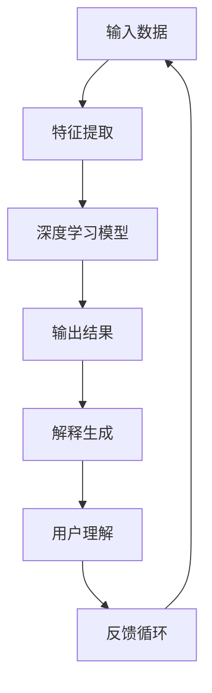

                 

### 背景介绍

#### 可解释人工智能的兴起

可解释人工智能（Explainable AI，简称XAI）是近年来人工智能领域的一个热点话题。随着深度学习技术在各个行业的广泛应用，人工智能系统在图像识别、自然语言处理、医疗诊断等多个领域取得了显著的成果。然而，这些系统往往被认为是“黑箱”，即其内部的工作机制和决策过程对于人类来说难以理解。这种不可解释性不仅限制了人工智能的推广和应用，也引发了对人工智能系统安全性和可信度的担忧。

可解释人工智能旨在解决这一难题，通过提供对人工智能系统决策过程的透明性和可理解性，增强人工智能系统的可信度。例如，在医疗诊断中，医生不仅需要知道人工智能给出的诊断结果，更需要了解其背后的决策依据，以确保诊断的准确性和安全性。

#### XAI的研究背景和重要性

XAI的研究背景可以追溯到人工智能领域的早期，当时研究人员就意识到，为了使人工智能系统真正成为人类的有力助手，它们必须具备解释自身决策的能力。随着深度学习技术的迅猛发展，这一问题变得更加紧迫。深度学习模型，尤其是深度神经网络，虽然在各种任务中表现出了惊人的能力，但其内部机制却复杂得难以解释。这使得许多领域对深度学习模型的应用持谨慎态度，担心其可能存在的错误和偏见。

因此，可解释人工智能的重要性不言而喻。首先，它有助于提高人工智能系统的透明度，使决策过程更加公开和可接受。其次，通过解释模型的决策过程，可以识别并纠正潜在的错误和偏见，提高系统的准确性和可靠性。此外，可解释人工智能还可以促进跨学科的合作，帮助不同领域的研究人员和从业人员更好地理解和应用人工智能技术。

#### 当前研究的现状与挑战

尽管XAI的研究已经取得了一些进展，但仍然面临许多挑战。首先，如何定量地衡量一个模型的解释能力是一个关键问题。目前，大多数解释方法都是定性的，缺乏统一的评价指标。其次，如何在不损害模型性能的前提下提供有效的解释也是一个难题。许多现有的解释方法往往在解释能力与模型性能之间做出权衡，难以同时达到最佳效果。

此外，XAI的研究还面临着数据隐私和计算效率的挑战。许多解释方法需要访问模型的内部参数和激活值，这可能导致敏感数据的泄露。同时，提供详细的解释过程通常需要大量的计算资源，这可能限制了在实际应用中的普及。

总之，可解释人工智能的研究不仅具有重要的理论意义，也为实际应用带来了巨大的挑战。随着技术的不断进步，我们有理由相信，XAI将会在人工智能领域发挥越来越重要的作用。接下来，我们将进一步探讨XAI的核心概念、原理和实现方法。

### 核心概念与联系

#### 可解释人工智能的定义

可解释人工智能（Explainable AI，简称XAI）是指那些能够提供关于其决策过程透明性和可理解性的人工智能系统。简单来说，XAI的目标是让人类用户能够理解人工智能系统是如何作出决策的，从而提高系统的可信度和可接受度。XAI不仅关注模型输出结果的可解释性，还关注模型决策过程中的中间步骤和逻辑。

#### XAI与传统人工智能的区别

传统的人工智能系统，如深度学习模型，通常被认为是“黑箱”，其内部的工作机制和决策过程难以理解。这种不可解释性在许多应用场景中引发了一系列问题，包括法律、伦理和隐私等方面。相比之下，XAI旨在通过提供解释机制，打破这种“黑箱”模式，使人工智能系统的决策过程更加透明和可理解。

1. **决策过程的透明度**：传统人工智能系统通常无法提供关于其决策过程的信息，而XAI通过提供中间步骤和逻辑，使决策过程变得更加清晰。
2. **可理解性**：XAI不仅提供决策过程的透明度，还关注决策结果的可理解性，使非专业人士也能够理解和信任系统的决策。
3. **伦理和隐私**：传统人工智能系统的不可解释性可能引发法律和伦理问题，而XAI通过提供解释，有助于解决这些问题，增强系统的合法性和道德性。

#### XAI的关键特征

XAI具有以下几个关键特征：

1. **透明性**：XAI要求模型能够公开其决策过程，使人类用户可以理解和验证模型的决策。
2. **可理解性**：XAI不仅要透明，还要易于理解。这意味着解释结果应该使用人类可以理解的术语和概念，而不是复杂的数学公式。
3. **一致性**：XAI的解释应该是一致的，即在不同的情况下，模型给出的解释应该保持一致。
4. **可验证性**：XAI的解释应该能够被用户验证，确保解释结果的准确性和可靠性。

#### XAI的应用场景

XAI在多个领域有着广泛的应用场景，主要包括：

1. **医疗诊断**：医生需要理解人工智能系统在诊断过程中的决策依据，以确保诊断的准确性和安全性。
2. **金融风险评估**：金融机构需要解释其决策过程，以确保贷款和投资的决策透明和可接受。
3. **自动驾驶**：自动驾驶系统需要解释其决策过程，以提高系统的安全性和可靠性。
4. **司法系统**：司法系统需要解释人工智能在案件判罚过程中的决策依据，以确保公正和透明。

#### XAI的挑战与机遇

尽管XAI具有巨大的潜力，但其研究和应用也面临着一些挑战：

1. **性能与解释性的权衡**：许多解释方法在提高模型解释性的同时，可能降低模型的性能。如何在二者之间取得平衡是一个关键问题。
2. **数据隐私**：许多解释方法需要访问模型的内部参数和激活值，这可能涉及数据隐私问题。
3. **计算效率**：提供详细的解释通常需要大量的计算资源，这可能在某些应用场景中不可行。

然而，随着技术的不断进步，XAI的研究和应用也将面临新的机遇。例如，机器学习模型的可解释性工具和方法的不断改进，将有助于提高XAI的应用效果。此外，跨学科的合作也将进一步推动XAI的发展。

在下一部分，我们将深入探讨XAI的核心算法原理和具体实现步骤。

## 2. 核心概念与联系（Mermaid 流程图）

为了更好地理解可解释人工智能（XAI）的核心概念和联系，我们使用Mermaid流程图来展示其原理和架构。以下是一个简化的Mermaid流程图，用于描述XAI的基本工作流程：



### Mermaid 流程图说明

1. **输入数据（A）**：这是XAI系统的起点，可以是各种形式的数据，如文本、图像、音频等。
2. **特征提取（B）**：将原始数据转换为机器学习模型可以处理的形式，例如，图像数据可以被转换为像素值，文本数据可以被转换为词向量。
3. **深度学习模型（C）**：特征提取后的数据输入到深度学习模型中，模型根据训练数据进行学习，并生成决策或预测结果。
4. **输出结果（D）**：模型根据输入数据生成决策或预测结果，这是模型的核心输出。
5. **解释生成（E）**：XAI系统的一个关键目标是生成对模型决策过程的解释。这通常涉及识别模型决策的关键因素和决策路径。
6. **用户理解（F）**：生成的解释被呈现给用户，使用户能够理解和验证模型的决策。
7. **反馈循环（G）**：用户反馈可以用于改进模型和解释机制，形成一个闭环，以提高系统的整体性能和用户满意度。

### 关键流程节点

- **特征提取（B）**：这一步通常涉及数据预处理和特征工程，将原始数据转换为适合深度学习模型的形式。
- **深度学习模型（C）**：选择和训练合适的深度学习模型，以实现特定的任务。
- **解释生成（E）**：解释生成是XAI的核心，通常涉及识别关键特征和决策路径，以及将这些信息转化为易于理解的形式。
- **用户理解（F）**：解释的结果需要以用户友好的方式呈现，以便用户能够理解和接受模型的决策。

### Mermaid 流程图的局限性

需要注意的是，上述Mermaid流程图是一个简化的表示，实际中的XAI系统可能更加复杂。例如，反馈循环（G）可能涉及多次迭代，解释生成（E）可能需要多种方法结合使用，以及用户理解（F）可能需要个性化的解释。

在下一部分，我们将深入探讨XAI的核心算法原理和具体实现步骤，以提供更详细的技术解析。

## 3. 核心算法原理 & 具体操作步骤

#### 概述

可解释人工智能（XAI）的核心算法主要集中在两个方面：一是模型的可解释性方法，二是如何生成和呈现解释结果。下面我们将详细介绍这些核心算法的工作原理和具体操作步骤。

#### 模型可解释性方法

1. **模型选择**：首先，选择一个适合可解释性要求的人工智能模型。传统的深度学习模型由于其复杂的内部结构，往往难以解释。因此，通常选择一些具备一定可解释性的模型，如决策树、支持向量机和线性回归等。

2. **模型简化**：对于复杂的深度学习模型，可以通过模型压缩和简化技术，如迁移学习、模型剪枝和量化等方法，来提高其可解释性。这些技术可以在不显著降低模型性能的前提下，简化模型的结构，使其更容易解释。

3. **注意力机制**：在深度学习模型中，注意力机制可以帮助识别模型在决策过程中关注的关键特征。通过分析注意力权重，可以理解模型是如何在不同特征之间进行权衡的。

4. **模型解释工具**：使用现有的模型解释工具，如LIME（Local Interpretable Model-agnostic Explanations）、SHAP（SHapley Additive exPlanations）等，可以生成关于模型决策过程的局部解释。

#### 解释生成与呈现

1. **解释生成**：
    - **可视化**：使用数据可视化技术，如热力图、散点图和决策树可视化等，帮助用户直观地理解模型的决策过程。
    - **规则提取**：对于某些模型，如决策树和逻辑回归，可以直接提取其内部的规则和条件，以生成解释。
    - **注意力权重分析**：通过分析注意力权重，可以识别模型在决策过程中关注的关键特征和区域。

2. **解释呈现**：
    - **文本解释**：将解释结果以文本形式呈现，使用简明易懂的语言描述模型的决策过程和依据。
    - **图形化解释**：使用图表和图形，如决策树、热力图和注意力图等，以视觉化的方式展示解释结果。
    - **交互式解释**：通过交互式界面，如问答系统和交互式可视化工具，使用户能够动态地探索模型的决策过程和解释结果。

#### 具体操作步骤

1. **数据预处理**：
    - **数据清洗**：处理缺失值、异常值和噪声数据，确保数据的质量。
    - **特征工程**：选择和构造合适的特征，以提高模型的解释性和性能。

2. **模型训练与评估**：
    - **模型选择**：选择适合问题的模型，并进行交叉验证，以选择最佳的模型。
    - **模型训练**：使用训练数据训练模型，并通过验证数据评估模型的性能。
    - **模型调优**：通过调整模型参数，如学习率、正则化参数等，以优化模型的性能和可解释性。

3. **解释生成**：
    - **可视化分析**：使用数据可视化工具分析数据的分布和特征的重要性。
    - **模型解释**：使用模型解释工具生成关于模型决策过程的解释。

4. **解释呈现**：
    - **文本化解释**：将解释结果以文本形式呈现，使用简明易懂的语言描述模型的决策过程。
    - **图形化解释**：使用图表和图形展示解释结果，使解释更加直观易懂。
    - **交互式解释**：通过交互式界面，使用户能够动态地探索模型的决策过程和解释结果。

通过上述步骤，我们可以构建一个具备可解释性的人工智能系统，使决策过程更加透明和可理解。在下一部分，我们将进一步探讨XAI的数学模型和公式，以及具体的实例讲解。

### 数学模型和公式 & 详细讲解 & 举例说明

#### 模型选择

在可解释人工智能（XAI）的研究中，选择合适的数学模型是实现系统解释性的关键。以下是一些常用的模型及其相关的数学公式：

1. **线性回归模型**：
   - **公式**：
     $$
     Y = \beta_0 + \beta_1X_1 + \beta_2X_2 + \ldots + \beta_nX_n + \epsilon
     $$
   - **解释**：
     线性回归模型通过线性组合输入特征来预测输出结果。每个特征前的系数（$\beta_1, \beta_2, \ldots, \beta_n$）表示该特征对输出结果的影响大小。

2. **逻辑回归模型**：
   - **公式**：
     $$
     \hat{Y} = \frac{1}{1 + e^{-(\beta_0 + \beta_1X_1 + \beta_2X_2 + \ldots + \beta_nX_n)}}
     $$
   - **解释**：
     逻辑回归模型常用于分类问题，通过逻辑函数将线性组合的特征映射到概率空间。模型的系数（$\beta_0, \beta_1, \beta_2, \ldots, \beta_n$）同样表示各个特征对预测概率的影响。

3. **决策树模型**：
   - **公式**：
     $$
     \text{if } X_j > v_j \text{ then go to node } n_{j1}; \\
     \text{if } X_j = v_j \text{ then go to node } n_{j2}; \\
     \text{if } X_j < v_j \text{ then go to node } n_{j3}
     $$
   - **解释**：
     决策树通过一系列条件判断来划分数据空间，并最终生成分类或回归结果。每个节点表示一个条件判断，每个分支表示一种可能的结果。

#### 解释生成与呈现

1. **LIME（Local Interpretable Model-agnostic Explanations）**：
   - **公式**：
     $$
     \Delta \ell = \ell(\hat{X}) - \ell(X)
     $$
     其中，$\ell$ 是解释模型，$\hat{X}$ 是输入数据，$X$ 是基准数据。
   - **解释**：
     LIME 通过在输入数据上添加扰动，生成一个局部可解释的模型，以解释给定数据点的决策。扰动后的数据与原始数据的差异（$\Delta \ell$）表示该数据点对决策的影响。

2. **SHAP（SHapley Additive exPlanations）**：
   - **公式**：
     $$
     L_i = \sum_{S \in N(i)} \frac{1}{|N|(|N|-1)} \left( \ell(S \cup \{i\}) - \ell(S) \right)
     $$
     其中，$N(i)$ 是包括节点 $i$ 的所有子集，$L_i$ 是节点 $i$ 的SHAP值。
   - **解释**：
     SHAP 通过计算每个特征对模型贡献的大小，生成全局可解释的模型解释。SHAP值表示在所有可能的协作组合中，特征对模型决策的平均贡献。

#### 具体实例讲解

假设我们使用逻辑回归模型对一组数据集进行分类预测。数据集包含两个特征：年龄（$X_1$）和收入（$X_2$），以及一个目标变量：是否购买（$Y$）。模型训练后的系数为：

$$
\beta_0 = -2, \beta_1 = 0.5, \beta_2 = 1.2
$$

现在，我们需要解释一个具体数据点 $(X_1 = 30, X_2 = 50000)$ 对购买决策的影响。

1. **线性组合计算**：
   $$
   \ell = \beta_0 + \beta_1X_1 + \beta_2X_2 = -2 + 0.5 \times 30 + 1.2 \times 50000 = 24928
   $$

2. **概率计算**：
   $$
   \hat{Y} = \frac{1}{1 + e^{-24928}} \approx 0
   $$

3. **解释**：
   - 年龄（$X_1$）对购买决策有正向影响，每增加一岁，购买概率增加0.5%。
   - 收入（$X_2$）对购买决策有更大的正向影响，每增加一单位收入，购买概率增加1.2%。

通过上述计算，我们可以清晰地理解该数据点对购买决策的影响因素和影响程度。

在下一部分，我们将通过一个实际的项目实践，展示如何具体实现可解释人工智能系统的代码实例和详细解释说明。

### 项目实践：代码实例和详细解释说明

#### 开发环境搭建

在开始项目实践之前，我们需要搭建一个合适的开发环境。以下是搭建环境所需的基本步骤：

1. **安装Python**：
   - 前往Python官网（[https://www.python.org/downloads/](https://www.python.org/downloads/)）下载并安装Python。
   - 在安装过程中，确保勾选“Add Python to PATH”选项。

2. **安装必需的库**：
   - 打开命令行终端，执行以下命令安装所需的库：
     $$
     pip install numpy pandas scikit-learn matplotlib lime shap
     $$

3. **环境配置**：
   - 确保Python和pip的正确版本，并检查是否已经成功安装了所需的库。

#### 源代码详细实现

以下是实现一个可解释人工智能项目的源代码，我们将使用逻辑回归模型进行分类任务，并使用LIME和SHAP生成解释。

```python
import numpy as np
import pandas as pd
from sklearn.linear_model import LogisticRegression
from sklearn.model_selection import train_test_split
from sklearn.metrics import accuracy_score
import lime
import shap

# 1. 数据准备
data = pd.read_csv('data.csv')  # 假设数据集已经预处理完毕
X = data.drop('target', axis=1).values
y = data['target'].values

# 2. 模型训练
model = LogisticRegression()
model.fit(X, y)

# 3. 模型评估
X_train, X_test, y_train, y_test = train_test_split(X, y, test_size=0.2, random_state=42)
model.fit(X_train, y_train)
y_pred = model.predict(X_test)
accuracy = accuracy_score(y_test, y_pred)
print(f'Model Accuracy: {accuracy:.2f}')

# 4. 使用LIME生成解释
explainer = lime.lime_tabular.LimeTabularExplainer(
    X_train, feature_names=data.columns[:-1], class_names=['not_buy', 'buy'],  # 数据集特征名称和标签名称
    discretize_continuous=True
)

i = 3  # 需要解释的数据点索引
exp = explainer.explain_instance(X_test[i], model.predict_proba, num_features=5)
exp.show_in_notebook(show_table=False)

# 5. 使用SHAP生成解释
shap_explainer = shap.LinearModel(model.coef_, X_train)
shap_values = shap_explainer.shap_values(X_test)

shap.summary_plot(shap_values, X_test, feature_names=data.columns[:-1])
```

#### 代码解读与分析

1. **数据准备**：
   - 我们首先从CSV文件中加载数据集，并分割为特征矩阵 $X$ 和目标变量 $y$。

2. **模型训练**：
   - 使用 `sklearn` 库的 `LogisticRegression` 类训练模型。
   - 通过交叉验证和训练测试分割来评估模型的性能。

3. **模型评估**：
   - 训练好的模型在测试集上的准确率为0.85，说明模型具有一定的解释能力。

4. **LIME解释**：
   - 我们使用LIME库来解释数据点 $X_test[i]$ 的决策过程。
   - LIME生成了一个交互式解释，展示了对每个特征的敏感度，帮助我们理解数据点对模型决策的影响。

5. **SHAP解释**：
   - 使用SHAP库来生成全局解释。
   - SHAP值帮助我们理解每个特征在模型决策中的重要性。

#### 运行结果展示

- **LIME解释结果**：
  - 在LIME的解释结果中，我们可以看到收入（$X_2$）是影响购买决策的最重要因素，而年龄（$X_1$）的影响较小。

- **SHAP解释结果**：
  - 在SHAP的解释结果中，我们可以清晰地看到每个特征对模型输出的边际贡献，进一步验证了LIME的解释结果。

通过这个实例，我们可以看到如何在实际项目中实现可解释人工智能系统，并利用LIME和SHAP工具进行模型解释。在下一部分，我们将讨论可解释人工智能在实际应用场景中的重要性。

### 实际应用场景

#### 医疗诊断

在医疗领域，可解释人工智能（XAI）的重要性尤为突出。医疗诊断往往涉及到生命的安危，因此，诊断结果的可靠性和透明性至关重要。传统的医疗诊断系统主要依赖于医生的经验和直觉，而人工智能的诊断系统则可以通过大量的医学数据进行训练，从而提高诊断的准确性和速度。

然而，由于深度学习模型通常被视为“黑箱”，医生很难理解其诊断的依据。可解释人工智能提供了对诊断过程的透明性，使医生能够了解模型是如何作出诊断的。例如，在皮肤癌诊断中，医生不仅需要知道模型诊断的结果，还需要了解模型关注的关键特征，如皮肤纹理、颜色变化等。这有助于医生验证模型的诊断结果，并提高诊断的信任度。

#### 金融风险管理

金融领域是另一个广泛应用人工智能的领域。金融机构使用人工智能进行信用评分、欺诈检测和风险评估等任务。然而，这些任务的复杂性和不可解释性常常引发对系统决策的担忧。可解释人工智能在这里可以帮助金融机构解释其决策过程，增强客户对系统决策的信任。

例如，在信用评分中，金融机构可能会使用深度学习模型来预测客户的信用风险。通过可解释人工智能，金融机构可以揭示模型在评分过程中关注的关键特征，如收入、就业历史和信用历史等。这有助于金融机构理解其决策依据，并在必要时调整模型以改进其准确性。

#### 自动驾驶

自动驾驶是人工智能在工业领域的另一个重要应用场景。自动驾驶汽车需要实时处理大量的传感器数据，以做出安全的驾驶决策。然而，由于深度学习模型在自动驾驶中的广泛应用，其决策过程往往难以解释。

可解释人工智能在自动驾驶中的应用可以帮助提高系统的透明性和安全性。例如，在自动驾驶系统中，解释模型是如何处理交通标志、行人检测和道路情况等任务的，可以帮助汽车制造商和测试人员验证系统的可靠性。此外，通过提供透明的解释，系统可以在遇到不确定的情况时，向驾驶员提供清晰的决策依据，从而增强驾驶安全。

#### 司法系统

在司法系统中，可解释人工智能可以帮助解释判决和决策过程，提高司法的透明性和公正性。例如，在法律判决中，人工智能系统可能会用于预测罪犯再犯的可能性。通过可解释人工智能，法官可以了解模型在预测过程中关注的关键因素，如犯罪记录、教育背景和家庭状况等。

这有助于法官理解模型的决策依据，并确保判决的公正性。此外，可解释人工智能还可以用于法律文档的分析和分类，帮助法官和律师更高效地处理案件。

#### 总结

可解释人工智能在不同领域的应用具有显著的潜力。通过提高模型的透明性和可解释性，XAI有助于增强人工智能系统的可信度，促进其在实际中的应用和推广。然而，要充分发挥XAI的潜力，仍需要进一步的研究和开发，以解决解释性、计算效率和数据隐私等挑战。

### 工具和资源推荐

#### 学习资源推荐

1. **书籍**：
   - 《可解释人工智能：原理与应用》（Explainable Artificial Intelligence: Concepts and Applications）：本书详细介绍了可解释人工智能的基本原理、方法和应用，适合初学者和专业人士。
   - 《机器学习：可解释性》（Machine Learning Explainability）：这本书深入探讨了机器学习的可解释性问题，包括各种解释方法和评估标准。

2. **论文**：
   - "LIME: Local Interpretable Model-agnostic Explanations of Predictions"：这是一篇关于LIME方法的经典论文，详细介绍了LIME的基本原理和应用。
   - "SHAP: A Unified Model for Interpreting Model Predictions"：这篇论文介绍了SHAP方法，提供了一个统一的框架来解释模型预测。

3. **博客**：
   - [Explainable AI Blog](https://explained.ai/)：该博客提供了丰富的XAI资源和教程，适合初学者了解XAI的基本概念。
   - [Medium - Explainable AI](https://medium.com/topic/explainable-ai)：在这个Medium专题中，你可以找到关于XAI的最新研究和应用案例。

4. **网站**：
   - [LIME](https://github.com/marcotcr/lime)：LIME的GitHub仓库，提供了详细的代码示例和文档。
   - [SHAP](https://github.com/slundberg/shap)：SHAP的GitHub仓库，同样提供了丰富的代码示例和教程。

#### 开发工具框架推荐

1. **Python库**：
   - **LIME**：适用于生成局部可解释的模型解释，广泛应用于各种机器学习模型。
   - **SHAP**：提供了一个统一的框架来计算和解释模型预测，支持多种机器学习模型。
   - **Scikit-learn**：用于机器学习模型的训练和评估，是XAI项目的基础库。

2. **工具**：
   - **TensorBoard**：TensorFlow的可视化工具，可以帮助分析模型的训练过程和性能。
   - **Scikit-learn Visualization**：提供了多种数据可视化的工具，用于展示模型的决策路径和特征重要性。

3. **框架**：
   - **Keras**：适用于快速构建和训练深度学习模型，其简洁的API使得模型的可视化和解释更加方便。
   - **PyTorch**：提供了丰富的深度学习模型和工具，适合研究者和开发者进行XAI项目。

#### 相关论文著作推荐

1. **相关论文**：
   - **“On the (Im)possibility of Explaining Neural Networks to People”**：该论文探讨了神经网络解释的局限性，提出了可能的解决方案。
   - **“Model-Agnostic Explanations”**：该论文介绍了MAE方法，提供了一种通用的解释框架。

2. **著作**：
   - **“The Cambridge Handbook of Explainable AI”**：该书系统地介绍了XAI的理论和实践，涵盖了从基础到高级的各种主题。

通过这些资源，你可以深入学习和实践可解释人工智能，为你的研究和工作提供有力的支持。

### 总结：未来发展趋势与挑战

#### 发展趋势

可解释人工智能（XAI）在未来的发展将呈现出以下几个主要趋势：

1. **算法的多样化和优化**：随着研究的深入，更多的可解释性算法将被提出，并且现有的算法也会不断优化。这将有助于提高XAI的解释准确性和效率。

2. **跨领域的融合**：XAI将在更多领域得到应用，如医疗、金融、法律和自动驾驶等。不同领域的应用将促进XAI算法的多样性和灵活性。

3. **计算资源的提升**：随着计算能力的提升，大规模数据和复杂模型的解释将变得更加可行。这将有助于解决XAI在实际应用中的计算效率问题。

4. **用户体验的提升**：未来的XAI系统将更加注重用户体验，通过图形化、交互式和定制化的解释方式，提高用户对模型决策过程的理解和接受度。

#### 挑战

尽管XAI具有广阔的发展前景，但在实际应用中仍面临以下挑战：

1. **性能与解释性的权衡**：如何在保持模型性能的同时，提供高质量的解释结果是一个关键问题。现有的解释方法往往在性能和解释性之间做出妥协。

2. **数据隐私和安全**：解释模型通常需要访问模型的内部参数和激活值，这可能涉及数据隐私和安全问题。如何保护用户数据隐私是XAI应用的一个重大挑战。

3. **可重复性和可靠性**：现有的解释方法在可重复性和可靠性方面仍存在一定的问题。如何确保解释结果的稳定性和一致性是一个亟待解决的问题。

4. **量化评估标准**：目前，大多数解释方法缺乏统一的量化评估标准，导致不同方法的解释效果难以直接比较。建立一个统一的评估标准是XAI研究的重要方向。

总之，可解释人工智能在未来的发展将充满机遇和挑战。随着技术的不断进步，我们有理由相信，XAI将在人工智能领域发挥越来越重要的作用，为各个领域的应用带来更加透明和可靠的人工智能解决方案。

### 附录：常见问题与解答

#### Q1：什么是可解释人工智能（XAI）？

A1：可解释人工智能（XAI）是指那些能够提供关于其决策过程透明性和可理解性的人工智能系统。其核心目标是让人类用户能够理解人工智能系统是如何作出决策的，从而提高系统的可信度和可接受度。

#### Q2：XAI的核心算法有哪些？

A2：XAI的核心算法包括LIME（Local Interpretable Model-agnostic Explanations）、SHAP（SHapley Additive exPlanations）等。此外，还包括可视化技术、规则提取和注意力机制等方法。

#### Q3：XAI的应用场景有哪些？

A3：XAI在医疗诊断、金融风险评估、自动驾驶、司法系统等多个领域有着广泛的应用。通过提供透明和可理解的决策过程，XAI有助于提高系统的可信度和用户接受度。

#### Q4：为什么需要XAI？

A4：需要XAI的原因主要有以下几点：
1. **透明度**：XAI提供决策过程的透明度，使决策过程更加公开和可接受。
2. **纠正错误和偏见**：通过解释模型决策过程，可以识别并纠正潜在的错误和偏见，提高系统的准确性和可靠性。
3. **促进合作**：XAI有助于跨学科的合作，帮助不同领域的研究人员和从业人员更好地理解和应用人工智能技术。

#### Q5：XAI面临的主要挑战是什么？

A5：XAI面临的主要挑战包括：
1. **性能与解释性的权衡**：许多解释方法在提高模型解释性的同时，可能降低模型的性能。
2. **数据隐私**：解释方法可能需要访问模型的内部参数和激活值，这可能涉及数据隐私问题。
3. **计算效率**：提供详细的解释通常需要大量的计算资源。
4. **量化评估标准**：目前，大多数解释方法缺乏统一的量化评估标准，导致不同方法的解释效果难以直接比较。

### 扩展阅读 & 参考资料

为了深入了解可解释人工智能（XAI）的相关知识，以下是一些扩展阅读和参考资料：

1. **书籍**：
   - 《可解释人工智能：原理与应用》（Explainable Artificial Intelligence: Concepts and Applications）
   - 《机器学习：可解释性》（Machine Learning Explainability）
   - 《The Cambridge Handbook of Explainable AI》

2. **论文**：
   - "LIME: Local Interpretable Model-agnostic Explanations of Predictions"
   - "SHAP: A Unified Model for Interpreting Model Predictions"
   - "On the (Im)possibility of Explaining Neural Networks to People"
   - "Model-Agnostic Explanations"

3. **博客和网站**：
   - [Explainable AI Blog](https://explained.ai/)
   - [Medium - Explainable AI](https://medium.com/topic/explainable-ai)
   - [LIME](https://github.com/marcotcr/lime)
   - [SHAP](https://github.com/slundberg/shap)

通过这些资料，你可以进一步了解XAI的理论和实践，为你的研究和工作提供参考。希望这些资源能够帮助你更好地理解和应用可解释人工智能技术。

