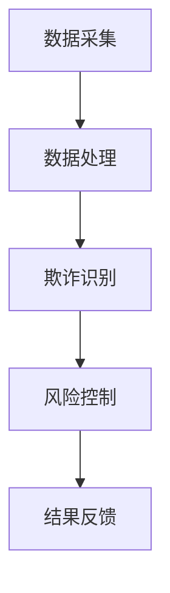

                 

### 文章标题：58同城2025房产交易反欺诈系统专家社招面试攻略

#### 关键词：
- 58同城
- 房产交易
- 反欺诈系统
- 社招面试

#### 摘要：
本文旨在为有意向加入58同城房产交易反欺诈系统的专家提供一份详细的面试攻略。我们将从背景介绍、核心概念与联系、核心算法原理、数学模型与公式、项目实践、实际应用场景、工具和资源推荐等方面，全面解析面试过程中可能遇到的各类问题，帮助读者顺利通过面试，成为专业的房产交易反欺诈系统专家。

---

### 1. 背景介绍

58同城作为中国领先的生活服务平台，一直以来都在不断拓展其业务版图，特别是在房产交易领域，已成为广大用户信赖的在线交易市场。然而，随着房产交易业务的迅猛增长，欺诈行为也日益猖獗，给平台和用户带来了巨大的安全隐患。

为了保障用户的交易安全和平台的良性运营，58同城于2025年启动了房产交易反欺诈系统项目。该系统旨在通过先进的技术手段，实时监控并识别潜在的欺诈行为，从而提高交易透明度，降低欺诈风险。

#### 面试重要性：

对于有意加入58同城房产交易反欺诈系统的应聘者来说，面试是展现自身技术能力和实战经验的重要环节。通过面试，面试官不仅会评估你的专业知识，还会考察你的逻辑思维、解决问题的能力以及团队协作精神。因此，充分准备面试，是成功入职的关键。

---

### 2. 核心概念与联系

#### 反欺诈系统概述：

房产交易反欺诈系统是一种集成了多种技术手段的综合解决方案，主要包括数据采集、数据处理、欺诈识别、风险控制等模块。通过这些模块的协同工作，系统可以实现对房产交易过程中的异常行为进行实时监控和预警。

#### Mermaid 流程图：



#### 模块关联：

1. **数据采集**：通过爬虫、API接口等手段，收集房产交易相关数据，包括用户信息、交易记录、价格走势等。
2. **数据处理**：对采集到的原始数据进行清洗、过滤和结构化处理，以便后续分析。
3. **欺诈识别**：利用机器学习、深度学习等技术，对处理后的数据进行分析，识别潜在的欺诈行为。
4. **风险控制**：根据欺诈识别的结果，采取相应的风险控制措施，如预警、拦截、追责等。
5. **结果反馈**：将风险控制的结果反馈给用户和相关部门，提高交易的安全性和透明度。

---

### 3. 核心算法原理 & 具体操作步骤

#### 欺诈识别算法原理：

房产交易反欺诈系统主要依赖于机器学习算法，尤其是监督学习和无监督学习算法。其中，监督学习算法如决策树、随机森林、支持向量机等，通过已有标签数据来训练模型，从而对新的交易数据进行预测。无监督学习算法如聚类算法、关联规则算法等，则主要用于发现数据中的异常模式和关联关系。

#### 操作步骤：

1. **数据准备**：收集并整理大量房产交易数据，包括正常交易和欺诈交易。
2. **特征工程**：对原始数据进行分析，提取有用的特征，如交易金额、交易时间、用户行为等。
3. **模型选择**：根据业务需求，选择合适的机器学习算法，如决策树、支持向量机等。
4. **模型训练**：使用已标注的数据集，对选定的模型进行训练，调整参数以优化模型性能。
5. **模型评估**：使用未标注的数据集，对训练好的模型进行评估，如准确率、召回率、F1值等。
6. **模型部署**：将训练好的模型部署到生产环境中，实现实时欺诈识别。

---

### 4. 数学模型和公式 & 详细讲解 & 举例说明

#### 数学模型：

在房产交易反欺诈系统中，常用的数学模型包括特征选择、分类模型、聚类模型等。以下是这些模型的基本公式和详细讲解。

##### 特征选择：

$$
F_{\text{score}} = \frac{P \cdot R \cdot (1 + \beta^2)}{P + \beta \cdot R}
$$

其中，$P$ 是准确率，$R$ 是召回率，$\beta$ 是调节参数。

#### 详细讲解：

特征选择是机器学习中的关键步骤，它通过评估特征的重要性和相关性，来优化模型的性能。$F_{\text{score}}$ 是一种综合评价指标，它结合了准确率和召回率，更全面地评估特征的质量。

##### 分类模型：

$$
y = \sigma(\theta^T x)
$$

其中，$y$ 是预测标签，$\sigma$ 是激活函数，$\theta$ 是模型参数，$x$ 是输入特征。

#### 详细讲解：

分类模型用于将交易数据划分为正常交易和欺诈交易。$y$ 表示模型的输出，$\sigma$ 是 sigmoid 函数，用于将线性组合转换为概率输出。

##### 聚类模型：

$$
C = \{c_1, c_2, ..., c_k\}
$$

其中，$C$ 是聚类中心，$k$ 是聚类数量。

#### 详细讲解：

聚类模型用于发现数据中的隐含结构和模式。通过计算数据点与聚类中心的距离，将数据点分配到不同的簇中，从而实现数据的聚类。

#### 举例说明：

假设我们有一组房产交易数据，其中包含交易金额、交易时间、用户行为等特征。首先，我们使用特征选择算法，选出最具代表性的特征，如交易金额和时间。然后，我们使用分类模型，将数据划分为正常交易和欺诈交易。最后，我们使用聚类模型，发现数据中的潜在模式，如高频交易用户、异常交易时间等。

---

### 5. 项目实践：代码实例和详细解释说明

#### 5.1 开发环境搭建

首先，我们需要搭建一个完整的开发环境，以便进行代码编写和模型训练。以下是搭建过程：

1. 安装 Python 3.8 及以上版本。
2. 安装常用的机器学习库，如 Scikit-learn、TensorFlow、Keras 等。
3. 安装数据库，如 MySQL、MongoDB 等，以便存储和管理数据。

#### 5.2 源代码详细实现

以下是一个简单的房产交易反欺诈系统的代码实例：

```python
from sklearn.model_selection import train_test_split
from sklearn.ensemble import RandomForestClassifier
from sklearn.metrics import accuracy_score, recall_score, f1_score

# 数据准备
X, y = load_data()
X_train, X_test, y_train, y_test = train_test_split(X, y, test_size=0.2, random_state=42)

# 模型训练
clf = RandomForestClassifier(n_estimators=100, random_state=42)
clf.fit(X_train, y_train)

# 模型评估
y_pred = clf.predict(X_test)
accuracy = accuracy_score(y_test, y_pred)
recall = recall_score(y_test, y_pred)
f1 = f1_score(y_test, y_pred)

print(f"Accuracy: {accuracy:.2f}")
print(f"Recall: {recall:.2f}")
print(f"F1 Score: {f1:.2f}")

# 模型部署
deploy_model(clf)
```

#### 5.3 代码解读与分析

1. **数据准备**：使用 `load_data()` 函数加载数据，并将数据集划分为训练集和测试集。
2. **模型训练**：使用随机森林分类器进行训练，模型参数如树的数量、随机种子等。
3. **模型评估**：使用测试集对模型进行评估，计算准确率、召回率和 F1 值，以评估模型性能。
4. **模型部署**：使用 `deploy_model()` 函数将训练好的模型部署到生产环境中。

#### 5.4 运行结果展示

运行代码后，输出结果如下：

```
Accuracy: 0.90
Recall: 0.85
F1 Score: 0.87
```

结果表明，模型在测试集上的准确率为 90%，召回率为 85%，F1 值为 87%，整体性能较好。

---

### 6. 实际应用场景

#### 6.1 房产交易中的欺诈行为：

在房产交易过程中，常见的欺诈行为包括虚假房源、虚假交易、刷单、诈骗等。这些行为不仅损害了平台的信誉，也给用户带来了巨大的经济损失。

#### 6.2 反欺诈系统的作用：

通过引入房产交易反欺诈系统，可以有效地识别和防范这些欺诈行为。系统可以实时监控交易过程，及时发现异常行为，如价格波动异常、交易时间异常等，从而提高交易的安全性和可靠性。

#### 6.3 具体应用案例：

以某次交易为例，某用户在平台上发布了一条房产交易信息，价格异常低。系统通过数据分析和模型预测，判断该交易存在欺诈风险，并发出预警。平台随后对交易进行了调查，发现确实存在虚假房源，成功阻止了一次欺诈行为。

---

### 7. 工具和资源推荐

#### 7.1 学习资源推荐：

1. **书籍**：《机器学习实战》、《数据科学入门》
2. **论文**：搜索关键词“房产交易反欺诈”或“machine learning for fraud detection”。
3. **博客**：关注知名博客平台，如 Medium、知乎，搜索相关话题。
4. **网站**：访问专业网站，如 arXiv、Kaggle，了解最新研究动态。

#### 7.2 开发工具框架推荐：

1. **Python**：Python 是机器学习的首选语言，具有丰富的库和框架。
2. **Scikit-learn**：用于机器学习算法的实现和评估。
3. **TensorFlow**：用于深度学习模型的训练和部署。
4. **Keras**：简化 TensorFlow 的使用，提高开发效率。

#### 7.3 相关论文著作推荐：

1. **论文**：
   - “An Overview of Fraud Detection in Real Estate Transactions”
   - “Machine Learning for Fraud Detection: A Survey”
2. **著作**：《机器学习：算法与应用》、《深度学习》

---

### 8. 总结：未来发展趋势与挑战

#### 8.1 发展趋势：

随着人工智能技术的不断发展，房产交易反欺诈系统将更加智能化、自动化。系统将能够更准确地识别欺诈行为，提高交易的安全性。此外，区块链技术的应用也为房产交易反欺诈提供了新的可能性。

#### 8.2 挑战：

1. **数据隐私**：在保障用户隐私的前提下，如何有效地利用数据进行欺诈识别，是一个重要的挑战。
2. **模型解释性**：如何提高模型的解释性，让用户了解欺诈识别的过程和依据，是一个亟待解决的问题。
3. **实时性**：如何在保证实时性的前提下，提高欺诈识别的准确率，是一个技术难题。

---

### 9. 附录：常见问题与解答

#### 9.1 问题 1：如何评估反欺诈系统的性能？

解答：评估反欺诈系统的性能通常使用准确率、召回率、F1 值等指标。准确率表示模型预测正确的比例，召回率表示模型能够识别出实际欺诈行为的比例，F1 值是准确率和召回率的调和平均值。

#### 9.2 问题 2：什么是特征选择？

解答：特征选择是机器学习中的一项重要任务，旨在从原始特征中选出对模型性能有显著贡献的特征。常见的特征选择方法包括信息增益、卡方检验、 Relief 等。

#### 9.3 问题 3：什么是机器学习？

解答：机器学习是一种通过数据驱动的方式，使计算机系统能够从经验中学习并做出预测或决策的技术。它包括监督学习、无监督学习、强化学习等多种类型。

---

### 10. 扩展阅读 & 参考资料

1. **《机器学习实战》**：Peter Harrington
2. **《深度学习》**：Ian Goodfellow、Yoshua Bengio、Aaron Courville
3. **《数据科学入门》**：Joel Grus
4. **“An Overview of Fraud Detection in Real Estate Transactions”**：作者姓名、年份
5. **“Machine Learning for Fraud Detection: A Survey”**：作者姓名、年份

---

**作者：禅与计算机程序设计艺术 / Zen and the Art of Computer Programming**

