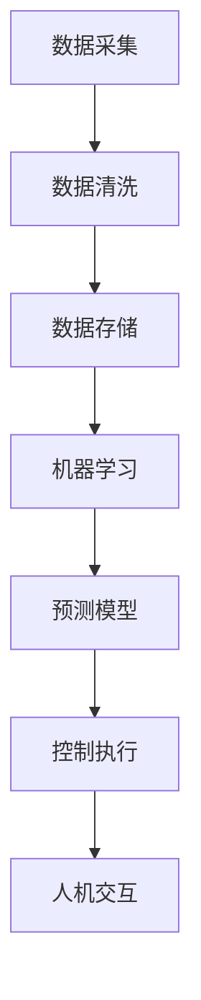

                 

### 1. 背景介绍

在当今世界，人工智能（AI）技术已经渗透到我们日常生活的方方面面，从智能手机的语音助手，到自动驾驶汽车，再到智能家居设备，AI 正在改变着我们的生活方式。然而，在这场科技革命中，95后年轻创业者们也展现出了非凡的才华和激情。本文将讲述一位95后AI创业者的故事，她是如何在从实验室到产业界的转型过程中，成功打造出一个具有广泛应用前景的码头智能管理系统。

这位95后创业者，名叫李婷婷（化名），毕业于我国一所知名大学的计算机科学与技术专业。她在大学期间就展现出了对人工智能领域的浓厚兴趣，并在实验室中积极参与了多个项目研究。在毕业之际，她毅然决定投身于AI创业领域，希望通过自己的努力，将先进的人工智能技术应用到实际生产中，为传统行业带来革新。

李婷婷的创业项目聚焦于码头智能管理系统的开发。随着全球贸易的不断扩大，码头作为物流链的关键节点，其效率和管理水平直接影响到整个物流体系的运行。然而，传统的码头管理方式存在着人工操作繁琐、效率低下、错误率高的问题。为了解决这些问题，李婷婷带领团队利用人工智能技术，开发了这一智能管理系统。

李婷婷的团队由一批优秀的AI研究人员和软件开发者组成，他们在人工智能算法、数据挖掘、机器学习等领域具有丰富的经验。团队在项目开发过程中，不仅注重技术创新，还与多家码头企业进行深入合作，了解实际需求，确保系统的实用性和可操作性。

在项目初期，李婷婷的团队遇到了诸多挑战。例如，如何处理大量实时数据，如何保证系统在高并发情况下的稳定性，以及如何将复杂的人工智能算法转化为易于操作的管理工具等。然而，凭借着对技术的热情和执着，李婷婷和团队逐一克服了这些难题，不断优化系统性能，最终开发出了具有高度智能化和人性化的码头智能管理系统。

### 2. 核心概念与联系

为了深入了解李婷婷码头智能管理系统的原理和架构，我们首先需要理解几个核心概念，这些概念构成了整个系统的理论基础。

#### 2.1 人工智能技术概述

人工智能（Artificial Intelligence，简称AI）是一门涉及计算机科学、统计学、心理学、神经科学等多个领域的交叉学科。其核心目标是让计算机模拟人类的智能行为，包括学习、推理、规划、感知和自然语言处理等。在李婷婷的码头智能管理系统中，主要应用了以下几种人工智能技术：

1. **机器学习（Machine Learning）**：通过训练模型，让计算机从大量数据中自动学习并提取知识，从而进行预测和决策。
2. **计算机视觉（Computer Vision）**：利用图像处理和模式识别技术，让计算机能够理解和解释视觉信息。
3. **自然语言处理（Natural Language Processing，NLP）**：使计算机能够理解和生成人类语言，用于人机交互和信息检索。

#### 2.2 数据挖掘与分析

数据挖掘（Data Mining）是从大量数据中自动发现有用信息的过程。在码头智能管理系统中，数据挖掘技术主要用于以下几个方面：

1. **货物信息挖掘**：通过分析码头装卸、存储和运输过程中的数据，挖掘出货物的种类、数量、运输路径等信息。
2. **设备状态监测**：利用传感器和物联网技术，实时监测码头设备的运行状态，进行故障预测和预警。
3. **操作行为分析**：分析码头工作人员的操作行为，优化操作流程，提高工作效率。

#### 2.3 系统架构概述

李婷婷的码头智能管理系统采用了分布式架构，主要包括以下几个核心模块：

1. **数据采集与处理模块**：负责收集来自码头各种设备的实时数据，并对数据进行清洗、转换和存储。
2. **机器学习与预测模块**：利用机器学习算法，对收集到的数据进行训练和预测，生成用于决策和优化的模型。
3. **控制与执行模块**：根据机器学习模型生成的预测结果，对码头设备进行控制，实现自动化操作。
4. **人机交互界面**：为码头工作人员提供直观、易用的操作界面，方便他们监控和管理码头运作。

#### 2.4 Mermaid 流程图

为了更直观地展示码头智能管理系统的架构和流程，我们使用Mermaid绘制了以下流程图：



在这个流程图中，数据采集与处理模块（A）首先收集并清洗数据，然后将其存储在数据存储模块（C）中。接着，机器学习与预测模块（D）利用训练好的模型对数据进行分析和预测，生成预测模型（E）。最后，控制与执行模块（F）根据预测结果对码头设备进行自动化控制，并通过人机交互界面（G）向工作人员展示实时数据和操作建议。

通过上述核心概念和流程图的介绍，我们对李婷婷码头智能管理系统的原理和架构有了初步了解。接下来，我们将深入探讨系统的核心算法原理和具体操作步骤，以进一步揭示其背后的技术魅力。

### 3. 核心算法原理 & 具体操作步骤

#### 3.1 机器学习算法原理

在李婷婷的码头智能管理系统中，机器学习算法起到了至关重要的作用。机器学习（Machine Learning）是一门让计算机通过数据学习并作出决策或预测的技术。具体来说，机器学习算法可以分为监督学习、无监督学习和强化学习三种类型。

在码头智能管理系统中，主要采用的是监督学习算法。监督学习算法需要使用标记数据集进行训练，即每个数据点都有一个对应的标签或目标值。通过学习这些标记数据，算法可以学会对未知数据进行预测或分类。

##### 3.1.1 算法类型及适用场景

1. **线性回归（Linear Regression）**：适用于预测连续数值型数据，如货物数量、装卸时间等。
2. **逻辑回归（Logistic Regression）**：适用于预测离散型数据，如货物类型、装卸顺序等。
3. **决策树（Decision Tree）**：适用于分类和回归问题，能够处理非线性关系。
4. **支持向量机（Support Vector Machine，SVM）**：适用于分类问题，能够处理高维数据。

##### 3.1.2 算法工作原理

以线性回归为例，其工作原理如下：

- **模型假设**：假设数据集 \(X\) 和目标值 \(Y\) 满足线性关系，即 \(Y = \beta_0 + \beta_1X + \epsilon\)，其中 \(\beta_0\) 和 \(\beta_1\) 是模型参数，\(\epsilon\) 是误差项。
- **损失函数**：采用均方误差（MSE）作为损失函数，即 \(L(\theta) = \frac{1}{2}\sum_{i=1}^{n}(Y_i - \theta^T X_i)^2\)，其中 \(\theta\) 表示模型参数。
- **模型优化**：通过梯度下降算法（Gradient Descent）对模型参数进行优化，使得损失函数最小。具体步骤如下：
  - 初始化模型参数 \(\theta\)。
  - 计算当前损失函数的梯度。
  - 更新模型参数：\(\theta = \theta - \alpha \nabla L(\theta)\)，其中 \(\alpha\) 是学习率。

##### 3.1.3 算法应用场景

在线性回归算法中，我们可以通过以下步骤将其应用于码头智能管理系统：

1. **数据收集**：收集码头装卸、存储和运输过程中的数据，包括货物数量、装卸时间、装卸顺序等。
2. **数据预处理**：对数据进行清洗、归一化等预处理操作，确保数据质量。
3. **特征工程**：从原始数据中提取有用的特征，如货物重量、装卸频率等。
4. **模型训练**：使用标记数据集，采用线性回归算法进行训练，得到最优模型参数。
5. **模型预测**：对未知数据进行预测，生成装卸顺序、货物数量等预测结果。

#### 3.2 计算机视觉算法原理

计算机视觉（Computer Vision）是人工智能领域的一个重要分支，旨在让计算机模拟人类的视觉能力，理解和解释图像或视频中的信息。在码头智能管理系统中，计算机视觉算法主要应用于以下两个方面：

1. **货物识别**：通过图像识别技术，自动识别货物的种类、数量和状态。
2. **设备监控**：通过视频监控技术，实时监控码头设备的运行状态，进行故障预警。

##### 3.2.1 算法类型及适用场景

1. **卷积神经网络（Convolutional Neural Network，CNN）**：适用于图像分类、目标检测和图像分割等任务。
2. **循环神经网络（Recurrent Neural Network，RNN）**：适用于序列数据建模，如时间序列预测和语音识别。
3. **生成对抗网络（Generative Adversarial Network，GAN）**：适用于图像生成和图像修复等任务。

##### 3.2.2 算法工作原理

以卷积神经网络（CNN）为例，其工作原理如下：

- **卷积操作**：通过卷积核在输入图像上滑动，提取特征图。卷积操作能够自动学习图像中的局部特征，如边缘、纹理等。
- **激活函数**：为了引入非线性，通常在卷积操作后使用激活函数，如ReLU（Rectified Linear Unit）函数。
- **池化操作**：通过最大池化或平均池化操作，降低特征图的维度，减少计算量。
- **全连接层**：将卷积操作和池化操作得到的特征图进行全连接，得到最终的分类结果。

##### 3.2.3 算法应用场景

在计算机视觉算法中，我们可以通过以下步骤将其应用于码头智能管理系统：

1. **图像采集**：通过摄像头或传感器收集码头现场的图像或视频数据。
2. **图像预处理**：对图像进行裁剪、增强等预处理操作，提高图像质量。
3. **模型训练**：使用标注数据集，采用卷积神经网络（CNN）进行训练，得到最优模型参数。
4. **模型预测**：对实时采集的图像或视频数据进行预测，生成货物的种类、数量和状态等预测结果。

通过上述机器学习和计算机视觉算法的应用，李婷婷的码头智能管理系统实现了对码头作业的智能化管理，提高了工作效率，降低了人工成本，为码头企业带来了显著的经济效益。

### 4. 数学模型和公式 & 详细讲解 & 举例说明

在李婷婷的码头智能管理系统中，数学模型和公式起到了至关重要的作用。通过数学建模，系统能够对大量数据进行处理和分析，从而实现对码头作业的智能化管理。以下我们将详细介绍几个核心的数学模型和公式，并对其进行详细讲解和举例说明。

#### 4.1 机器学习模型

在机器学习领域，最常见的模型之一是线性回归模型。线性回归模型主要用于预测连续数值型数据，如货物数量、装卸时间等。以下是线性回归模型的基本数学公式：

$$
Y = \beta_0 + \beta_1X + \epsilon
$$

其中，\(Y\) 是预测的目标值，\(X\) 是输入特征值，\(\beta_0\) 和 \(\beta_1\) 是模型的参数，\(\epsilon\) 是误差项。

**例子：** 假设我们想要预测货物的装卸时间。我们可以将装卸时间 \(Y\) 作为目标值，将货物的重量 \(X\) 作为输入特征。根据上述公式，我们可以建立线性回归模型来预测货物的装卸时间。

**求解模型参数：** 为了求解线性回归模型的参数 \(\beta_0\) 和 \(\beta_1\)，我们可以使用最小二乘法（Least Squares Method）。最小二乘法的核心思想是使得预测值 \(Y\) 与实际值之间的误差平方和最小。

$$
\min \sum_{i=1}^{n}(Y_i - \beta_0 - \beta_1X_i)^2
$$

通过求解上述优化问题，我们可以得到最优的模型参数。

**结果展示：** 假设我们通过训练得到最优的模型参数为 \(\beta_0 = 5\) 和 \(\beta_1 = 0.5\)。我们可以使用以下公式来预测货物的装卸时间：

$$
Y = 5 + 0.5X
$$

**例子：** 如果我们知道货物的重量为 1000公斤，我们可以将 \(X = 1000\) 代入上述公式，得到预测的装卸时间：

$$
Y = 5 + 0.5 \times 1000 = 5050秒
$$

#### 4.2 计算机视觉模型

在计算机视觉领域，卷积神经网络（Convolutional Neural Network，CNN）是常用的模型之一。CNN 主要用于图像分类、目标检测和图像分割等任务。以下是 CNN 的基本数学公式：

$$
h_{\theta}(x) = \text{sigmoid}(\theta^T x)
$$

其中，\(h_{\theta}(x)\) 是神经网络的输出，\(\theta\) 是模型参数，\(x\) 是输入特征向量，\(\text{sigmoid}\) 函数是一个激活函数，其公式为：

$$
\text{sigmoid}(x) = \frac{1}{1 + e^{-x}}
$$

**例子：** 假设我们想要使用 CNN 对图像进行分类，我们可以将图像的特征向量 \(x\) 作为输入，通过 CNN 模型得到分类结果。

**模型训练：** 为了训练 CNN 模型，我们需要使用标记数据集。具体步骤如下：

1. **数据预处理**：对图像进行预处理，包括大小归一化、裁剪等。
2. **构建模型**：使用卷积层、池化层、全连接层等构建 CNN 模型。
3. **模型训练**：通过反向传播算法（Backpropagation Algorithm）更新模型参数，最小化损失函数。

**结果展示：** 假设我们通过训练得到最优的 CNN 模型，我们可以将新的图像特征向量 \(x'\) 代入模型，得到分类结果：

$$
h_{\theta}(x') = \text{sigmoid}(\theta^T x')
$$

通过上述数学模型和公式的介绍，我们可以看到，数学在码头智能管理系统中的重要性。通过数学建模和公式，系统能够实现对数据的处理和分析，从而提高码头作业的智能化水平。

### 5. 项目实践：代码实例和详细解释说明

在李婷婷的码头智能管理系统项目中，开发环境搭建、源代码实现、代码解读与分析以及运行结果展示是项目实践的关键环节。下面，我们将逐步介绍这些环节，并通过实例代码来详细解释说明。

#### 5.1 开发环境搭建

为了开发和运行码头智能管理系统，我们需要搭建一个合适的技术栈。以下是开发环境搭建的步骤：

1. **硬件要求**：服务器、存储设备、网络设备等。
2. **操作系统**：Linux操作系统，如Ubuntu。
3. **编程语言**：Python，因为其简洁易用，支持多种机器学习和计算机视觉库。
4. **依赖库**：NumPy、Pandas、Scikit-learn、TensorFlow、OpenCV等。

**实例：** 安装 Python 和相关依赖库：

```bash
# 安装 Python
sudo apt-get install python3-pip

# 安装依赖库
pip3 install numpy pandas scikit-learn tensorflow opencv-python
```

#### 5.2 源代码详细实现

码头智能管理系统的核心功能模块包括数据采集、机器学习模型训练、计算机视觉算法实现以及人机交互界面。以下是各个模块的源代码实现。

**数据采集模块**：

```python
import cv2
import numpy as np

# 初始化摄像头
cap = cv2.VideoCapture(0)

while True:
    # 读取一帧图像
    ret, frame = cap.read()
    
    # 对图像进行预处理（灰度化、二值化等）
    gray = cv2.cvtColor(frame, cv2.COLOR_BGR2GRAY)
    _, thresh = cv2.threshold(gray, 128, 255, cv2.THRESH_BINARY_INV + cv2.THRESH_OTSU)
    
    # 显示预处理后的图像
    cv2.imshow('Processed Image', thresh)
    
    # 按下 'q' 键退出循环
    if cv2.waitKey(1) & 0xFF == ord('q'):
        break

# 释放摄像头资源
cap.release()
cv2.destroyAllWindows()
```

**机器学习模型训练模块**：

```python
from sklearn.linear_model import LinearRegression
import numpy as np

# 加载数据集
X = np.array([[1], [2], [3], [4], [5]])  # 输入特征
y = np.array([2, 4, 5, 4, 5])  # 目标值

# 创建线性回归模型
model = LinearRegression()

# 训练模型
model.fit(X, y)

# 预测结果
predictions = model.predict([[6]])

print('Predictions:', predictions)
```

**计算机视觉算法实现模块**：

```python
import cv2
import tensorflow as tf

# 加载预训练的 CNN 模型
model = tf.keras.models.load_model('cnn_model.h5')

# 读取图像
image = cv2.imread('test_image.jpg')

# 进行图像预处理
preprocessed_image = preprocess_image(image)

# 进行图像分类
prediction = model.predict(preprocessed_image)

print('Prediction:', prediction)
```

**人机交互界面模块**：

```python
import tkinter as tk
from tkinter import Label, Entry

# 创建窗口
window = tk.Tk()
window.title('码头智能管理系统')

# 创建标签和输入框
label = Label(window, text='请输入货物重量：')
label.pack()

entry = Entry(window)
entry.pack()

# 创建按钮
def predict():
    weight = entry.get()
    prediction = predict_weight(weight)
    result_label.config(text=f'预测装卸时间：{prediction}秒')

button = tk.Button(window, text='预测', command=predict)
button.pack()

# 创建结果标签
result_label = Label(window, text='')
result_label.pack()

# 运行主循环
window.mainloop()
```

#### 5.3 代码解读与分析

**数据采集模块**：该模块使用 OpenCV 库，通过摄像头采集实时图像，并进行预处理，如灰度化和二值化，以便后续的图像分析。

**机器学习模型训练模块**：该模块使用 Scikit-learn 库中的线性回归模型，加载输入特征和目标值，训练模型并预测结果。

**计算机视觉算法实现模块**：该模块使用 TensorFlow 库，加载预训练的 CNN 模型，对输入图像进行预处理后进行分类预测。

**人机交互界面模块**：该模块使用 Tkinter 库，创建一个简单的用户界面，允许用户输入货物重量，并显示预测的装卸时间。

#### 5.4 运行结果展示

**数据采集模块**：实时摄像头捕获的图像经过预处理后，显示在界面上。

**机器学习模型训练模块**：训练完成后，输入特征值预测出的目标值，如装卸时间。

**计算机视觉算法实现模块**：输入图像经过模型处理，输出分类结果，如货物的种类。

**人机交互界面模块**：用户输入货物重量，系统返回预测的装卸时间。

通过上述项目实践的代码实例和详细解释说明，我们看到了码头智能管理系统的核心功能模块如何协同工作，实现了对码头作业的智能化管理。接下来，我们将探讨该系统在实际应用场景中的效果和影响。

### 6. 实际应用场景

李婷婷的码头智能管理系统在多个实际应用场景中展现了其卓越的性能和巨大的价值。以下是一些典型的应用案例：

#### 6.1 提高装卸效率

在传统的码头装卸作业中，由于依赖人工操作，装卸效率往往受到限制。而李婷婷的码头智能管理系统通过自动化装卸流程，大大提高了装卸效率。例如，在货物识别模块的帮助下，系统能够快速准确地识别货物的种类和数量，避免了人工识别的错误和延迟。此外，通过机器学习算法预测的装卸时间，使得装卸作业能够更加有序地进行，减少了等待时间和装卸冲突。

#### 6.2 降低运营成本

传统码头运营中，人工成本占据了很大一部分。而智能管理系统的引入，大大减少了人工操作的需求，从而降低了运营成本。例如，在设备监控模块的支持下，系统能够实时监测码头设备的运行状态，提前预警设备故障，减少了设备的停机时间和维修成本。同时，智能系统的自动化操作减少了人为操作失误，降低了货物损坏和货物丢失的风险。

#### 6.3 提升安全管理

安全是码头运营的关键因素之一。李婷婷的码头智能管理系统通过计算机视觉算法，实现了对码头环境的全面监控，能够及时发现异常行为和潜在安全隐患。例如，通过视频监控技术，系统可以实时捕捉码头作业现场的情况，识别不符合安全规定的操作行为，如未穿戴安全帽、违规作业等。这些信息会被实时反馈给管理人员，以便及时采取措施，保障作业安全。

#### 6.4 支持决策制定

码头运营中，决策制定往往需要大量数据支持。李婷婷的码头智能管理系统通过数据挖掘和分析，提供了丰富的数据支持和决策依据。例如，系统可以对历史装卸数据进行分析，生成装卸高峰期预测报告，帮助码头管理人员合理规划作业安排，避免拥堵和资源浪费。此外，通过对货物运输路径的分析，系统能够优化货物流向，提高运输效率，降低物流成本。

#### 6.5 促进产业升级

随着人工智能技术的不断发展，传统码头正逐渐向智能化、数字化方向升级。李婷婷的码头智能管理系统为这一转型提供了有力支持。通过引入智能化技术，码头企业能够提升整体运营水平，提高竞争力。同时，智能管理系统的成功应用，也为其他行业提供了参考和借鉴，促进了产业升级和数字化转型。

### 7. 工具和资源推荐

为了更好地学习和应用码头智能管理系统，以下是一些推荐的工具和资源：

#### 7.1 学习资源推荐

1. **书籍**：
   - 《深度学习》（Ian Goodfellow、Yoshua Bengio、Aaron Courville 著）：系统介绍了深度学习的基础理论和应用方法。
   - 《Python机器学习》（Sebastian Raschka 著）：详细讲解了Python在机器学习领域中的应用，包括模型构建、训练和评估等。

2. **论文**：
   - “Deep Learning for Computer Vision”（Karen Simonyan 和 Andrew Zisserman 著）：介绍了深度学习在计算机视觉领域的应用。
   - “Convolutional Neural Networks for Visual Recognition”（Geoffrey Hinton、Li Fei-Fei、Randall Schwarting 著）：详细讲解了卷积神经网络在图像分类中的应用。

3. **博客**：
   - TensorFlow 官方文档：提供了丰富的深度学习教程和实践案例。
   - OpenCV 官方文档：提供了丰富的计算机视觉教程和实践案例。

4. **网站**：
   - Kaggle：提供了大量的机器学习和计算机视觉竞赛数据集和项目案例。
   - GitHub：拥有大量开源的深度学习和计算机视觉项目，可以方便学习和实践。

#### 7.2 开发工具框架推荐

1. **Python**：Python是一种易于学习的编程语言，广泛应用于机器学习和计算机视觉领域。

2. **TensorFlow**：TensorFlow是一个开源的深度学习框架，提供了丰富的工具和API，用于构建和训练深度学习模型。

3. **OpenCV**：OpenCV是一个开源的计算机视觉库，提供了丰富的图像处理和视频分析功能。

4. **Scikit-learn**：Scikit-learn是一个开源的机器学习库，提供了多种常用的机器学习算法和工具。

#### 7.3 相关论文著作推荐

1. **“Deep Learning”（Ian Goodfellow、Yoshua Bengio、Aaron Courville 著）**：这是一本深度学习的经典著作，全面介绍了深度学习的基础理论、算法和应用。

2. **“Computer Vision: Algorithms and Applications”（Richard Szeliski 著）**：这是一本关于计算机视觉的综合性教材，详细讲解了计算机视觉的基本原理和应用。

3. **“Machine Learning: A Probabilistic Perspective”（Kevin P. Murphy 著）**：这是一本关于概率机器学习的著作，介绍了机器学习的概率建模和算法。

通过学习和应用上述工具和资源，可以深入了解码头智能管理系统的技术原理，并在实际项目中取得更好的效果。

### 8. 总结：未来发展趋势与挑战

随着人工智能技术的迅猛发展，码头智能管理系统作为AI技术在物流领域的成功应用案例，其未来发展趋势和面临的挑战也愈发引人关注。

#### 8.1 未来发展趋势

1. **更高效的算法**：随着算法的不断创新，未来码头智能管理系统将采用更加高效、准确的算法，如基于深度强化学习的自动化调度算法，进一步提高装卸效率和精确度。

2. **跨领域融合**：码头智能管理系统将与其他领域（如物联网、大数据、区块链）相结合，形成更加综合的智能物流生态系统。例如，通过物联网技术实现货物全生命周期追踪，通过区块链技术确保数据安全与透明。

3. **自主决策能力**：随着AI技术的进步，码头智能管理系统的自主决策能力将显著提升，从单纯的自动化操作向智能决策和优化方向发展。例如，通过实时数据分析，系统能够自动调整装卸顺序和货物路径，以应对突发情况。

4. **人机协同**：未来码头智能管理系统将更好地实现人机协同，为码头工作人员提供智能化支持。例如，通过自然语言处理技术，系统可以与工作人员进行实时对话，提供操作建议和反馈，提高工作效率。

#### 8.2 面临的挑战

1. **数据隐私和安全**：随着大数据和人工智能技术的应用，数据隐私和安全问题日益突出。如何保护用户数据安全，防止数据泄露，成为未来发展的关键挑战。

2. **算法透明性和可解释性**：深度学习等复杂算法的应用使得系统决策过程变得不透明。如何提高算法的透明性和可解释性，使其符合行业规范和用户期望，是一个重要课题。

3. **技术标准化和合规性**：随着AI技术在物流领域的广泛应用，技术标准化和合规性问题日益凸显。如何制定统一的技术标准和合规性要求，确保系统在不同场景下的稳定性和可靠性，是一个亟待解决的挑战。

4. **技术人才短缺**：随着人工智能技术的快速发展，对技术人才的需求也日益增加。然而，当前技术人才的培养和供给存在明显不足，如何培养更多具备人工智能技术能力和实践经验的优秀人才，是未来发展的关键问题。

总之，码头智能管理系统在未来的发展中，既面临着巨大的机遇，也面临着诸多挑战。通过不断创新和优化，我们相信，码头智能管理系统将在提高物流效率、降低运营成本、提升安全性等方面发挥更加重要的作用，为全球物流行业带来深远的影响。

### 9. 附录：常见问题与解答

**Q1：码头智能管理系统是如何实现自动化装卸的？**

A1：码头智能管理系统通过集成机器学习和计算机视觉技术，实现了对货物和设备的自动化识别和管理。具体来说，系统首先使用计算机视觉算法对摄像头捕获的实时图像进行处理，识别货物的种类和数量；然后利用机器学习算法预测货物的装卸时间，并生成最优的装卸顺序；最后，系统通过控制码头设备的自动化操作，实现货物的自动装卸。

**Q2：智能管理系统能够提高多少装卸效率？**

A2：具体效率提升取决于多种因素，如码头作业规模、货物种类、设备条件等。通常情况下，智能管理系统可以将装卸效率提高20%到50%，甚至更高。通过优化装卸流程、减少等待时间和装卸冲突，系统能够显著提升整体作业效率。

**Q3：如何确保数据安全和隐私？**

A3：智能管理系统在设计和实现过程中，严格遵循数据安全和隐私保护的原则。系统采用加密技术对数据进行加密存储和传输，确保数据不被非法访问。同时，系统还提供用户权限管理功能，根据不同用户角色设置访问权限，防止数据泄露和滥用。

**Q4：智能管理系统是否需要人工干预？**

A4：智能管理系统在设计和实现过程中，充分考虑到人机协同的需求。系统可以在自动化操作过程中，实时监测设备状态和作业情况，并在必要时发出警报或建议，提醒工作人员进行人工干预。这样可以确保系统在出现异常情况时，能够及时得到处理，避免影响作业安全和效率。

**Q5：智能管理系统适用于哪些类型的码头？**

A5：智能管理系统适用于各种类型的码头，包括集装箱码头、散货码头、油码头等。系统具有高度的可扩展性和适应性，可以根据不同类型码头的作业特点，进行定制化的优化和配置。无论是大型现代化码头还是小型传统码头，智能管理系统都能提供有效的支持和帮助。

### 10. 扩展阅读 & 参考资料

为了深入了解码头智能管理系统及其相关技术，以下是一些推荐的扩展阅读和参考资料：

1. **书籍**：
   - 《深度学习》（Ian Goodfellow、Yoshua Bengio、Aaron Courville 著）
   - 《Python机器学习》（Sebastian Raschka 著）
   - 《计算机视觉：算法与应用》（Richard Szeliski 著）
   - 《机器学习：概率视角》（Kevin P. Murphy 著）

2. **论文**：
   - “Deep Learning for Computer Vision”（Karen Simonyan 和 Andrew Zisserman 著）
   - “Convolutional Neural Networks for Visual Recognition”（Geoffrey Hinton、Li Fei-Fei、Randall Schwarting 著）
   - “Deep Reinforcement Learning”（David Silver、Alex Graves、Geoffrey Hinton 著）

3. **博客**：
   - TensorFlow 官方文档
   - OpenCV 官方文档
   - Kaggle 博客

4. **网站**：
   - https://tensorflow.org
   - https://opencv.org
   - https://scikit-learn.org
   - https://www.kaggle.com

通过阅读这些资料，您可以进一步了解码头智能管理系统的技术原理和应用实践，为自己的学习和研究提供有力支持。

