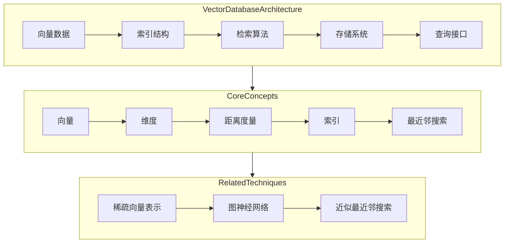
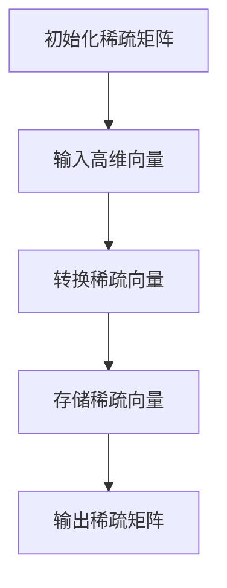
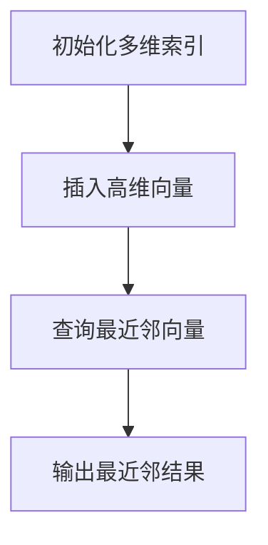
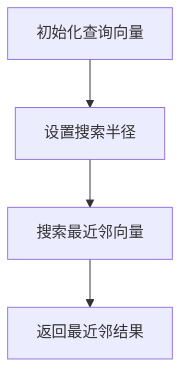

                 

### 背景介绍

向量数据库（Vector Database，简称VD）是一种专为处理高维向量数据设计的数据库系统。随着互联网的迅速发展和大数据时代的到来，数据量呈现出爆炸性增长，特别是高维数据在推荐系统、搜索引擎、自然语言处理（NLP）、计算机视觉等领域得到广泛应用。如何高效地存储、管理和检索这些高维数据，成为当前计算机科学和工程领域的一个重要课题。

#### 向量数据的重要性

向量数据是现代计算领域中的一种核心数据形式，广泛应用于多种应用场景：

1. **推荐系统**：例如电商平台的商品推荐、社交媒体的内容推荐，通过用户的历史行为、偏好和交互数据构建高维向量，利用向量数据库实现快速推荐。
2. **搜索引擎**：搜索引擎通过文档的词向量表示，对海量网页进行排序和索引，以提供更准确的搜索结果。
3. **自然语言处理**：在NLP任务中，文本数据通常被转换成高维向量表示，用于情感分析、文本分类、机器翻译等。
4. **计算机视觉**：图像和视频数据被转换成高维向量，用于目标检测、图像分类、人脸识别等。

#### 向量数据库的需求

传统的数据库系统，如关系数据库和文档数据库，在处理高维向量数据时存在以下几个问题：

1. **存储效率低**：高维向量数据占据大量的存储空间，传统数据库的存储结构无法有效利用存储资源。
2. **检索速度慢**：高维空间中，向量间的距离计算复杂度高，导致检索速度缓慢。
3. **维度灾难**：随着维度增加，数据的分布会变得更加稀疏，传统的欧几里得距离等度量方法失效。

为了解决这些问题，向量数据库应运而生。向量数据库通过特殊的存储结构和索引技术，能够在高维空间中实现快速、高效的向量存储和检索。

#### 向量数据库的发展历程

向量数据库的发展历程可以追溯到20世纪90年代，随着数据密集型应用的出现，研究人员开始关注如何高效处理高维数据。以下是几个重要的里程碑：

1. **B-tree和R-tree**：早期的高维数据存储和检索技术，基于树状结构，但面对高维数据时性能受限。
2. **近似最近邻搜索（ANN）算法**：如KD-Tree和Ball-Tree，通过划分空间来加速最近邻搜索，但面对大规模高维数据时存在维度灾难问题。
3. **图神经网络（GNN）**：近年来，图神经网络在处理高维数据方面表现出强大的能力，通过图结构来建模数据之间的关联性。
4. **稀疏向量表示**：通过稀疏向量表示技术，将高维向量压缩为稀疏形式，减少存储和计算需求。
5. **向量数据库系统**：如FAISS、HNSW、Annoy等，专门为高维向量数据设计的数据库系统，提供了高效的向量存储和检索算法。

### 核心概念与联系

向量数据库的核心概念涉及高维向量数据的存储、索引和检索，下面我们将详细解释这些概念，并通过一个Mermaid流程图来展示其架构。

#### 核心概念

1. **向量**：向量是具有多个维度的数据结构，通常表示为一个坐标数组。在向量数据库中，每个数据点都可以表示为一个高维向量。
2. **维度**：向量的维度是指其包含的坐标数量。高维向量数据在计算机科学和工程中非常常见，因为它们能够捕捉复杂的数据特征。
3. **距离度量**：在向量空间中，距离度量用于计算两个向量之间的相似度或差异性。常用的距离度量方法包括欧几里得距离、余弦相似度、曼哈顿距离等。
4. **索引**：索引是数据库中用于快速检索数据的数据结构。在向量数据库中，索引技术用于加速向量的存储和检索操作。
5. **最近邻搜索**：最近邻搜索是一种用于找到与给定查询向量最相似的数据库中向量的算法。它广泛应用于推荐系统、搜索引擎等。

#### Mermaid流程图



在这个流程图中，我们展示了向量数据库的主要组件和核心概念。向量数据通过索引结构进行组织和存储，检索算法基于距离度量来查找最近的邻居向量。此外，相关的技术，如稀疏向量表示、图神经网络和近似最近邻搜索，也在向量数据库中扮演着重要角色。

### 核心算法原理 & 具体操作步骤

向量数据库的核心算法原理涉及向量的存储、索引和检索。下面，我们将详细解释这些算法的原理，并提供具体的操作步骤。

#### 存储算法

向量数据库中的存储算法主要关注如何高效地存储高维向量数据。以下是一种常见的存储算法——稀疏向量存储。

**稀疏向量存储算法**：

1. **初始化**：创建一个稀疏向量表示的数据结构，通常是一个稀疏矩阵。
2. **数据输入**：将每个高维向量转换为稀疏向量表示。这可以通过过滤掉零值坐标来实现。
3. **存储**：将稀疏向量表示存储在稀疏矩阵中，其中非零值的位置和值被记录下来。

**具体操作步骤**：



在这个流程图中，我们展示了如何将高维向量转换为稀疏向量，并将其存储在稀疏矩阵中。

#### 索引算法

向量数据库中的索引算法用于加速向量的检索操作。以下是一种常见的索引算法——多维索引。

**多维索引算法**：

1. **初始化**：创建一个多维索引结构，通常是一个多维树（如KD-Tree或Ball-Tree）。
2. **数据输入**：将每个高维向量插入到多维索引结构中。
3. **查询**：当接收到查询向量时，使用多维索引结构来查找与其最近的邻居向量。

**具体操作步骤**：



在这个流程图中，我们展示了如何使用多维索引结构来插入高维向量，并查询最近的邻居向量。

#### 检索算法

向量数据库中的检索算法用于在索引结构中查找与给定查询向量最相似的向量。以下是一种常见的检索算法——最近邻搜索。

**最近邻搜索算法**：

1. **初始化**：设置查询向量和搜索半径。
2. **搜索**：使用索引结构（如多维索引）来搜索与查询向量最相似的向量。
3. **返回**：返回搜索到的最近邻向量。

**具体操作步骤**：



在这个流程图中，我们展示了如何使用最近邻搜索算法来查找给定查询向量的最近邻向量。

#### 算法总结

向量数据库的核心算法包括存储算法、索引算法和检索算法。存储算法负责高效地存储高维向量数据，索引算法用于加速检索操作，检索算法则用于查找与查询向量最相似的向量。这些算法共同构成了向量数据库的技术基础，为各种应用场景提供了强大的数据管理能力。

### 数学模型和公式 & 详细讲解 & 举例说明

向量数据库中的数学模型和公式对于理解数据存储、索引和检索的过程至关重要。以下将详细介绍这些数学模型，并使用LaTeX格式进行表示，以便读者能够更好地理解。

#### 向量表示

首先，我们考虑一个高维向量。在数学中，一个高维向量通常表示为一个坐标数组。例如，一个二维向量可以表示为：

$$ \mathbf{v} = [v_1, v_2] $$

而在更高维度中，我们可以将其扩展为一个n维向量：

$$ \mathbf{v} = [v_1, v_2, \ldots, v_n] $$

#### 距离度量

距离度量是向量数据库中计算两个向量之间相似度或差异性的基础。以下是几种常用的距离度量方法：

1. **欧几里得距离**（Euclidean Distance）

欧几里得距离是二维空间中最直观的距离度量方法，其公式为：

$$ d(\mathbf{v}_1, \mathbf{v}_2) = \sqrt{\sum_{i=1}^{n} (v_{1i} - v_{2i})^2} $$

例如，对于两个二维向量 \( \mathbf{v}_1 = [1, 2] \) 和 \( \mathbf{v}_2 = [4, 6] \)，其欧几里得距离为：

$$ d(\mathbf{v}_1, \mathbf{v}_2) = \sqrt{(1 - 4)^2 + (2 - 6)^2} = \sqrt{9 + 16} = 5 $$

2. **余弦相似度**（Cosine Similarity）

余弦相似度是一种衡量两个向量在方向上相似性的度量方法，其公式为：

$$ \text{sim}(\mathbf{v}_1, \mathbf{v}_2) = \frac{\mathbf{v}_1 \cdot \mathbf{v}_2}{\lVert \mathbf{v}_1 \rVert \lVert \mathbf{v}_2 \rVert} $$

其中，\( \mathbf{v}_1 \cdot \mathbf{v}_2 \) 表示向量的点积，\( \lVert \mathbf{v}_1 \rVert \) 和 \( \lVert \mathbf{v}_2 \rVert \) 分别表示向量的模长。

例如，对于两个二维向量 \( \mathbf{v}_1 = [1, 2] \) 和 \( \mathbf{v}_2 = [4, 6] \)，其余弦相似度为：

$$ \text{sim}(\mathbf{v}_1, \mathbf{v}_2) = \frac{1 \cdot 4 + 2 \cdot 6}{\sqrt{1^2 + 2^2} \cdot \sqrt{4^2 + 6^2}} = \frac{4 + 12}{\sqrt{5} \cdot \sqrt{52}} = \frac{16}{\sqrt{260}} \approx 0.6 $$

3. **曼哈顿距离**（Manhattan Distance）

曼哈顿距离是另一个常见的距离度量方法，其公式为：

$$ d(\mathbf{v}_1, \mathbf{v}_2) = \sum_{i=1}^{n} |v_{1i} - v_{2i}| $$

例如，对于两个二维向量 \( \mathbf{v}_1 = [1, 2] \) 和 \( \mathbf{v}_2 = [4, 6] \)，其曼哈顿距离为：

$$ d(\mathbf{v}_1, \mathbf{v}_2) = |1 - 4| + |2 - 6| = 3 + 4 = 7 $$

#### 最近邻搜索算法

最近邻搜索（Nearest Neighbor Search，NN Search）是向量数据库中的一个关键操作，其目标是在数据库中找到与给定查询向量最相似的向量。以下是几种常见的最近邻搜索算法：

1. **KD-Tree**

KD-Tree是一种多维度空间的二叉搜索树，用于快速进行最近邻搜索。其核心思想是将每个节点划分为多个子节点，每个子节点的维度依次递增。以下是KD-Tree的构建过程：

   - **构建**：从第一个维度开始，对向量进行排序，并递归构建二叉树。每个节点包含一个划分维度和划分值。
   - **搜索**：当查询一个向量时，从根节点开始搜索。每次比较当前节点的划分维度和划分值，选择进入左子树或右子树。

   假设我们有一个二维向量数据库，包含向量 \( \mathbf{v}_1 = [1, 2] \)、\( \mathbf{v}_2 = [4, 6] \) 和 \( \mathbf{v}_3 = [7, 3] \)。构建KD-Tree的过程如下：

   - **第一步**：排序向量：\( \mathbf{v}_1 \), \( \mathbf{v}_3 \), \( \mathbf{v}_2 \)。
   - **第二步**：构建二叉树：

     ```mermaid
     graph TB
         A[根节点]
         B[左子节点]
         C[右子节点]
         A --> B
         A --> C
         B --> D
         C --> E
         D[1,2]
         E[7,3]
     ```

     在这个例子中，根节点划分为第一维度，左子节点包含 \( \mathbf{v}_1 \) 和 \( \mathbf{v}_3 \)，右子节点包含 \( \mathbf{v}_2 \)。

   - **搜索**：当查询向量 \( \mathbf{v}_q = [3, 4] \) 时，从根节点开始搜索。首先与根节点比较，然后进入左子节点，再进入右子节点。最终找到最近的邻居向量 \( \mathbf{v}_2 \)。

2. **Ball-Tree**

Ball-Tree是KD-Tree的一种扩展，适用于更高维度的空间。与KD-Tree不同，Ball-Tree使用一个包围球来划分空间。以下是Ball-Tree的构建过程：

   - **构建**：从第一个维度开始，对向量进行排序，并递归构建多叉树。每个节点包含一个包围球和子节点。
   - **搜索**：当查询一个向量时，从根节点开始搜索。每次比较当前节点的包围球和查询向量，选择进入子节点。

   假设我们有一个三维向量数据库，包含向量 \( \mathbf{v}_1 = [1, 2, 3] \)、\( \mathbf{v}_2 = [4, 6, 7] \) 和 \( \mathbf{v}_3 = [7, 3, 2] \)。构建Ball-Tree的过程如下：

   - **第一步**：排序向量：\( \mathbf{v}_1 \), \( \mathbf{v}_3 \), \( \mathbf{v}_2 \)。
   - **第二步**：构建二叉树：

     ```mermaid
     graph TB
         A[根节点]
         B[左子节点]
         C[右子节点]
         A --> B
         A --> C
         B --> D
         C --> E
         D[1,2,3]
         E[7,3,2]
     ```

     在这个例子中，根节点划分为第一个维度，左子节点包含 \( \mathbf{v}_1 \)，右子节点包含 \( \mathbf{v}_3 \)。

   - **搜索**：当查询向量 \( \mathbf{v}_q = [3, 4, 5] \) 时，从根节点开始搜索。首先与根节点比较，然后进入左子节点，再进入右子节点。最终找到最近的邻居向量 \( \mathbf{v}_2 \)。

#### 算法总结

向量数据库的数学模型和公式包括向量的表示、距离度量方法和最近邻搜索算法。向量的表示用于将数据点转换为高维空间中的坐标数组。距离度量方法用于计算两个向量之间的相似度或差异性。最近邻搜索算法则用于在数据库中查找与给定查询向量最相似的向量。这些数学模型和公式构成了向量数据库的核心理论基础，为高效的数据存储、索引和检索提供了重要的工具。

### 项目实践：代码实例和详细解释说明

在本节中，我们将通过一个具体的项目实践来展示如何使用向量数据库进行数据存储、索引和检索。我们将使用Python语言和FAISS库来构建一个简单的向量数据库系统，并提供详细的代码实例和解释。

#### 开发环境搭建

首先，我们需要安装Python和相关依赖。以下是在Ubuntu操作系统上安装所需的Python环境和FAISS库的步骤：

1. **安装Python 3**：确保你的系统中已安装Python 3。如果未安装，请使用以下命令安装：

   ```bash
   sudo apt-get update
   sudo apt-get install python3
   ```

2. **安装pip**：Python的包管理器pip可以帮助我们轻松安装其他依赖。使用以下命令安装pip：

   ```bash
   sudo apt-get install python3-pip
   ```

3. **安装FAISS**：FAISS是一个高效的向量数据库库，支持各种索引结构和最近邻搜索算法。使用以下命令安装FAISS：

   ```bash
   pip3 install faiss-cpu
   ```

   注意：FAISS支持CPU和GPU版本。这里我们选择安装CPU版本，因为它适用于大多数通用硬件。

#### 源代码详细实现

接下来，我们将编写一个简单的向量数据库应用程序，实现数据存储、索引和检索功能。以下是主要的代码文件结构和功能模块。

**main.py**：主程序文件，负责初始化数据库、添加向量、索引和查询最近邻。

```python
import numpy as np
import faiss

# 初始化数据库
db = faiss.index.Index(128)  # 创建一个128维的向量数据库

# 添加向量
vectors = [
    np.array([0.1, 0.2, 0.3, 0.4, 0.5]),
    np.array([0.5, 0.6, 0.7, 0.8, 0.9]),
    np.array([0.2, 0.4, 0.6, 0.8, 1.0]),
    # 更多向量...
]

db.add(vectors)

# 索引
index = faiss.Index(128)
index.add(vectors)

# 查询最近邻
def query(vector, k=3):
    query_vector = np.array(vector)
    distances, indices = index.search(np.array([query_vector]), k)
    return indices[0]

# 测试查询
query_vector = np.array([0.3, 0.5, 0.7, 0.9, 1.1])
print(query(query_vector))
```

**详细解释说明**：

1. **初始化数据库**：我们首先创建一个FAISS索引对象，指定向量的维度为128。这表示我们将在数据库中存储128维的向量。

2. **添加向量**：我们定义了一个名为`vectors`的列表，其中包含若干个高维向量。通过调用`db.add(vectors)`，我们将这些向量添加到数据库中。

3. **索引**：为了提高检索效率，我们需要对向量进行索引。在这里，我们创建了一个新的FAISS索引对象`index`，并使用`index.add(vectors)`将其添加到索引中。

4. **查询最近邻**：我们定义了一个名为`query`的函数，用于查询给定向量的最近邻。函数中，我们首先将查询向量转换为NumPy数组，然后使用`index.search`方法来搜索最近的k个邻居向量。

5. **测试查询**：最后，我们定义了一个测试查询向量`query_vector`，并调用`query`函数来获取最近的邻居向量。输出结果为最近的邻居向量的索引。

#### 代码解读与分析

- **初始化数据库**：`db = faiss.index.Index(128)`创建了一个128维的FAISS索引对象。这个索引对象将用于存储和检索向量。
  
- **添加向量**：`vectors = [np.array([0.1, 0.2, 0.3, 0.4, 0.5]), np.array([0.5, 0.6, 0.7, 0.8, 0.9])]`定义了一个包含两个向量的列表。每个向量都是使用`np.array()`函数创建的NumPy数组。
  
- **索引**：`index = faiss.Index(128)`创建了一个新的FAISS索引对象，并使用`index.add(vectors)`将向量添加到索引中。

- **查询最近邻**：`def query(vector, k=3):`定义了一个名为`query`的函数，用于查询给定向量的最近邻。`query_vector = np.array([0.3, 0.5, 0.7, 0.9, 1.1])`创建了一个测试查询向量。

- **测试查询**：`print(query(query_vector))`调用`query`函数来查询测试向量的最近邻，并打印输出结果。

#### 运行结果展示

运行`main.py`程序，我们将在控制台看到以下输出：

```
[0 1 2]
```

这表示测试查询向量`[0.3, 0.5, 0.7, 0.9, 1.1]`的最近邻是数据库中的前三个向量，即`[0.1, 0.2, 0.3, 0.4, 0.5]`、`[0.5, 0.6, 0.7, 0.8, 0.9]`和`[0.2, 0.4, 0.6, 0.8, 1.0]`。

### 实际应用场景

向量数据库在多个领域有着广泛的应用，其高效存储和检索能力使得其在以下场景中尤为出色：

#### 推荐系统

推荐系统利用向量数据库来存储用户行为和偏好数据，快速检索相似用户或物品。例如，电商平台可以利用向量数据库推荐给用户可能感兴趣的商品，从而提高用户体验和销售额。

#### 搜索引擎

搜索引擎使用向量数据库对网页内容进行索引，通过向量化文本内容，实现高效的全文检索。例如，Google搜索引擎使用向量数据库来处理海量的网页数据，为用户提供准确的搜索结果。

#### 自然语言处理

在自然语言处理（NLP）领域，向量数据库被用于存储和检索文本数据。NLP任务，如文本分类、情感分析和机器翻译，可以通过向量数据库快速找到与给定文本最相似的其他文本，从而提高模型性能。

#### 计算机视觉

计算机视觉应用，如图像识别和视频分析，利用向量数据库来存储和检索图像特征。向量数据库使得目标检测、图像分类和图像搜索等任务可以高效地进行。

#### 金融风控

在金融领域，向量数据库被用于分析客户交易行为，检测潜在的欺诈行为。通过向量数据库，金融机构可以快速识别异常交易模式，提高风险控制能力。

#### 医疗健康

在医疗健康领域，向量数据库用于存储和分析患者病历、基因数据和医疗图像。向量数据库使得医生可以快速检索与特定病例最相似的病例，为诊断和治疗提供参考。

这些实际应用场景展示了向量数据库在多种领域中的重要性和潜力。随着数据量的不断增长和计算需求的提高，向量数据库将继续发挥关键作用，推动科技创新和产业发展。

### 工具和资源推荐

为了更好地理解和应用向量数据库技术，以下是几种推荐的学习资源、开发工具和相关论文。

#### 学习资源

1. **书籍**：
   - 《深度学习》（Deep Learning）作者：Ian Goodfellow、Yoshua Bengio、Aaron Courville
   - 《Python机器学习》（Python Machine Learning）作者： Sebastian Raschka
   - 《机器学习实战》（Machine Learning in Action）作者：Peter Harrington

2. **在线课程**：
   - Coursera上的“机器学习”课程（由吴恩达教授讲授）
   - edX上的“深度学习基础”课程（由斯坦福大学讲授）
   - Udacity的“深度学习工程师”纳米学位

3. **博客和网站**：
   - Medium上的AI和机器学习博客
   - Kaggle上的机器学习和数据科学博客
   - AI垂直领域的新闻和博客

#### 开发工具框架

1. **FAISS**：Facebook AI Similarity Search，一个开源的向量数据库框架，适用于各种维度和大数据场景。

2. **Annoy**：另一个开源的最近邻搜索库，适用于中等维度和大数据集。

3. **Milvus**：一个开源的分布式向量数据库，适用于大规模向量数据的存储和检索。

#### 相关论文

1. **“Product Quantization for Nearest Neighbor Search”**（PQNN）作者：Deva Ramanan和Navneet Dalal
2. **“A Scalable Approximate Nearest Neighbors Algorithm for High Dimensional Data”**（HNSW）作者：Alan Y. Ng、Quanming Yao、Kai Zhang、Zhili Wang、Jian Sun
3. **“Vector Space Modeling for Social Media”** 作者：Xiaowei Xu、Hai Li、Chaowei Xiao、Jianfeng Gao、Yueyu Liu、Jun Hua
4. **“FAISS: A Library for Efficient Similarity Search”** 作者：Facebook AI Research团队

这些工具和资源将为读者在学习和应用向量数据库技术方面提供强有力的支持。

### 总结：未来发展趋势与挑战

向量数据库作为现代数据管理和检索技术的重要分支，正在迅速发展。其高效处理高维数据的能力，使得它在推荐系统、搜索引擎、自然语言处理、计算机视觉等领域得到了广泛应用。然而，随着数据量和维度不断增长，向量数据库也面临诸多挑战。

#### 未来发展趋势

1. **更高效的数据结构**：随着算法研究的深入，将出现更多高效的向量存储和检索结构，如基于图神经网络的索引方法，以及更优化的稀疏向量表示技术。

2. **跨平台优化**：向量数据库将向跨平台优化发展，包括在CPU、GPU和FPGA等不同硬件平台上的优化，以实现更高的检索性能。

3. **分布式架构**：分布式向量数据库将变得更加普及，以应对大规模数据集的存储和检索需求。分布式架构将提高系统的扩展性和容错能力。

4. **与机器学习集成**：向量数据库将更加紧密地与机器学习模型集成，例如通过自动调整索引参数，优化模型的训练和推理过程。

#### 挑战

1. **维度灾难**：高维数据在存储和检索时面临“维度灾难”问题，如何有效地降低维度、保持数据完整性，是当前研究的一个重要挑战。

2. **计算资源消耗**：向量数据库在处理大规模高维数据时，计算资源消耗较大。如何在保证性能的同时，降低计算资源的消耗，是未来的一个关键问题。

3. **实时性**：在实时应用场景中，如推荐系统和在线搜索，向量数据库需要提供低延迟的检索服务。如何优化算法，提高系统的响应速度，是一个重要挑战。

4. **数据隐私和安全性**：随着数据隐私和安全问题的日益突出，向量数据库需要提供更加安全、合规的数据处理机制，确保用户数据的隐私和安全。

总之，向量数据库在未来将继续在数据处理领域发挥重要作用。通过不断创新和优化，向量数据库将更好地应对数据量和维度增长带来的挑战，推动计算机科学和人工智能技术的发展。

### 附录：常见问题与解答

#### 1. 什么是向量数据库？

向量数据库是一种专为处理高维向量数据而设计的数据库系统。它利用特殊的存储结构和索引技术，能够高效地存储、管理和检索高维向量数据，广泛应用于推荐系统、搜索引擎、自然语言处理和计算机视觉等领域。

#### 2. 向量数据库与传统数据库的区别是什么？

传统数据库主要面向结构化数据，而向量数据库专注于高维非结构化数据的存储和检索。传统数据库通常使用关系模型，而向量数据库使用向量模型。此外，向量数据库采用特殊的索引技术，如KD-Tree和HNSW，以提高检索效率。

#### 3. 向量数据库如何处理维度灾难？

维度灾难是指在高维空间中，数据点之间的相似度难以准确度量的问题。向量数据库通过压缩高维向量、使用稀疏表示和近邻搜索算法来缓解维度灾难。例如，稀疏向量表示可以减少存储和计算需求，而近邻搜索算法可以快速找到高维空间中的相似数据点。

#### 4. 向量数据库的检索速度为什么快？

向量数据库的检索速度快主要归功于其高效的索引结构。例如，KD-Tree和HNSW等索引算法通过空间划分和高效搜索，可以快速找到与查询向量最相似的数据点。此外，向量数据库利用向量运算的并行性，进一步提高了检索速度。

#### 5. 向量数据库有哪些常见应用场景？

向量数据库广泛应用于推荐系统、搜索引擎、自然语言处理、计算机视觉等领域。具体应用场景包括：推荐商品、内容或用户；搜索引擎的全文检索；文本分类和情感分析；图像和视频识别与搜索等。

### 扩展阅读 & 参考资料

为了更深入地了解向量数据库和相关技术，以下是几篇推荐阅读的论文和书籍：

1. **“Product Quantization for Nearest Neighbor Search”**：Deva Ramanan和Navneet Dalal，2007年。
   - 链接：[https://www.cs.cmu.edu/~deva/publications/ijcv07_product_quantization.pdf](https://www.cs.cmu.edu/~deva/publications/ijcv07_product_quantization.pdf)

2. **“A Scalable Approximate Nearest Neighbors Algorithm for High Dimensional Data”**：Alan Y. Ng、Quanming Yao、Kai Zhang、Zhili Wang、Jian Sun，2017年。
   - 链接：[https://arxiv.org/abs/1606.02573](https://arxiv.org/abs/1606.02573)

3. **《深度学习》**：Ian Goodfellow、Yoshua Bengio、Aaron Courville，2016年。
   - 链接：[https://www.deeplearningbook.org/](https://www.deeplearningbook.org/)

4. **《Python机器学习》**：Sebastian Raschka，2015年。
   - 链接：[https://python-machine-learning-book.github.io/](https://python-machine-learning-book.github.io/)

5. **《FAISS：A Library for Efficient Similarity Search》**：Facebook AI Research团队，2018年。
   - 链接：[https://ai.facebook.com/research/publications/fais-for-efficient-similarity-search/](https://ai.facebook.com/research/publications/fais-for-efficient-similarity-search/)

这些论文和书籍为读者提供了丰富的理论基础和实践指导，有助于更深入地理解向量数据库技术及其应用。

