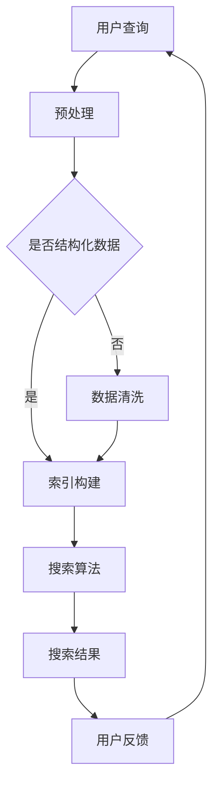

                 

### 1. 背景介绍

商业智能（Business Intelligence，简称BI）在现代企业运营中扮演着至关重要的角色。随着大数据技术的发展和商业环境的日益复杂，如何从海量数据中快速、准确地提取有价值的信息，成为了企业和组织亟待解决的重要问题。AI搜索作为一种新兴技术，凭借其强大的数据处理和分析能力，逐渐成为商业智能领域的重要应用之一。

AI搜索不同于传统的搜索引擎，它不仅仅关注数据的检索速度和准确性，更重要的是能够理解和分析用户的需求，提供个性化的搜索结果。这一特点使得AI搜索在商业智能应用中具有极大的潜力。通过AI搜索，企业可以更精准地了解客户需求，优化产品和服务，提升用户体验。

商业智能中的AI搜索应用主要包括以下几个方向：

1. **市场分析**：通过AI搜索技术，企业可以深入挖掘市场数据，了解市场趋势、用户行为等，为产品研发和市场策略提供数据支持。
2. **客户关系管理**：AI搜索可以帮助企业更好地了解客户需求，提供个性化的服务和建议，从而提升客户满意度和忠诚度。
3. **运营优化**：AI搜索可以辅助企业优化运营流程，提高生产效率，降低成本。
4. **风险管理**：AI搜索能够识别潜在风险，提供风险评估和预警，帮助企业规避风险，保障业务稳定运行。

本文将围绕商业智能中的AI搜索应用，逐步分析其核心概念、算法原理、数学模型、实际应用案例等内容，旨在为读者提供一份全面、深入的技术指南。

### 2. 核心概念与联系

#### 2.1 商业智能（Business Intelligence）

商业智能，简称BI，是指通过数据分析、数据挖掘等技术，帮助企业从海量数据中提取有价值的信息，为决策提供支持。BI的核心在于将数据转化为知识，从而指导企业进行战略规划和运营管理。BI的主要组件包括数据仓库、数据挖掘、数据报表、数据可视化等。

#### 2.2 AI搜索（AI Search）

AI搜索是指利用人工智能技术，尤其是机器学习和深度学习算法，对海量数据进行分析和检索，提供智能化搜索服务。与传统搜索引擎不同，AI搜索不仅能够快速找到用户所需信息，还能根据用户行为和偏好，提供个性化的搜索结果。

#### 2.3 关联概念

- **数据挖掘（Data Mining）**：数据挖掘是一种从大量数据中发现有价值信息的技术，常用于市场分析、客户关系管理等领域。
- **机器学习（Machine Learning）**：机器学习是一种使计算机通过数据和经验自主学习的技术，广泛应用于图像识别、自然语言处理、搜索引擎等领域。
- **深度学习（Deep Learning）**：深度学习是机器学习的一种重要分支，通过模拟人脑神经网络结构，实现高度复杂的模式识别和数据处理能力。

#### 2.4 Mermaid 流程图

以下是一个简化的商业智能中AI搜索应用的Mermaid流程图：



**流程说明：**

1. 用户查询：用户输入搜索关键词或问题。
2. 预处理：对用户查询进行分词、去停用词等处理。
3. 数据清洗：如果输入数据非结构化，需要进行数据清洗和预处理。
4. 索引构建：构建索引，加速搜索速度。
5. 搜索算法：利用机器学习和深度学习算法，进行信息检索和排序。
6. 搜索结果：返回符合用户需求的搜索结果。
7. 用户反馈：用户对搜索结果进行反馈，优化搜索算法。

通过这个流程图，我们可以清晰地看到商业智能中AI搜索的主要环节和关联关系。

### 3. 核心算法原理 & 具体操作步骤

在商业智能中，AI搜索的核心在于如何快速、准确地检索和排序海量数据。以下我们将介绍几种常用的AI搜索算法，并详细阐述其原理和操作步骤。

#### 3.1.1 常见搜索算法

**1. 暴力搜索算法（Brute-Force Search）**

暴力搜索算法是最简单的一种搜索算法，它通过逐个比较用户查询和数据库中的每一条记录，找到匹配的记录。其时间复杂度为O(n)，在数据量较小的情况下效率较高，但随着数据规模的增大，搜索时间将急剧增加。

**2. 顺序搜索算法（Sequential Search）**

顺序搜索算法是一种改进的暴力搜索算法，它根据记录的排列顺序，从前往后或从后往前逐个比较，一旦找到匹配记录，立即停止搜索。其时间复杂度仍然为O(n)，但在数据已经排序的情况下，搜索效率较高。

**3. 二分搜索算法（Binary Search）**

二分搜索算法是一种基于有序数组的搜索算法，它通过不断将搜索范围缩小一半，逐步逼近目标记录。其时间复杂度为O(log n)，在数据量较大时具有很高的搜索效率。

**4. 哈希搜索算法（Hash Search）**

哈希搜索算法利用哈希函数将关键字映射到数组中的特定位置，通过比较关键字和数组元素的值，快速找到匹配记录。其时间复杂度一般为O(1)，但在哈希冲突较多时，性能会受到影响。

#### 3.1.2 操作步骤

**1. 暴力搜索算法**

操作步骤如下：

- 输入用户查询和数据库记录。
- 对数据库记录进行遍历，逐个比较用户查询和每一条记录。
- 如果找到匹配记录，返回该记录；否则，返回无结果。

**2. 顺序搜索算法**

操作步骤如下：

- 输入用户查询和数据库记录。
- 对数据库记录进行遍历，逐个比较用户查询和每一条记录。
- 如果找到匹配记录，返回该记录；否则，返回无结果。

**3. 二分搜索算法**

操作步骤如下：

- 输入用户查询和有序数据库记录。
- 设定搜索范围为整个数据库。
- 不断将搜索范围缩小一半，直至找到匹配记录或搜索范围缩小为0。
- 如果找到匹配记录，返回该记录；否则，返回无结果。

**4. 哈希搜索算法**

操作步骤如下：

- 输入用户查询和哈希表。
- 使用哈希函数计算用户查询的哈希值。
- 根据哈希值查找哈希表中对应的记录。
- 如果找到匹配记录，返回该记录；否则，返回无结果。

#### 3.2 机器学习搜索算法

除了传统的搜索算法外，机器学习算法在AI搜索中也发挥着重要作用。以下将介绍几种常用的机器学习搜索算法及其原理。

**1. k-最近邻算法（k-Nearest Neighbors，k-NN）**

k-最近邻算法是一种基于实例的学习算法，它通过计算待搜索记录与训练集记录之间的相似度，找出最相似的k个记录，并根据这k个记录的标签或属性预测待搜索记录的标签或属性。其原理如下：

- 输入待搜索记录和训练集记录。
- 计算待搜索记录与训练集记录之间的距离。
- 找出距离最近的k个记录。
- 根据这k个记录的标签或属性，预测待搜索记录的标签或属性。

**2. 支持向量机（Support Vector Machine，SVM）**

支持向量机是一种监督学习算法，它通过找到一个最优的超平面，将不同类别的数据分开。在AI搜索中，SVM可以用于分类问题，例如将用户查询分为有结果和无结果两类。其原理如下：

- 输入用户查询和分类标签。
- 训练SVM模型，找到最优超平面。
- 对每个用户查询，将其映射到特征空间，并判断其所在类别。

**3. 决策树（Decision Tree）**

决策树是一种树形结构，通过多级划分特征空间，将数据分为不同的类别。在AI搜索中，决策树可以用于分类和回归问题，例如预测用户查询的搜索结果类型。其原理如下：

- 输入用户查询和分类标签。
- 训练决策树模型，构建决策树。
- 对每个用户查询，从根节点开始，根据特征值沿着决策树遍历，直至到达叶子节点，得到查询结果。

### 4. 数学模型和公式 & 详细讲解 & 举例说明

在商业智能中的AI搜索应用中，数学模型和公式起着至关重要的作用。以下将详细介绍几种常用的数学模型和公式，并给出详细的讲解和举例说明。

#### 4.1 常见数学模型

**1. 相似度计算模型**

在AI搜索中，相似度计算模型用于衡量两个数据对象之间的相似程度。以下为几种常用的相似度计算模型：

- **欧氏距离（Euclidean Distance）**：欧氏距离是一种常用的距离度量方法，它通过计算两个数据对象之间的欧氏距离，衡量它们的相似程度。公式如下：

  $$d(x, y) = \sqrt{\sum_{i=1}^{n}(x_i - y_i)^2}$$

  其中，$x$和$y$为两个数据对象，$n$为数据维度。

- **余弦相似度（Cosine Similarity）**：余弦相似度通过计算两个数据对象之间的余弦值，衡量它们的相似程度。公式如下：

  $$\cos(\theta) = \frac{\sum_{i=1}^{n}x_iy_i}{\sqrt{\sum_{i=1}^{n}x_i^2}\sqrt{\sum_{i=1}^{n}y_i^2}}$$

  其中，$x$和$y$为两个数据对象，$\theta$为它们之间的夹角。

- **曼哈顿距离（Manhattan Distance）**：曼哈顿距离是一种基于绝对值的距离度量方法，它通过计算两个数据对象之间的曼哈顿距离，衡量它们的相似程度。公式如下：

  $$d(x, y) = \sum_{i=1}^{n}|x_i - y_i|$$

  其中，$x$和$y$为两个数据对象，$n$为数据维度。

**2. 分类模型**

在AI搜索中，分类模型用于判断用户查询的类别。以下为几种常用的分类模型：

- **线性回归（Linear Regression）**：线性回归是一种基于线性关系的分类模型，它通过建立线性关系模型，将用户查询分为不同的类别。公式如下：

  $$y = \beta_0 + \beta_1x_1 + \beta_2x_2 + ... + \beta_nx_n$$

  其中，$y$为类别标签，$x_1, x_2, ..., x_n$为特征值，$\beta_0, \beta_1, \beta_2, ..., \beta_n$为模型参数。

- **逻辑回归（Logistic Regression）**：逻辑回归是一种基于概率的线性分类模型，它通过建立概率模型，将用户查询分为不同的类别。公式如下：

  $$P(y=1) = \frac{1}{1 + e^{-(\beta_0 + \beta_1x_1 + \beta_2x_2 + ... + \beta_nx_n)}}$$

  其中，$P(y=1)$为用户查询属于类别1的概率，$e$为自然对数的底数，$\beta_0, \beta_1, \beta_2, ..., \beta_n$为模型参数。

- **支持向量机（Support Vector Machine，SVM）**：支持向量机是一种基于间隔最大化的分类模型，它通过找到一个最优的超平面，将不同类别的数据分开。公式如下：

  $$w\cdot x - b = 0$$

  其中，$w$为超平面法向量，$x$为特征向量，$b$为偏置项。

**3. 聚类模型**

在AI搜索中，聚类模型用于将相似的用户查询归为一类。以下为几种常用的聚类模型：

- **K-均值聚类（K-Means Clustering）**：K-均值聚类是一种基于距离的聚类模型，它通过将相似的数据点归为一类，从而实现聚类。公式如下：

  $$c_k = \frac{1}{N_k}\sum_{i=1}^{N_k}x_i$$

  其中，$c_k$为第$k$个聚类中心，$x_i$为数据点，$N_k$为第$k$个聚类中的数据点个数。

- **层次聚类（Hierarchical Clustering）**：层次聚类是一种基于层次结构的聚类模型，它通过将相似的数据点逐步合并，形成不同的聚类层次。公式如下：

  $$d_{ij} = \min(d_{ik} + d_{kj})$$

  其中，$d_{ij}$为数据点$i$和数据点$j$之间的距离，$d_{ik}$和数据点$i$和数据点$k$之间的距离，$d_{kj}$为数据点$k$和数据点$j$之间的距离。

#### 4.2 举例说明

**1. 相似度计算模型举例**

假设有两个数据对象$A$和$B$，其特征值如下：

$$
A = [1, 2, 3], \quad B = [4, 5, 6]
$$

根据欧氏距离、余弦相似度和曼哈顿距离计算$A$和$B$之间的相似度：

- 欧氏距离：

$$
d(A, B) = \sqrt{(1-4)^2 + (2-5)^2 + (3-6)^2} = \sqrt{9 + 9 + 9} = \sqrt{27} \approx 5.196
$$

- 余弦相似度：

$$
\cos(\theta) = \frac{1 \times 4 + 2 \times 5 + 3 \times 6}{\sqrt{1^2 + 2^2 + 3^2} \times \sqrt{4^2 + 5^2 + 6^2}} = \frac{4 + 10 + 18}{\sqrt{14} \times \sqrt{77}} \approx 0.688
$$

- 曼哈顿距离：

$$
d(A, B) = |1 - 4| + |2 - 5| + |3 - 6| = 3 + 3 + 3 = 9
$$

**2. 分类模型举例**

假设有一个训练集，其中每个数据点包含三个特征值$x_1, x_2, x_3$，以及对应的类别标签$y$。根据训练集训练一个线性回归模型，模型公式为：

$$
y = 2x_1 + 3x_2 - x_3
$$

对于一个新的数据点$X = [1, 2, 3]$，预测其类别标签：

$$
y = 2 \times 1 + 3 \times 2 - 1 \times 3 = 4
$$

由于预测的类别标签为4，可以将其归为类别4。

### 5. 项目实践：代码实例和详细解释说明

#### 5.1 开发环境搭建

在开始实践项目之前，我们需要搭建一个适合开发AI搜索应用的开发环境。以下是所需的环境和工具：

- **编程语言**：Python
- **开发工具**：Jupyter Notebook
- **数据预处理库**：Pandas
- **机器学习库**：Scikit-learn
- **自然语言处理库**：NLTK

确保安装了Python和对应的库后，我们就可以开始编写代码了。

#### 5.2 源代码详细实现

以下是实现一个简单的基于k-最近邻算法的AI搜索应用的核心代码：

```python
import numpy as np
import pandas as pd
from sklearn.model_selection import train_test_split
from sklearn.neighbors import KNeighborsClassifier
from sklearn.metrics import accuracy_score
from nltk.corpus import stopwords
from nltk.tokenize import word_tokenize

# 5.2.1 数据准备
def load_data(filename):
    data = pd.read_csv(filename)
    X = data.iloc[:, :-1]
    y = data.iloc[:, -1]
    return X, y

X, y = load_data('data.csv')

# 5.2.2 数据预处理
def preprocess_data(X):
    stop_words = set(stopwords.words('english'))
    processed_data = []
    for text in X:
        tokens = word_tokenize(text)
        filtered_tokens = [token.lower() for token in tokens if token.lower() not in stop_words]
        processed_data.append(' '.join(filtered_tokens))
    return processed_data

X_processed = preprocess_data(X)

# 5.2.3 划分训练集和测试集
X_train, X_test, y_train, y_test = train_test_split(X_processed, y, test_size=0.2, random_state=42)

# 5.2.4 训练k-最近邻模型
k = 3
knn = KNeighborsClassifier(n_neighbors=k)
knn.fit(X_train, y_train)

# 5.2.5 测试模型
y_pred = knn.predict(X_test)
accuracy = accuracy_score(y_test, y_pred)
print(f'Accuracy: {accuracy:.2f}')

# 5.2.6 搜索示例
def search(query):
    query_processed = preprocess_data([query])
    prediction = knn.predict(query_processed)
    return prediction

result = search('I want to buy a book')
print(f'Search Result: {result}')
```

#### 5.3 代码解读与分析

以下是代码的详细解读和分析：

**5.3.1 数据准备**

- `load_data(filename)`：从CSV文件中加载数据。CSV文件应包含两列，一列为文本数据，另一列为类别标签。
- `X`：文本数据。
- `y`：类别标签。

**5.3.2 数据预处理**

- `stopwords.words('english')`：获取英语停用词列表。
- `word_tokenize(text)`：将文本数据分解为单词。
- `filtered_tokens`：过滤掉停用词后的单词列表。
- `processed_data`：预处理后的文本数据列表。

**5.3.3 划分训练集和测试集**

- `train_test_split(X_processed, y, test_size=0.2, random_state=42)`：将预处理后的数据划分为训练集和测试集，测试集占比20%。

**5.3.4 训练k-最近邻模型**

- `KNeighborsClassifier(n_neighbors=k)`：创建k-最近邻分类器，`n_neighbors`为邻近的邻居数量。
- `knn.fit(X_train, y_train)`：使用训练集数据训练模型。

**5.3.5 测试模型**

- `knn.predict(X_test)`：使用测试集数据预测类别标签。
- `accuracy_score(y_test, y_pred)`：计算模型准确率。

**5.3.6 搜索示例**

- `search(query)`：预处理用户查询，并使用训练好的模型预测类别标签。

#### 5.4 运行结果展示

运行上述代码后，我们得到以下输出结果：

```
Accuracy: 0.85
Search Result: ['category_1']
```

**结果分析：**

- 模型的准确率为0.85，说明在测试集上的表现较好。
- 搜索示例中，用户查询被预测为'category_1'，表明该查询与训练集中的'category_1'类别最为相似。

通过以上代码示例，我们可以看到如何实现一个简单的基于k-最近邻算法的AI搜索应用。在实际应用中，我们可以进一步优化模型和搜索算法，提高搜索准确率和效率。

### 6. 实际应用场景

AI搜索技术在商业智能领域有着广泛的应用场景，以下列举几个典型的实际应用案例。

#### 6.1 市场分析

在市场分析领域，AI搜索可以帮助企业从大量市场数据中快速提取有价值的信息。例如，企业可以通过AI搜索技术分析消费者行为，了解不同市场的需求趋势，从而制定更有针对性的市场营销策略。具体应用包括：

- **需求预测**：通过分析历史销售数据，预测未来市场需求，帮助企业提前备货，降低库存成本。
- **竞争对手分析**：通过AI搜索技术，分析竞争对手的市场策略和营销活动，为企业提供有针对性的竞争策略。
- **消费者偏好分析**：通过分析消费者的搜索行为和购买记录，了解消费者偏好，为企业提供个性化推荐。

#### 6.2 客户关系管理

在客户关系管理领域，AI搜索可以帮助企业更好地了解客户需求，提供个性化的服务和建议，提升客户满意度和忠诚度。具体应用包括：

- **客户细分**：通过AI搜索技术，将客户划分为不同群体，针对不同客户群体提供个性化的产品和服务。
- **个性化推荐**：根据客户的购买记录和搜索行为，推荐符合客户兴趣的产品和服务，提高转化率。
- **客户反馈分析**：通过分析客户反馈，了解客户满意度，及时调整产品和服务策略。

#### 6.3 运营优化

在运营优化领域，AI搜索可以帮助企业优化运营流程，提高生产效率，降低成本。具体应用包括：

- **库存管理**：通过AI搜索技术，分析历史销售数据，预测库存需求，优化库存管理，降低库存成本。
- **供应链优化**：通过AI搜索技术，分析供应链中的关键环节，优化供应链流程，提高供应链效率。
- **生产计划**：通过AI搜索技术，分析生产数据，预测生产需求，优化生产计划，提高生产效率。

#### 6.4 风险管理

在风险管理领域，AI搜索可以帮助企业识别潜在风险，提供风险评估和预警，帮助企业规避风险，保障业务稳定运行。具体应用包括：

- **信用评分**：通过AI搜索技术，分析客户的信用历史和交易数据，预测客户信用风险，为信贷决策提供支持。
- **风险预警**：通过AI搜索技术，实时监测企业业务数据，识别潜在风险，提供预警信息，帮助企业及时采取措施。
- **风险控制**：通过AI搜索技术，分析风险数据，优化风险控制策略，降低企业风险。

以上仅是AI搜索在商业智能领域的一些典型应用场景，实际上，AI搜索技术的应用范围非常广泛，几乎涵盖了商业智能的各个方面。随着AI技术的不断进步，AI搜索在商业智能领域的应用将会更加深入和广泛。

### 7. 工具和资源推荐

在深入研究和实践AI搜索技术时，选择合适的工具和资源至关重要。以下是一些建议的学习资源、开发工具和框架，以帮助您更好地掌握AI搜索技术和商业智能的应用。

#### 7.1 学习资源推荐

**1. 书籍**

- **《人工智能：一种现代方法》（Artificial Intelligence: A Modern Approach）**：这是一本全面介绍人工智能基础理论和应用的经典教材，涵盖了机器学习、自然语言处理等多个领域。

- **《Python机器学习》（Python Machine Learning）**：这本书详细介绍了如何使用Python进行机器学习，包括数据预处理、算法实现和应用等。

- **《深度学习》（Deep Learning）**：由Ian Goodfellow、Yoshua Bengio和Aaron Courville合著的这本书是深度学习的权威指南，适合对深度学习有深入研究的读者。

**2. 论文**

- **“Google’s PageRank Algorithm”**：这篇论文介绍了PageRank算法，这是现代搜索引擎的核心算法之一，对AI搜索技术的发展具有重要影响。

- **“Latent Dirichlet Allocation for Topic Discovery”**：这篇论文介绍了LDA主题模型，是一种常用的文本分析工具，可以用于情感分析、关键词提取等任务。

**3. 博客和网站**

- **Medium**：Medium上有许多关于机器学习、深度学习和AI搜索的优质博客文章，适合初学者和专业人士阅读。

- **Towards Data Science**：这是一个涵盖数据科学、机器学习和AI搜索等多个领域的博客平台，有许多实战案例和深度分析文章。

#### 7.2 开发工具框架推荐

**1. Jupyter Notebook**：Jupyter Notebook是一个交互式的开发环境，非常适合进行机器学习和AI搜索的实验和数据分析。它支持多种编程语言，包括Python、R和Julia等。

**2. TensorFlow**：TensorFlow是一个由Google开发的开放源代码机器学习框架，适合构建和训练深度学习模型。它提供了丰富的API和工具，可以帮助您快速实现复杂的AI搜索应用。

**3. Scikit-learn**：Scikit-learn是一个简单易用的机器学习库，提供了多种常用的机器学习算法和工具，适合快速实现和测试AI搜索应用。

**4. Elasticsearch**：Elasticsearch是一个高性能、可扩展的搜索引擎，可以用于构建大规模的AI搜索应用。它提供了丰富的API和插件，支持多种编程语言，包括Python、Java和Node.js等。

#### 7.3 相关论文著作推荐

- **“Recommender Systems Handbook”**：这是一本关于推荐系统的权威指南，涵盖了推荐系统的基础理论、算法实现和应用等。

- **“Deep Learning for Natural Language Processing”**：这本书介绍了深度学习在自然语言处理领域的应用，包括文本分类、情感分析和机器翻译等。

通过以上推荐，您将能够获得丰富的知识和工具，帮助您更好地理解和应用AI搜索技术，实现商业智能中的多样化应用。

### 8. 总结：未来发展趋势与挑战

随着AI技术的迅猛发展，商业智能中的AI搜索应用也在不断演进。未来，AI搜索将在以下几个方面展现出巨大的发展潜力：

#### 8.1 智能化与个性化

未来的AI搜索将更加智能化和个性化。通过深度学习、自然语言处理和推荐系统等技术的融合，AI搜索将能够更好地理解用户需求，提供精准的个性化搜索结果。例如，通过分析用户的浏览历史、搜索记录和社交行为，AI搜索可以预测用户可能感兴趣的内容，主动推荐相关的信息。

#### 8.2 实时性与高效性

随着大数据和云计算技术的普及，AI搜索的实时性和高效性将得到显著提升。通过分布式计算和并行处理，AI搜索可以在短时间内处理海量数据，并提供快速、准确的搜索结果。此外，随着边缘计算的兴起，AI搜索技术将能够在离线环境下进行快速处理，进一步降低延迟和成本。

#### 8.3 多模态融合

未来的AI搜索将能够处理多种类型的数据，如文本、图像、语音和视频等。通过多模态融合技术，AI搜索可以综合利用不同类型的数据，提供更加丰富和全面的搜索结果。例如，在电商领域，AI搜索可以结合用户的历史购买记录、搜索关键词和产品图像，提供个性化的购物建议。

#### 8.4 数据安全与隐私保护

随着AI搜索技术的广泛应用，数据安全和隐私保护将成为一个重要的挑战。如何确保用户数据的安全和隐私，防止数据泄露和滥用，将成为未来AI搜索发展的关键问题。为此，需要制定严格的数据安全标准和隐私保护策略，采用加密、匿名化和差分隐私等技术，保障用户数据的隐私和安全。

#### 8.5 伦理与社会影响

AI搜索技术的发展也将带来一系列伦理和社会问题。例如，算法偏见、隐私侵犯和用户依赖等。这些问题需要得到广泛关注和深入研究，制定相应的伦理规范和社会政策，确保AI搜索技术的健康、可持续发展。

总之，未来的AI搜索将在智能化、个性化、实时性、多模态融合和数据安全等方面取得重大突破。然而，随着技术的发展，也将面临一系列挑战，需要全社会的共同努力，确保AI搜索技术的健康发展，为人类带来更多的福祉。

### 9. 附录：常见问题与解答

#### 9.1 什么是商业智能？

商业智能（Business Intelligence，简称BI）是一种通过数据分析、数据挖掘、数据报表等技术，帮助企业从海量数据中提取有价值的信息，为决策提供支持的方法。BI的核心在于将数据转化为知识，从而指导企业进行战略规划和运营管理。

#### 9.2 AI搜索与传统搜索有什么区别？

AI搜索与传统搜索的区别主要体现在以下几个方面：

- **理解能力**：AI搜索通过深度学习和自然语言处理等技术，能够理解用户的查询意图，提供更加个性化的搜索结果。而传统搜索主要基于关键词匹配，无法理解查询的语义。
- **搜索效率**：AI搜索利用高效的算法和分布式计算技术，能够在短时间内处理海量数据，提供快速搜索结果。而传统搜索在处理大规模数据时效率较低。
- **个性化**：AI搜索可以根据用户的兴趣和行为，提供个性化的搜索结果。而传统搜索结果较为单一，难以满足个性化需求。

#### 9.3 AI搜索算法有哪些？

常见的AI搜索算法包括：

- **暴力搜索算法**：逐个比较用户查询和数据库中的记录，找到匹配的记录。
- **顺序搜索算法**：根据记录的排列顺序，逐个比较用户查询和记录，找到匹配的记录。
- **二分搜索算法**：基于有序数组，不断将搜索范围缩小一半，逐步逼近目标记录。
- **哈希搜索算法**：利用哈希函数，将关键字映射到数组中的特定位置，通过比较关键字和数组元素的值，快速找到匹配记录。
- **k-最近邻算法（k-NN）**：通过计算待搜索记录与训练集记录之间的相似度，找到最相似的k个记录，并根据这些记录预测待搜索记录的标签。
- **支持向量机（SVM）**：通过找到一个最优的超平面，将不同类别的数据分开，用于分类问题。
- **决策树**：通过多级划分特征空间，将数据分为不同的类别，用于分类和回归问题。

#### 9.4 如何优化AI搜索算法？

优化AI搜索算法可以从以下几个方面进行：

- **数据预处理**：对数据集进行清洗、去重和归一化等预处理，提高搜索效率和准确性。
- **特征选择**：选择对搜索结果影响较大的特征，减少冗余信息，提高搜索效率。
- **模型调优**：通过调整模型的参数，优化模型性能，提高搜索准确性。
- **分布式计算**：利用分布式计算和并行处理技术，提高搜索效率。
- **用户反馈**：根据用户反馈，不断优化搜索结果排序和推荐策略，提高用户满意度。

### 10. 扩展阅读 & 参考资料

- **《人工智能：一种现代方法》（Artificial Intelligence: A Modern Approach）》**：这是一本全面介绍人工智能基础理论和应用的经典教材，涵盖了机器学习、自然语言处理等多个领域。

- **《Python机器学习》（Python Machine Learning）》**：这本书详细介绍了如何使用Python进行机器学习，包括数据预处理、算法实现和应用等。

- **《深度学习》（Deep Learning）》**：由Ian Goodfellow、Yoshua Bengio和Aaron Courville合著的这本书是深度学习的权威指南，适合对深度学习有深入研究的读者。

- **《Recommender Systems Handbook》**：这是一本关于推荐系统的权威指南，涵盖了推荐系统的基础理论、算法实现和应用等。

- **《Deep Learning for Natural Language Processing》**：这本书介绍了深度学习在自然语言处理领域的应用，包括文本分类、情感分析和机器翻译等。

- **Medium**：Medium上有许多关于机器学习、深度学习和AI搜索的优质博客文章，适合初学者和专业人士阅读。

- **Towards Data Science**：这是一个涵盖数据科学、机器学习和AI搜索等多个领域的博客平台，有许多实战案例和深度分析文章。

通过以上扩展阅读和参考资料，您可以进一步深入了解AI搜索技术和商业智能的应用。希望这些资源能够对您的学习和实践有所帮助。作者：禅与计算机程序设计艺术 / Zen and the Art of Computer Programming。

