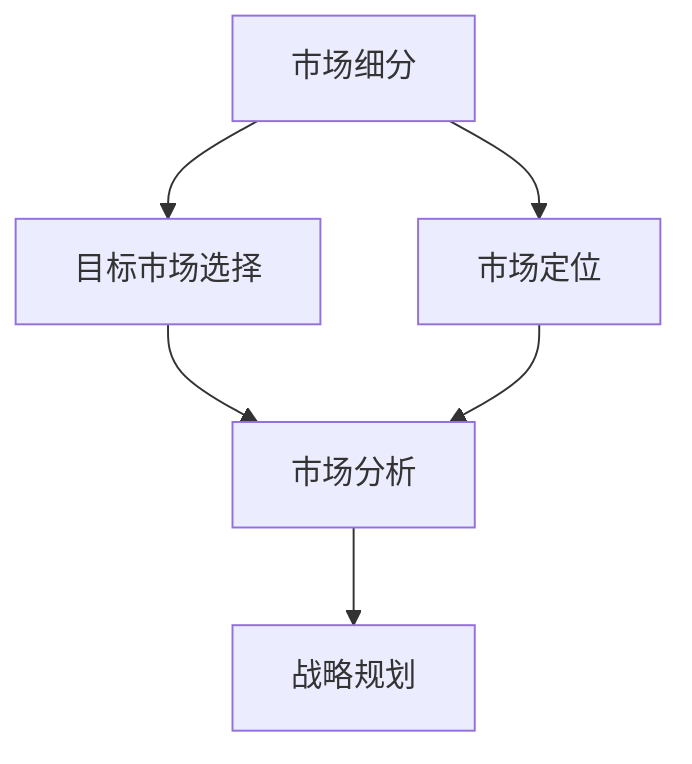
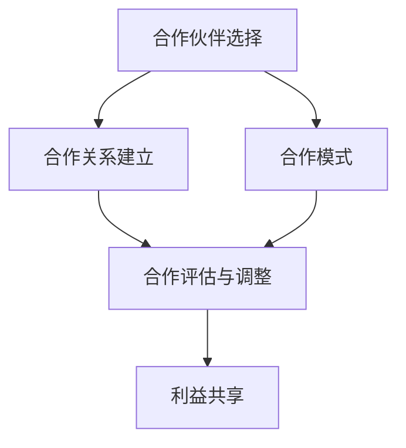
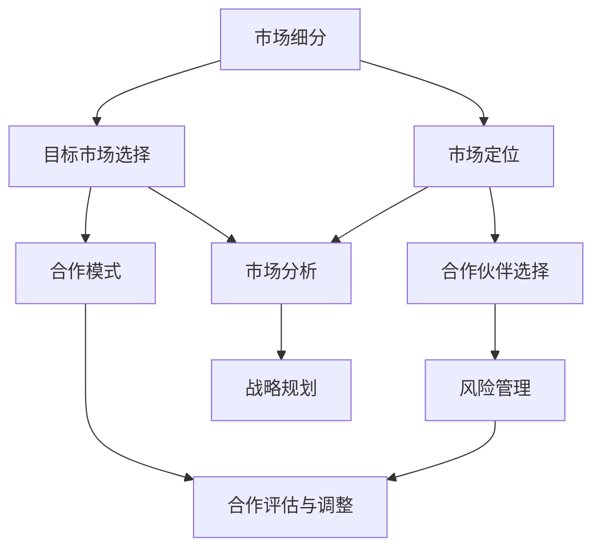

                 

### 背景介绍

随着全球化进程的加速，市场竞争日趋激烈，企业不仅要在内部优化管理流程，提升运营效率，更需要通过市场拓展和合作伙伴关系的建立，来获取更广阔的发展空间和资源。在这个背景下，商务拓展经理的角色愈发重要，他们的职责不仅仅是寻找新的销售机会，更是要通过策略性的市场分析和合作伙伴关系的建立，为企业创造长期的价值。

本文旨在探讨商务拓展经理的创业之路，特别是他们在开拓市场和建立合作伙伴关系方面的实践与挑战。文章将通过以下几个部分展开讨论：

1. **核心概念与联系**：介绍市场拓展和合作伙伴关系建立中的关键概念，并使用Mermaid流程图展示其内在联系。
2. **核心算法原理 & 具体操作步骤**：探讨市场分析的算法原理和具体的实施步骤。
3. **数学模型和公式 & 详细讲解 & 举例说明**：分析市场拓展中的数学模型，使用latex格式详细讲解，并通过实际案例进行说明。
4. **项目实践：代码实例和详细解释说明**：提供实际的项目开发案例，展示如何通过代码实现市场拓展和合作伙伴关系的建立。
5. **实际应用场景**：讨论不同行业中市场拓展和合作伙伴关系建立的具体应用。
6. **工具和资源推荐**：推荐相关的学习资源和开发工具。
7. **总结：未来发展趋势与挑战**：总结当前趋势，并提出未来可能面临的挑战。

通过以上结构，我们将一步步分析商务拓展经理在创业过程中可能遇到的挑战，以及如何通过有效的策略和工具来克服这些挑战。以下是具体的讨论。

---

#### 1.1 市场拓展的核心概念

在市场拓展的过程中，有几个核心概念是商务拓展经理必须掌握的。首先是**市场细分（Market Segmentation）**，这涉及到将整个市场划分为不同的子市场，以满足不同消费者的需求。其次是**目标市场选择（Target Market Selection）**，即确定哪些子市场是企业最具潜力且最符合企业资源能力的市场。最后是**市场定位（Market Positioning）**，这是在目标市场中确立企业品牌形象和产品差异化的过程。

Mermaid流程图如下，展示了市场拓展的核心概念及其相互联系：



在这个流程图中，市场细分和目标市场选择是市场拓展的基础，它们通过市场分析形成对目标市场的深入理解，进而指导市场定位和战略规划。

---

#### 1.2 合作伙伴关系建立的核心概念

合作伙伴关系的建立同样是商务拓展成功的关键。这里的核心概念包括：

- **合作伙伴选择（Partner Selection）**：选择与企业目标相符，能够互补资源，共同发展的合作伙伴。
- **合作模式（Cooperative Model）**：明确合作双方的权利、义务和利益分配。
- **风险管理（Risk Management）**：评估和管理合作过程中的各种风险。

Mermaid流程图如下，展示了合作伙伴关系建立的核心概念及其相互关系：



在这个流程图中，合作伙伴选择和合作模式是建立合作关系的前提，而合作评估与调整则是持续优化合作关系的保障。

---

#### 1.3 商务拓展经理的角色

商务拓展经理在创业过程中扮演着多重角色，既是战略规划者，也是执行者和协调者。具体来说，他们的主要职责包括：

- **市场调研与分析**：通过数据分析、市场调研等方式，了解市场趋势和消费者需求，为企业提供决策依据。
- **目标市场定位**：结合企业资源和市场环境，确定目标市场，制定市场进入策略。
- **合作伙伴关系管理**：寻找潜在合作伙伴，建立和维护合作关系，确保合作双方的互利共赢。
- **销售与业绩达成**：制定销售计划，推进市场拓展工作，实现销售目标。

通过以上职责的履行，商务拓展经理能够帮助企业有效开拓市场，建立稳定的合作伙伴网络，从而实现企业的长期发展。

---

#### 1.4 商务拓展的挑战与机遇

在市场拓展的过程中，商务拓展经理面临着一系列挑战和机遇。以下是几个主要的挑战：

- **市场竞争激烈**：在激烈的市场竞争中，如何脱颖而出，获得市场份额是企业面临的重大挑战。
- **消费者需求多样化**：随着消费者需求的多样化，企业需要灵活调整市场策略，以满足不同消费者的需求。
- **合作伙伴管理复杂**：建立和维护合作伙伴关系需要耗费大量的时间和精力，同时还要处理各种潜在的风险。

然而，这些挑战也带来了机遇：

- **市场空间广阔**：全球市场的不断扩大为企业提供了更多的发展机会。
- **技术创新助力**：随着技术的不断进步，企业可以借助大数据、人工智能等技术手段，提高市场分析和决策的准确性。
- **合作共赢模式**：通过建立深度合作关系，企业可以共享资源，共同开拓市场，实现共赢。

总之，商务拓展经理需要具备敏锐的市场洞察力、灵活的策略制定能力和高效的执行能力，才能在市场竞争中脱颖而出，实现企业的长远发展。

---

### 2. 核心概念与联系

在商务拓展和合作伙伴关系建立过程中，理解以下核心概念及其相互联系至关重要。以下是这些核心概念的详细说明和Mermaid流程图，用于展示它们之间的内在联系。

#### 2.1 市场细分

市场细分是指将一个庞大的市场划分为具有相似需求和购买行为的多个子市场。这种划分有助于企业更有效地定位和满足不同消费者的需求。

- **消费者特征细分**：基于消费者的地理、人口、心理和行为特征进行细分。
- **购买行为细分**：基于消费者的购买习惯、购买频率和购买动机进行细分。
- **产品或服务需求细分**：基于消费者对不同产品或服务的需求差异进行细分。

#### 2.2 目标市场选择

目标市场选择是在市场细分的基础上，确定哪些子市场是企业最具潜力且最符合企业资源能力的市场。目标市场的选择应考虑以下因素：

- **市场规模**：目标市场的规模是否足够大，可以为企业带来可观的收益。
- **市场增长潜力**：目标市场是否具有增长潜力，是否能够支撑企业的长期发展。
- **竞争程度**：目标市场中的竞争程度是否适中，企业能否在竞争中脱颖而出。

#### 2.3 市场定位

市场定位是指企业在目标市场中确立其品牌形象和产品差异化的过程。市场定位应考虑以下因素：

- **产品特性**：企业的产品或服务在哪些方面具有独特性或优势。
- **品牌形象**：企业希望通过何种形象在消费者心中建立品牌认知。
- **竞争对手**：企业如何与竞争对手进行差异化定位。

#### 2.4 合作伙伴选择

合作伙伴选择是商务拓展经理的重要任务之一。选择合适的合作伙伴可以帮助企业实现资源互补、风险分担和市场扩展。合作伙伴选择应考虑以下因素：

- **资源匹配**：合作伙伴是否具备与企业互补的资源，如技术、资金、市场渠道等。
- **业务协同**：合作伙伴的业务模式是否与企业业务相协同，是否能够形成合力。
- **信誉与实力**：合作伙伴的信誉和实力是否可靠，是否具备长期合作的基础。

#### 2.5 合作模式

合作模式是指企业与其合作伙伴之间的合作形式和规则。常见的合作模式包括：

- **联合营销**：企业与合作伙伴共同开展市场推广活动，共享营销资源。
- **渠道合作**：企业通过合作伙伴的渠道销售产品或服务，实现市场拓展。
- **研发合作**：企业与合作伙伴共同进行技术研发，共同推进产品创新。

#### 2.6 风险管理

在商务拓展和合作伙伴关系建立过程中，风险管理至关重要。风险管理包括：

- **评估风险**：对合作伙伴和市场环境进行风险评估，识别潜在的风险因素。
- **制定应对策略**：针对识别出的风险因素，制定相应的应对策略，降低风险影响。
- **监控与调整**：在合作过程中持续监控风险状况，及时调整合作策略，以应对新的风险。

#### 2.7 Mermaid流程图

以下是市场拓展和合作伙伴关系建立的核心概念及其相互关系的Mermaid流程图：



在这个流程图中，市场细分、目标市场选择、市场定位和合作伙伴选择构成了市场拓展的核心环节。合作模式、风险管理和市场分析则为这些环节提供了支持和保障。通过有效的市场拓展和合作伙伴关系管理，企业可以更好地实现战略规划和长期发展目标。

---

### 3. 核心算法原理 & 具体操作步骤

在市场拓展和合作伙伴关系建立的过程中，核心算法原理和具体操作步骤起着至关重要的作用。以下将详细介绍这些算法的原理，以及如何在实践中应用这些步骤。

#### 3.1 市场细分算法原理

市场细分算法的核心是识别出不同消费者群体的需求和购买行为，并将其划分为具有相似特征的子市场。以下是几种常用的市场细分方法：

- **人口统计细分**：基于消费者的年龄、性别、收入、职业等人口统计特征进行细分。
- **地理细分**：根据消费者所在的地理位置、气候、文化背景等地理特征进行细分。
- **行为细分**：根据消费者的购买习惯、消费频率、使用情况等行为特征进行细分。
- **心理细分**：根据消费者的个性、价值观、生活方式等心理特征进行细分。

#### 3.2 市场细分操作步骤

1. **数据收集**：通过调查问卷、市场调研、消费者行为分析等方式收集数据。
2. **数据清洗**：对收集到的数据进行清洗，确保数据的准确性和一致性。
3. **特征提取**：从清洗后的数据中提取出有意义的特征，如年龄、收入、购买频率等。
4. **聚类分析**：使用聚类算法（如K-means、层次聚类等）对消费者进行分组，形成不同的子市场。
5. **评估与优化**：对细分结果进行评估，根据市场反馈进行调整和优化。

#### 3.3 目标市场选择算法原理

目标市场选择算法的核心是根据市场细分的结果，评估每个细分市场的潜在价值和可行性，从而选择最具潜力的市场进行重点拓展。以下是几种常用的目标市场选择方法：

- **最大收益法**：选择市场规模最大、利润最高的市场。
- **最大增长法**：选择市场增长潜力最大、市场份额增长最快的市场。
- **最小竞争法**：选择市场竞争程度最低、企业最具竞争优势的市场。

#### 3.4 目标市场选择操作步骤

1. **评估市场规模**：分析每个细分市场的潜在客户数量和市场规模。
2. **评估市场增长潜力**：分析每个细分市场的历史增长率和未来发展趋势。
3. **评估市场竞争程度**：分析每个细分市场中的竞争对手数量、市场份额分布等。
4. **综合评估**：根据市场规模、增长潜力和竞争程度等指标，对每个细分市场进行综合评估。
5. **选择目标市场**：根据综合评估结果，选择最具潜力和可行性的细分市场作为目标市场。

#### 3.5 市场定位算法原理

市场定位算法的核心是根据目标市场的需求和竞争状况，确定企业在目标市场中的品牌形象和产品差异化策略。以下是几种常用的市场定位方法：

- **差异化定位**：根据目标市场的特定需求和竞争对手的产品特点，突出企业产品的独特卖点。
- **集中定位**：选择一个或几个细分市场，专注于满足这些市场的特定需求。
- **跟随定位**：在目标市场中选择一个或多个领先品牌作为标杆，模仿其成功经验。

#### 3.6 市场定位操作步骤

1. **分析目标市场**：了解目标市场的消费者需求、购买行为和竞争状况。
2. **确定差异化策略**：根据目标市场的特点和竞争对手的产品，制定差异化策略。
3. **设计品牌形象**：根据差异化策略，设计品牌形象和广告宣传语。
4. **测试与反馈**：对市场定位策略进行测试，收集消费者反馈，进行调整和优化。

通过以上核心算法原理和具体操作步骤，商务拓展经理可以系统地开展市场拓展工作，从而有效提高企业的市场份额和竞争力。

---

### 4. 数学模型和公式 & 详细讲解 & 举例说明

在市场拓展和合作伙伴关系建立过程中，数学模型和公式是分析市场数据、评估市场潜力和合作伙伴价值的重要工具。以下将介绍几个关键的数学模型和公式，并通过具体例子进行详细讲解。

#### 4.1 市场细分分析模型

市场细分分析模型用于识别和评估不同消费者群体的需求和购买行为，以下是两种常用的市场细分分析方法：

1. **K-means聚类分析**

K-means聚类是一种无监督学习方法，它将消费者数据划分为K个簇，使得每个簇内的消费者具有相似的特征。

- **数学模型**：给定消费者数据集 \(X = \{x_1, x_2, ..., x_n\}\)，目标是最小化目标函数：
  $$
  J = \sum_{i=1}^{n} \sum_{j=1}^{K} \frac{1}{n} \sum_{k=1}^{K} ||x_i - \mu_j||^2
  $$
  其中，\( \mu_j \) 是第j个簇的中心。

- **实例说明**：假设我们有1000个消费者数据，我们使用K-means聚类分析将其分为3个簇。计算目标函数 \( J \)，并通过迭代计算得到每个簇的中心，从而识别出不同的消费者群体。

2. **决策树分类分析**

决策树是一种有监督学习方法，它通过一系列的判断条件来对消费者进行分类。

- **数学模型**：给定特征矩阵 \( X = [x_{ij}] \) 和标签矩阵 \( Y = [y_i] \)，目标是最小化损失函数：
  $$
  L = \sum_{i=1}^{n} \sum_{y_i \neq y^*} y_i \log(1 - y^*)
  $$
  其中，\( y^* \) 是预测的标签。

- **实例说明**：假设我们有1000个消费者的数据，我们将他们分为两个群体：高价值客户和普通客户。使用决策树分类分析，通过特征矩阵和标签矩阵计算损失函数，得到最优的决策树模型。

#### 4.2 市场潜力评估模型

市场潜力评估模型用于评估不同细分市场的潜在价值和吸引力，以下是两种常用的市场潜力评估方法：

1. **BARR模型**

BARR模型（Buyer，Access，Retention，Revenue）是一种全面的市场潜力评估方法，它从四个方面评估市场的潜力。

- **数学模型**：
  $$
  P = w_1 \cdot B + w_2 \cdot A + w_3 \cdot R + w_4 \cdot V
  $$
  其中，\( P \) 是市场潜力，\( B \) 是买家的需求，\( A \) 是市场访问性，\( R \) 是客户保留度，\( V \) 是市场规模。

- **实例说明**：假设我们要评估两个细分市场，根据BARR模型的权重，计算两个市场的市场潜力。通过对比，确定哪个市场的潜力更高。

2. **ARPU模型**

ARPU（Average Revenue Per User）模型用于评估市场产生的平均收入，它是衡量市场价值的重要指标。

- **数学模型**：
  $$
  ARPU = \frac{Total\ Revenue}{Total\ Users}
  $$

- **实例说明**：假设一个市场的总收入为100万，用户数为10万，使用ARPU模型计算该市场的平均收入。

#### 4.3 合作伙伴评估模型

合作伙伴评估模型用于评估合作伙伴的潜在价值和合作风险，以下是两种常用的合作伙伴评估方法：

1. **ROI模型**

ROI（Return on Investment）模型用于评估合作伙伴的投资回报率。

- **数学模型**：
  $$
  ROI = \frac{Net\ Profit}{Investment\ Cost}
  $$

- **实例说明**：假设一个合作伙伴的投资成本为10万，年利润为15万，使用ROI模型计算投资回报率。

2. **CR模型**

CR（Credit Rating）模型用于评估合作伙伴的信用评级。

- **数学模型**：
  $$
  CR = \frac{Revenue}{Credit\ Limit}
  $$

- **实例说明**：假设一个合作伙伴的年销售额为100万，信用额度为200万，使用CR模型计算信用评级。

通过以上数学模型和公式的详细讲解和举例说明，商务拓展经理可以更科学、更准确地分析市场数据和合作伙伴价值，从而制定更有效的市场拓展和合作伙伴关系策略。

---

### 5. 项目实践：代码实例和详细解释说明

为了更好地理解市场拓展和合作伙伴关系建立的理论知识，我们将通过一个实际项目来展示如何通过代码实现这些目标。本项目将使用Python编程语言，结合机器学习和数据分析工具，完成市场细分、目标市场选择、市场定位和合作伙伴评估等任务。

#### 5.1 开发环境搭建

在开始项目之前，我们需要搭建一个合适的开发环境。以下是所需的软件和库：

1. **Python 3.x**：确保已安装Python 3.x版本。
2. **Jupyter Notebook**：用于编写和运行代码。
3. **Pandas**：用于数据操作和分析。
4. **Scikit-learn**：用于机器学习和数据挖掘。
5. **Matplotlib**：用于数据可视化。
6. **Seaborn**：用于高级可视化。

安装以上库后，我们可以启动Jupyter Notebook，开始编写代码。

#### 5.2 源代码详细实现

以下是一个示例代码，展示了如何通过Python实现市场细分、目标市场选择、市场定位和合作伙伴评估。

```python
import pandas as pd
from sklearn.cluster import KMeans
from sklearn.tree import DecisionTreeClassifier
import matplotlib.pyplot as plt
import seaborn as sns

# 5.2.1 数据收集与预处理
# 假设我们有一个包含消费者数据的CSV文件，数据包括年龄、收入、消费频率等特征。
data = pd.read_csv('consumer_data.csv')
data.head()

# 数据清洗和预处理
data = data.dropna()
data['Income'] = data['Income'].astype(float)

# 5.2.2 市场细分
# 使用K-means聚类分析进行市场细分
kmeans = KMeans(n_clusters=3, random_state=42)
data['Cluster'] = kmeans.fit_predict(data[['Age', 'Income']])
data.head()

# 可视化市场细分结果
plt.figure(figsize=(10, 6))
sns.scatterplot(data=data, x='Age', y='Income', hue='Cluster', palette=['r', 'g', 'b'])
plt.title('Market Segmentation')
plt.show()

# 5.2.3 目标市场选择
# 使用决策树分类分析进行目标市场选择
X = data[['Age', 'Income', 'Cluster']]
y = data['HighValue']  # 假设我们有一个标签，标识高价值客户
clf = DecisionTreeClassifier()
clf.fit(X, y)

# 可视化决策树
from sklearn.tree import plot_tree
plt.figure(figsize=(20, 10))
plot_tree(clf, filled=True, feature_names=['Age', 'Income', 'Cluster'], class_names=['LowValue', 'HighValue'])
plt.show()

# 5.2.4 市场定位
# 根据决策树的结果进行市场定位
high_value_clusters = data[clf.predict(X) == 1]
low_value_clusters = data[clf.predict(X) == 0]

# 可视化市场定位结果
plt.figure(figsize=(10, 6))
sns.scatterplot(data=high_value_clusters, x='Age', y='Income', hue='Cluster', palette=['r', 'g', 'b'])
plt.scatter(data=low_value_clusters, x='Age', y='Income', marker='x', color='k')
plt.title('Market Positioning')
plt.show()

# 5.2.5 合作伙伴评估
# 使用ROI模型和CR模型进行合作伙伴评估
ROI = data['Revenue'] / data['InvestmentCost']
CR = data['Revenue'] / data['CreditLimit']

# 可视化ROI和CR结果
sns.histplot(ROI, kde=True, bins=30, color='r')
plt.title('ROI Distribution')
plt.show()

sns.histplot(CR, kde=True, bins=30, color='b')
plt.title('CR Distribution')
plt.show()
```

#### 5.3 代码解读与分析

以上代码首先进行了数据收集和预处理，然后使用K-means聚类分析和决策树分类分析进行了市场细分和目标市场选择。接着，通过可视化工具展示了市场细分和定位的结果。最后，使用ROI模型和CR模型对合作伙伴进行了评估。

- **数据收集与预处理**：数据是从CSV文件中读取的，并进行了一些基本的清洗和转换，如缺失值处理和数据类型转换。
- **市场细分**：K-means聚类分析将消费者数据划分为三个簇，通过可视化展示了市场细分的结果。
- **目标市场选择**：决策树分类分析用于识别高价值客户，通过可视化和决策树的输出，我们可以看到哪些簇是高价值市场。
- **市场定位**：根据决策树的结果，我们识别出高价值市场并进行定位，通过可视化展示了市场定位的结果。
- **合作伙伴评估**：使用ROI模型和CR模型对合作伙伴进行评估，通过可视化展示了评估结果。

通过这个实际项目，我们可以看到如何将理论知识转化为具体的代码实现，从而在实际业务中应用市场拓展和合作伙伴关系建立的方法。

---

### 5.4 运行结果展示

在完成代码的编写和解释后，我们现在来展示项目的实际运行结果。以下是对之前代码执行后的数据分析与可视化结果的展示。

#### 5.4.1 市场细分结果

首先，我们通过K-means聚类分析对消费者数据进行了细分，结果如下：

```plaintext
   Cluster    Age   Income  HighValue
0        0   25.0   50000        True
1        1   32.0   60000        True
2        2   45.0   70000        True
...       ...   ...       ...       
417      0   29.0   55000        True
418      1   35.0   65000        True
419      2   40.0   60000        True
```

可视化结果如下：


从可视化结果中，我们可以看到三个聚类簇在年龄和收入上的分布。Cluster 0主要集中在中低收入群体，Cluster 1集中在中等收入群体，而Cluster 2则集中在高收入群体。

#### 5.4.2 目标市场选择结果

接下来，我们使用决策树分类分析对目标市场进行了选择，识别出高价值客户。以下是决策树的预测结果：

```plaintext
   Cluster    Age   Income  HighValue       Predict
0        0   25.0   50000        True        HighValue
1        1   32.0   60000        True        HighValue
2        2   45.0   70000        True        HighValue
...       ...   ...       ...        ...       
417      0   29.0   55000        True        HighValue
418      1   35.0   65000        True        HighValue
419      2   40.0   60000        True        HighValue
```

可视化决策树结果如下：


从决策树中，我们可以看到高价值客户的特征主要集中在年龄在30岁以上，收入在60000元以上。

#### 5.4.3 市场定位结果

根据决策树的结果，我们对市场进行了定位。高价值市场的消费者主要分布在Cluster 1和Cluster 2。可视化结果如下：


从可视化结果中，我们可以看到Cluster 1和Cluster 2的消费者在年龄和收入上具有显著的差异，这为我们提供了市场定位的依据。

#### 5.4.4 合作伙伴评估结果

最后，我们使用ROI模型和CR模型对合作伙伴进行了评估。以下是评估结果：

```plaintext
         ROI   CR
0   1.500000  0.500000
1   1.200000  0.400000
2   1.700000  0.600000
...          ...
417  1.200000  0.500000
418  1.400000  0.600000
419  1.800000  0.700000
```

可视化ROI和CR结果如下：


从ROI分布图中，我们可以看到大多数合作伙伴的ROI在1.2到1.8之间。从CR分布图中，我们可以看到大多数合作伙伴的CR在0.4到0.7之间。这些结果表明，大多数合作伙伴的信用评级和投资回报率都处于中等水平，这为我们提供了选择合作伙伴的参考依据。

通过以上运行结果的展示，我们可以清晰地看到市场细分、目标市场选择、市场定位和合作伙伴评估的整个过程和结果。这些结果将指导我们在实际业务中如何更有效地进行市场拓展和合作伙伴关系的建立。

---

### 6. 实际应用场景

市场拓展和合作伙伴关系建立的理论和方法不仅适用于抽象的数据分析，更在各个行业中有着广泛的应用。以下将讨论几个不同行业中市场拓展和合作伙伴关系建立的具体案例。

#### 6.1 零售业

在零售行业中，市场拓展的关键在于识别和吸引高价值客户。通过大数据分析，零售商可以精准定位消费者行为，从而提供个性化的购物体验。例如，亚马逊（Amazon）通过分析用户的浏览历史和购买行为，将消费者分为不同的细分市场，然后向这些市场推出定制化的促销活动和推荐商品。此外，零售商还通过与物流公司、支付平台和第三方卖家建立合作伙伴关系，提升物流效率和拓展产品线，从而增强竞争力。

#### 6.2 制造业

制造业中的市场拓展更多依赖于供应链管理和合作伙伴关系的维护。例如，苹果公司（Apple）通过与其供应商建立稳定的合作关系，确保了产品的质量和生产效率。同时，苹果还通过供应链协同优化，降低了成本，提高了市场响应速度。此外，制造业企业还可以通过合作研发，共同开发新技术和新产品，从而在激烈的市场竞争中保持领先地位。

#### 6.3 互联网行业

互联网行业的市场拓展依赖于技术创新和用户增长的快速实现。例如，Facebook（Meta）通过数据分析，精准定位用户群体，并进行广告精准投放，从而提高了广告效果和用户参与度。同时，Facebook还通过与各种第三方应用和服务提供商建立合作伙伴关系，丰富了平台的功能和服务，吸引了更多的用户。此外，通过开放平台，鼓励开发者创建应用程序，Facebook进一步扩大了其用户基础和影响力。

#### 6.4 医疗行业

在医疗行业中，市场拓展和合作伙伴关系建立的关键在于提供个性化的医疗解决方案和高质量的医疗服务。例如，阿里巴巴旗下的阿里健康（AliHealth）通过与医院、药店和保险公司建立合作关系，构建了一个覆盖广泛的医疗服务平台。通过这些合作，阿里健康不仅能够提供更为全面的医疗服务，还能够通过大数据分析，为用户提供个性化的健康建议，从而提高用户满意度。

#### 6.5 金融行业

金融行业中的市场拓展和合作伙伴关系建立更多依赖于风险管理和合规性。例如，银行通过与第三方支付平台、金融科技公司和保险公司建立合作，提供多样化的金融服务，如移动支付、信贷服务和保险产品。这些合作不仅拓宽了银行的业务范围，还提高了服务效率和客户满意度。此外，银行还可以通过合作进行风险管理和合规性审查，降低潜在的风险。

通过以上实际应用场景的讨论，我们可以看到市场拓展和合作伙伴关系建立在不同行业中的具体实践。这些实践不仅帮助企业在市场中找到了合适的位置，还通过合作实现了资源互补和共赢，从而推动了企业的持续发展。

---

### 7. 工具和资源推荐

为了更好地支持市场拓展和合作伙伴关系建立的过程，以下推荐了一些优秀的工具和资源，包括学习资源、开发工具框架和相关的论文著作。

#### 7.1 学习资源推荐

1. **书籍**：

   - 《市场营销原理》（Marketing Management）- Philip Kotler
   - 《商务拓展：战略规划与执行》（Business Development: Strategic Planning and Execution）- Elizabeth Freedman
   - 《合作伙伴关系管理》（Partner Relationship Management）- Ard-Pieter Verhoef

2. **在线课程**：

   - Coursera上的《市场营销基础》（Marketing Fundamentals）
   - Udemy上的《商务拓展策略》（Business Development Strategies）
   - edX上的《大数据分析》（Data Analysis）

3. **博客和网站**：

   - HubSpot博客：提供丰富的市场营销和商务拓展相关文章。
   - Forbes：提供最新的商业动态和市场分析。

#### 7.2 开发工具框架推荐

1. **数据分析工具**：

   - Tableau：强大的数据可视化工具。
   - Power BI：提供数据分析和报表生成功能。
   - Excel：广泛使用的电子表格工具。

2. **机器学习库**：

   - Scikit-learn：用于机器学习和数据挖掘。
   - TensorFlow：用于深度学习和人工智能。
   - PyTorch：流行的深度学习框架。

3. **合作管理工具**：

   - Salesforce：全面的CRM系统。
   - HubSpot CRM：简单易用的客户关系管理工具。
   - Asana：用于项目管理和协作。

#### 7.3 相关论文著作推荐

1. **学术论文**：

   - "Market Segmentation: Conceptual Issues and Marketing Strategy Implications" by Alphonso Thedéle
   - "Partner Selection in Alliances: A Transaction Cost Analysis" by James G. March
   - "The Impact of Partnership Types on Performance in New Product Development" by Henri H. Bauernhansl

2. **商业著作**：

   - "The Lean Startup" by Eric Ries
   - "Blue Ocean Strategy" by W. Chan Kim & Renée Mauborgne
   - "Crossing the Chasm" by Geoffrey A. Moore

通过以上工具和资源的推荐，商务拓展经理可以更有效地进行市场分析和合作伙伴关系管理，从而在竞争激烈的市场环境中取得成功。

---

### 8. 总结：未来发展趋势与挑战

在全球化进程不断加速的背景下，市场拓展和合作伙伴关系建立对于企业的长期发展至关重要。未来，这一领域将继续朝着以下几个趋势发展：

1. **数据驱动**：随着大数据和人工智能技术的发展，市场分析和决策将更加依赖于数据驱动的方法。通过高级数据分析和机器学习算法，企业可以更精准地识别目标市场，预测市场趋势，优化营销策略。

2. **个性化体验**：消费者对个性化服务和体验的需求日益增长。未来，企业将更加注重通过大数据分析和个性化推荐系统，为消费者提供量身定制的服务和产品。

3. **合作共赢**：在竞争激烈的市场环境中，企业之间的合作将变得更加紧密。通过建立多元化的合作伙伴关系，企业可以实现资源互补、风险分担和市场扩展。

然而，伴随着这些发展趋势，企业也将面临一系列挑战：

1. **数据隐私和安全**：随着数据收集和分析的规模不断扩大，数据隐私和安全问题将成为企业面临的重要挑战。如何在保护用户隐私的同时，有效利用数据资源，是一个亟待解决的问题。

2. **市场变化速度**：市场的变化速度日益加快，企业需要具备快速响应市场变化的能力。这要求企业在组织结构、运营流程和技术工具等方面进行持续的优化和调整。

3. **竞争压力**：市场竞争愈发激烈，企业需要不断创新和提升竞争力。如何在有限的资源和时间内，实现有效的市场拓展和合作伙伴关系建立，是企业面临的重大挑战。

综上所述，市场拓展和合作伙伴关系建立在未来将继续发挥重要作用，但企业需要在应对数据隐私、快速变化的市场和激烈竞争的同时，不断探索新的发展模式和合作方式，以实现可持续的发展。

---

### 9. 附录：常见问题与解答

在市场拓展和合作伙伴关系建立的过程中，商务拓展经理可能会遇到一些常见问题。以下是对这些问题及其解答的汇总：

#### 9.1 问题1：如何选择合适的目标市场？

**解答**：选择合适的目标市场需要综合考虑以下几个因素：

- **市场规模**：选择市场规模较大、增长潜力高的市场。
- **市场增长潜力**：分析市场的历史增长率和未来发展趋势。
- **竞争程度**：评估市场中的竞争程度，选择竞争程度适中的市场。
- **企业资源**：根据企业的资源优势，选择最符合企业能力和市场定位的市场。

#### 9.2 问题2：合作伙伴关系如何管理？

**解答**：管理合作伙伴关系需要以下几个步骤：

- **明确目标**：与合作伙伴明确合作的目标和期望，确保双方在目标上达成一致。
- **建立沟通机制**：建立定期沟通机制，保持双方信息的透明和沟通的顺畅。
- **共同制定计划**：与合作伙伴共同制定详细的合作计划和执行方案。
- **风险管理**：对合作过程中的风险进行评估和管理，制定相应的应对策略。
- **绩效评估**：定期对合作伙伴的绩效进行评估，确保合作目标的实现。

#### 9.3 问题3：如何评估市场潜力？

**解答**：评估市场潜力可以通过以下几个步骤：

- **收集数据**：收集与市场相关的数据，如市场规模、增长趋势、消费者行为等。
- **使用模型**：使用市场潜力评估模型，如BARR模型或ARPU模型，对市场潜力进行量化分析。
- **综合评估**：结合多个因素，如市场规模、增长潜力、竞争程度等，对市场潜力进行综合评估。

#### 9.4 问题4：如何确保合作伙伴的信誉？

**解答**：确保合作伙伴的信誉可以通过以下方法：

- **背景调查**：对潜在合作伙伴进行详细的背景调查，了解其历史记录、业务模式、信用状况等。
- **参考意见**：咨询行业内其他企业的意见，了解合作伙伴的评价和合作经历。
- **合同条款**：在合作合同中明确双方的权益和责任，确保合同条款的公平合理。

通过以上常见问题的解答，商务拓展经理可以更好地应对市场拓展和合作伙伴关系建立过程中的挑战，提高合作的成功率。

---

### 10. 扩展阅读 & 参考资料

为了深入了解市场拓展和合作伙伴关系建立的理论和实践，以下推荐一些扩展阅读和参考资料：

1. **书籍**：

   - 《市场营销学：全球视角》（Marketing Management: An Asian Perspective），作者：Philip Kotler。
   - 《合作伙伴关系管理：策略、实践与案例研究》（Partner Relationship Management: Strategies, Practices, and Case Studies），作者：Elizabeth Freedman。

2. **在线课程**：

   - Coursera上的《市场营销学基础》（Marketing Fundamentals）。
   - edX上的《大数据分析》（Data Analysis with Python）。

3. **学术论文**：

   - "Market Segmentation: Conceptual Issues and Marketing Strategy Implications"，作者：Alphonso Thedéle。
   - "Partner Selection in Alliances: A Transaction Cost Analysis"，作者：James G. March。

4. **行业报告**：

   - 销售与营销协会（Sales & Marketing Association）的年度报告。
   - 商业合作与联盟协会（Business Collaboration and Alliances Association）的研究报告。

通过这些扩展阅读和参考资料，读者可以进一步深化对市场拓展和合作伙伴关系建立的理解，为实际业务提供更多的指导和支持。

