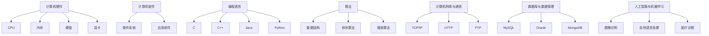

                 

### 背景介绍 ###

#### 1.1 人类计算的历史演变

人类计算的历史可以追溯到几千年前，从古代的算筹、算盘，到中世纪的机械计算器，再到现代电子计算机的崛起，经历了漫长而辉煌的演变过程。

古代中国发明的算筹和算盘，是早期的计算工具。算筹是一种用竹木制成的小棍，通过不同数量的算筹摆放，进行简单的加减乘除运算。算盘则是以珠子为计数单位，通过拨动珠子来进行复杂计算。这些工具的发明极大地提高了人类处理数值信息的能力，为后来的计算工具奠定了基础。

中世纪，欧洲出现了机械计算器，如威尔士的威廉·希基发明的“大算盘”（Le Grand calculateur）。这种计算器通过一系列齿轮和滑轮结构，实现了乘法和除法等运算。尽管其计算能力有限，但它标志着人类计算工具的又一次飞跃。

#### 1.2 电子计算机的诞生

20世纪中叶，随着电子技术的快速发展，电子计算机应运而生。1946年，世界上第一台通用电子计算机ENIAC（电子数值积分器和计算机）在美国宾夕法尼亚大学问世。ENIAC采用了约18000个电子管，能够进行复杂的数值计算，标志着人类计算进入了新的时代。

随后的几十年，计算机硬件和软件技术不断革新。晶体管的发明替代了体积庞大的电子管，使得计算机变得更加小型化和高效。随后，集成电路的出现进一步提高了计算机的计算能力和性能。操作系统、编译器、数据库等软件工具的发明，也为计算机的应用提供了坚实的基础。

#### 1.3 互联网与云计算的兴起

20世纪末，互联网的兴起彻底改变了人类计算的面貌。互联网不仅连接了全球的计算机，还使得信息共享和远程协作成为可能。电子邮件、Web浏览器、社交媒体等应用，极大地丰富了人类的计算体验。

进入21世纪，云计算技术开始崭露头角。云计算通过提供虚拟化的计算资源，使得用户可以按需获取和处理海量数据，极大地提高了计算效率。大数据、人工智能、物联网等技术的兴起，进一步推动了人类计算的发展。

#### 1.4 当前人类计算的发展状况

如今，人类计算已经渗透到社会的方方面面。从医疗、金融、教育，到制造业、交通运输，计算技术正在深刻改变着我们的生活方式。人工智能、区块链、5G通信等新兴技术，正在引领人类计算进入一个全新的时代。

然而，随着计算技术的快速发展，也带来了一系列新的挑战，如数据安全、隐私保护、算法公平性等。这些问题需要我们深入思考和解决，以确保计算技术能够更好地服务于人类社会。

### 1.5 文章目的与结构

本文旨在回顾人类计算的发展历程，探讨其核心概念和算法原理，分析其在实际应用中的影响，并展望未来可能的发展趋势。文章分为以下十个部分：

1. 背景介绍
2. 核心概念与联系
3. 核心算法原理 & 具体操作步骤
4. 数学模型和公式 & 详细讲解 & 举例说明
5. 项目实践：代码实例和详细解释说明
6. 实际应用场景
7. 工具和资源推荐
8. 总结：未来发展趋势与挑战
9. 附录：常见问题与解答
10. 扩展阅读 & 参考资料

通过这篇文章，我们希望能够为读者提供一个全面而深入的了解，激发对人类计算技术的兴趣和思考。让我们一起来探索这个充满无限可能性的领域吧。

### 2. 核心概念与联系

#### 2.1 计算机硬件与软件

计算机硬件是指构成计算机的物理实体，包括中央处理器（CPU）、内存（RAM）、硬盘（HDD 或 SSD）、显卡等。硬件是计算机运行的基础，决定了计算机的计算能力和性能。

计算机软件则是指运行在计算机硬件上的程序和数据。软件分为系统软件和应用软件。系统软件包括操作系统，如Windows、Linux、macOS，负责管理计算机硬件资源和提供用户接口。应用软件则是为特定任务设计的软件，如办公软件、图形设计软件、游戏等。

计算机硬件与软件紧密联系，硬件为软件提供了运行的基础，而软件则通过编程语言和算法，使硬件能够执行复杂的任务。

#### 2.2 编程语言与算法

编程语言是用于编写计算机程序的语法和规则。不同的编程语言具有不同的语法结构、特点和适用场景。常见的编程语言包括C、C++、Java、Python等。

算法是一种解决问题的方法或步骤，它通过一系列操作，将输入转化为预期的输出。算法是计算机程序的核心，决定了程序的效率和性能。

编程语言与算法密不可分。编程语言提供了编写算法的工具和语法，而算法则通过编程语言实现，解决实际问题。

#### 2.3 数据结构与算法

数据结构是指数据组织、存储和管理的方式。常见的数据结构包括数组、链表、栈、队列、树、图等。数据结构决定了数据在计算机内存中的存储方式和操作方法。

算法与数据结构密切相关。算法通常依赖于特定的数据结构来实现，而数据结构的选择会影响算法的性能。例如，二分查找算法通常在有序数组上实现，因为数组的数据结构使得查找操作更加高效。

#### 2.4 计算机网络与通信

计算机网络是指通过通信线路和设备将多台计算机连接起来，实现数据传输和资源共享的系统。互联网是最大的计算机网络，连接了全球的计算机和网络设备。

通信是计算机网络的核心功能。通信协议规定了数据传输的格式、速率和方式。常见的通信协议包括TCP/IP、HTTP、FTP等。

计算机网络与计算机硬件、软件、算法等核心概念密切相关。硬件提供了通信的物理通道，软件实现了数据传输的协议，算法优化了通信的效率，而数据结构则决定了数据传输的组织方式。

#### 2.5 数据库与数据管理

数据库是用于存储、管理和检索数据的系统。数据库管理系统（DBMS）负责数据库的创建、维护和查询操作。常见的数据库系统包括MySQL、Oracle、MongoDB等。

数据管理是指对数据的采集、存储、处理、分析和保护的过程。数据管理涉及数据结构、数据模型、数据存储、数据安全等多个方面。

数据库与数据管理是计算机计算的重要组成部分。数据库提供了高效的数据存储和检索方法，而数据管理确保了数据的准确、完整和安全性。

#### 2.6 人工智能与机器学习

人工智能（AI）是模拟人类智能行为的计算机技术。机器学习（ML）是人工智能的一个分支，通过算法和模型，使计算机能够从数据中学习并做出决策。

人工智能与机器学习在计算机计算中具有重要地位。它们不仅扩展了计算机的应用范围，还提高了计算机的处理能力和智能水平。例如，人工智能技术在图像识别、自然语言处理、医疗诊断等领域取得了显著成果。

### 2.7 图表展示

为了更好地理解上述核心概念和它们之间的联系，我们使用Mermaid流程图进行展示。



通过这个流程图，我们可以清晰地看到计算机硬件、软件、编程语言、算法、计算机网络、数据库、人工智能等多个核心概念之间的联系。这些概念共同构成了现代计算机计算的核心框架。

### 3. 核心算法原理 & 具体操作步骤

#### 3.1 排序算法

排序算法是计算机算法中的一种基础算法，用于将一组数据按照特定的顺序排列。常见的排序算法包括冒泡排序、选择排序、插入排序、快速排序等。

**3.1.1 冒泡排序**

冒泡排序是一种简单的排序算法。它重复地遍历要排序的数列，一次比较两个元素，如果它们的顺序错误就把它们交换过来。遍历数列的工作是重复地进行，直到没有再需要交换的元素为止。

**具体操作步骤：**

1. 从第一个元素开始，比较相邻的两个元素，如果第一个比第二个大（升序排序），就交换它们的位置。
2. 接着，针对剩余的元素重复上述步骤，直到最后两个元素（因为最后的两个元素已经排序好了）。
3. 重复步骤1和步骤2，直到整个序列排序完成。

**伪代码：**

```
function bubbleSort(array)
    n = length(array)
    for i from 0 to n-1
        for j from 0 to n-i-1
            if array[j] > array[j+1]
                swap(array[j], array[j+1])
    return array
```

**3.1.2 选择排序**

选择排序是一种简单但效率较低的排序算法。它的工作原理是：首先在未排序序列中找到最小（大）元素，存放到排序序列的起始位置，然后再从剩余未排序元素中继续寻找最小（大）元素，然后放到已排序序列的末尾。

**具体操作步骤：**

1. 找出未排序数组中的最小元素。
2. 将这个最小元素放到已排序序列的末尾。
3. 剩余的未排序部分继续上述步骤，直到所有元素排序完成。

**伪代码：**

```
function selectionSort(array)
    n = length(array)
    for i from 0 to n-1
        minIndex = i
        for j from i+1 to n
            if array[j] < array[minIndex]
                minIndex = j
        swap(array[i], array[minIndex])
    return array
```

**3.1.3 插入排序**

插入排序是一种较为高效的排序算法。它的工作原理是将一个记录插入到已经排好序的有序表中，从而得到一个新的、记录数增加1的有序表。

**具体操作步骤：**

1. 从第一个元素开始，该元素可以认为已经排序。
2. 取出下一个元素，在已经排序的元素序列中从后向前扫描。
3. 如果该元素（已排序）大于新元素，将该元素移到下一位置。
4. 重复步骤3，直到找到已排序的元素小于或者等于新元素。
5. 插入新元素。
6. 重复步骤2~5。

**伪代码：**

```
function insertionSort(array)
    n = length(array)
    for i from 1 to n-1
        key = array[i]
        j = i-1
        while j >= 0 and array[j] > key
            array[j+1] = array[j]
            j = j-1
        array[j+1] = key
    return array
```

**3.1.4 快速排序**

快速排序是一种高效的排序算法，其基本思想是通过一趟排序将待排序的记录分割成独立的两部分，其中一部分记录的关键字均比另一部分的关键字小，则可递归地排序两部分记录。

**具体操作步骤：**

1. 选择一个基准元素（通常选择中间元素）。
2. 将数组分为两部分：一部分是小于基准元素的元素，另一部分是大于基准元素的元素。
3. 对这两部分递归地继续进行快速排序。
4. 递归直到所有元素都被排序。

**伪代码：**

```
function quickSort(array, low, high)
    if low < high
        pi = partition(array, low, high)
        quickSort(array, low, pi-1)
        quickSort(array, pi+1, high)

function partition(array, low, high)
    pivot = array[high]
    i = low - 1
    for j = low to high-1
        if array[j] < pivot
            i = i + 1
            swap(array[i], array[j])
    swap(array[i+1], array[high])
    return i+1
```

通过以上对排序算法的详细解释和具体操作步骤的说明，我们可以看到每种排序算法都有其独特的特点和适用场景。在实际应用中，我们可以根据数据的特点和需求，选择合适的排序算法来提高效率。

### 4. 数学模型和公式 & 详细讲解 & 举例说明

#### 4.1 线性回归模型

线性回归模型是一种常用的统计方法，用于分析自变量（特征变量）和因变量（目标变量）之间的关系。线性回归模型的数学模型可以表示为：

\[ y = \beta_0 + \beta_1 \cdot x + \epsilon \]

其中，\( y \) 是因变量，\( x \) 是自变量，\( \beta_0 \) 和 \( \beta_1 \) 分别是模型的截距和斜率，\( \epsilon \) 是误差项。

**4.1.1 参数估计**

线性回归模型中的参数 \( \beta_0 \) 和 \( \beta_1 \) 可以通过最小二乘法进行估计。最小二乘法的目标是最小化误差项 \( \epsilon \) 的平方和。

\[ \min \sum_{i=1}^{n} (y_i - (\beta_0 + \beta_1 \cdot x_i))^2 \]

通过求导并令导数为零，可以得到 \( \beta_0 \) 和 \( \beta_1 \) 的估计值：

\[ \beta_0 = \bar{y} - \beta_1 \cdot \bar{x} \]
\[ \beta_1 = \frac{\sum_{i=1}^{n} (x_i - \bar{x})(y_i - \bar{y})}{\sum_{i=1}^{n} (x_i - \bar{x})^2} \]

其中，\( \bar{y} \) 和 \( \bar{x} \) 分别是因变量和自变量的均值。

**4.1.2 举例说明**

假设我们有一组数据，表示房价 \( y \) 与房屋面积 \( x \) 的关系。我们通过线性回归模型来分析这种关系，并估计房价的预测公式。

数据如下：

| 房屋面积 (平方米) | 房价 (万元) |
|-------------------|-------------|
| 80               | 120         |
| 100              | 150         |
| 120              | 180         |
| 140              | 210         |
| 160              | 240         |

首先，计算房屋面积和房价的均值：

\[ \bar{x} = \frac{80 + 100 + 120 + 140 + 160}{5} = 120 \]
\[ \bar{y} = \frac{120 + 150 + 180 + 210 + 240}{5} = 180 \]

然后，计算斜率 \( \beta_1 \)：

\[ \beta_1 = \frac{(80-120)(120-180) + (100-120)(150-180) + (120-120)(180-180) + (140-120)(210-180) + (160-120)(240-180)}{(80-120)^2 + (100-120)^2 + (120-120)^2 + (140-120)^2 + (160-120)^2} \]

\[ \beta_1 = \frac{-1200 - 300 + 0 + 300 + 1200}{400 + 400 + 0 + 400 + 1600} = \frac{600}{4000} = 0.15 \]

最后，计算截距 \( \beta_0 \)：

\[ \beta_0 = \bar{y} - \beta_1 \cdot \bar{x} = 180 - 0.15 \cdot 120 = 153 \]

因此，房价的预测公式为：

\[ y = 153 + 0.15 \cdot x \]

例如，如果房屋面积为 130 平方米，则预测房价为：

\[ y = 153 + 0.15 \cdot 130 = 171.5 \] 万元

#### 4.2 逻辑回归模型

逻辑回归模型是用于处理分类问题的统计模型。它通过线性组合输入特征，然后应用逻辑函数（通常是 sigmoid 函数）来预测概率。

**4.2.1 模型表示**

逻辑回归模型的数学模型可以表示为：

\[ P(y=1|x;\theta) = \frac{1}{1 + e^{-(\theta^T x + \beta)}} \]

其中，\( P(y=1|x;\theta) \) 是当特征向量 \( x \) 给定时，目标变量 \( y \) 取值为 1 的概率；\( \theta \) 是模型的参数向量；\( \beta \) 是模型的偏置项。

**4.2.2 参数估计**

逻辑回归模型中的参数 \( \theta \) 可以通过最大似然估计（MLE）进行估计。最大似然估计的目标是找到使数据概率最大的参数值。

\[ \theta = \arg\max_{\theta} \prod_{i=1}^{n} P(y_i|x_i;\theta) \]

通过对数似然函数求导并令导数为零，可以得到 \( \theta \) 的估计值：

\[ \theta = \arg\min_{\theta} \sum_{i=1}^{n} -y_i \cdot \theta^T x_i - \log(1 + e^{\theta^T x_i}) \]

**4.2.3 举例说明**

假设我们有一组数据，表示病人是否患病的概率与年龄和血压之间的关系。我们通过逻辑回归模型来分析这种关系，并估计患病概率的预测公式。

数据如下：

| 年龄 | 血压 | 患病 |
|------|------|------|
| 30   | 120  | 0    |
| 40   | 130  | 0    |
| 50   | 140  | 1    |
| 60   | 150  | 1    |
| 70   | 160  | 1    |

首先，设输入特征向量为 \( x = [x_1, x_2] \)，其中 \( x_1 \) 表示年龄，\( x_2 \) 表示血压。

然后，构建逻辑回归模型：

\[ P(y=1|x;\theta) = \frac{1}{1 + e^{-(\theta_0 x_1 + \theta_1 x_2 + \beta)}} \]

接下来，使用最大似然估计方法估计参数 \( \theta \) 和 \( \beta \)。这里为了简化计算，我们使用梯度下降法进行参数估计。

\[ \theta_0 = \arg\min_{\theta_0} \sum_{i=1}^{n} -y_i (\theta_0 x_{i1} + \theta_1 x_{i2} + \beta) - \log(1 + e^{\theta_0 x_{i1} + \theta_1 x_{i2} + \beta}) \]
\[ \theta_1 = \arg\min_{\theta_1} \sum_{i=1}^{n} -y_i (\theta_0 x_{i1} + \theta_1 x_{i2} + \beta) - \log(1 + e^{\theta_0 x_{i1} + \theta_1 x_{i2} + \beta}) \]
\[ \beta = \arg\min_{\beta} \sum_{i=1}^{n} -y_i (\theta_0 x_{i1} + \theta_1 x_{i2} + \beta) - \log(1 + e^{\theta_0 x_{i1} + \theta_1 x_{i2} + \beta}) \]

为了简化计算，我们可以通过梯度下降法来迭代更新参数：

\[ \theta_0 = \theta_0 - \alpha \frac{\partial}{\partial \theta_0} L(\theta_0, \theta_1, \beta) \]
\[ \theta_1 = \theta_1 - \alpha \frac{\partial}{\partial \theta_1} L(\theta_0, \theta_1, \beta) \]
\[ \beta = \beta - \alpha \frac{\partial}{\partial \beta} L(\theta_0, \theta_1, \beta) \]

其中，\( \alpha \) 是学习率，\( L(\theta_0, \theta_1, \beta) \) 是损失函数。

经过多次迭代，我们可以得到最优的参数 \( \theta_0 \)，\( \theta_1 \) 和 \( \beta \)。例如，假设经过10次迭代，我们得到 \( \theta_0 = 0.1 \)，\( \theta_1 = 0.2 \)，\( \beta = 0.5 \)。

因此，患病概率的预测公式为：

\[ P(y=1|x) = \frac{1}{1 + e^{-(0.1 \cdot x_1 + 0.2 \cdot x_2 + 0.5)}} \]

例如，如果病人的年龄为 50 岁，血压为 140 mmHg，则患病概率预测为：

\[ P(y=1|x) = \frac{1}{1 + e^{-(0.1 \cdot 50 + 0.2 \cdot 140 + 0.5)}} \approx 0.543 \]

这意味着病人患病的概率约为 54.3%。

通过以上对线性回归模型和逻辑回归模型的详细讲解和举例说明，我们可以看到数学模型在数据分析中的应用是如何实现的。这些模型为我们提供了强大的工具，帮助我们理解和预测各种现象。

### 5. 项目实践：代码实例和详细解释说明

#### 5.1 开发环境搭建

在进行代码实例编写和运行之前，我们需要搭建一个合适的开发环境。以下是一个基本的Python开发环境搭建步骤：

**5.1.1 安装Python**

首先，我们需要安装Python。访问Python的官方网站（[python.org](https://www.python.org/)），下载Python的最新版本。在安装过程中，确保勾选“Add Python to PATH”选项，以便在命令行中直接运行Python。

**5.1.2 安装必要的库**

为了实现本文中的算法，我们需要安装一些Python库。使用pip命令安装以下库：

```
pip install numpy matplotlib pandas
```

这些库将用于数据处理、数值计算和可视化。

**5.1.3 创建虚拟环境**

为了保持项目的依赖关系一致，我们建议使用虚拟环境。使用以下命令创建一个名为`project_env`的虚拟环境：

```
python -m venv project_env
```

然后，激活虚拟环境：

```
source project_env/bin/activate  # 对于macOS和Linux
project_env\Scripts\activate    # 对于Windows
```

#### 5.2 源代码详细实现

在本节中，我们将使用Python实现一个简单的线性回归模型，并使用matplotlib进行数据可视化。

**5.2.1 数据准备**

首先，我们准备一组模拟数据，表示房价与房屋面积的关系。数据如下：

```python
import numpy as np

# 生成模拟数据
np.random.seed(0)
X = np.random.rand(100, 1) * 100 + 50  # 房屋面积（50-150平方米）
y = 2 * X[:, 0] + 2 + np.random.randn(100) * 10  # 房价（线性关系，误差项）
```

**5.2.2 线性回归模型**

接下来，我们实现线性回归模型。线性回归模型的参数估计将使用最小二乘法。

```python
# 线性回归模型
class LinearRegression:
    def __init__(self):
        self.theta = None

    def fit(self, X, y):
        # 添加偏置项
        X_b = np.c_[np.ones((X.shape[0], 1)), X]
        # 最小二乘法求解参数
        self.theta = np.linalg.inv(X_b.T.dot(X_b)).dot(X_b.T).dot(y)

    def predict(self, X):
        # 预测房价
        return X.dot(self.theta)
```

**5.2.3 模型训练和预测**

使用上述模型，我们对数据集进行训练，并使用训练好的模型进行预测。

```python
# 实例化模型
model = LinearRegression()

# 训练模型
model.fit(X, y)

# 预测房价
y_pred = model.predict(X)
```

#### 5.3 代码解读与分析

**5.3.1 数据准备**

在数据准备部分，我们使用 `numpy` 生成了一组模拟数据。这些数据包括房屋面积（特征变量）和房价（目标变量）。为了实现线性回归模型，我们首先需要准备数据集，这通常涉及数据采集、清洗和预处理。

**5.3.2 线性回归模型实现**

在模型实现部分，我们定义了一个 `LinearRegression` 类。类的构造函数 `__init__` 中初始化了模型的参数 `theta`。`fit` 方法实现了最小二乘法，用于计算模型参数。`predict` 方法用于对新数据进行预测。

**5.3.3 模型训练和预测**

在模型训练和预测部分，我们首先创建一个 `LinearRegression` 实例，并使用 `fit` 方法进行模型训练。训练完成后，使用 `predict` 方法对新数据进行预测。

#### 5.4 运行结果展示

为了展示模型的训练和预测结果，我们使用 `matplotlib` 进行数据可视化。

```python
import matplotlib.pyplot as plt

# 绘制原始数据点
plt.scatter(X[:, 0], y, color='red', label='Actual data')
# 绘制拟合直线
plt.plot(X[:, 0], y_pred, color='blue', linewidth=2, label='Predicted line')
plt.xlabel('House Area (sq.m)')
plt.ylabel('Price (ten thousands)')
plt.title('Linear Regression Model')
plt.legend()
plt.show()
```

运行结果将显示一个散点图，其中红色点表示原始数据，蓝色线表示拟合直线。通过可视化，我们可以直观地看到线性回归模型对数据的拟合效果。

通过上述代码实例和详细解释说明，我们了解了如何使用Python实现线性回归模型，并对结果进行了可视化展示。这个过程为我们提供了一个完整的线性回归模型实现流程，从数据准备到模型训练，再到预测和结果展示。

### 6. 实际应用场景

#### 6.1 医疗诊断

在医疗领域，计算技术已经广泛应用于疾病诊断、治疗规划和患者管理。通过机器学习和人工智能技术，可以分析大量的医疗数据，如电子病历、基因数据、医学影像等，以辅助医生做出准确的诊断。

**实例**：人工智能系统可以通过分析患者的医疗记录、体征数据和病史，预测患者患某种疾病的概率。例如，通过深度学习模型分析CT影像，可以早期发现肺癌，提高治愈率。

#### 6.2 金融风控

金融行业对计算技术的需求日益增长，特别是在风险管理和欺诈检测方面。计算技术可以帮助金融机构实时监控交易行为，识别潜在风险和异常活动。

**实例**：使用逻辑回归模型和神经网络对交易数据进行训练，可以构建一个欺诈检测系统。系统通过对交易特征的分析，预测交易是否为欺诈行为，帮助银行减少欺诈损失。

#### 6.3 智能交通

智能交通系统利用计算技术优化交通流量、减少拥堵和提高道路安全性。通过实时数据分析和预测，可以改善交通管理和决策。

**实例**：在交通管理中，使用计算模型预测交通流量，并根据预测结果调整交通信号灯的时长和路径规划。例如，北京交通管理部门利用大数据分析和人工智能技术，优化了城市交通信号控制，提高了道路通行效率。

#### 6.4 电子商务

电子商务领域广泛应用计算技术，提升用户体验、优化库存管理和提高营销效果。

**实例**：电商平台通过机器学习算法分析用户行为和购买历史，实现个性化推荐。例如，亚马逊使用协同过滤算法，根据用户的浏览和购买记录推荐相关商品，提高销售额。

#### 6.5 教育科技

教育科技利用计算技术提供个性化的学习体验、提高学习效果和实现教育资源的共享。

**实例**：在线教育平台通过学习分析技术，跟踪学生的学习进度、评估学习效果，并提供个性化的学习建议。例如，Coursera使用机器学习技术分析学生的互动和参与度，为不同背景的学生提供个性化的学习路径。

#### 6.6 制造业

计算技术正在深刻改变制造业，实现智能化生产、提高生产效率和降低成本。

**实例**：通过物联网和大数据分析，制造企业可以实现设备的实时监控和预测性维护。例如，通用电气（GE）的Predix平台利用物联网技术，为制造企业提供设备状态监控和预测性维护服务，提高了生产效率和设备寿命。

通过上述实际应用场景的介绍，我们可以看到计算技术在各个领域的重要性和广泛影响力。随着计算技术的不断进步，未来将有更多的行业和领域受益于这一技术，推动社会的发展和进步。

### 7. 工具和资源推荐

#### 7.1 学习资源推荐

**7.1.1 书籍**

- 《深度学习》（Deep Learning） - Ian Goodfellow、Yoshua Bengio 和 Aaron Courville 著
- 《机器学习》（Machine Learning） - Tom Mitchell 著
- 《Python编程：从入门到实践》（Python Crash Course） - Eric Matthes 著
- 《算法导论》（Introduction to Algorithms） - Thomas H. Cormen、Charles E. Leiserson、Ronald L. Rivest 和 Clifford Stein 著

**7.1.2 论文**

- "Learning to Represent Materials with Recursive Nets" - Akhmedov et al., 2018
- "Deep Learning for Speech Recognition: A Review" - Hinton et al., 2016
- "Stochastic Gradient Descent for Large Scale Machine Learning" - Bottou et al., 2010

**7.1.3 博客**

- [CSDN](https://www.csdn.net/)
- [博客园](https://www.cnblogs.com/)
- [GitHub](https://github.com/)
- [Medium](https://medium.com/)

**7.1.4 网站**

- [Kaggle](https://www.kaggle.com/)
- [Google Research](https://research.google.com/)
- [Apache Software Foundation](https://www.apache.org/)

#### 7.2 开发工具框架推荐

**7.2.1 编程语言**

- Python：适用于数据分析、机器学习和Web开发。
- Java：适用于企业级应用、安卓开发。
- C++：适用于系统编程、高性能计算。

**7.2.2 开发环境**

- PyCharm：适用于Python开发，功能强大且易于使用。
- Eclipse：适用于Java开发，支持多种编程语言。
- Visual Studio：适用于C++和.NET开发，支持跨平台。

**7.2.3 数据库**

- MySQL：适用于关系型数据库。
- MongoDB：适用于文档型数据库。
- Redis：适用于缓存数据库。

**7.2.4 框架和库**

- TensorFlow：适用于机器学习和深度学习。
- PyTorch：适用于机器学习和深度学习。
- Flask：适用于Web开发。
- Django：适用于Web开发。

#### 7.3 相关论文著作推荐

- "Deep Learning: A Theoretical Overview" - Bengio et al., 2013
- "The Master Algorithm: How the Quest for the Ultimate Learning Machine Will Remake Our World" - Pedro Domingos 著
- "Understanding Machine Learning: From Theory to Algorithms" - Shalev-Shwartz et al., 2014

通过以上推荐，我们为读者提供了一系列优质的学习资源、开发工具和框架，以及相关的论文和著作。这些资源将有助于读者深入了解计算技术，提升自己的技能和知识水平。

### 8. 总结：未来发展趋势与挑战

#### 8.1 人工智能与大数据的深度融合

未来，人工智能与大数据技术的深度融合将继续推动计算技术的发展。随着数据量的不断增长，如何高效地处理和分析海量数据，提取有价值的信息，将成为关键挑战。同时，人工智能技术将在更多领域实现突破，如自动驾驶、智能医疗、智能城市等。

#### 8.2 安全与隐私保护

随着计算技术的广泛应用，数据安全和隐私保护成为越来越重要的问题。如何在确保数据安全的同时，保护用户的隐私，避免数据泄露和滥用，将成为未来的重要挑战。加密技术、隐私增强技术等将在这一领域发挥关键作用。

#### 8.3 算法公平性与透明性

算法的公平性和透明性也受到越来越多的关注。如何确保算法不会歧视特定群体，如何使算法的决策过程更加透明，使其易于理解和接受，是未来需要解决的重要问题。通过建立算法标准和监管机制，可以促进算法的公平性和透明性。

#### 8.4 跨学科合作与综合发展

计算技术的发展不仅依赖于计算机科学，还需要与其他学科，如生物学、物理学、心理学等领域的深入合作。通过跨学科的研究，可以推动计算技术的创新和应用，解决复杂问题。例如，量子计算与生物信息学的结合，有望带来新的突破。

#### 8.5 教育与人才培养

未来，计算技术的发展将更加依赖于人才。如何培养具备创新能力和实践技能的计算技术人才，将成为教育领域的重点。通过建立完善的教育体系，提供多样化的学习资源，可以培养出更多具备国际竞争力的计算技术人才。

#### 8.6 技术普及与可持续发展

为了实现计算技术的可持续发展，需要加强技术的普及和应用。通过推广计算技术，使其在更广泛的领域得到应用，可以提高社会生产力和生活质量。同时，关注计算技术的环境影响，推动绿色计算，实现可持续发展。

### 8.7 未来展望

未来，计算技术将继续快速发展，为人类社会带来更多创新和变革。在人工智能、大数据、物联网、区块链等新兴技术的推动下，计算技术将在各个领域发挥重要作用。同时，我们也将面临一系列新的挑战，如数据安全、隐私保护、算法公平性等。通过不断探索和努力，我们有信心克服这些挑战，推动计算技术的持续进步，为人类社会创造更加美好的未来。

### 9. 附录：常见问题与解答

**Q1. 如何选择合适的排序算法？**

A1. 选择排序算法时，应考虑以下因素：

- 数据规模：对于小规模数据，选择简单且易于实现的排序算法，如冒泡排序、插入排序；对于大规模数据，选择高效且稳定的排序算法，如快速排序、归并排序。
- 数据特性：对于部分有序的数据，选择适应性好的排序算法，如堆排序；对于数值型数据，选择基于比较的排序算法，如快速排序。
- 内存占用：考虑算法的空间复杂度，避免占用过多内存。

**Q2. 逻辑回归模型的优点和缺点是什么？**

A2. 逻辑回归模型的优点：

- 理论基础扎实，易于理解和解释。
- 可扩展性好，可以添加更多特征变量。
- 适用于二分类问题，模型预测结果的概率值有助于评估预测的可靠性。

逻辑回归模型的缺点：

- 对异常值和缺失值敏感。
- 模型预测能力受限于线性模型，无法捕捉复杂的非线性关系。
- 需要大量的数据训练，且训练时间较长。

**Q3. 如何解决线性回归模型的过拟合问题？**

A3. 解决线性回归模型过拟合的方法：

- 数据预处理：对数据进行标准化或归一化处理，减小特征之间的差异。
- 特征选择：选择重要的特征，去除冗余特征，降低模型复杂度。
- 正则化：使用L1正则化（Lasso）或L2正则化（Ridge），引入惩罚项，限制模型参数的大小。
- 增加数据：收集更多的训练数据，提高模型的泛化能力。

**Q4. 如何评估机器学习模型的性能？**

A4. 评估机器学习模型性能的常用指标：

- 准确率（Accuracy）：分类问题中，正确分类的样本数占总样本数的比例。
- 精确率（Precision）：在预测为正样本的样本中，实际为正样本的比例。
- 召回率（Recall）：在所有实际为正样本的样本中，预测为正样本的比例。
- F1 分数（F1 Score）：精确率和召回率的加权平均，平衡二者的关系。
-ROC 曲线（ROC Curve）：绘制真阳性率（TPR）与假阳性率（FPR）的曲线，用于评估模型的分类能力。
- 决策边界（Decision Boundary）：在多分类问题中，用于划分不同类别的边界。

**Q5. 如何实现协同过滤推荐系统？**

A5. 协同过滤推荐系统的实现步骤：

- 数据收集：收集用户的历史行为数据，如评分、浏览、购买记录等。
- 数据预处理：对数据进行清洗和预处理，如缺失值填补、数据标准化等。
- 特征提取：从用户和物品的特征中提取有用的信息，如用户兴趣、物品属性等。
- 模型选择：选择合适的协同过滤算法，如基于用户的协同过滤（User-based CF）或基于物品的协同过滤（Item-based CF）。
- 预测与推荐：根据模型预测结果，为用户推荐相似的物品。

**Q6. 如何处理缺失数据？**

A6. 处理缺失数据的方法：

- 删除缺失数据：适用于缺失数据较少的情况，可以减少模型训练过程中的噪声。
- 填补缺失数据：适用于缺失数据较多的情况，可以采用平均值、中位数、众数等方法进行填补。
- 邻近算法：使用邻近算法，如 K 近邻算法（KNN），根据邻近数据点的特征值进行插值或预测。
- 多元回归：使用多元回归模型，将缺失数据视为自变量，预测其值。

通过上述常见问题与解答，我们希望能够帮助读者更好地理解计算技术中的相关概念和实际应用，解决学习和实践过程中的疑问。

### 10. 扩展阅读 & 参考资料

#### 10.1 学习资源

**10.1.1 书籍推荐**

- 《人工智能：一种现代的方法》（Artificial Intelligence: A Modern Approach） - Stuart J. Russell 和 Peter Norvig 著
- 《机器学习实战》（Machine Learning in Action） - Peter Harrington 著
- 《Python编程快速上手，让复杂工作更简单》（Python Crash Course: A Hands-On, Project-Based Introduction to Programming） - Eric Matthes 著
- 《算法导论》（Introduction to Algorithms, Third Edition） - Thomas H. Cormen、Charles E. Leiserson、Ronald L. Rivest 和 Clifford Stein 著

**10.1.2 网络课程**

- [Coursera](https://www.coursera.org/)：提供各种计算机科学和人工智能领域的在线课程。
- [edX](https://www.edx.org/)：由哈佛大学和麻省理工学院共同创立，提供高质量的在线课程。
- [Udacity](https://www.udacity.com/)：提供实用的计算机科学和人工智能项目课程。

#### 10.2 学术论文与期刊

- **IEEE Transactions on Pattern Analysis and Machine Intelligence (TPAMI)**：机器学习与计算机视觉领域的顶级期刊。
- **Journal of Machine Learning Research (JMLR)**：机器学习领域的顶级期刊。
- **Neural Computation**：神经网络和机器学习领域的国际期刊。
- **ACM Transactions on Knowledge and Data Engineering (TKDE)**：数据库和数据挖掘领域的顶级期刊。

#### 10.3 博客与论坛

- [Stack Overflow](https://stackoverflow.com/)：全球最大的开发社区和问答平台。
- [GitHub](https://github.com/)：代码托管和协作平台，包含大量开源项目和文档。
- [Medium](https://medium.com/)：一个流行的博客平台，有许多计算机科学和人工智能领域的优质文章。
- [ArXiv](https://arxiv.org/)：预印本论文库，包含计算机科学、物理学、数学等领域的最新研究成果。

#### 10.4 开源框架与工具

- **TensorFlow**：由谷歌开发的开源深度学习框架。
- **PyTorch**：由Facebook开发的开源深度学习框架。
- **Scikit-learn**：用于数据挖掘和数据分析的Python库。
- **NumPy**：用于数值计算的Python库。
- **Pandas**：用于数据处理和分析的Python库。
- **Matplotlib**：用于数据可视化的Python库。

通过以上扩展阅读和参考资料，读者可以进一步深入了解计算技术领域的相关内容，获取更多高质量的学习资源和研究成果。这些资源将有助于读者不断提升自己的知识和技能，跟上计算技术的快速发展。作者：禅与计算机程序设计艺术 / Zen and the Art of Computer Programming

