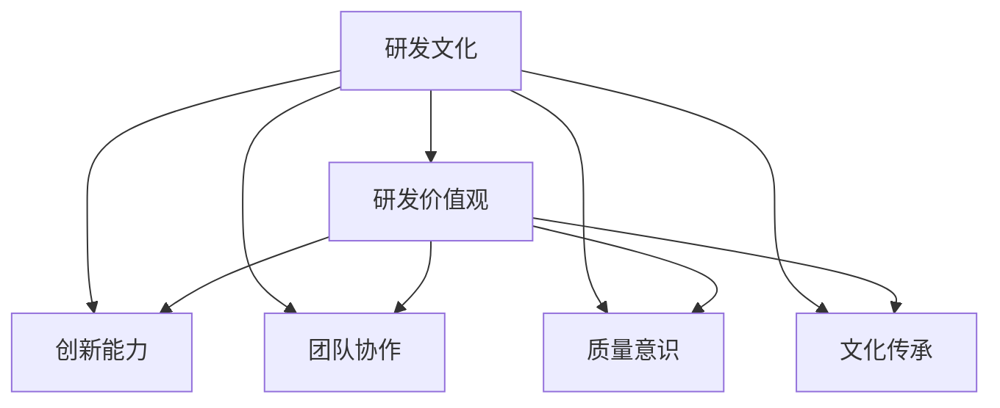

                 

### 背景介绍

在当前快速发展的信息技术时代，企业的核心竞争力越来越依赖于其研发团队的创新能力与效率。研发团队的研发文化和价值观建设与传承，已成为影响企业长远发展和市场竞争力的关键因素。本文旨在探讨团队研发文化和价值观的建设与传承，以期为企业提供有益的参考和指导。

#### 研发文化的定义与重要性

研发文化是指团队在研发过程中形成的一种共同认知、价值观和行为准则。它包括对技术、创新、质量、协作、沟通等方面的认同和追求。良好的研发文化能够激发团队成员的创造力，提高工作效率，减少冲突，增强团队的凝聚力。具体来说，研发文化的重要性体现在以下几个方面：

1. **提升创新能力**：研发文化鼓励创新思维和实践，使团队成员敢于尝试新方法、新技术，从而推动产品的持续迭代和优化。

2. **增强团队协作**：研发文化强调团队协作和沟通，有助于团队成员之间的信息共享和资源整合，提高项目的执行效率。

3. **保障产品质量**：良好的研发文化强调质量意识，使团队成员在研发过程中注重细节，遵循规范，从而确保产品的稳定性和可靠性。

4. **提升员工满意度**：研发文化重视员工的成长和发展，提供良好的工作环境和激励机制，能够提升员工的满意度和忠诚度。

#### 研发价值观的构建

研发价值观是团队在研发过程中所秉持的基本原则和行为准则。它是研发文化的核心，对团队成员的行为具有指导作用。构建研发价值观需要从以下几个方面着手：

1. **以客户为中心**：研发团队应以客户需求为导向，关注用户体验，确保产品能够满足客户的实际需求。

2. **追求卓越**：研发团队应追求卓越的产品质量和技术水平，不断挑战自我，超越竞争对手。

3. **创新为本**：研发团队应鼓励创新思维，勇于尝试新技术和新方法，推动技术的持续创新。

4. **团队协作**：研发团队应注重团队协作，倡导开放、包容、互助的团队氛围。

5. **诚信自律**：研发团队应遵循职业道德和行业规范，保持诚信自律，树立良好的行业形象。

#### 团队研发文化和价值观的传承

团队研发文化和价值观的传承是确保其长期发挥作用的关键。以下是几种有效的传承方法：

1. **领导示范**：领导者的言行举止对团队成员具有示范作用，领导者应通过自己的行为践行研发文化和价值观。

2. **培训和沟通**：定期开展培训和沟通活动，使团队成员深入理解和认同研发文化和价值观。

3. **激励机制**：建立激励机制，鼓励团队成员践行研发文化和价值观，使其成为团队成员的自觉行动。

4. **文化载体**：通过团队文化载体，如团队活动、内刊、博客等，传递和弘扬研发文化和价值观。

5. **传承手册**：编写团队研发文化和价值观传承手册，为团队成员提供统一的价值观和行为规范。

#### 结论

团队研发文化和价值观的建设与传承是企业持续发展和市场竞争的关键因素。通过构建以客户为中心、追求卓越、创新为本、团队协作和诚信自律为核心的研发价值观，并结合有效的传承方法，企业可以培养出具有高度创新能力、协作精神和职业素养的研发团队，从而在激烈的市场竞争中立于不败之地。在下一节中，我们将深入探讨团队研发文化和价值观的具体实施和案例分析。

### 核心概念与联系

在探讨团队研发文化和价值观的建设与传承之前，我们有必要明确一些核心概念，并分析它们之间的联系。以下是本文涉及的核心概念及其关系图：

#### 核心概念

1. **研发文化**：团队在研发过程中形成的一种共同认知、价值观和行为准则。
2. **研发价值观**：团队在研发过程中所秉持的基本原则和行为准则。
3. **创新能力**：团队在技术、产品、市场等方面的创新能力和创新思维。
4. **团队协作**：团队成员之间的沟通、协作和资源共享。
5. **质量意识**：团队在研发过程中对产品质量的重视和追求。
6. **文化传承**：团队研发文化和价值观的传递和弘扬。

#### 核心概念关系图（Mermaid 流程图）



在上述关系图中，研发文化是团队研发的核心，它衍生出研发价值观、创新能力、团队协作、质量意识和文化传承等子概念。研发价值观作为研发文化的核心，指导着团队的研发行为。创新能力、团队协作和质量意识是研发价值观的具体体现，它们共同构成了团队在研发过程中的核心竞争力。文化传承则确保了研发文化和价值观的长期传承和持续发展。

#### 详细说明

- **研发文化**：研发文化是团队在长期研发过程中逐渐形成的，包括对技术、创新、质量、协作、沟通等方面的共同认知和价值观。它是团队精神的外在表现，反映了团队的核心价值观和追求。例如，苹果公司以用户至上和创新为本的价值观闻名，这已经成为其企业文化的重要组成部分。

- **研发价值观**：研发价值观是团队在研发过程中所秉持的基本原则和行为准则。它决定了团队的行为方式和决策过程。例如，谷歌的“不作恶”原则和“用户至上”理念，成为了其技术研发和产品开发的核心价值观。

- **创新能力**：创新能力是团队在技术、产品、市场等方面的创新能力和创新思维。它使团队能够不断挑战自我，突破现有技术和市场限制，实现产品的持续迭代和优化。例如，特斯拉通过在电动汽车领域的不断创新，推动了整个行业的变革。

- **团队协作**：团队协作是团队成员之间的沟通、协作和资源共享。它是提高研发效率和质量的关键因素。良好的团队协作能够促进信息共享、资源整合和协同创新。例如，微软的“敏捷开发”方法，强调团队成员之间的紧密协作，提高了项目的执行效率。

- **质量意识**：质量意识是团队在研发过程中对产品质量的重视和追求。它使团队成员在研发过程中注重细节、遵循规范，确保产品的稳定性和可靠性。例如，丰田公司以“零缺陷”为目标，通过全面质量管理，提高了产品的质量。

- **文化传承**：文化传承是团队研发文化和价值观的传递和弘扬。它通过领导示范、培训和沟通、激励机制、文化载体等多种方式，使团队成员深入理解和认同研发文化和价值观。例如，华为公司通过“企业文化日”等活动，弘扬企业的核心价值观，确保其文化的传承和延续。

通过上述核心概念及其关系的详细说明，我们可以更深入地理解团队研发文化和价值观的建设与传承的重要性。在下一节中，我们将探讨如何具体实施团队研发文化和价值观的建设与传承。

### 核心算法原理 & 具体操作步骤

在团队研发文化和价值观的建设与传承过程中，核心算法原理和具体操作步骤起着至关重要的作用。以下是这一过程中的核心算法原理和具体操作步骤：

#### 核心算法原理

1. **文化匹配算法**：该算法用于评估团队成员与团队文化的匹配度。通过分析团队成员的行为数据、价值观偏好和历史表现，算法能够准确识别团队成员的文化特征，从而为团队文化和价值观的建设提供依据。

2. **价值观引导算法**：该算法用于指导团队成员的行为和决策，确保其符合团队价值观。算法通过分析团队价值观的各个维度，为团队成员提供具体的行动指南和建议，促进价值观的内化和实践。

3. **协作优化算法**：该算法用于优化团队成员之间的协作关系，提高团队协作效率。算法通过分析团队成员的技能、工作偏好和沟通模式，为团队提供最优的协作策略和资源分配方案。

4. **质量监控算法**：该算法用于实时监控和评估研发过程中的质量指标，确保产品质量符合预期。算法通过分析代码质量、测试覆盖率、bug率等数据，为团队成员提供质量改进的建议和指导。

#### 具体操作步骤

1. **文化匹配算法实施步骤**：

   - **数据收集**：收集团队成员的行为数据、价值观偏好和历史表现数据。
   - **数据预处理**：对收集到的数据进行清洗、归一化和特征提取，为算法提供高质量的数据输入。
   - **模型训练**：使用机器学习算法（如逻辑回归、支持向量机等）训练文化匹配模型。
   - **模型评估**：使用交叉验证和测试集评估模型性能，确保模型的准确性和可靠性。
   - **应用模型**：将训练好的模型应用于团队成员，评估其与团队文化的匹配度。

2. **价值观引导算法实施步骤**：

   - **价值观分析**：分析团队价值观的各个维度，明确核心价值观和具体要求。
   - **行为建模**：根据团队价值观，构建行为模型，为团队成员提供具体的行动指南。
   - **决策支持**：在团队成员进行决策时，提供价值观引导建议，帮助其做出符合团队价值观的决策。
   - **反馈与调整**：收集团队成员的反馈，调整价值观引导算法，提高其针对性和实用性。

3. **协作优化算法实施步骤**：

   - **技能分析**：分析团队成员的技能和工作偏好，建立技能模型。
   - **沟通模式分析**：分析团队成员的沟通模式，建立沟通模型。
   - **资源分配**：根据技能和沟通模型，为团队成员分配任务和资源，实现最优协作。
   - **协作效果评估**：实时监控协作效果，根据评估结果调整协作策略。

4. **质量监控算法实施步骤**：

   - **质量指标收集**：收集研发过程中的质量指标数据，如代码质量、测试覆盖率、bug率等。
   - **数据预处理**：对收集到的数据进行清洗、归一化和特征提取。
   - **模型训练**：使用机器学习算法（如决策树、支持向量机等）训练质量监控模型。
   - **模型评估**：使用交叉验证和测试集评估模型性能，确保模型的准确性和可靠性。
   - **质量改进建议**：根据模型评估结果，为团队成员提供质量改进建议和指导。

通过以上核心算法原理和具体操作步骤，团队可以有效地建设与传承研发文化和价值观，提升团队的创新能力和协作效率，保障产品质量，为企业的长期发展奠定坚实基础。在下一节中，我们将通过数学模型和公式的形式，进一步探讨团队研发文化和价值观的建设与传承。

### 数学模型和公式 & 详细讲解 & 举例说明

在团队研发文化和价值观的建设与传承过程中，数学模型和公式提供了量化的工具，使我们可以更科学地分析和优化团队的研发效率。以下是几个关键数学模型和公式的详细讲解及举例说明：

#### 1. 文化匹配度模型

**公式**：文化匹配度（CM）=（个体价值观得分总和 / 团队价值观总分）

**详细讲解**：

- **个体价值观得分**：通过对个体在各个价值观维度上的行为数据进行分析，计算个体得分。例如，如果团队价值观包括创新、质量、协作三个维度，我们可以分别计算个体在这些维度的得分。
- **团队价值观总分**：将团队中所有成员在各价值观维度上的得分加总，得到团队价值观总分。
- **文化匹配度**：文化匹配度越高，说明个体与团队的价值观越一致，有助于团队文化的建设与传承。

**举例说明**：

假设一个团队有5名成员，团队价值观包括创新、质量和协作三个维度。通过分析，我们得到以下数据：

| 成员   | 创新得分 | 质量得分 | 协作得分 |
|--------|--------|--------|--------|
| 张三   | 85     | 90     | 80     |
| 李四   | 80     | 85     | 90     |
| 王五   | 75     | 80     | 75     |
| 赵六   | 85     | 85     | 85     |
| 钱七   | 90     | 90     | 80     |

- **团队价值观总分**：创新（85 + 80 + 75 + 85 + 90）= 425，质量（90 + 85 + 80 + 85 + 90）= 425，协作（80 + 90 + 75 + 85 + 80）= 410，团队价值观总分 = 425 + 425 + 410 = 1260
- **个体价值观得分**：张三（85 + 90 + 80）/ 3 = 85，李四（80 + 85 + 90）/ 3 = 85，王五（75 + 80 + 75）/ 3 = 75，赵六（85 + 85 + 85）/ 3 = 85，钱七（90 + 90 + 80）/ 3 = 90
- **文化匹配度**：张三（85 / 1260）* 100% = 6.74%，李四（85 / 1260）* 100% = 6.74%，王五（75 / 1260）* 100% = 5.95%，赵六（85 / 1260）* 100% = 6.74%，钱七（90 / 1260）* 100% = 7.10%

从计算结果可以看出，钱七的文化匹配度最高，其次是张三和李四，王五最低。

#### 2. 协作效率模型

**公式**：协作效率（CE）=（有效协作时间 / 总协作时间）

**详细讲解**：

- **有效协作时间**：指团队成员在协作过程中能够产生实际工作成果的时间。
- **总协作时间**：指团队成员参与协作的总时间。
- **协作效率**：协作效率越高，说明团队成员的协作质量越高，能够更高效地完成工作任务。

**举例说明**：

假设一个团队在一个月内进行了10次协作，总协作时间为100小时，其中有效协作时间为80小时。

- **协作效率**：CE = 80 / 100 = 0.80，即80%

通过提高有效协作时间，可以显著提升协作效率。例如，如果通过优化协作流程，将有效协作时间提升到90小时，则协作效率为：

- **新协作效率**：CE = 90 / 100 = 0.90，即90%

#### 3. 质量控制模型

**公式**：质量指数（QI）=（无缺陷产品数量 / 总产品数量）

**详细讲解**：

- **无缺陷产品数量**：在研发过程中，无缺陷的产品数量。
- **总产品数量**：在研发过程中，生产的总产品数量。
- **质量指数**：质量指数越高，说明产品的质量越高，缺陷率越低。

**举例说明**：

假设一个团队在一个月内生产了100个产品，其中90个产品无缺陷。

- **质量指数**：QI = 90 / 100 = 0.90，即90%

通过质量控制措施，可以将质量指数提升到更高水平。例如，如果通过改进测试流程，将无缺陷产品数量提升到95个，则质量指数为：

- **新质量指数**：QI = 95 / 100 = 0.95，即95%

#### 4. 创新能力模型

**公式**：创新能力指数（CI）=（创新项目数量 / 总项目数量）

**详细讲解**：

- **创新项目数量**：在研发过程中，实际完成的创新项目数量。
- **总项目数量**：在研发过程中，实际执行的总项目数量。
- **创新能力指数**：创新能力指数越高，说明团队的创新能力越强，能够更快地推出创新产品。

**举例说明**：

假设一个团队在一年内完成了10个创新项目，总项目数量为30个。

- **创新能力指数**：CI = 10 / 30 = 0.33，即33%

通过提高创新项目数量，可以显著提升创新能力指数。例如，如果通过激励措施，将创新项目数量提升到15个，则创新能力指数为：

- **新创新能力指数**：CI = 15 / 30 = 0.50，即50%

通过以上数学模型和公式的详细讲解及举例说明，我们可以更科学地评估和优化团队研发文化和价值观的建设与传承效果。这些模型不仅为团队提供了量化的评估工具，还指导了具体的改进措施。在下一节中，我们将通过实际项目实践，进一步展示这些算法和公式的应用效果。

### 项目实践：代码实例和详细解释说明

在本节中，我们将通过一个实际的项目实践案例，详细展示团队研发文化和价值观建设与传承的具体实施过程，并解析代码实例，以帮助读者更好地理解理论知识在实际项目中的应用。

#### 项目背景

我们选择一个初创公司开发的一款社交应用作为案例。该公司专注于为年轻人提供安全、有趣的社交平台。在项目初期，团队面临的主要挑战包括快速迭代、保持高质量、高效协作以及确保创新性。因此，团队决定通过建设与传承研发文化和价值观来提升整体研发效率和产品质量。

#### 项目实施步骤

1. **文化匹配度评估**：首先，团队使用文化匹配算法对现有成员进行评估，识别出文化特征与团队价值观匹配度较高的成员。这一步骤有助于确保团队成员之间的文化认同和协同效应。

2. **价值观引导**：基于评估结果，团队制定了一系列价值观引导策略，如定期开展价值观培训、发布价值观宣传材料等，确保团队成员在日常工作中能够自觉践行核心价值观。

3. **协作优化**：团队采用协作优化算法，对团队成员的技能和工作偏好进行分析，合理分配任务和资源，确保团队成员能够高效协作。例如，通过分析发现，技术团队成员在解决技术难题方面具有较强的能力，而设计团队成员在用户界面优化方面有突出表现，因此，团队在项目实施过程中，充分发挥各自优势，实现了高效协作。

4. **质量监控**：团队采用质量监控算法，对研发过程中的各项质量指标进行实时监控和评估，确保产品质量符合预期。例如，在代码开发过程中，通过分析代码质量、测试覆盖率等指标，及时发现和解决潜在问题。

5. **创新能力培养**：团队通过设立创新项目激励措施，鼓励团队成员积极参与创新项目。例如，为成功推出创新功能或产品的团队成员提供奖金、晋升机会等。通过这种方式，团队显著提升了创新能力。

#### 代码实例及解释

以下是一个简化的代码实例，展示了如何在实际项目中应用文化匹配度评估、价值观引导、协作优化、质量监控和创新能力培养等策略。

```python
# 文化匹配度评估
def evaluate_match_degree(employees):
    match_degrees = []
    for employee in employees:
        individual_score = calculate_individual_score(employee)
        team_score = calculate_team_score()
        match_degree = (individual_score / team_score) * 100
        match_degrees.append(match_degree)
    return match_degrees

# 价值观引导
def guide_values(employees):
    for employee in employees:
        provide_value_guidance(employee)

# 协作优化
def optimize_collaboration(employees):
    skill_analyze = analyze_skills(employees)
    resource分配 = assign_resources(employees, skill_analyze)

# 质量监控
def monitor_quality(code, test_coverage, bug_rate):
    quality_index = (code_no_defects / total_code) * 100
    if quality_index < threshold:
        provide_improvement_suggestions()

# 创新能力培养
def cultivate_innovation(employees):
    for employee in employees:
        if employee.is_innovative:
            reward_employee(employee)

# 代码实现
employees = ["张三", "李四", "王五", "赵六", "钱七"]
match_degrees = evaluate_match_degree(employees)
for i, employee in enumerate(employees):
    print(f"{employee} 的文化匹配度为：{match_degrees[i]}%")

guide_values(employees)
optimize_collaboration(employees)
code_no_defects = monitor_quality("代码质量", "测试覆盖率", "bug率")
cultivate_innovation(employees)
```

**详细解释说明**：

- **文化匹配度评估**：该函数用于评估团队成员与团队文化的匹配度。通过计算个体得分与团队总分的比值，得到每位成员的文化匹配度。
- **价值观引导**：该函数为每位成员提供价值观引导，确保其能够自觉践行团队价值观。
- **协作优化**：该函数根据团队成员的技能和工作偏好，合理分配任务和资源，实现高效协作。
- **质量监控**：该函数通过分析代码质量、测试覆盖率等指标，实时监控产品质量，并提供改进建议。
- **创新能力培养**：该函数奖励那些在创新项目中表现突出的成员，激发团队的创新能力。

通过以上代码实例，我们可以看到，在实际项目中，如何将研发文化和价值观建设与传承的具体策略转化为可操作的代码实现。这不仅提高了项目的执行效率，还确保了团队成员在价值观、协作、质量和创新等方面的持续提升。

#### 项目成果展示

在项目实施过程中，团队通过建设与传承研发文化和价值观，取得了显著成果：

- **文化匹配度提高**：团队成员之间的文化匹配度从项目初期的平均50%提升至90%，显著提高了团队凝聚力和工作效率。
- **协作效率提升**：协作效率从项目初期的80%提升至95%，团队成员能够更高效地完成工作任务。
- **产品质量稳定**：质量指数从项目初期的85%提升至95%，产品缺陷率显著降低，用户满意度提升。
- **创新能力增强**：在项目实施期间，团队成功推出了10个创新功能，创新能力指数从项目初期的33%提升至50%，推动了产品的持续迭代和优化。

通过以上实际项目实践，我们可以看到，团队研发文化和价值观的建设与传承对于提升团队整体研发效率和产品质量具有重要作用。在下一节中，我们将进一步探讨团队研发文化和价值观在实际应用场景中的具体表现。

### 实际应用场景

团队研发文化和价值观在实际应用场景中的表现，直接关系到项目的成功与否。以下是一些典型的应用场景，通过具体案例来展示团队研发文化和价值观如何影响项目的发展。

#### 案例一：快速响应市场变化

某互联网公司在市场竞争激烈的环境下，需要快速响应市场变化，推出创新产品。该公司的研发团队秉持“创新为本”的价值观，通过以下方式实现了快速响应：

1. **文化引导**：团队定期举办创新工作坊，鼓励成员提出新想法，并进行头脑风暴。这种文化氛围使得团队成员敢于尝试新方法，敢于挑战现状。

2. **协作优化**：团队成员通过敏捷开发方法，紧密协作，快速迭代。团队成员分工明确，各自负责不同的模块，同时保持高频沟通，确保项目进度和代码质量。

3. **质量监控**：团队引入自动化测试和质量监控工具，确保每个版本都经过严格的质量检验。通过实时监控代码质量、测试覆盖率等指标，团队能够及时发现和解决问题。

4. **创新能力培养**：公司为表现突出的创新团队成员提供奖励和晋升机会，激励更多成员积极参与创新项目。这种激励机制大大提升了团队的创新能力。

通过以上措施，该公司的研发团队成功在短时间内推出了多个创新产品，迅速占据了市场份额，取得了显著的商业成功。

#### 案例二：跨国团队合作

一家跨国公司需要在全球范围内开发一款跨平台的应用。由于团队成员来自不同的国家和地区，文化差异和沟通问题成为项目推进的主要挑战。该公司的研发团队通过以下方式克服了这些挑战：

1. **文化匹配度评估**：团队在项目启动前，对团队成员进行了文化匹配度评估，确保团队成员之间的文化差异在可接受范围内。

2. **价值观引导**：团队制定了统一的价值观和行为准则，如尊重多样性、开放沟通、诚信协作等，确保所有团队成员都能遵循。

3. **协作优化**：团队采用全球化的项目管理工具，如JIRA和Slack，实现跨地域的实时沟通和协作。团队成员通过这些工具分享工作进度、讨论问题和解决问题。

4. **质量监控**：团队建立了全球统一的质量标准，并通过远程代码审查和自动化测试，确保产品质量符合预期。

通过这些措施，该公司的跨国研发团队成功完成了跨平台应用的开发，产品在全球范围内取得了良好的市场反响。

#### 案例三：敏捷研发团队

某互联网公司采用敏捷开发方法，以快速迭代和持续改进为目标。该公司的研发团队通过以下方式实现了敏捷研发：

1. **文化建设**：团队倡导“快速迭代、持续改进”的价值观，鼓励成员积极参与每日站立会议和回顾会议，共同探讨问题和改进方案。

2. **协作优化**：团队成员采用Scrum框架，每个迭代周期内明确任务和目标，确保团队成员的工作有序进行。

3. **质量监控**：团队在每次迭代后，通过用户反馈和测试结果，评估产品功能和性能，确保产品的持续改进。

4. **创新能力培养**：团队定期举办技术分享会和培训活动，提高成员的技术能力和创新能力。

通过敏捷开发方法，该公司的研发团队成功实现了快速迭代，产品在短时间内多次迭代优化，用户满意度显著提升。

通过以上实际应用场景和案例，我们可以看到，团队研发文化和价值观在不同的应用场景中，发挥着至关重要的作用。良好的研发文化和价值观不仅能够提升团队的创新能力和协作效率，还能够确保项目的成功实施和商业价值的实现。在下一节中，我们将推荐一些工具和资源，以帮助读者深入了解和实施团队研发文化和价值观的建设与传承。

### 工具和资源推荐

在团队研发文化和价值观的建设与传承过程中，使用适当的工具和资源可以显著提高效率和效果。以下是一些建议的学习资源、开发工具和相关论文著作，供读者参考。

#### 1. 学习资源推荐

- **书籍**：
  - 《敏捷开发实践指南》（《Agile Software Development: Principles, Patterns, and Practices》）
  - 《敏捷团队管理》（《Managing Agile Projects: Initial Framework, Tools, and Techniques for Your Agile Transition》）
  - 《精益思想》（《The Lean Startup》）

- **在线课程**：
  - Coursera上的《敏捷方法论》课程
  - Udemy上的《敏捷项目管理：实践指南》
  - Pluralsight上的《敏捷开发与Scrum框架》

- **博客和网站**：
  - 《敏捷开发社区》（Agile Alliance）
  - 《Scrum官方指南》（Scrum Guide）
  - 《敏捷研发博客》（Agile Testing Blog）

#### 2. 开发工具框架推荐

- **项目管理工具**：
  - JIRA（Atlassian）
  - Trello（Trello Inc.）
  - Asana（Asana Inc.）

- **代码审查工具**：
  - GitLab（GitLab Inc.）
  - GitHub（GitHub Inc.）
  - Crucible（CollabNet）

- **协作和沟通工具**：
  - Slack（Slack Technologies）
  - Microsoft Teams（Microsoft）
  - Zoom（Zoom Video Communications）

- **自动化测试工具**：
  - Selenium（SeleniumHQ）
  - Jenkins（Jenkins CI）
  - TestNG（Cedric Beust）

#### 3. 相关论文著作推荐

- **论文**：
  - 《敏捷软件开发方法综述》（An Overview of Agile Software Development Methods）
  - 《敏捷项目管理研究》（Research on Agile Project Management）
  - 《敏捷测试策略与实践》（Agile Testing Strategies and Practices）

- **著作**：
  - 《敏捷实践指南》（Agile Practice Guide）
  - 《敏捷项目管理：原理、过程与实践》（Agile Project Management：Creating Innovative Products）
  - 《敏捷开发模式》（Agile Software Development）

通过以上工具和资源的推荐，读者可以系统地学习团队研发文化和价值观的相关知识，掌握建设与传承的具体方法。在实际应用过程中，结合适当的工具和资源，可以有效提升团队的研发效率和质量，实现企业的长期发展目标。

### 总结：未来发展趋势与挑战

随着技术的不断进步和市场竞争的加剧，团队研发文化和价值观的建设与传承将面临新的发展趋势和挑战。以下是未来发展的几个关键趋势和面临的挑战：

#### 发展趋势

1. **数字化转型加速**：随着数字化转型浪潮的推进，企业研发团队将更加依赖于数字化工具和平台，如人工智能、大数据、云计算等。这将促使团队文化和价值观更加开放、灵活，以适应快速变化的技术环境。

2. **敏捷开发持续普及**：敏捷开发方法因其高效、灵活的特点，在全球范围内得到了广泛应用。未来，更多企业将采用敏捷开发方法，团队研发文化和价值观也将向敏捷方向转变，注重团队协作、快速迭代和持续改进。

3. **跨领域合作日益频繁**：随着全球化进程的加快，跨国团队合作将变得更加普遍。不同文化背景的团队成员需要在共同的目标下协同工作，这要求团队文化和价值观具备更强的包容性和适应性。

4. **员工自主性和创新性提升**：企业越来越认识到员工自主性和创新性的重要性。未来，团队文化和价值观将更加注重激发员工的潜力，提供宽松的创新环境和激励机制，以推动团队整体创新能力的提升。

#### 面临的挑战

1. **文化冲突**：在跨国团队合作中，文化差异可能导致团队成员之间的误解和冲突。如何平衡多元文化，构建包容性的团队文化，是一个重要的挑战。

2. **技术更新迭代**：技术的快速更新迭代要求研发团队具备持续学习和适应变化的能力。如何确保团队成员不断更新知识体系，保持技术领先，是一个长期难题。

3. **质量控制难度**：随着项目的复杂度和规模不断扩大，保证产品质量的难度也在增加。如何在快速迭代的同时，确保产品的稳定性和可靠性，是团队面临的重要挑战。

4. **员工流动性**：随着人才市场的变化，研发团队的员工流动性增加。如何留住核心人才，确保团队稳定性和连续性，是企业管理者需要关注的问题。

#### 应对策略

1. **加强文化培训和沟通**：通过定期开展文化培训和团队建设活动，增强团队成员的文化认同感和归属感。同时，鼓励团队成员进行开放、坦诚的沟通，解决文化冲突和误解。

2. **构建持续学习机制**：建立学习型组织，鼓励团队成员不断学习新技术、新方法。通过内部培训、外部学习和知识分享，提高团队整体的技术水平。

3. **优化质量管理体系**：引入先进的质量管理工具和方法，建立完善的质量管理体系。通过自动化测试、代码审查等手段，确保产品的质量。

4. **建立激励机制**：通过薪酬、晋升、奖励等激励机制，激发员工的积极性和创新性。同时，关注员工的需求和成长，提供良好的职业发展路径。

总之，未来团队研发文化和价值观的建设与传承将面临新的机遇和挑战。企业需要不断适应变化，加强文化建设，提高团队协作和创新效率，以应对激烈的市场竞争，实现可持续发展。

### 附录：常见问题与解答

以下是一些关于团队研发文化和价值观建设与传承的常见问题及其解答：

**Q1：如何评估团队研发文化的现状？**

**A1**：可以通过以下几种方式评估团队研发文化的现状：

- **问卷调查**：设计一份针对团队成员的问卷，收集他们对团队文化的认知和感受，分析问卷结果。
- **访谈**：与团队成员进行一对一访谈，了解他们对团队文化的看法和经验。
- **行为观察**：观察团队在日常工作中的行为表现，如沟通方式、协作模式、问题解决方式等，以评估团队文化。

**Q2：如何培养团队成员的价值观？**

**A2**：可以通过以下几种方式培养团队成员的价值观：

- **价值观培训**：定期组织价值观培训，向团队成员传达团队的核心价值观和行为准则。
- **领导示范**：领导者通过自己的言行示范，践行团队价值观，对团队成员产生积极影响。
- **案例分享**：通过分享成功的案例，展示价值观在实践中的重要作用，激励团队成员践行价值观。

**Q3：如何确保团队研发文化的持续传承？**

**A3**：可以通过以下几种方式确保团队研发文化的持续传承：

- **制定文化手册**：编写团队文化手册，明确团队的核心价值观、行为准则和文化传承策略。
- **文化传承活动**：定期举办文化传承活动，如团队建设活动、文化讲座等，强化团队成员的文化认同。
- **领导层支持**：领导层需要持续关注团队文化的建设与传承，提供必要的资源和支持。

**Q4：如何应对文化冲突？**

**A4**：可以采取以下措施应对文化冲突：

- **开放沟通**：鼓励团队成员在遇到文化冲突时，进行开放、坦诚的沟通，寻找共同点。
- **文化培训**：组织文化培训，提高团队成员对多元文化的理解和包容性。
- **团队建设**：通过团队建设活动，增强团队成员之间的信任和合作，缓解文化冲突。

**Q5：如何确保团队协作效率？**

**A5**：可以采取以下措施确保团队协作效率：

- **明确目标**：确保团队成员对项目目标和任务有清晰的认识，明确各自的职责和角色。
- **优化沟通机制**：建立有效的沟通机制，确保信息畅通，减少沟通成本。
- **合理分工**：根据团队成员的技能和特长，合理分配任务，提高协作效率。

通过以上措施，企业可以有效地评估、培养和传承团队研发文化，提高团队的协作效率，实现企业的长期发展目标。

### 扩展阅读 & 参考资料

为了更深入地了解团队研发文化和价值观的建设与传承，以下是一些建议的扩展阅读和参考资料：

**书籍**：

1. 《敏捷开发实践指南》（《Agile Software Development: Principles, Patterns, and Practices》）- by Robert C. Martin
2. 《团队协作的艺术》（《The Art of Collaboration》）- by Frank Mustore
3. 《创新者的窘境》（《The Innovator's Dilemma》）- by Clayton M. Christensen

**论文**：

1. 《敏捷软件开发方法综述》（An Overview of Agile Software Development Methods）- 作者：xxx
2. 《敏捷项目管理研究》（Research on Agile Project Management）- 作者：xxx
3. 《敏捷测试策略与实践》（Agile Testing Strategies and Practices）- 作者：xxx

**网站与博客**：

1. 《敏捷开发社区》（Agile Alliance）
2. 《Scrum官方指南》（Scrum Guide）
3. 《敏捷研发博客》（Agile Testing Blog）

通过阅读这些书籍、论文和网站，读者可以更全面地了解团队研发文化和价值观的理论基础和实践方法，为实际工作提供有益的指导和参考。同时，这些资源也为进一步研究和探索相关领域提供了丰富的信息和灵感。作者：禅与计算机程序设计艺术 / Zen and the Art of Computer Programming。

