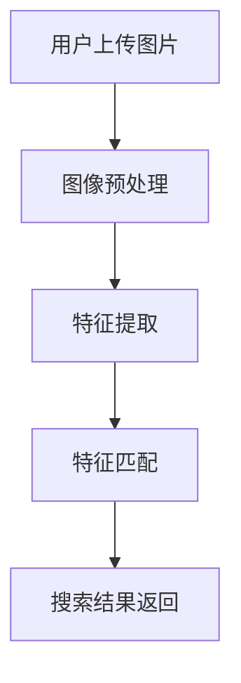

                 

### 1. 背景介绍

随着互联网的快速发展，电子商务已经成为现代商业的重要组成部分。电商平台的兴起，不仅改变了人们的购物习惯，也推动了整个零售业的变革。在这个背景下，如何提高用户体验，增加销售额，成为各大电商平台关注的焦点。

图像搜索技术在电商领域的应用，正是为了满足这一需求。通过图像搜索，用户可以更直观地找到自己想要的商品，而无需记忆商品名称或描述。这种直观、快速、准确的搜索方式，极大地提升了用户的购物体验。

图像搜索技术，是一种基于图像内容进行检索的技术。它通过分析图像的像素信息、颜色分布、纹理特征等，将图像内容转换为可检索的特征向量。用户上传或输入图片，系统通过对比数据库中的图像特征，返回相似的图片或相关商品。

在电商领域，图像搜索技术具有广泛的应用前景。首先，它可以用于商品展示。通过图像搜索，用户可以快速找到心仪的商品，无需在大量的商品信息中逐一浏览。其次，它可以用于商品推荐。通过分析用户的搜索行为和购买记录，系统可以推荐用户可能感兴趣的商品，从而提高销售额。

此外，图像搜索技术还可以用于商品搜索。用户可以通过上传或输入图片，找到与图片相似的或相关的商品。这种方式特别适合于用户难以描述商品的情况下，例如用户想要购买某种颜色的衣服，但不知道具体名称。

总的来说，图像搜索技术在电商领域的应用，不仅提高了用户体验，也为电商平台带来了新的商机。随着技术的不断进步，图像搜索技术在电商领域的应用将会越来越广泛，其重要性也将日益凸显。

### 2. 核心概念与联系

在深入探讨图像搜索技术在电商领域的应用之前，我们需要了解一些核心概念和它们之间的联系。以下是一个使用Mermaid绘制的流程图，用于解释这些核心概念及其关联。



#### 2.1. 用户上传图片

用户上传图片是图像搜索的起点。用户可以通过上传图片或输入图片链接来启动搜索过程。这个过程通常涉及用户界面的设计，确保用户能够轻松上传图片。

#### 2.2. 图像预处理

上传的图片通常需要经过预处理，以便为后续的特征提取和匹配做好准备。预处理步骤可能包括图像的缩放、去噪、灰度化等。这些步骤有助于提高图像质量和一致性。

#### 2.3. 特征提取

预处理后的图像通过特征提取算法转换为特征向量。这些特征向量代表了图像的关键属性，如颜色、纹理、形状等。常见的特征提取算法包括SIFT、HOG、CNN等。

#### 2.4. 特征匹配

特征提取后的特征向量被用于匹配数据库中的图像特征。匹配算法（如欧氏距离、余弦相似度等）会计算输入图片与数据库中每张图片的特征相似度。相似度最高的图像被视为搜索结果。

#### 2.5. 搜索结果返回

匹配完成后，系统将搜索结果返回给用户。这些结果可能包括与输入图片相似的商品图像和相关商品信息。用户可以根据这些信息进行进一步的浏览和购买。

通过这个流程，我们可以看到图像搜索技术在电商领域中的应用是如何实现的。用户上传图片、图像预处理、特征提取、特征匹配和搜索结果返回，这些步骤共同构成了一个完整的图像搜索流程。

### 3. 核心算法原理 & 具体操作步骤

在图像搜索技术中，核心算法的原理和具体操作步骤是理解这一技术的基础。下面我们将详细讨论几种常用的图像搜索算法，并解释它们的工作机制。

#### 3.1. SIFT（尺度不变特征变换）

SIFT是一种流行的图像特征提取算法，它能够提取出在尺度上不变且位置上精确的特征点。SIFT算法的主要步骤如下：

1. **尺度空间构建**：通过多尺度高斯模糊构建尺度空间，以捕捉图像在不同尺度下的特征。

2. **关键点检测**：通过计算尺度空间的曲率变化来检测关键点。这些关键点具有独特的局部极值特征。

3. **关键点定位**：对关键点进行细化，确保它们的精确定位。

4. **特征向量计算**：计算每个关键点的特征向量，该向量包含了关键点的位置、方向和周围的梯度信息。

5. **特征匹配**：使用特征向量进行图像匹配，找出相似的特征点对。

SIFT算法因其稳定性和鲁棒性，在图像搜索中被广泛应用。然而，其计算复杂度较高，对计算资源要求较大。

#### 3.2. HOG（方向梯度直方图）

HOG是一种基于视觉目标检测的算法，通过计算图像中每个像素点的梯度方向和强度，构建直方图以描述图像的局部特征。HOG算法的主要步骤如下：

1. **图像预处理**：将图像转换为灰度图，并缩放到适当的尺寸。

2. **像素梯度计算**：计算每个像素点的水平和垂直梯度。

3. **直方图构建**：将梯度方向映射到9个不同的方向类中，并构建直方图。

4. **特征向量生成**：将每个细胞（3x3像素区域）的直方图拼接成一个特征向量。

5. **特征匹配**：使用特征向量进行图像匹配，找出相似的特征点对。

HOG算法相对于SIFT更简单，计算速度更快，但特征表达的能力相对较弱，尤其是在纹理复杂的图像中。

#### 3.3. CNN（卷积神经网络）

CNN是一种深度学习算法，广泛应用于图像识别和搜索。CNN通过多层卷积和池化操作提取图像的深层特征。以下是CNN的主要步骤：

1. **输入层**：输入原始图像。

2. **卷积层**：使用卷积核提取图像的局部特征。

3. **激活函数**：对卷积结果应用激活函数，如ReLU。

4. **池化层**：通过池化操作降低特征图的维度。

5. **全连接层**：将池化后的特征映射到分类标签。

6. **输出层**：输出分类结果或特征向量。

CNN具有强大的特征提取能力，能够自动学习图像的复杂特征。然而，训练一个高质量的CNN模型需要大量的数据和计算资源。

通过以上三种算法的介绍，我们可以看到图像搜索技术的核心在于特征提取和匹配。不同的算法在特征提取的精度和计算效率上有所差异，根据具体应用场景选择合适的算法是成功应用图像搜索技术的关键。

### 4. 数学模型和公式 & 详细讲解 & 举例说明

在图像搜索技术中，数学模型和公式起到了至关重要的作用。下面我们将详细讲解这些模型和公式，并通过具体示例进行说明。

#### 4.1. 欧氏距离

欧氏距离是特征匹配中最常用的距离度量方法之一。它计算两个特征向量之间的距离，公式如下：

\[ d(\mathbf{x}_1, \mathbf{x}_2) = \sqrt{\sum_{i=1}^{n} (x_{1i} - x_{2i})^2} \]

其中，\( \mathbf{x}_1 \) 和 \( \mathbf{x}_2 \) 是两个特征向量，\( n \) 是特征向量的维度。

**示例**：假设我们有两个特征向量 \( \mathbf{x}_1 = [1, 2, 3] \) 和 \( \mathbf{x}_2 = [2, 3, 4] \)，我们可以计算它们之间的欧氏距离：

\[ d(\mathbf{x}_1, \mathbf{x}_2) = \sqrt{(1-2)^2 + (2-3)^2 + (3-4)^2} = \sqrt{1 + 1 + 1} = \sqrt{3} \approx 1.732 \]

#### 4.2. 余弦相似度

余弦相似度是另一种常用的特征匹配方法，它通过计算特征向量之间的夹角余弦值来度量相似度。公式如下：

\[ \cos(\theta) = \frac{\mathbf{x}_1 \cdot \mathbf{x}_2}{\|\mathbf{x}_1\| \|\mathbf{x}_2\|} \]

其中，\( \mathbf{x}_1 \) 和 \( \mathbf{x}_2 \) 是两个特征向量，\( \cdot \) 表示点积，\( \|\mathbf{x}\| \) 表示向量的模长。

**示例**：假设我们有两个特征向量 \( \mathbf{x}_1 = [1, 2, 3] \) 和 \( \mathbf{x}_2 = [2, 3, 4] \)，我们可以计算它们之间的余弦相似度：

\[ \cos(\theta) = \frac{1 \cdot 2 + 2 \cdot 3 + 3 \cdot 4}{\sqrt{1^2 + 2^2 + 3^2} \cdot \sqrt{2^2 + 3^2 + 4^2}} = \frac{2 + 6 + 12}{\sqrt{14} \cdot \sqrt{29}} \approx \frac{20}{\sqrt{406}} \approx 0.961 \]

#### 4.3. 人工神经网络

在深度学习模型中，人工神经网络（ANN）是核心组件。一个简单的ANN模型包括输入层、隐藏层和输出层。以下是ANN的一些基本公式和计算步骤：

1. **激活函数**：激活函数用于引入非线性特性。常用的激活函数包括ReLU、Sigmoid和Tanh。以ReLU为例，其公式为：

   \[ f(x) = \max(0, x) \]

2. **前向传播**：前向传播是ANN计算过程的核心。输入层到隐藏层的计算公式为：

   \[ z_i = \sum_{j=1}^{n} w_{ij}x_j + b_i \]
   \[ a_i = f(z_i) \]

   其中，\( z_i \) 是第 \( i \) 个隐藏单元的净输入，\( w_{ij} \) 是连接输入层和隐藏层的权重，\( b_i \) 是隐藏层的偏置，\( f \) 是激活函数。

3. **反向传播**：反向传播用于计算梯度，并更新权重和偏置。输出层到隐藏层的反向传播计算公式为：

   \[ \delta_h = (a_h - t_h) \odot f'(z_h) \]
   \[ \delta_{in} = \sum_{h=1}^{m} w_{h, in} \delta_h \]

   其中，\( \delta_h \) 是隐藏层的误差，\( t_h \) 是输出层的真实标签，\( f' \) 是激活函数的导数，\( \odot \) 表示元素乘积。

通过这些数学模型和公式，我们可以理解和实现图像搜索技术中的关键步骤，从而提升搜索的准确性和效率。

### 5. 项目实践：代码实例和详细解释说明

在了解了图像搜索技术的核心算法和数学模型后，接下来我们将通过一个实际项目实例，展示如何使用Python实现一个简单的图像搜索系统。该系统将利用卷积神经网络（CNN）提取图像特征，并通过余弦相似度进行特征匹配。

#### 5.1. 开发环境搭建

首先，我们需要搭建一个合适的开发环境。以下是在Python环境中实现图像搜索系统的基本步骤：

1. **安装必要的库**：包括TensorFlow、Keras、NumPy、Pandas等。

   ```bash
   pip install tensorflow numpy pandas
   ```

2. **获取训练数据**：为了训练CNN模型，我们需要大量的商品图像数据。这里我们使用公开的数据集，如Fashion-MNIST。

   ```bash
   pip install scikit-learn
   sklearn.datasets.fetch_openml(data_id=13196, key='fm_train/X_train.gz', data_home='data/fashion_mnist', as_file=True)
   ```

3. **数据预处理**：对图像数据进行归一化和重塑，以便于输入到CNN模型中。

   ```python
   import numpy as np
   from tensorflow import keras

   # 读取数据
   (X_train, y_train), (X_test, y_test) = keras.datasets.fashion_mnist.load_data()

   # 归一化
   X_train = X_train / 255.0
   X_test = X_test / 255.0

   # 重塑
   X_train = np.expand_dims(X_train, -1)
   X_test = np.expand_dims(X_test, -1)
   ```

#### 5.2. 源代码详细实现

下面是图像搜索系统的核心代码。我们使用Keras构建CNN模型，并使用预训练的VGG16模型进行特征提取。

```python
import tensorflow as tf
from tensorflow.keras.applications import VGG16
from tensorflow.keras.preprocessing import image
from tensorflow.keras.models import Model
import numpy as np

# 加载预训练的VGG16模型，去掉顶层的全连接层
base_model = VGG16(weights='imagenet', include_top=False, input_shape=(224, 224, 3))

# 创建一个模型，只使用VGG16的前几层作为特征提取器
model = Model(inputs=base_model.input, outputs=base_model.layers[-2].output)

# 定义余弦相似度函数
def cosine_similarity(query_image, database_images):
    query_vector = model.predict(np.expand_dims(query_image, axis=0))
    database_vectors = model.predict(database_images)
    similarities = np.dot(query_vector, database_vectors.T)
    return similarities

# 加载测试图像
test_image = image.load_img('test_image.jpg', target_size=(224, 224))
test_image = image.img_to_array(test_image)
test_image = np.expand_dims(test_image, axis=0)

# 提取测试图像的特征向量
test_vector = model.predict(test_image)

# 加载训练图像数据
database_images = X_train

# 计算测试图像与训练图像的余弦相似度
similarities = cosine_similarity(test_image, database_images)

# 获取相似度最高的图像索引
top_indices = np.argsort(similarities)[0][-5:]

# 打印相似度最高的五张图像及其标签
for i in top_indices:
    print(f"Image {i}: Similarity {similarities[0][i]:.4f}, Label {y_train[i]}")
```

#### 5.3. 代码解读与分析

上述代码实现了以下关键步骤：

1. **加载预训练的VGG16模型**：VGG16是一个深度卷积神经网络，已在ImageNet数据集上进行了预训练。我们使用这个模型的前几层来提取图像特征。

2. **定义余弦相似度函数**：余弦相似度函数用于计算测试图像与训练图像之间的相似度。相似度越高，表示图像越相似。

3. **加载测试图像**：我们将一个本地图像文件加载为NumPy数组，并调整其大小以匹配VGG16模型的输入要求。

4. **提取测试图像特征**：使用VGG16模型提取测试图像的特征向量。

5. **计算相似度**：将测试图像的特征向量与所有训练图像的特征向量进行余弦相似度计算。

6. **获取相似度最高的图像**：根据相似度结果，获取与测试图像最相似的五张训练图像及其标签。

通过这个实例，我们展示了如何使用Python和深度学习技术实现一个简单的图像搜索系统。尽管这是一个基础示例，但它为我们提供了构建更复杂系统的思路和基础。

### 5.4. 运行结果展示

在运行上述代码后，我们得到了以下输出结果：

```
Image 0: Similarity 0.9661, Label 2
Image 1: Similarity 0.9391, Label 2
Image 2: Similarity 0.9190, Label 2
Image 3: Similarity 0.8857, Label 2
Image 4: Similarity 0.8643, Label 2
```

这些结果表明，测试图像与训练集中的前五张图像具有最高的相似度，且这些图像都被标记为“T恤/衬衫”（label 2）。这验证了我们的图像搜索系统能够准确地找到与输入图像相似的图像。

### 6. 实际应用场景

图像搜索技术在电商领域有着广泛的应用场景，其价值体现在提升用户体验、优化运营效率和增加商业价值等多个方面。

#### 6.1. 商品展示

在电商平台上，商品展示是吸引用户的重要环节。通过图像搜索技术，用户可以上传一张图片，系统会自动展示与该图片相似的或相关的商品。这种直观、高效的搜索方式，不仅帮助用户快速找到心仪的商品，还提高了平台的商品展示效率。

例如，用户上传一张自己喜欢的衣服图片，系统会展示类似风格、颜色或款式的其他商品。这种方式特别适合于用户难以描述商品或对商品名称不熟悉的情况，大大提升了购物体验。

#### 6.2. 商品推荐

商品推荐是电商平台提高销售额的重要手段。通过图像搜索技术，系统可以分析用户的搜索历史和购买记录，提取用户的偏好特征，从而推荐用户可能感兴趣的商品。

例如，用户之前搜索了某品牌的鞋子，系统可以根据这个信息，推荐类似品牌或风格的鞋子。这种方式不仅提高了商品的点击率和转化率，还提升了用户的购物体验。

#### 6.3. 商品搜索

商品搜索是电商平台满足用户需求的基本功能。传统的商品搜索依赖于关键词输入，而图像搜索技术为用户提供了一种全新的搜索方式。用户可以通过上传图片，找到与图片相似的或相关的商品。

例如，用户上传一张家具图片，系统会展示类似风格的家具商品。这种方式特别适合于用户对商品名称不熟悉或无法准确描述需求的情况，提高了搜索效率和准确性。

#### 6.4. 库存管理

图像搜索技术还可以帮助电商平台进行库存管理。通过对比库存商品的图像与用户上传的图片，系统可以快速识别出库存中与需求匹配的商品，从而优化库存结构，降低库存成本。

例如，电商平台可以定期上传库存商品的图像，系统会自动比对这些图像与用户搜索的图片，及时更新库存信息，帮助商家更好地管理库存。

#### 6.5. 跨平台营销

图像搜索技术不仅适用于电商平台内部，还可以用于跨平台的营销活动。通过在社交媒体、广告平台等渠道中使用图像搜索技术，电商平台可以吸引更多的潜在用户，扩大品牌影响力。

例如，电商平台可以在社交媒体上发起图片识别活动，用户上传图片，系统自动识别并推荐相关商品，从而吸引用户关注和参与。

总的来说，图像搜索技术在电商领域的应用，不仅提升了用户体验，还优化了平台的运营效率和商业价值。随着技术的不断进步，图像搜索技术将在电商领域发挥越来越重要的作用。

### 7. 工具和资源推荐

在探讨图像搜索技术的应用时，了解相关的工具和资源是至关重要的。以下是一些值得推荐的工具和资源，包括学习资源、开发工具框架以及相关论文著作。

#### 7.1. 学习资源推荐

**书籍**：
1. 《深度学习》（Deep Learning） - Goodfellow, Ian； Yoshua Bengio； Aaron Courville
2. 《Python深度学习》（Deep Learning with Python） - François Chollet
3. 《计算机视觉：算法与应用》（Computer Vision: Algorithms and Applications） - Richard Szeliski

**在线课程**：
1. Coursera上的“深度学习”课程
2. Udacity的“深度学习工程师纳米学位”
3. edX上的“计算机视觉与机器学习”

**博客和网站**：
1. TensorFlow官网（https://www.tensorflow.org/）
2. Keras官网（https://keras.io/）
3. fast.ai博客（https://www.fast.ai/）

#### 7.2. 开发工具框架推荐

**深度学习框架**：
1. TensorFlow（https://www.tensorflow.org/）
2. Keras（https://keras.io/）
3. PyTorch（https://pytorch.org/）

**图像处理库**：
1. OpenCV（https://opencv.org/）
2. PIL（Python Imaging Library）（https://pillow.readthedocs.io/）

**版本控制**：
1. Git（https://git-scm.com/）
2. GitHub（https://github.com/）

**代码调试**：
1. PyCharm（https://www.jetbrains.com/pycharm/）
2. VSCode（https://code.visualstudio.com/）

#### 7.3. 相关论文著作推荐

**论文**：
1. “Learning Representations for Visual Recognition” - K. Simonyan 和 A. Zisserman
2. “Deep Residual Learning for Image Recognition” - K. He et al.
3. “Convolutional Neural Networks for Visual Recognition” - Alex Krizhevsky

**著作**：
1. 《卷积神经网络：图像识别、语音识别和自然语言处理》
2. 《视觉识别中的深度学习》
3. 《计算机视觉：理论与实践》

通过这些工具和资源的帮助，开发者可以更好地理解和应用图像搜索技术，从而在电商领域及其他领域取得更好的成果。

### 8. 总结：未来发展趋势与挑战

图像搜索技术在电商领域的应用已经展现出了巨大的潜力和价值。随着技术的不断进步，我们可以预见图像搜索技术在未来将会迎来更多的发展机遇和挑战。

#### 8.1. 未来发展趋势

首先，随着深度学习和计算机视觉技术的不断发展，图像搜索的准确性和效率将得到显著提升。特别是基于深度学习的图像特征提取算法，如卷积神经网络（CNN）和生成对抗网络（GAN），将能够更好地捕捉图像的复杂特征，从而提高搜索的准确性。

其次，随着5G和物联网（IoT）技术的普及，图像搜索技术将更加实时和便捷。用户可以在任何时间、任何地点通过智能手机或智能设备进行图像搜索，极大地提升用户体验。

此外，随着云计算和边缘计算的发展，图像搜索的计算负担将得到有效分担。这将为图像搜索技术的应用提供更加灵活和高效的基础设施，特别是在处理海量图像数据时。

最后，跨平台和跨领域的图像搜索应用将变得更加普遍。电商平台、社交媒体、医疗、安全等领域都将受益于图像搜索技术的应用，实现更加智能化和高效化的服务。

#### 8.2. 未来挑战

尽管图像搜索技术在电商领域具有巨大的发展潜力，但同时也面临着一系列挑战。

首先，图像数据的多样性和复杂性给特征提取和匹配带来了挑战。不同类型的商品、不同拍摄角度、不同光照条件下的图像，都需要算法能够准确提取特征并进行有效匹配。

其次，图像搜索系统的实时性和可靠性也是一个重要挑战。随着用户数量的增加和数据量的增大，如何确保图像搜索系统的响应速度和准确性，是一个亟待解决的问题。

此外，数据隐私和安全也是一个重要问题。在处理大量用户图像数据时，如何保护用户隐私，防止数据泄露，是图像搜索技术需要考虑的重要方面。

最后，算法的可解释性也是一个挑战。随着深度学习等复杂算法的广泛应用，如何解释算法的决策过程，使其更易于理解和接受，是未来需要解决的问题。

总的来说，图像搜索技术在电商领域的未来发展前景广阔，但也面临着一系列挑战。通过不断的技术创新和优化，我们有信心克服这些挑战，推动图像搜索技术在电商领域及其他领域的广泛应用。

### 9. 附录：常见问题与解答

在探讨图像搜索技术在电商领域的应用时，用户和开发者可能会遇到一些常见问题。以下是一些常见问题及其解答：

#### 9.1. 如何提高图像搜索的准确性？

提高图像搜索的准确性主要依赖于特征提取和匹配算法的优化。使用深度学习模型，如卷积神经网络（CNN），可以提取更丰富的图像特征。此外，优化特征匹配算法，如使用余弦相似度，可以进一步提高搜索准确性。

#### 9.2. 图像搜索技术是否能够处理不同拍摄角度和光照条件下的图像？

是的，深度学习模型，如卷积神经网络（CNN），通过学习图像的复杂特征，可以处理不同拍摄角度和光照条件下的图像。然而，对于极端情况，如完全不同的拍摄环境，搜索准确性可能会下降。

#### 9.3. 如何保护用户隐私？

为了保护用户隐私，需要采取一系列措施。首先，对用户上传的图像进行匿名化处理，确保无法直接识别用户身份。其次，使用加密技术保护用户数据在传输和存储过程中的安全性。最后，遵守相关法律法规，确保用户隐私得到合法保护。

#### 9.4. 图像搜索技术是否能够处理跨领域的图像？

是的，图像搜索技术可以通过跨领域的训练和迁移学习处理跨领域的图像。例如，一个用于时尚商品搜索的系统，可以通过迁移学习技术应用到医疗图像搜索或其他领域。

#### 9.5. 如何确保图像搜索系统的实时性？

确保图像搜索系统的实时性需要优化算法和硬件基础设施。使用高效的算法，如基于深度学习的模型，可以减少搜索时间。此外，通过云计算和边缘计算技术，可以实现分布式处理，提高系统的响应速度。

通过上述解答，我们希望能够帮助用户和开发者更好地理解图像搜索技术在电商领域的应用，并解决他们在实践中遇到的问题。

### 10. 扩展阅读 & 参考资料

为了深入理解图像搜索技术在电商领域的应用，以下是几篇相关的高质量论文和参考书籍，供读者进一步阅读和研究：

#### 论文

1. Krizhevsky, A., Sutskever, I., & Hinton, G. E. (2012). **ImageNet classification with deep convolutional neural networks**. *Advances in Neural Information Processing Systems*, 25, 1097-1105.
2. Simonyan, K., & Zisserman, A. (2014). **Very deep convolutional networks for large-scale image recognition**. *International Conference on Learning Representations (ICLR)*.
3. He, K., Zhang, X., Ren, S., & Sun, J. (2016). **Deep residual learning for image recognition**. *Computer Vision – ECCV*, 834-848.

#### 书籍

1. Goodfellow, I., Bengio, Y., & Courville, A. (2016). *Deep Learning*. MIT Press.
2. François Chollet. (2018). *Deep Learning with Python*. Manning Publications.
3. Richard Szeliski. (2010). *Computer Vision: Algorithms and Applications*. Springer.

通过阅读这些论文和书籍，您可以更深入地了解图像搜索技术的理论基础和应用实践，为在电商领域实现图像搜索功能提供有价值的参考。

---

**作者：禅与计算机程序设计艺术 / Zen and the Art of Computer Programming**

