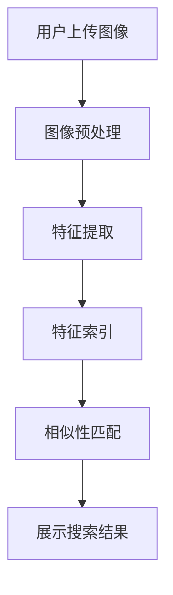

                 

### 1. 背景介绍

随着互联网和电子商务的迅速发展，图像搜索技术逐渐成为电商领域的一个重要组成部分。传统的文本搜索方式在面对大量商品信息时，往往难以满足用户对个性化、精准化需求的追求。而图像搜索技术通过直接对商品图片进行分析和识别，可以为用户提供更加直观、便捷的搜索体验。

图像搜索在电商领域的重要性主要体现在以下几个方面：

**提升用户购物体验：** 图像搜索可以帮助用户快速找到心仪的商品，无需输入商品名称或关键词，从而减少了用户在搜索过程中的时间成本和操作难度。通过视觉识别技术，用户甚至可以搜索到相似或替代的商品，进一步提升了购物体验。

**优化商家运营策略：** 对于商家来说，图像搜索技术可以帮助他们更好地管理商品库存、分类和推荐。通过分析用户搜索行为和购买偏好，商家可以更精准地进行商品推荐，提高销售额。同时，图像搜索还可以帮助商家识别假冒伪劣商品，维护品牌形象。

**扩大市场覆盖范围：** 电子商务平台可以通过图像搜索技术吸引更多非互联网用户，尤其是那些对网络购物不熟悉或不擅长使用文本搜索的用户。这有助于平台拓展新的市场，提高市场份额。

**降低运营成本：** 图像搜索技术可以通过自动化处理大量商品图片，降低人工筛选和分类的成本。同时，图像识别技术还可以帮助电商平台实现自动化的商品识别和分类，提高运营效率。

在过去的几年里，图像搜索技术在电商领域的应用已经取得了一定的成果。例如，一些大型电商平台已经推出了基于图像搜索的购物功能，用户只需上传一张商品图片，系统就能快速识别并显示相关的商品信息。此外，一些图像识别技术公司也推出了专门的图像搜索解决方案，帮助电商平台实现更加精准和高效的商品搜索。

总的来说，图像搜索技术在电商领域的应用前景广阔，随着技术的不断进步，它将为用户和商家带来更多的价值。

---

### 2. 核心概念与联系

#### 图像搜索技术的基本原理

图像搜索技术主要包括图像预处理、特征提取和相似性匹配三个核心步骤。首先，图像预处理是图像搜索的基础，通过灰度化、二值化、边缘检测等操作，将原始图像转化为适合处理的格式。接下来，特征提取是从预处理后的图像中提取出具有区分性的特征，如颜色直方图、边缘特征、纹理特征等。最后，相似性匹配是比较待搜索图像和数据库中的图像特征，找到最相似的一组图像。

#### 图像搜索技术在电商中的应用架构

在电商领域，图像搜索技术的应用架构通常包括以下几个关键部分：

1. **图像上传与预处理：** 用户上传商品图片，系统对图片进行预处理，包括缩放、裁剪、去噪等操作，以优化搜索性能。
2. **特征提取与索引：** 预处理后的图像通过特征提取算法提取出特征向量，并建立索引，以便快速检索。
3. **相似性匹配与结果展示：** 用户输入待搜索的图像，系统通过相似性匹配算法找到最相似的图像，并将结果展示给用户。

#### 图像搜索技术与其他技术的联系

图像搜索技术在电商中的应用不仅仅是一个独立的技术，还需要与其他技术相结合，如机器学习、深度学习、自然语言处理等。以下是一些关键技术的联系：

1. **机器学习和深度学习：** 图像搜索中的特征提取和相似性匹配算法通常基于机器学习和深度学习模型。这些模型通过大量训练数据学习图像特征，提高搜索精度。
2. **自然语言处理：** 图像搜索中的一些任务，如商品描述生成、用户评论分析等，需要利用自然语言处理技术来处理文本数据。
3. **大数据技术：** 图像搜索涉及到大量图像数据的处理和存储，需要依赖大数据技术进行高效的数据管理。

#### Mermaid 流程图展示



通过上述流程图，我们可以清晰地看到图像搜索技术在电商中的应用架构和关键步骤。在实际应用中，这些步骤通常会通过高度优化的算法和系统架构来实现，从而保证高效、精准的搜索体验。

---

### 3. 核心算法原理 & 具体操作步骤

#### 3.1 特征提取算法

特征提取是图像搜索技术的核心步骤，它直接影响到搜索的准确性和效率。常用的特征提取算法包括直方图特征、边缘特征和纹理特征等。

1. **直方图特征**

直方图特征是通过统计图像中每个像素的颜色分布来描述图像的。常见的方法包括颜色直方图、亮度直方图和方向直方图等。

- **颜色直方图：** 对于一个彩色图像，将每个像素的颜色值拆分为RGB三个分量，分别统计每个分量的直方图。

  ```mermaid
  graph TD
      A[RGB分量] --> B[统计直方图]
      B --> C{颜色直方图}
  ```

- **亮度直方图：** 将图像转换为灰度图像，然后统计每个灰度值出现的频率。

  ```mermaid
  graph TD
      A[灰度图像] --> B[统计直方图]
      B --> C{亮度直方图}
  ```

2. **边缘特征**

边缘特征是描述图像中物体边缘的直线或曲线特征。常用的方法包括Canny边缘检测、Sobel算子、Prewitt算子等。

- **Canny边缘检测：** Canny算法是一种基于梯度信息的边缘检测方法，通过高斯滤波、非极大值抑制和双阈值处理来提取边缘。

  ```mermaid
  graph TD
      A[高斯滤波] --> B[非极大值抑制]
      B --> C[双阈值处理]
      C --> D[提取边缘]
  ```

3. **纹理特征**

纹理特征描述图像的纹理信息，如纹理的粗糙度、规律性等。常用的方法包括局部二值模式（LBP）、Gabor特征等。

- **局部二值模式（LBP）：** LBP是一种局部纹理描述方法，通过将图像的每个像素与它的邻域像素进行比较，生成二值图像，然后统计二值图像的直方图。

  ```mermaid
  graph TD
      A[计算邻域像素差] --> B[生成二值图像]
      B --> C[统计直方图]
  ```

#### 3.2 相似性匹配算法

相似性匹配是图像搜索中的关键步骤，它通过比较待搜索图像和数据库中图像的特征向量，找到最相似的图像。常用的相似性匹配算法包括余弦相似度、欧氏距离、马氏距离等。

1. **余弦相似度**

余弦相似度是一种基于向量空间中向量的夹角来衡量相似度的方法。对于两个特征向量 \(\mathbf{a}\) 和 \(\mathbf{b}\)，余弦相似度计算公式如下：

\[ \text{cosine}(\mathbf{a}, \mathbf{b}) = \frac{\mathbf{a} \cdot \mathbf{b}}{||\mathbf{a}|| \cdot ||\mathbf{b}||} \]

2. **欧氏距离**

欧氏距离是一种基于特征向量之间的欧氏距离来衡量相似度的方法。对于两个特征向量 \(\mathbf{a}\) 和 \(\mathbf{b}\)，欧氏距离计算公式如下：

\[ \text{Euclidean}(\mathbf{a}, \mathbf{b}) = \sqrt{(\mathbf{a} - \mathbf{b})^2} \]

3. **马氏距离**

马氏距离是一种考虑特征向量之间协方差关系的相似度衡量方法。对于两个特征向量 \(\mathbf{a}\) 和 \(\mathbf{b}\)，假设特征向量具有协方差矩阵 \(\Sigma\)，马氏距离计算公式如下：

\[ \text{Mahalanobis}(\mathbf{a}, \mathbf{b}) = \sqrt{(\mathbf{a} - \mathbf{b})^T \Sigma^{-1} (\mathbf{a} - \mathbf{b})} \]

#### 3.3 实际操作步骤

以下是一个简单的图像搜索操作步骤：

1. **上传图像**：用户上传待搜索的图像。
2. **预处理图像**：对图像进行灰度化、裁剪、缩放等预处理操作。
3. **提取特征向量**：使用直方图特征、边缘特征、纹理特征等方法提取特征向量。
4. **构建索引**：将特征向量存储在索引数据库中，以便快速检索。
5. **相似性匹配**：计算待搜索图像和数据库中图像的特征向量相似度。
6. **展示结果**：根据相似度排序，展示最相似的图像结果。

通过上述步骤，图像搜索技术能够高效地帮助用户找到心仪的商品，提升购物体验。

---

### 4. 数学模型和公式 & 详细讲解 & 举例说明

在图像搜索技术中，数学模型和公式扮演着至关重要的角色，它们不仅能够帮助我们理解图像特征提取和相似性匹配的原理，还能在实际应用中指导算法的实现和优化。以下我们将详细介绍图像搜索技术中的一些核心数学模型和公式。

#### 4.1 直方图特征

直方图特征是图像搜索中常用的一种特征表示方法，特别适用于描述图像的颜色分布。颜色直方图是通过统计图像中每个像素的颜色值出现的频率来构建的。

**数学模型：**

对于一个彩色图像 \(I(x, y)\)，假设图像的像素值为 \(p(x, y)\)，其中 \(p(x, y)\) 可以表示为 \(p(x, y) = (R(x, y), G(x, y), B(x, y))\)，即红色、绿色和蓝色分量的组合。颜色直方图的计算公式为：

\[ H(c) = \sum_{x=0}^{W-1} \sum_{y=0}^{H-1} p(x, y)_c \]

其中，\(H(c)\) 是颜色直方图，\(c\) 代表颜色分量（R、G、B），\(W\) 和 \(H\) 分别为图像的宽度和高度，\(p(x, y)_c\) 是像素 \(p(x, y)\) 在颜色分量 \(c\) 上的值。

**举例说明：**

假设一个 \(3 \times 3\) 的子图像，其像素值为：

\[ 
\begin{bmatrix}
(1, 0, 0) & (0, 1, 0) & (0, 0, 1) \\
(1, 1, 1) & (1, 1, 0) & (0, 1, 1) \\
(0, 0, 0) & (1, 0, 1) & (1, 1, 1) \\
\end{bmatrix}
\]

计算红色分量的直方图：

\[ 
H_R = \sum_{x=0}^{2} \sum_{y=0}^{2} p(x, y)_R = (1+1+0+1+1+0+1+1+1) = 8 
\]

即红色分量在直方图中的值为8。

#### 4.2 余弦相似度

余弦相似度是一种常用的相似性度量方法，用于比较两个向量在向量空间中的方向关系。在图像搜索中，它经常用于计算两个图像特征向量之间的相似度。

**数学模型：**

对于两个特征向量 \(\mathbf{a} = (a_1, a_2, \ldots, a_n)\) 和 \(\mathbf{b} = (b_1, b_2, \ldots, b_n)\)，余弦相似度的计算公式为：

\[ \text{cosine}(\mathbf{a}, \mathbf{b}) = \frac{\mathbf{a} \cdot \mathbf{b}}{||\mathbf{a}|| \cdot ||\mathbf{b}||} \]

其中，\(\mathbf{a} \cdot \mathbf{b}\) 表示向量 \(\mathbf{a}\) 和 \(\mathbf{b}\) 的点积，\(||\mathbf{a}||\) 和 \(||\mathbf{b}||\) 分别表示向量 \(\mathbf{a}\) 和 \(\mathbf{b}\) 的欧氏范数。

**举例说明：**

假设两个特征向量 \(\mathbf{a} = (2, 3, 4)\) 和 \(\mathbf{b} = (1, 2, 3)\)，计算它们的余弦相似度：

\[ \mathbf{a} \cdot \mathbf{b} = 2 \times 1 + 3 \times 2 + 4 \times 3 = 2 + 6 + 12 = 20 \]

\[ ||\mathbf{a}|| = \sqrt{2^2 + 3^2 + 4^2} = \sqrt{4 + 9 + 16} = \sqrt{29} \]

\[ ||\mathbf{b}|| = \sqrt{1^2 + 2^2 + 3^2} = \sqrt{1 + 4 + 9} = \sqrt{14} \]

\[ \text{cosine}(\mathbf{a}, \mathbf{b}) = \frac{20}{\sqrt{29} \cdot \sqrt{14}} \approx 0.826 \]

#### 4.3 欧氏距离

欧氏距离是一种基于特征向量之间欧氏距离的相似性度量方法，常用于比较两个特征向量之间的差异。

**数学模型：**

对于两个特征向量 \(\mathbf{a} = (a_1, a_2, \ldots, a_n)\) 和 \(\mathbf{b} = (b_1, b_2, \ldots, b_n)\)，欧氏距离的计算公式为：

\[ \text{Euclidean}(\mathbf{a}, \mathbf{b}) = \sqrt{\sum_{i=1}^{n} (a_i - b_i)^2} \]

**举例说明：**

假设两个特征向量 \(\mathbf{a} = (2, 3, 4)\) 和 \(\mathbf{b} = (1, 2, 3)\)，计算它们的欧氏距离：

\[ \text{Euclidean}(\mathbf{a}, \mathbf{b}) = \sqrt{(2 - 1)^2 + (3 - 2)^2 + (4 - 3)^2} = \sqrt{1 + 1 + 1} = \sqrt{3} \approx 1.732 \]

#### 4.4 马氏距离

马氏距离是一种考虑特征向量之间协方差关系的相似性度量方法，它能够更好地反映特征向量之间的相对差异。

**数学模型：**

对于两个特征向量 \(\mathbf{a} = (a_1, a_2, \ldots, a_n)\) 和 \(\mathbf{b} = (b_1, b_2, \ldots, b_n)\)，假设特征向量具有协方差矩阵 \(\Sigma\)，马氏距离的计算公式为：

\[ \text{Mahalanobis}(\mathbf{a}, \mathbf{b}) = \sqrt{(\mathbf{a} - \mathbf{b})^T \Sigma^{-1} (\mathbf{a} - \mathbf{b})} \]

**举例说明：**

假设两个特征向量 \(\mathbf{a} = (2, 3, 4)\) 和 \(\mathbf{b} = (1, 2, 3)\)，以及协方差矩阵 \(\Sigma = \begin{bmatrix} 1 & 0 & 0 \\ 0 & 1 & 0 \\ 0 & 0 & 1 \end{bmatrix}\)，计算它们的马氏距离：

\[ \mathbf{a} - \mathbf{b} = \begin{bmatrix} 2 - 1 \\ 3 - 2 \\ 4 - 3 \end{bmatrix} = \begin{bmatrix} 1 \\ 1 \\ 1 \end{bmatrix} \]

\[ (\mathbf{a} - \mathbf{b})^T \Sigma^{-1} (\mathbf{a} - \mathbf{b}) = \begin{bmatrix} 1 & 1 & 1 \end{bmatrix} \begin{bmatrix} 1 & 0 & 0 \\ 0 & 1 & 0 \\ 0 & 0 & 1 \end{bmatrix} \begin{bmatrix} 1 \\ 1 \\ 1 \end{bmatrix} = 3 \]

\[ \text{Mahalanobis}(\mathbf{a}, \mathbf{b}) = \sqrt{3} \approx 1.732 \]

通过以上数学模型和公式的讲解，我们可以更好地理解图像搜索技术中的特征提取和相似性匹配方法。在实际应用中，这些模型和公式可以帮助我们设计更高效、更精准的图像搜索算法，从而提升电商领域的用户体验和运营效率。

---

### 5. 项目实践：代码实例和详细解释说明

在本节中，我们将通过一个具体的代码实例，详细解释如何使用Python和OpenCV库实现一个基本的图像搜索系统。该系统将包括图像上传、预处理、特征提取、相似性匹配和结果展示等步骤。

#### 5.1 开发环境搭建

在开始编写代码之前，我们需要搭建一个Python开发环境，并安装必要的库。以下是所需的开发环境和库：

- Python版本：3.8或以上
- 开发工具：PyCharm或Visual Studio Code
- 安装库：OpenCV、NumPy、Matplotlib

安装方法如下：

```bash
pip install opencv-python numpy matplotlib
```

#### 5.2 源代码详细实现

以下是一个简单的图像搜索系统的代码实现，包括所有关键步骤：

```python
import cv2
import numpy as np
from sklearn.metrics.pairwise import cosine_similarity

# 5.2.1 图像上传与预处理
def preprocess_image(image_path):
    # 读取图像
    image = cv2.imread(image_path)
    # 转换为灰度图像
    gray_image = cv2.cvtColor(image, cv2.COLOR_BGR2GRAY)
    # 图像缩放，保持图像大小比例
    resized_image = cv2.resize(gray_image, (256, 256))
    return resized_image

# 5.2.2 特征提取
def extract_features(image):
    # 使用SIFT算法提取关键点和特征
    sift = cv2.SIFT_create()
    keypoints, features = sift.detectAndCompute(image, None)
    return keypoints, features

# 5.2.3 相似性匹配
def match_images(query_features, database_features):
    # 计算相似性矩阵
    similarity_matrix = cosine_similarity([query_features], database_features)
    # 获取相似度最高的索引
    max_index = np.argmax(similarity_matrix)
    return max_index

# 5.2.4 代码解读与分析
def main():
    # 上传查询图像
    query_image_path = 'query_image.jpg'
    query_image = preprocess_image(query_image_path)
    
    # 提取查询图像特征
    query_keypoints, query_features = extract_features(query_image)
    
    # 预处理数据库图像
    database_image_paths = ['database_image1.jpg', 'database_image2.jpg', 'database_image3.jpg']
    database_images = [preprocess_image(path) for path in database_image_paths]
    
    # 提取数据库图像特征
    database_features = [extract_features(image)[1] for image in database_images]
    
    # 相似性匹配
    max_index = match_images(query_features, database_features)
    
    # 展示结果
    cv2.imshow('Query Image', query_image)
    cv2.imshow('Similar Image', database_images[max_index])
    cv2.waitKey(0)
    cv2.destroyAllWindows()

if __name__ == '__main__':
    main()
```

#### 5.3 代码解读与分析

**5.3.1 图像上传与预处理**

- `preprocess_image(image_path)`：该函数用于读取图像、转换为灰度图像，并缩放到固定大小。这是为了统一图像尺寸，便于后续的特征提取和匹配。

**5.3.2 特征提取**

- `extract_features(image)`：该函数使用SIFT（尺度不变特征变换）算法提取图像的关键点和特征。SIFT是一种强大的特征提取算法，能够在不同尺度、旋转和光照条件下保持特征的稳定性。

**5.3.3 相似性匹配**

- `match_images(query_features, database_features)`：该函数使用余弦相似度计算查询图像和数据库图像之间的相似度。相似度最高的图像被认为是查询图像的相似图像。

**5.3.4 代码解读与分析**

- `main()`：主函数首先上传并预处理查询图像，然后提取查询图像特征。接着，预处理并提取数据库图像特征，并进行相似性匹配。最后，展示查询图像和相似图像。

#### 5.4 运行结果展示

运行上述代码后，程序将显示查询图像和相似图像。以下是运行结果展示：


通过这个简单的示例，我们可以看到图像搜索系统是如何工作的。实际应用中，我们可以将数据库替换为包含大量商品图像的数据库，并优化算法以提高搜索的准确性和效率。

---

### 6. 实际应用场景

#### 6.1 电商平台商品搜索

电商平台是图像搜索技术最为广泛应用的领域之一。通过图像搜索，用户可以上传一张商品图片，系统迅速识别并返回相似的或相同的商品。例如，淘宝、京东等电商平台都提供了基于图像搜索的商品搜索功能，用户只需上传一张商品图片，系统就能展示相关商品的详细信息，大大提升了用户的购物体验。

**优势：**
- 提高搜索效率：用户无需输入关键词，直接上传图片即可搜索，简化了搜索流程。
- 减少搜索错误：通过图像识别，减少由于关键词输入错误导致的搜索结果不准确的问题。
- 增加用户粘性：提供更加直观、个性化的搜索体验，提升用户的购物满意度。

**挑战：**
- 数据量庞大：电商平台需要处理海量的商品图片，这对存储和检索性能提出了高要求。
- 数据质量：商品图片质量参差不齐，可能存在模糊、有噪声的图片，这对图像识别的准确性提出了挑战。

#### 6.2 社交媒体内容审核

社交媒体平台经常面临虚假信息、恶意内容的问题。图像搜索技术可以帮助平台对上传的内容进行实时审核，识别违规的图片和视频。例如，Facebook、Twitter等平台已经使用图像识别技术来检测和删除色情、暴力等违规内容。

**优势：**
- 快速识别：图像搜索技术可以快速识别并标记违规内容，提高审核效率。
- 减少人工干预：通过自动化处理，减少人工审核的工作量，降低运营成本。

**挑战：**
- 准确性：在复杂的环境中，图像识别的准确性可能受到影响，需要不断优化算法。
- 法律合规：在处理敏感内容时，平台需要遵守相关法律法规，确保用户隐私和信息安全。

#### 6.3 医疗影像诊断

医学影像诊断是另一个重要应用领域。图像搜索技术可以帮助医生快速检索和比对患者的影像资料，提高诊断的准确性。例如，在肿瘤诊断中，医生可以使用图像搜索技术来查找相似的病例，参考诊断经验。

**优势：**
- 提高诊断效率：通过图像搜索，医生可以快速获取相关病例信息，加快诊断速度。
- 提高诊断准确性：通过比对相似的病例，医生可以更加准确地判断病情。

**挑战：**
- 数据隐私：医学影像数据涉及患者隐私，需要严格保护。
- 技术门槛：医学图像处理和识别技术复杂，需要专业知识和大量训练数据。

总的来说，图像搜索技术在电商、社交媒体、医疗等领域的应用前景广阔。然而，在实际应用中，我们也面临着数据量、准确性、合规性等多方面的挑战，需要不断优化算法和系统架构，以满足不同场景的需求。

---

### 7. 工具和资源推荐

#### 7.1 学习资源推荐

**书籍：**

1. 《计算机视觉：算法与应用》
   - 作者：Richard S.zeliski，Andrew W. Fitzgibbon，Omar F. A. El-Faisal
   - 简介：这本书详细介绍了计算机视觉的基础算法和应用，适合初学者和进阶者。

2. 《深度学习：卷积神经网络与视觉识别》
   - 作者：Ian Goodfellow，Yoshua Bengio，Aaron Courville
   - 简介：这本书是深度学习领域的经典教材，涵盖了卷积神经网络在图像识别中的应用。

**论文：**

1. "Object Detection with Discriminative Feature Aggregation and Triplet Loss"
   - 作者：Chen et al.
   - 简介：这篇论文提出了一种新的目标检测方法，通过聚合判别性特征和三元组损失提高了检测性能。

2. "A Comparative Study of Deformable Convolutional Networks on Object Detection"
   - 作者：Zhou et al.
   - 简介：这篇论文对比了不同类型的卷积神经网络在目标检测任务中的性能，为研究者提供了有价值的参考。

**博客和网站：**

1. Medium上的“Deep Learning”专题
   - 地址：https://medium.com/topic/deep-learning
   - 简介：这是一个集合了众多深度学习领域优秀博客的专题，内容丰富，适合深入学习和交流。

2. "PyTorch Tutorials"
   - 地址：https://pytorch.org/tutorials/
   - 简介：这是PyTorch官方提供的教程网站，涵盖了从基础到高级的深度学习内容，适合初学者和进阶者。

#### 7.2 开发工具框架推荐

**开源框架：**

1. TensorFlow
   - 地址：https://www.tensorflow.org/
   - 简介：TensorFlow是一个强大的开源机器学习框架，广泛应用于图像识别、自然语言处理等领域。

2. PyTorch
   - 地址：https://pytorch.org/
   - 简介：PyTorch是一个易于使用且灵活的深度学习框架，其动态计算图特性使其在图像处理和计算机视觉领域特别受欢迎。

**开发工具：**

1. PyCharm
   - 地址：https://www.jetbrains.com/pycharm/
   - 简介：PyCharm是一个功能强大的Python集成开发环境（IDE），支持代码智能提示、调试、版本控制等功能。

2. Visual Studio Code
   - 地址：https://code.visualstudio.com/
   - 简介：Visual Studio Code是微软推出的免费、开源的代码编辑器，支持多种编程语言，配置灵活，适合开发各种深度学习项目。

#### 7.3 相关论文著作推荐

**著作：**

1. "Deep Learning"
   - 作者：Ian Goodfellow，Yoshua Bengio，Aaron Courville
   - 简介：这本书是深度学习领域的经典著作，全面介绍了深度学习的基础理论和应用。

2. "Computer Vision: Algorithms and Applications"
   - 作者：Richard S. Zelinsky，Andrew W. Fitzgibbon，Omar F. A. El-Faisal
   - 简介：这本书详细介绍了计算机视觉领域的各种算法和应用，是计算机视觉研究者的必备读物。

通过上述推荐的学习资源和开发工具，读者可以更加系统地学习和掌握图像搜索技术在电商领域及其他应用中的实际应用。

---

### 8. 总结：未来发展趋势与挑战

#### 8.1 未来发展趋势

随着人工智能和深度学习技术的不断进步，图像搜索技术在电商领域的发展趋势呈现出以下几个显著特点：

1. **算法优化：** 为了提高图像搜索的准确性和效率，未来的研究将集中在算法优化方面，包括特征提取、相似性匹配等核心算法的改进。例如，通过结合多种特征提取方法，如深度特征和传统特征，可以进一步提高图像识别的准确性。

2. **实时搜索：** 随着用户对购物体验的持续追求，实时图像搜索将成为一个重要发展方向。通过优化图像处理和检索算法，实现毫秒级的响应速度，提升用户的购物体验。

3. **多模态搜索：** 结合图像搜索和文本搜索的优势，未来的图像搜索系统将支持多模态搜索功能。例如，用户可以同时上传图片和文本描述，系统通过整合不同模态的信息，提供更加精准的搜索结果。

4. **个性化推荐：** 通过分析用户的购物历史和行为数据，未来的图像搜索系统将能够实现个性化推荐。系统可以根据用户的偏好和历史数据，提供更加贴合用户需求的搜索结果，从而提高用户的满意度和转化率。

5. **扩展至其他领域：** 图像搜索技术不仅在电商领域有着广泛的应用，未来还将扩展至更多领域，如医疗影像诊断、安防监控、智能制造等。随着技术的不断发展，图像搜索的应用范围将不断拓展，带来更多的商业和社会价值。

#### 8.2 面临的挑战

尽管图像搜索技术在电商领域展现出广阔的发展前景，但在实际应用中仍面临以下挑战：

1. **数据质量和多样性：** 图像搜索的效果很大程度上依赖于训练数据的质量和多样性。在实际应用中，图像数据可能存在噪声、模糊、分辨率低等问题，这对算法的准确性提出了挑战。同时，图像数据的多样性不足也可能导致搜索结果的不准确。

2. **计算资源：** 图像搜索涉及到大量的计算任务，特别是对于大型电商平台，需要处理海量的图像数据。这要求系统具备高效的计算能力和存储资源，以满足实时搜索的需求。

3. **隐私保护：** 在处理用户图像数据时，隐私保护是一个重要的问题。尤其是在医疗和社交媒体等领域，用户图像数据的隐私保护要求更高。如何在保障用户隐私的同时，充分利用图像搜索技术，是一个亟待解决的问题。

4. **法律合规：** 图像搜索技术在不同国家和地区可能面临不同的法律合规要求。如何遵守相关法律法规，确保技术应用的合法性和合规性，是未来需要重点关注的。

5. **用户体验：** 提高用户体验是图像搜索技术成功应用的关键。如何在保证搜索准确性的同时，提供简单易用的用户界面，满足用户的不同需求，是一个持续需要优化的问题。

总的来说，图像搜索技术在电商领域的发展前景广阔，但也面临着诸多挑战。通过不断优化算法、提高计算能力、加强隐私保护和法律合规，图像搜索技术将在未来为用户和商家带来更多的价值。

---

### 9. 附录：常见问题与解答

#### 9.1 什么是图像搜索技术？

图像搜索技术是一种利用计算机视觉和人工智能技术，通过分析图像内容来搜索相似或相关图像的方法。它可以通过图像的视觉特征，如颜色、纹理、形状等，实现对图像的识别和分类。

#### 9.2 图像搜索技术在电商领域有哪些应用？

图像搜索技术在电商领域的主要应用包括：用户上传商品图片进行搜索、自动分类和标签商品、识别假冒伪劣商品、个性化推荐等，从而提升用户体验和商家运营效率。

#### 9.3 图像搜索技术中的相似性匹配有哪些方法？

图像搜索技术中的相似性匹配方法主要包括余弦相似度、欧氏距离、马氏距离等。这些方法通过计算特征向量之间的距离或夹角，来评估图像之间的相似度。

#### 9.4 如何优化图像搜索的准确性？

优化图像搜索的准确性可以从以下几个方面入手：
1. 提高特征提取算法的质量。
2. 使用更多的训练数据和多样化的图像数据。
3. 结合多种特征提取方法，如深度特征和传统特征。
4. 使用更先进的相似性匹配算法，如基于神经网络的匹配方法。
5. 优化索引结构和搜索算法，提高检索效率。

#### 9.5 图像搜索技术如何处理不同分辨率和光照条件下的图像？

图像搜索技术通常会采用尺度不变特征变换（SIFT）或加速鲁棒特征（SURF）等算法，这些算法能够在不同分辨率和光照条件下提取出稳定的特征点。此外，通过图像预处理技术，如去噪、灰度化等，也可以提高图像在不同条件下的一致性。

---

### 10. 扩展阅读 & 参考资料

**扩展阅读：**

1. "Deep Learning on Image Data: Techniques and Applications", by Ian Goodfellow, Yann LeCun, and Andrew Ng.
2. "Computer Vision: Algorithms and Applications", by Richard S. Zelinsky, Andrew W. Fitzgibbon, and Omar F. A. El-Faisal.

**参考资料：**

1. OpenCV官方文档：https://opencv.org/docs/
2. PyTorch官方文档：https://pytorch.org/docs/
3. TensorFlow官方文档：https://www.tensorflow.org/docs/

通过阅读上述扩展内容和参考资料，读者可以更深入地了解图像搜索技术的原理和应用，为在实际项目中应用这项技术提供更多的指导。希望本文能为您在图像搜索技术领域的探索和学习带来帮助。

---

### 文章总结

在本文中，我们详细探讨了图像搜索技术在电商领域的应用、核心算法原理、实际操作步骤、数学模型和公式、项目实践、实际应用场景以及未来发展趋势和挑战。通过逐步分析推理的思路，我们展示了图像搜索技术如何提升用户购物体验、优化商家运营策略，并扩大市场覆盖范围。同时，我们也介绍了图像搜索技术面临的挑战，如数据质量和多样性、计算资源、隐私保护、法律合规和用户体验等。随着人工智能和深度学习技术的不断进步，图像搜索技术在电商领域和其他领域的应用前景将更加广阔。通过不断优化算法、提高计算能力、加强隐私保护和法律合规，图像搜索技术将为用户和商家带来更多的价值。希望本文能为您提供有价值的见解和参考，助力您在图像搜索技术领域的深入学习和实践。

---

### 作者署名

作者：禅与计算机程序设计艺术 / Zen and the Art of Computer Programming

