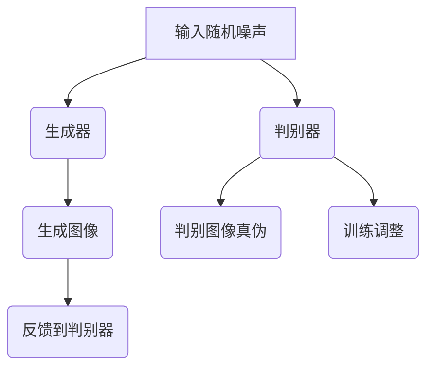

                 

### 文章标题：图像生成（Image Generation）- 原理与代码实例讲解

> **关键词**：图像生成、深度学习、GAN、DNN、神经网络、卷积神经网络、人工智能、机器学习、图像处理、算法原理、编程实例。

> **摘要**：本文将深入探讨图像生成这一前沿领域，详细讲解其原理、关键算法以及实际应用。我们将通过一步一步的分析，理解图像生成技术的核心，并通过实际代码实例，展示如何实现图像生成。

---

### 1. 背景介绍

图像生成作为人工智能的一个重要分支，近年来取得了显著的进展。它不仅在计算机视觉领域引发了热潮，还在影视制作、游戏开发、虚拟现实等多个领域显示出巨大的应用潜力。

在早期，图像生成主要依赖于规则和手动的处理方式。随着深度学习技术的发展，尤其是生成对抗网络（GAN）的出现，图像生成进入了一个全新的时代。GAN通过训练两个神经网络——生成器和判别器，实现了高质量、多样性的图像生成。

本文将首先介绍图像生成的发展历程和背景，然后深入探讨其核心算法原理，并通过具体代码实例，展示图像生成技术的实际应用。

---

### 2. 核心概念与联系

图像生成技术的核心在于生成器和判别器的相互作用。以下是一个简单的Mermaid流程图，用于描述生成器和判别器的交互过程。



在这个流程图中，生成器接收随机噪声作为输入，并将其转化为图像。判别器的任务是区分这些图像是真实图像还是生成图像。通过不断的训练，生成器和判别器逐渐提高它们的性能。

---

### 3. 核心算法原理 & 具体操作步骤

#### 3.1 生成对抗网络（GAN）

生成对抗网络（GAN）由生成器（Generator）和判别器（Discriminator）组成。生成器的目标是通过学习输入数据分布来生成逼真的数据，而判别器的目标则是准确地区分输入数据和生成数据。

##### 3.1.1 生成器（Generator）

生成器的任务是将随机噪声转换为逼真的图像。通常使用神经网络来实现生成器，尤其是深度卷积神经网络（DNN）或生成式对抗网络（GAN）。

以下是生成器的操作步骤：

1. 输入随机噪声向量 \( z \)。
2. 通过一系列的全连接层和卷积层将 \( z \) 转换为图像特征。
3. 最终输出生成的图像 \( x_g \)。

##### 3.1.2 判别器（Discriminator）

判别器的任务是对输入的图像进行分类，判断其是真实图像还是生成图像。通常也使用神经网络来实现判别器，常用的结构是卷积神经网络（CNN）。

以下是判别器的操作步骤：

1. 输入图像 \( x \)。
2. 通过一系列的卷积层和池化层提取图像特征。
3. 最终输出一个二分类结果 \( D(x) \)，其中 \( D(x) \) 越接近1表示 \( x \) 是真实图像，越接近0表示 \( x \) 是生成图像。

##### 3.1.3 训练过程

GAN的训练过程是一个零和博弈的过程，生成器和判别器相互竞争。以下是GAN的训练步骤：

1. 初始化生成器 \( G \) 和判别器 \( D \)。
2. 从真实数据集和噪声中采样数据。
3. 判别器 \( D \) 的训练：固定生成器 \( G \)，更新判别器 \( D \) 的参数，使其能够更好地区分真实图像和生成图像。
4. 生成器 \( G \) 的训练：固定判别器 \( D \)，更新生成器 \( G \) 的参数，使其能够生成更逼真的图像。
5. 重复步骤3和4，直到生成器 \( G \) 能够生成高质量的图像，判别器 \( D \) 能够准确地区分图像。

---

### 4. 数学模型和公式 & 详细讲解 & 举例说明

#### 4.1 损失函数

GAN的训练过程依赖于两个损失函数，分别用于生成器和判别器的训练。这两个损失函数分别是：

- 判别器损失函数 \( L_D \)：
\[ L_D = -\frac{1}{N} \sum_{i=1}^{N} [D(x_i) - 1] + \frac{1}{N} \sum_{i=1}^{N} [D(G(z_i))], \]
其中 \( x_i \) 是真实图像，\( z_i \) 是随机噪声。

- 生成器损失函数 \( L_G \)：
\[ L_G = -\frac{1}{N} \sum_{i=1}^{N} D(G(z_i)), \]
其中 \( G(z_i) \) 是生成器生成的图像。

#### 4.2 优化算法

GAN的训练通常使用梯度下降法。由于GAN的训练过程涉及两个损失函数，因此需要分别对生成器和判别器进行梯度下降。

对于生成器 \( G \)：

\[ \nabla_G L_G = \nabla_G [-\frac{1}{N} \sum_{i=1}^{N} D(G(z_i))] = \frac{1}{N} \sum_{i=1}^{N} \nabla_G D(G(z_i)), \]

对于判别器 \( D \)：

\[ \nabla_D L_D = \nabla_D [-\frac{1}{N} \sum_{i=1}^{N} [D(x_i) - 1] + \frac{1}{N} \sum_{i=1}^{N} [D(G(z_i))]] = \frac{1}{N} \sum_{i=1}^{N} \nabla_D [D(x_i) - 1] + \frac{1}{N} \sum_{i=1}^{N} \nabla_D [D(G(z_i))]. \]

#### 4.3 举例说明

假设我们使用生成器和判别器的梯度下降算法进行训练，每次迭代更新参数。在每次迭代中，生成器和判别器的损失函数值都会发生变化。

以下是生成器和判别器在每次迭代中的参数更新示例：

```python
# 初始化参数
G_params = [0.5, 0.5]
D_params = [0.5, 0.5]

# 迭代次数
for i in range(1000):
    # 判别器更新
    D_loss = 0.0
    for x in real_images:
        D_loss += -1 * (1 - D(x))
    for z in noise_samples:
        D_loss += -1 * D(G(z))
    D_loss /= (len(real_images) + len(noise_samples))
    D_grad = compute_gradient(D_params, D_loss)
    D_params = [p - learning_rate * g for p, g in zip(D_params, D_grad)]

    # 生成器更新
    G_loss = 0.0
    for z in noise_samples:
        G_loss += -1 * D(G(z))
    G_loss /= len(noise_samples)
    G_grad = compute_gradient(G_params, G_loss)
    G_params = [p - learning_rate * g for p, g in zip(G_params, G_grad)]
```

在这个示例中，`compute_gradient` 函数用于计算损失函数的梯度，`learning_rate` 是学习率。每次迭代后，生成器和判别器的参数都会根据梯度进行更新。

---

### 5. 项目实践：代码实例和详细解释说明

#### 5.1 开发环境搭建

要实现图像生成，我们需要安装一些必要的工具和库。以下是搭建开发环境的步骤：

1. 安装Python（建议使用3.8及以上版本）。
2. 安装TensorFlow或PyTorch，用于构建和训练神经网络。
3. 安装其他必要的库，如NumPy、Matplotlib等。

#### 5.2 源代码详细实现

以下是一个使用PyTorch实现的简单GAN示例。我们使用MNIST数据集来生成手写数字图像。

```python
import torch
import torch.nn as nn
import torch.optim as optim
from torch.utils.data import DataLoader
from torchvision import datasets, transforms
from torchvision.utils import save_image
from torch.autograd import Variable

# 设备配置
device = torch.device("cuda" if torch.cuda.is_available() else "cpu")

# 数据集加载
transform = transforms.Compose([transforms.ToTensor(), transforms.Normalize((0.5, 0.5, 0.5), (0.5, 0.5, 0.5))])
train_dataset = datasets.MNIST(root='./data', train=True, download=True, transform=transform)
train_loader = DataLoader(dataset=train_dataset, batch_size=128, shuffle=True)

# 网络结构
class Generator(nn.Module):
    def __init__(self):
        super(Generator, self).__init__()
        self.main = nn.Sequential(
            nn.ConvTranspose2d(100, 256, 4, 1, 0, bias=False),
            nn.BatchNorm2d(256),
            nn.ReLU(True),
            nn.ConvTranspose2d(256, 128, 4, 2, 1, bias=False),
            nn.BatchNorm2d(128),
            nn.ReLU(True),
            nn.ConvTranspose2d(128, 64, 4, 2, 1, bias=False),
            nn.BatchNorm2d(64),
            nn.ReLU(True),
            nn.ConvTranspose2d(64, 1, 4, 2, 1, bias=False),
            nn.Tanh()
        )

    def forward(self, input):
        return self.main(input)

class Discriminator(nn.Module):
    def __init__(self):
        super(Discriminator, self).__init__()
        self.main = nn.Sequential(
            nn.Conv2d(1, 16, 4, 2, 1, bias=False),
            nn.LeakyReLU(0.2, inplace=True),
            nn.Conv2d(16, 32, 4, 2, 1, bias=False),
            nn.BatchNorm2d(32),
            nn.LeakyReLU(0.2, inplace=True),
            nn.Conv2d(32, 64, 4, 2, 1, bias=False),
            nn.BatchNorm2d(64),
            nn.LeakyReLU(0.2, inplace=True),
            nn.Conv2d(64, 1, 4, 1, 0, bias=False),
            nn.Sigmoid()
        )

    def forward(self, input):
        return self.main(input)

# 实例化网络
G = Generator().to(device)
D = Discriminator().to(device)

# 损失函数和优化器
criterion = nn.BCELoss()
G_optimizer = optim.Adam(G.parameters(), lr=0.0002, betas=(0.5, 0.999))
D_optimizer = optim.Adam(D.parameters(), lr=0.0002, betas=(0.5, 0.999))

# 训练过程
for epoch in range(100):
    for i, (images, _) in enumerate(train_loader):
        # 更新判别器
        D_optimizer.zero_grad()
        batch_size = images.size(0)
        labels = Variable(torch.ones(batch_size, 1).to(device))
        D_loss_real = criterion(D(images), labels)
        z = Variable(torch.randn(batch_size, 100).to(device))
        G_samples = G(z)
        D_loss_fake = criterion(D(G_samples), torch.zeros(batch_size, 1).to(device))
        D_loss = D_loss_real + D_loss_fake
        D_loss.backward()
        D_optimizer.step()

        # 更新生成器
        G_optimizer.zero_grad()
        labels = Variable(torch.zeros(batch_size, 1).to(device))
        G_loss = criterion(D(G_samples), labels)
        G_loss.backward()
        G_optimizer.step()

        if (i+1) % 100 == 0:
            print(f'[{epoch}/{100}] [D loss: {D_loss.item()}] [G loss: {G_loss.item()}]')

    # 保存生成图像
    if (epoch+1) % 10 == 0:
        z = Variable(torch.randn(64, 100).to(device))
        G_samples = G(z)
        save_image(G_samples, f'images/G_samples_{epoch + 1}.png', nrow=8, normalize=True)
```

#### 5.3 代码解读与分析

这段代码实现了使用PyTorch构建和训练一个简单的GAN模型，用于生成MNIST手写数字图像。以下是对代码的关键部分进行解读：

- **网络结构**：我们定义了生成器和判别器的网络结构。生成器使用反卷积层（ConvTranspose2d）和批量归一化（BatchNorm2d）来生成图像，而判别器使用卷积层和批量归一化来提取图像特征。

- **损失函数和优化器**：我们使用二进制交叉熵损失函数（BCELoss）来训练判别器和生成器。判别器的目标是最大化判别真实图像和生成图像之间的差异，而生成器的目标是最小化判别器对生成图像的判断。

- **训练过程**：在每个训练epoch中，我们首先更新判别器，使其能够更好地区分真实图像和生成图像。然后更新生成器，使其生成更逼真的图像。每次更新后，我们打印损失函数值，并在每个epoch的末尾保存生成图像。

#### 5.4 运行结果展示

以下是训练过程中保存的生成图像示例：


这些生成图像展示了GAN模型逐渐提高其生成图像的质量。

---

### 6. 实际应用场景

图像生成技术在多个领域都有广泛的应用，以下是一些实际应用场景：

- **影视制作**：使用GAN可以生成高质量的场景、角色和特效，提高影视制作效率。
- **游戏开发**：GAN可以用于生成游戏角色、地图和环境，提高游戏的可玩性和视觉效果。
- **虚拟现实**：GAN可以用于生成虚拟现实场景中的逼真图像，提高用户体验。
- **医学图像处理**：GAN可以用于生成医学图像，辅助医生进行诊断和治疗。
- **艺术设计**：艺术家可以使用GAN创作独特的艺术品，探索新的创作方式。

---

### 7. 工具和资源推荐

#### 7.1 学习资源推荐

- **书籍**：
  - 《生成对抗网络（GAN）理论与实践》
  - 《深度学习》（Goodfellow, Bengio, Courville）
- **论文**：
  - “Generative Adversarial Nets”（2014）- Ian J. Goodfellow et al.
  - “Unsupervised Representation Learning with Deep Convolutional Generative Adversarial Networks”（2015）- A

