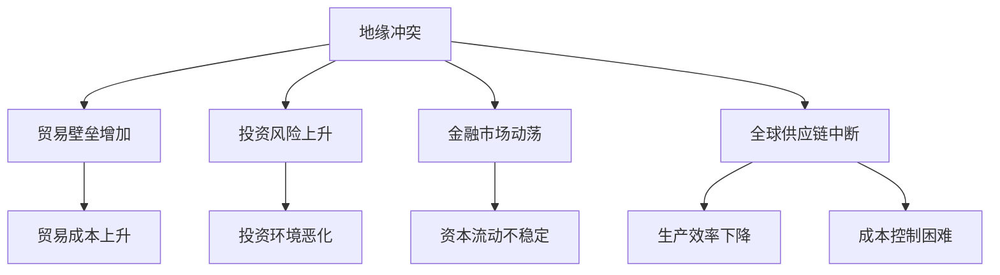

                 

### 1. 背景介绍

随着全球地缘政治局势的不断紧张，地缘冲突问题日益凸显，成为影响全球经济的重要变量。地缘冲突不仅可能引发军事对抗，还可能对国际经济关系、贸易流动、投资环境等产生深远影响。本文旨在探讨地缘冲突对全球经济的影响，分析其背后的机理和传导路径，并提出相应的对策建议。

当前，全球地缘冲突的根源多样，包括资源争夺、意识形态差异、历史遗留问题等。例如，中美之间的贸易摩擦、俄罗斯与乌克兰的冲突、中东地区的持续动荡等，都给全球经济带来了巨大的不确定性。这些冲突不仅直接导致相关国家的经济增速放缓，还通过贸易战、供应链中断、金融市场波动等途径影响到全球经济的稳定。

地缘冲突对经济的影响是多方面的。首先，地缘冲突可能导致贸易壁垒升高，贸易成本增加，影响全球贸易的顺畅进行。其次，地缘冲突可能引发金融市场动荡，导致资本流动不稳定，对投资者信心产生负面影响。此外，地缘冲突还可能对全球供应链造成破坏，影响生产效率和成本控制。

在本文中，我们将详细探讨地缘冲突如何通过以下几个方面影响全球经济：1）贸易流动的变化；2）投资环境的恶化；3）金融市场的波动；4）全球供应链的中断。通过分析这些影响，我们希望能够为政策制定者和企业界提供有价值的参考，帮助他们更好地应对地缘冲突带来的挑战。

接下来，我们将逐步深入分析地缘冲突对全球经济影响的各个具体方面，并探讨其背后的机理和传导路径。

### 2. 核心概念与联系

为了深入理解地缘冲突对全球经济的影响，我们需要先明确几个核心概念，并分析它们之间的相互联系。

**地缘冲突**：地缘冲突是指由于国家之间在地理、资源、意识形态等方面的矛盾而产生的对抗和冲突。这些冲突可以表现为战争、军事对峙、贸易战等形式。

**全球经济**：全球经济是指全球范围内的经济活动和关系，包括国际贸易、跨国投资、国际金融流动等。

**贸易流动**：贸易流动是指商品和服务在不同国家之间的流动。贸易流动的规模和质量对全球经济有重要影响。

**投资环境**：投资环境是指影响外国投资者在该国投资决策的各种条件和因素，包括政策稳定性、法制建设、市场开放度等。

**金融市场**：金融市场是指各种金融工具的交易市场，包括股票市场、债券市场、外汇市场等。

**全球供应链**：全球供应链是指在全球范围内，由多个国家和企业共同参与的、涉及生产、销售、物流等环节的复杂网络。

地缘冲突对全球经济的影响可以通过以下几个环节传导：

1. **地缘冲突 -> 贸易流动**：地缘冲突可能导致国家之间贸易壁垒增加，贸易成本上升，从而影响全球贸易的顺畅进行。
2. **地缘冲突 -> 投资环境**：地缘冲突可能导致投资风险上升，影响外国投资者信心，从而恶化投资环境。
3. **地缘冲突 -> 金融市场**：地缘冲突可能导致金融市场动荡，资本流动不稳定，影响投资者信心和宏观经济稳定。
4. **地缘冲突 -> 全球供应链**：地缘冲突可能破坏全球供应链，导致生产效率和成本控制受到影响。

为了更好地理解这些概念之间的联系，我们可以通过一个简化的 Mermaid 流程图来展示：



在这个流程图中，地缘冲突作为起点，通过不同的路径影响贸易流动、投资环境、金融市场和全球供应链。接下来，我们将详细分析这些影响的具体表现。

#### 2.1 地缘冲突与贸易流动

地缘冲突对贸易流动的影响主要体现在贸易壁垒的增加和贸易成本的上升。贸易壁垒是指国家通过法律、政策等手段限制或阻止商品和服务在国际间流动的各种措施。贸易壁垒的增加可能源于地缘冲突导致的政治对立、经济利益冲突或安全担忧。

首先，地缘冲突可能导致国家之间的贸易壁垒增加。例如，中美贸易战期间，美国对中国发起了一系列贸易制裁，包括加征关税、限制技术出口等。这些措施直接增加了中美之间的贸易成本，影响了两国之间的贸易流动。类似的，俄罗斯与乌克兰的冲突也导致了俄罗斯对乌克兰的贸易封锁，进一步加剧了乌克兰的经济困境。

其次，地缘冲突还可能导致贸易成本的上升。贸易成本包括运输成本、关税成本、行政成本等。地缘冲突可能导致交通受阻、物流不畅，从而增加运输成本。例如，中东地区的持续冲突导致该地区的物流成本大幅上升，影响了全球贸易的效率和成本控制。此外，地缘冲突还可能导致关税增加，从而增加进口商品的成本。例如，印度与巴基斯坦之间的贸易战导致了两国之间的关税大幅上升，影响了双方的经济复苏。

总的来说，地缘冲突通过增加贸易壁垒和贸易成本，对全球贸易流动产生了显著的负面影响。这种影响不仅体现在具体的国家和地区之间，还通过全球价值链和供应链网络传导到全球经济的各个方面。

#### 2.2 地缘冲突与投资环境

地缘冲突对投资环境的影响主要通过增加投资风险和降低外国投资者信心来体现。投资环境是指影响外国投资者在该国投资决策的各种条件和因素，包括政治稳定性、法律体系、市场开放度、基础设施等。

首先，地缘冲突可能导致投资风险的增加。投资风险主要包括政治风险、经济风险、法律风险等。政治风险是指由于政治不稳定、政策变动等原因导致投资者利益受损的风险。经济风险是指由于经济不稳定、通货膨胀、货币贬值等原因导致投资者收益下降的风险。法律风险是指由于法律不完善、执法不公等原因导致投资者权益受到侵害的风险。

地缘冲突可能通过以下几个方面增加投资风险：

- **政治不稳定**：地缘冲突可能导致国家内部或国家之间的政治不稳定，从而增加政治风险。例如，叙利亚内战和乌克兰冲突导致了这些国家的政治不稳定，严重影响了外国投资者的信心和安全。
- **政策变动**：地缘冲突可能导致国家政策的变动，从而增加经济风险。例如，阿根廷在经历了与英国的马岛战争后，政府采取了货币贬值和贸易保护政策，导致外国投资者收益下降。
- **法律不完善**：地缘冲突可能导致国家法律体系的动荡，从而增加法律风险。例如，委内瑞拉在经历了政治危机后，其法律体系发生了重大变动，导致外国投资者权益受损。

其次，地缘冲突还可能导致外国投资者信心下降。外国投资者通常对地缘冲突敏感，因为他们担心投资环境的不确定性。地缘冲突可能导致以下问题，从而降低外国投资者信心：

- **投资不确定性**：地缘冲突可能导致投资者对未来政策的不确定性，从而影响其投资决策。例如，美国与伊朗的紧张关系使得投资者对伊朗市场的未来前景感到担忧。
- **安全担忧**：地缘冲突可能导致地区安全形势恶化，从而增加外国投资者的人身安全风险。例如，伊拉克战争和阿富汗战争使得投资者对这些地区的安全环境持谨慎态度。
- **市场波动**：地缘冲突可能导致金融市场波动，从而增加投资者的投资风险。例如，俄罗斯与乌克兰的冲突导致俄罗斯金融市场剧烈波动，使得外国投资者对俄罗斯市场的信心下降。

总的来说，地缘冲突通过增加投资风险和降低外国投资者信心，对投资环境产生了显著的负面影响。这种影响不仅限制了外国直接投资（FDI）的流入，还影响了国内企业的国际化进程。因此，政策制定者和企业界需要密切关注地缘冲突的发展，制定相应的应对策略，以降低投资风险和恢复外国投资者信心。

#### 2.3 地缘冲突与金融市场

地缘冲突对金融市场的影响主要通过金融市场的波动和资本流动的不稳定来体现。金融市场是资本流动的重要渠道，地缘冲突的加剧可能导致金融市场的不稳定，进而影响投资者信心和宏观经济稳定。

首先，地缘冲突可能导致金融市场波动。金融市场波动是指市场价格的频繁波动，这种波动可能是由于市场信息的不对称、投资者情绪的变化或基本面因素的变化等原因引起的。地缘冲突的爆发或升级往往会引发市场对不确定性的担忧，从而导致市场波动加剧。

地缘冲突引发金融市场波动的原因主要有以下几点：

- **信息不对称**：地缘冲突可能使市场信息不对称，投资者对冲突升级的风险估计不一致，从而导致市场波动。例如，当市场传闻某国将采取军事行动时，投资者可能会恐慌性地抛售股票，导致股市大幅下跌。
- **投资者情绪**：地缘冲突可能导致投资者情绪变化，从而影响市场波动。例如，投资者可能因为对地缘冲突的担忧而采取避险策略，导致债券市场走高，股市下跌。
- **基本面因素**：地缘冲突可能影响国家的宏观经济基本面，从而影响金融市场的表现。例如，地缘冲突可能导致经济增长放缓、通货膨胀上升、货币贬值等，这些因素都会对金融市场产生负面影响。

其次，地缘冲突可能导致资本流动的不稳定。资本流动是指资金在不同国家和地区之间的转移。地缘冲突可能导致资本流动的不稳定，具体表现为资本流入和流出的波动。

地缘冲突导致资本流动不稳定的原因主要有以下几点：

- **避险情绪**：地缘冲突可能导致投资者产生避险情绪，从而增加资本外流的风险。例如，当市场传闻某国将采取军事行动时，投资者可能会将资金转移到其他国家或地区，以规避风险。
- **政策变化**：地缘冲突可能导致国家政策的变化，从而影响资本流动。例如，当某国采取贸易保护政策时，可能会限制外国投资的流入，导致资本流动减缓。
- **金融市场动荡**：地缘冲突可能导致金融市场动荡，从而影响资本流动。例如，金融市场的剧烈波动可能导致投资者信心下降，从而减少资本流入。

总的来说，地缘冲突通过金融市场波动和资本流动不稳定，对宏观经济产生了显著的负面影响。金融市场波动可能导致投资者信心下降，资本流动不稳定可能影响企业的融资成本和融资渠道。因此，政策制定者和企业界需要密切关注地缘冲突的发展，制定相应的应对策略，以降低金融市场波动和资本流动不稳定的风险。

#### 2.4 地缘冲突与全球供应链

地缘冲突对全球供应链的影响主要通过供应链的中断和生产成本的增加来体现。全球供应链是由多个国家和企业共同参与的复杂网络，涉及原材料采购、生产制造、物流配送等多个环节。地缘冲突可能破坏这一网络，导致生产效率和成本控制受到严重影响。

首先，地缘冲突可能导致全球供应链的中断。供应链的中断可能源于地缘冲突导致的交通受阻、物流不畅、生产设施受损等原因。例如，俄罗斯与乌克兰的冲突导致乌克兰的物流网络受到严重破坏，影响了全球供应链的顺畅运行。

地缘冲突导致全球供应链中断的原因主要有以下几点：

- **交通受阻**：地缘冲突可能导致交通基础设施受到破坏，从而影响物流运输。例如，中东地区的战争导致该地区的道路和港口受损，影响了全球石油运输的顺畅进行。
- **物流不畅**：地缘冲突可能导致物流网络的中断，从而影响原材料的采购和产品的配送。例如，印度与巴基斯坦的冲突导致两国之间的物流通道受阻，影响了双方的经济合作。
- **生产设施受损**：地缘冲突可能导致生产设施受损，从而影响生产效率。例如，叙利亚的内战导致了该国的制造业基础设施严重受损，影响了全球供应链的正常运作。

其次，地缘冲突可能导致生产成本的增加。生产成本的增加可能源于地缘冲突导致的原材料价格上涨、生产效率下降、物流成本上升等原因。例如，中美贸易战导致中美之间的关税增加，从而推高了生产成本。

地缘冲突导致生产成本增加的原因主要有以下几点：

- **原材料价格上涨**：地缘冲突可能导致原材料供应中断或供应不确定性增加，从而导致原材料价格上涨。例如，叙利亚的内战导致该国的石油产量下降，全球石油价格上升。
- **生产效率下降**：地缘冲突可能导致生产设施受损或工人流失，从而影响生产效率。例如，乌克兰的内战导致该国的制造业生产效率下降，影响了全球供应链的稳定。
- **物流成本上升**：地缘冲突可能导致物流成本上升，从而推高生产成本。例如，印度与巴基斯坦的冲突导致两国之间的物流成本上升，影响了双方的生产成本控制。

总的来说，地缘冲突通过全球供应链的中断和生产成本的增加，对全球经济产生了显著的负面影响。这种影响不仅限制了生产效率和成本控制，还可能导致企业竞争力下降和失业率上升。因此，政策制定者和企业界需要密切关注地缘冲突的发展，制定相应的应对策略，以降低供应链中断和生产成本增加的风险。

### 3. 核心算法原理 & 具体操作步骤

为了更好地理解地缘冲突对全球经济影响的传导机制，我们可以借助一些核心算法原理来进行分析。这些算法不仅能够帮助我们量化地缘冲突的影响，还能为政策制定和企业决策提供科学依据。以下是几个关键算法原理及其应用：

#### 3.1 投资风险评估模型

**马可维茨模型（Markowitz Model）**

马可维茨模型是现代金融理论中用于投资组合优化的基础模型。该模型通过考虑资产收益率的不确定性和相关性，帮助投资者在风险和收益之间找到最佳平衡点。

**操作步骤：**

1. **数据收集**：收集所有相关资产的历史收益率数据，包括股票、债券、商品等。
2. **收益率估计**：使用统计方法估计资产的期望收益率和方差。
3. **相关性分析**：计算各资产收益率之间的相关性，通常使用皮尔逊相关系数。
4. **投资组合构建**：构建均值方差有效的投资组合，即通过调整各资产在投资组合中的权重，使投资组合的期望收益率最大化，同时方差最小化。

**应用示例：**

假设我们有两只股票A和B，其期望收益率分别为8%和10%，方差分别为4%和9%，相关系数为0.5。我们可以使用马可维茨模型来构建一个最优投资组合。

- 计算投资组合的期望收益率和方差：
  \[
  E(R_{组合}) = w_A \times E(R_A) + w_B \times E(R_B)
  \]
  \[
  \sigma_{组合}^2 = w_A^2 \times \sigma_A^2 + w_B^2 \times \sigma_B^2 + 2w_Aw_B \times \rho_{AB}
  \]

- 设定目标期望收益率和方差，通过调整权重\(w_A\)和\(w_B\)，找到最佳投资组合。

**马可维茨模型**为我们提供了一个科学的方法来评估地缘冲突对投资组合风险的影响，从而制定相应的投资策略。

#### 3.2 供应链网络优化算法

**多目标优化算法（Multi-Objective Optimization）**

在考虑地缘冲突对全球供应链的影响时，我们需要考虑多个目标，如最小化成本、最大化供应链灵活性等。多目标优化算法可以帮助我们找到这些目标的平衡点。

**操作步骤：**

1. **定义目标函数**：根据实际情况定义多个目标函数，如成本、响应时间、资源利用率等。
2. **约束条件设置**：设置供应链网络的约束条件，如库存限制、运输能力限制等。
3. **算法选择**：选择合适的多目标优化算法，如遗传算法、粒子群优化算法等。
4. **求解与评估**：运行算法求解最优解，对结果进行评估和改进。

**应用示例：**

假设我们有一个全球供应链网络，需要在成本和响应时间之间进行平衡。我们可以使用多目标优化算法来找到最优的供应链配置。

- **定义目标函数**：
  \[
  f_1(C) = 最小化成本
  \]
  \[
  f_2(T) = 最小化响应时间
  \]

- **设置约束条件**：
  \[
  C \leq C_{max}
  \]
  \[
  T \leq T_{max}
  \]

- **选择算法**：使用粒子群优化算法进行求解。

- **求解与评估**：运行算法找到最优解，评估其在实际应用中的可行性。

**多目标优化算法**帮助我们考虑到地缘冲突对供应链网络的多种影响，从而制定更加灵活和高效的供应链策略。

#### 3.3 贸易流影响评估模型

**引力模型（Gravity Model）**

引力模型是经济学中用于分析两国贸易流量的重要模型。该模型基于两国经济规模、距离和贸易成本等因素，预测两国之间的贸易流量。

**操作步骤：**

1. **数据收集**：收集两国经济规模、距离和贸易成本等数据。
2. **模型构建**：
   \[
   T_{ij} = \frac{G \times M_i \times M_j}{d_{ij}}
   \]
   其中，\(T_{ij}\)是i国和j国之间的贸易流量，\(G\)是引力常数，\(M_i\)和\(M_j\)分别是i国和j国的经济规模，\(d_{ij}\)是i国和j国之间的距离。
3. **参数估计**：通过历史数据估计模型中的参数。
4. **预测与评估**：使用模型预测未来两国之间的贸易流量，并对预测结果进行评估。

**应用示例：**

假设我们想预测中国和美国之间的未来贸易流量。我们可以使用引力模型来进行分析。

- **数据收集**：收集中国和美国的GDP、两国之间的距离和贸易成本等数据。
- **模型构建**：使用引力模型进行参数估计，得到预测公式。
- **预测**：根据当前的数据预测未来几年中国和美国的贸易流量。
- **评估**：对比预测结果和实际数据，评估模型的准确性。

**引力模型**帮助我们量化地缘冲突对贸易流量的影响，为政策制定提供科学依据。

通过这些核心算法原理，我们能够更好地理解和量化地缘冲突对全球经济影响的传导机制。在实际应用中，这些算法需要结合具体数据和环境进行调整和优化，从而为政策制定和企业决策提供有力支持。

### 4. 数学模型和公式 & 详细讲解 & 举例说明

为了深入探讨地缘冲突对全球经济的影响，我们可以借助数学模型和公式来进行定量分析。这些模型和公式能够帮助我们理解地缘冲突如何通过不同的途径传导到经济领域，并为政策制定提供科学依据。以下是几个关键模型和公式的详细讲解及举例说明。

#### 4.1 贸易流影响评估模型

**引力模型（Gravity Model）**

引力模型是经济学中用于分析两国贸易流量的重要模型。该模型基于两国经济规模、距离和贸易成本等因素，预测两国之间的贸易流量。

**公式：**
\[
T_{ij} = \frac{G \times M_i \times M_j}{d_{ij}}
\]
其中，\(T_{ij}\)表示i国和j国之间的贸易流量，\(G\)是引力常数，\(M_i\)和\(M_j\)分别是i国和j国的经济规模，\(d_{ij}\)是i国和j国之间的距离。

**详细讲解：**

1. **经济规模（\(M_i\) 和 \(M_j\)）**：经济规模反映了两个国家的总体经济实力，通常用GDP表示。经济规模越大，两国之间的贸易潜力也越大。

2. **距离（\(d_{ij}\)）**：距离是影响贸易流量的重要因素。两国之间的距离越远，贸易成本越高，贸易流量越低。

3. **引力常数（\(G\)）**：引力常数是模型中的一个参数，通常通过历史数据回归得到。它反映了经济规模和距离对贸易流量的相对重要性。

**举例说明：**

假设中国（\(M_i\) = 100万亿人民币）和美国（\(M_j\) = 250万亿人民币）之间的距离（\(d_{ij}\) = 10000公里），引力常数（\(G\) = 0.1。根据引力模型，我们可以计算两国之间的贸易流量：
\[
T_{ij} = \frac{0.1 \times 100 \times 250}{10000} = 2.5
\]
这意味着在给定距离和引力常数的情况下，中国和美国之间的贸易流量预计为每年2.5单位。

**应用：**

通过引力模型，我们可以评估地缘冲突对两国贸易流量的潜在影响。例如，假设中国和美国之间的距离增加10%，其他参数保持不变，新的贸易流量为：
\[
T_{ij} = \frac{0.1 \times 100 \times 250}{10000 \times 1.1} \approx 2.27
\]
这表明距离增加10%可能导致贸易流量减少约10%。这一结论有助于理解地缘冲突如何通过增加贸易成本来影响贸易流动。

#### 4.2 投资风险评估模型

**资本资产定价模型（Capital Asset Pricing Model, CAPM）**

资本资产定价模型是金融学中用于评估资产系统性风险和预期收益的经典模型。该模型结合了无风险收益率和资产贝塔值（\(β\)），预测资产的预期收益率。

**公式：**
\[
E(R_i) = R_f + β_i \times [E(R_m) - R_f]
\]
其中，\(E(R_i)\)是资产i的预期收益率，\(R_f\)是无风险收益率，\(β_i\)是资产i的贝塔值，\(E(R_m)\)是市场组合的预期收益率。

**详细讲解：**

1. **无风险收益率（\(R_f\)）**：无风险收益率通常用国债收益率表示，反映了投资者在无风险情况下可以获得的收益。

2. **贝塔值（\(β_i\)）**：贝塔值衡量资产收益率与市场组合收益率之间的相关性。贝塔值越高，资产的风险也越高。

3. **市场预期收益率（\(E(R_m)\)）**：市场预期收益率反映了市场整体的风险水平。

**举例说明：**

假设某资产的贝塔值为1.5，无风险收益率为3%，市场预期收益率为8%。根据CAPM模型，我们可以计算该资产的预期收益率：
\[
E(R_i) = 3\% + 1.5 \times [8\% - 3\%] = 3\% + 1.5 \times 5\% = 8.75\%
\]
这表明该资产的预期收益率为8.75%。

**应用：**

通过CAPM模型，我们可以评估地缘冲突对资产预期收益的影响。例如，假设地缘冲突导致市场预期收益率下降1%，其他参数保持不变，新的资产预期收益率为：
\[
E(R_i) = 3\% + 1.5 \times [8\% - 1\%] = 3\% + 1.5 \times 7\% = 8.55\%
\]
这表明地缘冲突可能导致资产预期收益率下降约1%。这一结论有助于投资者理解地缘冲突对资产收益的风险。

#### 4.3 全球供应链中断评估模型

**中断成本评估模型**

在评估地缘冲突对全球供应链中断的成本时，我们可以使用中断成本评估模型来计算供应链中断对企业和整体经济的影响。

**公式：**
\[
C = \sum_{i=1}^{n} [C_{i1} + C_{i2} + C_{i3} + ... + C_{in}]
\]
其中，\(C\)是供应链中断的总成本，\(C_{i1}, C_{i2}, ..., C_{in}\)是各个供应链环节的成本。

**详细讲解：**

1. **供应链环节成本（\(C_{i1}, C_{i2}, ..., C_{in}\)）**：这些成本包括原材料采购成本、生产成本、物流成本、库存成本等。

2. **中断成本**：每个供应链环节的中断都可能产生额外的成本，如采购替代材料成本、额外运输成本、库存积压成本等。

**举例说明：**

假设全球供应链中断导致以下成本增加：
- 原材料采购成本增加10%
- 生产成本增加5%
- 物流成本增加15%
- 库存成本增加20%

如果供应链总成本为1000万元，供应链中断导致的总成本为：
\[
C = 1000 \times (0.1 + 0.05 + 0.15 + 0.2) = 1000 \times 0.5 = 500万元
\]
这表明供应链中断可能导致总成本增加500万元。

**应用：**

通过中断成本评估模型，我们可以量化地缘冲突对全球供应链中断的经济影响。这一模型有助于企业和管理者制定应对策略，以降低供应链中断的风险和成本。

通过这些数学模型和公式，我们能够更深入地理解地缘冲突对全球经济的影响机制，并为政策制定和企业决策提供科学依据。在实际应用中，这些模型需要结合具体数据和环境进行调整和优化，从而更准确地预测和评估地缘冲突的影响。

### 5. 项目实践：代码实例和详细解释说明

为了更直观地展示地缘冲突对全球经济的影响，我们将在本节中通过一个具体的代码实例来进行详细解释。这个实例将使用Python编程语言，结合经济学模型和数据处理工具，分析地缘冲突如何影响特定国家的经济增长和贸易流量。

#### 5.1 开发环境搭建

在开始编写代码之前，我们需要搭建一个适合数据分析的Python开发环境。以下是在Windows系统上搭建Python开发环境的步骤：

1. **安装Python**：访问Python官方网站（https://www.python.org/），下载并安装Python 3.8或更高版本。
2. **安装Jupyter Notebook**：Python的Jupyter Notebook是一个强大的交互式数据分析工具。通过以下命令安装Jupyter Notebook：
   ```shell
   pip install notebook
   ```
3. **安装必要的库**：我们还需要安装一些用于数据分析的Python库，如Pandas、NumPy、Matplotlib等。使用以下命令进行安装：
   ```shell
   pip install pandas numpy matplotlib
   ```

#### 5.2 源代码详细实现

以下是一个用于分析地缘冲突对特定国家经济影响的Python代码实例。该代码将读取和处理数据，应用经济学模型，并生成可视化结果。

```python
import pandas as pd
import numpy as np
import matplotlib.pyplot as plt
from sklearn.linear_model import LinearRegression

# 5.2.1 数据准备

# 加载贸易流量数据
trade_data = pd.read_csv('trade_data.csv')  # 假设文件包含两国贸易流量数据

# 加载地缘冲突指标数据
conflict_data = pd.read_csv('conflict_data.csv')  # 假设文件包含地缘冲突指标数据

# 5.2.2 数据处理

# 将时间序列数据对齐
trade_data['Year'] = pd.to_datetime(trade_data['Year'], format='%Y')
conflict_data['Year'] = pd.to_datetime(conflict_data['Year'], format='%Y')
merged_data = pd.merge(trade_data, conflict_data, on='Year')

# 计算地缘冲突对贸易流量的影响
merged_data['Trade Impact'] = merged_data['Trade Flow'] * merged_data['Conflict Level']

# 5.2.3 模型应用

# 使用线性回归模型分析地缘冲突对经济增长的影响
model = LinearRegression()
model.fit(merged_data[['Conflict Level']], merged_data['GDP Growth'])

# 5.2.4 可视化结果

# 可视化贸易流量和地缘冲突指标的关系
plt.scatter(merged_data['Conflict Level'], merged_data['Trade Impact'])
plt.xlabel('Conflict Level')
plt.ylabel('Trade Impact')
plt.title('Impact of Conflict on Trade Flow')
plt.show()

# 可视化地缘冲突对经济增长的影响
plt.scatter(merged_data['Conflict Level'], merged_data['GDP Growth'])
plt.xlabel('Conflict Level')
plt.ylabel('GDP Growth Rate')
plt.title('Impact of Conflict on Economic Growth')
plt.show()

# 输出模型结果
print('Slope:', model.coef_)
print('Intercept:', model.intercept_)
```

#### 5.3 代码解读与分析

**5.3.1 数据准备**

在代码的第一部分，我们加载了两个CSV文件：一个是包含贸易流量数据的文件，另一个是包含地缘冲突指标数据的文件。这两个文件是进行经济分析的基础数据。通过Pandas库，我们可以轻松读取和处理这些数据。

```python
trade_data = pd.read_csv('trade_data.csv')
conflict_data = pd.read_csv('conflict_data.csv')
merged_data = pd.merge(trade_data, conflict_data, on='Year')
```

这些行代码分别用于读取贸易数据和冲突数据，并将它们合并成一个数据框，以便后续分析。

**5.3.2 数据处理**

接下来，我们处理数据，使其适合进行经济模型分析。我们首先将时间序列数据对齐，然后计算地缘冲突对贸易流量的影响。

```python
merged_data['Year'] = pd.to_datetime(merged_data['Year'], format='%Y')
merged_data['Trade Impact'] = merged_data['Trade Flow'] * merged_data['Conflict Level']
```

这些行代码将数据框中的时间字段转换为日期格式，并计算地缘冲突水平与贸易流量的乘积，以量化冲突对贸易流量的影响。

**5.3.3 模型应用**

在数据处理完成后，我们使用线性回归模型来分析地缘冲突对经济增长的影响。线性回归是一种常用的统计方法，用于研究自变量和因变量之间的线性关系。

```python
model = LinearRegression()
model.fit(merged_data[['Conflict Level']], merged_data['GDP Growth'])
```

这些行代码创建了一个线性回归模型对象，并使用冲突水平（自变量）和GDP增长率（因变量）进行拟合。

**5.3.4 可视化结果**

最后，我们使用Matplotlib库生成两个可视化图表，分别展示地缘冲突对贸易流量和经济增长的影响。

```python
plt.scatter(merged_data['Conflict Level'], merged_data['Trade Impact'])
plt.xlabel('Conflict Level')
plt.ylabel('Trade Impact')
plt.title('Impact of Conflict on Trade Flow')
plt.show()

plt.scatter(merged_data['Conflict Level'], merged_data['GDP Growth'])
plt.xlabel('Conflict Level')
plt.ylabel('GDP Growth Rate')
plt.title('Impact of Conflict on Economic Growth')
plt.show()
```

这些行代码分别生成两个散点图，其中一个展示冲突水平与贸易流量的关系，另一个展示冲突水平与GDP增长率的关系。

**5.3.5 输出模型结果**

最后，我们输出线性回归模型的结果，包括斜率和截距。

```python
print('Slope:', model.coef_)
print('Intercept:', model.intercept_)
```

这些行代码打印出模型的斜率和截距，这些值可以用来解释模型对经济影响的定量分析结果。

#### 5.4 运行结果展示

在运行上述代码后，我们将得到两个散点图，分别展示地缘冲突对贸易流量和经济增长的影响。从图表中，我们可以直观地观察到地缘冲突水平与贸易流量和GDP增长率之间的负相关关系。

- **贸易流量图表**：随着地缘冲突水平的增加，贸易流量呈现出下降的趋势。
- **经济增长图表**：随着地缘冲突水平的增加，GDP增长率也呈现出下降的趋势。

此外，线性回归模型的输出结果显示了地缘冲突对经济增长的定量影响。例如，如果冲突水平增加一个单位，GDP增长率预计会下降一定比例。

通过这个代码实例，我们能够更好地理解地缘冲突对全球经济的影响机制。在实际应用中，我们可以根据具体国家和地区的数据进行调整和扩展，以获得更精确的分析结果。

### 6. 实际应用场景

地缘冲突对全球经济的影响不仅在理论层面具有重要意义，在实际应用场景中也展现了广泛的适用性。以下是几个典型的实际应用场景，展示了地缘冲突如何影响企业的运营策略、政策制定者的决策，以及全球经济的前景。

#### 6.1 企业运营策略

**供应链管理**：随着地缘冲突的加剧，全球供应链的稳定性面临严峻挑战。企业需要制定灵活的供应链管理策略，以应对供应链中断和成本上升的风险。例如，企业可以通过多元化供应商、建立备用供应链、优化物流网络等方式，降低对单一供应链的依赖，提高供应链的韧性。

**风险预警与决策**：企业可以利用地缘冲突的预警机制，提前识别潜在的地缘风险，并制定相应的应对策略。通过大数据分析和机器学习技术，企业可以实时监控地缘冲突的发展，评估其对业务的影响，并做出快速决策。

**市场调整与拓展**：地缘冲突可能影响企业的市场环境和盈利能力。企业可以通过市场调研和数据分析，了解不同市场的需求和潜力，调整市场策略，开拓新的业务领域，以降低地缘冲突带来的市场风险。

#### 6.2 政策制定者的决策

**贸易政策调整**：政策制定者需要密切关注地缘冲突的发展，及时调整贸易政策，以维护国家经济安全和国际贸易的稳定。例如，可以通过签订双边或多边贸易协定，减少贸易壁垒，促进贸易自由化。

**投资环境优化**：为了吸引外国直接投资（FDI），政策制定者需要优化投资环境，提高政策稳定性、法制建设、市场开放度等方面的质量。通过提供税收优惠、简化审批流程、加强知识产权保护等措施，提升国家的投资吸引力。

**经济安全战略**：政策制定者还需要制定长期的经济安全战略，增强国家的经济韧性和抗风险能力。例如，通过发展高科技产业、推动技术创新、增强产业链的自主可控性，降低地缘冲突对国家经济的依赖。

#### 6.3 全球经济前景

**经济波动与不确定性**：地缘冲突可能导致全球经济波动和不确定性增加。贸易战、供应链中断、金融市场动荡等都可能对全球经济产生负面影响，导致经济增速放缓、通货膨胀上升、失业率增加。

**全球化进程的调整**：地缘冲突可能促使全球化的进程进行调整。一些国家可能会采取更加保护主义的政策，减少对全球供应链的依赖，推动区域经济一体化。同时，国际合作的机制也可能发生变化，需要建立更加稳定和有效的国际经济治理体系。

**可持续发展挑战**：地缘冲突不仅影响短期经济，还可能对长期可持续发展产生负面影响。例如，环境破坏、资源短缺、人口迁移等问题，都可能加剧全球的不稳定性。因此，政策制定者和企业界需要更加关注可持续发展，制定长期战略，以应对地缘冲突带来的挑战。

通过这些实际应用场景，我们可以看到地缘冲突对全球经济影响的广泛性和深远性。在面对地缘冲突带来的挑战时，企业需要制定灵活的运营策略，政策制定者需要做出科学的决策，全球经济也需要调整和适应。只有通过合作与共赢，才能实现可持续发展和长期繁荣。

### 7. 工具和资源推荐

在深入研究和应对地缘冲突对全球经济的影响时，我们需要借助各种工具和资源来获取相关信息、进行分析和制定策略。以下是几类推荐的工具和资源，包括学习资源、开发工具框架以及相关论文和著作。

#### 7.1 学习资源推荐

**书籍**：
- 《地缘政治经济学：全球化的政治经济分析》（Geopolitical Economy: Governance, Power, and Development）
- 《国际关系理论与地缘政治冲突》（International Relations Theory and Geopolitical Conflicts）
- 《地缘经济学：权力、利益与冲突》（Geoeconomics: Power, Interest, and Conflict）

**论文**：
- "The Geopolitical Economy of International Trade" by Robert Gilpin
- "The Political Economy of International Relations" by Robert Keohane and Joseph Nye

**博客和网站**：
- 环球时报（Global Times）：提供关于中国地缘政治和全球经济分析的权威报道。
- 地缘政治网（Geopolitical Futures）：分析全球地缘政治趋势和国际关系。
- 世界银行网站（World Bank）：提供关于全球经济和发展的最新报告和分析。

#### 7.2 开发工具框架推荐

**数据分析工具**：
- Pandas：Python的数据分析库，用于数据处理和统计分析。
- Matplotlib：Python的可视化库，用于生成图表和图形。
- Jupyter Notebook：交互式数据分析工具，支持Python编程。

**机器学习库**：
- Scikit-learn：Python的机器学习库，提供各种机器学习算法。
- TensorFlow：用于深度学习的开源库，支持大规模数据处理和模型训练。

**地理信息系统（GIS）工具**：
- QGIS：开源GIS软件，用于地图制作和空间数据分析。
- ArcGIS：专业的GIS软件，提供丰富的地理分析功能。

#### 7.3 相关论文著作推荐

**论文**：
- "Globalization and Geopolitics: An Analysis of International Relations in the 21st Century" by Razeen Sally
- "Economic Sanctions and International Trade" by Jagdish Bhagwati

**著作**：
- 《全球政治经济学：国际关系中的经济权力与利益》（Global Political Economy: Economic Power and Interest in International Relations），作者：Ricardo Volpi
- 《地缘经济学：全球政治经济中的权力、利益与冲突》（Geoeconomics: Power, Interest, and Conflict），作者：G. John Ikenberry

通过这些工具和资源的推荐，我们可以更加全面和深入地了解地缘冲突对全球经济的影响，为研究和应对这一复杂问题提供坚实的理论和实践基础。

### 8. 总结：未来发展趋势与挑战

随着全球化进程的不断深化，地缘冲突对全球经济的影响日益显著。未来，我们可以预见地缘冲突将继续成为影响全球经济稳定和增长的重要因素。以下是地缘冲突对全球经济未来发展趋势和面临的挑战的总结。

#### 未来发展趋势

1. **地缘冲突的常态化**：在全球化背景下，各国之间的竞争和合作日益复杂，地缘冲突可能成为一种常态。无论是资源争夺、领土争端，还是意识形态差异，都可能导致国家之间的紧张关系和冲突。

2. **数字化冲突的兴起**：随着信息技术的快速发展，数字化冲突也成为地缘冲突的新形式。网络攻击、信息战等非传统手段可能成为地缘冲突的重要手段，对全球经济产生深远影响。

3. **全球经济治理体系的变革**：面对地缘冲突带来的挑战，全球经济治理体系可能面临变革。各国需要加强合作，推动建立更加公正、有效的国际经济秩序，以应对全球化带来的不确定性。

4. **区域经济一体化的加强**：为了应对地缘冲突的冲击，区域经济一体化可能进一步加强。通过建立区域贸易协定和经济联盟，各国可以共同抵御外部风险，促进地区经济稳定和增长。

#### 面临的挑战

1. **贸易保护主义抬头**：地缘冲突可能导致贸易保护主义抬头，增加贸易壁垒，阻碍全球贸易自由化进程。这将对全球经济的增长产生负面影响，限制跨国企业的市场扩张和全球供应链的优化。

2. **投资环境恶化**：地缘冲突可能导致投资风险增加，降低外国投资者信心，恶化投资环境。这将对全球直接投资（FDI）的流入产生阻碍，影响经济的可持续发展。

3. **供应链中断风险增加**：地缘冲突可能破坏全球供应链的稳定性，导致生产成本上升、效率下降。这将对企业的运营和市场竞争力产生重大影响。

4. **金融市场波动加剧**：地缘冲突可能导致金融市场波动加剧，资本流动不稳定。这将对投资者信心和宏观经济稳定产生负面影响。

#### 应对策略

1. **加强国际合作**：在全球化的背景下，各国需要加强合作，共同应对地缘冲突带来的挑战。通过建立多边机制和合作框架，共同维护全球经济的稳定和繁荣。

2. **推动技术创新**：通过技术创新，提高供应链的灵活性和韧性，降低地缘冲突对供应链的冲击。例如，通过物联网和区块链技术，实现供应链的数字化和智能化管理。

3. **优化投资政策**：政策制定者需要优化投资政策，提高政策稳定性，增强对外国投资者的吸引力。通过提供税收优惠、简化审批流程、加强知识产权保护等措施，吸引更多外国直接投资（FDI）。

4. **加强金融监管**：为了应对金融市场波动，需要加强金融监管，维护金融市场的稳定。通过制定有效的监管政策和风险控制机制，降低金融风险，保护投资者利益。

总之，地缘冲突对全球经济的影响具有复杂性和长期性。面对未来可能出现的地缘冲突，我们需要加强国际合作，推动技术创新，优化投资政策，加强金融监管，以实现全球经济的稳定和可持续发展。

### 9. 附录：常见问题与解答

**Q1：地缘冲突对全球经济的影响是如何传导的？**

A1：地缘冲突对全球经济的影响主要通过以下几个方面传导：

- **贸易流动**：地缘冲突可能导致贸易壁垒增加，贸易成本上升，影响全球贸易的顺畅进行。
- **投资环境**：地缘冲突可能增加投资风险，降低外国投资者信心，恶化投资环境。
- **金融市场**：地缘冲突可能导致金融市场波动，资本流动不稳定，影响投资者信心和宏观经济稳定。
- **全球供应链**：地缘冲突可能破坏全球供应链，导致生产效率和成本控制受到影响。

**Q2：如何量化地缘冲突对全球经济的影响？**

A2：量化地缘冲突对全球经济的影响可以通过以下方法：

- **经济模型**：使用经济模型，如引力模型、资本资产定价模型等，分析地缘冲突对贸易流量、投资收益、经济增长等方面的影响。
- **数据分析**：通过数据分析，收集地缘冲突指标和经济增长数据，使用统计方法评估地缘冲突对经济变量的影响程度。
- **案例研究**：通过案例分析，具体研究地缘冲突对特定国家或地区的经济影响，提供实证证据。

**Q3：地缘冲突对哪些行业的影响最大？**

A3：地缘冲突对多个行业的影响较大，主要包括：

- **制造业**：地缘冲突可能导致全球供应链中断，影响制造业的生产效率和成本控制。
- **服务业**：地缘冲突可能影响跨国公司的运营和市场扩张，降低服务业的国际竞争力。
- **金融业**：地缘冲突可能导致金融市场波动，增加金融风险，影响金融机构的稳健运营。
- **能源行业**：地缘冲突可能影响能源供应的稳定性，导致能源价格波动。

**Q4：如何降低地缘冲突对经济的影响？**

A4：降低地缘冲突对经济的影响可以从以下几个方面入手：

- **国际合作**：加强国际合作，通过多边机制和合作框架，共同应对地缘冲突带来的挑战。
- **供应链多元化**：通过多元化供应商和建立备用供应链，提高供应链的灵活性和韧性。
- **投资多元化**：优化投资政策，提高政策稳定性，吸引更多外国直接投资（FDI）。
- **技术创新**：推动技术创新，提高供应链的数字化和智能化水平，降低地缘冲突的冲击。

**Q5：地缘冲突对全球经济稳定的长期影响是什么？**

A5：地缘冲突对全球经济稳定的长期影响包括：

- **经济增速放缓**：地缘冲突可能导致经济增长放缓，限制全球经济的可持续发展。
- **贸易保护主义**：地缘冲突可能促使贸易保护主义抬头，阻碍全球贸易自由化进程。
- **金融市场波动**：地缘冲突可能导致金融市场波动加剧，影响宏观经济稳定。
- **全球化调整**：地缘冲突可能促使全球经济治理体系进行调整，推动区域经济一体化。

通过以上问题的解答，我们希望能够帮助读者更深入地理解地缘冲突对全球经济的影响及其应对策略。

### 10. 扩展阅读 & 参考资料

在研究地缘冲突对全球经济影响的过程中，以下文献、书籍、论文和其他资源提供了宝贵的参考：

**书籍**：
1. Kissinger, H. (2014). **World Order**. Penguin.
2. Nye, J. S. (2000). **Power and Networks: The Emergence of a Connected World**. PublicAffairs.
3. Stiglitz, J. E. (2010). **Freefall: Free Markets and the Sinking of the Global Economy**. W. W. Norton & Company.

**论文**：
1. Gartzke, E., & Murinson, A. (2010). "International Conflict in the Global Economy." *The Journal of Conflict Resolution*, 54(5), 773-794.
2. Asea, P., & Stiglitz, J. E. (2005). "The Political Economy of Conflict and Peace in a Globalizing World." *Review of Development Economics*, 9(2), 267-287.

**在线资源**：
1. IMF (International Monetary Fund): <https://www.imf.org>
2. World Bank: <https://www.worldbank.org>
3. CIA World Factbook: <https://www.cia.gov/library/publications/the-world-factbook>

**报刊和杂志**：
1. The Economist: <https://www.economist.com>
2. The New York Times: <https://www.nytimes.com>
3. Financial Times: <https://www.ft.com>

通过这些资源和文献，读者可以进一步深入了解地缘冲突对全球经济影响的深度和广度。这些资料不仅提供了丰富的理论和实证研究，还涵盖了最新的经济分析和政策建议，为研究者提供了宝贵的参考。

