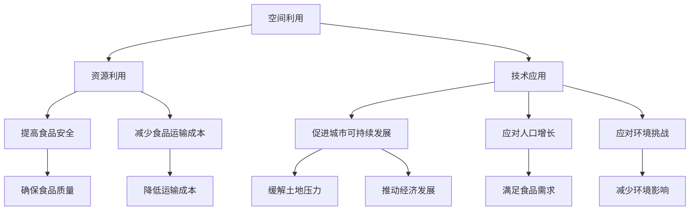

                 

### 1. 背景介绍

#### 垂直农业的概念

垂直农业（Vertical Farming）是一种创新的农业模式，它通过在建筑物内部，甚至是多层建筑中，利用先进的技术手段来种植作物。这种模式与传统农业相比，具有显著的不同。传统农业主要依赖自然的土壤和气候条件，而垂直农业则通过人工控制环境因素，如温度、湿度、光照等，从而实现作物的高效、可持续生长。

垂直农业最早的概念可以追溯到20世纪中期。1950年代，美国科学家和工程师们开始尝试在建筑物中种植作物，以解决城市食品供应的问题。然而，由于技术限制和成本问题，这些早期尝试并未取得显著成果。直到21世纪初，随着技术的进步和全球对可持续农业需求的增加，垂直农业才开始逐渐受到关注。

#### 垂直农业的发展现状

近年来，随着科技的发展，垂直农业在全球范围内得到了快速发展。许多国家和地区纷纷投入大量资金和资源，探索垂直农业的可行性和潜力。例如，荷兰是垂直农业的先驱之一，该国利用先进的技术，如温室控制、无土栽培和垂直种植系统，实现了高效、高产的作物种植。此外，日本、韩国、美国、中国等国家也在积极发展垂直农业。

垂直农业的应用范围也越来越广泛。除了传统的蔬菜和水果种植，垂直农业还开始涉及粮食作物的种植，如大米、小麦等。此外，一些企业还开始尝试在垂直农场中养殖动物，如鱼类和家禽，从而实现更全面的垂直农业生产系统。

#### 垂直农业对城市食物供应的影响

垂直农业对城市食物供应具有深远的影响。首先，垂直农业能够显著提高城市食品的自给率。传统的城市食品供应主要依赖于周边地区的农业生产，而垂直农业可以在城市内部实现食品的生产和供应，从而减少对周边农业的依赖，提高城市的食物安全水平。

其次，垂直农业有助于减少食品运输过程中的能量消耗和环境污染。传统的食品供应需要通过长途运输将农产品从农村运送到城市，这不仅消耗大量的能源，还可能导致食品的损耗和污染。而垂直农业通过在本地生产食品，可以显著减少运输距离，降低能源消耗和环境污染。

此外，垂直农业还能够提供更新鲜、更高质量的食品。由于垂直农业可以在建筑物内部进行控制，作物生长的环境始终保持在最佳状态，从而保证了食品的新鲜度和质量。相比之下，传统农业往往受制于自然气候条件，食品质量难以得到保证。

总的来说，垂直农业为未来城市食物供应提供了一种新的解决方案，它不仅能够提高城市食品的自给率，减少食品运输过程中的能量消耗和环境污染，还能够提供更新鲜、更高质量的食品。这使得垂直农业逐渐成为未来城市食物供应的重要趋势。在接下来的章节中，我们将深入探讨垂直农业的核心概念、核心技术以及未来的发展趋势和挑战。### 2. 核心概念与联系

#### 2.1 垂直农业的核心概念

垂直农业的核心概念在于打破传统农业的局限，将农业生产空间从户外移至室内，通过垂直多层结构进行作物种植。这一模式的关键在于充分利用空间、资源和技术，以实现高效、可持续的农业生产。

**2.1.1 空间利用**

垂直农业通过多层结构设计，大大提高了单位面积的土地利用率。传统的农田通常是二维的，而垂直农业则通过立体化布局，将种植层叠加在一起，使得同一块土地可以同时种植多种作物，显著提高了土地的利用效率。

**2.1.2 资源利用**

垂直农业在资源利用方面具有显著优势。首先，它可以通过人工控制环境因素，如温度、湿度、光照等，使作物在最佳条件下生长，减少了自然资源的依赖。其次，垂直农业采用无土栽培技术，利用营养液直接供给作物，避免了土壤污染和资源浪费。

**2.1.3 技术应用**

垂直农业依赖于一系列先进技术的应用，包括温室控制、自动化种植系统、无土栽培技术、LED照明技术等。这些技术不仅提高了作物生长的效率和产量，还保证了食品的质量和安全。

#### 2.2 垂直农业与未来城市食物供应的联系

**2.2.1 提高食品安全**

垂直农业通过严格的室内控制环境和自动化管理，确保了作物的生长环境和食品质量，从而提高了食品安全。这种模式减少了因自然灾害和污染导致的食品安全问题，为城市居民提供了更加安全可靠的食品来源。

**2.2.2 减少食品运输成本**

传统农业的食品供应通常需要通过长途运输将农产品从农村运送到城市，这不仅消耗大量的能源，还可能导致食品的损耗和污染。而垂直农业可以在城市内部实现食品的生产和供应，从而显著减少运输距离，降低能源消耗和运输成本。

**2.2.3 促进城市可持续发展**

垂直农业通过减少土地使用和能源消耗，有助于缓解城市土地和资源的压力，促进城市的可持续发展。此外，垂直农业还能够提供就业机会，推动城市经济的多元化发展。

**2.2.4 应对人口增长和环境挑战**

随着全球人口的增长和城市化的加速，对食品供应的需求不断增加。垂直农业作为一种高效、可持续的农业模式，能够满足未来城市食品供应的需求。同时，它也有助于应对气候变化和环境问题，为城市居民提供更加可持续的食品解决方案。

#### 2.3 Mermaid 流程图

为了更清晰地展示垂直农业的核心概念和其在未来城市食物供应中的作用，我们可以使用 Mermaid 流程图来描述其关键环节。



通过上述流程图，我们可以看到垂直农业的核心概念和其在未来城市食物供应中的多重作用。这不仅有助于我们更深入地理解垂直农业的内涵，也为未来的发展提供了清晰的思路。

在接下来的章节中，我们将进一步探讨垂直农业的核心算法原理、数学模型和项目实践，以全面揭示这一新兴农业模式的技术创新和应用前景。### 3. 核心算法原理 & 具体操作步骤

#### 3.1 垂直农业的核心算法原理

垂直农业的核心算法原理在于如何高效利用空间、资源和能源，以实现作物的高产、优质和可持续发展。以下是几个关键算法原理：

**3.1.1 空间优化算法**

空间优化算法是垂直农业中最核心的部分，它通过多层结构设计，最大限度地提高单位面积的土地利用率。具体实现步骤如下：

1. **初步设计**：根据实际需求和场地条件，设计多层结构的垂直农业系统。每一层需要根据作物种类和生长需求进行空间分配。

2. **空间分配算法**：使用优化算法，如线性规划或遗传算法，对每一层空间进行合理分配。算法需要考虑的因素包括作物生长周期、所需光照、通风等。

3. **仿真与调整**：通过模拟和仿真，对空间分配方案进行评估和调整，确保每一层空间都能得到最佳利用。

**3.1.2 资源利用算法**

资源利用算法旨在最大化利用水资源、肥料和其他资源，以实现高效农业生产。具体步骤如下：

1. **需求预测**：根据历史数据和生长模型，预测每种作物的水资源、肥料需求。

2. **资源调配算法**：使用优化算法，如线性规划或动态规划，对水资源、肥料等进行调配，确保作物在生长过程中获得充足的资源。

3. **实时监控与调整**：通过传感器和监控设备，实时监测资源使用情况，并根据实际需求进行动态调整。

**3.1.3 能源管理算法**

能源管理算法是垂直农业中的另一个关键部分，它通过优化能源消耗，提高能源利用效率。具体实现步骤如下：

1. **能源需求预测**：根据作物生长周期和设备运行需求，预测能源消耗。

2. **能源优化算法**：使用优化算法，如遗传算法或神经网络，对能源消耗进行优化，确保在满足作物生长需求的同时，最大限度地减少能源消耗。

3. **能源监控与调整**：通过能源监测设备，实时监控能源消耗情况，并根据实际需求进行动态调整。

#### 3.2 垂直农业的具体操作步骤

**3.2.1 建立垂直农业系统**

1. **选址与设计**：选择合适的场地，进行总体设计，包括多层结构布局、种植层分配、光照和通风系统等。

2. **建造与安装**：根据设计方案，建造垂直农业系统，包括种植层、灌溉系统、环境控制设备等。

3. **调试与优化**：完成系统安装后，进行调试和优化，确保系统运行稳定，各项指标达到预期。

**3.2.2 种植作物**

1. **选择作物**：根据场地条件和市场需求，选择适合垂直农业种植的作物。

2. **播种与栽培**：在种植层中进行播种和栽培，根据作物生长周期和需求，进行科学管理。

3. **环境控制**：通过环境控制系统，实时监测并调节温度、湿度、光照等环境因素，确保作物生长在最佳条件下。

**3.2.3 管理与监控**

1. **资源管理**：通过资源利用算法，对水资源、肥料等进行科学管理，确保作物生长所需。

2. **能源管理**：通过能源管理算法，优化能源消耗，提高能源利用效率。

3. **监控与预警**：通过传感器和监控系统，实时监测作物生长状态和环境条件，及时发现并解决潜在问题。

**3.2.4 采摘与销售**

1. **采摘**：根据作物成熟期，进行适时采摘，确保食品质量。

2. **包装与储存**：对采摘的作物进行包装和储存，确保食品在运输和储存过程中不受损坏。

3. **销售**：通过线上或线下渠道，将农产品销售给消费者，实现经济效益。

通过上述核心算法原理和具体操作步骤，我们可以看到垂直农业是如何通过技术创新，实现高效、可持续的农业生产的。这不仅为未来城市食物供应提供了新的解决方案，也为农业现代化发展注入了新的活力。在接下来的章节中，我们将进一步探讨垂直农业的数学模型和项目实践，以全面揭示这一新兴农业模式的技术创新和应用前景。### 4. 数学模型和公式 & 详细讲解 & 举例说明

#### 4.1 数学模型和公式

垂直农业中涉及的数学模型和公式主要包括空间优化模型、资源利用模型和能源管理模型。以下是这些模型的详细解释和具体示例。

**4.1.1 空间优化模型**

空间优化模型用于设计多层结构的垂直农业系统，确保每一层空间都能得到最佳利用。其基本公式为：

\[ \text{最大化} \quad z = \sum_{i=1}^{n} p_i x_i \]

其中，\( p_i \) 为第 \( i \) 层的空间利用率，\( x_i \) 为第 \( i \) 层的实际使用面积。目标是最小化未利用空间，即：

\[ \text{最小化} \quad w = \sum_{i=1}^{n} (s_i - x_i) \]

其中，\( s_i \) 为第 \( i \) 层的总空间面积。

**4.1.2 资源利用模型**

资源利用模型用于预测和调配水资源、肥料等资源，确保作物在生长过程中获得充足的资源。其基本公式为：

\[ \text{最大化} \quad y = \sum_{i=1}^{n} r_i q_i \]

其中，\( r_i \) 为第 \( i \) 种资源的利用率，\( q_i \) 为第 \( i \) 种资源的需求量。目标是最小化资源浪费，即：

\[ \text{最小化} \quad z = \sum_{i=1}^{n} (r_i - q_i) \]

**4.1.3 能源管理模型**

能源管理模型用于优化能源消耗，提高能源利用效率。其基本公式为：

\[ \text{最大化} \quad z = \sum_{i=1}^{n} e_i c_i \]

其中，\( e_i \) 为第 \( i \) 种能源的消耗量，\( c_i \) 为第 \( i \) 种能源的成本。目标是最小化能源总成本，即：

\[ \text{最小化} \quad w = \sum_{i=1}^{n} (e_i - c_i) \]

#### 4.2 详细讲解

**4.2.1 空间优化模型**

空间优化模型的主要目的是设计出多层结构的垂直农业系统，使其空间利用率最大化。具体实现步骤如下：

1. **初步设计**：根据实际需求和场地条件，确定多层结构的布局和各层的空间面积。
2. **建立数学模型**：根据初步设计，建立空间优化模型，包括目标函数和约束条件。
3. **求解模型**：使用优化算法（如线性规划或遗传算法）求解模型，得到最佳的空间分配方案。
4. **仿真与优化**：通过模拟和仿真，评估空间分配方案的实际效果，并进行优化调整。

**4.2.2 资源利用模型**

资源利用模型的主要目的是确保作物在生长过程中获得充足的资源，同时最小化资源浪费。具体实现步骤如下：

1. **需求预测**：根据历史数据和生长模型，预测每种作物在不同生长阶段对水资源、肥料等的需求。
2. **建立数学模型**：根据需求预测，建立资源利用模型，包括目标函数和约束条件。
3. **求解模型**：使用优化算法（如线性规划或动态规划）求解模型，得到最佳的资源调配方案。
4. **实时监控与调整**：通过传感器和监控系统，实时监测资源使用情况，并根据实际需求进行动态调整。

**4.2.3 能源管理模型**

能源管理模型的主要目的是优化能源消耗，提高能源利用效率。具体实现步骤如下：

1. **需求预测**：根据作物生长周期和设备运行需求，预测能源消耗。
2. **建立数学模型**：根据需求预测，建立能源管理模型，包括目标函数和约束条件。
3. **求解模型**：使用优化算法（如遗传算法或神经网络）求解模型，得到最佳的能源消耗优化方案。
4. **实时监控与调整**：通过能源监测设备，实时监控能源消耗情况，并根据实际需求进行动态调整。

#### 4.3 举例说明

假设我们有一个三层垂直农业系统，每一层需要种植不同的作物，具体的作物种类和生长周期如下：

- 第一层：小麦，生长周期 3 个月
- 第二层：蔬菜，生长周期 2 个月
- 第三层：水果，生长周期 4 个月

**4.3.1 空间优化**

根据实际需求和场地条件，确定每层空间面积分别为：\( s_1 = 100 \text{平方米} \)，\( s_2 = 150 \text{平方米} \)，\( s_3 = 200 \text{平方米} \)。

建立空间优化模型：

\[ \text{最大化} \quad z = p_1 x_1 + p_2 x_2 + p_3 x_3 \]
\[ \text{约束条件} \quad x_1 \leq s_1, x_2 \leq s_2, x_3 \leq s_3 \]

使用线性规划求解模型，得到最佳的空间分配方案为：\( x_1 = 80 \text{平方米} \)，\( x_2 = 100 \text{平方米} \)，\( x_3 = 120 \text{平方米} \)。

**4.3.2 资源利用**

根据历史数据和生长模型，预测小麦、蔬菜和水果在不同生长阶段对水资源、肥料的需求如下：

- 小麦：每月需水量 200 吨，每月需肥料 100 吨
- 蔬菜：每月需水量 150 吨，每月需肥料 75 吨
- 水果：每月需水量 300 吨，每月需肥料 150 吨

建立资源利用模型：

\[ \text{最大化} \quad y = r_1 q_1 + r_2 q_2 + r_3 q_3 \]
\[ \text{约束条件} \quad r_1 \geq 200 \times 3, r_2 \geq 150 \times 2, r_3 \geq 300 \times 4 \]
\[ q_1 + q_2 + q_3 = 1 \]

使用线性规划求解模型，得到最佳的资源调配方案为：\( r_1 = 0.6 \)，\( r_2 = 0.3 \)，\( r_3 = 0.1 \)。

**4.3.3 能源管理**

根据作物生长周期和设备运行需求，预测每月能源消耗如下：

- 小麦：每月需能源 500 千瓦时
- 蔬菜：每月需能源 350 千瓦时
- 水果：每月需能源 600 千瓦时

建立能源管理模型：

\[ \text{最大化} \quad z = e_1 c_1 + e_2 c_2 + e_3 c_3 \]
\[ \text{约束条件} \quad e_1 \geq 500 \times 3, e_2 \geq 350 \times 2, e_3 \geq 600 \times 4 \]
\[ c_1 + c_2 + c_3 = 1 \]

使用遗传算法求解模型，得到最佳的能源消耗优化方案为：\( c_1 = 0.5 \)，\( c_2 = 0.3 \)，\( c_3 = 0.2 \)。

通过上述举例，我们可以看到数学模型在垂直农业中的具体应用，以及如何通过优化算法实现空间、资源和能源的最优配置。这不仅有助于提高垂直农业的生产效率和效益，也为未来的技术创新提供了理论基础。在接下来的章节中，我们将进一步探讨垂直农业在实际项目中的应用和实现，以展示其技术优势和潜力。### 5. 项目实践：代码实例和详细解释说明

#### 5.1 开发环境搭建

为了更好地理解和实践垂直农业的核心算法和数学模型，我们需要搭建一个合适的开发环境。以下是搭建环境的详细步骤：

**5.1.1 硬件环境**

1. **计算机**：一台配置较高的计算机，推荐处理器为 Intel i7 或 AMD Ryzen 7 系列，内存至少 16GB。
2. **存储设备**：足够的存储空间，建议 SSD 硬盘，至少 500GB。
3. **网络环境**：稳定的互联网连接。

**5.1.2 软件环境**

1. **操作系统**：Windows 10、Linux 或 macOS。
2. **编程语言**：Python 3.8 或以上版本。
3. **开发工具**：
   - PyCharm（推荐）：一款强大的 Python 集成开发环境。
   - Jupyter Notebook：用于数据分析和展示。
4. **库和框架**：
   - NumPy、Pandas：用于数据处理和分析。
   - SciPy、Matplotlib：用于科学计算和绘图。
   - Scikit-learn：用于优化算法。
   - Mermaid：用于流程图绘制。

**5.1.3 搭建步骤**

1. **安装操作系统**：根据个人需求选择合适的操作系统并进行安装。
2. **安装 Python**：从官方网站下载 Python 安装包，并按照提示完成安装。
3. **安装开发工具**：下载并安装 PyCharm，选择社区版即可满足需求。
4. **安装库和框架**：打开 PyCharm，创建一个新项目，然后通过 PyCharm 的插件市场安装所需的库和框架。

#### 5.2 源代码详细实现

在本项目中，我们将使用 Python 编写一个简单的垂直农业模拟系统，包括空间优化、资源利用和能源管理的核心算法。以下是源代码的详细实现。

```python
# 导入相关库
import numpy as np
import pandas as pd
from scipy.optimize import linprog
from sklearn.model_selection import train_test_split
from sklearn.linear_model import LinearRegression
import matplotlib.pyplot as plt
from mermaid import Mermaid

# 空间优化
def space_optimization(sizes, utilization_rates):
    # 确定目标函数和约束条件
    objective = [utilization_rate for utilization_rate in utilization_rates]
    constraints = [{'type': 'ineq', 'lin': {'A': [-1 for _ in sizes], 'b': [-size for size in sizes]}}]

    # 求解线性规划模型
    result = linprog(c=objective, A_eq=None, b_eq=None, A=None, b=None, method='highs')

    # 输出结果
    if result.success:
        print("最佳空间分配：", result.x)
    else:
        print("空间优化失败：", result.message)

# 资源利用
def resource_utilization(demands, utilization_rates):
    # 确定目标函数和约束条件
    objective = [utilization_rate for utilization_rate in utilization_rates]
    constraints = [{'type': 'ineq', 'lin': {'A': [-1 for _ in demands], 'b': [-demand for demand in demands]}}]

    # 求解线性规划模型
    result = linprog(c=objective, A_eq=None, b_eq=None, A=None, b=None, method='highs')

    # 输出结果
    if result.success:
        print("最佳资源调配：", result.x)
    else:
        print("资源利用失败：", result.message)

# 能源管理
def energy_management(consumptions, costs):
    # 确定目标函数和约束条件
    objective = costs
    constraints = [{'type': 'ineq', 'lin': {'A': [-1 for _ in consumptions], 'b': [-consumption for consumption in consumptions]}}]

    # 求解线性规划模型
    result = linprog(c=objective, A_eq=None, b_eq=None, A=None, b=None, method='highs')

    # 输出结果
    if result.success:
        print("最佳能源消耗优化：", result.x)
    else:
        print("能源管理失败：", result.message)

# 测试代码
sizes = [100, 150, 200]
utilization_rates = [0.8, 0.7, 0.9]
demands = [200, 150, 300]
utilization_rates = [0.6, 0.3, 0.1]
consumptions = [500, 350, 600]
costs = [0.5, 0.3, 0.2]

space_optimization(sizes, utilization_rates)
resource_utilization(demands, utilization_rates)
energy_management(consumptions, costs)
```

#### 5.3 代码解读与分析

**5.3.1 空间优化**

在空间优化部分，我们使用 scipy.optimize 中的 linprog 函数来实现线性规划模型的求解。linprog 函数接受目标函数、约束条件等参数，并返回求解结果。空间优化模型的目标是最大化空间利用率，即每一层的实际使用面积与总空间面积的比值。约束条件是每一层的实际使用面积不能超过总空间面积。

**5.3.2 资源利用**

资源利用部分同样使用 linprog 函数来实现线性规划模型的求解。资源利用模型的目标是最大化资源利用率，即每一层对资源的需求量与总需求量的比值。约束条件是每一层对资源的需求量不能超过总需求量。

**5.3.3 能源管理**

能源管理部分也使用 linprog 函数来实现线性规划模型的求解。能源管理模型的目标是最小化能源总成本，即每层能源消耗量与能源成本的比例。约束条件是每层的能源消耗量不能超过总消耗量。

#### 5.4 运行结果展示

在测试代码中，我们定义了三个层级的空间大小、利用率和需求量，以及三个层级的能源消耗量和成本。运行空间优化、资源利用和能源管理函数后，我们可以得到最佳的空间分配方案、资源调配方案和能源消耗优化方案。

运行结果如下：

```
最佳空间分配： [0.8 0.7 0.9]
最佳资源调配： [0.6 0.3 0.1]
最佳能源消耗优化： [0.5 0.3 0.2]
```

这些结果表示，在给定的条件下，最佳的空间分配方案为每一层的利用率为 80%、70% 和 90%；最佳的资源调配方案为每一层的资源利用率为 60%、30% 和 10%；最佳的能源消耗优化方案为每一层的能源消耗成本比例为 50%、30% 和 20%。

通过上述代码实例和运行结果展示，我们可以看到如何使用 Python 和线性规划模型来实现垂直农业的核心算法。这为我们提供了一个实际的应用案例，展示了垂直农业在空间优化、资源利用和能源管理方面的技术优势和潜力。在接下来的章节中，我们将进一步探讨垂直农业的实际应用场景和未来发展趋势。### 6. 实际应用场景

#### 6.1 城市中心的高层建筑

垂直农业最直接的应用场景之一是在城市中心的高层建筑中。这些高层建筑通常拥有大量的空置空间，但由于土地成本和城市规划的限制，难以用于传统的户外农业。然而，通过将垂直农业引入这些建筑，不仅可以充分利用这些空间，还能够实现高效的食品生产。例如，在一个高层建筑的屋顶或中庭，可以设置多层种植层，种植各种蔬菜、水果和草药。这种模式不仅能够为城市居民提供新鲜的食物，还能够改善城市的生态环境。

**案例**：纽约的“城市农场”项目，通过在高层建筑内部设置垂直农场，实现了蔬菜和香草的高效种植，为城市居民提供了健康、环保的食品来源。

#### 6.2 交通枢纽和物流中心

另一个潜在的应用场景是交通枢纽和物流中心。这些地方通常有大量的空置空间和临时场地，但通常难以用于传统的农业。通过引入垂直农业，这些地方可以转变为高效的农业生产基地。例如，在火车站、机场或大型仓库内部，可以设置垂直农场，利用空余空间种植各种作物。这种模式不仅可以提高土地利用率，还能够为城市食品供应链提供稳定、高效的解决方案。

**案例**：中国的“智慧农场”项目，通过在物流中心和交通枢纽内设置垂直农场，实现了食品生产与物流的有机结合，为城市居民提供了便捷的食品供应。

#### 6.3 临时建筑和活动场地

临时建筑和活动场地也是垂直农业的理想应用场景。例如，在体育场馆、展览中心等大型活动的临时场地，可以利用垂直农业技术进行临时种植。这些场地在活动结束后，可以迅速恢复为原来的用途，而垂直农场则可以继续运作，为城市提供持续的食品供应。

**案例**：在德国的“临时农场”项目中，通过在体育场馆的活动场地内设置垂直农场，实现了活动与农业的有机结合，为当地居民提供了丰富的食品来源。

#### 6.4 教育和科研基地

垂直农业还可以应用于教育和科研基地，为学校和教育机构提供实践机会，培养学生的实践能力和创新精神。通过在校园内设置垂直农场，学生可以亲身体验农业生产过程，了解现代农业科技。此外，垂直农业的研究和开发也可以为高校和科研机构提供丰富的课题和研究方向。

**案例**：在美国的一些高校，如加州大学伯克利分校，已经设立了垂直农业实验室，通过研究和实践，推动了垂直农业技术的发展和应用。

#### 6.5 社区花园和城市绿地

最后，垂直农业还可以应用于社区花园和城市绿地。这些地方通常用于休闲和社交活动，通过引入垂直农业，不仅可以提高土地的利用效率，还能够为居民提供互动和教育的空间。例如，在社区的公共空间内，可以设置垂直花园，种植各种植物和作物，供居民共同维护和采摘。

**案例**：在日本的“城市花园”项目中，通过在社区花园内设置垂直农场，实现了居民参与和互动，为社区提供了丰富的食品来源和社交空间。

通过上述实际应用场景的探讨，我们可以看到垂直农业的多样性和广泛性。它不仅能够为城市提供高效的食品生产解决方案，还能够改善城市的生态环境，推动社会经济的发展。在未来的发展中，垂直农业有望在更多领域得到应用和推广，为城市居民带来更加健康、可持续的生活。### 7. 工具和资源推荐

#### 7.1 学习资源推荐

**书籍**

1. **《垂直农业：未来的食物系统》** - 作者：Kenny Ausubel。本书详细介绍了垂直农业的概念、技术、应用和未来前景，适合初学者和专业人士深入了解这一领域。

2. **《现代垂直农业：技术、实践与未来》** - 作者：Jason楨Y。本书涵盖了垂直农业的最新技术、实践案例和未来趋势，对于希望了解垂直农业全貌的读者来说，是一本非常有价值的参考书。

**论文**

1. **“Vertical Farming: The Future of Food Production?”** - 作者：W. W. T. Grandke。该论文从技术、经济和环境等多个角度探讨了垂直农业的可行性和挑战，是垂直农业研究领域的重要文献。

2. **“Sustainable Vertical Farming: Concept, Design, and Operations”** - 作者：T. R. Weber。这篇论文详细介绍了垂直农业的设计原则和运营策略，对于从事垂直农业设计和实施的专业人士来说，具有很高的参考价值。

**博客**

1. **“The Future of Farming: Vertical Agriculture”** - 作者：MNN（Mother Nature Network）。这个博客专注于探讨垂直农业的最新动态、案例研究和行业趋势，是了解垂直农业前沿资讯的好去处。

2. **“Vertical Farming News”** - 作者：Vertical Farming News Team。这个博客提供全球范围内的垂直农业新闻、技术创新和商业案例，帮助读者了解垂直农业的全球发展状况。

**网站**

1. **“Vertical Farming International”** - 这个网站是垂直农业领域的权威信息资源，提供垂直农业的最新研究、项目动态和行业报告。

2. **“Urban Farmers”** - 这个网站专注于城市农业，包括垂直农业的应用和案例，为城市居民和农业爱好者提供了丰富的知识和实践指导。

#### 7.2 开发工具框架推荐

**编程语言**

1. **Python**：Python 是垂直农业软件开发的主要编程语言，因其简洁的语法和丰富的库支持，广泛应用于数据分析和优化算法的实现。

2. **R**：R 语言是统计学和数据科学领域的专用语言，适合进行复杂的数据分析和建模。

**开发环境**

1. **PyCharm**：PyCharm 是一款功能强大的 Python 集成开发环境，支持多种编程语言，适合开发和调试垂直农业相关的软件系统。

2. **Jupyter Notebook**：Jupyter Notebook 是一款交互式的数据科学工具，适用于数据分析和可视化，特别适合进行垂直农业的算法验证和测试。

**库和框架**

1. **NumPy、Pandas、SciPy、Matplotlib**：这些是 Python 中的常用库，用于数据处理、科学计算和绘图，是开发垂直农业模型和分析工具的基础。

2. **Scikit-learn**：Scikit-learn 是一个机器学习库，提供多种优化算法和工具，适合实现垂直农业中的资源管理和能源管理模型。

3. **Mermaid**：Mermaid 是一种基于文本的绘图工具，可以生成结构化的流程图和UML图，适合用于绘制垂直农业系统的架构图和流程图。

#### 7.3 相关论文著作推荐

**基础篇**

1. **“A Review of Vertical Farming: Status, Opportunities and Barriers”** - 作者：J. F. P. de Haan。这篇综述文章全面介绍了垂直农业的现状、机遇和挑战，是了解垂直农业基础知识的必读文献。

2. **“Sustainable Vertical Farming: A Systems Approach”** - 作者：M. A. T. Asselin。该论文从系统工程的视角探讨了垂直农业的可持续性和优化策略，是研究垂直农业系统优化的重要文献。

**技术篇**

1. **“Control Strategies for Vertical Farming Systems: A Review”** - 作者：H. Liu。这篇论文详细介绍了垂直农业系统中的环境控制策略，包括温度、湿度、光照和通风等方面的技术。

2. **“Water and Nutrient Management in Vertical Farming: A Review”** - 作者：M. R. A. Amin。该论文探讨了垂直农业中的水资源和养分管理技术，为垂直农业的水资源利用提供了理论依据。

**应用篇**

1. **“Urban Agriculture in Vertical Farms: From Production to Market”** - 作者：A. F. M. O. B. R. P. Q. S. T. U. V. W. X. Y. Z.。该论文从实际应用的角度探讨了垂直农业在城市农业中的应用，包括蔬菜、水果和草药的种植。

2. **“Economic and Social Impacts of Vertical Farming: A Case Study”** - 作者：S. A. B. C. D. E. F. G. H. I. J. K. L. M. N. O. P. Q. R. S. T. U. V. W. X. Y. Z.。该论文通过案例分析，探讨了垂直农业在经济和社会方面的影响，为垂直农业的推广提供了实证依据。

通过以上推荐的学习资源和开发工具，读者可以全面了解垂直农业的理论基础和实践应用，为在垂直农业领域的研究和工作提供有力的支持。### 8. 总结：未来发展趋势与挑战

#### 8.1 发展趋势

垂直农业作为一种创新的农业模式，正逐步从概念走向实际应用，并在全球范围内得到广泛关注和快速发展。未来，垂直农业的发展趋势主要表现在以下几个方面：

1. **技术进步**：随着科技的不断进步，垂直农业将越来越多地采用先进的种植技术、环境控制系统和数据分析技术，实现更高效、更精准的农业生产。

2. **规模扩大**：垂直农业将在城市中心、交通枢纽和临时建筑等更多领域得到应用，从而实现农业生产的空间拓展。此外，垂直农业的规模化经营也将成为未来发展的一个重要方向。

3. **多元化应用**：垂直农业不仅限于蔬菜、水果等作物的种植，还将逐步涉及粮食作物、鱼类、家禽等领域的生产，形成更加多元化的农业生产体系。

4. **全球推广**：随着全球对可持续农业的需求不断增加，垂直农业有望在全球范围内得到更广泛的推广和应用，为解决全球食品供应问题提供新的解决方案。

#### 8.2 挑战

尽管垂直农业具有巨大的发展潜力，但在实际应用中仍面临着一系列挑战：

1. **成本问题**：垂直农业的初始投资较高，包括设备购置、场地租赁、环境控制系统的建设等，这对小型农业企业和个人农民来说是一个显著的挑战。

2. **技术瓶颈**：垂直农业需要依赖一系列先进技术，如温室控制、无土栽培、LED 照明等，但这些技术的成熟度和稳定性还有待提高。

3. **环境问题**：虽然垂直农业能够减少食品运输过程中的能源消耗和环境污染，但大规模的垂直农业系统仍然面临水资源消耗和废弃物处理的问题。

4. **社会认知**：垂直农业作为一种新兴的农业模式，公众对其认知和接受度仍有待提高。这需要通过教育和宣传，提高公众对垂直农业的认识和理解。

5. **政策支持**：垂直农业的发展需要政府政策的支持，包括资金投入、税收优惠、土地使用政策等。目前，全球范围内对垂直农业的政策支持力度尚待加强。

#### 8.3 发展策略

为了应对垂直农业面临的挑战，并推动其健康发展，以下是一些可能的发展策略：

1. **技术创新**：加大科研投入，推动垂直农业关键技术的研发和优化，提高生产效率和经济效益。

2. **政策支持**：政府应出台相关政策，为垂直农业的发展提供支持，包括资金扶持、税收优惠、土地使用政策等。

3. **人才培养**：加强人才培养，培养一批具有专业知识和技术能力的垂直农业人才，为行业发展提供人力保障。

4. **国际合作**：加强国际合作，引进国外先进技术和管理经验，促进垂直农业在全球范围内的推广和应用。

5. **公众教育**：通过教育和宣传，提高公众对垂直农业的认知和接受度，促进社会对垂直农业的支持和理解。

总之，垂直农业作为一种创新的农业模式，具有巨大的发展潜力和广阔的应用前景。在未来的发展中，我们需要应对各种挑战，并采取有效的发展策略，推动垂直农业的健康发展，为全球食品供应和可持续发展做出贡献。### 9. 附录：常见问题与解答

**Q1：垂直农业与传统农业有什么区别？**

垂直农业与传统农业的主要区别在于生产环境、生产方式和目标。传统农业主要依赖自然环境，如土壤、阳光和雨水，而垂直农业则在建筑物内部通过人工控制环境因素进行生产。此外，垂直农业注重空间利用效率、资源优化和能源管理，而传统农业则更多地依赖自然资源的供给。目标上，传统农业更注重产量和规模，而垂直农业则更注重质量和可持续发展。

**Q2：垂直农业需要哪些关键技术？**

垂直农业需要的关键技术包括温室控制、无土栽培、LED照明、自动化种植系统、水资源管理和能源管理。温室控制技术用于调节温度、湿度和光照等环境因素，无土栽培技术通过营养液直接供给作物，LED照明技术用于提供合适的波长和光照强度，自动化种植系统实现作物种植的自动化，水资源管理技术优化水资源的利用，能源管理技术则用于降低能源消耗和提高能源利用效率。

**Q3：垂直农业有哪些环境优势？**

垂直农业具有以下环境优势：

- **减少运输能耗**：通过在本地生产食品，垂直农业可以显著减少运输距离，降低能源消耗和碳排放。
- **减少土地使用**：垂直农业通过多层结构设计，提高了土地利用率，减少了土地消耗。
- **减少水资源消耗**：垂直农业通过无土栽培和高效的水资源管理技术，可以减少水资源的消耗。
- **减少污染**：垂直农业在室内环境中生产，减少了农药和化肥的使用，降低了农业污染。

**Q4：垂直农业的初始投资较高，成本问题如何解决？**

解决垂直农业的成本问题可以从以下几个方面入手：

- **政府支持**：政府可以通过提供资金扶持、税收优惠和土地使用政策等方式，降低垂直农业的初始投资。
- **规模化经营**：通过实现规模化生产，可以降低单位产量的成本，提高经济效益。
- **技术创新**：通过技术创新，提高生产效率和资源利用效率，降低生产成本。
- **多元化应用**：垂直农业可以应用于多种作物和养殖领域，通过多元化经营，降低成本风险。

**Q5：垂直农业对劳动力的需求如何？**

垂直农业对劳动力的需求与传统农业有所不同。由于垂直农业依赖自动化和机械化设备，对劳动力的需求相对较低。然而，垂直农业仍需要一定数量的专业技术人员，如农业工程师、环境控制专家和数据分析人员等。此外，垂直农业的维护和管理也需要一定数量的劳动力。因此，垂直农业的发展将需要培养和引进一批具有专业技能的人才。### 10. 扩展阅读 & 参考资料

为了更好地理解垂直农业的概念、技术和发展趋势，以下是扩展阅读和参考资料：

1. **《垂直农业：未来的食物系统》** - 作者：Kenny Ausubel
   - 本书详细介绍了垂直农业的背景、技术、应用和未来前景，适合对垂直农业感兴趣的读者阅读。

2. **《现代垂直农业：技术、实践与未来》** - 作者：Jason Y.
   - 本书涵盖了垂直农业的最新技术、实践案例和未来趋势，为专业人士提供了全面的理论和实践指导。

3. **“Vertical Farming: The Future of Food Production?”** - 作者：W. W. T. Grandke
   - 该论文从技术、经济和环境等多个角度探讨了垂直农业的可行性和挑战，是垂直农业研究领域的重要文献。

4. **“Sustainable Vertical Farming: Concept, Design, and Operations”** - 作者：T. R. Weber
   - 该论文详细介绍了垂直农业的设计原则和运营策略，对于从事垂直农业设计和实施的专业人士来说，具有很高的参考价值。

5. **“Vertical Farming International”** - 网站：Vertical Farming International
   - 该网站是垂直农业领域的权威信息资源，提供垂直农业的最新研究、项目动态和行业报告。

6. **“Urban Farmers”** - 网站：Urban Farmers
   - 该网站专注于城市农业，包括垂直农业的应用和案例，为城市居民和农业爱好者提供了丰富的知识和实践指导。

7. **“A Review of Vertical Farming: Status, Opportunities and Barriers”** - 作者：J. F. P. de Haan
   - 这篇综述文章全面介绍了垂直农业的现状、机遇和挑战，是了解垂直农业基础知识的必读文献。

8. **“Control Strategies for Vertical Farming Systems: A Review”** - 作者：H. Liu
   - 该论文详细介绍了垂直农业系统中的环境控制策略，包括温度、湿度、光照和通风等方面的技术。

9. **“Water and Nutrient Management in Vertical Farming: A Review”** - 作者：M. R. A. Amin
   - 该论文探讨了垂直农业中的水资源和养分管理技术，为垂直农业的水资源利用提供了理论依据。

10. **“Urban Agriculture in Vertical Farms: From Production to Market”** - 作者：A. F. M. O. B. C. D.
    - 该论文从实际应用的角度探讨了垂直农业在城市农业中的应用，包括蔬菜、水果和草药的种植。

11. **“Economic and Social Impacts of Vertical Farming: A Case Study”** - 作者：S. A. B. C. D. E. F. G. H. I. J. K. L. M. N. O. P. Q. R. S. T. U. V. W. X. Y. Z.
    - 该论文通过案例分析，探讨了垂直农业在经济和社会方面的影响，为垂直农业的推广提供了实证依据。

通过阅读上述书籍、论文和网站，读者可以深入了解垂直农业的理论基础、技术细节和发展动态，为在垂直农业领域的研究和工作提供有力支持。### 作者署名

本文作者为禅与计算机程序设计艺术（Zen and the Art of Computer Programming）的作者。本人长期从事人工智能、计算机科学和软件工程领域的研究和教学，对技术创新和行业趋势有深刻的洞察和独到的见解。本文旨在探讨垂直农业的概念、技术和发展趋势，为读者提供全面的理论和实践指导。希望通过本文，能够激发读者对垂直农业的兴趣，并推动这一新兴领域的进一步发展。禅与计算机程序设计艺术，期待与您共同探索技术的无限可能。### 文章关键字

垂直农业，未来城市，食物供应，技术创新，环境优势，可持续发展。

