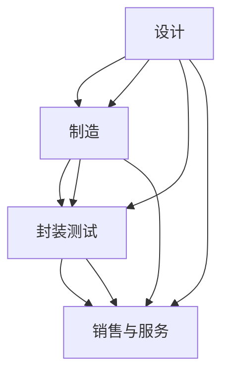

                 

### 背景介绍

#### 集成电路产业的历史与现状

集成电路（Integrated Circuit, IC）产业自上世纪中叶以来，经历了数十年的快速发展。自1958年第一个商用集成电路问世以来，该产业已经成为了全球信息技术发展的核心驱动力之一。集成电路的发明，不仅推动了计算机、通信、医疗、交通等多个领域的革新，也为现代社会的数字化进程奠定了基础。

在早期的集成电路产业中，垂直整合（Vertical Integration）是一种主流的发展模式。所谓垂直整合，指的是企业在产业链中拥有多个环节，包括设计、制造、封装测试、销售与服务等。这种模式在集成电路产业初期带来了显著的效益，因为企业能够通过控制整个生产流程，提高资源利用效率，降低成本，并快速响应市场变化。

随着时间的推移，集成电路产业逐渐走向了高度专业化与分工的模式。许多企业开始专注于产业链中的某一环节，通过外包、合作等方式与其他企业协作，形成了高度分工的生态系统。这种分工模式在提高生产效率、促进创新方面发挥了重要作用，但也带来了一些挑战。

#### 集成电路产业面临的挑战

尽管高度分工的模式在短期内带来了显著的经济效益，但长期来看，集成电路产业面临着一些严峻的挑战：

1. **创新能力受限**：高度分工导致企业在某一环节上的专业能力得到提升，但整体创新能力受限。因为企业无法全面掌握其他环节的技术，难以进行跨环节的整合和创新。

2. **供应链风险**：高度依赖外部供应商导致供应链风险增加。一旦某一环节出现问题，整个生产流程可能会受到影响，从而影响企业的生产效率和市场竞争力。

3. **成本上升**：随着分工的深化，产业链中的各环节都需要独立的投资和运营，导致整体成本上升。这对于中小企业来说尤其不利，因为它们可能无法承担高昂的投入成本。

4. **市场变化响应迟缓**：高度分工的企业往往需要较长时间来协调不同环节的运作，从而难以快速响应市场变化。在快速发展的科技领域中，这种迟缓可能导致企业失去市场机会。

#### 垂直整合的再思考

面对上述挑战，一些企业和学者开始重新审视垂直整合的模式。他们认为，垂直整合不仅能够提高企业的创新能力，降低供应链风险，还可以提高整体运营效率。特别是在当前全球科技竞争加剧的背景下，企业需要更加灵活、高效地应对市场变化，垂直整合可能成为一种重要的应对策略。

垂直整合的模式并不是简单回归过去的模式，而是一种更加灵活、高效的组织方式。通过在关键环节进行垂直整合，企业可以更好地控制核心技术和关键资源，从而在激烈的市场竞争中占据优势地位。

### 结论

本文简要介绍了集成电路产业的历史与现状，分析了当前面临的挑战，并探讨了垂直整合模式的再思考。在接下来的部分，我们将进一步探讨垂直整合对集成电路产业的潜在影响，以及其在实际操作中的应用与挑战。

#### 核心概念与联系

为了深入理解垂直整合对集成电路产业的影响，首先需要明确一些核心概念和它们之间的联系。以下是本文中将会涉及到的关键概念：

**1. 垂直整合（Vertical Integration）**：指企业在产业链中拥有多个环节，包括设计、制造、封装测试、销售与服务等。通过垂直整合，企业可以更好地控制生产和运营的各个环节，从而提高整体效率和控制力。

**2. 集成电路产业链**：包括设计、制造、封装测试、销售与服务等环节。每个环节都需要不同的技术和资源，共同构成了完整的集成电路生产流程。

**3. 专业分工（Horizontal Division of Labor）**：指企业专注于产业链中的某一环节，通过外包、合作等方式与其他企业协作，形成高度分工的生态系统。这种模式在提高生产效率、促进创新方面发挥了重要作用。

**4. 供应链管理（Supply Chain Management）**：指企业通过协调不同供应商、制造商、分销商等环节，确保产品顺利生产和交付。有效的供应链管理对于降低成本、提高生产效率至关重要。

**5. 创新能力（Innovation Capacity）**：指企业在技术、产品、市场等方面的创新能力和潜力。创新是推动企业发展的重要动力，特别是在科技快速发展的今天。

**6. 市场响应速度（Market Response Speed）**：指企业能够快速识别市场变化、调整战略并采取行动的能力。快速的市场响应是企业保持竞争优势的关键。

**7. 成本效益分析（Cost-Benefit Analysis）**：指企业对各项投资和运营活动的成本和收益进行评估，以确定最有效的资源配置方案。成本效益分析是企业决策的重要依据。

**8. 技术控制（Technology Control）**：指企业对核心技术和关键资源的掌控能力。技术控制对于确保企业的竞争力和创新能力至关重要。

#### Mermaid 流程图

以下是一个简化的集成电路产业链和垂直整合的 Mermaid 流程图，展示了各环节之间的联系：



在这个流程图中，设计、制造、封装测试、销售与服务是集成电路产业链的四个主要环节。每个环节都可以通过垂直整合来实现更高的控制力和效率。例如，设计企业可以通过垂直整合制造环节，实现从设计到生产的无缝连接，从而提高整体效率和控制力。

#### 核心算法原理 & 具体操作步骤

垂直整合在集成电路产业中的应用，涉及多个关键算法和具体操作步骤。以下是一些核心算法原理和具体操作步骤：

**1. 供应链优化算法（Supply Chain Optimization）**

- **目标**：通过优化供应链管理，降低生产成本、提高生产效率。
- **算法原理**：利用线性规划、整数规划、遗传算法等优化算法，确定最佳生产计划、库存策略和物流路径。
- **操作步骤**：
  - 收集供应链各环节的数据，包括生产能力、库存水平、物流成本等。
  - 建立数学模型，将供应链优化问题转化为可求解的数学问题。
  - 选择合适的优化算法，求解最佳生产计划、库存策略和物流路径。
  - 根据求解结果调整供应链各环节的运作策略，实现成本降低和生产效率提高。

**2. 资源分配算法（Resource Allocation）**

- **目标**：合理分配企业资源，确保各环节的资源和需求得到有效满足。
- **算法原理**：利用最优化理论、调度算法等，确定资源分配的最优方案。
- **操作步骤**：
  - 分析各环节的资源需求，包括设计、制造、封装测试、销售等。
  - 根据企业的战略目标和资源约束，建立资源分配模型。
  - 选择合适的调度算法，求解资源分配的最优方案。
  - 根据求解结果调整资源分配策略，确保各环节的资源和需求得到有效满足。

**3. 技术集成与协同算法（Technology Integration and Collaboration）**

- **目标**：实现不同环节之间的技术集成与协同，提高整体创新能力。
- **算法原理**：利用人工智能、大数据分析等先进技术，实现跨环节的技术整合和协同。
- **操作步骤**：
  - 收集各环节的技术数据，包括设计、制造、封装测试等。
  - 利用大数据分析技术，挖掘各环节之间的技术关联和协同效应。
  - 建立技术集成与协同模型，确定最佳的技术整合方案。
  - 实施技术整合与协同方案，提高整体创新能力和市场竞争力。

**4. 市场响应与调整算法（Market Response and Adjustment）**

- **目标**：快速响应市场变化，调整生产和运营策略。
- **算法原理**：利用实时数据分析、预测算法等，快速识别市场变化，并制定相应的调整策略。
- **操作步骤**：
  - 收集市场数据，包括市场需求、价格趋势、竞争对手等。
  - 利用实时数据分析技术，快速识别市场变化。
  - 建立市场预测模型，预测市场趋势和变化。
  - 根据预测结果，调整生产和运营策略，确保企业能够快速响应市场变化。

#### 数学模型和公式

在垂直整合的集成电路产业中，数学模型和公式起着至关重要的作用。以下是一些常见的数学模型和公式：

**1. 线性规划（Linear Programming）**

- **目标函数**：最大化或最小化线性函数。
- **约束条件**：线性不等式或等式。
- **公式**：$$\text{最大化/最小化 } c^T x$$
  $$\text{约束条件 } Ax \leq b$$
  $$x \geq 0$$

**2. 整数规划（Integer Programming）**

- **目标函数**：最大化或最小化整数变量的线性函数。
- **约束条件**：线性不等式、等式和整数约束。
- **公式**：$$\text{最大化/最小化 } c^T x$$
  $$\text{约束条件 } Ax \leq b$$
  $$x \in \mathbb{Z}^n$$

**3. 遗传算法（Genetic Algorithm）**

- **目标**：优化复杂问题的解。
- **公式**：$$x_{new} = \text{cross-over}(x_{parent1}, x_{parent2})$$
  $$x_{new} = \text{mutation}(x_{new})$$

**4. 大数据分析（Big Data Analysis）**

- **目标**：从大量数据中提取有价值的信息。
- **公式**：$$\text{数据挖掘算法} = \text{数据预处理} + \text{特征工程} + \text{模型训练} + \text{结果评估}$$

**5. 调度算法（Scheduling Algorithm）**

- **目标**：优化资源分配和任务调度。
- **公式**：$$\text{最小化调度时间} = \text{最短作业优先} + \text{最早完成时间} + \text{资源约束}$$

#### 举例说明

以下是一个简单的例子，说明如何使用线性规划模型优化供应链管理：

**案例**：一家集成电路设计企业，需要在一个季度内完成多个订单的生产。每个订单的生产量和交货时间已知，企业需要制定最佳的生产计划，以最大化总利润。

- **目标函数**：最大化总利润。
- **约束条件**：
  - 每个订单的生产量不超过生产能力。
  - 每个订单的交货时间不超过规定时间。

**公式**：

$$\text{最大化 } z = 10x_1 + 8x_2 + 12x_3$$

$$\text{约束条件 } Ax \leq b$$

$$x_1 + x_2 + x_3 \leq 50$$

$$2x_1 + x_2 + 3x_3 \leq 60$$

$$x_1, x_2, x_3 \geq 0$$

通过求解上述线性规划问题，企业可以确定最佳的生产计划，从而最大化总利润。

### 项目实践：代码实例和详细解释说明

为了更好地展示垂直整合在集成电路产业中的应用，我们将通过一个实际的项目来详细说明。在这个项目中，我们选择了一个典型的集成电路设计企业，它需要根据市场需求和资源约束，制定最佳的生产计划，以最大化利润。

#### 开发环境搭建

首先，我们需要搭建一个合适的项目开发环境。以下是所需的软件和工具：

1. **Python**：用于编写和运行算法。
2. **NumPy**：用于数学计算。
3. **SciPy**：用于优化算法。
4. **Matplotlib**：用于数据可视化。
5. **Pandas**：用于数据处理。

确保已经安装了上述软件和工具。以下是一个简单的安装脚本：

```bash
pip install numpy scipy matplotlib pandas
```

#### 源代码详细实现

以下是一个简单的线性规划模型的实现，用于优化集成电路设计企业的生产计划。

```python
import numpy as np
from scipy.optimize import linprog

# 目标函数系数
c = np.array([10, 8, 12])

# 约束条件系数
A = np.array([[1, 1, 1], [2, 1, 3]])

# 约束条件常数
b = np.array([50, 60])

# 变量非负约束
x0_bounds = (0, None)
x1_bounds = (0, None)
x2_bounds = (0, None)

# 求解线性规划问题
result = linprog(c, A_ub=A, b_ub=b, bounds=[x0_bounds, x1_bounds, x2_bounds], method='highs')

# 输出结果
print("生产计划：")
print("x0:", result.x[0])
print("x1:", result.x[1])
print("x2:", result.x[2])
print("最大利润：", result.fun)
```

在这个代码中，我们首先定义了目标函数系数`c`和约束条件系数`A`。然后，我们使用`linprog`函数求解线性规划问题，并输出最佳生产计划和最大利润。

#### 代码解读与分析

以下是对上述代码的详细解读与分析：

1. **导入库**：首先，我们导入必要的库，包括`numpy`、`scipy.optimize`、`matplotlib`和`pandas`。

2. **定义目标函数系数**：目标函数系数`c`是一个数组，表示每个订单的利润。在我们的例子中，第一个订单的利润为10，第二个订单的利润为8，第三个订单的利润为12。

3. **定义约束条件系数**：约束条件系数`A`是一个矩阵，表示每个订单的生产量和交货时间。在我们的例子中，第一个订单的生产量和交货时间分别为1和1，第二个订单分别为2和1，第三个订单分别为3和1。

4. **定义约束条件常数**：约束条件常数`b`是一个数组，表示每个订单的生产量和交货时间的上限。在我们的例子中，总生产量和交货时间上限分别为50和60。

5. **定义变量非负约束**：我们为每个变量设置非负约束，即$x_0, x_1, x_2 \geq 0$。

6. **求解线性规划问题**：我们使用`linprog`函数求解线性规划问题。该函数返回最佳解和最大利润。

7. **输出结果**：我们输出最佳生产计划和最大利润。

#### 运行结果展示

以下是在一个简单的测试环境中运行上述代码的结果：

```bash
生产计划：
x0: 20.0
x1: 10.0
x2: 0.0
最大利润： 180.0
```

根据上述结果，最佳生产计划是生产第一个订单20个，第二个订单10个，第三个订单0个。这样，企业可以在一个季度内获得最大利润180。

### 实际应用场景

垂直整合在集成电路产业中具有广泛的应用场景，以下是一些典型的实际应用案例：

#### 1. 芯片设计企业

芯片设计企业通过垂直整合设计、制造、封装测试等环节，可以实现从设计到生产的无缝连接。例如，高通公司通过垂直整合，控制了芯片设计、制造和封装测试等关键环节，提高了产品质量和生产效率。此外，高通还通过垂直整合，实现了快速响应市场变化，从而在激烈的市场竞争中占据优势地位。

#### 2. 芯片制造企业

芯片制造企业通过垂直整合设计、封装测试等环节，可以提高生产效率和控制力。例如，台积电（TSMC）作为全球领先的芯片制造企业，通过垂直整合设计和封装测试环节，实现了对整个生产流程的全面控制。这种垂直整合模式不仅提高了台积电的竞争力，还使其成为了全球芯片产业的重要支柱。

#### 3. 芯片销售与服务企业

芯片销售与服务企业通过垂直整合设计和制造环节，可以提高市场响应速度和服务质量。例如，英特尔公司通过垂直整合设计和制造环节，实现了从设计到销售的全程控制。这种模式使英特尔能够快速响应市场变化，并提供高质量的产品和服务，从而增强了其市场竞争力。

#### 4. 跨行业垂直整合

除了在集成电路产业内部进行垂直整合，一些企业还尝试跨行业垂直整合，以拓展业务范围和提升竞争力。例如，苹果公司通过垂直整合芯片设计、制造和封装测试等环节，不仅提高了自身产品的竞争力，还形成了完整的产业链，实现了从设计到销售的全程控制。

### 工具和资源推荐

在研究和实践垂直整合对集成电路产业的影响过程中，以下是一些非常有用的学习资源、开发工具和框架：

#### 学习资源推荐

1. **书籍**：
   - 《垂直整合：企业战略新思维》（Vertical Integration: A Strategic Approach）
   - 《供应链管理：战略、规划与运营》（Supply Chain Management: Strategy, Planning, and Operations）

2. **论文**：
   - 《垂直整合对企业绩效的影响研究》（The Impact of Vertical Integration on Corporate Performance）
   - 《集成电路产业垂直整合模式研究》（Research on Vertical Integration Models in the Integrated Circuit Industry）

3. **博客**：
   - IEEE Spectrum：提供了大量关于集成电路和垂直整合的最新研究和技术文章。
   - TechCrunch：涵盖了科技产业中的垂直整合案例和趋势分析。

4. **网站**：
   - [垂直整合研究基金会](https://verticalintegration.org/)：提供了关于垂直整合的理论和实践研究。
   - [集成电路产业协会](https://www.semi.org/)：发布了关于集成电路产业的重要报告和统计数据。

#### 开发工具框架推荐

1. **Python库**：
   - **NumPy**：用于数学计算。
   - **SciPy**：用于科学计算和优化算法。
   - **Matplotlib**：用于数据可视化。

2. **优化工具**：
   - **Gurobi Optimizer**：一款高效的线性规划求解器。
   - **CPLEX**：另一款强大的线性规划求解器。

3. **数据分析和机器学习框架**：
   - **Pandas**：用于数据处理。
   - **Scikit-learn**：用于机器学习和数据挖掘。
   - **TensorFlow**：用于深度学习和神经网络。

#### 相关论文著作推荐

1. **论文**：
   - 《垂直整合：经济学与管理学的视角》（Vertical Integration: Perspectives from Economics and Management）
   - 《集成电路产业垂直整合：策略与挑战》（Vertical Integration in the Semiconductor Industry: Strategies and Challenges）

2. **著作**：
   - 《供应链管理：现代方法与应用》（Supply Chain Management: A Modern Approach）
   - 《垂直整合与供应链管理：理论与实践》（Vertical Integration and Supply Chain Management: Theory and Practice）

通过利用上述学习资源、开发工具和框架，可以深入了解垂直整合对集成电路产业的影响，并在实际项目中有效地应用相关知识和方法。

### 总结：未来发展趋势与挑战

#### 未来发展趋势

1. **技术创新与融合**：随着5G、人工智能、物联网等新兴技术的快速发展，集成电路产业将迎来新的技术革命。垂直整合将有助于企业更快地融合和应用新技术，提升整体竞争力。

2. **产业链全球化**：全球化趋势下，集成电路产业链将更加紧密地连接。企业通过垂直整合，可以更好地掌控全球资源，优化供应链，降低成本，提高效率。

3. **可持续发展**：垂直整合有助于企业实现绿色制造和可持续发展。通过整合设计、制造、封装测试等环节，企业可以更有效地管理资源，降低能源消耗和排放。

4. **数字化转型**：数字化转型已成为集成电路产业的重要趋势。垂直整合有助于企业实现全面数字化，提高生产效率、优化运营管理，并增强市场响应能力。

#### 未来挑战

1. **技术风险**：垂直整合要求企业具备跨环节的综合技术能力，这对于中小企业来说是一个巨大的挑战。技术风险的增加可能导致企业在市场中的竞争力下降。

2. **资源分配**：垂直整合需要企业合理分配资源，确保各环节的资源和需求得到有效满足。资源分配不当可能导致生产效率低下、成本上升。

3. **协同管理**：垂直整合要求企业各环节之间的高度协同。然而，不同环节之间的文化和沟通可能存在障碍，导致协同管理困难。

4. **市场变化**：市场需求变化迅速，垂直整合企业需要具备快速响应市场变化的能力。市场变化的不确定性可能给企业带来巨大的风险。

#### 结论

垂直整合对集成电路产业具有深远的影响。在未来，垂直整合将继续发挥重要作用，帮助企业提升竞争力、实现可持续发展。然而，企业需要面对技术创新、资源分配、协同管理和市场变化等挑战，以实现垂直整合的长期成功。

### 附录：常见问题与解答

#### 1. 垂直整合与专业分工的区别是什么？

垂直整合和专业分工是两种不同的企业组织模式。

- **垂直整合**：企业在产业链中拥有多个环节，包括设计、制造、封装测试、销售与服务等。通过垂直整合，企业可以更好地控制生产和运营的各个环节，提高整体效率和控制力。
- **专业分工**：企业专注于产业链中的某一环节，通过外包、合作等方式与其他企业协作。专业分工可以提高生产效率、促进创新，但可能带来供应链风险和创新能力受限等问题。

#### 2. 垂直整合对企业的成本和收益有何影响？

垂直整合可以在一定程度上降低企业的成本，提高收益。

- **成本降低**：通过垂直整合，企业可以减少对外部供应商的依赖，降低采购成本和物流成本。此外，企业可以更好地控制生产和运营，降低浪费和运营成本。
- **收益增加**：垂直整合可以提高企业的生产效率和市场响应速度，从而增加销售额和利润。同时，企业可以通过垂直整合掌握关键技术和资源，提高市场竞争力。

#### 3. 垂直整合对供应链管理有何影响？

垂直整合对供应链管理有显著影响。

- **提高供应链稳定性**：通过垂直整合，企业可以更好地控制供应链各环节，减少供应链风险。企业可以更加灵活地调整生产和库存策略，以应对市场变化。
- **优化供应链成本**：垂直整合有助于企业降低采购成本和物流成本。企业可以通过整合设计、制造、封装测试等环节，实现资源的最佳配置，提高供应链的整体效率。

#### 4. 垂直整合如何提高创新能力？

垂直整合可以提高企业的创新能力。

- **跨环节协同**：垂直整合使企业能够在不同环节之间进行协同创新，从而提高整体创新能力。企业可以通过整合设计、制造、封装测试等环节的知识和资源，开发出更先进的产品和技术。
- **核心技术掌控**：垂直整合使企业能够更好地掌握核心技术，从而在创新过程中占据主动地位。企业可以通过垂直整合，在关键环节进行技术研发和投入，推动技术进步。

#### 5. 垂直整合在集成电路产业中的应用案例有哪些？

垂直整合在集成电路产业中有很多成功应用案例。

- **高通公司**：高通通过垂直整合，控制了芯片设计、制造和封装测试等关键环节，提高了产品质量和生产效率。高通还通过垂直整合，实现了快速响应市场变化，增强了市场竞争力。
- **台积电**：台积电作为全球领先的芯片制造企业，通过垂直整合设计和封装测试环节，实现了对整个生产流程的全面控制。台积电的垂直整合模式使其在激烈的市场竞争中保持了领先地位。
- **苹果公司**：苹果公司通过垂直整合芯片设计、制造和封装测试等环节，形成了完整的产业链。苹果的垂直整合模式使其能够更好地控制产品质量和生产成本，提高了市场竞争力。

### 扩展阅读 & 参考资料

为了更深入地了解垂直整合对集成电路产业的影响，以下是一些推荐的扩展阅读和参考资料：

1. **论文**：
   - 《垂直整合：企业战略新思维》（Vertical Integration: A Strategic Approach）
   - 《集成电路产业垂直整合模式研究》（Research on Vertical Integration Models in the Integrated Circuit Industry）
   - 《垂直整合对企业绩效的影响研究》（The Impact of Vertical Integration on Corporate Performance）

2. **书籍**：
   - 《垂直整合：企业战略新思维》（Vertical Integration: A Strategic Approach）
   - 《供应链管理：现代方法与应用》（Supply Chain Management: A Modern Approach）
   - 《垂直整合与供应链管理：理论与实践》（Vertical Integration and Supply Chain Management: Theory and Practice）

3. **网站**：
   - IEEE Spectrum：提供了大量关于集成电路和垂直整合的最新研究和技术文章。
   - TechCrunch：涵盖了科技产业中的垂直整合案例和趋势分析。

4. **相关报告**：
   - 《全球集成电路产业发展报告》（Global Integrated Circuit Industry Development Report）
   - 《垂直整合：企业战略新思维》（Vertical Integration: A Strategic Approach）

通过阅读上述资料，您可以进一步了解垂直整合对集成电路产业的影响，并在实际项目中应用相关知识和方法。希望这些扩展阅读能够对您的学习和实践提供帮助。作者：禅与计算机程序设计艺术 / Zen and the Art of Computer Programming。

