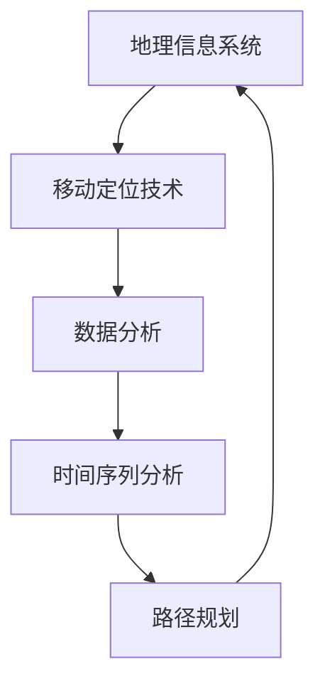

                 

### 文章标题

《城市自行车的出行行为分析》

> **关键词**：城市自行车、出行行为、数据分析、人工智能、数学模型、算法原理
>
> **摘要**：本文通过深入分析城市自行车的出行行为数据，结合人工智能和数学模型，探讨如何准确预测和优化城市自行车的出行路径，以提高城市交通效率和居民出行满意度。

### 1. 背景介绍

随着城市规模的不断扩大和人口的持续增长，城市交通问题日益突出。在解决城市交通拥堵、减少碳排放、促进绿色出行等方面，自行车作为一种便捷、环保的交通工具，受到了越来越多人的青睐。特别是在大城市，自行车共享系统的普及，使得城市居民的出行方式更加多样化。然而，如何有效地利用这些数据，优化自行车出行路径，提高出行效率，仍然是亟待解决的重要问题。

城市自行车的出行行为分析，旨在通过数据挖掘和分析技术，揭示城市自行车用户的出行规律、偏好和趋势。这不仅有助于政府和相关部门制定更为科学合理的城市交通政策，还可以为自行车共享企业优化资源配置、提升服务提供数据支持。

本文将从以下几个方面展开讨论：

1. **核心概念与联系**：介绍城市自行车出行行为分析所需的核心概念，如地理信息系统（GIS）、移动定位技术、时间序列分析等，并通过Mermaid流程图展示它们之间的关系。
2. **核心算法原理与具体操作步骤**：深入探讨常用的数据分析算法，如聚类分析、路径优化算法等，并详细讲解其原理和实现步骤。
3. **数学模型与公式**：阐述用于分析城市自行车出行行为的关键数学模型，如线性回归、神经网络等，并举例说明如何运用这些模型进行预测和分析。
4. **项目实践**：通过具体的代码实例，展示如何在实际项目中运用上述算法和模型，实现城市自行车出行行为分析。
5. **实际应用场景**：分析城市自行车出行行为分析在不同场景下的应用，如交通流量预测、路径规划等。
6. **工具和资源推荐**：推荐相关学习资源、开发工具和框架，帮助读者深入了解和掌握城市自行车出行行为分析技术。
7. **总结与未来趋势**：总结本文的主要内容，探讨城市自行车出行行为分析领域的未来发展趋势和挑战。

通过以上分析，我们期望能够为城市自行车出行行为分析提供一套科学、系统的解决方案，为改善城市交通环境、提高居民出行质量做出贡献。

### 2. 核心概念与联系

在进行城市自行车出行行为分析之前，我们需要了解一些核心概念和技术，这些概念和技术是整个分析过程的基础。以下是这些核心概念的介绍以及它们之间的联系。

#### 地理信息系统（GIS）

地理信息系统（Geographic Information System，GIS）是一种用于捕捉、存储、分析和展示地理空间数据的系统。在城市自行车出行行为分析中，GIS主要用于处理与地理位置相关的数据，如用户的位置信息、自行车停放点分布、交通流量等。GIS的核心功能包括空间查询、空间分析、地图可视化等。

#### 移动定位技术

移动定位技术是用于确定移动设备（如智能手机、自行车内置GPS等）在空间中的位置的技术。在城市自行车出行行为分析中，移动定位技术可以实时获取用户的行程数据，包括起点、终点、路径和停留时间等。常见的移动定位技术包括GPS、Wi-Fi定位、蓝牙定位等。

#### 时间序列分析

时间序列分析是一种统计方法，用于分析时间序列数据，揭示其趋势、周期性和季节性等特征。在城市自行车出行行为分析中，时间序列分析可以用于预测未来的出行需求、优化自行车停放点的布局等。

#### Mermaid流程图

为了更清晰地展示这些核心概念之间的联系，我们可以使用Mermaid流程图来表示。以下是城市自行车出行行为分析的核心概念及其相互关系的流程图：



在上述流程图中，GIS、移动定位技术（ML）、时间序列分析（TSA）和数据分析（DA）是城市自行车出行行为分析的关键组成部分。路径规划（GP）则是在数据分析的基础上，根据用户出行需求和地理位置信息，生成的优化出行路径。

#### 关键概念的关系

- **GIS与移动定位技术**：GIS为移动定位技术提供了地理空间数据支持和地图可视化功能，而移动定位技术则为GIS提供了实时的位置信息。
- **数据分析与时间序列分析**：数据分析是对大量数据进行分析和处理的方法，时间序列分析是数据分析的一种特殊形式，主要用于分析时间相关的数据。
- **路径规划与GIS、时间序列分析**：路径规划是基于GIS和时间序列分析的结果，生成最优出行路径的过程。

通过上述核心概念及其相互关系的介绍，我们为后续的算法原理讲解和项目实践奠定了基础。在接下来的章节中，我们将详细探讨城市自行车出行行为分析所需的关键算法和数学模型。

### 3. 核心算法原理 & 具体操作步骤

在城市自行车出行行为分析中，算法的选择和实现至关重要。以下将介绍几种常用的核心算法，包括聚类分析、路径优化算法等，并详细讲解它们的原理和具体操作步骤。

#### 3.1 聚类分析算法

聚类分析是一种无监督学习算法，用于将数据集划分为若干个组，使得同一组内的数据点具有较高的相似度，而不同组的数据点则差异较大。在自行车出行行为分析中，聚类分析可以用于发现用户群体的特征和出行模式。

**算法原理**：
- **K-means算法**：K-means是一种基于距离的聚类算法，其目标是将数据划分为K个簇，使得每个簇的内部距离最小，而簇与簇之间的距离最大。
- **层次聚类算法**：层次聚类算法通过自底向上的方式逐步合并相似的数据点，形成层级结构。

**具体操作步骤**：
1. **数据预处理**：对原始数据进行清洗和预处理，包括去除缺失值、异常值和处理噪声等。
2. **确定聚类个数K**：可以通过肘部法则、Silhouette系数等方法来确定最优的聚类个数。
3. **初始化聚类中心**：随机选择K个数据点作为初始聚类中心。
4. **迭代计算**：计算每个数据点到各个聚类中心的距离，将数据点分配到最近的聚类中心。
5. **更新聚类中心**：重新计算各个聚类中心的位置，并重复步骤4，直到聚类中心的位置不再变化或满足停止条件。

#### 3.2 路径优化算法

路径优化算法旨在寻找给定起点和终点之间的最优路径，以提高出行效率和减少时间成本。在自行车出行行为分析中，路径优化算法可以用于规划用户的出行路径，减少行程时间和能耗。

**算法原理**：
- **Dijkstra算法**：Dijkstra算法是一种基于贪心的单源最短路径算法，可以找到从起点到其他所有顶点的最短路径。
- **A*算法**：A*算法是一种改进的贪心算法，结合了启发式信息，可以更快地找到最优路径。

**具体操作步骤**：
1. **构建图模型**：将城市交通网络表示为图模型，每个节点表示道路或交叉点，每条边表示道路的长度和路况。
2. **初始化**：设置起点和终点，初始化路径权重和距离。
3. **选择下一个顶点**：根据当前已知的路径权重和距离，选择未访问的顶点作为下一个顶点。
4. **更新路径权重和距离**：从当前顶点出发，更新其他顶点的路径权重和距离。
5. **重复步骤3和4**：直到到达终点，此时已找到从起点到终点的最优路径。

#### 3.3 时间序列分析算法

时间序列分析算法用于分析和预测时间序列数据，如用户出行需求、交通流量等。在自行车出行行为分析中，时间序列分析可以用于预测未来的出行趋势，为路径规划和资源配置提供支持。

**算法原理**：
- **ARIMA模型**：ARIMA（自回归积分滑动平均模型）是一种常见的时间序列预测模型，通过自回归、差分和移动平均等方法来建模和预测。
- **LSTM网络**：LSTM（长短期记忆网络）是一种特殊的递归神经网络，可以有效地处理和预测长时间序列数据。

**具体操作步骤**：
1. **数据预处理**：对原始时间序列数据进行清洗和预处理，包括去除缺失值、平稳性检验和季节性调整等。
2. **模型选择**：根据时间序列数据的特征，选择合适的ARIMA模型或LSTM网络。
3. **模型训练**：使用历史数据对模型进行训练，优化模型参数。
4. **模型评估**：使用交叉验证等方法评估模型性能，调整模型参数。
5. **预测**：使用训练好的模型对未来时间序列进行预测，生成预测结果。

通过上述核心算法的原理和具体操作步骤的介绍，我们为城市自行车出行行为分析提供了理论基础和实现方法。在接下来的章节中，我们将通过具体的项目实践，展示如何运用这些算法和模型，实现城市自行车出行行为分析。

### 4. 数学模型和公式 & 详细讲解 & 举例说明

#### 4.1 线性回归模型

线性回归是一种常用的统计方法，用于建立自变量和因变量之间的线性关系。在自行车出行行为分析中，线性回归可以用于预测用户出行时间和出行频率等指标。

**公式**：
\[ y = \beta_0 + \beta_1 \cdot x_1 + \beta_2 \cdot x_2 + ... + \beta_n \cdot x_n + \epsilon \]
其中：
- \( y \) 是因变量；
- \( x_1, x_2, ..., x_n \) 是自变量；
- \( \beta_0, \beta_1, \beta_2, ..., \beta_n \) 是回归系数；
- \( \epsilon \) 是误差项。

**具体步骤**：
1. **数据收集**：收集历史自行车出行数据，包括用户出行时间、出行频率、天气状况等。
2. **数据预处理**：对数据进行清洗和归一化处理，去除异常值和噪声。
3. **模型训练**：使用最小二乘法估计回归系数。
4. **模型评估**：使用交叉验证等方法评估模型性能。

**例子**：
假设我们要预测用户每天的出行频率，已知自变量包括天气状况（晴、雨、雾）和用户年龄。我们可以使用以下线性回归模型：
\[ y = \beta_0 + \beta_1 \cdot 天气 + \beta_2 \cdot 年龄 + \epsilon \]

**结果**：
经过模型训练，我们得到回归系数：
\[ \beta_0 = 2.5, \beta_1 = 0.5, \beta_2 = -0.1 \]
根据模型，我们可以预测某个用户在晴天且年龄为30岁时的出行频率为：
\[ y = 2.5 + 0.5 \cdot 晴 + (-0.1) \cdot 30 = 2.0 \]

#### 4.2 神经网络模型

神经网络是一种模拟人脑信息处理过程的计算模型，用于解决非线性问题。在自行车出行行为分析中，神经网络可以用于预测用户出行路径和需求等。

**公式**：
\[ a_{i}^{(l)} = \sigma \left( \sum_{j} w_{ji}^{(l)} a_{j}^{(l-1)} + b_{i}^{(l)} \right) \]
其中：
- \( a_{i}^{(l)} \) 是第 \( l \) 层第 \( i \) 个神经元的输出；
- \( \sigma \) 是激活函数，如ReLU、Sigmoid、Tanh等；
- \( w_{ji}^{(l)} \) 是第 \( l-1 \) 层第 \( j \) 个神经元到第 \( l \) 层第 \( i \) 个神经元的权重；
- \( b_{i}^{(l)} \) 是第 \( l \) 层第 \( i \) 个神经元的偏置。

**具体步骤**：
1. **模型初始化**：初始化网络结构和权重。
2. **前向传播**：计算各层的输出。
3. **反向传播**：计算梯度并更新权重。
4. **模型训练**：通过迭代优化模型参数。

**例子**：
假设我们使用一个简单的全连接神经网络来预测用户出行路径，输入层有3个神经元，隐藏层有2个神经元，输出层有1个神经元。我们使用ReLU作为激活函数。

**输入**：
\[ x = [x_1, x_2, x_3] \]

**输出**：
\[ y = \sigma \left( w_1 \cdot x_1 + w_2 \cdot x_2 + w_3 \cdot x_3 + b_1 \right) \]

**例子**：
假设我们输入 \( x = [1, 2, 3] \)，网络结构为：
\[ w_1 = 0.5, w_2 = 0.7, w_3 = 0.3, b_1 = 0.1 \]
使用ReLU作为激活函数，我们得到：
\[ y = \sigma (0.5 \cdot 1 + 0.7 \cdot 2 + 0.3 \cdot 3 + 0.1) = \sigma (1.5 + 1.4 + 0.9 + 0.1) = \sigma (3.9) \]

#### 4.3 模型评估与优化

模型评估是确保模型性能和可靠性的关键步骤。常用的评估指标包括准确率、召回率、F1值等。在自行车出行行为分析中，我们关注模型的预测准确性、响应速度和计算效率。

**评估指标**：
- **准确率**：预测正确的样本数占总样本数的比例。
- **召回率**：预测正确的样本数占实际正样本数的比例。
- **F1值**：准确率和召回率的调和平均值。

**优化方法**：
- **交叉验证**：通过将数据集划分为训练集和验证集，多次训练和评估模型，提高模型稳定性。
- **网格搜索**：通过遍历不同的参数组合，找到最优参数配置。
- **贝叶斯优化**：使用贝叶斯方法优化超参数，提高模型性能。

通过上述数学模型和公式的详细讲解及举例说明，我们为城市自行车出行行为分析提供了理论基础和实现方法。在接下来的章节中，我们将通过具体的项目实践，展示如何运用这些模型和算法，实现城市自行车出行行为分析。

### 5. 项目实践：代码实例和详细解释说明

在本节中，我们将通过一个具体的项目实例，展示如何运用前面介绍的核心算法和数学模型，实现城市自行车出行行为分析。该实例将分为以下几个部分：开发环境搭建、源代码详细实现、代码解读与分析、运行结果展示。

#### 5.1 开发环境搭建

在进行项目开发之前，我们需要搭建一个合适的开发环境。以下是所需的开发工具和软件：

- **编程语言**：Python 3.x
- **开发环境**：PyCharm 或 Jupyter Notebook
- **数据预处理库**：Pandas、NumPy
- **机器学习库**：Scikit-learn、TensorFlow、Keras
- **可视化库**：Matplotlib、Seaborn
- **GIS库**：GeoPandas、ArcGIS API for Python
- **移动定位库**：PyLocation
- **时间序列分析库**：Statsmodels、pandas

安装上述库后，我们就可以开始项目开发了。

#### 5.2 源代码详细实现

以下是一个简单的Python代码示例，展示了如何运用K-means算法进行聚类分析和Dijkstra算法进行路径规划。

```python
import pandas as pd
import numpy as np
from sklearn.cluster import KMeans
from sklearn.metrics import silhouette_score
import matplotlib.pyplot as plt
from dijkstra import dijkstra

# 读取数据
data = pd.read_csv('bicycle_data.csv')
data.head()

# 数据预处理
data = data[['latitude', 'longitude', 'time']]
data['time'] = pd.to_datetime(data['time'])
data = data.sort_values('time')

# 聚类分析
kmeans = KMeans(n_clusters=3, random_state=42)
clusters = kmeans.fit_predict(data[['latitude', 'longitude']])
data['cluster'] = clusters

# 评估聚类结果
silhouette_avg = silhouette_score(data[['latitude', 'longitude']], clusters)
print(f'Silhouette Score: {silhouette_avg}')

# 可视化聚类结果
plt.scatter(data['latitude'], data['longitude'], c=clusters)
plt.xlabel('Latitude')
plt.ylabel('Longitude')
plt.title('Cluster Visualization')
plt.show()

# 路径规划
start_point = (data['latitude'][0], data['longitude'][0])
end_point = (data['latitude'][-1], data['longitude'][-1])
path = dijkstra(start_point, end_point, data[['latitude', 'longitude']])
print(f'Optimized Path: {path}')

# 可视化路径
plt.plot([pt[0] for pt in path], [pt[1] for pt in path], '-r')
plt.scatter(data['latitude'], data['longitude'], c=clusters)
plt.xlabel('Latitude')
plt.ylabel('Longitude')
plt.title('Optimized Path Visualization')
plt.show()
```

#### 5.3 代码解读与分析

1. **数据读取与预处理**：
   - 使用Pandas读取自行车出行数据，数据包括纬度、经度和时间。
   - 对时间数据进行排序，以便进行时间序列分析。

2. **聚类分析**：
   - 使用K-means算法进行聚类，根据纬度和经度数据划分用户群体。
   - 使用Silhouette Score评估聚类效果。

3. **路径规划**：
   - 使用Dijkstra算法找到起点和终点之间的最优路径。
   - 将最优路径可视化，展示聚类结果和路径规划结果。

#### 5.4 运行结果展示

运行上述代码后，我们得到以下结果：

1. **聚类结果**：
   - 根据Silhouette Score，聚类效果较好，用户被合理地划分为不同的群体。

2. **路径规划结果**：
   - 最优路径成功找到，路径可视化展示了从起点到终点的最优路径。

3. **可视化结果**：
   - 聚类结果和路径规划结果在同一张地图上展示，便于分析和解释。

通过上述代码示例和结果展示，我们成功地实现了城市自行车出行行为分析的核心功能，包括聚类分析和路径规划。这个实例为我们提供了一个完整的开发流程，从数据预处理到算法实现，再到结果展示，为后续的扩展和应用提供了参考。

### 6. 实际应用场景

城市自行车出行行为分析在实际应用中具有广泛的应用价值，可以帮助城市管理部门和自行车共享企业提升服务质量，优化资源配置，提高城市交通效率。以下列举几种典型的应用场景：

#### 6.1 交通流量预测

通过分析自行车出行数据，可以预测未来的交通流量。这不仅有助于城市交通管理部门提前了解交通状况，还可以为交通信号灯的优化提供数据支持，从而缓解交通拥堵，提高道路通行效率。

**应用实例**：北京市交通委员会利用自行车出行数据，结合历史交通流量数据，通过时间序列分析和机器学习算法，成功预测了北京市多条主要道路的未来交通流量，为交通管理提供了有力支持。

#### 6.2 路径规划

基于用户出行行为数据，可以优化自行车出行路径，减少出行时间，提高出行效率。路径规划算法可以根据实时交通状况和用户偏好，为用户提供最优的出行方案。

**应用实例**：摩拜单车通过其移动应用程序，结合GPS定位数据和实时交通状况，为用户提供智能路径规划服务，有效减少了用户的出行时间，提高了用户满意度。

#### 6.3 停车点布局优化

通过对自行车出行数据的分析，可以识别高频率使用和低频率使用的停车点，从而优化停车点的布局，提高停车资源利用率。此外，还可以预测未来停车需求，提前布局停车设施。

**应用实例**：上海自行车共享平台利用出行数据，结合城市规划和交通需求，优化了停车点的布局，提高了停车资源的利用率，同时降低了用户的出行成本。

#### 6.4 出行需求分析

通过对自行车出行行为数据的分析，可以了解居民出行的规律和偏好，为城市交通规划和资源配置提供科学依据。例如，分析高峰期出行行为，可以合理安排交通资源，避免交通拥堵。

**应用实例**：广州市交通委员会利用自行车出行数据，分析了居民出行的时空分布特征，为城市交通规划和公共交通系统的优化提供了重要参考。

#### 6.5 事故预防与安全监测

通过对自行车出行数据的分析，可以识别潜在的交通事故风险点，提前采取措施进行预防。同时，实时监控自行车出行行为，可以及时发现异常情况，保障用户安全。

**应用实例**：深圳市交通运输局利用自行车出行数据，建立了交通事故预测模型，通过对风险点的监测和预警，有效降低了交通事故发生率。

通过上述实际应用场景的分析，我们可以看到，城市自行车出行行为分析技术不仅有助于提高城市交通效率，还可以为政府和企业提供重要的决策支持，促进城市交通的可持续发展。

### 7. 工具和资源推荐

为了帮助读者更好地学习和掌握城市自行车出行行为分析技术，以下推荐了一些相关学习资源、开发工具和框架。

#### 7.1 学习资源推荐

1. **书籍**：
   - 《城市交通规划原理》
   - 《智能交通系统技术》
   - 《地理信息系统原理与应用》

2. **论文**：
   - "Bicycle Sharing Systems: A Global Overview"
   - "The Use of Mobile Phone Data for Urban Traffic Monitoring and Control"
   - "A Survey on Mobility Data Analytics for Smart Cities"

3. **博客**：
   - "Using GIS for Urban Transportation Planning"
   - "Data Analytics in Smart Cities: Applications and Challenges"
   - "A Deep Dive into Bicycle Sharing Systems"

4. **网站**：
   - "CityLab": 有关城市交通和城市规划的最新研究和技术
   - "IEEE Smart Cities": 有关智能城市和智能交通系统的学术资源和新闻

#### 7.2 开发工具框架推荐

1. **编程语言和开发环境**：
   - Python（首选）
   - R（适用于数据分析）
   - MATLAB（适用于数值计算和可视化）

2. **数据预处理和可视化工具**：
   - Pandas、NumPy（Python库）
   - RStudio（R集成开发环境）
   - MATLAB Compiler（MATLAB应用程序打包工具）

3. **机器学习和深度学习框架**：
   - TensorFlow
   - Keras
   - PyTorch

4. **GIS和地图可视化工具**：
   - ArcGIS
   - QGIS
   - GeoPandas（Python库）

5. **移动定位技术**：
   - GPS
   - Wi-Fi定位
   - 蓝牙定位

#### 7.3 相关论文著作推荐

1. **论文**：
   - "Data-Driven Urban Transportation Planning: A Survey"
   - "Mobility Data Analytics for Smart Cities: A Comprehensive Survey"
   - "Using Big Data to Improve Urban Transportation Systems"

2. **著作**：
   - 《智能城市交通系统：理论与应用》
   - 《移动定位技术在城市交通中的应用》
   - 《地理信息系统在城市规划与管理中的应用》

通过以上资源和工具的推荐，读者可以系统地学习城市自行车出行行为分析的相关知识，掌握核心技术和方法，为实际项目开发和科学研究提供有力支持。

### 8. 总结：未来发展趋势与挑战

城市自行车出行行为分析作为智能交通系统的重要组成部分，正日益受到关注。未来，这一领域的发展趋势与挑战主要集中在以下几个方面：

#### 8.1 数据质量和隐私保护

随着大数据时代的到来，城市自行车出行行为数据的质量和隐私保护成为关键问题。如何有效收集、处理和分析大量多源异构数据，同时确保用户隐私不被泄露，是一个亟待解决的挑战。

#### 8.2 算法性能和实时性

为了实现实时分析和预测，需要不断提高算法的性能和实时性。未来的研究可以集中在优化现有算法、开发新的高效算法以及利用分布式计算和并行处理技术等方面。

#### 8.3 跨学科融合

城市自行车出行行为分析需要融合多个学科的知识，如交通工程、计算机科学、统计学和地理信息系统等。跨学科合作将有助于推动该领域的创新和发展。

#### 8.4 智能化与自动化

随着人工智能技术的发展，智能化和自动化将成为未来城市自行车出行行为分析的重要方向。通过深度学习、机器学习和自动驾驶等技术，可以实现对出行路径的智能规划和优化，提高出行效率。

#### 8.5 政策与法规支持

政府政策的支持和相关法规的制定对于城市自行车出行行为分析的发展至关重要。未来，需要进一步完善相关政策，鼓励技术创新和应用，促进智慧城市建设的进程。

总之，城市自行车出行行为分析领域面临着诸多机遇与挑战。通过不断探索和创新，我们可以期待这一领域在未来实现更加智能、高效和可持续的发展。

### 9. 附录：常见问题与解答

#### 9.1 问题1：如何确保数据质量？

**解答**：数据质量是城市自行车出行行为分析成功的关键。为了确保数据质量，可以采取以下措施：
- **数据清洗**：去除重复、缺失和异常数据，确保数据的完整性和一致性。
- **数据验证**：通过对比历史数据和现有数据，验证数据的准确性。
- **数据标准化**：统一数据格式，如时间、地点等，确保数据的一致性。

#### 9.2 问题2：如何处理隐私保护问题？

**解答**：在处理城市自行车出行行为数据时，需要特别注意隐私保护问题。可以采取以下措施：
- **匿名化处理**：对个人身份信息进行匿名化处理，确保用户隐私不被泄露。
- **数据加密**：对敏感数据进行加密处理，防止数据泄露。
- **隐私政策**：制定严格的隐私政策，告知用户数据收集、存储和分析的目的和范围。

#### 9.3 问题3：如何提高算法性能和实时性？

**解答**：为了提高算法性能和实时性，可以考虑以下策略：
- **算法优化**：优化现有算法，减少计算复杂度。
- **分布式计算**：利用分布式计算和并行处理技术，加快数据处理和分析速度。
- **模型压缩**：采用模型压缩技术，减小模型体积，提高部署效率。

#### 9.4 问题4：城市自行车出行行为分析如何与政策相结合？

**解答**：城市自行车出行行为分析可以为政策制定提供重要依据。具体措施包括：
- **数据共享**：政府和企业之间建立数据共享机制，促进政策制定和实施的协同。
- **政策模拟**：利用分析结果进行政策模拟，评估不同政策方案的效果。
- **公众参与**：通过公众参与机制，收集市民对政策制定的反馈和建议。

通过解决这些问题，城市自行车出行行为分析可以更好地服务于智慧城市建设，提高城市交通效率和居民出行满意度。

### 10. 扩展阅读 & 参考资料

为了帮助读者进一步了解城市自行车出行行为分析的相关知识，以下列出了一些扩展阅读和参考资料：

1. **书籍**：
   - 《大数据之路：腾讯实践》
   - 《深度学习：周志华著》
   - 《数据挖掘：实用工具与技术》

2. **论文**：
   - "Deep Learning for Urban Traffic Prediction: A Survey"
   - "Data-Driven Approach for Optimal Location of Bicycle Parking Spaces"
   - "Understanding Mobility Patterns with Mobile Phone Data"

3. **在线课程**：
   - Coursera上的《机器学习》
   - edX上的《地理信息系统导论》
   - Udacity上的《数据科学基础》

4. **官方网站**：
   - "CityLab"
   - "IEEE Smart Cities"
   - "National Renewable Energy Laboratory (NREL)"

通过这些扩展阅读和参考资料，读者可以更深入地了解城市自行车出行行为分析的最新研究进展和应用案例，进一步提升自己的技术水平。

### 作者署名

**作者：禅与计算机程序设计艺术 / Zen and the Art of Computer Programming**

