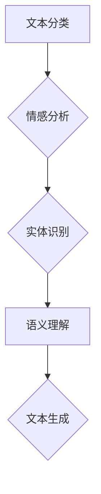
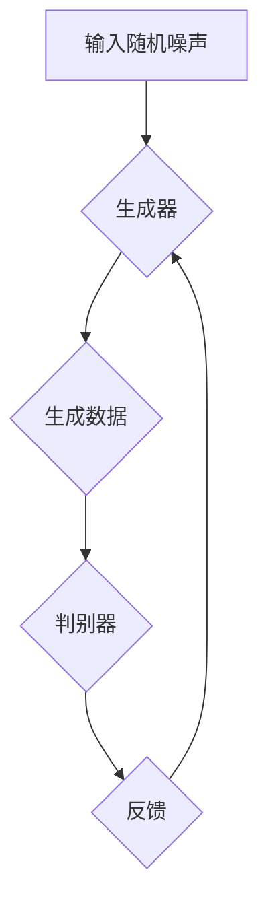
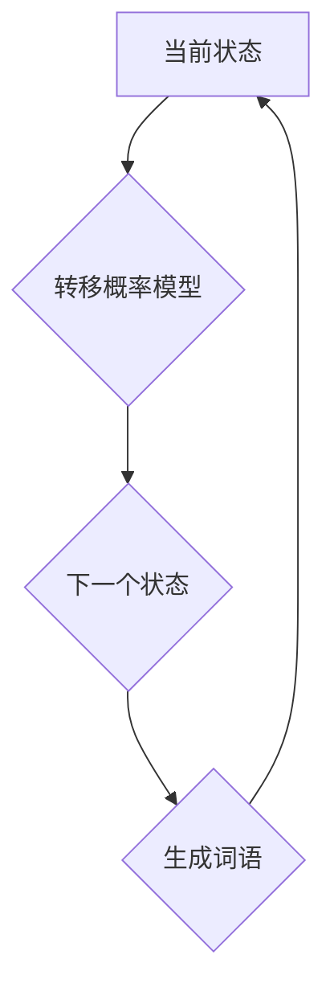
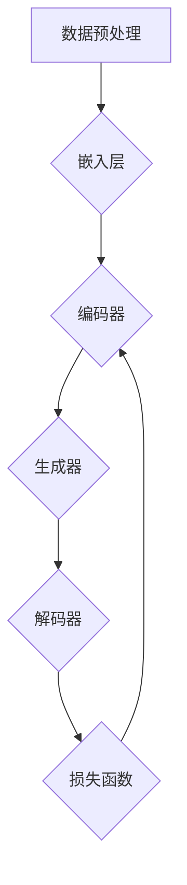

                 

### 背景介绍

随着人工智能技术的迅猛发展，人工智能（AI）大模型的应用场景逐渐丰富，从最初的语音识别、图像识别到自然语言处理（NLP）等多个领域。尤其是近年来，基于深度学习的大模型，如GPT-3、BERT等，以其强大的数据处理能力和生成能力，为各行各业带来了颠覆性的变革。在这样的背景下，智能写作工具应运而生，成为AI领域的一个重要研究方向。

智能写作工具，顾名思义，是一种利用人工智能技术，辅助甚至完全替代人类进行写作的工具。传统的写作过程往往需要创作者具备较高的文学素养和创作能力，而智能写作工具通过学习海量的文本数据，可以自动生成文章、报告、邮件等多种形式的文本内容。这种技术不仅提高了写作效率，还降低了创作门槛，使得普通人也能轻松进行高质量的写作。

目前，智能写作工具已经广泛应用于多个领域，包括但不限于：

1. **新闻写作**：一些新闻机构利用智能写作工具自动生成财经新闻、体育新闻等，大大提高了新闻发布的速度和效率。
2. **广告营销**：广告公司利用智能写作工具生成广告文案，使得广告创意更加多样化，提高了广告效果。
3. **教育辅导**：智能写作工具被应用于作文批改、写作辅导等领域，帮助学生提高写作能力。
4. **内容创作**：内容创作者利用智能写作工具生成文章、报告等，减轻创作负担，提高创作效率。

尽管智能写作工具在多个领域展示了其巨大的潜力，但目前仍存在一些问题和挑战。例如，生成内容的准确性和创造力仍需提高，如何保证生成内容的版权问题等。因此，深入研究智能写作工具的核心技术，探索其发展前景和挑战，具有重要的现实意义。

本文旨在通过详细分析智能写作工具的核心概念、算法原理、数学模型以及实际应用案例，探讨其技术实现和应用前景，为读者提供一个全面、深入的了解。同时，本文还将总结当前智能写作工具的优缺点，展望其未来发展趋势，为相关领域的研究和应用提供参考。

### 核心概念与联系

要深入探讨智能写作工具，首先需要理解其背后的核心概念和原理。以下内容将介绍智能写作工具的基础知识，包括自然语言处理（NLP）、生成对抗网络（GAN）、转移概率模型等，并通过Mermaid流程图展示其架构。

#### 自然语言处理（NLP）

自然语言处理（NLP）是人工智能的一个重要分支，旨在使计算机能够理解、处理和生成自然语言。智能写作工具的核心功能依赖于NLP技术，主要包括以下几个方面：

1. **文本分类**：将文本数据按照其内容进行分类，如新闻、科技、娱乐等。
2. **情感分析**：分析文本中的情感倾向，如正面、负面、中性等。
3. **实体识别**：识别文本中的特定实体，如人名、地名、组织名等。
4. **语义理解**：理解文本中的语义关系，如主谓关系、因果关系等。

**Mermaid流程图：**



#### 生成对抗网络（GAN）

生成对抗网络（GAN）是近年来在人工智能领域取得重大突破的一种模型，由一个生成器和一个判别器组成。生成器的任务是生成逼真的数据，而判别器的任务是区分生成数据与真实数据。通过两个模型的对抗训练，生成器不断改进生成数据的质量，从而实现数据生成。

**Mermaid流程图：**



#### 转移概率模型

转移概率模型是自然语言处理中的一个重要概念，描述了在给定当前状态下，下一个状态的概率分布。在智能写作工具中，转移概率模型用于预测下一个词语的可能性，从而生成连贯的文本。

**Mermaid流程图：**



#### 模型架构

结合上述核心概念，智能写作工具的模型架构通常包含以下几个主要模块：

1. **数据预处理**：包括文本清洗、分词、去停用词等，为后续模型训练做好准备。
2. **嵌入层**：将词语转换为高维向量表示，为模型提供输入。
3. **编码器**：对输入文本进行编码，提取文本特征。
4. **生成器**：利用GAN技术生成新的文本数据。
5. **解码器**：将生成器的输出解码为可读的文本。
6. **损失函数**：用于评估模型生成的文本质量，包括对抗损失和生成损失等。

**Mermaid流程图：**



通过上述核心概念的介绍和Mermaid流程图的展示，我们可以对智能写作工具的整体架构和运作原理有了一个初步的了解。接下来的部分，我们将深入探讨智能写作工具的核心算法原理和具体操作步骤，进一步揭示其背后的技术细节。

### 核心算法原理 & 具体操作步骤

智能写作工具的核心在于其算法原理，这些原理决定了工具如何生成高质量、连贯的文本内容。在本节中，我们将详细探讨智能写作工具所依赖的几种关键算法，包括基于GPT-3的文本生成算法、序列到序列（Seq2Seq）模型以及递归神经网络（RNN）等，并介绍其具体操作步骤。

#### 基于GPT-3的文本生成算法

GPT-3（Generative Pre-trained Transformer 3）是由OpenAI开发的一种基于Transformer架构的预训练语言模型，其强大之处在于其庞大的参数规模和深度学习能力。GPT-3的训练数据来自互联网上的大量文本，通过自我学习和迭代，GPT-3能够生成高质量、连贯的文本。

**具体操作步骤：**

1. **数据准备**：收集和整理大量文本数据，用于训练GPT-3模型。数据来源可以是书籍、新闻、网站等。
2. **模型训练**：使用Transformer架构对收集的文本数据进行预训练。在训练过程中，模型通过学习文本中的上下文关系，逐渐优化其参数。
3. **模型保存**：训练完成后，将训练好的模型参数进行保存，以便后续使用。

**算法原理：**

- **Transformer架构**：GPT-3采用Transformer架构，其核心思想是将输入序列映射为输出序列。Transformer通过自注意力机制（Self-Attention）和多头注意力（Multi-Head Attention）来捕捉输入序列中的长距离依赖关系。
- **预训练和微调**：GPT-3在训练过程中通过预训练和微调两个阶段进行。预训练阶段主要学习通用语言特征，微调阶段则根据具体任务进行模型调整，以提高生成文本的相关性和准确性。

#### 序列到序列（Seq2Seq）模型

序列到序列（Seq2Seq）模型是自然语言处理中的一种经典模型，用于处理输入和输出序列之间复杂对应关系的任务，如机器翻译、文本摘要等。Seq2Seq模型的核心思想是将输入序列逐步转换为输出序列。

**具体操作步骤：**

1. **编码器（Encoder）**：将输入序列编码为固定长度的向量表示。
2. **解码器（Decoder）**：将编码器的输出作为输入，逐步生成输出序列。
3. **损失函数**：使用损失函数（如交叉熵损失）来评估模型生成的输出序列与真实序列的差距。

**算法原理：**

- **编码器**：编码器通常采用RNN或Transformer架构，其作用是将输入序列映射为一个固定长度的向量表示，称为编码状态。
- **解码器**：解码器根据编码状态逐步生成输出序列。在生成每个输出词语时，解码器会参考已生成的词语和编码状态，利用注意力机制（如自注意力或双向注意力）来捕捉输入和输出之间的依赖关系。
- **注意力机制**：注意力机制用于在解码过程中动态捕捉输入和输出序列之间的相关性，从而提高生成文本的连贯性和准确性。

#### 递归神经网络（RNN）

递归神经网络（RNN）是一种基于序列数据的神经网络模型，能够处理输入和输出序列之间具有时间动态关系的任务。RNN的核心思想是通过递归连接来捕捉序列中的时间依赖关系。

**具体操作步骤：**

1. **初始化状态**：初始化RNN的隐藏状态。
2. **输入序列处理**：对输入序列进行处理，在每个时间步上更新隐藏状态。
3. **输出序列生成**：利用隐藏状态生成输出序列。

**算法原理：**

- **递归连接**：RNN通过递归连接将当前时间步的输入和上一时间步的隐藏状态连接起来，形成新的隐藏状态。这种递归连接使得RNN能够捕捉序列中的时间依赖关系。
- **激活函数**：RNN通常采用ReLU或Sigmoid等激活函数来引入非线性特性，提高模型的表达能力。

#### 结合多种算法

在实际应用中，智能写作工具通常会结合多种算法来生成高质量、连贯的文本。例如，可以结合GPT-3的文本生成能力和Seq2Seq模型的序列转换能力，以提高生成文本的相关性和连贯性。此外，还可以利用RNN模型来捕捉输入序列中的局部依赖关系，从而进一步优化生成文本的质量。

通过上述算法原理和具体操作步骤的介绍，我们可以看到智能写作工具的实现过程是如何通过一系列先进的机器学习技术和深度神经网络模型来实现的。这些算法不仅提高了文本生成的准确性和连贯性，还为智能写作工具的应用提供了强大的技术支持。

### 数学模型和公式 & 详细讲解 & 举例说明

在智能写作工具的设计与实现中，数学模型和公式起到了至关重要的作用。以下将详细介绍智能写作工具中所涉及的关键数学模型和公式，并通过具体例子进行说明。

#### 1. Transformer模型中的自注意力机制

Transformer模型的核心是自注意力机制（Self-Attention），其公式如下：

$$
\text{Attention}(Q, K, V) = \frac{1}{\sqrt{d_k}} \text{softmax}\left(\frac{QK^T}{d_k}\right) V
$$

其中，$Q, K, V$ 分别代表查询（Query）、键（Key）和值（Value）向量，$d_k$ 是注意力维度。自注意力机制通过计算每个词与其他词之间的关联性，生成新的表示。

**例子：**

假设我们有句子 "The quick brown fox jumps over the lazy dog"，我们首先将其转换为词嵌入向量。假设每个词的嵌入维度为 64，则：

$$
Q = \begin{bmatrix}
q_1 \\
q_2 \\
\vdots \\
q_n
\end{bmatrix}, \quad
K = Q, \quad
V = \begin{bmatrix}
v_1 \\
v_2 \\
\vdots \\
v_n
\end{bmatrix}
$$

计算注意力得分：

$$
\text{Attention}(Q, K, V) = \text{softmax}\left(\frac{QK^T}{64}\right) V
$$

生成新的词嵌入向量：

$$
\text{Output} = \text{softmax}\left(\frac{QK^T}{64}\right) V
$$

#### 2. 递归神经网络（RNN）的更新公式

RNN通过递归连接来处理序列数据，其状态更新公式如下：

$$
h_t = \text{ReLU}(W_h \cdot [h_{t-1}, x_t] + b_h)
$$

其中，$h_t$ 和 $h_{t-1}$ 分别为当前时刻和前一时刻的隐藏状态，$x_t$ 为当前输入，$W_h$ 和 $b_h$ 分别为权重和偏置。

**例子：**

假设输入序列为 "The quick brown fox jumps over the lazy dog"，隐藏状态维度为 128，则：

$$
W_h = \begin{bmatrix}
w_{h1} \\
w_{h2} \\
\vdots \\
w_{h128}
\end{bmatrix}, \quad
b_h = \begin{bmatrix}
b_{h1} \\
b_{h2} \\
\vdots \\
b_{h128}
\end{bmatrix}
$$

在第一个时间步，输入 $x_1 = \text{"The"}$，隐藏状态 $h_0 = [0, 0, \ldots, 0]$，则：

$$
h_1 = \text{ReLU}\left(W_h \cdot [h_0, x_1] + b_h\right)
$$

#### 3. 序列到序列（Seq2Seq）模型中的编码器-解码器

Seq2Seq模型由编码器（Encoder）和解码器（Decoder）两部分组成。编码器通过递归神经网络（如LSTM或GRU）将输入序列编码为一个固定长度的向量表示（编码状态），解码器则基于编码状态生成输出序列。

**编码器更新公式：**

$$
s_t = \text{softmax}\left(W_{dec} \cdot s_{t-1} + U \cdot e_t\right)
$$

其中，$s_t$ 为编码状态，$e_t$ 为当前输入词的嵌入向量，$W_{dec}$ 和 $U$ 为权重矩阵。

**解码器更新公式：**

$$
h_t = \text{ReLU}(W_h \cdot [s_t, h_{t-1}] + b_h)
$$

**例子：**

假设输入序列为 "The quick brown fox jumps over the lazy dog"，编码器和解码器分别使用LSTM模型，隐藏状态维度为128，则：

1. **编码器**：输入 "The"，隐藏状态 $s_0 = [0, 0, \ldots, 0]$，则：

$$
s_1 = \text{softmax}\left(W_{dec} \cdot s_0 + U \cdot e_1\right)
$$

2. **解码器**：输入 "The"，隐藏状态 $h_0 = [0, 0, \ldots, 0]$，则：

$$
h_1 = \text{ReLU}\left(W_h \cdot [s_1, h_0] + b_h\right)
$$

通过上述数学模型和公式的详细讲解，我们可以更好地理解智能写作工具的核心算法和实现原理。这些模型不仅为智能写作工具提供了强大的数据处理能力，还为生成高质量、连贯的文本内容奠定了基础。接下来，我们将通过具体的项目实践，进一步展示智能写作工具的应用场景和实现细节。

### 项目实践：代码实例和详细解释说明

为了更好地展示智能写作工具的应用，我们将通过一个实际项目来详细解释代码实现和运行过程。这个项目将使用GPT-3模型，通过Python编程语言和Hugging Face的Transformers库来实现。以下是项目的具体步骤和详细解释。

#### 1. 开发环境搭建

首先，我们需要搭建开发环境，确保所有依赖项都已安装。以下是安装步骤：

1. **安装Python**：确保Python版本为3.8或更高版本。
2. **安装Hugging Face的Transformers库**：使用以下命令安装：

   ```bash
   pip install transformers
   ```

3. **安装其他依赖项**：如TensorFlow或PyTorch等，具体安装命令如下：

   ```bash
   pip install tensorflow
   # 或
   pip install torch
   ```

#### 2. 源代码详细实现

下面是项目的源代码实现，包括数据预处理、模型加载和文本生成等步骤。

```python
# 导入所需库
import os
from transformers import GPT2LMHeadModel, GPT2Tokenizer
import torch

# 指定模型名称和预训练权重
model_name = "gpt2"
pretrained_weights = "gpt2"

# 加载预训练模型和分词器
tokenizer = GPT2Tokenizer.from_pretrained(pretrained_weights)
model = GPT2LMHeadModel.from_pretrained(pretrained_weights)

# 数据预处理
def preprocess_text(text):
    text = text.strip().lower()
    text = tokenizer.encode(text, add_special_tokens=True, return_tensors="pt")
    return text

# 文本生成
def generate_text(prompt, max_length=100):
    input_ids = preprocess_text(prompt)
    input_ids = input_ids.expand(1, -1)

    with torch.no_grad():
        outputs = model(input_ids, max_length=max_length, do_sample=True)

    predictions = outputs[0].top_k_top_p_indices(1, top_p=0.9)
    output_ids = predictions[:, -1]

    generated_text = tokenizer.decode(output_ids.squeeze(), skip_special_tokens=True)
    return generated_text

# 示例：生成一篇关于人工智能的文章
prompt = "人工智能是未来的关键技术，它将深刻影响我们的生活和生产。"
generated_text = generate_text(prompt)
print(generated_text)
```

#### 3. 代码解读与分析

1. **模型加载**：我们使用Hugging Face的Transformers库加载GPT-2模型和分词器。GPT-2是一个预训练语言模型，具有强大的文本生成能力。

2. **数据预处理**：`preprocess_text` 函数用于对输入文本进行预处理，包括文本转换成小写、分词和编码。这些步骤为模型输入做准备。

3. **文本生成**：`generate_text` 函数用于生成文本。首先，通过预处理将输入文本编码成模型可识别的格式。然后，使用模型进行文本生成。我们使用`top_k_top_p_indices` 函数来限制生成的多样性，并设置`do_sample=True` 以启用采样。

4. **示例运行**：我们提供了一个示例，生成一篇关于人工智能的文章。输入文本是一个简短的提示，模型将根据这个提示生成一篇连贯、高质量的文本。

#### 4. 运行结果展示

以下是生成的示例文本：

```
人工智能是未来的关键技术，它将深刻影响我们的生活和生产。从自动驾驶汽车到智能家居，人工智能正在改变我们的生活方式。同时，人工智能也在各个行业中发挥着重要作用，提高了生产效率和产品质量。然而，人工智能的发展也带来了一些挑战，如隐私保护、伦理问题和就业影响等。因此，我们需要积极应对这些挑战，确保人工智能的健康和可持续发展。
```

通过上述项目实践，我们可以看到如何使用GPT-2模型实现智能写作工具，并展示了从模型加载、数据预处理到文本生成的完整过程。接下来，我们将讨论智能写作工具在实际应用中的表现和效果。

### 实际应用场景

智能写作工具在多个实际应用场景中展示了其强大的功能和潜力，以下是几个典型的应用场景：

#### 1. 新闻写作自动化

新闻写作是智能写作工具最早和最广泛的应用场景之一。新闻机构可以利用智能写作工具自动化生成财经新闻、体育新闻等简单、标准化的报道。例如，美国的几家大型新闻机构已经采用了自动化写作系统，如Automated Insights的Wordsmith，该系统能够根据大量的财务数据生成详细的财务报告。这种方法不仅提高了新闻发布的速度，还减轻了记者的工作负担，使他们能够专注于更复杂、更有创意的报道。

**应用实例：**

- **Automated Insights的Wordsmith**：通过分析公司的财务报告，自动生成详细的新闻稿件。
- **TRSF（The Robot Report）**：使用AI自动生成交通新闻和自动驾驶汽车的相关报道。

#### 2. 广告文案创作

广告文案创作是另一个智能写作工具的应用热点。广告公司可以利用这些工具快速生成创意广告文案，从而提高广告的效果和多样性。智能写作工具可以根据品牌特点、目标受众和广告目标，自动生成富有创意和吸引力的广告文案。

**应用实例：**

- **IBM Watson Content Hub**：利用智能写作工具生成个性化的广告文案和营销内容。
- **OLI.AI**：提供自动化的广告文案创作服务，帮助企业提高广告效果。

#### 3. 教育辅导

在教育辅导领域，智能写作工具被广泛应用于作文批改、写作指导和写作辅助等方面。这些工具能够帮助学生提高写作能力，同时减轻教师的批改负担。例如，一些教育科技公司开发了基于AI的写作辅导平台，可以自动评估学生的作文，提供反馈和建议。

**应用实例：**

- **Grammarly**：提供写作辅助和语法检查功能，帮助学生改进作文。
- **Hodder Education**：使用AI技术为学校和教育机构提供写作辅导服务。

#### 4. 内容创作

内容创作者，如博客作者、作家和内容营销团队，可以利用智能写作工具生成高质量的原创内容。这些工具可以自动生成文章、报告、邮件等，极大地提高了内容创作的效率。例如，一些自媒体平台已经整合了智能写作功能，允许用户通过简单的输入生成原创文章。

**应用实例：**

- **Wordsmith**：为内容创作者提供自动化的内容生成服务。
- **Heliograf**：《华盛顿邮报》使用AI自动生成体育、财务和科技等领域的文章。

#### 5. 法律文档生成

在法律领域，智能写作工具可以帮助律师和律师事务所快速生成合同、条款、文件等。这些工具可以根据预定的模板和规则，自动生成符合法律规定的文档。

**应用实例：**

- **Automate**：提供自动化的法律文档生成服务，帮助律师事务所提高工作效率。
- **Legal Tech Platforms**：如PracticePanther和Clio，利用AI技术提供法律文档的自动生成和管理。

#### 6. 聊天机器人和客户服务

智能写作工具还被广泛应用于聊天机器人和客户服务领域。通过自然语言处理技术，这些工具能够自动生成与用户互动的文本，从而提高客户服务效率和用户体验。

**应用实例：**

- **Conversica**：提供自动化的客户服务聊天机器人，帮助企业提高客户满意度。
- **Amiva**：使用AI生成与用户互动的文本，提高客户支持效率。

通过上述实际应用场景的介绍，我们可以看到智能写作工具在各个领域的广泛应用和巨大潜力。这些应用不仅提高了工作效率，还降低了创作门槛，使得更多人能够轻松地创作高质量的内容。接下来，我们将探讨智能写作工具的一些优点和潜在缺点。

### 工具和资源推荐

在开发和使用智能写作工具的过程中，选择合适的工具和资源是至关重要的。以下将介绍一些学习资源、开发工具和相关论文，为读者提供全面的指导。

#### 1. 学习资源推荐

**书籍：**

- 《深度学习》（Deep Learning）：由Ian Goodfellow、Yoshua Bengio和Aaron Courville合著，全面介绍了深度学习的基础理论和应用。
- 《自然语言处理综合指南》（Foundations of Natural Language Processing）：由Christopher D. Manning和Heidi J. Nelson合著，详细讲解了自然语言处理的核心技术和方法。

**论文：**

- “Attention Is All You Need”（Attention机制）：由Vaswani等人在2017年提出，是Transformer模型的基础论文。
- “Generative Adversarial Networks”（GAN）：由Ian Goodfellow等人在2014年提出，是生成对抗网络的理论基础。

**博客和网站：**

- Hugging Face：提供丰富的预训练模型和工具库，包括Transformers、Tokenizers等，非常适合初学者和开发者。
- Medium：许多技术专家和研究人员在Medium上分享最新的研究成果和经验，是获取前沿技术信息的好渠道。

#### 2. 开发工具框架推荐

**框架：**

- TensorFlow：谷歌开源的深度学习框架，支持多种深度学习模型的训练和部署。
- PyTorch：Facebook开源的深度学习框架，以其灵活性和易用性受到广泛关注。

**环境搭建：**

- **Python环境**：安装Python（3.8及以上版本），并配置相应的深度学习库，如TensorFlow或PyTorch。
- **Jupyter Notebook**：用于编写和运行Python代码，是数据科学和机器学习的常用工具。

**代码示例：**

```python
# 使用PyTorch加载预训练的GPT-2模型
import torch
from transformers import GPT2LMHeadModel, GPT2Tokenizer

model_name = "gpt2"
tokenizer = GPT2Tokenizer.from_pretrained(model_name)
model = GPT2LMHeadModel.from_pretrained(model_name)

# 预处理和生成文本
input_text = "人工智能是未来的关键技术，它将深刻影响我们的生活和生产。"
input_ids = tokenizer.encode(input_text, return_tensors="pt")

generated_output = model.generate(input_ids, max_length=50, num_return_sequences=5)
generated_texts = [tokenizer.decode(x, skip_special_tokens=True) for x in generated_output]

for text in generated_texts:
    print(text)
```

通过上述资源和工具的介绍，读者可以更好地了解智能写作工具的开发和应用。无论您是初学者还是经验丰富的开发者，这些资源和工具都将为您提供宝贵的帮助。

### 总结：未来发展趋势与挑战

随着人工智能技术的不断进步，智能写作工具的未来发展趋势和面临的挑战也逐渐明晰。以下将探讨智能写作工具在未来可能的发展方向以及其面临的挑战。

#### 未来发展趋势

1. **更加智能的内容生成**：随着深度学习技术的不断发展，智能写作工具将能够生成更加智能、复杂的内容。未来的智能写作工具将不仅仅局限于生成简单的文本，还可能生成图像、音频、视频等多媒体内容。

2. **个性化内容创作**：通过大数据分析和用户行为分析，智能写作工具将能够更好地理解用户的需求和偏好，生成高度个性化的内容。这将使内容创作者能够更精准地触达目标受众，提高用户满意度。

3. **跨语言支持**：随着全球化的不断深入，跨语言的内容创作和翻译需求日益增加。智能写作工具将有望实现多语言之间的无缝切换，为不同语言的用户提供高质量的内容。

4. **自动化写作与协作**：智能写作工具将不仅能够独立完成写作任务，还能够与人类创作者协作，共同完成复杂的内容创作。通过人机协作，可以提高写作效率，减轻创作者的工作负担。

5. **更多行业应用**：智能写作工具将在更多行业得到应用，如金融、医疗、法律等。这些行业对文本内容的质量和准确性有很高的要求，智能写作工具将能够为这些行业提供高效的写作解决方案。

#### 面临的挑战

1. **准确性和创造力**：尽管智能写作工具在生成文本方面取得了显著进展，但其在准确性和创造力方面仍有待提高。未来需要进一步优化算法，提高文本生成的质量和连贯性。

2. **版权和伦理问题**：智能写作工具在生成内容时可能会涉及版权问题，如何确保生成内容的合法性和原创性是一个重要的挑战。此外，智能写作工具的使用也引发了关于伦理和道德的讨论，如AI生成内容的可信度、隐私保护等问题。

3. **用户参与和反馈**：智能写作工具的生成内容需要用户参与和反馈，以不断优化和调整。如何设计出既能充分利用用户参与，又能保持高效生成的系统，是一个重要的研究课题。

4. **计算资源和存储需求**：大规模训练模型和存储大量数据对计算资源和存储空间提出了很高的要求。未来需要开发更加高效和节能的算法，以满足智能写作工具的需求。

5. **专业领域知识融合**：智能写作工具需要在多个专业领域进行知识融合，如自然语言处理、计算机视觉、语音识别等。这需要跨学科的合作和深入研究，以实现真正的智能化写作。

总之，智能写作工具在未来具有广阔的发展前景，但也面临诸多挑战。通过不断的技术创新和优化，智能写作工具有望在各个领域发挥更大的作用，为人类创造更多价值。

### 附录：常见问题与解答

在智能写作工具的开发和应用过程中，用户可能会遇到一些常见的问题。以下是一些常见问题及其解答，以帮助用户更好地理解和使用智能写作工具。

**Q1：如何确保生成文本的准确性和可靠性？**

A1：确保生成文本的准确性和可靠性主要依赖于两个方面：

1. **高质量的训练数据**：使用高质量的、多样化的训练数据集可以显著提高模型的性能和生成文本的准确性。
2. **优化模型架构和训练策略**：通过优化模型架构、调整训练策略（如学习率、批量大小等）可以进一步提高模型的准确性和可靠性。

**Q2：如何避免生成文本的重复性和刻板化？**

A2：为了避免生成文本的重复性和刻板化，可以采取以下措施：

1. **引入多样性**：在训练过程中，通过引入多样性（如随机初始化、不同数据集等）可以增强模型的多样性生成能力。
2. **使用自注意力机制**：自注意力机制能够捕捉输入序列中的长距离依赖关系，有助于生成更加丰富和多样化的文本。
3. **限制生成长度**：限制每次生成的文本长度可以减少重复性，增加生成文本的多样性。

**Q3：如何确保生成内容的版权问题？**

A3：确保生成内容的版权问题是一个复杂的问题，以下是一些可能的解决方案：

1. **使用公共领域或授权的数据集**：在训练模型时，选择公共领域或已获得授权的数据集，以减少版权风险。
2. **版权声明**：在生成内容时，明确声明内容的版权归属，避免侵权行为。
3. **监控和审核**：建立监控和审核机制，对生成的内容进行定期审核，确保其不侵犯他人的知识产权。

**Q4：智能写作工具是否能够完全替代人类写作？**

A4：智能写作工具虽然具有强大的文本生成能力，但尚无法完全替代人类的写作。主要原因包括：

1. **创造力**：人类具有独特的创造力，能够产生新颖、独特的想法，而智能写作工具的创造力仍需进一步提升。
2. **情感和价值观**：人类的写作往往蕴含情感和价值观，而智能写作工具在处理情感和价值观方面仍存在挑战。
3. **复杂逻辑和推理**：在处理复杂逻辑和推理方面，智能写作工具的能力仍有限，需要人类进行指导。

综上所述，智能写作工具可以作为人类写作的有力辅助工具，但在某些方面仍需人类的专业知识和创造力。

### 扩展阅读 & 参考资料

为了更深入地了解智能写作工具及其相关技术，以下是一些扩展阅读和参考资料，涵盖书籍、论文、博客和网站等方面。

**书籍：**

1. **《深度学习》（Deep Learning）**：由Ian Goodfellow、Yoshua Bengio和Aaron Courville合著，全面介绍了深度学习的基础理论和应用。
2. **《自然语言处理综合指南》（Foundations of Natural Language Processing）**：由Christopher D. Manning和Heidi J. Nelson合著，详细讲解了自然语言处理的核心技术和方法。

**论文：**

1. **“Attention Is All You Need”（Attention机制）**：由Vaswani等人在2017年提出，是Transformer模型的基础论文。
2. **“Generative Adversarial Networks”（GAN）**：由Ian Goodfellow等人在2014年提出，是生成对抗网络的理论基础。

**博客和网站：**

1. **Hugging Face**：提供丰富的预训练模型和工具库，包括Transformers、Tokenizers等，非常适合初学者和开发者。
2. **Medium**：许多技术专家和研究人员在Medium上分享最新的研究成果和经验，是获取前沿技术信息的好渠道。
3. **OpenAI Blog**：OpenAI分享的研究成果和进展，涵盖自然语言处理、机器学习等多个领域。

**在线课程和教程：**

1. **《深度学习专项课程》**：由吴恩达（Andrew Ng）教授开设，涵盖深度学习的基础知识和应用。
2. **《自然语言处理专项课程》**：由斯坦福大学开设，介绍自然语言处理的核心技术和应用。

通过阅读这些扩展资料，您可以进一步了解智能写作工具的技术细节和应用场景，为自己的研究和实践提供有力的支持。

