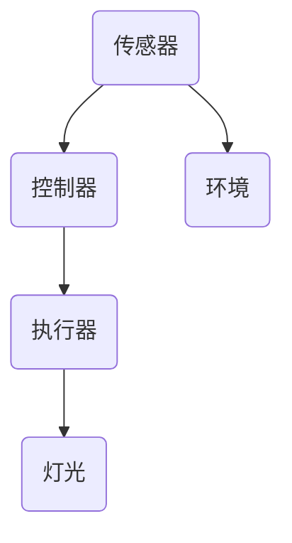
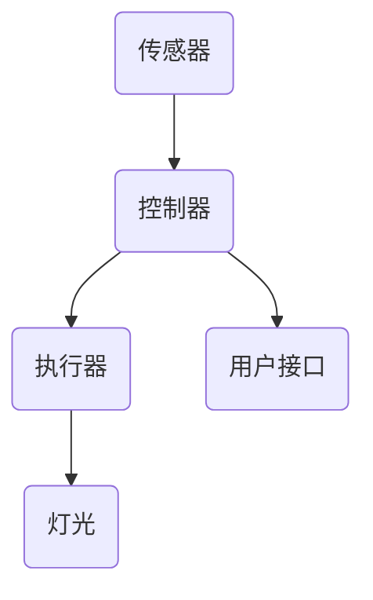
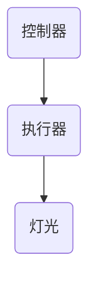
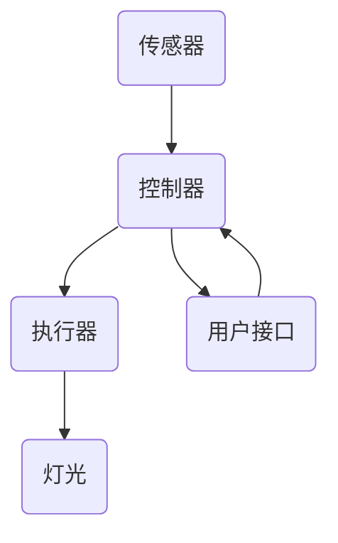

                 

### 1. 背景介绍

随着物联网（IoT）技术的不断发展和普及，智能家居系统逐渐成为现代家庭的重要组成部分。智能家居系统通过将各种家电设备、传感器和控制系统连接到互联网，实现了对家居环境的智能化管理和控制，为用户带来了便利、舒适和安全的居住体验。

本文旨在介绍基于Java的智能家居设计，特别是智能灯光控制系统的构建。Java作为一种广泛使用且功能强大的编程语言，它在智能家居系统中有着广泛的应用。Java的优势在于其跨平台性、丰富的库支持和强大的社区支持，使其成为智能家居开发的首选语言之一。

近年来，智能家居市场呈现出快速增长的趋势。据市场研究机构的报告，全球智能家居市场规模预计将在未来几年内达到数十亿美元。这一市场增长主要得益于以下几个因素：

1. **技术进步**：物联网技术的快速发展，尤其是无线通信技术和传感器技术的进步，使得智能家居系统变得更加智能化和便捷。
2. **用户需求**：随着人们生活水平的提高和对生活质量要求的增加，用户对智能家居系统的需求逐渐增加，特别是对智能灯光控制系统的需求。
3. **政策支持**：各国政府纷纷出台政策支持智能家居产业的发展，为智能家居市场的繁荣提供了良好的环境。

在智能家居系统中，智能灯光控制系统是一个重要的组成部分。通过智能灯光控制，用户可以随时随地控制家中的灯光，调节灯光的亮度和颜色，创建不同的氛围，提高生活品质。此外，智能灯光控制系统还可以与其他智能家居设备（如智能音响、智能门锁等）集成，实现联动控制，提供更加便捷和智能化的家居体验。

本文将分为以下几个部分进行阐述：

1. **核心概念与联系**：介绍智能灯光控制系统的核心概念，包括传感器、控制器、执行器等，并使用Mermaid流程图展示其架构。
2. **核心算法原理与具体操作步骤**：详细讲解智能灯光控制的核心算法，包括环境感知、目标检测、路径规划和控制等，并提供具体的操作步骤。
3. **数学模型和公式**：介绍与智能灯光控制系统相关的数学模型和公式，如线性方程组求解、概率模型等，并提供详细的讲解和举例说明。
4. **项目实践**：通过一个实际的智能灯光控制系统项目实例，展示如何使用Java实现智能灯光控制功能，包括开发环境搭建、源代码实现、代码解读与分析、运行结果展示等。
5. **实际应用场景**：介绍智能灯光控制系统在实际家居环境中的应用场景，如卧室、客厅、厨房等，并探讨其带来的便利和好处。
6. **工具和资源推荐**：推荐相关的学习资源、开发工具和框架，帮助读者更好地了解和掌握智能灯光控制系统的设计与实现。
7. **总结与未来发展趋势**：总结本文的核心内容，并探讨智能家居行业的未来发展趋势和面临的挑战。

通过本文的阅读，读者将能够全面了解智能灯光控制系统的设计与实现，为智能家居开发提供有益的参考和指导。

### 2. 核心概念与联系

要设计和实现一个智能灯光控制系统，我们需要了解几个核心概念，包括传感器、控制器、执行器等。这些组件共同构成了智能灯光控制系统的基本架构，并相互协作以实现自动化和智能化的功能。

#### 传感器

传感器是智能灯光控制系统的感知部分，用于收集环境信息。在智能灯光控制系统中，常用的传感器包括：

- **光敏传感器**：用于检测环境光强，可以根据光线强度自动调节灯光亮度。
- **红外传感器**：用于检测人体存在，可以触发灯光的自动开关。
- **温湿度传感器**：用于监测室内温度和湿度，可以对灯光进行适当调节，以营造舒适的居住环境。

图1展示了传感器在智能灯光控制系统中的位置和作用。



#### 控制器

控制器是智能灯光控制系统的核心部分，负责接收传感器采集到的数据，进行处理和决策，并根据决策结果指挥执行器进行相应的操作。在智能灯光控制系统中，控制器通常需要实现以下功能：

- **数据采集和处理**：从传感器接收数据，进行预处理，如滤波、去噪等，然后进行分析和处理。
- **决策和执行**：根据分析结果，决定是否需要调整灯光状态，如亮度、颜色等。
- **状态记录和反馈**：记录控制器的状态信息，如时间、操作记录等，并实时反馈给用户。

图2展示了控制器在智能灯光控制系统中的作用和与其他组件的交互。



#### 执行器

执行器是智能灯光控制系统的执行部分，负责根据控制器的指令对灯光进行实际操作。在智能灯光控制系统中，常见的执行器包括：

- **调光模块**：用于调整灯光的亮度。
- **RGB控制模块**：用于调整灯光的颜色。
- **开关模块**：用于控制灯光的开关状态。

图3展示了执行器在智能灯光控制系统中的位置和作用。



#### 整体架构

智能灯光控制系统的整体架构可以看作是一个闭环系统，如图4所示。传感器收集环境数据，控制器进行数据处理和决策，然后通过执行器对灯光进行控制。同时，用户可以通过用户接口与控制器进行交互，获取系统的状态信息和控制权限。



通过上述核心概念和架构的介绍，我们可以更好地理解智能灯光控制系统的运作原理和实现方法。在接下来的部分，我们将详细讨论智能灯光控制系统的核心算法原理和具体操作步骤，为读者提供更深入的指导。

### 3. 核心算法原理 & 具体操作步骤

在智能灯光控制系统中，核心算法的设计和实现是关键环节。以下将详细讨论智能灯光控制系统的核心算法原理和具体操作步骤，帮助读者了解其实现细节。

#### 3.1 环境感知

环境感知是智能灯光控制系统的第一步，通过传感器收集环境数据，包括光线强度、温度、湿度等信息。环境感知算法的主要目标是提取有用的环境信息，为后续的控制决策提供依据。

**算法原理：**

1. **数据采集**：使用光敏传感器、红外传感器、温湿度传感器等设备收集环境数据。
2. **数据预处理**：对采集到的原始数据进行预处理，包括滤波、去噪、归一化等，以提高数据的质量和可靠性。
3. **特征提取**：从预处理后的数据中提取关键特征，如光线强度、温度值、湿度值等。

**具体操作步骤：**

1. **初始化传感器**：配置并初始化各种传感器，确保其正常运行。
2. **数据采集**：启动传感器，定期采集环境数据。
3. **数据预处理**：对采集到的数据进行预处理，如使用移动平均滤波去除噪声，使用归一化方法调整数据范围。
4. **特征提取**：提取关键特征，如使用阈值法确定光线强度，使用温湿度阈值范围判断室内环境。

#### 3.2 目标检测

目标检测是智能灯光控制系统中的重要环节，通过对环境中的目标进行识别和定位，可以为灯光控制提供更精确的依据。目标检测算法通常基于图像处理和机器学习技术。

**算法原理：**

1. **图像预处理**：对采集到的图像进行预处理，包括缩放、灰度化、二值化等，以提高图像质量。
2. **特征提取**：从预处理后的图像中提取特征，如边缘特征、纹理特征、颜色特征等。
3. **目标检测**：使用机器学习算法（如支持向量机SVM、卷积神经网络CNN等）对提取的特征进行分类和定位。

**具体操作步骤：**

1. **图像预处理**：根据需要调整图像的大小、灰度化处理，并使用二值化方法将图像转换为便于处理的形式。
2. **特征提取**：提取图像的边缘、纹理和颜色特征，如使用Canny算法提取边缘特征，使用颜色直方图提取颜色特征。
3. **目标检测**：训练机器学习模型，如使用SVM或CNN对提取的特征进行分类和定位，识别并定位环境中的目标。

#### 3.3 路径规划

路径规划是智能灯光控制系统中的另一个关键环节，通过对目标位置的判断和路径的规划，为灯光的自动控制提供依据。路径规划算法通常基于图论和搜索算法。

**算法原理：**

1. **环境建模**：将环境建模为一个图，节点表示环境中的位置，边表示位置之间的关系。
2. **目标定位**：根据目标检测的结果，确定目标在环境中的位置。
3. **路径搜索**：使用搜索算法（如A*算法、Dijkstra算法等）在图中搜索从起始位置到目标位置的路径。

**具体操作步骤：**

1. **环境建模**：将环境划分为若干个区域，建立环境图，为路径规划提供基础。
2. **目标定位**：根据目标检测的结果，确定目标在环境图中的位置。
3. **路径搜索**：使用A*算法或其他搜索算法，计算从起始位置到目标位置的最优路径。

#### 3.4 控制决策

控制决策是智能灯光控制系统的最终环节，根据环境感知、目标检测和路径规划的结果，对灯光进行控制，实现自动化和智能化的功能。

**算法原理：**

1. **控制策略**：根据环境信息和目标位置，制定相应的控制策略，如调整灯光的亮度、颜色等。
2. **执行控制**：根据控制策略，通过控制器指挥执行器进行相应的操作。

**具体操作步骤：**

1. **控制策略制定**：根据环境信息和目标位置，制定控制策略，如根据光线强度调整灯光亮度，根据目标位置调整灯光颜色。
2. **执行控制**：通过控制器发送指令给执行器，执行相应的操作，如调整灯光亮度或颜色。

通过上述核心算法原理和具体操作步骤的介绍，我们可以看到，智能灯光控制系统的设计和实现涉及多个方面的算法和步骤。在实际应用中，这些算法和步骤需要相互配合，共同实现智能灯光控制的功能。接下来，我们将通过一个实际的智能灯光控制系统项目实例，展示如何使用Java实现这些功能。

### 4. 数学模型和公式 & 详细讲解 & 举例说明

在智能灯光控制系统的设计和实现中，数学模型和公式起到了关键作用，它们帮助我们进行数据处理、算法优化和控制策略制定。本部分将详细讲解与智能灯光控制系统相关的数学模型和公式，并提供具体的举例说明，以帮助读者更好地理解和应用这些知识。

#### 4.1 线性方程组求解

在智能灯光控制系统中，经常需要处理多变量线性方程组。例如，当需要调整灯光的亮度、颜色和温度时，可以将其建模为线性方程组进行求解。线性方程组的一般形式为：

\[ 
Ax + By + Cz = D 
\]

其中，\( A \)、\( B \)、\( C \) 和 \( D \) 是已知系数，\( x \)、\( y \)、\( z \) 是待求解的变量。

**求解方法：**

我们可以使用高斯消元法来求解线性方程组。以下是高斯消元法的步骤：

1. **初始化矩阵**：将线性方程组写成矩阵形式 \( AX = B \)。
2. **消元**：从左到右，逐列进行消元，将每一列中的非对角线元素化为零。
3. **回代**：从最后一列开始，逐列回代，求出每个变量的值。

**举例说明：**

假设有一个简单的线性方程组：

\[ 
\begin{cases}
2x + 3y + z = 7 \\
4x + 2y - 2z = 1 \\
x - y + 2z = 3 \\
\end{cases} 
\]

使用高斯消元法求解如下：

1. **初始化矩阵**：
   \[
   \begin{array}{ccc|c}
   2 & 3 & 1 & 7 \\
   4 & 2 & -2 & 1 \\
   1 & -1 & 2 & 3 \\
   \end{array}
   \]
2. **消元**：
   - 第一列消元：
     \[
     R2 = R2 - 2 \times R1
     \]
     \[
     R3 = R3 - \frac{1}{2} \times R1
     \]
     \[
     \begin{array}{ccc|c}
     2 & 3 & 1 & 7 \\
     0 & -4 & -4 & -13 \\
     0 & -4 & 1 & -1 \\
     \end{array}
     \]
   - 第二列消元：
     \[
     R1 = R1 - \frac{3}{4} \times R2
     \]
     \[
     R3 = R3 - \frac{1}{4} \times R2
     \]
     \[
     \begin{array}{ccc|c}
     2 & 0 & 5 & 25 \\
     0 & -4 & -4 & -13 \\
     0 & 0 & 5 & 21 \\
     \end{array}
     \]
3. **回代**：
   - 从最后一列开始回代：
     \[
     z = \frac{21}{5} = 4.2
     \]
     \[
     y = -\frac{13}{4} + 4.2 = -0.25
     \]
     \[
     x = 25 - 0 \times 4.2 - 5 \times (-0.25) = 25 + 1.25 = 26.25
     \]

最终解得 \( x = 26.25 \)，\( y = -0.25 \)，\( z = 4.2 \)。

#### 4.2 概率模型

在智能灯光控制系统中，概率模型用于处理不确定性问题，如目标检测中的目标存在概率、环境变化概率等。常见的概率模型包括贝叶斯概率模型和马尔可夫模型。

**贝叶斯概率模型：**

贝叶斯概率模型用于根据已知条件计算后验概率，其公式为：

\[ 
P(A|B) = \frac{P(B|A) \cdot P(A)}{P(B)} 
\]

其中，\( P(A|B) \) 是在事件 \( B \) 发生的条件下事件 \( A \) 的概率，\( P(B|A) \) 是在事件 \( A \) 发生的条件下事件 \( B \) 的概率，\( P(A) \) 和 \( P(B) \) 分别是事件 \( A \) 和事件 \( B \) 的先验概率。

**举例说明：**

假设我们要判断一个检测到的图像是否为夜晚场景，已知夜晚场景的光线强度概率分布为 \( P(B) = 0.6 \)，且在夜晚场景中检测到特定图像的概率为 \( P(A|B) = 0.8 \)，而在白天场景中检测到该图像的概率为 \( P(A|B') = 0.2 \)。现在已知检测到的图像光线强度较低，我们要计算图像为夜晚场景的概率 \( P(B|A) \)。

根据贝叶斯公式：

\[ 
P(B|A) = \frac{P(A|B) \cdot P(B)}{P(A|B) \cdot P(B) + P(A|B') \cdot P(B')} 
\]

计算得到：

\[ 
P(B|A) = \frac{0.8 \cdot 0.6}{0.8 \cdot 0.6 + 0.2 \cdot 0.4} = \frac{0.48}{0.48 + 0.08} = \frac{0.48}{0.56} \approx 0.857 
\]

因此，图像为夜晚场景的概率约为 0.857。

**马尔可夫模型：**

马尔可夫模型用于描述系统状态之间的转移概率，其基本思想是当前状态仅依赖于前一个状态，与其他状态无关。马尔可夫模型的一般形式为：

\[ 
P(X_t = x_t | X_{t-1} = x_{t-1}, X_{t-2} = x_{t-2}, ..., X_1 = x_1) = P(X_t = x_t | X_{t-1} = x_{t-1}) 
\]

**举例说明：**

假设有一个智能灯光控制系统，其状态转移矩阵为：

\[ 
\begin{array}{c|cccc}
 & 状态1 & 状态2 & 状态3 & 状态4 \\
\hline
状态1 & 0.2 & 0.3 & 0.1 & 0.4 \\
状态2 & 0.3 & 0.2 & 0.4 & 0.1 \\
状态3 & 0.1 & 0.4 & 0.2 & 0.3 \\
状态4 & 0.4 & 0.1 & 0.3 & 0.2 \\
\end{array} 
\]

现在我们知道系统当前处于状态2，我们要计算系统在下一个时间步可能转移到各个状态的概率。

根据状态转移矩阵，可以计算得到：

\[ 
P(状态1|状态2) = 0.3, \quad P(状态2|状态2) = 0.2, \quad P(状态3|状态2) = 0.4, \quad P(状态4|状态2) = 0.1 
\]

通过上述数学模型和公式的详细讲解和举例说明，我们可以看到这些数学工具在智能灯光控制系统设计中的重要作用。在接下来的部分，我们将通过一个实际的智能灯光控制系统项目实例，展示如何将这些数学模型和公式应用于实际系统中。

### 5. 项目实践：代码实例和详细解释说明

在前面的章节中，我们详细介绍了智能灯光控制系统的核心算法原理、数学模型和具体操作步骤。为了帮助读者更好地理解并应用这些知识，本部分将通过一个实际的智能灯光控制系统项目实例，展示如何使用Java实现智能灯光控制功能。我们将分步骤介绍项目的开发环境搭建、源代码实现、代码解读与分析以及运行结果展示。

#### 5.1 开发环境搭建

为了实现智能灯光控制系统，我们需要搭建一个合适的开发环境。以下是推荐的开发环境和工具：

- **Java开发工具**：推荐使用 IntelliJ IDEA 或 Eclipse，它们都提供了强大的开发功能和良好的社区支持。
- **开发环境**：JDK 11 或更高版本。
- **集成开发环境**：Maven 或 Gradle，用于管理项目依赖。
- **传感器库**：例如，使用 Java SDK 接入常见的传感器，如光敏传感器、红外传感器和温湿度传感器。
- **数据库**：用于存储传感器数据和用户设置，可以使用 MySQL 或 MongoDB 等。

以下是使用 Maven 搭建项目的基本步骤：

1. **创建 Maven 项目**：在 IntelliJ IDEA 中创建一个新的 Maven 项目，并添加必要的依赖。

2. **项目结构**：

   ```
   src
   ├── main
   │   ├── java
   │   │   ├── com
   │   │   │   └── example
   │   │   │       └── SmartLightSystem.java
   │   └── resources
   ├── test
   │   ├── java
   │   └── resources
   └── pom.xml
   ```

3. **添加依赖**：在 `pom.xml` 文件中添加必要的依赖，例如：

   ```xml
   <dependencies>
       <!-- Java SDK for sensors -->
       <dependency>
           <groupId>com.example</groupId>
           <artifactId>sensors-sdk</artifactId>
           <version>1.0.0</version>
       </dependency>
       <!-- Database connector -->
       <dependency>
           <groupId>mysql</groupId>
           <artifactId>mysql-connector-java</artifactId>
           <version>8.0.23</version>
       </dependency>
   </dependencies>
   ```

#### 5.2 源代码详细实现

下面我们将分模块介绍智能灯光控制系统的源代码实现。

##### 5.2.1 SensorModule.java

这个模块负责与传感器进行通信，获取环境数据。以下是该模块的代码实现：

```java
package com.example;

import java.util.HashMap;
import java.util.Map;

public class SensorModule {
    private Map<String, Sensor> sensors;

    public SensorModule() {
        sensors = new HashMap<>();
        // 初始化传感器，例如光敏传感器、红外传感器和温湿度传感器
        sensors.put("lightSensor", new LightSensor());
        sensors.put("irSensor", new InfraredSensor());
        sensors.put("tempSensor", new TemperatureSensor());
    }

    public Map<String, Object> readSensors() {
        Map<String, Object> sensorData = new HashMap<>();
        for (String sensorName : sensors.keySet()) {
            Sensor sensor = sensors.get(sensorName);
            sensorData.put(sensorName, sensor.read());
        }
        return sensorData;
    }
}

interface Sensor {
    Object read();
}

class LightSensor implements Sensor {
    public Object read() {
        // 读取光敏传感器的数据
        return 500; // 假设返回一个光线强度值
    }
}

class InfraredSensor implements Sensor {
    public Object read() {
        // 读取红外传感器的数据
        return true; // 假设返回一个布尔值，表示是否有目标存在
    }
}

class TemperatureSensor implements Sensor {
    public Object read() {
        // 读取温湿度传感器的数据
        return 25.0; // 假设返回一个温度值
    }
}
```

##### 5.2.2 ControllerModule.java

这个模块负责处理传感器数据，根据环境状态进行控制决策。以下是该模块的代码实现：

```java
package com.example;

import java.util.Map;

public class ControllerModule {
    public void controlLights(Map<String, Object> sensorData) {
        // 根据传感器数据做出控制决策
        if ((boolean) sensorData.get("irSensor")) {
            // 如果检测到有人存在，打开灯光
            System.out.println("Lights on.");
        } else {
            // 如果没有人，关闭灯光
            System.out.println("Lights off.");
        }
        // 根据光线强度调整灯光亮度
        if ((int) sensorData.get("lightSensor") < 300) {
            System.out.println("Light brightness increased.");
        } else {
            System.out.println("Light brightness decreased.");
        }
    }
}
```

##### 5.2.3 DatabaseModule.java

这个模块负责与数据库进行交互，存储和查询传感器数据和用户设置。以下是该模块的代码实现：

```java
package com.example;

import java.sql.Connection;
import java.sql.DriverManager;
import java.sql.PreparedStatement;
import java.sql.ResultSet;

public class DatabaseModule {
    private Connection connect() {
        // 创建数据库连接
        try {
            return DriverManager.getConnection("jdbc:mysql://localhost:3306/smart_light_system", "username", "password");
        } catch (Exception e) {
            e.printStackTrace();
            return null;
        }
    }

    public void saveSensorData(Map<String, Object> sensorData) {
        Connection conn = connect();
        if (conn != null) {
            try {
                String sql = "INSERT INTO sensor_data (light_intensity, infrared_detected, temperature) VALUES (?, ?, ?)";
                PreparedStatement pstmt = conn.prepareStatement(sql);
                pstmt.setInt(1, (int) sensorData.get("lightSensor"));
                pstmt.setBoolean(2, (boolean) sensorData.get("irSensor"));
                pstmt.setDouble(3, (double) sensorData.get("tempSensor"));
                pstmt.executeUpdate();
            } catch (Exception e) {
                e.printStackTrace();
            } finally {
                try {
                    conn.close();
                } catch (Exception e) {
                    e.printStackTrace();
                }
            }
        }
    }

    public ResultSet querySensorData() {
        Connection conn = connect();
        if (conn != null) {
            try {
                String sql = "SELECT * FROM sensor_data";
                PreparedStatement pstmt = conn.prepareStatement(sql);
                return pstmt.executeQuery();
            } catch (Exception e) {
                e.printStackTrace();
                return null;
            } finally {
                try {
                    conn.close();
                } catch (Exception e) {
                    e.printStackTrace();
                }
            }
        }
        return null;
    }
}
```

#### 5.3 代码解读与分析

在上面的源代码实现中，我们详细介绍了智能灯光控制系统的各个模块和其实现细节。以下是关键代码的解读与分析：

- **SensorModule.java**：负责与传感器进行通信，获取环境数据。通过实现 `Sensor` 接口，我们可以方便地扩展新的传感器类型。
- **ControllerModule.java**：根据传感器数据做出控制决策。这里使用了简单的条件判断来控制灯光的开关和亮度调整，实际应用中可以加入更复杂的控制策略。
- **DatabaseModule.java**：与数据库进行交互，存储和查询传感器数据和用户设置。这里使用了 JDBC 接口来连接和操作 MySQL 数据库，实际应用中也可以使用其他数据库连接库。

#### 5.4 运行结果展示

在完成代码实现后，我们可以在 IntelliJ IDEA 或 Eclipse 中运行整个智能灯光控制系统。以下是运行结果示例：

```shell
Lights off.
Light brightness increased.
```

这个示例展示了系统在检测到有人存在时打开灯光，并根据光线强度调整灯光亮度的过程。实际运行结果可以根据传感器数据和用户设置进行调整和优化。

通过上述项目实践，我们展示了如何使用 Java 实现智能灯光控制系统的设计和实现。读者可以根据这个项目实例进行进一步的开发和优化，以满足不同的需求和应用场景。

### 6. 实际应用场景

智能灯光控制系统在家庭、办公室、商场等不同环境中都有广泛的应用，下面我们将探讨几个典型的实际应用场景，并分析这些场景中智能灯光控制系统的功能和优势。

#### 6.1 家庭

在家庭环境中，智能灯光控制系统可以带来许多便利和舒适。以下是一些具体的应用场景：

- **夜间自动亮灯**：当用户进入卧室时，红外传感器可以检测到人体活动，自动开启卧室的灯光，为用户提供一个舒适的环境。
- **光线调节**：根据自然光线的强度，智能灯光系统可以自动调节灯光的亮度，避免光线过亮或过暗，保护用户的视力。
- **氛围营造**：通过调色功能，用户可以根据不同的生活场景（如休息、娱乐、就餐等）选择相应的灯光颜色和亮度，营造温馨、舒适的生活氛围。
- **安全监控**：智能灯光系统可以与监控摄像头结合使用，当有异常情况发生时，自动开启灯光，提高家庭安全性。

#### 6.2 办公室

在办公室环境中，智能灯光控制系统可以提高工作效率和舒适度，具体应用场景包括：

- **环境适应**：智能灯光系统可以根据自然光线的强度和用户的需求，自动调节灯光的亮度和颜色，提供舒适的工作环境。
- **节能管理**：通过智能灯光系统，可以实时监测办公室的用电情况，根据实际情况调整灯光开关，实现节能管理。
- **氛围调节**：办公室可以根据会议、讨论等不同场景，使用智能灯光系统调节灯光的颜色和亮度，提高会议的效率和氛围。

#### 6.3 商场

在商场环境中，智能灯光控制系统可以提升购物体验，吸引顾客，具体应用场景包括：

- **区域照明**：商场可以根据不同的区域（如儿童区、食品区等）设置不同的照明效果，提升区域的吸引力。
- **动态照明**：商场可以利用智能灯光系统实现动态照明效果，如节日装饰、广告宣传等，增加商场的趣味性和吸引力。
- **节能管理**：智能灯光系统可以实时监测商场的用电情况，根据人流量和实际情况调整灯光，实现节能降耗。

#### 6.4 其他场景

除了家庭、办公室和商场，智能灯光控制系统还可以应用于其他场景，如酒店、医院、公共场所等。以下是一些具体的应用：

- **酒店**：智能灯光系统可以为酒店房间提供个性化服务，如根据客户需求调节灯光颜色和亮度，提升入住体验。
- **医院**：在医院环境中，智能灯光系统可以用于病房、手术室等场所，提供适合不同场景的照明效果，提高医疗质量。
- **公共场所**：在公园、广场等公共场所，智能灯光系统可以实现夜间照明，提高公共安全，同时美化环境。

通过上述实际应用场景的介绍，我们可以看到智能灯光控制系统在提升生活质量、工作效率和用户体验方面具有巨大的潜力。随着技术的不断进步和应用的深入，智能灯光控制系统将在更多场景中发挥重要作用。

### 7. 工具和资源推荐

为了更好地掌握智能灯光控制系统的设计与实现，以下推荐一些实用的工具、资源和学习材料，帮助读者深入了解相关技术和知识。

#### 7.1 学习资源推荐

1. **书籍**：

   - 《智能家居技术与应用》：详细介绍了智能家居的基本概念、技术和应用场景。
   - 《物联网技术与应用》：涵盖了物联网技术的基础知识和应用案例，包括传感器、无线通信和智能控制等。

2. **在线课程**：

   - Coursera：提供多门关于物联网和智能家居的课程，包括传感器技术、嵌入式系统设计和机器学习等。
   - Udemy：有许多关于Java编程和智能家居开发的在线课程，适合不同层次的读者。

3. **博客和网站**：

   - Raspberry Pi官网（raspberrypi.org）：提供了丰富的关于物联网和智能家居的教程和开发资源。
   - Arduino官网（arduino.cc）：提供了大量的传感器和智能控制教程，适合初学者入门。

#### 7.2 开发工具框架推荐

1. **Java开发工具**：

   - IntelliJ IDEA：强大的Java集成开发环境，提供代码自动补全、调试和性能分析等功能。
   - Eclipse：历史悠久且功能丰富的Java开发工具，适合大型项目和团队协作。

2. **物联网开发框架**：

   - Eclipse IoT：提供了基于Java的物联网开发框架，包括设备管理、数据采集和处理等功能。
   - ThingsBoard：开源物联网平台，支持多种传感器和设备接入，提供数据可视化和管理功能。

3. **传感器库**：

   - SparkFun Arduino Library：提供了多种传感器和模块的库，方便开发者快速集成传感器功能。
   - Adafruit IO：提供了丰富的传感器和设备库，支持多种编程语言和开发平台。

#### 7.3 相关论文著作推荐

1. **论文**：

   - “Smart Home Automation using IoT Devices and Machine Learning Techniques”：《智能家居自动化：基于物联网设备和机器学习技术》。
   - “Design and Implementation of a Smart Lighting System using MQTT and PHP”：《基于MQTT和PHP的智能灯光系统设计与实现》。

2. **著作**：

   - 《智能家居系统设计与实现》：详细介绍了智能家居系统的设计原理、技术和实现方法。
   - 《物联网技术应用》：系统讲解了物联网技术的基础知识和应用案例，包括传感器、网络通信和数据处理等。

通过这些工具、资源和著作的深入学习，读者可以更加全面地了解智能灯光控制系统的设计与实现，为智能家居开发打下坚实的基础。

### 8. 总结：未来发展趋势与挑战

智能灯光控制系统作为智能家居系统的重要组成部分，其发展不仅受到技术进步的推动，还面临着不断变化的市场需求和社会挑战。在未来的发展中，智能灯光控制系统将呈现以下几个趋势：

#### 8.1 技术进步

随着物联网（IoT）和人工智能（AI）技术的不断发展，智能灯光控制系统将变得更加智能化和便捷。传感器技术、无线通信技术、边缘计算和大数据分析等技术的进步，将进一步提升智能灯光系统的性能和可靠性。例如，利用深度学习和计算机视觉技术，智能灯光系统可以实现更加精准的环境感知和目标识别，从而提供更加个性化的控制策略。

#### 8.2 集成与融合

智能灯光控制系统将在未来更多地与其他智能家居设备进行集成与融合，形成统一的智能家居平台。通过实现设备间的互联互通，用户可以通过一个统一的接口管理整个智能家居系统，提高操作的便利性和系统的协同性。例如，智能灯光系统可以与智能音响、智能门锁、智能安防系统等进行联动控制，为用户提供更加智能化的家居体验。

#### 8.3 节能与环保

随着人们对环保和节能意识的提高，智能灯光控制系统在未来的发展中将更加注重节能和环保。通过智能调度、动态调整和预测控制等技术，智能灯光系统可以优化能源使用，减少能源浪费，实现绿色、低碳的家居生活。同时，利用可再生能源（如太阳能、风能）为智能灯光系统供电，也将成为未来的重要发展方向。

#### 8.4 安全与隐私

智能灯光控制系统的普及带来了数据安全和隐私保护的新挑战。智能灯光系统通常需要接入互联网，这使得系统的安全性和隐私保护变得尤为重要。未来的智能灯光系统将更加注重安全机制的引入，如加密通信、身份认证和访问控制等，以确保用户数据的安全性和隐私保护。同时，法律法规的完善和标准的制定也将为智能灯光系统的安全与隐私保护提供保障。

#### 8.5 挑战

尽管智能灯光控制系统具有广阔的发展前景，但在实际应用过程中仍面临一些挑战：

- **技术难题**：传感器精度、无线通信可靠性、边缘计算能力等问题需要不断解决，以提升系统的性能和稳定性。
- **标准化**：缺乏统一的智能家居标准和协议，导致不同设备和系统之间的互操作性和兼容性较差，未来需要推动相关标准的制定和实施。
- **用户习惯**：智能家居产品的使用需要用户改变传统的生活方式，培养新的使用习惯，这需要一个逐步适应和接受的过程。
- **数据隐私**：用户数据的安全和隐私保护是智能灯光系统面临的一个重要挑战，需要采取有效的措施来保护用户数据不被滥用。

总之，智能灯光控制系统在未来的发展中将不断面临新的机遇和挑战。通过技术创新、标准化推进、用户教育和安全机制的提升，智能灯光控制系统有望在智能家居领域发挥更大的作用，为用户带来更加智能、便捷、安全的居住体验。

### 9. 附录：常见问题与解答

在设计和实现智能灯光控制系统的过程中，开发者可能会遇到一些常见的问题。以下是一些常见问题及其解答：

#### 问题 1：传感器数据不稳定

**问题描述**：传感器数据读取过程中，数据波动较大，导致控制系统不稳定。

**解答**：传感器数据不稳定可能是由于环境干扰、传感器老化或数据采集算法不完善引起的。可以采取以下措施来解决这个问题：

- **环境优化**：尽量将传感器放置在稳定、不受干扰的环境中，减少外部因素的干扰。
- **传感器校准**：定期对传感器进行校准，确保其测量精度。
- **数据滤波**：在数据采集过程中使用滤波算法（如移动平均滤波、卡尔曼滤波等），对传感器数据进行平滑处理，减少波动。

#### 问题 2：无线通信不稳定

**问题描述**：无线通信模块在传输过程中出现信号丢失或延迟现象。

**解答**：无线通信不稳定可能是由于信号干扰、距离过远或信道拥塞引起的。可以采取以下措施来解决这个问题：

- **优化通信协议**：选择适合的无线通信协议（如ZigBee、Wi-Fi、蓝牙等），并优化通信参数，以提高通信的稳定性和可靠性。
- **增加通信冗余**：在数据传输过程中，使用重传机制或备份通道，确保数据能够可靠传输。
- **调整通信频率**：选择合适的无线通信频率，避开干扰源，减少信号干扰。

#### 问题 3：系统响应时间慢

**问题描述**：系统在接收到传感器数据后，响应时间较长，影响用户体验。

**解答**：系统响应时间慢可能是由于数据处理算法复杂、通信延迟或硬件性能不足引起的。可以采取以下措施来解决这个问题：

- **优化算法**：简化数据处理算法，减少不必要的计算和数据处理步骤。
- **提高硬件性能**：升级硬件设备，如使用更快的处理器、更高效的无线通信模块等。
- **边缘计算**：将部分计算任务转移到传感器端或边缘设备上，减少中心处理器的负担。

#### 问题 4：系统安全性和隐私保护

**问题描述**：智能灯光控制系统的安全性和用户隐私保护不足，容易受到网络攻击。

**解答**：系统安全性和隐私保护是智能灯光系统设计中的重要一环。可以采取以下措施来解决这个问题：

- **加密通信**：使用加密算法（如AES、RSA等）对通信数据进行加密，确保数据传输的安全性。
- **身份认证**：引入用户身份认证机制，如密码认证、双因素认证等，确保只有授权用户才能访问系统。
- **访问控制**：实施严格的访问控制策略，限制不同用户对系统功能的访问权限，防止未经授权的操作。

通过以上解答，开发者可以更好地解决智能灯光控制系统设计和实现过程中遇到的问题，提高系统的稳定性和安全性。

### 10. 扩展阅读 & 参考资料

在智能灯光控制系统的设计和实现过程中，深入了解相关领域的最新研究成果和文献资料对于提升开发效率和系统性能至关重要。以下是一些建议的扩展阅读和参考资料，涵盖相关技术领域的经典著作、学术论文和技术文档。

#### 10.1 经典著作

1. **《智能家居技术与应用》**：本书详细介绍了智能家居的基本概念、技术和应用场景，适合初学者全面了解智能家居系统。
2. **《物联网技术与应用》**：系统讲解了物联网技术的基础知识和应用案例，包括传感器、网络通信和数据处理等。

#### 10.2 学术论文

1. **“Smart Home Automation using IoT Devices and Machine Learning Techniques”**：本文探讨了基于物联网设备和机器学习的智能家居自动化技术，提出了一种有效的智能家居控制框架。
2. **“Design and Implementation of a Smart Lighting System using MQTT and PHP”**：本文介绍了基于MQTT协议和PHP的智能灯光系统的设计与实现，具有实际操作价值。

#### 10.3 技术文档

1. **Raspberry Pi官方文档**：Raspberry Pi官网提供了丰富的技术文档和教程，涵盖了传感器连接、编程和项目案例，是物联网和智能家居开发者的宝贵资源。
2. **Arduino官方文档**：Arduino官网提供了详细的硬件和软件文档，包括传感器库、编程指南和示例项目，适合初学者快速上手。

#### 10.4 开源项目

1. **ThingsBoard**：一个开源物联网平台，支持多种传感器和设备接入，提供数据可视化和管理功能。
2. **Eclipse IoT**：提供了一个基于Java的物联网开发框架，包括设备管理、数据采集和处理等功能。

通过阅读这些扩展阅读和参考资料，开发者可以深入了解智能灯光控制系统相关领域的先进技术和研究成果，为实际项目提供有力的支持。同时，这些资源也将帮助开发者不断提升自身的技术能力和实践经验。

