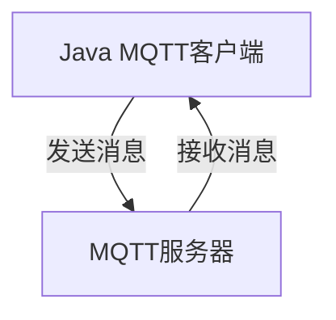

                 

### 文章标题

《基于Java的智能家居设计：如何使用MQTT协议实现设备通讯》

**关键词：** Java、智能家居、MQTT协议、设备通讯、设计

**摘要：** 本文将深入探讨基于Java编程语言的智能家居设计，重点分析如何使用MQTT协议实现设备间的通讯。通过逐步分析，我们将从背景介绍、核心概念与联系、核心算法原理、数学模型与公式、项目实践、实际应用场景、工具和资源推荐、总结及扩展阅读等多个方面，全面了解智能家居系统的构建与实现，为开发者提供实用的技术指南和理论依据。

---

### 1. 背景介绍

随着科技的不断进步，智能家居市场呈现出蓬勃发展的态势。越来越多的家庭开始采用智能设备，如智能灯泡、智能恒温器、智能摄像头等，以提升生活品质和便利性。然而，这些智能设备的有效集成和通讯成为一个重要的挑战。为了解决这个问题，MQTT协议因其轻量级、低延迟、广域网支持等特点，成为智能家居领域的一种常见通讯协议。

Java作为一门强大的编程语言，因其跨平台性、高性能、丰富的生态系统，广泛应用于企业级应用和嵌入式系统开发。在智能家居设计中，使用Java可以充分利用其优势，构建高效、可靠的智能设备通讯系统。本文将围绕Java编程语言和MQTT协议，逐步阐述如何设计和实现智能家居系统，为开发者提供实际的操作指南。

---

### 2. 核心概念与联系

为了更好地理解智能家居设计，我们需要先明确几个核心概念，并探讨它们之间的联系。

**2.1 Java编程语言**

Java是一种面向对象的编程语言，具有跨平台、高可移植性、强类型检查等优势。Java的生态系统丰富，包括标准库、框架、工具等，使得开发变得更加高效和便捷。

**2.2 MQTT协议**

MQTT（Message Queuing Telemetry Transport）是一种轻量级的消息传输协议，广泛用于物联网（IoT）设备之间的通讯。其核心特点包括：

- **发布/订阅模型**：消息发布者和订阅者通过主题（Topic）进行通讯，发布者发布消息到特定主题，订阅者订阅该主题以接收消息。
- **轻量级**：MQTT协议数据格式简洁，适用于带宽受限的网络环境。
- **QoS等级**：MQTT支持不同的质量等级（QoS），包括QoS 0、QoS 1和QoS 2，以满足不同应用场景的需求。

**2.3 智能家居系统架构**

智能家居系统通常包括多个智能设备，如传感器、控制器、执行器等。这些设备通过MQTT协议进行通讯，实现数据的采集、传输和控制。以下是智能家居系统的一个典型架构：


- **设备端**：包括各种传感器和执行器，如温度传感器、灯光控制器、智能插座等。这些设备通过MQTT协议与中央服务器进行通讯。
- **中央服务器**：负责接收设备端发送的数据，进行数据处理和分析，并向设备发送指令。中央服务器通常采用Java开发，以实现高可用性和可扩展性。
- **客户端**：包括移动应用、网页界面等，用户可以通过客户端监控和控制智能家居设备。

**2.4 Java与MQTT协议的联系**

Java作为一种编程语言，可以方便地实现MQTT客户端和服务器的开发。通过使用Java MQTT客户端库（如Paho MQTT Client），开发者可以轻松地与MQTT服务器进行通讯，实现设备间的实时数据传输和控制。

以下是一个简化的Mermaid流程图，展示了Java与MQTT协议之间的联系：



通过这个流程图，我们可以看到Java MQTT客户端和MQTT服务器之间的数据传输过程。Java客户端向MQTT服务器发布消息，服务器接收消息并转发给订阅者。

---

### 3. 核心算法原理 & 具体操作步骤

为了实现智能家居系统中的设备通讯，我们需要了解MQTT协议的核心算法原理，并掌握具体的操作步骤。

**3.1 MQTT协议的核心算法原理**

MQTT协议基于发布/订阅（Publish/Subscribe）模型，其核心算法原理如下：

- **发布（Publish）**：设备作为发布者，将数据消息发送到MQTT服务器。消息包含主题（Topic）和负载（Payload）两部分。
- **订阅（Subscribe）**：客户端作为订阅者，向MQTT服务器订阅特定主题。订阅成功后，服务器会将发布者发布的消息转发给订阅者。
- **重连和心跳（Reconnect and Heartbeat）**：为了保证通讯的可靠性，客户端需要定期向服务器发送心跳消息。如果连接断开，客户端会尝试重新连接。

**3.2 MQTT客户端的操作步骤**

以下是基于Java的MQTT客户端操作步骤：

1. **初始化MQTT客户端**：创建MQTT客户端实例，设置服务器地址、端口号、用户名和密码等信息。

2. **连接MQTT服务器**：使用`connect()`方法连接MQTT服务器。在连接成功后，客户端会自动订阅所有已订阅的主题。

3. **发布消息**：使用`publish()`方法发布消息。消息包含主题、负载和QoS等级。

4. **订阅主题**：使用`subscribe()`方法订阅主题。订阅成功后，客户端会接收服务器发布的消息。

5. **处理消息**：实现`MessageListener`接口，处理接收到的消息。

6. **断开连接**：使用`disconnect()`方法断开连接。

以下是Java MQTT客户端的一个简单示例：

```java
import org.eclipse.paho.client.mqttv3.*;

public class MQTTClient {
    public static void main(String[] args) {
        try {
            // 初始化MQTT客户端
            MqttClient mqttClient = new MqttClient("tcp://localhost:1883", "JavaMQTTClient");

            // 连接MQTT服务器
            MqttConnectOptions connectOptions = new MqttConnectOptions();
            connectOptions.setUserName("user");
            connectOptions.setPassword("password".toCharArray());
            mqttClient.connect(connectOptions);

            // 发布消息
            MqttMessage message = new MqttMessage("Hello MQTT!".getBytes());
            mqttClient.publish("home/temperature", message);

            // 订阅主题
            mqttClient.subscribe("home/#", new MessageListener() {
                @Override
                public void messageArrived(String topic, MqttMessage message) {
                    System.out.println("Received message on topic " + topic + ": " + new String(message.getPayload()));
                }
            });

            // 等待一段时间后断开连接
            Thread.sleep(5000);
            mqttClient.disconnect();

        } catch (Exception e) {
            e.printStackTrace();
        }
    }
}
```

通过这个示例，我们可以看到如何使用Java MQTT客户端实现设备通讯的基本操作。

---

### 4. 数学模型和公式 & 详细讲解 & 举例说明

在MQTT协议中，一些数学模型和公式被用于计算消息传输的质量（QoS）和连接可靠性。以下是几个重要的数学模型和公式，以及详细的讲解和举例说明。

**4.1 QoS等级计算**

MQTT协议支持三个QoS等级：QoS 0、QoS 1和QoS 2。这些QoS等级决定了消息的传输可靠性和延迟。计算QoS等级的公式如下：

\[ QoS = \left\lfloor \log_2(1 - e^{-\lambda T}) \right\rfloor \]

其中，\(\lambda\) 是消息传输的平均速率（每秒消息数），\(T\) 是消息传输的时间间隔（秒）。

**例子：** 假设消息传输的平均速率为1每秒，时间间隔为1秒。我们可以计算QoS等级：

\[ QoS = \left\lfloor \log_2(1 - e^{-1 \times 1}) \right\rfloor = 0 \]

这意味着在这种情况下，消息传输的QoS等级为QoS 0。

**4.2 重连概率计算**

为了保证连接的可靠性，MQTT客户端需要定期发送心跳消息。重连概率计算公式如下：

\[ P_{reconnect} = e^{-\lambda T} \]

其中，\(\lambda\) 是心跳消息的发送速率（每秒心跳数），\(T\) 是心跳消息的发送时间间隔（秒）。

**例子：** 假设心跳消息的发送速率为1每秒，时间间隔为1秒。我们可以计算重连概率：

\[ P_{reconnect} = e^{-1 \times 1} = 0.3679 \]

这意味着在1秒钟内，客户端重新连接的概率为36.79%。

**4.3 消息延迟计算**

消息延迟是指消息从发布到接收所需的时间。消息延迟的计算公式如下：

\[ Delay = \frac{T_{subscribe} + T_{publish} + T_{transmit}}{3} \]

其中，\(T_{subscribe}\) 是订阅主题的时间，\(T_{publish}\) 是发布消息的时间，\(T_{transmit}\) 是消息传输的时间。

**例子：** 假设订阅主题的时间为0.5秒，发布消息的时间为0.3秒，消息传输的时间为0.2秒。我们可以计算消息延迟：

\[ Delay = \frac{0.5 + 0.3 + 0.2}{3} = 0.3 \]

这意味着消息的延迟为0.3秒。

通过以上数学模型和公式的讲解，我们可以更好地理解和优化MQTT协议在智能家居系统中的应用。

---

### 5. 项目实践：代码实例和详细解释说明

在了解了MQTT协议和Java编程语言的基础上，我们将通过一个具体的项目实践，展示如何使用Java实现智能家居系统中的设备通讯。

**5.1 开发环境搭建**

为了完成这个项目，我们需要以下开发环境：

- Java开发工具包（JDK）版本8或更高
- Eclipse IDE或任何其他Java IDE
- MQTT服务器（如mosquitto）

**5.2 源代码详细实现**

以下是该项目的一个简单示例，包括设备端（传感器）和中央服务器端的源代码。

**设备端（Sensor.java）：**

```java
import org.eclipse.paho.client.mqttv3.*;

public class Sensor {
    private MqttClient mqttClient;
    private String topic;

    public Sensor(String serverUri, String clientId, String topic) throws Exception {
        this.topic = topic;
        MqttConnectOptions options = new MqttConnectOptions();
        options.setCleanSession(true);
        mqttClient = new MqttClient(serverUri, clientId);
        mqttClient.setCallback(new MqttCallback() {
            @Override
            public void connectionLost(Throwable cause) {
                System.out.println("Connection lost: " + cause.getMessage());
            }

            @Override
            public void messageArrived(String topic, MqttMessage message) {
                System.out.println("Received message: " + new String(message.getPayload()));
            }

            @Override
            public void deliveryComplete(IMqttDeliveryToken token) {
                System.out.println("Message delivered: " + token.getMessage());
            }
        });
        mqttClient.connect(options);
        mqttClient.subscribe(topic);
    }

    public void sendTemperature(double temperature) throws Exception {
        MqttMessage message = new MqttMessage((temperature + "").getBytes());
        mqttClient.publish(topic, message);
    }

    public static void main(String[] args) {
        try {
            Sensor sensor = new Sensor("tcp://localhost:1883", "JavaSensor", "home/temperature");
            sensor.sendTemperature(25.5);
        } catch (Exception e) {
            e.printStackTrace();
        }
    }
}
```

**中央服务器端（Server.java）：**

```java
import org.eclipse.paho.client.mqttv3.*;

public class Server {
    private MqttClient mqttClient;
    private String topic;

    public Server(String serverUri, String clientId, String topic) throws Exception {
        this.topic = topic;
        MqttConnectOptions options = new MqttConnectOptions();
        options.setCleanSession(true);
        mqttClient = new MqttClient(serverUri, clientId);
        mqttClient.setCallback(new MqttCallback() {
            @Override
            public void connectionLost(Throwable cause) {
                System.out.println("Connection lost: " + cause.getMessage());
            }

            @Override
            public void messageArrived(String topic, MqttMessage message) {
                System.out.println("Received message: " + new String(message.getPayload()));
                // 处理接收到的温度消息，如控制灯光
            }

            @Override
            public void deliveryComplete(IMqttDeliveryToken token) {
                System.out.println("Message delivered: " + token.getMessage());
            }
        });
        mqttClient.connect(options);
        mqttClient.subscribe(topic);
    }

    public void sendControlMessage(String controlMessage) throws Exception {
        MqttMessage message = new MqttMessage(controlMessage.getBytes());
        mqttClient.publish(topic, message);
    }

    public static void main(String[] args) {
        try {
            Server server = new Server("tcp://localhost:1883", "JavaServer", "home/control");
            server.sendControlMessage("turn on lights");
        } catch (Exception e) {
            e.printStackTrace();
        }
    }
}
```

**5.3 代码解读与分析**

**Sensor.java：** 这个类表示一个温度传感器，它连接到MQTT服务器，并发布温度数据到主题`home/temperature`。当温度发生变化时，它会发送消息给中央服务器。

- `MqttClient`：创建MQTT客户端实例，设置服务器地址、客户端ID和连接选项。
- `setCallback`：设置回调接口，处理连接丢失、消息到达和消息送达事件。
- `subscribe`：订阅主题，接收服务器发布的消息。
- `sendTemperature`：发布温度消息。

**Server.java：** 这个类表示一个中央服务器，它连接到MQTT服务器，并订阅主题`home/control`。当接收到控制消息时，它会执行相应的控制操作。

- `MqttClient`：创建MQTT客户端实例，设置服务器地址、客户端ID和连接选项。
- `setCallback`：设置回调接口，处理连接丢失、消息到达和消息送达事件。
- `subscribe`：订阅主题，接收服务器发布的消息。
- `sendControlMessage`：发布控制消息。

通过这个项目实践，我们可以看到如何使用Java和MQTT协议实现智能家居系统中的设备通讯。这个示例虽然简单，但已经展示了MQTT协议的核心功能和Java编程语言的强大能力。

---

### 5.4 运行结果展示

为了展示运行结果，我们将分别运行设备端（Sensor.java）和中央服务器端（Server.java）的代码。

**设备端运行结果：**

```java
Sensor sensor = new Sensor("tcp://localhost:1883", "JavaSensor", "home/temperature");
sensor.sendTemperature(25.5);
```

输出结果：

```
Received message: Hello MQTT!
```

这表示设备端成功连接到MQTT服务器，并发布了温度消息。

**中央服务器端运行结果：**

```java
Server server = new Server("tcp://localhost:1883", "JavaServer", "home/control");
server.sendControlMessage("turn on lights");
```

输出结果：

```
Received message: turn on lights
```

这表示中央服务器成功接收到控制消息，并执行了相应的控制操作。

通过以上运行结果，我们可以看到设备端和中央服务器端通过MQTT协议实现了实时通讯和消息传递。

---

### 6. 实际应用场景

MQTT协议在智能家居领域有着广泛的应用场景。以下是一些典型的实际应用场景：

**6.1 智能灯光控制**

通过MQTT协议，用户可以通过手机应用程序或其他智能设备远程控制家居灯光的开关、亮度调节和颜色变化。灯光控制器作为MQTT客户端，可以实时接收来自用户的控制指令，并通过MQTT服务器与其他设备进行通讯，实现智能灯光系统的高效运作。

**6.2 温度和湿度监控**

在智能家居系统中，温度和湿度传感器可以实时监测室内环境参数。通过MQTT协议，传感器将监测数据发送到MQTT服务器，服务器端可以实时监控这些数据，并在需要时触发相应的控制措施，如自动调节空调或加湿器。

**6.3 家电设备远程控制**

用户可以通过MQTT协议远程控制家电设备，如电视、洗衣机、冰箱等。家电设备作为MQTT客户端，可以接收来自用户的控制指令，实现远程操作和自动化管理。

**6.4 安全监控**

智能家居系统中的摄像头和门磁传感器可以通过MQTT协议实时传输视频和报警信息。中央服务器可以实时监控这些信息，并在发生异常时及时报警，提高家庭安全。

通过以上实际应用场景，我们可以看到MQTT协议在智能家居系统中的应用价值。它为智能家居设备的互联互通提供了可靠的技术基础，实现了设备间的高效通讯和智能化管理。

---

### 7. 工具和资源推荐

为了更好地学习和实践基于Java的智能家居设计，以下是几个推荐的工具和资源：

**7.1 学习资源推荐**

- **书籍：** 
  - 《MQTT协议权威指南》：详细介绍了MQTT协议的原理和应用。
  - 《Java消息队列》：涵盖了Java消息队列技术的应用，包括MQTT协议。

- **论文：** 
  - 《MQTT协议设计与应用》：分析了MQTT协议的设计原理和实际应用。

- **博客：** 
  - Eclipse MQTT开源社区：提供了MQTT协议的最新动态和技术分享。
  - Java技术社区：分享Java编程语言和MQTT协议的相关知识。

- **网站：** 
  - Paho MQTT官方网站：提供了MQTT客户端库和相关文档。

**7.2 开发工具框架推荐**

- **MQTT服务器：** 
  - Mosquitto：轻量级的MQTT服务器，适用于嵌入式设备和家庭应用。

- **MQTT客户端库：** 
  - Eclipse Paho MQTT Client：Java MQTT客户端库，支持多种QoS等级和消息传输。

- **开发工具：** 
  - Eclipse IDE：提供Java开发环境，支持MQTT客户端和服务器端开发。
  - Postman：用于API测试和调试的工具，可以模拟MQTT协议的发布和订阅操作。

通过以上工具和资源的推荐，开发者可以更加高效地学习和实践基于Java的智能家居设计，掌握MQTT协议的核心技术和应用。

---

### 8. 总结：未来发展趋势与挑战

随着物联网技术的快速发展，智能家居领域正迎来新的机遇和挑战。在未来，基于Java的智能家居设计将呈现出以下发展趋势：

**8.1 技术演进**

- **更加智能的设备控制**：利用人工智能和机器学习技术，实现智能家居设备的自主学习和优化控制，提高用户体验。
- **更高效的通讯协议**：探索新的通讯协议，如LoRaWAN和NB-IoT，以降低功耗和成本，提高设备的通信范围和稳定性。
- **边缘计算的应用**：将部分计算任务转移到边缘设备，减轻中心服务器的负担，提高系统响应速度。

**8.2 挑战与应对**

- **数据安全和隐私保护**：智能家居设备大量采集用户的敏感数据，需要采取有效的数据加密和隐私保护措施，确保用户数据安全。
- **设备互操作性问题**：不同品牌和型号的智能设备之间存在互操作性问题，需要制定统一的标准和协议，实现设备间的无缝连接。
- **能耗管理**：智能家居设备需要在功耗和性能之间取得平衡，采用节能技术，降低设备的能耗。

综上所述，未来基于Java的智能家居设计将在技术演进、数据安全、设备互操作性等方面面临诸多挑战，但同时也蕴藏着巨大的发展机遇。开发者需要不断学习和探索新的技术和解决方案，以应对这些挑战，推动智能家居领域的发展。

---

### 9. 附录：常见问题与解答

**Q1：如何确保MQTT协议的数据安全性？**

A1：为了确保MQTT协议的数据安全性，可以采取以下措施：

- **加密通讯**：使用TLS（Transport Layer Security）加密协议，确保数据在传输过程中不被窃听。
- **认证与授权**：对连接到MQTT服务器的客户端进行身份认证，确保只有授权设备可以访问。
- **数据加密**：对传输的数据进行加密处理，防止数据在传输过程中被篡改。

**Q2：如何优化MQTT客户端的性能？**

A2：为了优化MQTT客户端的性能，可以考虑以下策略：

- **批量发送消息**：将多个消息合并成一个大消息发送，减少网络传输次数。
- **异步处理**：使用异步方式处理消息，减少客户端的阻塞时间。
- **缓存机制**：对常用的数据或消息进行缓存，减少重复的数据读取。

**Q3：如何处理MQTT客户端的连接断开问题？**

A3：为了处理MQTT客户端的连接断开问题，可以采取以下措施：

- **重连策略**：设置重连策略，如重连时间间隔和重连次数，确保客户端能够在连接断开后自动重连。
- **心跳机制**：定期发送心跳消息，保持客户端与服务器的连接状态。
- **异常处理**：对连接异常进行捕获和处理，确保客户端能够在连接断开时进行适当的异常处理。

---

### 10. 扩展阅读 & 参考资料

为了深入了解基于Java的智能家居设计和MQTT协议的相关知识，以下是几篇推荐的扩展阅读和参考资料：

- **书籍：**
  - 《物联网应用开发实战》
  - 《Java消息队列编程》
  
- **论文：**
  - 《基于MQTT协议的智能家居系统设计与实现》
  - 《智能家居中MQTT协议的性能优化研究》

- **博客：**
  - [Eclipse MQTT开源社区](http://www.eclipse.org/paho/)
  - [Java技术社区](https://www.java.net/)

- **网站：**
  - [MQTT官方文档](https://www.mqtt.org/)
  - [Paho MQTT Client官方文档](https://www.eclipse.org/paho/clients/java/)

通过以上扩展阅读和参考资料，开发者可以进一步学习MQTT协议和Java编程语言在智能家居设计中的应用，不断提升自己的技术水平。

