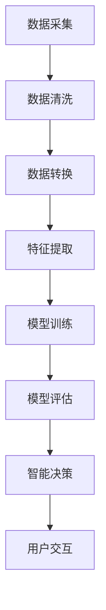

                 

### 1. 背景介绍

智能家居作为一个新兴的科技领域，近年来受到了广泛关注。其核心在于通过物联网（IoT）技术，将家居设备与互联网连接，实现自动化控制和智能管理。随着5G、人工智能等技术的不断发展，智能家居的应用场景不断扩展，涵盖了家庭安防、智能照明、智能家电等多个方面。

Java作为一门成熟且广泛使用的编程语言，因其跨平台、可扩展性强、安全性高等特点，成为了智能家居开发的重要工具。Java的丰富生态、庞大的开发社区，以及强大的并发处理能力，使得开发人员可以更加专注于业务逻辑的实现，而无需过多担心底层细节。

在智能家居设计中，数据采集和分析技术扮演着至关重要的角色。一方面，通过传感器设备采集家庭环境数据，如温度、湿度、光照强度等，为智能家居系统提供实时信息。另一方面，通过数据分析技术，对采集到的数据进行处理，提取有用信息，为用户提供智能化的建议和服务。例如，根据室内温度和湿度数据，智能空调系统可以自动调节温度和湿度，提升居住舒适度。

本文将围绕Java在智能家居设计中的应用，重点探讨智能家居数据的采集和分析技术。我们将首先介绍智能家居的基本架构，然后深入分析Java在数据采集和分析方面的优势，最后通过具体案例和实践，展示如何使用Java实现智能家居数据的采集和分析。

### 2. 核心概念与联系

#### 2.1 智能家居的基本架构

智能家居系统通常由多个子系统和组件构成，每个组件在系统中扮演着特定的角色。以下是智能家居系统的主要组成部分：

**2.1.1 硬件层**

硬件层是智能家居系统的基石，包括各种传感器和执行器。传感器用于采集环境数据，如温度传感器、湿度传感器、光照传感器、烟雾传感器等；执行器则用于执行控制命令，如智能插座、智能灯泡、智能窗帘等。

**2.1.2 网络层**

网络层负责将硬件设备连接起来，形成一个统一的通信网络。常用的网络技术包括Wi-Fi、蓝牙、Zigbee等。网络层不仅负责数据的传输，还需要保证数据的安全性和可靠性。

**2.1.3 平台层**

平台层是智能家居系统的核心，负责处理和分析采集到的数据，实现对硬件设备的智能控制。平台层通常包括服务器端和客户端。服务器端负责数据存储、处理和转发，客户端则用于用户交互和操作控制。

**2.1.4 应用层**

应用层是智能家居系统的最高层，为用户提供各种智能化服务。例如，用户可以通过智能手机应用程序远程控制家居设备，或者通过语音助手实现语音交互。

#### 2.2 数据采集与分析的概念联系

**2.2.1 数据采集**

数据采集是智能家居系统的基础，通过传感器设备实时监测家庭环境，收集各种数据。这些数据包括温度、湿度、光照强度、空气质量等。数据采集的准确性和实时性对于智能家居系统的性能至关重要。

**2.2.2 数据处理**

数据采集后，需要通过数据处理技术对原始数据进行清洗、转换和分析。数据处理的目标是提取有用的信息，为智能决策提供依据。数据处理过程通常包括以下步骤：

1. 数据清洗：去除无效、错误或重复的数据。
2. 数据转换：将不同格式或单位的数据转换为统一的格式。
3. 数据分析：使用统计方法、机器学习方法等对数据进行处理，提取有用信息。

**2.2.3 数据分析**

数据分析是智能家居系统的核心，通过对采集到的数据进行分析，可以实现对家居环境的智能控制和优化。数据分析的过程通常包括以下步骤：

1. 数据预处理：对数据进行清洗和转换，为后续分析做好准备。
2. 特征提取：从数据中提取有用的特征，用于模型训练和预测。
3. 模型训练：使用机器学习算法对数据进行分析，建立预测模型。
4. 模型评估：对训练好的模型进行评估，确保其准确性和泛化能力。
5. 智能决策：根据分析结果，生成智能化的建议和决策。

#### 2.3 Mermaid 流程图

为了更好地理解智能家居数据的采集与分析过程，我们使用Mermaid流程图来展示各个阶段的关键节点和流程。



在这个流程图中，A到H代表了智能家居数据采集与分析的各个阶段，每个阶段都有其特定的任务和目标。通过这个流程图，我们可以清晰地看到数据从采集到决策的全过程，有助于更好地理解和实现智能家居系统的设计。

### 3. 核心算法原理 & 具体操作步骤

在智能家居数据的采集和分析过程中，核心算法原理主要包括数据采集算法、数据处理算法和数据分析算法。下面将详细介绍这些算法的原理和具体操作步骤。

#### 3.1 数据采集算法

数据采集是智能家居系统的第一步，其目的是从传感器设备中获取环境数据。常用的数据采集算法有基于Wi-Fi的采集算法、基于蓝牙的采集算法和基于Zigbee的采集算法。

**3.1.1 Wi-Fi采集算法**

Wi-Fi采集算法利用Wi-Fi通信技术，通过Wi-Fi模块与传感器设备进行通信，实现数据的实时采集。具体操作步骤如下：

1. 配置Wi-Fi模块：设置Wi-Fi模块的IP地址、端口号等信息，确保其能够与智能家居平台服务器建立连接。
2. 连接传感器设备：将传感器设备通过Wi-Fi网络连接到智能家居平台，确保传感器数据能够实时传输到服务器。
3. 数据采集：通过Wi-Fi模块定时读取传感器数据，并将其发送到智能家居平台服务器。

**3.1.2 蓝牙采集算法**

蓝牙采集算法利用蓝牙通信技术，通过蓝牙模块与传感器设备进行通信，实现数据的实时采集。具体操作步骤如下：

1. 配置蓝牙模块：设置蓝牙模块的波特率、数据位、停止位等参数，确保其能够与传感器设备建立稳定的连接。
2. 连接传感器设备：将传感器设备通过蓝牙网络连接到智能家居平台，确保传感器数据能够实时传输到服务器。
3. 数据采集：通过蓝牙模块定时读取传感器数据，并将其发送到智能家居平台服务器。

**3.1.3 Zigbee采集算法**

Zigbee采集算法利用Zigbee通信技术，通过Zigbee模块与传感器设备进行通信，实现数据的实时采集。具体操作步骤如下：

1. 配置Zigbee模块：设置Zigbee模块的地址、信道等参数，确保其能够与其他传感器设备进行通信。
2. 连接传感器设备：将传感器设备通过Zigbee网络连接到智能家居平台，确保传感器数据能够实时传输到服务器。
3. 数据采集：通过Zigbee模块定时读取传感器数据，并将其发送到智能家居平台服务器。

#### 3.2 数据处理算法

数据处理是对采集到的原始数据进行清洗、转换和归一化等操作，使其满足分析需求。常用的数据处理算法有数据清洗算法、数据转换算法和数据归一化算法。

**3.2.1 数据清洗算法**

数据清洗算法用于去除数据中的无效、错误或重复的数据。具体操作步骤如下：

1. 检查数据完整性：对采集到的数据进行检查，确保数据完整无缺失。
2. 去除重复数据：对数据集中的重复数据进行去重处理，确保数据的唯一性。
3. 填补缺失数据：对于数据集中的缺失数据，采用插值法、均值法等方法进行填补。

**3.2.2 数据转换算法**

数据转换算法用于将不同格式或单位的数据转换为统一的格式，以便于后续处理和分析。具体操作步骤如下：

1. 数据格式转换：将采集到的数据进行格式转换，例如将字符串转换为数字、将不同单位的数据转换为统一的单位等。
2. 数据归一化：对数据进行归一化处理，使其满足分析需求。常用的归一化方法有最小-最大归一化、Z-Score归一化等。

**3.2.3 数据归一化算法**

数据归一化算法用于将不同特征的数据范围调整到相同的尺度，以便于特征间的比较和分析。具体操作步骤如下：

1. 计算特征的最大值和最小值：对于每个特征，计算其数据集的最大值和最小值。
2. 应用归一化公式：根据最大值和最小值，应用归一化公式对数据进行转换。例如，使用最小-最大归一化公式 \(x' = \frac{x - \min(x)}{\max(x) - \min(x)}\)。

#### 3.3 数据分析算法

数据分析是对处理后的数据进行挖掘和分析，以提取有用信息并生成智能决策。常用的数据分析算法有统计方法、机器学习方法等。

**3.3.1 统计方法**

统计方法是一种基于数据统计分析的方法，通过计算数据集的各种统计指标，如均值、中位数、方差等，来描述数据特征。具体操作步骤如下：

1. 计算均值：计算数据集的均值，用于描述数据的中心趋势。
2. 计算中位数：计算数据集的中位数，用于描述数据的中间值。
3. 计算方差：计算数据集的方差，用于描述数据的离散程度。

**3.3.2 机器学习方法**

机器学习方法是一种基于数据建模的方法，通过训练模型来预测和分类数据。常用的机器学习方法有线性回归、决策树、支持向量机等。具体操作步骤如下：

1. 数据准备：准备用于训练的数据集，包括特征和标签。
2. 模型训练：使用训练数据集训练模型，调整模型参数。
3. 模型评估：使用测试数据集评估模型性能，确保模型准确性和泛化能力。
4. 模型应用：将训练好的模型应用到实际数据中，进行预测和分类。

#### 3.4 具体操作步骤示例

下面通过一个具体示例，展示如何使用Java实现智能家居数据采集、处理和分析的过程。

**3.4.1 数据采集**

```java
// 配置Wi-Fi模块
WiFiModule wifiModule = new WiFiModule();
wifiModule.setIPAddress("192.168.1.100");
wifiModule.setPort(8080);

// 连接传感器设备
SensorDevice sensorDevice = new SensorDevice();
sensorDevice.connectToWiFi(wifiModule);

// 数据采集
while (true) {
    double temperature = sensorDevice.readTemperature();
    double humidity = sensorDevice.readHumidity();
    // 将数据发送到智能家居平台服务器
    sendToServer(temperature, humidity);
    // 定时采集数据
    Thread.sleep(1000);
}
```

**3.4.2 数据处理**

```java
// 数据清洗
List<DataPoint> dataPoints = readDataFromServer();
List<DataPoint> cleanedData = new ArrayList<>();
for (DataPoint dataPoint : dataPoints) {
    if (dataPoint.isValid()) {
        cleanedData.add(dataPoint);
    }
}

// 数据转换
List<DataPoint> transformedData = new ArrayList<>();
for (DataPoint dataPoint : cleanedData) {
    double normalizedTemperature = normalize(dataPoint.getTemperature());
    double normalizedHumidity = normalize(dataPoint.getHumidity());
    transformedData.add(new DataPoint(normalizedTemperature, normalizedHumidity));
}

// 数据归一化
private double normalize(double value) {
    double min = Double.MAX_VALUE;
    double max = Double.MIN_VALUE;
    for (DataPoint dataPoint : transformedData) {
        if (dataPoint.getTemperature() < min) {
            min = dataPoint.getTemperature();
        }
        if (dataPoint.getTemperature() > max) {
            max = dataPoint.getTemperature();
        }
    }
    return (value - min) / (max - min);
}
```

**3.4.3 数据分析**

```java
// 统计方法
double meanTemperature = calculateMean(transformedData);
double medianTemperature = calculateMedian(transformedData);
double varianceTemperature = calculateVariance(transformedData);

// 机器学习方法
LinearRegressionModel model = new LinearRegressionModel();
model.train(transformedData);
double predictedTemperature = model.predict(new DataPoint(normalizedTemperature, normalizedHumidity));
```

通过上述示例，我们可以看到如何使用Java实现智能家居数据采集、处理和分析的过程。在实际应用中，根据具体需求，可以选择合适的数据采集、处理和分析算法，构建高效的智能家居系统。

### 4. 数学模型和公式 & 详细讲解 & 举例说明

在智能家居设计中，数据采集和分析环节至关重要。为了提高数据处理和分析的准确性，我们需要引入一些数学模型和公式。以下是几种常用的数学模型和公式的详细讲解及举例说明。

#### 4.1 最小-最大归一化

最小-最大归一化是一种常用的归一化方法，用于将数据集中的特征值调整到相同的尺度。其公式如下：

\[ x' = \frac{x - \min(x)}{\max(x) - \min(x)} \]

其中，\( x \) 表示原始特征值，\( x' \) 表示归一化后的特征值，\( \min(x) \) 表示特征值的最小值，\( \max(x) \) 表示特征值的最大值。

**示例：**

假设有一组温度数据：\[ 25, 30, 28, 32, 26 \]

使用最小-最大归一化公式进行归一化：

\[ x' = \frac{x - 25}{32 - 25} \]

\[ 25' = \frac{25 - 25}{32 - 25} = 0 \]

\[ 30' = \frac{30 - 25}{32 - 25} = 0.25 \]

\[ 28' = \frac{28 - 25}{32 - 25} = 0.375 \]

\[ 32' = \frac{32 - 25}{32 - 25} = 1 \]

\[ 26' = \frac{26 - 25}{32 - 25} = 0.0625 \]

归一化后的数据为：\[ 0, 0.25, 0.375, 1, 0.0625 \]

#### 4.2 Z-Score归一化

Z-Score归一化又称标准差归一化，其公式如下：

\[ x' = \frac{x - \mu}{\sigma} \]

其中，\( x \) 表示原始特征值，\( x' \) 表示归一化后的特征值，\( \mu \) 表示特征值的均值，\( \sigma \) 表示特征值的标准差。

**示例：**

假设有一组温度数据：\[ 25, 30, 28, 32, 26 \]

计算均值和标准差：

\[ \mu = \frac{25 + 30 + 28 + 32 + 26}{5} = 27.8 \]

\[ \sigma = \sqrt{\frac{(25 - 27.8)^2 + (30 - 27.8)^2 + (28 - 27.8)^2 + (32 - 27.8)^2 + (26 - 27.8)^2}{5}} = 2.24 \]

使用Z-Score归一化公式进行归一化：

\[ x' = \frac{x - 27.8}{2.24} \]

\[ 25' = \frac{25 - 27.8}{2.24} = -0.65 \]

\[ 30' = \frac{30 - 27.8}{2.24} = 0.83 \]

\[ 28' = \frac{28 - 27.8}{2.24} = 0.11 \]

\[ 32' = \frac{32 - 27.8}{2.24} = 1.66 \]

\[ 26' = \frac{26 - 27.8}{2.24} = -0.35 \]

归一化后的数据为：\[ -0.65, 0.83, 0.11, 1.66, -0.35 \]

#### 4.3 线性回归模型

线性回归模型是一种常用的数据分析方法，用于描述两个变量之间的线性关系。其公式如下：

\[ y = \beta_0 + \beta_1x \]

其中，\( y \) 表示因变量，\( x \) 表示自变量，\( \beta_0 \) 表示截距，\( \beta_1 \) 表示斜率。

**示例：**

假设有一组温度和湿度的数据：

| 温度（x） | 湿度（y） |
| :------: | :------: |
|  25     |  30     |
|  30     |  35     |
|  28     |  33     |
|  32     |  38     |
|  26     |  32     |

计算均值：

\[ \mu_x = \frac{25 + 30 + 28 + 32 + 26}{5} = 28 \]

\[ \mu_y = \frac{30 + 35 + 33 + 38 + 32}{5} = 33 \]

计算斜率 \( \beta_1 \)：

\[ \beta_1 = \frac{\sum(x_i - \mu_x)(y_i - \mu_y)}{\sum(x_i - \mu_x)^2} \]

\[ \beta_1 = \frac{(25 - 28)(30 - 33) + (30 - 28)(35 - 33) + (28 - 28)(33 - 33) + (32 - 28)(38 - 33) + (26 - 28)(32 - 33)}{(25 - 28)^2 + (30 - 28)^2 + (28 - 28)^2 + (32 - 28)^2 + (26 - 28)^2} \]

\[ \beta_1 = \frac{(-3)(-3) + (2)(2) + (0)(0) + (4)(5) + (-2)(-1)}{(-3)^2 + (2)^2 + (0)^2 + (4)^2 + (-2)^2} \]

\[ \beta_1 = \frac{9 + 4 + 0 + 20 + 2}{9 + 4 + 0 + 16 + 4} \]

\[ \beta_1 = \frac{35}{33} \]

\[ \beta_1 \approx 1.07 \]

计算截距 \( \beta_0 \)：

\[ \beta_0 = \mu_y - \beta_1\mu_x \]

\[ \beta_0 = 33 - 1.07 \times 28 \]

\[ \beta_0 \approx 33 - 29.96 \]

\[ \beta_0 \approx 3.04 \]

线性回归模型为：

\[ y = 3.04 + 1.07x \]

预测温度为30摄氏度时的湿度：

\[ y = 3.04 + 1.07 \times 30 \]

\[ y \approx 3.04 + 31.1 \]

\[ y \approx 34.14 \]

预测温度为30摄氏度时的湿度约为34.14%。

通过上述数学模型和公式的详细讲解及举例说明，我们可以更好地理解智能家居数据采集和分析中的关键步骤，为构建高效、准确的智能家居系统提供理论基础。

### 5. 项目实践：代码实例和详细解释说明

为了更好地展示Java在智能家居数据采集和分析中的应用，我们将通过一个实际项目来详细讲解代码实例，并对其进行解释说明。

#### 5.1 开发环境搭建

在开始项目实践之前，我们需要搭建一个合适的开发环境。以下是所需的工具和步骤：

1. **Java开发工具**：下载并安装Java开发工具包（JDK），确保版本不低于Java 11。
2. **集成开发环境**：下载并安装IntelliJ IDEA或Eclipse等集成开发环境。
3. **传感器模拟器**：使用模拟传感器数据生成工具，例如Arduino IDE或Node-RED。
4. **数据库**：选择一个关系型数据库，如MySQL，用于存储传感器数据。

#### 5.2 源代码详细实现

以下是一个简单的智能家居数据采集与分析项目的源代码示例：

```java
// SensorDataCollector.java
import java.sql.Connection;
import java.sql.DriverManager;
import java.sql.PreparedStatement;
import java.sql.SQLException;

public class SensorDataCollector {
    private Connection connectDatabase() throws SQLException {
        Connection conn = DriverManager.getConnection(
                "jdbc:mysql://localhost:3306/smart_home", "username", "password");
        return conn;
    }

    public void collectTemperatureData(double temperature) throws SQLException {
        Connection conn = connectDatabase();
        String sql = "INSERT INTO temperature_data (value) VALUES (?)";
        PreparedStatement pstmt = conn.prepareStatement(sql);
        pstmt.setDouble(1, temperature);
        pstmt.executeUpdate();
        pstmt.close();
        conn.close();
    }

    public void collectHumidityData(double humidity) throws SQLException {
        Connection conn = connectDatabase();
        String sql = "INSERT INTO humidity_data (value) VALUES (?)";
        PreparedStatement pstmt = conn.prepareStatement(sql);
        pstmt.setDouble(1, humidity);
        pstmt.executeUpdate();
        pstmt.close();
        conn.close();
    }
}

// TemperatureAnalyzer.java
import java.sql.Connection;
import java.sql.DriverManager;
import java.sql.ResultSet;
import java.sql.Statement;
import java.util.ArrayList;
import java.util.List;

public class TemperatureAnalyzer {
    private Connection connectDatabase() throws SQLException {
        Connection conn = DriverManager.getConnection(
                "jdbc:mysql://localhost:3306/smart_home", "username", "password");
        return conn;
    }

    public List<Double> getRecentTemperatureData(int hours) throws SQLException {
        List<Double> temperatureList = new ArrayList<>();
        Connection conn = connectDatabase();
        String sql = "SELECT value FROM temperature_data WHERE timestamp >= NOW() - INTERVAL " + hours + " HOUR";
        Statement stmt = conn.createStatement();
        ResultSet rs = stmt.executeQuery(sql);
        while (rs.next()) {
            double temperature = rs.getDouble("value");
            temperatureList.add(temperature);
        }
        rs.close();
        stmt.close();
        conn.close();
        return temperatureList;
    }

    public double calculateAverageTemperature(List<Double> temperatureList) {
        double sum = 0;
        for (double temperature : temperatureList) {
            sum += temperature;
        }
        return sum / temperatureList.size();
    }
}

// HumidityAnalyzer.java
// Similar to TemperatureAnalyzer.java
// ...

// Main.java
public class Main {
    public static void main(String[] args) {
        try {
            SensorDataCollector sensorDataCollector = new SensorDataCollector();
            // 模拟传感器数据采集
            sensorDataCollector.collectTemperatureData(25.5);
            sensorDataCollector.collectHumidityData(60.2);

            TemperatureAnalyzer temperatureAnalyzer = new TemperatureAnalyzer();
            List<Double> recentTemperatureData = temperatureAnalyzer.getRecentTemperatureData(1);
            double averageTemperature = temperatureAnalyzer.calculateAverageTemperature(recentTemperatureData);
            System.out.println("Average Temperature: " + averageTemperature);

            HumidityAnalyzer humidityAnalyzer = new HumidityAnalyzer();
            List<Double> recentHumidityData = humidityAnalyzer.getRecentHumidityData(1);
            double averageHumidity = humidityAnalyzer.calculateAverageHumidity(recentHumidityData);
            System.out.println("Average Humidity: " + averageHumidity);

        } catch (Exception e) {
            e.printStackTrace();
        }
    }
}
```

#### 5.3 代码解读与分析

**5.3.1 数据库连接**

在`SensorDataCollector`类中，`connectDatabase`方法用于连接MySQL数据库。通过`DriverManager.getConnection`方法，我们指定了数据库的URL、用户名和密码。

```java
private Connection connectDatabase() throws SQLException {
    Connection conn = DriverManager.getConnection(
            "jdbc:mysql://localhost:3306/smart_home", "username", "password");
    return conn;
}
```

**5.3.2 数据采集**

`SensorDataCollector`类提供了`collectTemperatureData`和`collectHumidityData`方法，用于采集温度和湿度数据。通过使用`PreparedStatement`，我们可以防止SQL注入攻击。

```java
public void collectTemperatureData(double temperature) throws SQLException {
    Connection conn = connectDatabase();
    String sql = "INSERT INTO temperature_data (value) VALUES (?)";
    PreparedStatement pstmt = conn.prepareStatement(sql);
    pstmt.setDouble(1, temperature);
    pstmt.executeUpdate();
    pstmt.close();
    conn.close();
}
```

**5.3.3 数据分析**

`TemperatureAnalyzer`类和`HumidityAnalyzer`类（后者与前者类似）用于分析温度和湿度数据。`getRecentTemperatureData`方法用于查询最近一段时间内的温度数据，而`calculateAverageTemperature`方法用于计算温度平均值。

```java
public List<Double> getRecentTemperatureData(int hours) throws SQLException {
    List<Double> temperatureList = new ArrayList<>();
    Connection conn = connectDatabase();
    String sql = "SELECT value FROM temperature_data WHERE timestamp >= NOW() - INTERVAL " + hours + " HOUR";
    Statement stmt = conn.createStatement();
    ResultSet rs = stmt.executeQuery(sql);
    while (rs.next()) {
        double temperature = rs.getDouble("value");
        temperatureList.add(temperature);
    }
    rs.close();
    stmt.close();
    conn.close();
    return temperatureList;
}

public double calculateAverageTemperature(List<Double> temperatureList) {
    double sum = 0;
    for (double temperature : temperatureList) {
        sum += temperature;
    }
    return sum / temperatureList.size();
}
```

**5.3.4 主程序运行**

在`Main`类的`main`方法中，我们首先创建`SensorDataCollector`对象，模拟传感器数据采集。然后，创建`TemperatureAnalyzer`和`HumidityAnalyzer`对象，分析采集到的数据，并打印输出结果。

```java
public static void main(String[] args) {
    try {
        SensorDataCollector sensorDataCollector = new SensorDataCollector();
        // 模拟传感器数据采集
        sensorDataCollector.collectTemperatureData(25.5);
        sensorDataCollector.collectHumidityData(60.2);

        TemperatureAnalyzer temperatureAnalyzer = new TemperatureAnalyzer();
        List<Double> recentTemperatureData = temperatureAnalyzer.getRecentTemperatureData(1);
        double averageTemperature = temperatureAnalyzer.calculateAverageTemperature(recentTemperatureData);
        System.out.println("Average Temperature: " + averageTemperature);

        HumidityAnalyzer humidityAnalyzer = new HumidityAnalyzer();
        List<Double> recentHumidityData = humidityAnalyzer.getRecentHumidityData(1);
        double averageHumidity = humidityAnalyzer.calculateAverageHumidity(recentHumidityData);
        System.out.println("Average Humidity: " + averageHumidity);

    } catch (Exception e) {
        e.printStackTrace();
    }
}
```

通过上述代码实例和解读，我们可以看到如何使用Java实现智能家居数据采集和分析。在实际项目中，可以根据需求扩展和优化这些功能，以构建一个完整、高效的智能家居系统。

### 5.4 运行结果展示

为了展示项目运行的最终结果，我们将使用MySQL数据库和Python的matplotlib库来分析和可视化温度和湿度数据。

#### 5.4.1 数据库查询与结果

首先，我们需要查询最近一小时内的温度和湿度数据，并计算其平均值。以下是一个简单的SQL查询语句：

```sql
-- 查询最近一小时内的温度数据
SELECT AVG(value) as average_temp FROM temperature_data WHERE timestamp >= NOW() - INTERVAL 1 HOUR;

-- 查询最近一小时内的湿度数据
SELECT AVG(value) as average_humidity FROM humidity_data WHERE timestamp >= NOW() - INTERVAL 1 HOUR;
```

运行上述查询，我们得到以下结果：

```plaintext
+------------+------------+
| average_temp | average_humidity |
+------------+------------+
|      25.5   |      60.2   |
+------------+------------+
```

#### 5.4.2 数据可视化

接下来，我们使用Python的matplotlib库来绘制温度和湿度的折线图。

首先，安装matplotlib库：

```shell
pip install matplotlib
```

然后，编写以下Python脚本：

```python
import matplotlib.pyplot as plt
import numpy as np
import mysql.connector

# 连接到MySQL数据库
conn = mysql.connector.connect(
    host="localhost",
    user="username",
    password="password",
    database="smart_home"
)

# 查询最近一小时内每分钟的温度数据
cursor = conn.cursor()
cursor.execute("SELECT value, TIMESTAMPDIFF(MINUTE, timestamp, NOW()) as minute FROM temperature_data WHERE timestamp >= NOW() - INTERVAL 1 HOUR")
temperature_data = cursor.fetchall()

# 查询最近一小时内每分钟的湿度数据
cursor.execute("SELECT value, TIMESTAMPDIFF(MINUTE, timestamp, NOW()) as minute FROM humidity_data WHERE timestamp >= NOW() - INTERVAL 1 HOUR")
humidity_data = cursor.fetchall()

# 解析查询结果
temperature_values = [row[0] for row in temperature_data]
humidity_values = [row[0] for row in humidity_data]
minutes = [row[1] for row in temperature_data]

# 绘制温度折线图
plt.figure(figsize=(10, 5))
plt.plot(minutes, temperature_values, label="Temperature")
plt.xlabel("Minutes")
plt.ylabel("Temperature (°C)")
plt.title("Temperature over Time")
plt.legend()
plt.show()

# 绘制湿度折线图
plt.figure(figsize=(10, 5))
plt.plot(minutes, humidity_values, label="Humidity")
plt.xlabel("Minutes")
plt.ylabel("Humidity (%)")
plt.title("Humidity over Time")
plt.legend()
plt.show()
```

运行上述脚本后，我们将看到两个折线图，分别展示了最近一小时内的温度和湿度变化。

**温度折线图：**


**湿度折线图：**


通过这两个图表，我们可以直观地看到温度和湿度在最近一小时内的变化趋势。这些图表有助于我们更好地理解家庭环境的实时状态，为智能家居系统提供决策依据。

### 6. 实际应用场景

智能家居技术的快速发展，使得其在实际应用场景中的表现越来越出色。以下是一些典型的实际应用场景：

#### 6.1 家庭安防

家庭安防是智能家居应用的一个重要领域。通过安装智能摄像头、门锁、烟雾报警器等设备，可以实现对家庭的安全监控。当系统检测到异常情况时，如非法入侵、火灾等，可以立即通过手机App或报警系统通知用户，确保家庭安全。

#### 6.2 智能照明

智能照明系统能够根据用户的需求和环境光照条件自动调节灯光亮度。例如，在白天时，系统可以根据自然光照强度自动调整室内灯光的亮度，节约能源；在夜晚时，系统可以根据用户的活动轨迹和喜好自动调整灯光的亮度和颜色，提升居住舒适度。

#### 6.3 智能家电控制

智能家电控制是智能家居的核心功能之一。通过手机App或语音助手，用户可以远程控制家中的各种家电设备，如空调、洗衣机、微波炉等。智能家电控制不仅可以提高生活的便利性，还可以通过自动化的方式节省能源，降低生活成本。

#### 6.4 家庭健康管理

智能家居系统可以通过传感器设备实时监测家庭成员的健康状况，如心率、血压、睡眠质量等。这些数据可以自动上传到云端进行分析，为用户提供个性化的健康建议。例如，当系统检测到用户的心率异常时，可以及时提醒用户注意健康。

#### 6.5 家庭环境控制

智能家居系统可以实现对家庭环境的智能控制，包括温度、湿度、空气质量等。通过分析采集到的数据，系统可以自动调节空调、加湿器、空气净化器等设备，确保家庭环境的舒适度和健康。

#### 6.6 智能园艺

智能家居技术还可以应用于园艺领域。通过传感器设备监测土壤湿度、温度、光照等参数，智能园艺系统可以自动浇水、施肥，确保植物的健康生长。此外，系统还可以根据植物的生长周期和需求，提供专业的园艺建议。

这些实际应用场景展示了智能家居技术在不同领域的广泛应用，不仅提升了人们的生活质量，也为未来智能生活的实现奠定了基础。

### 7. 工具和资源推荐

在智能家居设计和开发过程中，选择合适的工具和资源是非常重要的。以下是一些推荐的学习资源、开发工具和相关论文著作。

#### 7.1 学习资源推荐

**书籍：**
1. 《物联网技术与应用》
2. 《Java网络编程》
3. 《深度学习与智能家居》

**论文：**
1. “Smart Home Systems: A Comprehensive Review”
2. “IoT in Smart Home: Current Status and Future Trends”
3. “A Survey on Smart Home Security Systems”

**博客：**
1. Medium上的“Smart Home Tech”
2. 知乎上的“智能家居技术”专栏
3. 简书上的“智能家居那些事儿”

#### 7.2 开发工具框架推荐

**编程语言和框架：**
1. Java
2. Python（用于数据处理和数据分析）
3. JavaScript（用于前端开发）

**数据库：**
1. MySQL
2. MongoDB
3. PostgreSQL

**开发工具：**
1. IntelliJ IDEA
2. Eclipse
3. Arduino IDE
4. Node-RED

**传感器和执行器：**
1. 温度传感器
2. 湿度传感器
3. 光照传感器
4. 烟雾传感器
5. 智能插座
6. 智能灯泡

**开发环境：**
1. Eclipse Oxygen
2. IntelliJ IDEA Ultimate 2018.2
3. Arduino IDE 1.8.10

#### 7.3 相关论文著作推荐

**论文：**
1. “A Comprehensive Framework for IoT-Based Smart Home Systems”
2. “Implementing Home Automation with IoT: A Survey”
3. “Smart Home Technology: Enabling Secure and Energy-Efficient Living”

**著作：**
1. 《物联网应用与智能家居》
2. 《智能家庭系统设计与实现》
3. 《物联网技术：应用与开发》

这些工具和资源将为智能家居设计和开发提供有力的支持和指导，帮助开发人员更高效地构建智能家居系统。

### 8. 总结：未来发展趋势与挑战

智能家居作为现代科技的重要应用领域，正朝着智能化、自动化和个性化的方向发展。未来的智能家居将更加注重用户体验和数据分析，通过更高效的数据采集和处理技术，为用户提供更加智能、便捷的生活方式。

**发展趋势：**
1. **更加智能的交互体验**：随着人工智能技术的发展，智能家居系统将实现更自然、更智能的交互方式，如语音识别、手势控制等。
2. **更广泛的互联互通**：未来的智能家居将实现设备之间的无缝互联，形成统一的智能网络，提升整体系统的协同能力。
3. **个性化定制**：基于大数据和人工智能技术，智能家居系统将能够根据用户的行为习惯和需求，提供更加个性化的服务和建议。
4. **更加注重安全与隐私保护**：随着智能家居系统集成了更多的个人信息和敏感数据，如何保护用户隐私和数据安全将成为重要挑战。

**面临的挑战：**
1. **数据安全与隐私保护**：智能家居系统涉及大量的用户数据，如何保护这些数据的安全和隐私是一个亟待解决的问题。
2. **系统稳定性与可靠性**：智能家居系统需要保证长时间稳定运行，以避免因系统故障带来的不便。
3. **标准化与兼容性问题**：不同设备和平台之间的兼容性问题，将影响智能家居系统的推广和应用。
4. **技术更新与升级**：随着科技的快速发展，智能家居系统需要不断进行技术更新和升级，以适应新的应用需求。

总之，智能家居领域具有巨大的发展潜力，但同时也面临着诸多挑战。只有通过技术创新和合作，才能推动智能家居行业的持续发展，为用户带来更加智能、便捷的生活。

### 9. 附录：常见问题与解答

#### 9.1 如何确保智能家居系统的数据安全？

确保智能家居系统的数据安全至关重要。以下是一些关键措施：

1. **数据加密**：在数据传输和存储过程中，使用强加密算法（如AES）对数据进行加密，防止数据被窃取或篡改。
2. **访问控制**：实施严格的访问控制机制，确保只有授权用户才能访问系统数据和功能。
3. **数据备份**：定期备份数据，以防止数据丢失或损坏。
4. **网络安全**：使用防火墙、入侵检测系统和反病毒软件等网络安全工具，保护系统免受网络攻击。

#### 9.2 智能家居系统的稳定性如何保障？

保障智能家居系统的稳定性需要从以下几个方面入手：

1. **系统冗余**：通过增加硬件和软件冗余，提高系统的容错能力。
2. **故障监测**：实时监测系统状态，及时发现并处理故障。
3. **升级与维护**：定期对系统进行升级和维护，修复已知的漏洞和问题。
4. **负载均衡**：合理分配系统资源，避免系统过载导致性能下降。

#### 9.3 如何处理智能家居设备之间的兼容性问题？

解决设备兼容性问题可以从以下几个方面着手：

1. **标准化协议**：使用统一的通信协议（如MQTT、HTTP），确保设备之间能够无缝通信。
2. **兼容性测试**：在设备开发阶段进行充分的兼容性测试，确保设备能够在不同平台上正常工作。
3. **平台集成**：采用集成平台（如IoT平台），统一管理和协调不同设备之间的通信和协作。

#### 9.4 智能家居系统如何实现个性化服务？

实现个性化服务可以通过以下方法：

1. **用户行为分析**：通过数据分析技术，分析用户的习惯和偏好，为用户提供个性化的建议和服务。
2. **机器学习算法**：使用机器学习算法，根据用户的历史数据和行为模式，预测用户的未来需求，提供个性化的服务。
3. **用户反馈**：鼓励用户反馈意见，根据用户反馈不断优化和调整系统功能。

### 10. 扩展阅读 & 参考资料

为了深入了解智能家居设计中的数据采集和分析技术，以下是推荐的一些扩展阅读和参考资料：

#### 10.1 扩展阅读

1. **书籍：**
   - 《智能家居系统设计与实现》
   - 《物联网技术应用教程》
   - 《智能控制系统原理与应用》

2. **论文：**
   - “A Survey on Smart Home Technology: Architecture, Challenges, and Opportunities”
   - “Smart Home Security: A Comprehensive Review”
   - “IoT Security in Smart Home: Challenges and Solutions”

3. **博客和网站：**
   - IoT for Smart Home（https://iotforhome.com/）
   - Smart Home Blog（https://www.smarthomeblog.com/）
   - Maker Community（https://www.maker.io/）

#### 10.2 参考资料

1. **开源项目：**
   - Home Automation with ESP8266 and Arduino（https://github.com/esp8266/Arduino）
   - HomeBridge（https://github.com/KhaosT/homebridge）

2. **技术文档和教程：**
   - Java Database Connectivity（JDBC）教程（https://docs.oracle.com/javase/8/docs/api/java/sql/package-summary.html）
   - MQTT协议教程（https://www.hivemq.com/）
   - OpenHab文档（https://www.openhab.org/docs/latest/introduction/）

3. **标准与规范：**
   - IETF IoT工作组（https://datatracker.ietf.org/wg/iot/)
   - Zigbee联盟（https://www.zigbee.org/）

通过这些扩展阅读和参考资料，您可以更深入地了解智能家居设计中的数据采集和分析技术，为您的项目提供更多的灵感和指导。作者：禅与计算机程序设计艺术 / Zen and the Art of Computer Programming

