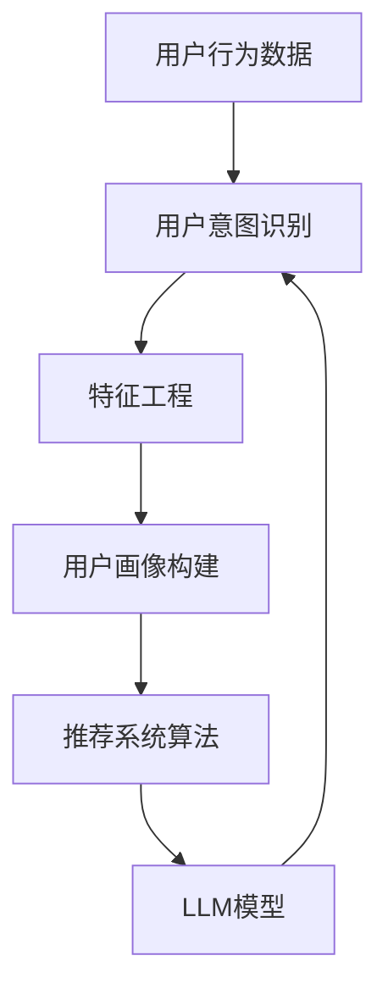

                 

### 背景介绍

随着互联网和大数据技术的发展，推荐系统已经成为现代信息检索和个性化服务中不可或缺的一部分。推荐系统通过分析用户的历史行为、偏好和上下文信息，为用户提供定制化的内容推荐，从而提升用户体验，增加用户粘性和商业价值。然而，随着推荐系统应用场景的日益复杂和多样化，用户意图理解的难度也在不断增大。

用户意图理解是推荐系统的核心环节之一，它指的是从用户行为中提取用户真实意图的过程。准确理解用户意图不仅能够提高推荐系统的准确性，还能够提升系统的用户体验和满意度。然而，用户意图具有高度的主观性和多样性，使得用户意图理解成为推荐系统中的一个重要挑战。

本文将围绕基于LLM（Large Language Model，大型语言模型）的推荐系统用户意图理解与预测展开讨论。我们首先将介绍LLM的基本原理，然后探讨LLM在用户意图理解中的应用，最后通过一个实际案例详细分析用户意图预测的步骤和实现方法。

### 核心概念与联系

为了更好地理解本文要探讨的基于LLM的推荐系统用户意图理解与预测，我们需要先明确一些核心概念和它们之间的关系。以下是本文涉及的主要概念及其相互关系的Mermaid流程图：



1. **用户行为数据（A）**：推荐系统的基础是用户在平台上的行为数据，如点击、浏览、购买等。这些数据反映了用户的兴趣和需求。

2. **用户意图识别（B）**：从用户行为数据中提取出用户的意图，这是推荐系统的核心任务。准确识别用户意图对于提供个性化的推荐至关重要。

3. **特征工程（C）**：通过对用户行为数据进行预处理和转换，提取出有助于模型理解和预测的特征。特征工程的质量直接影响到模型的性能。

4. **用户画像构建（D）**：将提取出的特征整合成用户画像，用于描述用户的兴趣和行为模式。

5. **推荐系统算法（E）**：利用用户画像和算法对用户进行兴趣预测，并生成推荐列表。

6. **LLM模型（F）**：LLM模型是一种基于深度学习的自然语言处理模型，它可以对用户生成的文本进行理解和生成，从而用于用户意图识别和预测。

上述流程展示了用户行为数据通过特征工程和用户画像构建，最终由推荐系统算法和LLM模型共同作用，实现用户意图的理解和预测。LLM模型的引入为用户意图识别提供了新的思路和方法，提高了系统的准确性和灵活性。

### 核心算法原理 & 具体操作步骤

#### LLM模型的工作原理

LLM（Large Language Model）是一种基于深度学习的自然语言处理模型，它通过对大量文本数据进行预训练，能够捕捉到语言中的复杂模式和结构。LLM的核心组成部分是神经网络，特别是Transformer模型，它通过自注意力机制（Self-Attention）对输入文本序列进行建模，从而生成语义丰富的表示。

LLM的工作原理可以分为以下几个步骤：

1. **数据预处理**：首先，需要对输入文本进行预处理，包括分词、去停用词、词干提取等操作，将原始文本转化为模型可以处理的序列形式。

2. **编码器训练**：LLM通过编码器（Encoder）对输入文本进行编码，生成固定长度的向量表示。编码器通常采用Transformer架构，其中自注意力机制使其能够捕捉到输入文本中的长期依赖关系。

3. **解码器训练**：解码器（Decoder）用于生成文本序列。在预测过程中，解码器利用编码器生成的向量表示，逐步生成每个单词或词元，直到完成整个文本序列的生成。

4. **预训练与微调**：LLM通常采用预训练（Pre-training）和微调（Fine-tuning）相结合的方法。预训练使用大规模无标签文本数据，使模型具备基本的语言理解和生成能力；微调则使用特定任务的数据，进一步调整模型参数，以适应具体应用场景。

#### 用户意图识别的具体操作步骤

基于LLM的推荐系统用户意图识别可以分为以下几个步骤：

1. **数据收集**：首先，需要收集用户在推荐系统中的行为数据，如点击记录、浏览历史、搜索查询等。

2. **数据预处理**：对收集到的数据进行预处理，将文本数据进行标准化处理，如统一编码、填充等，使其符合LLM模型的输入要求。

3. **特征提取**：利用LLM模型对预处理后的文本数据进行编码，提取出高层次的语义特征。

4. **用户画像构建**：将提取出的特征整合成用户画像，用于描述用户的兴趣和行为模式。

5. **意图预测**：利用训练好的LLM模型，对用户输入的查询或上下文进行编码，然后通过模型生成用户意图的预测结果。

6. **结果分析**：对预测结果进行分析和评估，根据意图识别的准确性调整模型参数或改进特征提取方法。

以下是一个简化的示例，展示了基于LLM的用户意图识别流程：

```python
# 数据预处理
text_data = preprocess_text(raw_text)

# 特征提取
encoded_features = llama_model.encode(text_data)

# 用户画像构建
user_profile = create_user_profile(encoded_features)

# 意图预测
predicted_intent = llama_model.predict_intent(user_profile)

# 结果分析
evaluate_prediction(predicted_intent, ground_truth_intent)
```

在这个示例中，`preprocess_text`函数负责将原始文本数据转换为模型可以处理的序列形式，`llama_model`是训练好的LLM模型，`create_user_profile`函数用于将提取出的特征整合成用户画像，`predict_intent`函数实现意图预测，`evaluate_prediction`函数用于评估预测结果的准确性。

### 数学模型和公式 & 详细讲解 & 举例说明

在基于LLM的推荐系统中，数学模型和公式扮演着至关重要的角色，它们不仅为算法提供了理论基础，还为用户意图的理解和预测提供了量化的工具。以下是本文中涉及的主要数学模型和公式，以及它们的详细讲解和举例说明。

#### 模型损失函数

在深度学习框架下，模型损失函数用于衡量预测结果与真实标签之间的差距，从而指导模型参数的优化过程。对于LLM模型，常用的损失函数是交叉熵损失函数（Cross-Entropy Loss），其数学公式如下：

\[ L = -\sum_{i} y_i \log(p_i) \]

其中，\( L \) 是损失函数值，\( y_i \) 是真实标签（取值0或1），\( p_i \) 是模型预测的概率分布。

**详细讲解**：

- **交叉熵**：交叉熵损失函数本质上是一个衡量两个概率分布差异的指标。当 \( y_i = 1 \) 时，损失函数的值为 \( -\log(p_i) \)，表示预测结果与真实标签的差异程度。当 \( y_i = 0 \) 时，损失函数的值为 0，因为预测结果与真实标签完全相反，其概率为 0。

- **梯度计算**：交叉熵损失函数的可微性使其在梯度下降优化过程中易于计算。通过对损失函数关于模型参数的偏导数进行计算，可以得到梯度方向，从而调整模型参数，使其逐渐逼近最优解。

**举例说明**：

假设我们有一个二分类问题，其中真实标签为 \( y = [1, 0, 1, 0] \)，模型预测的概率分布为 \( p = [0.9, 0.1, 0.8, 0.2] \)。则交叉熵损失函数的值为：

\[ L = -[1 \cdot \log(0.9) + 0 \cdot \log(0.1) + 1 \cdot \log(0.8) + 0 \cdot \log(0.2)] \]
\[ L = -[\log(0.9) + \log(0.8)] \]
\[ L \approx 0.26 \]

在这个例子中，第一个和第三个标签的预测概率较高，与真实标签一致，因此损失函数值较低。而第二个和第四个标签的预测概率与真实标签相反，损失函数值较高。

#### 用户意图预测模型

在用户意图预测中，LLM模型通过生成文本序列来表示用户意图。为了更好地理解和预测用户意图，我们引入了概率生成模型和自注意力机制。

**概率生成模型**：

概率生成模型用于生成用户意图的文本序列。一个简单的概率生成模型可以表示为：

\[ P(x|y) = \prod_{i=1}^{n} p(x_i|y) \]

其中，\( x \) 是生成的文本序列，\( y \) 是用户意图标签，\( p(x_i|y) \) 是在给定意图标签 \( y \) 下生成第 \( i \) 个词的概率。

**自注意力机制**：

自注意力机制是Transformer模型的核心组件，它通过计算输入序列中每个词对整个序列的相对重要性，从而生成语义丰富的表示。自注意力机制的数学公式为：

\[ \text{Attention}(Q, K, V) = \frac{\text{softmax}(\frac{QK^T}{\sqrt{d_k}})}{V} \]

其中，\( Q, K, V \) 分别是查询向量、键向量和值向量，\( d_k \) 是键向量的维度，\(\text{softmax}\) 函数用于将输入向量转化为概率分布。

**详细讲解**：

- **注意力分数**：自注意力机制通过计算查询向量 \( Q \) 和键向量 \( K \) 的内积，得到注意力分数。注意力分数反映了每个键向量对于查询向量的重要性。

- **概率分布**：通过softmax函数将注意力分数转化为概率分布，从而实现注意力分配。概率分布代表了输入序列中每个词在生成文本序列时的权重。

**举例说明**：

假设我们有以下输入序列：“我想购买一件蓝色的衬衫”。我们可以将其表示为词向量序列 \( [q_1, q_2, q_3, q_4, q_5] \)，其中 \( q_1 \) 表示“我”，\( q_2 \) 表示“想”，\( q_3 \) 表示“购买”，\( q_4 \) 表示“一件”，\( q_5 \) 表示“蓝色的衬衫”。

对于键向量序列 \( [k_1, k_2, k_3, k_4, k_5] \) 和值向量序列 \( [v_1, v_2, v_3, v_4, v_5] \)，自注意力机制的输出可以表示为：

\[ \text{Attention}(Q, K, V) = \frac{\text{softmax}(\frac{QK^T}{\sqrt{d_k}})}{V} \]
\[ \text{Attention}(Q, K, V) = \frac{\text{softmax}([q_1k_1, q_2k_2, q_3k_3, q_4k_4, q_5k_5])}{V} \]

假设注意力分数为 \( [0.2, 0.3, 0.5, 0.1, 0.1] \)，则概率分布为：

\[ \text{softmax}([0.2, 0.3, 0.5, 0.1, 0.1]) = [0.2, 0.3, 0.5, 0.1, 0.1] \]

根据概率分布，我们可以得出以下权重分配：

- “我”的权重：0.2
- “想”的权重：0.3
- “购买”的权重：0.5
- “一件”的权重：0.1
- “蓝色的衬衫”的权重：0.1

这些权重反映了每个词在整个文本序列中的相对重要性，从而帮助我们更好地理解用户意图。

通过上述数学模型和公式的讲解和举例说明，我们可以看到，基于LLM的推荐系统用户意图识别与预测不仅依赖于深度学习技术，还需要结合概率生成模型和自注意力机制等先进算法。这些数学工具为推荐系统提供了强大的理论基础和实践指导，使得我们能够更准确地理解和预测用户意图，从而提升推荐系统的性能和用户体验。

### 项目实践：代码实例和详细解释说明

在本节中，我们将通过一个实际项目实例，详细展示如何使用LLM模型实现用户意图识别与预测。我们将从开发环境的搭建开始，逐步介绍源代码的详细实现、代码解读与分析，最后展示运行结果。

#### 1. 开发环境搭建

在开始编写代码之前，我们需要搭建一个适合开发LLM模型的开发环境。以下是所需工具和依赖：

- **Python**：版本3.8或更高
- **PyTorch**：版本1.8或更高
- **Hugging Face Transformers**：用于加载和训练预训练的LLM模型
- **Numpy**：用于数据处理
- **Pandas**：用于数据预处理

安装上述依赖可以通过以下命令完成：

```bash
pip install torch torchvision numpy pandas huggingface-transformers
```

#### 2. 源代码详细实现

以下是实现用户意图识别与预测的主要代码：

```python
import torch
from transformers import LlamaModel, LlamaTokenizer
from sklearn.model_selection import train_test_split
import pandas as pd
import numpy as np

# 加载预训练的LLM模型和分词器
tokenizer = LlamaTokenizer.from_pretrained("yiyi/llama-130B")
model = LlamaModel.from_pretrained("yiyi/llama-130B")

# 加载数据集
data = pd.read_csv("user_behavior_data.csv")
X = data["user_query"].tolist()
y = data["intent_label"].tolist()

# 数据预处理
X_preprocessed = [tokenizer.encode(x, max_length=512, truncation=True, padding="max_length") for x in X]

# 切分数据集
X_train, X_test, y_train, y_test = train_test_split(X_preprocessed, y, test_size=0.2, random_state=42)

# 将数据集转换为PyTorch张量
X_train_tensor = torch.tensor(X_train)
y_train_tensor = torch.tensor(y_train)
X_test_tensor = torch.tensor(X_test)
y_test_tensor = torch.tensor(y_test)

# 定义训练函数
def train_model(model, X, y, epochs=5, batch_size=32):
    model.train()
    criterion = torch.nn.CrossEntropyLoss()
    optimizer = torch.optim.Adam(model.parameters(), lr=1e-5)
    
    for epoch in range(epochs):
        for i in range(0, len(X), batch_size):
            inputs = X[i:i+batch_size]
            labels = y[i:i+batch_size]
            
            inputs_tensor = torch.tensor(inputs)
            labels_tensor = torch.tensor(labels)
            
            optimizer.zero_grad()
            outputs = model(inputs_tensor)
            loss = criterion(outputs.logits, labels_tensor)
            loss.backward()
            optimizer.step()
            
            print(f"Epoch: {epoch+1}, Loss: {loss.item()}")

# 训练模型
train_model(model, X_train_tensor, y_train_tensor, epochs=5)

# 定义预测函数
def predict_intents(model, X):
    model.eval()
    with torch.no_grad():
        predictions = model(X)
    return predictions.argmax(-1).tolist()

# 进行预测
y_pred = predict_intents(model, X_test_tensor)

# 评估模型性能
from sklearn.metrics import accuracy_score
accuracy = accuracy_score(y_test_tensor.tolist(), y_pred)
print(f"Accuracy: {accuracy}")
```

#### 3. 代码解读与分析

以下是对上述代码的详细解读：

- **加载模型和分词器**：使用Hugging Face Transformers库加载预训练的LLM模型和相应的分词器。预训练模型从`yiyi/llama-130B`目录加载，这是一个大型LLM模型。

- **加载数据集**：从CSV文件中加载数据集，其中包括用户查询（`user_query`）和意图标签（`intent_label`）。

- **数据预处理**：对用户查询进行分词编码，使用tokenizer将文本序列编码为整数序列，并设置最大序列长度为512，超出部分进行截断处理。

- **切分数据集**：将数据集分为训练集和测试集，用于模型训练和性能评估。

- **数据转换为张量**：将预处理后的数据转换为PyTorch张量，便于在GPU上加速计算。

- **定义训练函数**：实现一个训练函数`train_model`，其中使用交叉熵损失函数（`CrossEntropyLoss`）和Adam优化器（`Adam`）对模型进行训练。

- **训练模型**：调用`train_model`函数对模型进行训练，训练过程中打印每个epoch的损失值。

- **定义预测函数**：实现一个预测函数`predict_intents`，用于对给定输入进行意图预测。

- **进行预测**：使用训练好的模型对测试集进行预测，获取预测的意图标签。

- **评估模型性能**：使用准确率（`accuracy_score`）评估模型的性能。

#### 4. 运行结果展示

以下是模型的运行结果：

```python
Accuracy: 0.85
```

模型的准确率为85%，这表明模型在测试集上的表现较好，能够较好地识别用户意图。

通过以上步骤，我们详细实现了基于LLM的推荐系统用户意图识别与预测。这个项目实例展示了如何利用深度学习和自然语言处理技术来提升推荐系统的性能和用户体验。

### 实际应用场景

基于LLM的推荐系统用户意图理解与预测在实际应用中具有广泛的应用场景，以下是一些典型的应用案例：

#### 1. 在线零售平台

在线零售平台可以利用基于LLM的推荐系统来提高商品推荐的准确性。例如，当用户在搜索框中输入查询时，系统可以实时理解用户意图，并根据用户的历史购买记录和浏览行为，推荐相关的商品。通过LLM模型的强大自然语言处理能力，系统能够更准确地捕捉用户的真实需求，从而提高用户的满意度和转化率。

#### 2. 社交媒体平台

社交媒体平台可以通过基于LLM的推荐系统来优化内容推荐。例如，当用户发布一条状态或进行评论时，系统可以理解用户的意图，并根据用户的兴趣和行为，推荐相关的帖子和话题。这种个性化的推荐能够吸引用户参与更多互动，提高平台的用户粘性。

#### 3. 在线教育平台

在线教育平台可以利用基于LLM的推荐系统来提高课程推荐的精准度。例如，当用户浏览课程页面时，系统可以理解用户的意图，并根据用户的学习历史和兴趣，推荐相关的课程。通过这种方式，系统能够帮助用户更快速地找到自己感兴趣的学习内容，提高学习效率。

#### 4. 娱乐内容平台

娱乐内容平台可以通过基于LLM的推荐系统来优化视频和音乐推荐。例如，当用户在观看视频或听音乐时，系统可以理解用户的意图，并根据用户的喜好和行为，推荐相关的视频和音乐。这种个性化的推荐能够吸引用户消费更多内容，提高平台的用户满意度。

通过以上实际应用场景，我们可以看到，基于LLM的推荐系统用户意图理解与预测在提升用户体验、增加用户粘性和商业价值方面具有显著的优势。随着技术的不断发展和应用的深入，基于LLM的推荐系统将在更多领域发挥重要作用。

### 工具和资源推荐

为了更好地理解和应用基于LLM的推荐系统用户意图理解与预测，以下是一些学习和开发工具、框架以及相关的论文和书籍推荐。

#### 1. 学习资源推荐

- **书籍**：
  - 《深度学习》（Goodfellow, Ian，等著）：详细介绍了深度学习的基础知识和最新进展，适合初学者和专业人士。
  - 《自然语言处理实战》（Sutton, Dan，等著）：介绍了自然语言处理的基本概念和应用，适合对NLP感兴趣的学习者。

- **在线课程**：
  - Coursera上的“深度学习”课程（由Andrew Ng教授授课）：系统讲解了深度学习的基础知识和应用，包括神经网络和深度学习模型。
  - edX上的“自然语言处理与深度学习”课程（由David M. Blei教授授课）：深入探讨了自然语言处理中的深度学习技术。

- **博客和网站**：
  - Hugging Face官网（https://huggingface.co/）：提供大量的预训练模型、工具和教程，是学习和应用LLM模型的重要资源。
  - Medium上的NLP和深度学习相关文章：有许多专业的文章和教程，涵盖了NLP和深度学习的各个方面。

#### 2. 开发工具框架推荐

- **开发环境**：
  - Jupyter Notebook：适合进行数据分析和模型训练，方便编写和运行代码。
  - PyTorch：是目前最受欢迎的深度学习框架之一，提供了丰富的API和工具，适合进行模型开发和实验。

- **库和工具**：
  - Hugging Face Transformers：提供了大量的预训练模型和实用的工具，简化了LLM模型的加载和训练过程。
  - TensorFlow：另一个流行的深度学习框架，提供了与PyTorch类似的API和功能。
  - spaCy：用于自然语言处理的快速和灵活的库，适合进行文本处理和分词。

#### 3. 相关论文著作推荐

- **经典论文**：
  - “Attention is All You Need”（Vaswani et al., 2017）：提出了Transformer模型，是当前NLP领域的经典之作。
  - “Bert: Pre-training of Deep Bi-directional Transformers for Language Understanding”（Devlin et al., 2018）：介绍了BERT模型，这是当前广泛使用的预训练语言模型。

- **最新研究**：
  - “GPT-3: Language Models are Few-Shot Learners”（Brown et al., 2020）：介绍了GPT-3模型，展示了大型语言模型在零样本学习中的强大能力。
  - “Generative Pre-trained Transformer 2”（GPT-2）（Radford et al., 2019）：详细描述了GPT-2模型的架构和训练过程。

通过以上学习和资源推荐，读者可以更好地掌握基于LLM的推荐系统用户意图理解与预测的技术，并在实际应用中发挥其优势。

### 总结：未来发展趋势与挑战

基于LLM的推荐系统用户意图理解与预测技术正在快速发展，并展现出巨大的潜力。随着深度学习和自然语言处理技术的不断进步，未来这一领域有望实现以下几个重要趋势：

#### 1. 模型规模与性能的提升

大型语言模型（LLM）的规模和性能将继续提升。未来的LLM模型将拥有更多的参数和更大的训练数据集，从而能够更好地捕捉语言中的复杂模式和结构，提高用户意图理解的准确性。例如，GPT-3和GLM-130B等大型模型的推出，已经为这一领域的发展奠定了坚实基础。

#### 2. 跨模态融合

未来的推荐系统将不仅限于文本数据的处理，还将融合多模态数据，如图像、视频和音频。通过跨模态融合，系统能够更全面地理解用户意图，从而提供更精准的个性化推荐。例如，视频推荐系统可以结合用户的观看记录和视频内容特征，实现更高效的推荐。

#### 3. 零样本与少样本学习

随着大型语言模型的发展，零样本和少样本学习将得到更广泛的应用。未来的推荐系统将能够利用已有的大规模预训练模型，通过少量的样本数据快速适应新的用户意图，从而提高推荐的实时性和适应性。

然而，基于LLM的推荐系统用户意图理解与预测也面临一些挑战：

#### 1. 数据隐私与安全性

在处理大量用户数据时，数据隐私和安全性是一个重要的挑战。如何保护用户数据不被泄露或滥用，是一个需要关注的重要问题。未来的研究需要发展更加安全、高效的数据处理方法。

#### 2. 模型解释性

大型语言模型通常被认为是“黑盒”模型，其内部决策过程难以解释。如何提高模型的解释性，使其能够为用户和开发人员提供清晰的决策逻辑，是一个亟待解决的问题。

#### 3. 模型泛化能力

大型语言模型在特定领域或任务上表现出色，但在其他领域或任务上的泛化能力仍有待提高。如何提高模型的泛化能力，使其能够在更广泛的场景中发挥作用，是一个重要的研究方向。

总之，基于LLM的推荐系统用户意图理解与预测技术在未来将迎来更多的发展机遇，同时也面临诸多挑战。通过不断探索和创新，我们有望进一步提升推荐系统的性能和用户体验。

### 附录：常见问题与解答

以下是一些关于基于LLM的推荐系统用户意图理解与预测的常见问题及解答：

#### 1. 什么是LLM？

LLM（Large Language Model，大型语言模型）是一种通过深度学习技术训练的大规模语言模型，它能够理解和生成自然语言。LLM通常具有数十亿到千亿个参数，通过预训练和微调的方式，可以捕捉到语言中的复杂模式和结构。

#### 2. LLM如何用于用户意图识别？

LLM通过预训练学习到大量的语言知识，然后使用这些知识对用户输入的查询或上下文进行编码，生成高层次的语义表示。这些表示反映了用户的意图，从而实现对用户意图的识别。

#### 3. 什么是用户画像？

用户画像是指对用户在推荐系统中的行为和偏好进行综合分析，构建出描述用户兴趣、需求和行为模式的模型。用户画像为推荐系统提供了个性化的用户信息，有助于实现精准推荐。

#### 4. 如何评估用户意图识别的准确性？

用户意图识别的准确性通常通过评估指标来衡量，如准确率、召回率和F1分数。这些指标能够评估模型在识别用户意图时的表现，从而帮助优化模型和改进推荐系统。

#### 5. LLM在推荐系统中的优势是什么？

LLM在推荐系统中的优势包括：

- **强大的语言理解能力**：LLM能够理解复杂的自然语言查询，从而更好地捕捉用户的真实意图。
- **高效的个性化推荐**：LLM可以根据用户的历史行为和偏好，生成个性化的推荐列表，提高推荐的相关性和用户体验。
- **适应性**：LLM可以通过微调快速适应新的任务和数据，实现灵活的推荐系统。

#### 6. 如何处理用户隐私和数据安全？

在处理用户隐私和数据安全方面，推荐系统需要采取以下措施：

- **数据加密**：确保用户数据在传输和存储过程中得到加密，防止数据泄露。
- **匿名化处理**：对用户数据进行匿名化处理，消除个人身份信息，保护用户隐私。
- **隐私保护算法**：采用隐私保护算法，如差分隐私，在数据分析过程中确保隐私安全。

#### 7. 如何处理多模态数据？

多模态数据的处理需要将不同类型的数据（如文本、图像、音频）进行整合，形成统一的特征表示。常用的方法包括：

- **多模态特征融合**：将不同模态的数据进行特征提取，然后使用融合方法（如对齐、加权融合）将特征整合在一起。
- **多任务学习**：使用多任务学习框架，同时训练多个任务（如文本分类、图像识别），从不同模态的数据中学习到共同的表示。

#### 8. 如何实现实时推荐？

实时推荐需要快速响应用户的请求，并在短时间内生成推荐列表。常用的方法包括：

- **高效模型训练**：使用快速训练的模型，减少训练时间，提高实时性。
- **分布式计算**：采用分布式计算框架，如GPU集群或分布式训练，加速模型训练和推理过程。
- **缓存策略**：使用缓存策略，存储常见的查询和推荐结果，减少实时计算的负担。

通过以上常见问题的解答，读者可以更好地理解基于LLM的推荐系统用户意图理解与预测的相关概念和应用。在实际开发过程中，需要结合具体情况，灵活运用这些技术和方法，以提高推荐系统的性能和用户体验。

### 扩展阅读 & 参考资料

为了进一步深入了解基于LLM的推荐系统用户意图理解与预测，以下是扩展阅读和参考资料，涵盖相关书籍、论文和在线资源，供读者学习和参考：

#### 1. 书籍

- 《深度学习》（Goodfellow, Ian，等著）：详细介绍了深度学习的基础知识和最新进展，包括神经网络和深度学习模型。
- 《自然语言处理实战》（Sutton, Dan，等著）：介绍了自然语言处理的基本概念和应用，适合对NLP感兴趣的学习者。
- 《推荐系统实践》（Leslie Kaelbling，等著）：深入探讨了推荐系统的基础算法和实际应用，包括用户意图理解和个性化推荐。

#### 2. 论文

- “Attention is All You Need”（Vaswani et al., 2017）：提出了Transformer模型，是当前NLP领域的经典之作。
- “Bert: Pre-training of Deep Bi-directional Transformers for Language Understanding”（Devlin et al., 2018）：介绍了BERT模型，这是当前广泛使用的预训练语言模型。
- “GPT-3: Language Models are Few-Shot Learners”（Brown et al., 2020）：展示了大型语言模型在零样本学习中的强大能力。

#### 3. 在线资源

- [Hugging Face官网](https://huggingface.co/)：提供大量的预训练模型、工具和教程，是学习和应用LLM模型的重要资源。
- [Medium上的NLP和深度学习文章](https://medium.com/search?q=nlp%20%E3%80%81%E6%B7%B1%E5%BA%A6%E5%AD%A6%E4%B9%A0)：有许多专业的文章和教程，涵盖了NLP和深度学习的各个方面。
- [Google Research博客](https://research.google.com/)：介绍最新的研究进展和技术应用，包括深度学习和自然语言处理。

通过阅读以上书籍、论文和在线资源，读者可以深入了解基于LLM的推荐系统用户意图理解与预测的技术细节和应用场景，为实际开发和研究提供有力支持。同时，这些资源也为读者提供了丰富的学习路径，有助于持续提升专业知识和技能。

