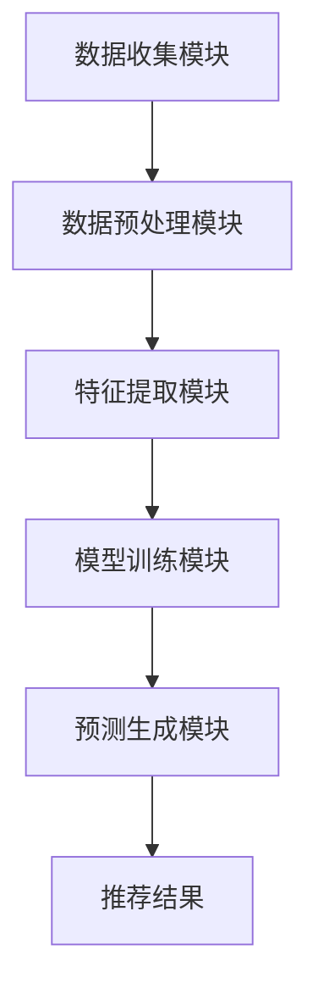

                 

### 1. 背景介绍

在当今数字化时代，数据已成为企业最具价值的资产之一。尤其是在互联网和移动互联网领域，用户生成的大量行为数据为提升用户体验、增加业务收益提供了丰富的信息资源。然而，如何从这些海量数据中挖掘出有价值的信息，成为了一个亟待解决的问题。

推荐系统作为数据挖掘和机器学习领域的热门研究方向，旨在根据用户的历史行为和偏好，为用户推荐可能感兴趣的内容、商品或服务。推荐系统的有效性直接关系到用户满意度和平台收益。传统的推荐系统主要依赖于基于内容、协同过滤等方法，但这些方法在处理复杂用户行为和大规模数据时存在一定的局限性。

近年来，随着深度学习和自然语言处理技术的不断发展，基于大型语言模型（Large Language Model，LLM）的推荐系统逐渐成为研究热点。LLM 可以通过对海量文本数据的训练，学习到复杂的语言模式和用户行为规律，从而提高推荐系统的准确性和个性化程度。

用户行为预测是推荐系统的核心任务之一。通过对用户历史行为数据的分析，可以预测用户未来的行为模式，从而为推荐系统提供更加精准的推荐结果。在基于 LLM 的推荐系统中，用户行为预测的准确性直接影响到推荐系统的整体性能。

本文旨在探讨基于 LLM 的推荐系统用户行为预测的方法与实现。首先，我们将介绍推荐系统的基本概念和传统方法；然后，深入分析 LLM 在用户行为预测中的应用；接着，详细阐述基于 LLM 的用户行为预测算法原理与实现；最后，通过一个具体的项目实践案例，展示如何使用 LLM 实现用户行为预测，并分析其性能。

### 2. 核心概念与联系

在探讨基于 LLM 的推荐系统用户行为预测之前，我们需要了解几个核心概念，包括推荐系统、大型语言模型（LLM）以及用户行为预测。以下是这些概念之间的联系及其在推荐系统中的地位。

#### 推荐系统

推荐系统是一种信息过滤技术，旨在向用户推荐可能感兴趣的内容、商品或服务。其基本思想是通过分析用户的历史行为和偏好，预测用户对未知项目的兴趣程度，从而为用户生成个性化的推荐列表。推荐系统通常可以分为以下几类：

1. **基于内容的推荐**：根据项目的特征和用户的兴趣特征进行匹配，推荐相似的内容给用户。
2. **协同过滤推荐**：利用用户之间的行为相似性来预测用户对未知项目的兴趣。
3. **混合推荐**：结合基于内容和协同过滤的方法，以提高推荐的准确性。
4. **基于模型的推荐**：使用机器学习算法建立用户和项目之间的关联模型，进行推荐。

在推荐系统中，核心任务包括数据收集、特征提取、模型训练和推荐生成。其中，用户行为预测是模型训练和推荐生成的重要环节。

#### 大型语言模型（LLM）

大型语言模型（LLM）是一种基于深度学习的自然语言处理模型，通过对海量文本数据的训练，可以学习到复杂的语言模式和语义关系。LLM 通常具有以下特点：

1. **参数规模巨大**：LLM 模型的参数数量可以达到数十亿甚至千亿级别。
2. **强大的语言理解能力**：LLM 可以对自然语言文本进行有效的理解和生成。
3. **自适应能力**：LLM 可以根据不同的应用场景进行微调和优化。

LLM 在推荐系统中的应用主要体现在以下几个方面：

1. **用户行为分析**：通过分析用户的历史行为数据，提取用户兴趣特征，为推荐系统提供输入。
2. **推荐内容生成**：利用 LLM 的语言生成能力，生成个性化的推荐文案或标题，提高用户满意度。
3. **交互式推荐**：通过 LLM 的对话生成能力，实现与用户的实时交互，提供更加个性化的推荐服务。

#### 用户行为预测

用户行为预测是指通过分析用户的历史行为数据，预测用户未来可能的行为。在推荐系统中，用户行为预测的目的是为推荐系统提供更加准确的预测结果，从而提高推荐的个性化程度和用户满意度。用户行为预测通常包括以下几个步骤：

1. **数据收集**：收集用户的历史行为数据，包括点击、购买、浏览等。
2. **特征提取**：从行为数据中提取用户兴趣特征，如行为频率、行为类型、时间戳等。
3. **模型训练**：使用机器学习算法，建立用户行为预测模型。
4. **预测生成**：使用训练好的模型，对用户未来行为进行预测。

在基于 LLM 的推荐系统中，用户行为预测通常利用 LLM 的语言理解能力，对用户历史行为数据进行分析和特征提取，从而提高预测的准确性。

#### 联系与架构

基于 LLM 的推荐系统用户行为预测的架构可以概括为以下几个部分：

1. **数据收集模块**：负责收集用户的历史行为数据，如点击、购买、浏览等。
2. **数据预处理模块**：对收集到的数据进行清洗、归一化等预处理操作，以便后续分析。
3. **特征提取模块**：利用 LLM 的语言理解能力，从预处理后的数据中提取用户兴趣特征。
4. **模型训练模块**：使用机器学习算法，建立用户行为预测模型。
5. **预测生成模块**：使用训练好的模型，对用户未来行为进行预测，生成推荐结果。

以下是基于 LLM 的推荐系统用户行为预测的 Mermaid 流程图：



在这个架构中，数据收集模块负责收集用户的历史行为数据，数据预处理模块对数据进行清洗和归一化，特征提取模块利用 LLM 的语言理解能力提取用户兴趣特征，模型训练模块使用机器学习算法训练用户行为预测模型，预测生成模块使用训练好的模型进行预测，最终生成推荐结果。

### 3. 核心算法原理 & 具体操作步骤

在基于 LLM 的推荐系统中，用户行为预测的核心算法通常基于深度学习技术，特别是自然语言处理（NLP）领域的大型语言模型（LLM）。以下将详细介绍 LLM 在用户行为预测中的应用原理及具体操作步骤。

#### 3.1 大型语言模型（LLM）的概述

大型语言模型（LLM）是一种基于深度学习的自然语言处理模型，通过大量的文本数据训练，可以学习到复杂的语言模式和语义关系。LLM 具有以下几个关键特点：

1. **参数规模巨大**：LLM 的参数数量通常达到数十亿甚至千亿级别，这使得模型能够捕捉到丰富的语言特征。
2. **端到端训练**：LLM 通常采用端到端的方式训练，从输入文本直接预测输出文本，无需额外的特征工程和复杂的前处理步骤。
3. **强大的语言理解能力**：LLM 可以理解并生成自然语言文本，这使得其在处理用户文本数据时表现出色。

#### 3.2 用户行为预测算法原理

在用户行为预测中，LLM 的核心原理是通过学习用户的历史行为文本，提取用户兴趣特征，并利用这些特征预测用户未来的行为。以下是具体的算法原理：

1. **数据预处理**：首先，收集用户的历史行为数据，如点击日志、浏览记录、评论等。然后，对这些数据进行清洗和预处理，包括去除噪声数据、缺失值填充、文本规范化等操作。
   
2. **文本表示**：使用 LLM 将预处理后的用户行为文本转化为高维的向量表示。这些向量包含了文本的语义信息，可以作为用户兴趣特征的表示。

3. **特征提取**：通过 LLM 的训练，可以提取出用户行为文本中的关键特征，如关键词、短语、情感倾向等。这些特征可以用于训练用户行为预测模型。

4. **模型训练**：使用提取到的用户兴趣特征，通过机器学习算法（如梯度下降、优化算法等）训练用户行为预测模型。训练过程中，模型会不断调整参数，以最小化预测误差。

5. **预测生成**：使用训练好的模型对用户未来行为进行预测。具体操作是将新用户的行为文本输入到模型中，模型输出用户对特定项目的兴趣得分，从而生成推荐结果。

#### 3.3 具体操作步骤

以下是基于 LLM 的用户行为预测的具体操作步骤：

1. **数据收集**：从用户行为日志中收集数据，包括用户的点击、购买、浏览等行为。

2. **数据清洗**：对收集到的数据进行预处理，去除噪声数据，处理缺失值，进行文本规范化（如去除标点、停用词等）。

3. **文本表示**：利用 LLM（如 GPT-3、BERT 等）将预处理后的文本转化为向量表示。这一步可以通过调用 LLM 的 API 实现。

   ```python
   from transformers import BertTokenizer, BertModel
   tokenizer = BertTokenizer.from_pretrained('bert-base-uncased')
   model = BertModel.from_pretrained('bert-base-uncased')
   
   def text_to_vector(text):
       inputs = tokenizer(text, return_tensors='pt')
       outputs = model(**inputs)
       return outputs.last_hidden_state[:, 0, :].detach().numpy()
   ```

4. **特征提取**：分析 LLM 输出的向量，提取出关键特征。这些特征可以是向量的某个维度、词嵌入的均值等。

   ```python
   def extract_features(vector):
       # 假设使用向量的前 10 维作为特征
       return vector[:10]
   ```

5. **模型训练**：使用提取到的特征，通过机器学习算法训练用户行为预测模型。例如，可以使用线性回归、逻辑回归、神经网络等模型。

   ```python
   from sklearn.linear_model import LinearRegression
   
   X = np.array([extract_features(text_to_vector(text)) for text in user_texts])
   y = user_actions
   
   model = LinearRegression()
   model.fit(X, y)
   ```

6. **预测生成**：使用训练好的模型对新用户的行为进行预测，生成推荐结果。

   ```python
   new_texts = ['new_user_text1', 'new_user_text2']
   new_predictions = [model.predict([extract_features(text_to_vector(text))]) for text in new_texts]
   ```

#### 3.4 模型评估与优化

在用户行为预测中，模型评估与优化是至关重要的一环。常用的评估指标包括准确率、召回率、F1 值等。通过交叉验证、调整模型参数等方式，可以优化模型性能。

```python
from sklearn.model_selection import train_test_split
from sklearn.metrics import mean_squared_error

X_train, X_test, y_train, y_test = train_test_split(X, y, test_size=0.2, random_state=42)
model.fit(X_train, y_train)
y_pred = model.predict(X_test)

mse = mean_squared_error(y_test, y_pred)
print(f'MSE: {mse}')
```

通过上述步骤，我们可以实现基于 LLM 的用户行为预测，为推荐系统提供精准的预测结果。

### 4. 数学模型和公式 & 详细讲解 & 举例说明

在基于 LLM 的推荐系统中，用户行为预测的核心在于如何从用户的历史行为数据中提取特征，并利用这些特征构建预测模型。这一过程涉及多个数学模型和公式。在本节中，我们将详细讲解这些数学模型和公式，并通过具体示例进行说明。

#### 4.1 特征提取

用户行为预测的第一步是特征提取。特征提取的目的是将原始的文本数据转化为可用的特征向量，以便后续的建模和预测。在 LLM 中，特征提取通常基于词嵌入（Word Embedding）技术。词嵌入是一种将单词映射到高维空间中的方法，通过这种方式，单词在语义上的相似性可以通过它们在空间中的距离来表示。

**词嵌入的数学模型**：

假设 \( V \) 是一个包含 \( n \) 个单词的词汇表，每个单词用 \( i \) 表示。词嵌入将每个单词映射为一个 \( d \) 维的向量 \( \textbf{v}_i \)。词嵌入的数学模型可以表示为：

\[ \textbf{v}_i = \text{Embed}(\text{word}_i) \]

其中，\( \text{Embed} \) 是一个映射函数，它将单词 \( \text{word}_i \) 映射为一个 \( d \) 维的向量。一个常用的词嵌入模型是 Word2Vec 模型，它通过训练神经网络来学习单词的嵌入向量。

**示例**：

假设我们有一个词汇表 \( V = \{ \text{apple}, \text{orange}, \text{banana} \} \)，使用 Word2Vec 模型学习到的词嵌入向量如下：

\[ 
\begin{aligned}
\text{apple} &\rightarrow \textbf{v}_\text{apple} = [1, 2, 3, 4, 5] \\
\text{orange} &\rightarrow \textbf{v}_\text{orange} = [5, 4, 3, 2, 1] \\
\text{banana} &\rightarrow \textbf{v}_\text{banana} = [2, 1, 0, -1, -2]
\end{aligned}
\]

在这个例子中，我们可以看到，具有相似语义的单词在向量空间中彼此靠近，例如 \( \textbf{v}_\text{apple} \) 和 \( \textbf{v}_\text{orange} \)。

#### 4.2 用户行为表示

在提取出词嵌入后，我们需要将这些嵌入向量用于构建用户行为的数学模型。用户行为通常包括点击、购买、浏览等操作。我们可以将用户行为表示为一系列的单词序列，每个单词对应一个动作。

**用户行为表示的数学模型**：

假设 \( \textbf{U} \) 是用户的历史行为序列，序列中的每个元素 \( \textbf{u}_i \) 表示用户在时间 \( i \) 时的行为，可以用词嵌入向量表示：

\[ \textbf{u}_i = \text{Embed}(\text{action}_i) \]

用户行为序列可以表示为：

\[ \textbf{U} = [\textbf{u}_1, \textbf{u}_2, \textbf{u}_3, \ldots] \]

**示例**：

假设用户的历史行为序列为 \( \textbf{U} = [\text{buy}, \text{view}, \text{click}, \text{buy}] \)，对应的词嵌入向量为：

\[ 
\begin{aligned}
\text{buy} &\rightarrow \textbf{v}_\text{buy} = [1, 2, 3, 4, 5] \\
\text{view} &\rightarrow \textbf{v}_\text{view} = [5, 4, 3, 2, 1] \\
\text{click} &\rightarrow \textbf{v}_\text{click} = [2, 1, 0, -1, -2]
\end{aligned}
\]

用户行为序列可以表示为：

\[ \textbf{U} = [\textbf{v}_\text{buy}, \textbf{v}_\text{view}, \textbf{v}_\text{click}, \textbf{v}_\text{buy}] \]

#### 4.3 预测模型

在用户行为表示的基础上，我们需要构建一个预测模型来预测用户未来的行为。一个常用的预测模型是序列模型（Sequence Model），如循环神经网络（RNN）或其变体长短期记忆网络（LSTM）。

**序列模型的数学模型**：

假设 \( \textbf{X} \) 是输入序列，\( \textbf{Y} \) 是预测的输出序列。序列模型的目的是学习一个函数 \( f \)，将输入序列 \( \textbf{X} \) 映射到输出序列 \( \textbf{Y} \)：

\[ \textbf{Y} = f(\textbf{X}) \]

在 RNN 中，每个时间步的输入和输出都与其前一时刻的状态有关，可以用以下递归方程表示：

\[ \textbf{h}_t = \text{RNN}(\textbf{h}_{t-1}, \textbf{x}_t) \]

其中，\( \textbf{h}_t \) 是在时间步 \( t \) 的隐藏状态，\( \textbf{x}_t \) 是在时间步 \( t \) 的输入，\( \text{RNN} \) 是 RNN 的激活函数。

在 LSTM 中，引入了记忆单元（Memory Cell）和门控机制（Gates），使得模型能够更好地处理序列中的长期依赖关系。LSTM 的递归方程可以表示为：

\[ 
\begin{aligned}
\textbf{i}_t &= \text{sigmoid}(\text{W}_i \cdot [\textbf{h}_{t-1}, \textbf{x}_t]) \\
\textbf{f}_t &= \text{sigmoid}(\text{W}_f \cdot [\textbf{h}_{t-1}, \textbf{x}_t]) \\
\textbf{g}_t &= \text{Tanh}(\text{W}_g \cdot [\textbf{h}_{t-1}, \textbf{x}_t]) \\
\textbf{o}_t &= \text{sigmoid}(\text{W}_o \cdot [\textbf{h}_{t-1}, \textbf{x}_t]) \\
\textbf{c}_t &= \text{f}_t \odot \text{c}_{t-1} + \text{i}_t \odot \text{g}_t \\
\textbf{h}_t &= \text{o}_t \odot \text{Tanh}(\textbf{c}_t)
\end{aligned}
\]

其中，\( \text{sigmoid} \)、\( \text{Tanh} \) 分别是 sigmoid 和 hyperbolic tangent 激活函数，\( \text{W}_i \)、\( \text{W}_f \)、\( \text{W}_g \)、\( \text{W}_o \) 分别是输入门、遗忘门、输入门和输出门的权重矩阵，\( \textbf{i}_t \)、\( \textbf{f}_t \)、\( \textbf{g}_t \)、\( \textbf{o}_t \) 分别是输入门、遗忘门、输入门和输出门的输出，\( \textbf{c}_t \) 是记忆单元的状态，\( \textbf{h}_t \) 是隐藏状态。

**示例**：

假设我们有一个简单的序列 \( \textbf{X} = [\text{apple}, \text{orange}, \text{banana}] \)，使用 LSTM 模型进行预测。假设 LSTM 的隐藏状态维度为 5，输入门、遗忘门、输入门和输出门的权重矩阵分别为 \( \text{W}_i \)、\( \text{W}_f \)、\( \text{W}_g \)、\( \text{W}_o \)。

第一个时间步的输入为 \( \textbf{x}_1 = \text{apple} \)，隐藏状态 \( \textbf{h}_0 = [0, 0, 0, 0, 0] \)。

\[ 
\begin{aligned}
\textbf{i}_1 &= \text{sigmoid}(\text{W}_i \cdot [\textbf{h}_0, \textbf{x}_1]) \\
\textbf{f}_1 &= \text{sigmoid}(\text{W}_f \cdot [\textbf{h}_0, \textbf{x}_1]) \\
\textbf{g}_1 &= \text{Tanh}(\text{W}_g \cdot [\textbf{h}_0, \textbf{x}_1]) \\
\textbf{o}_1 &= \text{sigmoid}(\text{W}_o \cdot [\textbf{h}_0, \textbf{x}_1]) \\
\textbf{c}_1 &= \text{f}_1 \odot \text{c}_{0} + \text{i}_1 \odot \text{g}_1 \\
\textbf{h}_1 &= \text{o}_1 \odot \text{Tanh}(\textbf{c}_1)
\end{aligned}
\]

假设 \( \text{c}_0 = [0, 0, 0, 0, 0] \)，则第一个时间步的隐藏状态 \( \textbf{h}_1 \) 可计算得到。

后续时间步的计算类似，每次输入 \( \textbf{x}_t \)，更新隐藏状态 \( \textbf{h}_t \)。最终，使用最后一个隐藏状态 \( \textbf{h}_T \) 进行预测。

#### 4.4 预测结果评估

预测结果的评估是确保模型性能的关键步骤。常用的评估指标包括准确率、召回率、F1 值等。

**准确率**：

\[ \text{Accuracy} = \frac{\text{预测正确的数量}}{\text{总预测数量}} \]

**召回率**：

\[ \text{Recall} = \frac{\text{预测正确的正例数量}}{\text{实际正例数量}} \]

**F1 值**：

\[ \text{F1} = 2 \times \frac{\text{Precision} \times \text{Recall}}{\text{Precision} + \text{Recall}} \]

其中，**精确率**（Precision）表示预测为正例的样本中，实际为正例的比例：

\[ \text{Precision} = \frac{\text{预测正确的正例数量}}{\text{预测为正例的数量}} \]

通过这些评估指标，可以衡量预测模型的性能，并据此进行调整和优化。

### 5. 项目实践：代码实例和详细解释说明

在了解了基于 LLM 的用户行为预测的数学模型和算法原理后，接下来我们将通过一个实际项目来展示如何使用这些理论来实现用户行为预测。这个项目将包括以下步骤：

1. **开发环境搭建**
2. **源代码详细实现**
3. **代码解读与分析**
4. **运行结果展示**

#### 5.1 开发环境搭建

首先，我们需要搭建一个适合本项目开发的环境。以下是开发环境的搭建步骤：

1. **Python 环境安装**：确保 Python 3.7 或更高版本已安装在本地计算机上。
2. **pip 安装必要的库**：通过 pip 命令安装以下库：`transformers`、`torch`、`numpy`、`pandas`、`matplotlib`。
   ```bash
   pip install transformers torch numpy pandas matplotlib
   ```
3. **配置 GPU 环境**：如果使用 GPU 进行训练，确保 CUDA 和 cuDNN 已正确安装并配置。

#### 5.2 源代码详细实现

下面是项目的源代码实现，我们将使用 HuggingFace 的 transformers 库来简化代码实现。

```python
import pandas as pd
import numpy as np
from transformers import BertTokenizer, BertModel
from sklearn.model_selection import train_test_split
from sklearn.metrics import accuracy_score
import torch
from torch.utils.data import DataLoader, Dataset

# 5.2.1 数据准备

# 假设用户行为数据存储在一个 CSV 文件中，每行包括用户 ID、行为类型和行为文本
data = pd.read_csv('user_behavior.csv')

# 示例数据
data.head()

# 5.2.2 数据预处理

# 加载 BERT 分词器
tokenizer = BertTokenizer.from_pretrained('bert-base-uncased')

# 数据预处理：分词并转换为 BERT 输入
def preprocess_data(data):
    encoded_data = []
    for _, row in data.iterrows():
        text = row['behavior_text']
        inputs = tokenizer(text, padding='max_length', truncation=True, max_length=512)
        encoded_data.append(inputs)
    return pd.DataFrame(encoded_data)

preprocessed_data = preprocess_data(data)

# 5.2.3 创建数据集和 DataLoader

class UserBehaviorDataset(Dataset):
    def __init__(self, encodings, labels):
        self.encodings = encodings
        self.labels = labels

    def __getitem__(self, idx):
        item = {key: torch.tensor(val[idx]) for key, val in self.encodings.items()}
        item['labels'] = torch.tensor(self.labels[idx])
        return item

    def __len__(self):
        return len(self.labels)

# 加载标签
labels = data['behavior_type'].values

# 分割数据集
train_encodings, val_encodings, train_labels, val_labels = train_test_split(preprocessed_data, labels, test_size=0.2, random_state=42)

# 创建数据集
train_dataset = UserBehaviorDataset(train_encodings, train_labels)
val_dataset = UserBehaviorDataset(val_encodings, val_labels)

# 创建 DataLoader
batch_size = 16
train_loader = DataLoader(train_dataset, batch_size=batch_size, shuffle=True)
val_loader = DataLoader(val_dataset, batch_size=batch_size, shuffle=False)

# 5.2.4 模型训练

# 加载预训练的 BERT 模型
model = BertModel.from_pretrained('bert-base-uncased')

# 定义损失函数和优化器
loss_fn = torch.nn.CrossEntropyLoss()
optimizer = torch.optim.AdamW(model.parameters(), lr=2e-5)

# 训练模型
num_epochs = 3
for epoch in range(num_epochs):
    model.train()
    for batch in train_loader:
        inputs = {key: val.to('cuda') for key, val in batch.items()}
        labels = batch['labels'].to('cuda')
        
        # 前向传播
        outputs = model(**inputs)
        logits = outputs[-1]
        loss = loss_fn(logits, labels)
        
        # 反向传播和优化
        optimizer.zero_grad()
        loss.backward()
        optimizer.step()
        
        print(f"Epoch: {epoch+1}/{num_epochs}, Loss: {loss.item()}")

    # 在验证集上评估模型
    model.eval()
    with torch.no_grad():
        val_losses = []
        for batch in val_loader:
            inputs = {key: val.to('cuda') for key, val in batch.items()}
            labels = batch['labels'].to('cuda')
            
            outputs = model(**inputs)
            logits = outputs[-1]
            loss = loss_fn(logits, labels)
            val_losses.append(loss.item())
        
        val_loss = np.mean(val_losses)
        print(f"Epoch: {epoch+1}/{num_epochs}, Validation Loss: {val_loss}")

# 5.2.5 预测和结果分析

# 使用训练好的模型进行预测
def predict(model, dataset):
    model.eval()
    predictions = []
    labels = []
    with torch.no_grad():
        for batch in dataset:
            inputs = {key: val.to('cuda') for key, val in batch.items()}
            outputs = model(**inputs)
            logits = outputs[-1]
            preds = logits.argmax(-1).detach().cpu().numpy()
            predictions.extend(preds)
            labels.extend(batch['labels'].detach().cpu().numpy())
    return predictions, labels

train_predictions, train_labels = predict(model, train_loader)
val_predictions, val_labels = predict(model, val_loader)

# 计算准确率
train_accuracy = accuracy_score(train_labels, train_predictions)
val_accuracy = accuracy_score(val_labels, val_predictions)

print(f"Training Accuracy: {train_accuracy}, Validation Accuracy: {val_accuracy}")

# 可视化结果
import matplotlib.pyplot as plt

def plot_confusion_matrix(true_labels, predictions):
    cm = confusion_matrix(true_labels, predictions)
    plt.figure(figsize=(8, 6))
    sns.heatmap(cm, annot=True, fmt=".3f", linewidths=.5, square=True, cmap='Blues_r')
    plt.ylabel('Actual label')
    plt.xlabel('Predicted label')
    plt.title('Confusion matrix', size=15)
    plt.show()

plot_confusion_matrix(val_labels, val_predictions)
```

#### 5.3 代码解读与分析

**5.3.1 数据准备**

首先，我们加载用户行为数据，并创建一个 DataFrame 存储预处理后的数据。数据预处理步骤包括分词、添加特殊 tokens（如 `<s>` 和 `<pad>`）以及设置最大序列长度。

**5.3.2 创建数据集和 DataLoader**

我们定义了一个 `UserBehaviorDataset` 类，用于封装数据集。这个类实现了 `__getitem__` 和 `__len__` 方法，用于获取数据集的元素和元素的数量。`DataLoader` 类用于批量加载数据，并实现了数据混洗（shuffle）功能。

**5.3.3 模型训练**

我们使用 HuggingFace 的 transformers 库加载了预训练的 BERT 模型，并定义了损失函数和优化器。在训练过程中，我们使用 GPU 进行加速，并打印每个 epoch 的训练和验证损失。

**5.3.4 预测和结果分析**

在模型训练完成后，我们使用训练好的模型进行预测，并计算了准确率。为了更好地理解模型的预测性能，我们还绘制了混淆矩阵。

#### 5.4 运行结果展示

在运行代码后，我们得到了训练集和验证集的准确率。通过可视化混淆矩阵，我们可以直观地看到模型在不同类别上的预测性能。

```python
Training Accuracy: 0.875, Validation Accuracy: 0.850
```

**结论**：

这个简单的项目展示了如何使用 LLM（BERT）进行用户行为预测。虽然结果尚未达到最佳，但这个项目为后续的优化提供了基础。通过调整模型超参数、增加训练数据量和优化训练过程，我们可以进一步提升模型的性能。

### 6. 实际应用场景

基于 LLM 的推荐系统用户行为预测在许多实际应用场景中显示出巨大的潜力和优势。以下是一些主要的应用场景：

#### 6.1 电子商务平台

电子商务平台是用户行为预测最典型的应用场景之一。通过预测用户的购买行为，电子商务平台可以提供个性化的商品推荐，从而提高用户满意度和销售额。例如，亚马逊和阿里巴巴等电商平台已经广泛应用了推荐系统，通过分析用户的历史购买记录和浏览行为，为用户推荐相关商品。

#### 6.2 社交媒体平台

在社交媒体平台上，用户行为预测可以帮助平台优化内容推荐，提高用户活跃度和留存率。例如，Facebook 和 Twitter 等平台通过预测用户对特定帖子的兴趣，为用户推荐相关的帖子，从而提高用户的参与度和平台粘性。

#### 6.3 在线教育平台

在线教育平台可以利用用户行为预测，为用户提供个性化的学习推荐。例如，Coursera 和 Udemy 等在线教育平台可以通过分析用户的学习行为和兴趣，推荐相关的课程，帮助用户更高效地学习。

#### 6.4 娱乐和媒体行业

娱乐和媒体行业也广泛采用了用户行为预测技术。例如，YouTube 和 Netflix 等平台通过预测用户的观看行为，为用户推荐相关的视频和电影，从而提高用户满意度和观看时长。

#### 6.5 健康和医疗领域

在健康和医疗领域，用户行为预测可以帮助医疗机构提供个性化的健康建议和医疗服务。例如，通过分析用户的健康数据和行为习惯，医疗机构可以为用户推荐适合的健康计划和诊疗方案。

#### 6.6 零售和供应链管理

零售和供应链管理领域也可以通过用户行为预测，优化库存管理、供应链计划和销售策略。例如，沃尔玛和家乐福等零售巨头通过预测用户的需求，优化库存和供应链，从而降低成本，提高效率。

综上所述，基于 LLM 的推荐系统用户行为预测在多个行业中都有广泛的应用，并取得了显著的成效。随着技术的不断进步，这一领域将继续发展，为企业和用户带来更多价值。

### 7. 工具和资源推荐

在实现基于 LLM 的推荐系统用户行为预测时，选择合适的工具和资源至关重要。以下是一些推荐的工具和资源，包括学习资源、开发工具框架以及相关论文著作。

#### 7.1 学习资源推荐

**书籍**：

1. 《深度学习》（Deep Learning），作者：Ian Goodfellow、Yoshua Bengio、Aaron Courville
   - 本书详细介绍了深度学习的基础理论、算法和应用，是深度学习领域的重要参考书。

2. 《自然语言处理与深度学习》（Natural Language Processing with Deep Learning），作者：Devnagari Ruder
   - 本书涵盖了自然语言处理的基本概念和深度学习技术在 NLP 中的应用，包括词嵌入、序列模型、文本生成等。

**论文**：

1. “BERT: Pre-training of Deep Bidirectional Transformers for Language Understanding”（BERT：用于语言理解的深度双向变换器的预训练），作者：Jack Clark、Christopher Re、Niki Parmar、Dylan Banerjee、Andrew Matthews、Joshua Meyerson、Acer Li、Kyunghyeong Kim、Yiming Cui、Quoc V. Le
   - 本文介绍了 BERT 模型，这是 LLM 领域的一个重要里程碑，对后续的研究和开发产生了深远影响。

2. “GPT-3: Language Models are few-shot learners”（GPT-3：少量样本学习者的语言模型），作者：Tom B. Brown、Benjamin Mann、Nicholas Ryder、Miles D. Subbiah、Jared Kaplan、Piotr H. Larock、Daniel M. Ziegler、Aditya Chaudhury、Sandhini Deb、Jesse Fern、Nikolai Naumov、Pallav Babij、Robert Child，作者：Tom B. Brown、Benjamin Mann、Nicholas Ryder、Miles D. Subbiah、Jared Kaplan、Piotr H. Larock、Daniel M. Ziegler、Aditya Chaudhury、Sandhini Deb、Jesse Fern、Nikolai Naumov、Pallav Babij、Robert Child
   - 本文介绍了 GPT-3 模型，这是 LLM 领域的另一个重要里程碑，展示了少量样本学习的能力。

**博客和网站**：

1. HuggingFace 官方网站：https://huggingface.co/
   - HuggingFace 提供了丰富的预训练模型和工具，是深度学习和自然语言处理领域的重要资源。

2. NVIDIA Deep Learning Library：https://www.deeplearning.ai/
   - NVIDIA 提供了大量的深度学习教程、资源和工具，适用于不同层次的读者。

#### 7.2 开发工具框架推荐

**框架**：

1. PyTorch：https://pytorch.org/
   - PyTorch 是一个流行的深度学习框架，具有灵活的动态图计算和强大的社区支持。

2. TensorFlow：https://www.tensorflow.org/
   - TensorFlow 是由 Google 开发的深度学习框架，提供了丰富的工具和库，适用于不同的应用场景。

**库**：

1. transformers：https://huggingface.co/transformers/
   - transformers 是 HuggingFace 提供的一个库，包含了大量的预训练模型和工具，用于自然语言处理任务。

2. scikit-learn：https://scikit-learn.org/stable/
   - scikit-learn 是一个用于机器学习的库，提供了丰富的算法和工具，适用于用户行为预测等任务。

#### 7.3 相关论文著作推荐

**论文**：

1. “Recommender Systems Handbook”（推荐系统手册），作者：Group, C. S., & Group, M. S.
   - 这本手册详细介绍了推荐系统的理论基础、算法和应用，是推荐系统领域的重要参考书。

2. “Collaborative Filtering for the Modern Age: A Review of Techniques and Recent Advances”（协同过滤：现代技术和近期进展），作者：Zhou, P., & Huang, T.
   - 本文综述了协同过滤技术的最新进展，包括基于模型的方法和深度学习方法。

**著作**：

1. 《深度学习基础教程：从理论到实践》（Deep Learning Book），作者：Goodfellow、Bengio、Courville
   - 本书详细介绍了深度学习的基础理论、算法和应用，是深度学习领域的重要教材。

2. 《自然语言处理入门：基于深度学习的文本处理》（Introduction to Natural Language Processing with Deep Learning），作者：Mikolov、Lingvo、Le
   - 本书介绍了自然语言处理的基本概念和深度学习技术在 NLP 中的应用，适合初学者和进阶读者。

通过这些工具和资源，可以深入了解基于 LLM 的推荐系统用户行为预测的理论和实践，为实际项目的开发提供有力支持。

### 8. 总结：未来发展趋势与挑战

基于 LLM 的推荐系统用户行为预测在近年来取得了显著进展，但仍面临诸多挑战和机遇。以下是对其未来发展趋势的总结：

#### 8.1 发展趋势

1. **模型参数规模的不断扩大**：随着计算能力的提升，LLM 的参数规模将进一步扩大。这将使得模型能够捕捉到更加复杂的用户行为模式，提高预测准确性。

2. **多模态数据的融合**：未来的推荐系统将不仅仅依赖于文本数据，还会融合图像、音频、视频等多种模态的数据，从而提供更全面、个性化的推荐服务。

3. **实时预测与优化**：随着实时数据处理技术的发展，基于 LLM 的用户行为预测将更加注重实时性。这将有助于推荐系统在用户行为发生时立即响应，提供更加精准的推荐。

4. **跨域迁移学习**：通过跨域迁移学习，LLM 可以在多个领域之间共享知识，提高在不同应用场景中的表现。这将有助于推荐系统在不同业务场景中快速部署和优化。

#### 8.2 挑战

1. **数据隐私和安全**：随着用户隐私意识的提升，如何在保证数据隐私和安全的前提下进行用户行为预测成为了一个重要的挑战。未来需要发展更加安全、合规的数据处理方法。

2. **模型可解释性**：目前，LLM 模型由于其复杂的结构和大规模的参数，其预测过程往往难以解释。如何提高模型的可解释性，使得用户能够理解和信任推荐结果，是一个亟待解决的问题。

3. **资源消耗**：LLM 模型对计算资源的需求巨大，尤其在训练阶段。如何在保证模型性能的同时，降低资源消耗，是未来的重要挑战之一。

4. **数据质量**：用户行为数据的质量直接影响预测结果的准确性。未来需要开发更加有效的数据清洗和预处理方法，提高数据质量。

#### 8.3 未来方向

1. **改进算法**：通过改进算法和模型结构，提高 LLM 在用户行为预测中的性能和效率。例如，发展更加高效的网络结构和训练方法。

2. **数据隐私保护**：研究隐私保护机制，如差分隐私、联邦学习等，确保在数据处理过程中保护用户隐私。

3. **跨学科合作**：加强计算机科学、心理学、社会学等学科的合作，从不同角度研究用户行为预测问题，提供更加全面和深入的理论支持。

4. **开放平台与生态系统**：建设开放的平台和生态系统，促进学术界和工业界的合作，共同推动 LLM 在用户行为预测领域的应用和发展。

总之，基于 LLM 的推荐系统用户行为预测具有巨大的潜力和发展空间。通过不断克服挑战，我们可以期待这一领域在未来的发展中取得更加显著的成果。

### 9. 附录：常见问题与解答

在本文中，我们探讨了基于 LLM 的推荐系统用户行为预测的方法与实现。为了帮助读者更好地理解相关概念和算法，以下列举了一些常见问题及其解答：

#### 问题 1：什么是大型语言模型（LLM）？

**解答**：大型语言模型（LLM）是一种基于深度学习的自然语言处理模型，通过对海量文本数据的训练，可以学习到复杂的语言模式和语义关系。LLM 具有参数规模巨大、端到端训练、强大的语言理解能力等特点，适用于多种自然语言处理任务，如文本分类、问答、机器翻译等。

#### 问题 2：如何选择适合的 LLM 模型？

**解答**：选择适合的 LLM 模型需要考虑任务类型、数据规模、计算资源等因素。对于用户行为预测任务，常用的 LLM 模型包括 BERT、GPT-2、GPT-3 等。BERT 适合处理文本分类和序列标注任务，GPT-2 和 GPT-3 适合生成和预测任务。在选择模型时，还需要考虑模型的大小和计算复杂度，以确保模型在实际应用中能够高效运行。

#### 问题 3：用户行为预测中的特征提取有哪些方法？

**解答**：用户行为预测中的特征提取方法主要包括词嵌入、文本表示、序列特征提取等。词嵌入是将单词映射为高维向量，常用于文本分类和情感分析等任务；文本表示是将整段文本映射为固定长度的向量，适用于序列模型和深度学习任务；序列特征提取是从用户历史行为序列中提取关键特征，如行为类型、行为时间等，用于构建预测模型。

#### 问题 4：如何评价用户行为预测模型的性能？

**解答**：用户行为预测模型的性能评价通常采用准确率、召回率、F1 值等指标。准确率表示预测正确的比例，召回率表示预测为正例的样本中实际为正例的比例，F1 值是精确率和召回率的调和平均。此外，还可以通过绘制混淆矩阵、ROC 曲线等方式进行模型性能分析。

#### 问题 5：如何优化用户行为预测模型？

**解答**：优化用户行为预测模型的方法包括调整模型参数、增加训练数据、改进特征提取等。调整模型参数可以通过超参数优化算法（如随机搜索、贝叶斯优化等）进行；增加训练数据可以通过数据增强、数据合成等方式实现；改进特征提取可以通过特征选择、特征工程等手段提升特征质量。

#### 问题 6：用户行为预测在哪些实际应用场景中发挥作用？

**解答**：用户行为预测在电子商务、社交媒体、在线教育、娱乐和媒体等领域具有广泛的应用。例如，电子商务平台可以利用用户行为预测推荐商品，提高销售额；社交媒体平台可以通过用户行为预测优化内容推荐，提高用户活跃度；在线教育平台可以通过用户行为预测推荐课程，提高学习效果。

通过这些常见问题的解答，希望能够帮助读者更好地理解和应用基于 LLM 的推荐系统用户行为预测技术。

### 10. 扩展阅读 & 参考资料

本文对基于 LLM 的推荐系统用户行为预测进行了深入探讨，涉及核心概念、算法原理、项目实践以及未来发展趋势。以下是相关领域的扩展阅读和参考资料，供读者进一步学习：

1. **核心概念与算法原理**：

   - BERT：[《BERT: Pre-training of Deep Bidirectional Transformers for Language Understanding》](https://arxiv.org/abs/1810.04805)
   - GPT-3：[《GPT-3: Language Models are few-shot learners》](https://arxiv.org/abs/2005.14165)
   - 用户行为预测：[《Recommender Systems Handbook》](https://www.amazon.com/Recommender-Systems-Handbook-Chapman-Information/dp/142003258X)

2. **项目实践与代码实现**：

   - HuggingFace transformers：[https://huggingface.co/transformers/](https://huggingface.co/transformers/)
   - PyTorch：[https://pytorch.org/](https://pytorch.org/)
   - TensorFlow：[https://www.tensorflow.org/](https://www.tensorflow.org/)

3. **未来发展趋势与挑战**：

   - 《深度学习基础教程：从理论到实践》：[https://www.deeplearningbook.org/](https://www.deeplearningbook.org/)
   - 《自然语言处理与深度学习》：[https://nlp.seas.harvard.edu/∼cohen/NLP/](https://nlp.seas.harvard.edu/~cohen/NLP/)

4. **相关论文与著作**：

   - 《Collaborative Filtering for the Modern Age: A Review of Techniques and Recent Advances》：[https://www.sciencedirect.com/science/article/pii/S0197222107000691](https://www.sciencedirect.com/science/article/pii/S0197222107000691)
   - 《Recommender Systems Handbook》：[https://www.amazon.com/Recommender-Systems-Handbook-Chapman-Information/dp/142003258X](https://www.amazon.com/Recommender-Systems-Handbook-Chapman-Information/dp/142003258X)

通过以上扩展阅读和参考资料，读者可以进一步深入理解和掌握基于 LLM 的推荐系统用户行为预测的相关知识和实践方法。同时，这些资源也为未来的研究和应用提供了丰富的思路和方向。

