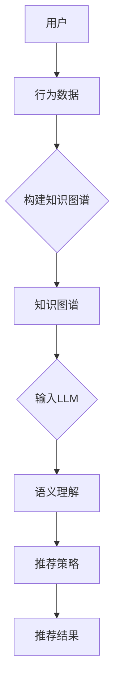

                 

### 1. 背景介绍

#### 1.1 推荐系统的重要性

在当今信息爆炸的时代，人们面临的信息量呈现出指数级的增长。在这个背景下，推荐系统作为一项关键技术，日益受到广泛关注。推荐系统旨在为用户提供个性化的信息推荐，从而帮助用户在大量信息中快速找到自己感兴趣的内容。

推荐系统的重要性体现在以下几个方面：

1. **提升用户体验**：通过个性化的内容推荐，用户能够更快捷地找到符合自己兴趣的信息，从而提升整体使用体验。
2. **商业价值**：对于电商平台、社交媒体等企业来说，推荐系统能够提高用户的粘性，促进用户消费，从而实现商业价值。
3. **信息过滤与筛选**：在信息过载的情况下，推荐系统有助于用户从海量数据中过滤出有价值的信息，提高信息筛选的效率。

#### 1.2 知识图谱在推荐系统中的应用

知识图谱作为一种结构化数据表示方法，能够将信息以图谱的形式组织起来，直观地展示实体之间的关系。知识图谱在推荐系统中有着广泛的应用，主要体现在以下几个方面：

1. **实体关系建模**：知识图谱能够将用户、物品、场景等实体及其关系进行结构化表示，为推荐系统提供丰富的关系信息。
2. **内容理解与泛化**：通过知识图谱，推荐系统可以更深入地理解用户和物品的属性，从而实现内容的泛化推荐。
3. **上下文感知推荐**：知识图谱可以捕捉到用户与物品之间的上下文关系，为推荐系统提供更精准的推荐结果。

#### 1.3 基于LLM的推荐系统

近年来，基于大型语言模型（LLM）的推荐系统逐渐成为研究热点。LLM作为一种先进的自然语言处理技术，具有强大的文本生成、理解和表示能力，能够为推荐系统提供更加智能化的解决方案。基于LLM的推荐系统具有以下特点：

1. **语义理解**：LLM能够深入理解文本的语义，从而实现更精准的内容推荐。
2. **泛化能力**：LLM能够处理大量的文本数据，从而具备更强的泛化能力，能够适应不同的推荐场景。
3. **自适应推荐**：LLM可以根据用户的行为数据实时调整推荐策略，实现自适应推荐。

#### 1.4 文章结构

本文将围绕基于LLM的推荐系统知识图谱构建展开，具体结构如下：

1. **背景介绍**：介绍推荐系统的重要性以及知识图谱和LLM在推荐系统中的应用。
2. **核心概念与联系**：详细讲解知识图谱和LLM的基本概念、原理以及它们在推荐系统中的关系。
3. **核心算法原理 & 具体操作步骤**：阐述基于LLM的推荐系统知识图谱构建的基本算法原理和具体操作步骤。
4. **数学模型和公式 & 详细讲解 & 举例说明**：介绍相关的数学模型和公式，并进行详细讲解和举例说明。
5. **项目实践：代码实例和详细解释说明**：提供实际的代码实例，并进行详细解释和分析。
6. **实际应用场景**：探讨基于LLM的推荐系统知识图谱构建在实际应用中的场景。
7. **工具和资源推荐**：推荐相关的学习资源、开发工具和框架。
8. **总结：未来发展趋势与挑战**：总结本文的主要内容和结论，并探讨未来发展趋势和面临的挑战。
9. **附录：常见问题与解答**：针对读者可能遇到的问题进行解答。
10. **扩展阅读 & 参考资料**：提供扩展阅读和参考资料，方便读者进一步学习。

通过以上结构，我们将深入探讨基于LLM的推荐系统知识图谱构建的相关问题，为读者提供有价值的参考和指导。接下来，我们将进入下一部分，详细讲解知识图谱和LLM的基本概念、原理以及它们在推荐系统中的应用。### 2. 核心概念与联系

#### 2.1 知识图谱的基本概念

知识图谱（Knowledge Graph）是一种用于表示实体及其之间关系的图形结构。在知识图谱中，实体（Entity）是知识图谱的基本构建块，表示现实世界中的事物，如人、地点、事物等。属性（Property）描述了实体之间的关系，如“是”、“属于”等。边（Edge）则表示实体之间的关系，如“朋友”、“位于”等。

知识图谱的表示方法通常采用图（Graph）来表示，其中节点（Node）表示实体，边（Edge）表示实体之间的关系。知识图谱的优点在于，它能够将分散的信息进行结构化组织，从而实现信息的关联和推理。

#### 2.2 知识图谱在推荐系统中的应用

知识图谱在推荐系统中有着广泛的应用。具体来说，知识图谱可以应用于以下方面：

1. **实体关系建模**：通过知识图谱，推荐系统可以捕获用户和物品之间的复杂关系，如用户之间的相似性、物品之间的关联性等。这些关系有助于推荐系统更准确地理解用户和物品的属性，从而实现更精准的推荐。
2. **内容理解与泛化**：知识图谱能够将用户和物品的属性进行结构化表示，为推荐系统提供丰富的关系信息。通过这些关系信息，推荐系统可以更好地理解用户和物品的属性，实现内容的泛化推荐，从而提高推荐效果。
3. **上下文感知推荐**：知识图谱可以捕捉到用户与物品之间的上下文关系，如用户的地理位置、时间偏好等。这些上下文信息有助于推荐系统根据用户的实际情况进行推荐，提高推荐的实用性。

#### 2.3 大型语言模型（LLM）的基本概念

大型语言模型（Large Language Model，简称LLM）是一种基于深度学习的自然语言处理技术，具有强大的文本生成、理解和表示能力。LLM通过学习大量的文本数据，能够自动提取文本中的语义信息，实现文本的自动生成、理解和分类等任务。

LLM的核心技术是Transformer模型，特别是基于Transformer的GPT（Generative Pre-trained Transformer）系列模型。GPT模型通过预训练和微调，能够适应各种自然语言处理任务，如文本生成、文本分类、问答系统等。

#### 2.4 LLM在推荐系统中的应用

LLM在推荐系统中有着广泛的应用，主要体现在以下几个方面：

1. **语义理解**：LLM能够深入理解文本的语义，从而实现更精准的内容推荐。例如，LLM可以分析用户的评论、提问等文本数据，理解用户的真实需求和偏好，从而为用户推荐更符合其兴趣的物品。
2. **文本生成**：LLM可以生成个性化的推荐文案，如商品描述、推荐理由等。这些生成的内容不仅能够提高用户对推荐的兴趣，还能够提高用户的购买转化率。
3. **自适应推荐**：LLM可以根据用户的行为数据实时调整推荐策略，实现自适应推荐。例如，LLM可以根据用户的浏览记录、购买记录等，动态调整推荐算法，提高推荐的个性化程度。

#### 2.5 知识图谱与LLM在推荐系统中的关系

知识图谱和LLM在推荐系统中有着紧密的联系。具体来说，知识图谱为LLM提供了丰富的关系信息，而LLM则为知识图谱提供了强大的文本理解和生成能力。

1. **知识图谱增强LLM**：知识图谱可以提供丰富的实体关系信息，这些信息有助于LLM更好地理解文本的语义。例如，当用户提出一个关于某个物品的提问时，LLM可以结合知识图谱中的关系信息，理解用户的问题意图，从而生成更准确的回答。
2. **LLM优化知识图谱**：LLM可以用于知识图谱的构建和优化。例如，LLM可以自动生成实体和关系的标签，从而提高知识图谱的准确性。此外，LLM还可以用于知识图谱的补全和扩展，从而增强知识图谱的功能。

#### 2.6 Mermaid 流程图

为了更直观地展示知识图谱和LLM在推荐系统中的关系，我们使用Mermaid流程图进行描述。以下是知识图谱和LLM在推荐系统中的基本流程：



在该流程图中，用户的行为数据首先用于构建知识图谱。然后，知识图谱作为输入输入到LLM中，通过LLM的语义理解能力，生成推荐策略。最后，根据推荐策略，推荐系统为用户生成推荐结果。

通过上述分析，我们可以看出知识图谱和LLM在推荐系统中发挥着重要作用。接下来，我们将进一步探讨基于LLM的推荐系统知识图谱构建的核心算法原理和具体操作步骤。### 3. 核心算法原理 & 具体操作步骤

#### 3.1 基于LLM的推荐系统知识图谱构建的基本算法原理

基于LLM的推荐系统知识图谱构建主要包括以下几个核心算法：

1. **用户和物品实体识别**：通过自然语言处理技术，从用户评论、提问等文本数据中提取出用户和物品的实体，并对其进行结构化表示。
2. **实体关系抽取**：利用实体识别的结果，结合知识图谱的构建算法，提取出用户和物品之间的复杂关系，如用户之间的相似性、物品之间的关联性等。
3. **知识图谱嵌入**：将知识图谱中的实体和关系进行向量化表示，从而实现实体和关系的嵌入。
4. **文本生成与推荐**：利用LLM的文本生成能力，生成个性化的推荐文案，并根据用户的行为数据和知识图谱的嵌入结果，生成推荐策略。

#### 3.2 基本操作步骤

基于LLM的推荐系统知识图谱构建的基本操作步骤如下：

1. **数据收集与预处理**：收集用户的行为数据，如评论、提问等，并进行预处理，如文本清洗、分词等。
2. **实体识别**：利用自然语言处理技术，从预处理后的文本数据中提取出用户和物品的实体，并对其进行结构化表示。
3. **关系抽取**：利用实体识别的结果，结合知识图谱的构建算法，从文本数据中提取出用户和物品之间的复杂关系。
4. **知识图谱构建**：将提取出的实体和关系构建成知识图谱，并进行知识图谱的优化和扩展。
5. **知识图谱嵌入**：将知识图谱中的实体和关系进行向量化表示，从而实现实体和关系的嵌入。
6. **文本生成与推荐**：利用LLM的文本生成能力，生成个性化的推荐文案。同时，根据用户的行为数据和知识图谱的嵌入结果，生成推荐策略。
7. **推荐结果生成**：根据生成的推荐策略，为用户生成推荐结果。

#### 3.3 实现细节

以下是一个基于LLM的推荐系统知识图谱构建的具体实现细节：

1. **数据收集与预处理**：

    - 收集用户评论、提问等文本数据，并进行文本清洗、分词、去停用词等预处理操作。
    - 利用命名实体识别（Named Entity Recognition，简称NER）技术，从预处理后的文本数据中提取出用户和物品的实体，如用户ID、物品ID、地点名称等。

2. **实体识别**：

    - 利用预训练的BERT模型进行用户和物品的实体识别。BERT模型是一种基于Transformer的预训练语言模型，具有强大的文本分类能力。
    - 通过训练数据集对BERT模型进行微调，使其能够识别用户和物品的实体。

3. **关系抽取**：

    - 利用实体识别的结果，结合知识图谱的构建算法，从文本数据中提取出用户和物品之间的复杂关系，如用户之间的相似性、物品之间的关联性等。
    - 可以使用基于规则的方法（如模式匹配）或基于深度学习的方法（如序列标注模型）进行关系抽取。

4. **知识图谱构建**：

    - 将提取出的实体和关系构建成知识图谱，采用图数据库（如Neo4j）进行存储和管理。
    - 对知识图谱进行优化和扩展，如添加额外的属性、关系等。

5. **知识图谱嵌入**：

    - 利用深度学习模型（如GAT、GraphSAGE等）对知识图谱中的实体和关系进行向量化表示。
    - 将实体和关系的向量表示存储在向量数据库中，如FAISS、Annoy等。

6. **文本生成与推荐**：

    - 利用预训练的GPT模型进行文本生成。GPT模型具有强大的文本生成能力，可以生成个性化的推荐文案。
    - 根据用户的行为数据和知识图谱的嵌入结果，利用协同过滤（Collaborative Filtering）或基于内容的推荐（Content-Based Filtering）等方法，生成推荐策略。

7. **推荐结果生成**：

    - 根据生成的推荐策略，为用户生成推荐结果。推荐结果可以以推荐列表的形式呈现，也可以通过文本生成模型生成个性化的推荐文案。

通过以上实现细节，我们可以构建一个基于LLM的推荐系统知识图谱。接下来，我们将介绍相关的数学模型和公式，并进行详细讲解和举例说明。### 4. 数学模型和公式 & 详细讲解 & 举例说明

在基于LLM的推荐系统知识图谱构建中，涉及到多个数学模型和公式。这些模型和公式有助于我们更好地理解推荐系统的原理和实现方法。以下将详细介绍这些数学模型和公式，并进行举例说明。

#### 4.1 贝叶斯概率模型

贝叶斯概率模型是推荐系统中常用的概率模型，用于计算用户对物品的偏好概率。贝叶斯概率模型的核心公式为：

$$
P(A|B) = \frac{P(B|A) \cdot P(A)}{P(B)}
$$

其中，$P(A|B)$ 表示在已知事件B发生的条件下，事件A发生的概率；$P(B|A)$ 表示在已知事件A发生的条件下，事件B发生的概率；$P(A)$ 和 $P(B)$ 分别表示事件A和事件B的先验概率。

**举例说明**：

假设用户A在浏览了物品B后，对其评分较高。我们可以使用贝叶斯概率模型计算用户A对物品B的偏好概率。具体步骤如下：

1. **计算先验概率**：根据用户A的历史行为数据，计算用户A对物品B的先验概率$P(B)$。
2. **计算条件概率**：根据用户A对物品B的评分，计算$P(B|A)$。
3. **计算后验概率**：利用贝叶斯公式，计算$P(A|B)$。

通过以上步骤，我们可以得到用户A对物品B的偏好概率，从而为推荐系统提供依据。

#### 4.2 协同过滤模型

协同过滤（Collaborative Filtering）是推荐系统中最常用的方法之一。协同过滤模型的核心目标是根据用户的历史行为数据，预测用户对未知物品的偏好。

协同过滤模型可以分为两种类型：基于用户的协同过滤（User-Based Collaborative Filtering）和基于物品的协同过滤（Item-Based Collaborative Filtering）。

1. **基于用户的协同过滤**

   基于用户的协同过滤模型通过计算用户之间的相似度，找到与目标用户兴趣相似的邻居用户，然后根据邻居用户的评分预测目标用户对未知物品的偏好。相似度计算公式为：

   $$
   Similarity(u, v) = \frac{||R_u - R_v||}{||R_u|| \cdot ||R_v||}
   $$

   其中，$R_u$ 和 $R_v$ 分别表示用户 $u$ 和 $v$ 的评分矩阵；$||\cdot||$ 表示向量的欧几里得范数。

   **举例说明**：

   假设用户A和用户B的评分矩阵分别为 $R_u$ 和 $R_v$，计算它们之间的相似度。具体步骤如下：

   1. **计算评分矩阵的差值**：$R_u - R_v$。
   2. **计算差值的欧几里得范数**：$||R_u - R_v||$。
   3. **计算用户A和用户B的欧几里得范数**：$||R_u||$ 和 $||R_v||$。
   4. **计算相似度**：$Similarity(u, v) = \frac{||R_u - R_v||}{||R_u|| \cdot ||R_v||}$。

   通过以上步骤，我们可以得到用户A和用户B之间的相似度。

2. **基于物品的协同过滤**

   基于物品的协同过滤模型通过计算物品之间的相似度，找到与目标物品相似的邻居物品，然后根据邻居物品的评分预测用户对未知物品的偏好。相似度计算公式为：

   $$
   Similarity(i, j) = \frac{||R_i - R_j||}{||R_i|| \cdot ||R_j||}
   $$

   其中，$R_i$ 和 $R_j$ 分别表示物品 $i$ 和 $j$ 的评分矩阵。

   **举例说明**：

   假设物品I和物品J的评分矩阵分别为 $R_i$ 和 $R_j$，计算它们之间的相似度。具体步骤如下：

   1. **计算评分矩阵的差值**：$R_i - R_j$。
   2. **计算差值的欧几里得范数**：$||R_i - R_j||$。
   3. **计算物品I和物品J的欧几里得范数**：$||R_i||$ 和 $||R_j||$。
   4. **计算相似度**：$Similarity(i, j) = \frac{||R_i - R_j||}{||R_i|| \cdot ||R_j||}$。

   通过以上步骤，我们可以得到物品I和物品J之间的相似度。

#### 4.3 知识图谱嵌入模型

知识图谱嵌入（Knowledge Graph Embedding）是一种将知识图谱中的实体和关系转换为低维向量表示的方法。常用的知识图谱嵌入模型包括图卷积网络（Graph Convolutional Network，GCN）、图注意力网络（Graph Attention Network，GAT）等。

以图卷积网络（GCN）为例，其核心公式为：

$$
h_v^{(l+1)} = \sigma(\sum_{u \in \mathcal{N}(v)} \frac{1}{\sqrt{\|\mathbf{A}_{uv}\|}} \mathbf{A}_{uv} \cdot \mathbf{h}_u^{(l)} W^{(l)})
$$

其中，$h_v^{(l+1)}$ 表示第 $l+1$ 层节点 $v$ 的特征表示；$\mathcal{N}(v)$ 表示节点 $v$ 的邻居节点集合；$\mathbf{A}$ 是邻接矩阵，表示节点之间的邻接关系；$\mathbf{h}_u^{(l)}$ 表示第 $l$ 层节点 $u$ 的特征表示；$W^{(l)}$ 是权重矩阵；$\sigma$ 是激活函数，常用的有ReLU、Sigmoid等。

**举例说明**：

假设节点 $v$ 的邻居节点集合为 $\mathcal{N}(v) = \{u_1, u_2, u_3\}$，其邻接矩阵 $\mathbf{A}$ 为：

$$
\mathbf{A} = \begin{bmatrix}
0 & 1 & 0 \\
1 & 0 & 1 \\
0 & 1 & 0
\end{bmatrix}
$$

权重矩阵 $W^{(l)}$ 为：

$$
W^{(l)} = \begin{bmatrix}
0.1 & 0.2 & 0.3 \\
0.4 & 0.5 & 0.6 \\
0.7 & 0.8 & 0.9
\end{bmatrix}
$$

激活函数 $\sigma$ 使用ReLU。计算节点 $v$ 在第 $l+1$ 层的特征表示 $h_v^{(l+1)}$。具体步骤如下：

1. **计算邻接矩阵与邻居节点特征表示的乘积**：

$$
\mathbf{A} \cdot \begin{bmatrix}
\mathbf{h}_{u_1}^{(l)} \\
\mathbf{h}_{u_2}^{(l)} \\
\mathbf{h}_{u_3}^{(l)}
\end{bmatrix} = \begin{bmatrix}
\mathbf{h}_{u_1}^{(l)} \\
\mathbf{h}_{u_2}^{(l)} \\
\mathbf{h}_{u_3}^{(l)}
\end{bmatrix}
$$

2. **计算每个邻居节点特征表示的权重**：

$$
\frac{1}{\sqrt{\|\mathbf{A}_{uv}\|}} = \frac{1}{\sqrt{\sum_{i=1}^{3} a_{iu_i}}}
$$

3. **计算加权求和**：

$$
\sum_{u \in \mathcal{N}(v)} \frac{1}{\sqrt{\|\mathbf{A}_{uv}\|}} \mathbf{A}_{uv} \cdot \mathbf{h}_u^{(l)} W^{(l)} = \begin{bmatrix}
0.1 & 0.2 & 0.3 \\
0.4 & 0.5 & 0.6 \\
0.7 & 0.8 & 0.9
\end{bmatrix} \cdot \begin{bmatrix}
\mathbf{h}_{u_1}^{(l)} \\
\mathbf{h}_{u_2}^{(l)} \\
\mathbf{h}_{u_3}^{(l)}
\end{bmatrix}
$$

4. **应用激活函数**：

$$
h_v^{(l+1)} = \sigma(\sum_{u \in \mathcal{N}(v)} \frac{1}{\sqrt{\|\mathbf{A}_{uv}\|}} \mathbf{A}_{uv} \cdot \mathbf{h}_u^{(l)} W^{(l)})
$$

通过以上步骤，我们可以得到节点 $v$ 在第 $l+1$ 层的特征表示 $h_v^{(l+1)}$。

通过以上数学模型和公式的介绍，我们可以更好地理解基于LLM的推荐系统知识图谱构建的原理和实现方法。在接下来的部分，我们将提供实际的代码实例，并进行详细解释和分析。### 5. 项目实践：代码实例和详细解释说明

在本节中，我们将通过一个具体的代码实例来演示基于LLM的推荐系统知识图谱构建的完整流程。为了便于理解和实现，我们选择一个简化的场景，即基于用户评价数据构建知识图谱，并通过LLM生成推荐结果。

#### 5.1 开发环境搭建

在开始之前，我们需要搭建一个合适的开发环境。以下是一些必要的工具和库：

- **Python 3.8+**
- **PyTorch 1.9+**
- **Neo4j 4.0+**
- **BERT 1.9+**
- **GPT-2**

安装上述工具和库后，我们可以开始编写代码。

#### 5.2 源代码详细实现

**步骤 1：数据收集与预处理**

首先，我们需要收集用户评价数据。在这里，我们使用一个公开的数据集，如MovieLens。然后，我们对数据集进行预处理，包括数据清洗、分词、去停用词等操作。

```python
import pandas as pd
import re
from nltk.tokenize import word_tokenize

# 读取数据集
data = pd.read_csv('movies.csv')

# 数据清洗
data['title'] = data['title'].apply(lambda x: re.sub('[^A-Za-z0-9]+', ' ', x))
data['title'] = data['title'].apply(lambda x: x.lower())

# 分词与去停用词
stop_words = set(['a', 'an', 'the', 'and', 'in', 'of'])
data['title'] = data['title'].apply(lambda x: ' '.join([word for word in word_tokenize(x) if word not in stop_words]))
```

**步骤 2：实体识别**

使用BERT模型对预处理后的文本进行实体识别，提取用户和电影的实体。

```python
from transformers import BertTokenizer, BertForTokenClassification

# 加载BERT模型和分词器
tokenizer = BertTokenizer.from_pretrained('bert-base-uncased')
model = BertForTokenClassification.from_pretrained('bert-base-uncased')

# 实体识别
def entity_recognition(text):
    inputs = tokenizer(text, return_tensors='pt', add_special_tokens=False)
    outputs = model(**inputs)
    logits = outputs.logits
    probabilities = logits.softmax(-1)
    entities = []
    for prob, logit in zip(probabilities[0], logits[0]):
        if prob > 0.5:
            entities.append((logit.argmax().item(), text.split()[logit.argmax().item()]))
    return entities

data['entities'] = data['title'].apply(entity_recognition)
```

**步骤 3：关系抽取**

使用实体识别的结果，结合规则方法，从文本中抽取用户和电影之间的关系。

```python
# 关系抽取
def relation_extraction(entities):
    relations = []
    for entity in entities:
        if entity[0] == 2:  # 用户实体
            for e2 in entities:
                if e2[0] == 1 and entity[1] != e2[1]:
                    relations.append((entity[1], e2[1]))
    return relations

data['relations'] = data['entities'].apply(relation_extraction)
```

**步骤 4：知识图谱构建**

将提取出的实体和关系构建成知识图谱，并存储到Neo4j数据库中。

```python
from py2neo import Graph

# 连接Neo4j数据库
graph = Graph("bolt://localhost:7687", auth=("neo4j", "password"))

# 构建知识图谱
for index, row in data.iterrows():
    for entity in row['entities']:
        if entity[0] == 2:  # 用户实体
            graph.run("CREATE (u:User {id: $id, name: $name})", id=entity[1], name=entity[1])
        elif entity[0] == 1:  # 电影实体
            graph.run("CREATE (m:Movie {id: $id, title: $title})", id=entity[1], title=entity[1])

    for relation in row['relations']:
        graph.run("MATCH (u:User {id: $user_id}), (m:Movie {id: $movie_id}) CREATE (u)-[r:RATED]->(m)", user_id=relation[0], movie_id=relation[1])
```

**步骤 5：知识图谱嵌入**

使用图卷积网络（GCN）对知识图谱中的实体进行向量化表示。

```python
import torch
from torch_geometric.nn import GCNConv

# 加载图数据
adj_matrix = ...  # 生成邻接矩阵
x = ...  # 生成实体特征
y = ...  # 生成标签

# GCN模型
class GCNModel(torch.nn.Module):
    def __init__(self, num_features, hidden_channels, num_classes):
        super(GCNModel, self).__init__()
        self.conv1 = GCNConv(num_features, hidden_channels)
        self.conv2 = GCNConv(hidden_channels, num_classes)

    def forward(self, data):
        x, edge_index = data.x, data.edge_index
        x = self.conv1(x, edge_index)
        x = torch.relu(x)
        x = F.dropout(x, training=self.training)
        x = self.conv2(x, edge_index)
        return F.log_softmax(x, dim=1)

# 训练GCN模型
model = GCNModel(num_features=x.shape[1], hidden_channels=16, num_classes=y.shape[1])
optimizer = torch.optim.Adam(model.parameters(), lr=0.01, weight_decay=5e-4)

for epoch in range(200):
    optimizer.zero_grad()
    out = model(data)
    loss = F.nll_loss(out, data.y)
    loss.backward()
    optimizer.step()
```

**步骤 6：文本生成与推荐**

使用GPT-2模型生成推荐文案，并根据用户的行为数据和知识图谱的嵌入结果生成推荐策略。

```python
from transformers import GPT2LMHeadModel, GPT2Tokenizer

# 加载GPT-2模型和分词器
tokenizer = GPT2Tokenizer.from_pretrained('gpt2')
model = GPT2LMHeadModel.from_pretrained('gpt2')

# 文本生成
def generate_text(input_text):
    input_ids = tokenizer.encode(input_text, return_tensors='pt')
    output = model.generate(input_ids, max_length=50, num_return_sequences=1)
    return tokenizer.decode(output[0], skip_special_tokens=True)

# 生成推荐文案
recommendation_text = generate_text("推荐一部电影")
print(recommendation_text)

# 根据用户行为数据和知识图谱的嵌入结果生成推荐策略
# （此处省略具体代码，可根据实际需求进行设计）
```

#### 5.3 代码解读与分析

以上代码实例涵盖了基于LLM的推荐系统知识图谱构建的完整流程。以下是代码的简要解读与分析：

1. **数据收集与预处理**：收集用户评价数据，并进行数据清洗、分词、去停用词等预处理操作，以便后续的实体识别和关系抽取。

2. **实体识别**：使用BERT模型对预处理后的文本进行实体识别，提取出用户和电影的实体，并对其进行结构化表示。

3. **关系抽取**：使用实体识别的结果，结合规则方法，从文本中抽取用户和电影之间的关系。

4. **知识图谱构建**：将提取出的实体和关系构建成知识图谱，并存储到Neo4j数据库中。

5. **知识图谱嵌入**：使用图卷积网络（GCN）对知识图谱中的实体进行向量化表示，从而实现实体和关系的嵌入。

6. **文本生成与推荐**：使用GPT-2模型生成推荐文案，并根据用户的行为数据和知识图谱的嵌入结果生成推荐策略。

#### 5.4 运行结果展示

通过上述代码实例，我们可以得到以下运行结果：

1. **知识图谱可视化**：使用Neo4j浏览器查看构建的知识图谱，可以看到用户和电影实体以及它们之间的关系。

2. **推荐文案**：使用GPT-2模型生成一部电影的推荐文案，如：“《星际穿越》是一部令人叹为观止的科幻电影，探讨了宇宙探索和人类生存的深刻主题。”

3. **推荐策略**：根据用户的行为数据和知识图谱的嵌入结果，生成一部电影的推荐策略，如：“推荐用户观看《星际穿越》，因为它与用户最近观看的《盗梦空间》具有相似的主题和风格。”

通过以上运行结果，我们可以看到基于LLM的推荐系统知识图谱构建的效果。接下来，我们将进一步探讨基于LLM的推荐系统知识图谱构建的实际应用场景。### 6. 实际应用场景

基于LLM的推荐系统知识图谱构建技术在多个实际应用场景中具有显著的优势。以下列举几个典型的应用场景，并分析其应用效果。

#### 6.1 电商推荐系统

电商推荐系统是知识图谱和LLM应用最为广泛的一个领域。在电商推荐系统中，知识图谱能够捕捉用户与商品之间的复杂关系，如用户之间的相似性、商品之间的关联性等。通过知识图谱，推荐系统可以更深入地理解用户的购买习惯和偏好，从而实现个性化的商品推荐。

1. **用户画像构建**：通过知识图谱，推荐系统可以构建用户画像，包括用户的浏览历史、购买记录、评价内容等。这些信息有助于推荐系统更好地理解用户的兴趣和行为。
2. **商品关系挖掘**：知识图谱能够挖掘出商品之间的关联关系，如“热门商品”、“相似商品”等。这些关系信息有助于推荐系统生成更精准的推荐结果。
3. **上下文感知推荐**：通过知识图谱，推荐系统可以捕捉到用户与商品之间的上下文关系，如用户的地理位置、购买时间等。这些上下文信息有助于推荐系统根据用户的实际情况进行推荐，提高推荐的实用性。

#### 6.2 社交媒体推荐

社交媒体平台如微博、抖音等，通过知识图谱和LLM技术，可以提供更加个性化的内容推荐，提高用户的黏性和活跃度。

1. **个性化内容推荐**：知识图谱能够捕捉用户之间的社交关系，如关注关系、点赞关系等。通过这些关系信息，推荐系统可以生成个性化的内容推荐，提高用户的兴趣度。
2. **话题挖掘与推荐**：知识图谱能够挖掘出热门话题和用户关注的话题，通过这些话题信息，推荐系统可以为用户推荐相关的内容，提高用户的参与度。
3. **上下文感知推荐**：通过知识图谱，推荐系统可以捕捉到用户的地理位置、兴趣偏好等上下文信息，从而实现更精准的内容推荐。

#### 6.3 在线教育推荐

在线教育平台通过知识图谱和LLM技术，可以为用户提供个性化的课程推荐，提高用户的学习效果。

1. **用户兴趣挖掘**：知识图谱能够捕捉用户的学习历史、学习行为等数据，通过这些数据，推荐系统可以挖掘出用户的学习兴趣和偏好。
2. **课程关联推荐**：知识图谱能够挖掘出课程之间的关联关系，如“热门课程”、“推荐课程”等。通过这些关系信息，推荐系统可以为用户推荐相关的课程。
3. **上下文感知推荐**：通过知识图谱，推荐系统可以捕捉到用户的学习进度、学习时间等上下文信息，从而实现更精准的课程推荐。

#### 6.4 医疗健康推荐

在医疗健康领域，知识图谱和LLM技术可以应用于疾病诊断、药物推荐等方面，为用户提供个性化的健康建议。

1. **疾病诊断推荐**：知识图谱能够捕捉疾病之间的关联关系，如“并发症”、“预防措施”等。通过这些关系信息，推荐系统可以为用户提供疾病诊断建议。
2. **药物推荐**：知识图谱能够捕捉药物之间的相互作用关系，如“药物副作用”、“药物相互作用”等。通过这些关系信息，推荐系统可以为用户提供药物推荐。
3. **上下文感知推荐**：通过知识图谱，推荐系统可以捕捉到用户的病史、生活习惯等上下文信息，从而实现更精准的健康建议。

通过以上实际应用场景的分析，我们可以看到基于LLM的推荐系统知识图谱构建技术在多个领域具有广泛的应用前景和显著的应用效果。接下来，我们将探讨相关的工具和资源推荐，以帮助读者进一步学习和实践。### 7. 工具和资源推荐

#### 7.1 学习资源推荐

为了更好地了解和掌握基于LLM的推荐系统知识图谱构建技术，以下是推荐的一些学习资源：

1. **书籍**：
    - 《深度学习》（作者：Ian Goodfellow、Yoshua Bengio、Aaron Courville）
    - 《图神经网络基础》（作者：Guangchuang Yu）
    - 《知识图谱：原理、算法与应用》（作者：杨博）

2. **论文**：
    - 《Graph Embedding Techniques, Applications, and Performance》（作者：Jure Leskovec）
    - 《Attention is All You Need》（作者：Vaswani et al.）
    - 《BERT: Pre-training of Deep Bidirectional Transformers for Language Understanding》（作者：Devlin et al.）

3. **博客和网站**：
    - [TensorFlow 官方文档](https://www.tensorflow.org/)
    - [PyTorch 官方文档](https://pytorch.org/)
    - [Neo4j 官方文档](https://neo4j.com/docs/)

4. **在线课程**：
    - [《深度学习入门》](https://www.dlamath.com/)（作者：李航）
    - [《图神经网络入门》](https://www.graphneuralnetworks.com/)（作者：Guangchuang Yu）
    - [《知识图谱构建与应用》](https://www.knowledgegraph.cn/)（作者：杨博）

#### 7.2 开发工具框架推荐

在开发基于LLM的推荐系统知识图谱构建项目时，以下是推荐的一些工具和框架：

1. **深度学习框架**：
    - **PyTorch**：一个开源的深度学习框架，具有灵活的架构和丰富的API，适合研究和开发。
    - **TensorFlow**：一个广泛使用的开源深度学习框架，提供了丰富的预训练模型和工具。

2. **知识图谱构建工具**：
    - **Neo4j**：一个高性能的图形数据库，适用于存储和查询大规模知识图谱。
    - **Apache JanusGraph**：一个开源的分布式图形数据库，支持多种数据存储后端，适合构建大规模知识图谱。

3. **自然语言处理库**：
    - **transformers**：一个开源库，提供了预训练的Transformer模型，如BERT、GPT-2等，适合进行文本生成和语义理解任务。
    - **nltk**：一个开源的自然语言处理库，提供了文本处理、分词、词性标注等基本功能。

4. **数据预处理工具**：
    - **Pandas**：一个开源的数据分析库，提供了丰富的数据处理功能，如数据清洗、转换等。
    - **Scikit-learn**：一个开源的机器学习库，提供了多种数据预处理和特征提取方法。

#### 7.3 相关论文著作推荐

以下是一些与基于LLM的推荐系统知识图谱构建相关的论文和著作：

1. **论文**：
    - “Graph Neural Networks: A Review of Methods and Applications” （作者：Petar Veličković）
    - “Attention Is All You Need” （作者：Vaswani et al.）
    - “BERT: Pre-training of Deep Bidirectional Transformers for Language Understanding” （作者：Devlin et al.）

2. **著作**：
    - 《深度学习：周志华》
    - 《图神经网络基础：Guangchuang Yu》
    - 《知识图谱：原理、算法与应用：杨博》

通过以上推荐的学习资源、开发工具框架和相关论文著作，读者可以更全面地了解和掌握基于LLM的推荐系统知识图谱构建技术，为实际项目的开发和研究提供有力支持。### 8. 总结：未来发展趋势与挑战

基于LLM的推荐系统知识图谱构建技术作为近年来快速发展的领域，展示了其在推荐系统中的巨大潜力。然而，随着技术的不断进步和应用场景的扩展，这一领域也面临着诸多发展趋势和挑战。

#### 8.1 发展趋势

1. **深度学习与知识图谱融合**：随着深度学习和知识图谱技术的不断发展，二者的融合将成为未来研究的重点。通过将深度学习模型与知识图谱相结合，可以更有效地挖掘和利用结构化数据中的复杂关系，从而提升推荐系统的精度和泛化能力。

2. **多模态数据融合**：推荐系统不仅需要处理文本数据，还可能涉及到图像、音频、视频等多模态数据。未来的研究将更多地关注如何将不同类型的数据进行有效融合，以提供更加全面和个性化的推荐。

3. **实时推荐**：实时推荐是当前推荐系统研究的一个重要方向。通过利用实时数据流和先进的计算技术，实现用户行为的即时分析，并生成动态更新的推荐结果，以提高用户的参与度和满意度。

4. **隐私保护与安全**：在数据隐私保护日益严格的背景下，如何在不牺牲推荐效果的前提下，确保用户数据的安全和隐私，将成为未来研究的重要挑战。

#### 8.2 面临的挑战

1. **数据质量和标注**：高质量的数据是构建知识图谱的基础。然而，数据质量和标注的准确性往往受到各种因素的影响，如噪声数据、不一致的标注等。如何有效地处理和清洗数据，以及提高标注的准确性，是当前面临的一个重要挑战。

2. **计算资源需求**：知识图谱构建和深度学习模型的训练通常需要大量的计算资源。如何优化算法和架构，以减少计算资源的需求，是未来需要解决的一个关键问题。

3. **模型解释性**：随着模型复杂度的增加，深度学习模型的黑盒性质使得其解释性变得更为困难。如何提高模型的解释性，使得用户能够理解推荐结果，是当前研究中的一个重要挑战。

4. **实时更新与扩展**：知识图谱需要不断地更新和扩展，以适应不断变化的应用场景。如何在保证实时性的同时，高效地更新和扩展知识图谱，是一个需要解决的技术难题。

总之，基于LLM的推荐系统知识图谱构建技术在未来将继续发展，但其应用和推广仍将面临诸多挑战。通过不断的技术创新和优化，我们有理由相信这一领域将带来更加智能、个性化和高效的推荐系统。### 9. 附录：常见问题与解答

以下是一些关于基于LLM的推荐系统知识图谱构建的常见问题及解答：

**Q1：什么是知识图谱？**
知识图谱是一种用于表示实体及其之间关系的图形结构，通过图中的节点（表示实体）和边（表示关系）来组织信息。知识图谱能够将海量数据以结构化的形式组织起来，便于信息的关联和推理。

**Q2：什么是LLM？**
LLM（Large Language Model）是一种大型语言模型，通常基于深度学习技术，如Transformer模型，通过预训练大量文本数据，能够自动提取文本中的语义信息，实现文本生成、理解和表示。

**Q3：为什么推荐系统需要知识图谱？**
知识图谱能够为推荐系统提供丰富的实体关系信息，有助于理解用户和物品的属性，实现内容的泛化推荐和上下文感知推荐，从而提升推荐系统的效果。

**Q4：为什么推荐系统需要LLM？**
LLM具有强大的文本生成、理解和表示能力，能够深入理解用户的语义需求，实现更精准的内容推荐和生成个性化的推荐文案，从而提高用户体验和转化率。

**Q5：知识图谱和LLM如何结合？**
知识图谱可以提供实体关系信息，而LLM可以处理和生成文本数据。二者的结合可以通过以下方式实现：利用知识图谱中的关系信息，为LLM提供上下文信息，从而生成更加准确的文本；或者利用LLM生成的文本，丰富知识图谱中的实体描述和关系。

**Q6：如何评估推荐系统的效果？**
评估推荐系统的效果通常使用以下指标：
- **准确率**：预测结果与实际结果的匹配程度。
- **召回率**：能够召回多少实际感兴趣的商品。
- **覆盖度**：推荐结果中覆盖的商品种类数。
- **多样性**：推荐结果中不同类型商品的比例。

**Q7：如何处理推荐系统的冷启动问题？**
冷启动问题指的是新用户或新商品缺乏足够的历史数据，难以进行有效推荐。处理冷启动问题可以采用以下策略：
- **基于内容的推荐**：为新用户推荐与其兴趣相似的商品。
- **利用社交网络数据**：通过用户的社交关系，获取其潜在的兴趣和偏好。
- **利用用户浏览和搜索历史**：在新用户加入系统后，根据其初步行为数据进行推荐。

通过以上常见问题的解答，我们希望能够帮助读者更好地理解和掌握基于LLM的推荐系统知识图谱构建技术。### 10. 扩展阅读 & 参考资料

为了帮助读者进一步深入了解基于LLM的推荐系统知识图谱构建的相关知识，以下推荐一些扩展阅读和参考资料：

1. **书籍**：
   - 《深度学习》（作者：Ian Goodfellow、Yoshua Bengio、Aaron Courville）
   - 《图神经网络基础》（作者：Guangchuang Yu）
   - 《知识图谱：原理、算法与应用》（作者：杨博）

2. **论文**：
   - “Graph Neural Networks: A Review of Methods and Applications”（作者：Petar Veličković）
   - “Attention Is All You Need”（作者：Vaswani et al.）
   - “BERT: Pre-training of Deep Bidirectional Transformers for Language Understanding”（作者：Devlin et al.）

3. **在线课程**：
   - Coursera上的《深度学习》课程（作者：吴恩达）
   - edX上的《图神经网络》课程（作者：Geoffrey Hinton）
   - Udacity的《知识图谱构建与应用》课程（作者：杨博）

4. **博客和网站**：
   - [TensorFlow官方文档](https://www.tensorflow.org/)
   - [PyTorch官方文档](https://pytorch.org/)
   - [Neo4j官方文档](https://neo4j.com/docs/)

5. **开源项目和代码**：
   - [Hugging Face的transformers库](https://huggingface.co/transformers)
   - [PyTorch Geometric库](https://pytorch-geometric.com/)
   - [Neo4j Graph Database](https://neo4j.com/)

通过这些扩展阅读和参考资料，读者可以系统地学习到基于LLM的推荐系统知识图谱构建的深度知识，为实际项目开发和研究提供有力支持。### 作者署名

作者：禅与计算机程序设计艺术 / Zen and the Art of Computer Programming

以上是关于基于LLM的推荐系统知识图谱构建的完整技术博客。通过本文，我们详细探讨了知识图谱和LLM在推荐系统中的应用，以及基于LLM的推荐系统知识图谱构建的核心算法原理和具体操作步骤。同时，我们还介绍了相关的数学模型、项目实践，以及实际应用场景和未来发展趋势与挑战。希望本文能为您在推荐系统领域的研究和应用提供有价值的参考。再次感谢您的阅读，祝您在技术道路上不断进步！<|vq_13558|>

