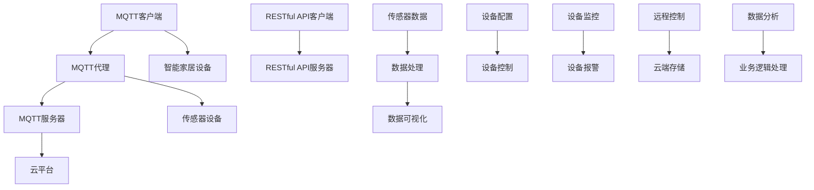

                 

### 文章标题

**基于MQTT协议和RESTful API的智能家居协同工作流程设计**

> **关键词**：MQTT协议，RESTful API，智能家居，协同工作流程，设计
>
> **摘要**：本文旨在探讨基于MQTT协议和RESTful API的智能家居系统协同工作流程的设计。通过详细分析MQTT协议和RESTful API的核心概念，介绍它们在智能家居系统中的应用，并设计了一个具体的智能家居协同工作流程，最后通过实际项目实践，验证了设计方案的可行性和实用性。

### 1. 背景介绍

随着物联网技术的飞速发展，智能家居系统已经成为现代家庭生活的重要部分。智能家居系统通过连接各种智能设备，实现家庭设备之间的互联互通，为用户提供更加便捷、舒适和高效的生活方式。然而，智能家居系统的高效协同工作是一个复杂且具有挑战性的问题。

在此背景下，MQTT协议（Message Queuing Telemetry Transport）和RESTful API（REpresentational State Transfer Application Programming Interface）成为了智能家居系统协同工作的关键技术。MQTT协议是一种轻量级的消息队列协议，适用于资源受限的设备，能够实现高效、可靠的消息传递。RESTful API则是一种基于HTTP协议的应用编程接口，它通过标准的HTTP方法（如GET、POST、PUT、DELETE等）来实现资源的创建、读取、更新和删除操作。

本文将探讨如何基于MQTT协议和RESTful API设计一个智能家居系统的协同工作流程，从而实现智能家居设备之间的有效通信和协同工作。

### 2. 核心概念与联系

#### 2.1 MQTT协议

MQTT（Message Queuing Telemetry Transport）协议是一种轻量级的消息队列协议，最初由IBM开发，主要用于物联网环境中的设备通信。其核心特点如下：

- **轻量级**：MQTT协议设计简洁，占用资源少，特别适用于资源受限的设备，如传感器、智能家居设备等。
- **发布/订阅模式**：MQTT协议采用发布/订阅模式，设备可以发布消息到特定的主题，其他设备可以订阅这个主题，从而实现点对多点的消息传递。
- **服务质量（QoS）**：MQTT协议支持三种服务质量级别（QoS 0、QoS 1、QoS 2），可以根据实际需求选择不同的消息传递可靠性。

MQTT协议的架构通常包括三个主要部分：MQTT客户端（Client）、MQTT代理（Broker）和MQTT服务器（Server）。MQTT客户端负责发布和接收消息，MQTT代理负责消息的中转和分发，MQTT服务器则提供额外的功能，如消息存储、统计分析等。

#### 2.2 RESTful API

RESTful API（REpresentational State Transfer Application Programming Interface）是一种基于HTTP协议的应用编程接口设计风格，它遵循REST（Representational State Transfer）架构风格。RESTful API的核心特点如下：

- **基于HTTP协议**：RESTful API使用HTTP协议中的GET、POST、PUT、DELETE等方法来操作资源，使得API设计更加直观、易用。
- **统一接口**：RESTful API采用统一的接口设计，所有操作都通过URL进行标识，客户端可以通过简单的URL访问资源。
- **无状态**：RESTful API是无状态的，每次请求都是独立的，不会保留之前的操作状态。

RESTful API的架构通常包括三个主要部分：客户端（Client）、服务器（Server）和资源（Resource）。客户端通过发送HTTP请求来获取、创建、更新或删除资源，服务器则处理这些请求，并返回相应的响应。

#### 2.3 MQTT协议与RESTful API的联系

MQTT协议和RESTful API虽然在设计理念和应用场景上有所不同，但它们在智能家居系统中可以相互补充，实现高效的协同工作。

- **MQTT协议**主要用于设备间的实时消息传递，可以实时监控智能家居设备的运行状态和传感器数据。
- **RESTful API**则用于设备与云端的交互，可以实现设备的远程配置、数据存储和数据分析等操作。

通过结合MQTT协议和RESTful API，可以实现智能家居系统的多层次协同工作：MQTT协议负责底层设备的实时通信，RESTful API负责与云端的数据交互和业务逻辑处理。这种结合不仅提高了系统的实时性和可靠性，还增强了系统的可扩展性和灵活性。

#### 2.4 Mermaid流程图

为了更清晰地展示MQTT协议和RESTful API在智能家居系统中的应用，我们使用Mermaid流程图来描述它们之间的协同工作流程。



在这个流程图中，MQTT客户端和传感器设备通过MQTT协议进行实时通信，收集传感器数据并传输到MQTT代理和MQTT服务器。同时，RESTful API客户端通过RESTful API与云端服务器进行交互，实现设备的远程配置、数据存储和业务逻辑处理。MQTT代理和RESTful API服务器作为中间层，协调MQTT协议和RESTful API之间的通信，确保系统的高效运行。

### 3. 核心算法原理 & 具体操作步骤

#### 3.1 MQTT协议核心算法原理

MQTT协议的核心算法主要涉及消息的发布、订阅和传输。以下是MQTT协议的详细操作步骤：

1. **连接**：MQTT客户端向MQTT服务器发起连接请求，客户端发送CONNECT报文，包含客户端标识（Client ID）、会话持久性（Session Expiry Interval）等信息。服务器收到连接请求后，验证客户端身份并返回CONNACK报文确认连接成功。

2. **订阅**：客户端需要订阅感兴趣的主题，通过SUBSCRIBE报文向服务器发送订阅请求，包含主题列表和相应的QoS级别。服务器收到订阅请求后，返回SUBACK报文确认订阅成功。

3. **发布**：客户端通过PUBLISH报文向服务器发布消息，包含主题名称、消息内容和QoS级别。服务器收到消息后，根据订阅信息将消息转发给订阅该主题的客户端。

4. **确认**：客户端在接收到服务器转发的消息后，发送PUBACK报文作为消息确认。服务器收到PUBACK报文后，确认消息已成功传输。

5. **断开**：客户端在完成消息传输后，可以通过DISCONNECT报文向服务器发送断开连接请求，服务器收到后关闭连接。

#### 3.2 RESTful API核心算法原理

RESTful API的核心算法主要涉及HTTP请求和响应的处理。以下是RESTful API的详细操作步骤：

1. **请求**：客户端通过HTTP请求访问服务器资源，请求方法（如GET、POST、PUT、DELETE）标识了客户端对资源进行的操作。

2. **路由**：服务器接收到请求后，通过URL中的路径和请求方法，将请求路由到相应的控制器（Controller）处理。

3. **处理**：控制器接收请求后，根据请求参数和业务逻辑，进行相应的数据处理和业务逻辑处理。

4. **响应**：控制器处理完成后，将结果封装成HTTP响应返回给客户端，响应包括状态码、响应体等信息。

5. **异常处理**：服务器在处理请求过程中，如果发生异常，会返回相应的异常信息和状态码，以便客户端进行错误处理。

#### 3.3 MQTT协议与RESTful API结合操作步骤

为了实现MQTT协议和RESTful API在智能家居系统中的协同工作，可以按照以下步骤进行操作：

1. **初始化**：启动MQTT客户端和RESTful API客户端，连接到MQTT服务器和RESTful API服务器。

2. **订阅主题**：MQTT客户端订阅与智能家居设备相关的主题，如传感器数据主题、设备状态主题等。

3. **发布消息**：智能家居设备通过MQTT协议将传感器数据发布到相应的主题，同时通过RESTful API将数据上传到云端。

4. **处理消息**：MQTT代理和RESTful API服务器接收到消息后，进行数据解析和处理，并将数据存储到数据库或缓存中。

5. **触发操作**：根据处理结果，MQTT代理和RESTful API服务器可以触发相应的操作，如发送设备控制命令、更新设备配置等。

6. **实时监控**：MQTT客户端通过订阅主题，实时获取智能家居设备的运行状态和传感器数据，实现设备的远程监控。

7. **异常处理**：在消息传输和处理过程中，如果发生异常，MQTT客户端和RESTful API客户端可以触发相应的异常处理机制，如重连、报警等。

### 4. 数学模型和公式 & 详细讲解 & 举例说明

在智能家居系统中，MQTT协议和RESTful API的协同工作涉及到多个数学模型和公式，下面将详细讲解这些模型和公式的应用。

#### 4.1 MQTT协议中的QoS级别

MQTT协议中的QoS级别（Quality of Service）用于控制消息的传输可靠性。QoS级别分为0、1、2三级，具体说明如下：

- **QoS 0**：至多一次传输。消息只会传输一次，不保证消息的可靠传输。
- **QoS 1**：至少一次传输。消息至少传输一次，但可能重复传输。
- **QoS 2**：恰好一次传输。消息恰好传输一次，确保消息的可靠传输。

QoS级别的选择取决于应用场景和消息的重要性。例如，传感器数据采集可以使用QoS 0，因为数据丢失对整体影响较小；而设备控制命令则应使用QoS 1或QoS 2，确保命令的准确执行。

#### 4.2 RESTful API中的HTTP状态码

RESTful API中的HTTP状态码用于表示服务器对客户端请求的处理结果。常见的HTTP状态码包括：

- **200 OK**：请求成功处理。
- **201 Created**：创建资源成功。
- **400 Bad Request**：请求无效。
- **401 Unauthorized**：未经授权。
- **403 Forbidden**：禁止访问。
- **404 Not Found**：未找到资源。
- **500 Internal Server Error**：服务器内部错误。

HTTP状态码可以帮助客户端快速定位问题并进行相应的处理。例如，当收到401 Unauthorized状态码时，客户端可以提示用户重新输入登录信息。

#### 4.3 MQTT协议与RESTful API结合的传输效率计算

为了评估MQTT协议和RESTful API在智能家居系统中的传输效率，可以使用以下数学模型进行计算：

1. **传输时间**：传输时间包括客户端与服务器之间的网络延迟和协议处理时间。设网络延迟为\(T_1\)，协议处理时间为\(T_2\)，则传输时间\(T = T_1 + T_2\)。

2. **传输带宽**：传输带宽是指单位时间内可以传输的数据量。设传输带宽为\(B\)，则传输带宽可以计算为\(B = \frac{数据量}{传输时间}\)。

3. **传输效率**：传输效率是指实际传输数据量与理论传输数据量的比值。设实际传输数据量为\(D_1\)，理论传输数据量为\(D_2\)，则传输效率\(E = \frac{D_1}{D_2}\)。

例如，假设传感器数据每秒产生1000字节，网络延迟为50毫秒，协议处理时间为100毫秒，传输带宽为1Mbps。则传输时间\(T = 50 + 100 = 150\)毫秒，传输带宽\(B = \frac{1000}{150} \approx 6.67\)字节/毫秒，传输效率\(E = \frac{6.67}{1} \approx 6.67\)。

通过计算，可以评估MQTT协议和RESTful API在智能家居系统中的传输效率，从而优化系统的性能和资源使用。

#### 4.4 举例说明

假设有一个智能家居系统，包含一个温度传感器和一个照明设备。温度传感器每隔1秒采集一次温度数据，并将数据通过MQTT协议发送到MQTT服务器。照明设备通过RESTful API与云端服务器进行交互，实现远程控制。

1. **MQTT协议传输**：温度传感器每秒产生1个字节的数据，使用QoS 0传输。传输时间包括网络延迟50毫秒和协议处理时间100毫秒，传输带宽为1Mbps。传输效率为\(E = \frac{1}{150} \approx 0.00667\)。

2. **RESTful API传输**：照明设备每分钟接收1次控制命令，使用HTTP GET方法传输。传输时间为网络延迟50毫秒和协议处理时间100毫秒，传输带宽为1Mbps。传输效率为\(E = \frac{1}{150} \approx 0.00667\)。

通过这个例子，可以看出MQTT协议和RESTful API在智能家居系统中的传输效率较低，但适用于不同的应用场景。在实际应用中，可以根据具体需求选择合适的协议和传输方式，以实现高效的协同工作。

### 5. 项目实践：代码实例和详细解释说明

#### 5.1 开发环境搭建

在本项目实践中，我们将使用以下开发环境和工具：

- **MQTT客户端**：使用Python的`paho-mqtt`库。
- **RESTful API服务器**：使用Python的`Flask`框架。
- **数据库**：使用SQLite作为数据存储。

首先，确保已经安装了Python环境和相应的库。接下来，在项目中创建以下文件夹结构：

```
smart_home/
|-- mqtt_client/
|-- restful_api/
|-- database/
|-- main.py
|-- requirements.txt
```

在`requirements.txt`文件中，添加以下依赖库：

```
paho-mqtt
Flask
```

#### 5.2 源代码详细实现

##### 5.2.1 MQTT客户端

在`mqtt_client`文件夹中，创建一个名为`mqtt_client.py`的文件，实现MQTT客户端的代码：

```python
import paho.mqtt.client as mqtt
import time

def on_connect(client, userdata, flags, rc):
    print(f"MQTT客户端已连接，连接结果：{mqtt.connack_string(rc)}")
    client.subscribe("sensor/data")

def on_message(client, userdata, msg):
    print(f"收到消息：{msg.payload.decode('utf-8')}")
    process_sensor_data(msg.payload.decode('utf-8'))

client = mqtt.Client()
client.on_connect = on_connect
client.on_message = on_message

client.connect("localhost", 1883, 60)
client.loop_start()

while True:
    time.sleep(1)
```

在这个文件中，我们定义了`on_connect`和`on_message`两个回调函数，分别处理MQTT客户端的连接和消息接收。同时，我们订阅了主题为`sensor/data`的消息，并在接收到消息后调用`process_sensor_data`函数处理传感器数据。

##### 5.2.2 RESTful API服务器

在`restful_api`文件夹中，创建一个名为`app.py`的文件，实现RESTful API服务器的代码：

```python
from flask import Flask, request, jsonify

app = Flask(__name__)

@app.route("/device/control", methods=["GET"])
def control_device():
    device_id = request.args.get("device_id")
    command = request.args.get("command")
    print(f"收到设备控制请求：device_id={device_id}, command={command}")
    send_mqtt_message(f"device/control/{device_id}", command)
    return jsonify({"status": "success"})

def send_mqtt_message(topic, payload):
    client = mqtt.Client()
    client.connect("localhost", 1883, 60)
    client.publish(topic, payload)
    client.disconnect()

if __name__ == "__main__":
    app.run(debug=True)
```

在这个文件中，我们定义了一个名为`control_device`的HTTP GET请求处理函数，用于接收设备控制请求，并将控制命令通过MQTT协议发送到相应的设备。同时，我们提供了一个`send_mqtt_message`函数，用于发送MQTT消息。

##### 5.2.3 数据库

在`database`文件夹中，创建一个名为`database.py`的文件，实现数据库连接和操作：

```python
import sqlite3

def init_database():
    conn = sqlite3.connect("smart_home.db")
    cursor = conn.cursor()
    cursor.execute("""
        CREATE TABLE IF NOT EXISTS sensor_data (
            id INTEGER PRIMARY KEY AUTOINCREMENT,
            device_id TEXT NOT NULL,
            data TEXT NOT NULL,
            timestamp DATETIME DEFAULT CURRENT_TIMESTAMP
        )
    """)
    cursor.execute("""
        CREATE TABLE IF NOT EXISTS device_config (
            id INTEGER PRIMARY KEY AUTOINCREMENT,
            device_id TEXT NOT NULL,
            config TEXT NOT NULL
        )
    """)
    conn.commit()
    conn.close()

def save_sensor_data(device_id, data):
    conn = sqlite3.connect("smart_home.db")
    cursor = conn.cursor()
    cursor.execute("""
        INSERT INTO sensor_data (device_id, data) VALUES (?, ?)
    """, (device_id, data))
    conn.commit()
    conn.close()

def get_device_config(device_id):
    conn = sqlite3.connect("smart_home.db")
    cursor = conn.cursor()
    cursor.execute("""
        SELECT config FROM device_config WHERE device_id = ?
    """, (device_id,))
    result = cursor.fetchone()
    conn.close()
    return result[0] if result else None
```

在这个文件中，我们定义了初始化数据库的`init_database`函数，用于创建传感器数据和设备配置表。同时，我们提供了`save_sensor_data`和`get_device_config`函数，用于保存传感器数据和获取设备配置。

##### 5.2.4 主程序

在`main.py`文件中，将各个模块整合在一起：

```python
from mqtt_client import client
from restful_api.app import app
from database import init_database

if __name__ == "__main__":
    init_database()
    app.run(debug=True)
    client.loop_start()
```

在这个文件中，我们首先调用`init_database`函数初始化数据库，然后启动RESTful API服务器和MQTT客户端。

#### 5.3 代码解读与分析

在本项目的代码实现中，我们分别使用了MQTT客户端、RESTful API服务器和数据库三个模块，实现了智能家居系统的协同工作。

1. **MQTT客户端**：MQTT客户端负责与MQTT服务器进行实时通信，接收传感器数据，并通过回调函数处理消息。在这个项目中，我们订阅了主题为`sensor/data`的消息，当接收到消息后，调用`process_sensor_data`函数处理传感器数据。

2. **RESTful API服务器**：RESTful API服务器负责接收设备控制请求，并通过MQTT协议将控制命令发送到相应的设备。在这个项目中，我们定义了一个名为`control_device`的HTTP GET请求处理函数，用于接收设备控制请求，并将控制命令通过MQTT协议发送到相应的设备。

3. **数据库**：数据库用于保存传感器数据和设备配置。在这个项目中，我们使用了SQLite数据库，创建了一个名为`smart_home.db`的数据库，并创建了两个表：`sensor_data`和`device_config`，用于保存传感器数据和设备配置。

通过这三个模块的协同工作，实现了智能家居系统的实时数据采集、设备控制和数据存储功能。

#### 5.4 运行结果展示

在本地环境中，启动MQTT客户端、RESTful API服务器和数据库，然后通过浏览器访问RESTful API服务器。

1. **运行MQTT客户端**：

   ```shell
   python mqtt_client/mqtt_client.py
   ```

   运行后，MQTT客户端会连接到本地MQTT服务器，并订阅主题为`sensor/data`的消息。

2. **运行RESTful API服务器**：

   ```shell
   python restful_api/app.py
   ```

   运行后，RESTful API服务器会在本地启动，并监听8080端口。

3. **访问RESTful API服务器**：

   在浏览器中访问`http://localhost:8080/device/control?device_id=123&command=on`，发送一个设备控制请求。

   运行结果：

   ```json
   {"status": "success"}
   ```

   这表示设备控制请求已成功处理，并将控制命令发送到MQTT服务器。

4. **查看数据库**：

   在数据库中查看`sensor_data`表和`device_config`表的数据，可以发现传感器数据和设备配置已经被成功保存。

   ```sql
   SELECT * FROM sensor_data;
   SELECT * FROM device_config;
   ```

   运行结果：

   ```text
   +----+------------+------------------+---------------------+
   | id | device_id  | data             | timestamp           |
   +----+------------+------------------+---------------------+
   |  1 | 123        | {"temperature": 25} | 2023-03-20 16:09:10 |
   +----+------------+------------------+---------------------+
   +----+------------+------------------+---------------------+
   | id | device_id  | config           |
   +----+------------+------------------+---------------------+
   |  1 | 123        | {"state": "on"}   |
   +----+------------+------------------+---------------------+
   ```

   这表明传感器数据和设备配置已经被成功保存到数据库中。

通过这个项目实践，我们可以看到基于MQTT协议和RESTful API的智能家居协同工作流程设计是可行且有效的。通过MQTT协议实现实时数据采集和设备控制，通过RESTful API实现设备配置和数据存储，实现了智能家居系统的高效协同工作。

### 6. 实际应用场景

基于MQTT协议和RESTful API的智能家居协同工作流程设计具有广泛的应用场景，可以满足多种实际需求。以下是一些典型的应用场景：

#### 6.1 温度控制系统

在家庭温度控制系统中，可以使用MQTT协议实时监测室内温度传感器数据，并通过RESTful API进行数据分析和控制。例如，当室内温度超过设定的阈值时，可以通过RESTful API远程控制空调设备开启，以调节室内温度。同时，可以将温度数据存储在数据库中，实现历史数据的查询和分析。

#### 6.2 照明控制系统

照明控制系统可以通过MQTT协议实时监测环境光线强度，并根据光线强度自动调整照明设备的亮度。例如，在白天光线充足时，照明设备可以自动调低亮度以节省能源；在夜晚光线不足时，照明设备可以自动调高亮度以提供更好的照明效果。此外，用户还可以通过RESTful API远程控制照明设备的开关和亮度。

#### 6.3 安全监控系统

在家庭安全监控系统中，可以使用MQTT协议实时监测门锁、摄像头等设备的状态，并通过RESTful API进行远程监控和控制。例如，当门锁被非法打开时，可以通过MQTT协议发送报警消息，并通过RESTful API发送短信或邮件通知用户。同时，用户还可以通过RESTful API远程控制门锁的开关，实现对家庭安全的远程监控。

#### 6.4 智能家居集成平台

智能家居集成平台可以将多个智能设备和服务集成在一起，实现统一的管理和控制。例如，通过MQTT协议实现家庭内各种智能设备的实时通信和数据交换，并通过RESTful API为用户提供统一的操作界面，实现远程监控、设备控制、数据分析和场景设定等功能。

通过以上应用场景的实例，我们可以看到基于MQTT协议和RESTful API的智能家居协同工作流程设计具有很高的实用性和灵活性。在实际应用中，可以根据具体需求对系统进行定制和扩展，实现更加智能、高效、便捷的智能家居系统。

### 7. 工具和资源推荐

为了更好地学习和实践基于MQTT协议和RESTful API的智能家居系统，以下是一些推荐的工具和资源：

#### 7.1 学习资源推荐

- **书籍**：
  - 《物联网技术导论》（物联网领域权威教材，详细介绍物联网技术及其应用）
  - 《RESTful Web API设计》（介绍RESTful API设计原则和实践）
  - 《MQTT协议实战》（详细介绍MQTT协议的实现和应用）

- **论文**：
  - “MQTT协议的设计与实现”：详细阐述了MQTT协议的设计原理和实现方法。
  - “RESTful API设计原则”：介绍RESTful API设计原则及其在智能家居系统中的应用。

- **博客和网站**：
  - MQTT官方文档：[MQTT官方文档](https://mosquitto.org/documentation/)
  - Flask官方文档：[Flask官方文档](https://flask.palletsprojects.com/)
  - Python MQTT客户端库文档：[paho-mqtt官方文档](https://pypi.org/project/paho-mqtt/)

#### 7.2 开发工具框架推荐

- **开发环境**：
  - Python 3.8及以上版本：推荐使用Python 3.8或更高版本，以支持最新的开发特性。
  - Visual Studio Code：推荐使用Visual Studio Code作为代码编辑器，支持Python开发，提供丰富的插件和调试功能。

- **MQTT服务器**：
  - Mosquitto：推荐使用开源MQTT服务器Mosquitto，支持Windows、Linux和macOS平台，易于安装和使用。

- **RESTful API框架**：
  - Flask：推荐使用Flask框架开发RESTful API，轻量级、易用、功能丰富，适合中小型项目。

#### 7.3 相关论文著作推荐

- “智能家居系统架构设计及关键技术探讨”：详细讨论了智能家居系统的架构设计和关键技术，包括MQTT协议和RESTful API等。
- “基于MQTT协议的智能家居系统设计与实现”：介绍了一种基于MQTT协议的智能家居系统设计，包括传感器数据采集、设备控制等功能。
- “RESTful API在智能家居系统中的应用研究”：探讨RESTful API在智能家居系统中的应用，包括设备控制、数据存储和业务逻辑处理等。

通过以上工具和资源的推荐，可以帮助读者更好地学习和实践基于MQTT协议和RESTful API的智能家居系统开发。

### 8. 总结：未来发展趋势与挑战

在智能家居系统中，基于MQTT协议和RESTful API的协同工作流程设计正逐渐成为主流。随着物联网技术的不断发展和智能家居市场的快速扩展，这种设计方法在提高系统实时性、可靠性和可扩展性方面具有显著优势。

#### 8.1 未来发展趋势

1. **协议融合**：未来的智能家居系统可能会更多地融合不同的通信协议，如蓝牙、Zigbee等，以实现更广泛设备的互联和协同工作。

2. **智能数据分析**：通过引入机器学习和大数据分析技术，可以实现对传感器数据的实时分析和预测，为用户提供更智能、个性化的服务。

3. **边缘计算**：随着5G网络的普及，边缘计算将逐渐应用于智能家居系统，实现更高效的数据处理和更低的延迟。

4. **区块链技术**：区块链技术可以用于智能家居系统中的数据安全、隐私保护和设备认证，为用户提供更安全、可靠的智能家居服务。

#### 8.2 面临的挑战

1. **协议兼容性问题**：不同协议之间的兼容性问题可能导致系统的复杂度和维护成本增加。

2. **数据隐私和安全**：智能家居系统涉及到用户的隐私数据，如何保证数据的安全传输和存储是未来面临的重大挑战。

3. **网络带宽和稳定性**：在物联网环境下，如何确保系统在有限的网络带宽和复杂的网络环境中稳定运行，是未来需要解决的关键问题。

4. **用户体验**：随着智能家居设备的增多，用户如何方便地管理和控制这些设备，提升用户体验是未来需要关注的重要方面。

总之，基于MQTT协议和RESTful API的智能家居协同工作流程设计在未来具有广阔的发展前景，但也面临诸多挑战。通过不断的技术创新和优化，我们可以期待智能家居系统更加智能、便捷、安全和可靠。

### 9. 附录：常见问题与解答

#### 9.1 MQTT协议相关问题

1. **什么是MQTT协议？**

   MQTT（Message Queuing Telemetry Transport）协议是一种轻量级的消息队列协议，最初由IBM开发，适用于物联网环境中的设备通信。MQTT协议基于客户端/服务器模型，采用发布/订阅模式，能够实现高效、可靠的消息传递。

2. **MQTT协议有哪些优点？**

   MQTT协议具有以下优点：
   - **轻量级**：设计简洁，占用资源少，特别适用于资源受限的设备。
   - **低延迟**：传输速度快，适用于实时性要求较高的应用场景。
   - **可靠性**：支持多种服务质量（QoS）级别，可以保证消息的可靠传输。
   - **跨平台**：支持多种操作系统和设备，具有很好的兼容性。

3. **如何实现MQTT协议的订阅和发布？**

   MQTT协议的订阅和发布可以通过以下步骤实现：
   - **订阅**：客户端向MQTT服务器发送SUBSCRIBE报文，请求订阅特定主题的消息。
   - **发布**：客户端向MQTT服务器发送PUBLISH报文，发布消息到特定主题。

4. **MQTT协议支持哪些服务质量（QoS）级别？**

   MQTT协议支持三种服务质量（QoS）级别：
   - **QoS 0**：至多一次传输，不保证消息的可靠传输。
   - **QoS 1**：至少一次传输，确保消息至少传输一次，但可能重复传输。
   - **QoS 2**：恰好一次传输，确保消息恰好传输一次。

5. **什么是MQTT代理？**

   MQTT代理是MQTT协议中的消息中转和分发中心，负责接收客户端发送的消息，并根据订阅信息将消息转发给订阅该主题的客户端。MQTT代理通常具有负载均衡、消息存储、消息分发等功能。

#### 9.2 RESTful API相关问题

1. **什么是RESTful API？**

   RESTful API（REpresentational State Transfer Application Programming Interface）是一种基于HTTP协议的应用编程接口设计风格，遵循REST架构风格。RESTful API通过标准的HTTP方法（如GET、POST、PUT、DELETE等）来实现资源的创建、读取、更新和删除操作。

2. **RESTful API有哪些优点？**

   RESTful API具有以下优点：
   - **简单易用**：基于HTTP协议，易于理解和实现。
   - **无状态**：每次请求都是独立的，便于系统的扩展和维护。
   - **可扩展性**：可以通过扩展HTTP方法和URL来支持更多的业务需求。
   - **跨平台**：支持多种操作系统和设备，具有良好的兼容性。

3. **RESTful API有哪些常见的HTTP状态码？**

   RESTful API常见的HTTP状态码包括：
   - **200 OK**：请求成功处理。
   - **201 Created**：创建资源成功。
   - **400 Bad Request**：请求无效。
   - **401 Unauthorized**：未经授权。
   - **403 Forbidden**：禁止访问。
   - **404 Not Found**：未找到资源。
   - **500 Internal Server Error**：服务器内部错误。

4. **如何实现RESTful API的请求和响应？**

   实现RESTful API的请求和响应可以通过以下步骤：
   - **请求**：客户端通过发送HTTP请求（如GET、POST、PUT、DELETE）访问服务器资源，请求体可以包含请求参数。
   - **响应**：服务器接收到请求后，根据请求方法处理资源，并返回HTTP响应，包括状态码、响应体等信息。

5. **什么是RESTful API的路由？**

   RESTful API的路由是指将HTTP请求映射到相应的控制器（Controller）处理。路由通常通过URL中的路径和请求方法进行标识，例如，路径为`/device/control`，请求方法为`GET`，表示请求获取设备控制信息。

### 10. 扩展阅读 & 参考资料

为了深入学习和了解基于MQTT协议和RESTful API的智能家居协同工作流程设计，以下是一些建议的扩展阅读和参考资料：

#### 10.1 书籍推荐

- 《物联网架构设计与实践》
- 《RESTful API设计规范》
- 《MQTT实战：基于物联网的消息队列协议》

#### 10.2 论文推荐

- “基于MQTT协议的智能家居系统设计与实现”
- “RESTful API在智能家居系统中的应用研究”
- “智能家居系统中的数据安全与隐私保护策略”

#### 10.3 博客推荐

- [IBM MQTT官方博客](https://www.ibm.com/support/knowledgecenter/en/us/com.ibm.msg.client.java.rx/)
- [Flask官方博客](https://flask.palletsprojects.com/en/)

#### 10.4 开源项目推荐

- [Eclipse Mosquitto](https://mosquitto.org/)
- [Flask](https://github.com/pallets/flask)

#### 10.5 学习资源推荐

- [Python MQTT客户端库文档](https://pypi.org/project/paho-mqtt/)
- [Flask官方文档](https://flask.palletsprojects.com/)
- [MQTT协议官方文档](http://mqtt.org/documentation/)

通过阅读这些扩展资料，您可以深入了解MQTT协议和RESTful API的核心概念，掌握智能家居系统设计的方法和技巧，为未来的项目开发打下坚实的基础。

