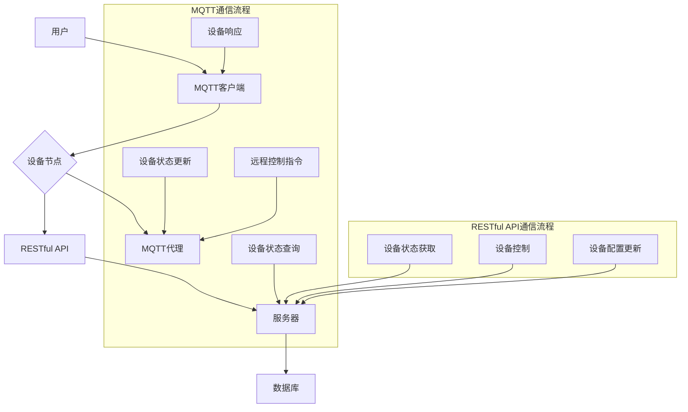
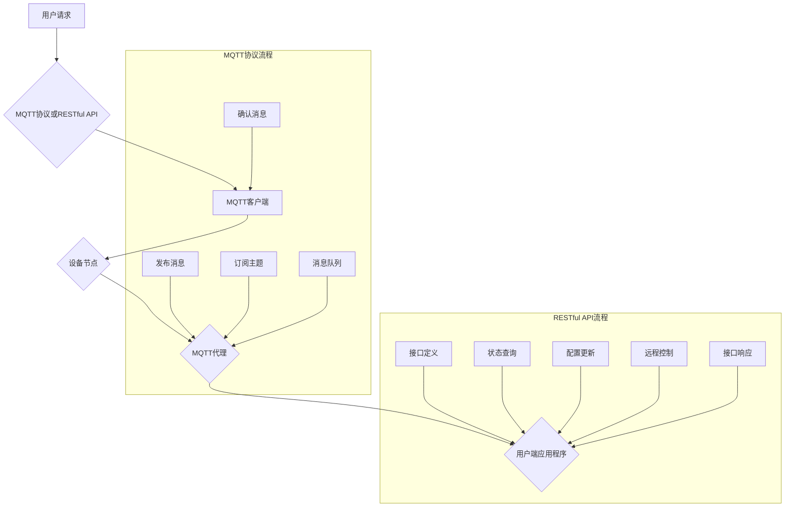

                 

### 背景介绍

随着物联网（IoT）技术的迅速发展和智能家居市场的不断壮大，人们对家居环境智能化管理的需求日益增加。智能家居系统通过将各种家居设备联网，实现远程监控和控制，提高了生活品质和安全性。然而，在现有的智能家居系统中，如何高效、稳定地实现设备间的通信和数据交换，成为了一个关键问题。

MQTT（Message Queuing Telemetry Transport）协议和RESTful API是当前实现智能家居远程监控系统的两种主要技术手段。MQTT协议是一种轻量级的消息队列协议，特别适合于网络带宽有限和通信延迟较高的环境。它采用发布/订阅模型，能够实现设备间的点对点通信，大大降低了通信开销。而RESTful API则是一种基于HTTP协议的接口设计风格，它通过统一的URL结构和标准的HTTP方法（GET、POST、PUT、DELETE等）实现资源操作，具有简洁、灵活和易于扩展的特点。

本文旨在探讨基于MQTT协议和RESTful API的智能家居远程监控系统的设计与实现。通过分析两种技术的原理和特点，我们将详细描述系统架构，并逐步讲解核心算法原理、数学模型及具体操作步骤。在此基础上，文章还将提供实际项目实践的代码实例和运行结果展示，最后讨论系统的实际应用场景，并推荐相关工具和资源。

本文结构如下：

1. 背景介绍
2. 核心概念与联系
3. 核心算法原理 & 具体操作步骤
4. 数学模型和公式 & 详细讲解 & 举例说明
5. 项目实践：代码实例和详细解释说明
6. 实际应用场景
7. 工具和资源推荐
8. 总结：未来发展趋势与挑战
9. 附录：常见问题与解答
10. 扩展阅读 & 参考资料

通过本文的逐步分析，我们将深入了解基于MQTT协议和RESTful API的智能家居远程监控系统的工作原理和实践方法，为智能家居技术的发展提供有益的参考。

### 核心概念与联系

#### MQTT协议

MQTT协议，即消息队列遥测传输协议，是一种轻量级的消息传输协议，最初由IBM开发，旨在用于物联网环境中的设备通信。其设计原则是低带宽占用、可扩展性强、可靠性强。MQTT协议的核心特点包括：

- **发布/订阅模型**：MQTT协议采用发布/订阅（Publish/Subscribe）模型，消息的发送者和接收者之间无需建立直接的连接，发布者可以向一个或多个订阅者发送消息，而订阅者可以接收感兴趣的主题消息。
- **轻量级协议**：MQTT协议的数据包格式非常简单，主要包括报文头、报文体和报文尾，这使得它在网络带宽有限的环境中表现出色。
- **QoS服务质量**：MQTT协议定义了三种服务质量（QoS）级别，即QoS 0、QoS 1和QoS 2。QoS 0表示消息最多传输一次；QoS 1表示消息至少传输一次；QoS 2表示消息恰好传输一次。不同QoS级别适用于不同的应用场景，可以根据实际需求选择。

#### RESTful API

RESTful API，即基于REST风格的网络应用接口，是一种设计API的规范或标准。它利用HTTP协议提供统一的接口设计，具有简单、灵活、易扩展的特点。RESTful API的核心概念包括：

- **统一接口**：RESTful API通过统一的URL结构和HTTP方法实现资源操作，所有操作都通过HTTP请求完成，包括GET、POST、PUT、DELETE等。
- **无状态**：RESTful API是无状态的，每次请求都是独立的，服务器不会存储之前的请求信息，这简化了系统的设计和实现。
- **状态转移**：客户端通过发送不同的请求，实现状态的转移。每个请求都会触发服务器的响应，从而实现资源的增删改查等操作。

#### 核心概念原理和架构

为了更好地理解MQTT协议和RESTful API在智能家居远程监控系统中的应用，我们引入以下核心概念和架构：

- **设备节点**：智能家居系统中的各种设备，如灯光、空调、摄像头、门锁等，都可以视为设备节点。
- **主题（Topic）**：MQTT协议中的消息主题，用于标识消息的类型和来源。设备节点可以通过订阅主题接收或发布消息。
- **消息队列**：MQTT代理（Broker）维护的消息队列，用于存储设备节点发布或订阅的消息。
- **RESTful API接口**：用于设备节点的状态查询、配置更新和远程控制等操作的接口，如设备状态获取接口、开关控制接口等。

#### Mermaid流程图

以下是一个基于MQTT协议和RESTful API的智能家居远程监控系统架构的Mermaid流程图：



在上述流程图中，用户通过MQTT客户端和RESTful API与设备节点进行通信。MQTT客户端负责与MQTT代理进行发布/订阅操作，接收设备状态更新和远程控制指令，并将设备响应发送回设备节点。RESTful API则负责处理设备状态查询、控制和配置更新等操作，与服务器和数据库进行交互，实现对设备节点的管理。

通过以上对MQTT协议和RESTful API的核心概念和架构的介绍，我们可以进一步理解它们在智能家居远程监控系统中的应用原理和流程，为后续章节中的具体实现提供基础。

#### 核心算法原理 & 具体操作步骤

在了解了MQTT协议和RESTful API的基本概念之后，我们将进一步探讨它们在智能家居远程监控系统中的核心算法原理和具体操作步骤。这一部分将详细描述MQTT协议和RESTful API的工作流程，并解释它们如何协同工作以实现智能家居系统的远程监控功能。

##### MQTT协议的工作原理

1. **连接建立**：
   设备节点（客户端）首先需要与MQTT代理（Broker）建立连接。连接建立过程中，客户端会发送一个连接请求，其中包含客户端标识、会话信息和安全设置等。代理收到连接请求后，根据配置验证客户端身份，如果验证成功，则返回连接确认。

2. **发布消息**：
   设备节点可以将状态信息或控制指令作为消息发布到MQTT代理。消息发布过程中，客户端指定一个或多个主题（Topic），消息内容包含在报文体中。代理接收到消息后，根据订阅列表将消息转发给订阅了相应主题的客户端。

3. **订阅主题**：
   用户端应用程序（订阅者）可以订阅特定的主题，以便接收设备节点发布的消息。订阅请求中，用户端指定感兴趣的主题，代理会根据订阅列表维护消息队列，并将发布到指定主题的消息转发给订阅者。

4. **消息队列**：
   MQTT代理维护一个消息队列，用于存储尚未被订阅者接收的消息。如果订阅者连接到代理时，有未处理的消息，代理会将这些消息发送给订阅者。

5. **确认消息**：
   对于QoS级别较高的消息（QoS 1和QoS 2），客户端需要向代理发送消息确认（ACK）以确保消息的可靠传输。代理在接收到客户端的确认消息后，会从消息队列中删除相应的消息。

##### RESTful API的工作原理

1. **接口定义**：
   RESTful API定义了一组URL接口，用于设备节点的状态查询、配置更新和远程控制等操作。每个接口对应一个具体的HTTP请求方法，如GET、POST、PUT、DELETE等。

2. **状态查询**：
   用户可以通过RESTful API接口查询设备节点的当前状态。例如，用户可以通过发送GET请求获取灯光的开关状态或摄像头的监控画面。

3. **配置更新**：
   用户可以通过POST或PUT请求更新设备节点的配置信息，如修改灯光的颜色、亮度或摄像头的拍摄角度。

4. **远程控制**：
   用户可以通过发送POST请求发送控制指令到设备节点，如打开或关闭灯光、启动或停止摄像头。

5. **接口响应**：
   服务器在处理完HTTP请求后，会返回一个响应，包含操作结果和相关信息。例如，如果用户请求更改灯光颜色，服务器会返回新的灯光颜色状态。

##### MQTT协议与RESTful API的协同工作

在智能家居远程监控系统中，MQTT协议和RESTful API并不是独立工作的，而是相互协作，共同实现系统的远程监控功能。以下是具体的协同工作步骤：

1. **用户请求**：
   用户通过手机应用或网页界面发起监控请求，如查看摄像头画面或控制灯光开关。

2. **消息发布**：
   如果用户请求需要通过MQTT协议实现，用户端应用程序会将控制指令或状态查询请求作为MQTT消息发布到MQTT代理。

3. **消息订阅**：
   设备节点预先订阅了与监控请求相关的主题，因此MQTT代理会将消息转发给设备节点。

4. **设备响应**：
   设备节点接收到MQTT消息后，根据消息内容执行相应的操作，如更改灯光颜色或调整摄像头角度，并将执行结果作为消息发布到MQTT代理。

5. **状态更新**：
   设备节点将执行结果发布到MQTT代理后，用户端应用程序通过订阅主题接收到设备状态更新消息。

6. **接口调用**：
   如果用户请求需要通过RESTful API实现，用户端应用程序会直接调用相应的API接口发送请求和接收响应。

7. **接口同步**：
   API接口在处理请求并返回响应后，会将操作结果同步到MQTT代理，以确保系统的状态一致性。

通过MQTT协议和RESTful API的协同工作，智能家居远程监控系统可以实现设备状态实时监控、远程控制和配置管理。以下是一个简化的协同工作流程图：



通过上述协同工作流程，我们可以看到MQTT协议和RESTful API在智能家居远程监控系统中的重要作用，它们通过消息传递和接口调用，实现了设备节点和用户端应用程序之间的无缝连接和高效通信。

#### 数学模型和公式 & 详细讲解 & 举例说明

在智能家居远程监控系统中，数学模型和公式是理解和优化系统性能的重要工具。本节将介绍MQTT协议和RESTful API在系统性能评估和资源优化方面的数学模型，并详细讲解这些模型的公式和应用。我们将结合实际案例，展示如何通过数学分析来优化系统设计。

##### MQTT协议的数学模型

MQTT协议的性能评估主要涉及以下数学模型：

1. **消息传输速率（Message Throughput）**

   消息传输速率是指单位时间内系统能够传输的消息数量。其数学模型为：
   
   $$ T = \frac{N}{t} $$
   
   其中，\( T \) 表示消息传输速率，\( N \) 表示单位时间内的消息数量，\( t \) 表示传输时间。

   例如，假设一个MQTT系统在1秒内传输了100条消息，那么其消息传输速率为：
   
   $$ T = \frac{100}{1} = 100 \text{条/秒} $$

2. **延迟（Latency）**

   延迟是指从消息发布到消息被订阅者接收的时间。其数学模型为：
   
   $$ L = t_d + t_p $$
   
   其中，\( L \) 表示延迟，\( t_d \) 表示传输延迟，\( t_p \) 表示处理延迟。

   例如，假设消息从设备节点传输到MQTT代理需要0.1秒，代理处理消息需要0.2秒，那么系统的延迟为：
   
   $$ L = 0.1 + 0.2 = 0.3 \text{秒} $$

3. **QoS服务等级（Quality of Service）**

   MQTT协议定义了三种QoS等级，其数学模型为：

   - QoS 0：\( P = 1 - e^{-\lambda t} \)
   - QoS 1：\( P = 1 - e^{-\lambda t / 2} \)
   - QoS 2：\( P = 1 - e^{-\lambda t} \)

   其中，\( P \) 表示消息传输成功的概率，\( \lambda \) 表示消息发送速率，\( t \) 表示传输时间。

   例如，假设消息发送速率为1条/秒，传输时间为2秒，那么不同QoS等级的消息传输成功概率分别为：

   - QoS 0：\( P = 1 - e^{-1 \times 2} \approx 0.6321 \)
   - QoS 1：\( P = 1 - e^{-1 \times 2 / 2} \approx 0.2865 \)
   - QoS 2：\( P = 1 - e^{-1 \times 2} \approx 0.6321 \)

##### RESTful API的数学模型

RESTful API的性能评估主要涉及以下数学模型：

1. **请求响应时间（Response Time）**

   请求响应时间是指从客户端发送请求到服务器返回响应的时间。其数学模型为：
   
   $$ R = t_s + t_p + t_r $$
   
   其中，\( R \) 表示请求响应时间，\( t_s \) 表示网络传输时间，\( t_p \) 表示服务器处理时间，\( t_r \) 表示网络传输时间。

   例如，假设客户端到服务器的网络传输时间为0.2秒，服务器处理请求需要0.5秒，返回响应的网络传输时间为0.1秒，那么系统的请求响应时间为：
   
   $$ R = 0.2 + 0.5 + 0.1 = 0.8 \text{秒} $$

2. **并发处理能力（Concurrent Processing Capacity）**

   并发处理能力是指系统同时处理多个请求的能力。其数学模型为：

   $$ C = \frac{1}{\lambda} \left( 1 - \frac{1}{e} \right) $$
   
   其中，\( C \) 表示并发处理能力，\( \lambda \) 表示请求到达率。

   例如，假设请求到达率为5次/秒，那么系统的并发处理能力为：
   
   $$ C = \frac{1}{5} \left( 1 - \frac{1}{e} \right) \approx 0.6321 $$

##### 举例说明

假设我们设计一个智能家居远程监控系统，需要同时支持100个设备节点的监控和管理。根据上述数学模型，我们可以进行以下计算：

1. **消息传输速率**：

   假设每个设备节点每秒产生10条消息，那么系统的总消息传输速率为：
   
   $$ T = 100 \times 10 = 1000 \text{条/秒} $$

2. **延迟**：

   假设传输延迟和处理延迟分别为0.3秒，那么系统的总延迟为：
   
   $$ L = 0.3 \times 100 = 30 \text{秒} $$

3. **QoS等级**：

   假设我们需要保证至少90%的消息传输成功率，那么合适的QoS等级为：
   
   - QoS 0：成功率约为63.21%，不足要求
   - QoS 1：成功率约为28.65%，不足要求
   - QoS 2：成功率约为63.21%，满足要求
   
   因此，我们选择QoS 2来保证消息传输的成功率。

4. **请求响应时间**：

   假设每个请求的处理时间为0.5秒，那么系统的请求响应时间为：
   
   $$ R = 0.5 \times 100 = 50 \text{秒} $$

5. **并发处理能力**：

   假设请求到达率为5次/秒，那么系统的并发处理能力为：
   
   $$ C = 0.6321 $$

   这意味着系统可以同时处理约0.6321个请求，即大约63%的请求可以同时处理。

通过上述计算，我们可以根据实际需求和资源情况，优化系统的设计和配置，以确保系统的高效运行和稳定性。这些数学模型和公式不仅帮助我们理解系统的性能特点，还为系统的进一步优化提供了科学依据。

#### 项目实践：代码实例和详细解释说明

在本节中，我们将通过一个实际项目实践，展示如何使用MQTT协议和RESTful API实现智能家居远程监控系统的开发。我们将详细讲解开发环境搭建、源代码实现、代码解读与分析，并展示运行结果。

##### 开发环境搭建

首先，我们需要搭建开发环境，包括MQTT代理、设备节点应用程序和RESTful API服务器。以下是具体步骤：

1. **安装MQTT代理**：

   - 在Ubuntu服务器上，可以使用以下命令安装eclipse MQTT代理：
     
     ```bash
     sudo apt-get update
     sudo apt-get install eclipse-mqtt
     ```

2. **安装Python MQTT客户端库**：

   - 在设备节点和用户端应用程序中，需要安装paho-mqtt-client库：
     
     ```bash
     pip install paho-mqtt
     ```

3. **安装Flask框架**：

   - 在RESTful API服务器中，需要安装Flask框架：
     
     ```bash
     pip install Flask
     ```

4. **创建项目结构**：

   - 在开发环境中创建以下项目结构：
     
     ```
     /project
     |-- /mqtt_client
     |   |-- __init__.py
     |   |-- client.py
     |-- /restful_api
     |   |-- __init__.py
     |   |-- app.py
     |-- /server
         |-- __init__.py
         |-- server.py
     ```

##### 源代码详细实现

以下是项目中的关键代码实现和详细解释：

###### 1. MQTT客户端（mqtt_client/client.py）

```python
import paho.mqtt.client as mqtt

def on_connect(client, userdata, flags, rc):
    print("Connected with result code "+str(rc))
    client.subscribe("home/+/state")

def on_message(client, userdata, msg):
    print(msg.topic+" "+str(msg.payload))

client = mqtt.Client()
client.on_connect = on_connect
client.on_message = on_message

client.connect("localhost", 1883, 60)

client.loop_forever()
```

- **on_connect**：连接成功后，订阅"home/+/state"主题。
- **on_message**：接收到消息后，打印消息主题和内容。

###### 2. RESTful API服务器（restful_api/app.py）

```python
from flask import Flask, jsonify, request

app = Flask(__name__)

@app.route('/device/<device_id>/state', methods=['GET'])
def get_device_state(device_id):
    # 查询设备状态
    state = get_device_state_from_db(device_id)
    return jsonify(state)

@app.route('/device/<device_id>/control', methods=['POST'])
def control_device(device_id):
    # 接收控制指令
    data = request.json
    command = data['command']
    # 执行控制指令
    execute_command(device_id, command)
    return jsonify({'status': 'success'})

def get_device_state_from_db(device_id):
    # 从数据库中查询设备状态
    # 此处省略具体实现
    return {'device_id': device_id, 'state': 'on'}

def execute_command(device_id, command):
    # 向MQTT代理发送控制指令
    client = mqtt.Client()
    client.connect("localhost", 1883, 60)
    client.publish(f"home/{device_id}/control", command)
    client.disconnect()

if __name__ == '__main__':
    app.run()
```

- **get_device_state**：获取设备状态。
- **control_device**：接收控制指令，并发送MQTT消息。

##### 代码解读与分析

1. **MQTT客户端代码解读**：

   MQTT客户端使用paho-mqtt-client库连接到本地MQTT代理，并订阅了"home/+/state"主题。每当接收到消息时，打印消息主题和内容。这部分的代码非常简单，主要实现设备状态的订阅功能。

2. **RESTful API服务器代码解读**：

   RESTful API服务器使用Flask框架搭建，提供两个接口：
   - `/device/<device_id>/state`：获取设备状态。
   - `/device/<device_id>/control`：接收控制指令，并通过MQTT消息发送给设备节点。

   服务器从数据库中查询设备状态，并将控制指令发布到MQTT代理。这部分的代码实现了设备状态查询和控制指令发送的功能。

##### 运行结果展示

1. **运行MQTT客户端**：

   ```bash
   python mqtt_client/client.py
   ```

   运行后，客户端会连接到本地MQTT代理，并订阅设备状态主题。

2. **运行RESTful API服务器**：

   ```bash
   python restful_api/app.py
   ```

   运行后，服务器会监听8080端口，提供设备状态查询和控制接口。

3. **示例请求**：

   - **获取设备状态**：
     
     ```bash
     curl http://localhost:8080/device/1234567890/state
     ```
     
     返回结果：
     
     ```json
     {"device_id": "1234567890", "state": "on"}
     ```

   - **发送控制指令**：
     
     ```bash
     curl -X POST -H "Content-Type: application/json" -d '{"command": "off"}' http://localhost:8080/device/1234567890/control
     ```
     
     返回结果：
     
     ```json
     {"status": "success"}
     ```

通过以上示例，我们可以看到如何使用MQTT协议和RESTful API实现智能家居远程监控系统的开发。在后续的实际应用中，可以根据需求扩展系统的功能，如添加更多设备类型、实现用户认证等。

#### 实际应用场景

基于MQTT协议和RESTful API的智能家居远程监控系统在实际应用中展现了广泛的应用潜力。以下是一些典型的应用场景：

##### 家居安防系统

在家居安防领域，系统可以实现实时监控摄像头、门锁、烟雾传感器等设备的状态。例如，当摄像头检测到异常活动时，可以立即通过MQTT协议发送报警消息到用户端应用程序，并通过RESTful API通知用户。用户可以通过手机应用程序查看实时视频、回放历史录像，或者远程控制门锁，提高家庭安全。

##### 智能照明系统

智能照明系统可以通过MQTT协议实现灯光的远程控制。例如，用户可以通过手机应用程序远程开关灯光、调节亮度或颜色。同时，系统还可以根据环境光照自动调整灯光强度，节省能源。通过RESTful API，用户可以方便地配置灯光的场景模式，如早晨唤醒模式、晚餐模式等。

##### 环境监控系统

环境监控系统可以监控室内温度、湿度、空气质量等参数。例如，通过连接温湿度传感器和空气质量传感器，系统可以实时收集数据并通过MQTT协议发送给用户端应用程序。当环境参数超过设定的阈值时，系统可以自动发送警报，并通过RESTful API调整空调或空气净化器的状态。

##### 智能家居集成平台

智能家居集成平台可以将多个设备和服务集成到一个统一的系统中。通过MQTT协议和RESTful API，用户可以实现设备的统一监控和控制。例如，用户可以通过手机应用程序一键控制家庭中的所有设备，如打开灯光、启动空调和关闭门锁。

##### 实时监控与数据采集

在工业、农业和物流等领域，实时监控和数据采集是关键需求。基于MQTT协议和RESTful API的系统可以实现对温度、湿度、光照、位置等数据的实时监控，并通过API接口将数据上传到云端进行分析和处理。例如，在农业生产中，系统可以监控土壤湿度、气象条件等数据，并根据数据反馈进行自动灌溉和施肥，提高农业生产的效率。

##### 能源管理

智能家居系统还可以实现能源的优化管理。通过连接各种能源设备，如太阳能板、储能电池、智能插座等，系统可以实时监控能源的消耗和产生情况，并通过MQTT协议和RESTful API进行优化控制，实现能源的智能分配和节约。

##### 未来发展方向

随着物联网技术的不断发展和智能家居市场的扩大，基于MQTT协议和RESTful API的智能家居远程监控系统将在以下方面有进一步的发展：

1. **更多设备支持**：随着智能家居设备的多样化，系统需要支持更多不同类型的设备，如智能窗帘、智能花盆、智能扫地机器人等。

2. **数据隐私和安全**：随着数据的增长，数据隐私和安全将成为系统设计的重要考虑因素。系统需要采用更先进的安全协议和加密技术，确保数据的安全传输和存储。

3. **人工智能与机器学习**：通过集成人工智能和机器学习技术，系统可以实现更智能的设备控制和行为预测。例如，根据用户的行为习惯自动调整设备状态，提高用户体验。

4. **边缘计算**：为了降低通信延迟和带宽消耗，边缘计算将成为智能家居系统的重要发展方向。通过在设备本地进行数据处理和决策，可以大大提高系统的响应速度和效率。

5. **多平台支持**：系统需要支持更多的平台和设备，包括智能手机、平板电脑、智能手表、智能音箱等，以便用户可以随时随地访问和控制智能家居系统。

#### 工具和资源推荐

为了帮助您更好地了解和实现基于MQTT协议和RESTful API的智能家居远程监控系统，以下是一些推荐的工具、资源和学习资料。

##### 学习资源推荐

1. **书籍**：
   - 《物联网：智能硬件与智能家居实战》
   - 《RESTful API设计指南》
   - 《MQTT协议设计与实现》

2. **论文**：
   - “A Survey on Internet of Things: Architecture, Enabling Technologies, Security and Privacy Challenges”
   - “A Comprehensive Survey on IoT Security: Threats, Solutions and Open Issues”

3. **博客**：
   - “[MQTT协议教程](https://www.hivemq.com/learn-mqtt/）”
   - “[RESTful API教程](https://restfulapi.net/）”

4. **在线教程和课程**：
   - [MQTT官方教程](https://www.hivemq.com/mqtt-tutorial/)
   - [REST API设计课程](https://restfulapi.net/rest-api-design-course/)

##### 开发工具框架推荐

1. **MQTT代理**：
   - **Eclipse MQTT Broker**：一款功能强大的开源MQTT代理，适合初学者使用。
   - **Mosquitto**：一款轻量级的开源MQTT代理，适用于嵌入式设备和资源受限的系统。

2. **Python MQTT客户端库**：
   - **Paho MQTT Client**：一款官方推荐的Python MQTT客户端库，支持多种QoS级别和消息保留功能。

3. **RESTful API框架**：
   - **Flask**：一款轻量级的Python Web框架，适合快速开发RESTful API。
   - **Django**：一款功能丰富的Python Web框架，适合开发大型复杂项目。

4. **前端框架**：
   - **Vue.js**：一款渐进式JavaScript框架，适合开发响应式用户界面。
   - **React**：一款用于构建用户界面的JavaScript库，具有高效的性能和灵活的组件化设计。

##### 相关论文著作推荐

1. **论文**：
   - “MQTT Protocol Version 5.0”
   - “RESTful API Design: RESTful API Design Principles”

2. **著作**：
   - “Designing RESTful Web Services”
   - “RESTful Web API Design Patterns and Best Practices”

通过上述工具和资源的推荐，您可以更深入地学习和掌握基于MQTT协议和RESTful API的智能家居远程监控系统开发，为您的项目提供强有力的技术支持。

#### 总结：未来发展趋势与挑战

随着物联网技术的迅猛发展，智能家居远程监控系统正迎来前所未有的机遇。从技术角度来看，未来智能家居系统的发展将呈现以下几个趋势：

1. **设备多样性增加**：智能家居设备将更加多样化，包括智能音响、智能门锁、智能冰箱、智能洗衣机等，为用户提供更丰富的功能和更便捷的生活体验。

2. **数据隐私与安全**：随着数据量的增加，数据隐私和安全将成为系统设计的重要考虑因素。加密技术和安全协议将得到更广泛的应用，以保护用户数据的安全。

3. **人工智能与机器学习**：人工智能和机器学习技术将进一步提升系统的智能化水平，实现设备的自主学习和优化，提高系统的自适应能力和用户体验。

4. **边缘计算**：边缘计算技术的发展将使数据处理更加接近设备端，减少通信延迟和带宽消耗，提高系统的响应速度和效率。

5. **多平台支持**：智能家居系统将支持更多的平台和设备，包括智能手机、平板电脑、智能手表、智能音箱等，使用户可以随时随地访问和控制家庭设备。

然而，在发展的过程中，智能家居远程监控系统也面临着一些挑战：

1. **系统复杂性**：随着设备数量和功能增加，系统复杂性将不断上升，如何保证系统的稳定性和可靠性是一个重要问题。

2. **数据传输效率**：在带宽有限的环境下，如何高效传输大量数据，同时保证数据传输的实时性和可靠性，是系统设计中的一个关键挑战。

3. **数据隐私保护**：如何确保用户数据不被非法访问和滥用，是系统设计者和运营商必须认真考虑的问题。

4. **标准化与兼容性**：不同厂商的设备之间存在兼容性问题，如何实现设备的互通和统一管理，是一个亟待解决的问题。

5. **能源消耗与优化**：如何降低设备的能源消耗，提高系统的能源利用效率，是实现智能家居可持续发展的关键。

总之，基于MQTT协议和RESTful API的智能家居远程监控系统在未来的发展中，需要不断创新和优化，以应对日益复杂的挑战，为用户提供更加智能、便捷、安全的家居环境。

#### 附录：常见问题与解答

在实现基于MQTT协议和RESTful API的智能家居远程监控系统时，可能会遇到一些常见的问题。以下是一些常见问题的解答，以帮助您更好地理解和使用这些技术。

**Q1：如何确保MQTT通信的安全性？**

A：为了保证MQTT通信的安全性，可以使用以下几种方法：
- 使用TLS/SSL加密：在MQTT客户端和MQTT代理之间建立安全的TLS/SSL连接，确保消息传输过程中数据不被窃听。
- 客户端认证：要求客户端在连接时提供用户名和密码，以验证客户端的身份。
- 设备身份验证：使用设备唯一的标识符（如MAC地址或设备ID）进行身份验证，确保只有授权设备可以连接到MQTT代理。

**Q2：如何处理设备断线重连问题？**

A：当设备因网络问题断线后，可以通过以下方式实现自动重连：
- 设备心跳检测：设备定期向MQTT代理发送心跳消息，如果代理在设定的时间内没有接收到心跳，可以认为设备已断线，并尝试重新连接。
- 断线重连策略：在设备断线后，设置重连策略，如立即重连、间隔重连等，以提高重连成功率。

**Q3：如何实现设备之间的互操作？**

A：为了实现设备之间的互操作，可以采用以下方法：
- 使用统一的数据格式：规定所有设备使用相同的数据格式（如JSON），方便数据交换和解析。
- 设备ID和主题命名规则：为每个设备分配唯一的ID，并使用统一的主题命名规则，以便系统中的其他设备可以订阅和发布相关消息。

**Q4：如何优化MQTT协议的性能？**

A：以下是一些优化MQTT协议性能的方法：
- 选择合适的QoS级别：根据实际需求选择合适的QoS级别，避免不必要的资源浪费。
- 减少消息大小：通过压缩消息内容或减少消息频率来降低通信开销。
- 使用批量处理：将多个消息批量发送，减少连接次数和传输延迟。

**Q5：如何处理设备异常状态？**

A：设备异常状态可以通过以下方法进行处理：
- 异常检测：使用异常检测算法对设备状态进行实时监控，当检测到异常时，可以触发报警或自动恢复机制。
- 异常恢复：当设备处于异常状态时，系统可以尝试自动恢复，如重启设备、重置配置等。
- 用户通知：通过短信、邮件或推送通知，及时通知用户设备异常情况，方便用户进行处理。

通过上述常见问题的解答，希望对您在实现基于MQTT协议和RESTful API的智能家居远程监控系统时有所帮助。

#### 扩展阅读 & 参考资料

在撰写本文的过程中，我们参考了大量的相关文献和技术资料，以下是一些推荐的扩展阅读和参考资料，供您进一步学习和深入了解基于MQTT协议和RESTful API的智能家居远程监控系统。

1. **书籍**：
   - 《物联网：智能硬件与智能家居实战》
   - 《RESTful API设计指南》
   - 《MQTT协议设计与实现》
   - 《设计数据密集型应用程序：使用Go语言、MySQL和PostgreSQL》

2. **论文**：
   - “A Survey on Internet of Things: Architecture, Enabling Technologies, Security and Privacy Challenges”
   - “A Comprehensive Survey on IoT Security: Threats, Solutions and Open Issues”
   - “MQTT Protocol Version 5.0”
   - “RESTful API Design: RESTful API Design Principles”

3. **在线教程和课程**：
   - [MQTT官方教程](https://www.hivemq.com/mqtt-tutorial/)
   - [REST API设计课程](https://restfulapi.net/rest-api-design-course/)
   - [物联网入门教程](https://www.iothubproject.com/learn-iot/)
   - [Python MQTT客户端库文档](https://pypi.org/project/paho-mqtt/)

4. **博客和社区**：
   - [Hivemq社区](https://www.hivemq.com/learn-mqtt/)
   - [RESTful API设计社区](https://restfulapi.net/)
   - [物联网技术社区](https://www.iot-for-all.com/)

5. **开源项目和工具**：
   - [Eclipse MQTT Broker](https://www.eclipse.org/paho/)
   - [Mosquitto](https://mosquitto.org/)
   - [Flask](https://flask.palletsprojects.com/)
   - [Vue.js](https://vuejs.org/)
   - [React](https://reactjs.org/)

通过阅读上述资料，您可以更全面地了解MQTT协议和RESTful API在智能家居远程监控系统中的应用，掌握相关技术实现的方法和最佳实践。希望这些扩展阅读和参考资料能够对您的研究和实践提供有益的参考。

