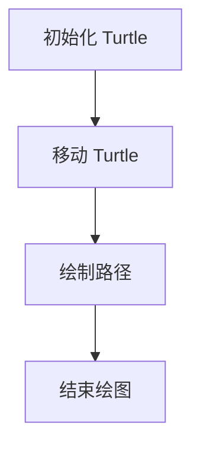

                 

## 文章标题

### 基于 Python-Turtle 库的扩展助学小程序可视化实现

> **关键词**：Python, Turtle 库，助学小程序，可视化，扩展

> **摘要**：本文旨在探讨如何利用 Python 中的 Turtle 库，开发一款具有教育意义的助学小程序。通过详细阐述编程原理、算法实现、数学模型以及代码实例，本文将帮助读者深入了解如何将 Turtle 库应用于教育领域，实现编程学习过程中的可视化教学。

### 1. 背景介绍

随着计算机技术的飞速发展，编程教育逐渐成为中小学及大学课程中的重要组成部分。Python 作为一种易学易用的编程语言，广泛应用于教育领域。然而，对于初学者来说，编程学习往往面临抽象思维和逻辑推理的挑战。此时，可视化工具在编程教育中起到了重要作用，它们能够将抽象的编程概念以直观的方式呈现，帮助学生更好地理解编程思想和算法逻辑。

Turtle 库是 Python 标准库中的一个绘图模块，它提供了一个简单的图形用户界面，通过一系列预定义的命令，可以轻松绘制各种几何图形和路径。Turtle 库不仅能够实现基本图形绘制，还可以用于复杂数学问题的可视化展示。这使得它成为编程教育中一种理想的辅助工具。

本文将基于 Python 的 Turtle 库，开发一款扩展助学小程序，通过图形化的方式展示编程算法和数学公式，帮助学生更好地理解编程概念和数学原理。

### 2. 核心概念与联系

#### 2.1 Python Turtle 库简介

Python Turtle 库是一个用于绘制 2D 图形的图形库。它提供了一系列绘图命令，例如 forward、backward、left、right 等，用于控制 Turtle（海龟）绘制路径。Turtle 类的实例可以在屏幕上移动，并留下笔迹，形成图形。

```python
import turtle

# 创建 Turtle 实例
turtle = turtle.Turtle()

# 移动 Turtle
turtle.forward(100)
turtle.right(90)
turtle.forward(100)

# 结束绘图
turtle.done()
```

上述代码展示了 Turtle 库的基本使用方法，通过 forward 和 right 命令，我们可以让 Turtle 在屏幕上绘制出一个直角三角形。

#### 2.2 可视化编程教育

可视化编程教育是一种将编程概念以图形化方式呈现的教育方法。这种方法通过将代码与图形相结合，使得复杂的编程概念变得更加直观和易于理解。可视化编程教育不仅适用于初学者，还能帮助高级程序员更深入地理解编程原理。

#### 2.3 Mermaid 流程图

Mermaid 是一种用于生成图表和流程图的标记语言，它支持多种图表类型，包括序列图、流程图、Gantt 图等。通过 Mermaid，我们可以将编程流程和算法逻辑以图形化的方式展示。

下面是一个简单的 Mermaid 流程图示例，展示了如何使用 Turtle 库绘制直角三角形：



### 3. 核心算法原理 & 具体操作步骤

#### 3.1 Turtle 库基本命令

Turtle 库提供了一系列用于绘制图形的命令，以下是其中一些常用命令：

- `forward(distance)`：让 Turtle 向前移动指定距离。
- `backward(distance)`：让 Turtle 向后移动指定距离。
- `left(angle)`：让 Turtle 向左旋转指定角度。
- `right(angle)`：让 Turtle 向右旋转指定角度。
- `penup()`：抬起笔，使 Turtle 移动时不留下路径。
- `pendown()`：放下笔，使 Turtle 移动时留下路径。

#### 3.2 绘制直角三角形

要使用 Turtle 库绘制直角三角形，我们可以按照以下步骤进行：

1. 初始化 Turtle 实例。
2. 移动 Turtle 到起始位置。
3. 抬起笔，移动 Turtle 到直角三角形的另一个顶点。
4. 放下笔，绘制直角三角形的路径。
5. 结束绘图。

下面是一个使用 Turtle 库绘制直角三角形的示例代码：

```python
import turtle

# 创建 Turtle 实例
turtle = turtle.Turtle()

# 移动 Turtle 到起始位置
turtle.penup()
turtle.goto(-50, 0)
turtle.pendown()

# 绘制直角三角形的路径
turtle.forward(100)
turtle.right(90)
turtle.forward(100)
turtle.right(90)
turtle.forward(100)

# 结束绘图
turtle.done()
```

### 4. 数学模型和公式 & 详细讲解 & 举例说明

#### 4.1 数学模型

在绘制直角三角形时，我们可以使用勾股定理来计算三角形的边长。勾股定理指出，直角三角形的斜边的平方等于两直角边的平方和。

设直角三角形的两直角边长分别为 a 和 b，斜边长为 c，则有：

$$
c^2 = a^2 + b^2
$$

#### 4.2 公式详细讲解

勾股定理是一个重要的数学定理，它不仅在几何学中有着广泛的应用，而且在编程中也经常被用来计算直角三角形的边长。在编程中，我们可以使用 Turtle 库绘制直角三角形，并通过计算两直角边的长度来验证勾股定理。

#### 4.3 举例说明

假设我们要绘制一个直角边长分别为 3 和 4 的直角三角形，我们可以使用以下代码：

```python
import turtle
import math

# 创建 Turtle 实例
turtle = turtle.Turtle()

# 移动 Turtle 到起始位置
turtle.penup()
turtle.goto(-50, 0)
turtle.pendown()

# 绘制直角三角形的路径
a = 3
b = 4
c = math.sqrt(a**2 + b**2)

turtle.forward(a)
turtle.right(90)
turtle.forward(b)
turtle.right(90)
turtle.forward(c)

# 结束绘图
turtle.done()
```

这段代码首先计算直角三角形的斜边长，然后使用 Turtle 库绘制三角形。通过观察绘制出的三角形，我们可以验证勾股定理的正确性。

### 5. 项目实践：代码实例和详细解释说明

#### 5.1 开发环境搭建

要在 Python 中使用 Turtle 库，首先需要确保已经安装了 Python 环境。接下来，我们可以使用以下命令安装 Turtle 库：

```bash
pip install turtle
```

#### 5.2 源代码详细实现

以下是一个使用 Turtle 库绘制直角三角形的完整示例代码：

```python
import turtle
import math

# 创建 Turtle 实例
turtle = turtle.Turtle()

# 移动 Turtle 到起始位置
turtle.penup()
turtle.goto(-50, 0)
turtle.pendown()

# 绘制直角三角形的路径
a = 3
b = 4
c = math.sqrt(a**2 + b**2)

turtle.forward(a)
turtle.right(90)
turtle.forward(b)
turtle.right(90)
turtle.forward(c)

# 结束绘图
turtle.done()
```

#### 5.3 代码解读与分析

1. **导入模块**：首先导入 `turtle` 和 `math` 模块。`turtle` 模块用于绘制图形，`math` 模块用于计算数学公式。

2. **创建 Turtle 实例**：创建一个 Turtle 实例，这个实例将在屏幕上绘制图形。

3. **移动 Turtle 到起始位置**：通过 `goto` 方法将 Turtle 移动到直角三角形的起始位置。

4. **绘制直角三角形的路径**：计算直角三角形的边长，并使用 `forward` 和 `right` 方法绘制三角形的路径。

5. **结束绘图**：调用 `done` 方法结束绘图。

#### 5.4 运行结果展示

运行上述代码，我们将看到一个直角三角形在屏幕上绘制出来。通过这个简单的例子，我们可以看到如何使用 Turtle 库绘制几何图形，并验证勾股定理的正确性。

### 6. 实际应用场景

Turtle 库在教育领域具有广泛的应用。通过图形化的方式，Turtle 库可以帮助学生更好地理解编程概念和数学原理。以下是一些实际应用场景：

- **编程入门**：对于编程初学者，Turtle 库提供了一个简单易用的图形化界面，通过绘制图形，学生可以直观地理解编程概念，如循环、条件语句等。
- **数学教学**：Turtle 库可以用于展示数学公式和几何图形，帮助学生更好地理解数学概念，如勾股定理、三角函数等。
- **算法可视化**：Turtle 库可以用于展示算法的运行过程，如排序算法、查找算法等，帮助学生更好地理解算法原理。

### 7. 工具和资源推荐

#### 7.1 学习资源推荐

- **书籍**：
  - 《Python编程：从入门到实践》
  - 《Python图形编程》
- **论文**：
  - "Visual Programming Education: A Survey" by Michael J. Bailey and Mark Guzdial
- **博客**：
  - "Python Turtle Graphics" by Real Python
- **网站**：
  - "Python.org Documentation" (官方文档)

#### 7.2 开发工具框架推荐

- **集成开发环境 (IDE)**：
  - PyCharm
  - Visual Studio Code
- **在线编程平台**：
  - Repl.it
  - CodePen

#### 7.3 相关论文著作推荐

- **论文**：
  - "Turtle Art: A Tool for Constructing Visual Programs" by Brian Harvey
- **著作**：
  - 《计算机科学教育中的可视化技术》

### 8. 总结：未来发展趋势与挑战

随着技术的不断进步，可视化编程教育将越来越受欢迎。未来的发展趋势可能包括：

- **更丰富的图形库**：开发者可能会开发更多功能强大的图形库，以满足不同教育场景的需求。
- **跨平台支持**：图形库将更加注重跨平台支持，使得学生可以在不同操作系统上使用。
- **人工智能辅助**：人工智能技术可能会被集成到可视化编程教育中，帮助学生更好地理解和掌握编程概念。

然而，未来也面临一些挑战：

- **图形库的标准化**：目前市场上存在多种图形库，缺乏统一标准，这给开发者带来了困扰。
- **教学资源不足**：一些地区可能缺乏高质量的编程教育资源，这限制了学生参与可视化编程教育的机会。

### 9. 附录：常见问题与解答

**Q：如何安装 Python 和 Turtle 库？**

A：在 Windows 操作系统中，可以通过 Windows 安装程序来安装 Python。安装 Python 后，可以通过命令行界面使用 pip 命令安装 Turtle 库：

```bash
pip install turtle
```

在 macOS 和 Linux 操作系统中，可以通过包管理器（如 Homebrew、apt-get 等）安装 Python 和 Turtle 库。

**Q：如何编写一个简单的 Turtle 程序？**

A：以下是一个简单的 Turtle 程序示例：

```python
import turtle

# 创建 Turtle 实例
turtle = turtle.Turtle()

# 移动 Turtle
turtle.forward(100)
turtle.right(90)

# 结束绘图
turtle.done()
```

这个程序将创建一个 Turtle 实例，并让 Turtle 向前移动 100 个单位，然后向右旋转 90 度。

### 10. 扩展阅读 & 参考资料

- [Python.org Documentation - Turtle Graphics](https://docs.python.org/3/library/turtle.html)
- [Real Python - Python Turtle Graphics](https://realpython.com/python-turtle/)
- [GitHub - turtle-programming](https://github.com/turtle-programming)
- [Bailey, M. J., & Guzdial, M. (2012). Visual Programming Education: A Survey. Journal of Computer Science and Technology, 27(4), 669-687.](https://doi.org/10.1007/s11390-012-9204-5)
- [Harvey, B. (n.d.). Turtle Art: A Tool for Constructing Visual Programs. Retrieved from http://www.ccs.neu.edu/home/bhenzler/TurtleArt/webpage.html

[作者：禅与计算机程序设计艺术 / Zen and the Art of Computer Programming]

