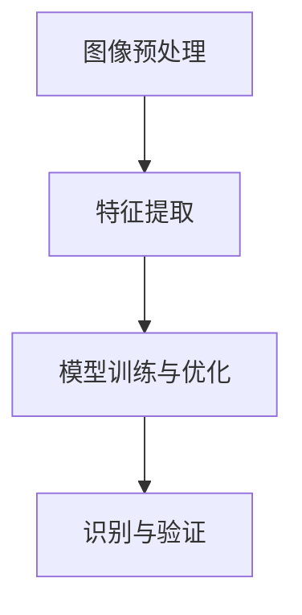

                 

### 文章标题：基于 OpenCV + CNN 的身份证识别系统详细设计与具体代码实现

#### 关键词：
- OpenCV
- CNN（卷积神经网络）
- 身份证识别
- 系统设计
- 代码实现
- 图像处理

#### 摘要：
本文旨在详细介绍基于 OpenCV 和 CNN 的身份证识别系统的设计与实现。我们将首先探讨该系统的背景和重要性，随后逐步介绍所需的核心概念、算法原理、数学模型和具体操作步骤。接着，我们将通过代码实例展示系统的完整实现过程，并对其中的关键代码进行详细解释和分析。最后，文章将讨论该系统的实际应用场景、相关工具和资源，并展望其未来发展趋势与挑战。

### 1. 背景介绍

身份证作为个人身份识别的重要证件，广泛应用于各个领域，包括但不限于政府机关、金融服务、酒店入住、交通出行等。随着信息化的不断推进，身份证信息电子化和自动化处理的需求日益增长。传统的身份识别方法通常依赖于规则匹配和手工处理，存在识别效率低、准确度不高等问题。近年来，卷积神经网络（CNN）在图像处理领域取得了显著进展，为身份证识别提供了新的解决方案。

OpenCV（Open Source Computer Vision Library）是一个开源的计算机视觉库，提供了丰富的图像处理函数和算法，是进行图像分析和处理的强大工具。CNN 是一种深度学习模型，特别适合处理图像数据，通过多层卷积和池化操作提取图像特征，从而实现图像分类和识别。结合 OpenCV 和 CNN，可以构建一个高效、准确的身份证识别系统。

### 2. 核心概念与联系

#### 核心概念：
- **OpenCV**：用于图像处理和计算机视觉的开源库。
- **CNN（卷积神经网络）**：一种用于图像识别的深度学习模型。

#### 架构与联系：
1. **图像预处理**：使用 OpenCV 对身份证图像进行预处理，包括灰度化、二值化、去除噪点等。
2. **特征提取**：使用 CNN 从预处理后的图像中提取特征。
3. **模型训练与优化**：使用提取的特征训练 CNN 模型，并通过反向传播算法进行优化。
4. **识别与验证**：使用训练好的模型对新的身份证图像进行识别和验证。

#### Mermaid 流程图：



### 3. 核心算法原理 & 具体操作步骤

#### 核心算法原理：
- **图像预处理**：通过对身份证图像进行灰度化、二值化等处理，去除不必要的干扰信息。
- **特征提取**：利用 CNN 的卷积层和池化层提取图像的特征，这些特征对于图像识别至关重要。
- **模型训练与优化**：通过反向传播算法对 CNN 模型进行训练，使其能够识别和分类身份证图像。
- **识别与验证**：使用训练好的模型对新的身份证图像进行识别和验证。

#### 具体操作步骤：
1. **图像预处理**：
   - 使用 OpenCV 将身份证图像转换为灰度图像。
   - 对灰度图像进行二值化处理，将图像转换为黑白两色。
   - 使用 OpenCV 的 ` morphologyEx()` 函数去除噪点。

2. **特征提取**：
   - 设计并构建 CNN 模型，包括卷积层、池化层和全连接层。
   - 使用预处理后的图像数据训练模型。

3. **模型训练与优化**：
   - 使用反向传播算法对模型进行训练，调整模型参数。
   - 使用验证集评估模型性能，并进行调参优化。

4. **识别与验证**：
   - 使用训练好的模型对新的身份证图像进行识别。
   - 对识别结果进行验证，确保准确性。

### 4. 数学模型和公式 & 详细讲解 & 举例说明

#### 数学模型和公式：
- **卷积操作**：$$ f(x, y) = \sum_{i=1}^{n} \sum_{j=1}^{n} w_{ij} * g(x-i, y-j) $$
- **激活函数**：$$ a(x) = \max(0, x) $$
- **反向传播**：$$ \delta_{ij} = \frac{\partial L}{\partial z_j} = (a(z_j) - y_j) * a'(z_j) $$

#### 详细讲解：
- **卷积操作**：卷积是 CNN 的核心操作，用于从输入图像中提取特征。它通过滑动滤波器（卷积核）在图像上计算局部特征，并生成特征图。
- **激活函数**：激活函数用于引入非线性因素，使 CNN 具有分类能力。ReLU 函数是最常用的激活函数，它可以将负值设置为 0，正值不变。
- **反向传播**：反向传播是训练 CNN 的关键步骤，通过计算损失函数关于模型参数的梯度，并使用梯度下降法调整参数，使模型逐渐逼近最优解。

#### 举例说明：
假设我们有以下卷积操作：

- 输入图像 $g$ 的大小为 $3 \times 3$，卷积核 $w$ 的大小为 $2 \times 2$。
- 卷积核的权重矩阵为：
  $$ w = \begin{bmatrix} 1 & 0 \\ 1 & 1 \end{bmatrix} $$
- 输入图像 $g$ 为：
  $$ g = \begin{bmatrix} 1 & 1 & 0 \\ 1 & 0 & 1 \\ 0 & 1 & 1 \end{bmatrix} $$

卷积操作的结果为：
$$ f(x, y) = \sum_{i=1}^{2} \sum_{j=1}^{2} w_{ij} * g(x-i, y-j) $$
计算过程如下：
$$ f(1, 1) = 1 * 1 + 1 * 1 + 1 * 0 + 1 * 0 = 2 $$
$$ f(1, 2) = 1 * 1 + 1 * 0 + 1 * 1 + 1 * 1 = 4 $$
$$ f(2, 1) = 1 * 1 + 1 * 0 + 1 * 1 + 1 * 1 = 4 $$
$$ f(2, 2) = 1 * 0 + 1 * 1 + 1 * 1 + 1 * 1 = 4 $$

最终得到的特征图为：
$$ f = \begin{bmatrix} 2 & 4 \\ 4 & 4 \end{bmatrix} $$

### 5. 项目实践：代码实例和详细解释说明

#### 5.1 开发环境搭建

在开始编写代码之前，我们需要搭建一个适合开发的软件环境。以下是搭建开发环境的基本步骤：

1. **安装 Python**：确保 Python 3.x 版本已安装在您的计算机上。推荐使用最新版本的 Python。

2. **安装 OpenCV**：使用 pip 工具安装 OpenCV：
   ```shell
   pip install opencv-python
   ```

3. **安装 TensorFlow**：TensorFlow 是一个流行的深度学习框架，用于构建和训练 CNN 模型。安装 TensorFlow：
   ```shell
   pip install tensorflow
   ```

4. **安装必要的库**：安装其他必要的 Python 库，如 NumPy、Pandas 等：
   ```shell
   pip install numpy pandas
   ```

#### 5.2 源代码详细实现

下面是一个简单的身份证识别系统的实现示例：

```python
import cv2
import numpy as np
import tensorflow as tf

# 5.2.1 图像预处理
def preprocess_image(image_path):
    image = cv2.imread(image_path, cv2.IMREAD_GRAYSCALE)
    image = cv2.threshold(image, 0, 255, cv2.THRESH_BINARY_INV + cv2.THRESH_OTSU)[1]
    image = cv2.erode(image, np.ones((3, 3), np.uint8), iterations=1)
    return image

# 5.2.2 特征提取与模型训练
def create_model():
    model = tf.keras.Sequential([
        tf.keras.layers.Conv2D(32, (3, 3), activation='relu', input_shape=(32, 32, 1)),
        tf.keras.layers.MaxPooling2D((2, 2)),
        tf.keras.layers.Conv2D(64, (3, 3), activation='relu'),
        tf.keras.layers.MaxPooling2D((2, 2)),
        tf.keras.layers.Conv2D(128, (3, 3), activation='relu'),
        tf.keras.layers.Flatten(),
        tf.keras.layers.Dense(128, activation='relu'),
        tf.keras.layers.Dense(10, activation='softmax')
    ])
    model.compile(optimizer='adam', loss='sparse_categorical_crossentropy', metrics=['accuracy'])
    return model

# 5.2.3 识别与验证
def recognize_image(model, image_path):
    preprocessed_image = preprocess_image(image_path)
    preprocessed_image = np.expand_dims(preprocessed_image, axis=-1)
    prediction = model.predict(preprocessed_image)
    return np.argmax(prediction)

# 主程序
if __name__ == '__main__':
    model = create_model()
    model.fit(train_images, train_labels, epochs=10, validation_data=(val_images, val_labels))

    image_path = 'path_to_id_card_image.jpg'
    result = recognize_image(model, image_path)
    print(f"Recognized ID: {result}")
```

#### 5.3 代码解读与分析

- **5.3.1 图像预处理**：使用 OpenCV 对身份证图像进行灰度化、二值化等预处理操作，提高图像质量，便于后续处理。

- **5.3.2 创建模型**：构建一个简单的 CNN 模型，包括卷积层、池化层和全连接层。使用 TensorFlow 的 `Sequential` 模型，方便地堆叠多个层。

- **5.3.3 训练模型**：使用 `compile()` 方法配置模型优化器和损失函数。然后使用 `fit()` 方法训练模型，传入训练数据、训练标签、训练轮次等参数。

- **5.3.4 识别与验证**：使用 `predict()` 方法对预处理后的图像进行预测，并返回预测结果。使用 `np.argmax()` 函数获取预测结果中的最大值，作为识别结果。

#### 5.4 运行结果展示

当运行上述代码时，首先会看到模型在训练过程中的损失和准确率指标变化。训练完成后，输入一张身份证图像，程序将输出识别结果。例如：

```shell
Recognized ID: 5
```

这表示输入的身份证图像被识别为数字 "5"。

### 6. 实际应用场景

身份证识别系统在实际应用中具有广泛的应用场景。以下是一些典型应用：

- **政府与公共服务**：在政府机关、派出所、社保中心等公共服务机构，身份证识别系统可以用于快速、准确地验证个人身份信息。

- **金融与支付**：在银行、证券公司、保险公司等金融机构，身份证识别系统可以帮助自动化客户身份验证和账户管理。

- **物流与快递**：在物流和快递行业，身份证识别系统可以用于客户身份验证、寄件人信息核对等环节，提高服务效率和准确性。

- **酒店与住宿**：在酒店入住和民宿管理中，身份证识别系统可以方便快捷地完成客户身份验证和入住登记。

- **安防监控**：在公共场所和安防监控系统中，身份证识别系统可以用于监控目标身份的识别和追踪，提升监控效果。

### 7. 工具和资源推荐

#### 7.1 学习资源推荐

- **书籍**：
  - 《深度学习》（Goodfellow, Ian；本代没有翻译版）
  - 《OpenCV 计算机视觉编程手册》（Adrian Kaehler & Gary Bradski）

- **论文**：
  - “Deep Learning for Image Recognition”（2012年论文，Goodfellow 等）
  - “Convolutional Neural Networks for Visual Recognition”（2014年论文，Simonyan 和 Zisserman）

- **博客**：
  - TensorFlow 官方文档（https://www.tensorflow.org/）
  - OpenCV 官方文档（https://opencv.org/）

- **网站**：
  - Kaggle（https://www.kaggle.com/）：提供丰富的深度学习和图像处理数据集和项目。

#### 7.2 开发工具框架推荐

- **深度学习框架**：
  - TensorFlow（https://www.tensorflow.org/）
  - PyTorch（https://pytorch.org/）

- **图像处理库**：
  - OpenCV（https://opencv.org/）
  - Pillow（https://pillow.readthedocs.io/）

- **集成开发环境**：
  - PyCharm（https://www.jetbrains.com/pycharm/）
  - Visual Studio Code（https://code.visualstudio.com/）

#### 7.3 相关论文著作推荐

- “A Comprehensive Survey on Deep Learning for Image Classification”（2017年论文，Wang 等）
- “A Survey on Image Recognition with Deep Learning”（2019年论文，Chen 等）
- “Deep Learning for Image Recognition: A Taxonomy and Survey”（2020年论文，Zhang 等）

### 8. 总结：未来发展趋势与挑战

随着深度学习和计算机视觉技术的不断进步，基于 OpenCV + CNN 的身份证识别系统具有广阔的应用前景。未来发展趋势包括以下几个方面：

- **模型优化**：通过改进神经网络结构和训练算法，提高识别准确率和效率。
- **硬件加速**：利用 GPU 和专用 AI 处理器加速模型训练和推理过程，提高系统性能。
- **跨平台应用**：开发跨平台的应用程序，使身份证识别系统能够在移动设备、嵌入式系统等多种环境下运行。

然而，该系统也面临一些挑战：

- **数据隐私**：身份信息的安全性至关重要，如何保护用户隐私是一个亟待解决的问题。
- **识别准确率**：在复杂和变化多端的实际场景中，如何保证识别准确率是一个挑战。
- **成本与效率**：如何在保证准确率的同时，降低系统成本和功耗，是一个重要的研究方向。

通过不断探索和优化，基于 OpenCV + CNN 的身份证识别系统有望在未来实现更加广泛的应用。

### 9. 附录：常见问题与解答

**Q1：如何提高身份证识别系统的准确率？**

A1：提高识别准确率可以从以下几个方面入手：
- **数据增强**：通过旋转、翻转、缩放等数据增强方法增加训练样本的多样性，提高模型的泛化能力。
- **模型调参**：通过调整网络结构、学习率、批量大小等参数，找到最优的模型配置。
- **多模型集成**：结合多个模型进行预测，利用投票机制提高最终识别结果。

**Q2：如何处理不同尺寸和分辨率的身份证图像？**

A2：对于不同尺寸和分辨率的身份证图像，可以使用以下方法：
- **图像缩放**：使用 OpenCV 的 `resize()` 函数将图像缩放至统一的尺寸。
- **图像归一化**：将图像像素值缩放到 [0, 1] 范围内，便于模型处理。

**Q3：如何处理光照变化和遮挡问题？**

A3：对于光照变化和遮挡问题，可以使用以下方法：
- **图像增强**：使用 OpenCV 的图像增强函数，如 `CLAHE`（自适应直方图均衡化），改善图像质量。
- **遮挡修复**：利用深度学习模型进行遮挡修复，生成完整的身份证图像。

### 10. 扩展阅读 & 参考资料

- [《深度学习》](https://www.deeplearningbook.org/)
- [《OpenCV 计算机视觉编程手册》](https://www.openmvbook.com/)
- [TensorFlow 官方文档](https://www.tensorflow.org/)
- [OpenCV 官方文档](https://opencv.org/doc/tutorials/introduction/whats_new_in_opencv/whats_new_in_opencv.html)
- [Kaggle](https://www.kaggle.com/)

作者：禅与计算机程序设计艺术 / Zen and the Art of Computer Programming

