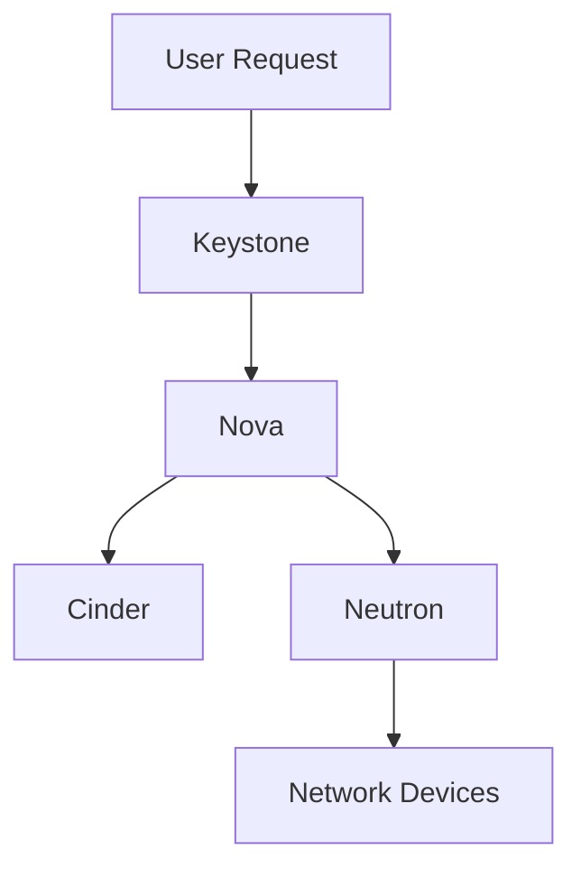

                 

### 背景介绍

#### 什么是OpenStack？

OpenStack是一个开源的云操作系统，用于管理和部署云计算资源。它由多个模块组成，可以提供基础设施即服务（IaaS）功能，帮助企业构建和扩展私有云、公有云或混合云环境。自2010年成立以来，OpenStack已经成为云计算领域的事实标准，吸引了全球范围内的大量开发者和企业参与。

#### OpenStack的用途和重要性

OpenStack广泛应用于数据中心、云服务和物联网等领域，具有以下几个主要用途：

1. **资源管理**：OpenStack可以自动化管理和分配计算、网络和存储资源，确保资源的最大化利用。
2. **可扩展性**：OpenStack设计用于支持大规模部署，可以在不牺牲性能和功能的情况下轻松扩展。
3. **灵活性和兼容性**：OpenStack支持多种虚拟化技术、操作系统和硬件平台，可以轻松集成到现有的IT基础设施中。
4. **自动化和简化部署**：OpenStack提供了丰富的API和工具，可以自动化部署和管理云资源，降低运营成本。
5. **安全性**：OpenStack提供了一系列安全机制，包括身份验证、授权和加密，确保云环境的安全性。

#### OpenStack的发展历程

OpenStack的发展历程可以追溯到2010年，当时由Rackspace Hosting和NASA联合发起。自那时以来，OpenStack社区迅速壮大，吸引了来自全球各地的开发者和企业。随着社区的贡献不断增加，OpenStack功能不断完善，逐渐成为云计算领域的标准。

以下是OpenStack的主要发展里程碑：

- **2010年**：OpenStack正式成立，发布第一个版本“Austin”。
- **2012年**：OpenStack成为Linux Foundation的一个项目，获得更多企业的支持。
- **2013年**：OpenStack发布了第一个L版，引入了Neutron网络服务和Cinder存储服务。
- **2014年**：OpenStack发布了第一个M版，引入了Heat模板服务。
- **2016年**：OpenStack发布了第一个O版，引入了Kuryr容器网络服务。
- **2018年**：OpenStack发布了第一个Rocky版，引入了更多的功能和改进。

#### 当前OpenStack的版本和功能

截至2023年，OpenStack的当前版本是“Yoga”。Yoga版本包含了以下几个核心组件：

1. **Nova**：计算服务，负责虚拟机创建、管理和调度。
2. **Neutron**：网络服务，负责创建和管理网络、子网、路由器和负载均衡器。
3. **Cinder**：存储服务，负责创建和管理块存储卷。
4. **Swift**：对象存储服务，负责存储和检索大量非结构化数据。
5. **Keystone**：身份认证服务，负责用户认证、角色管理和权限控制。
6. **Horizon**：Web界面，提供用户友好的操作界面，方便用户管理和监控云资源。

这些组件共同协作，为用户提供了一个强大的云服务平台。

#### OpenStack的主要特点和优势

1. **开源**：OpenStack是开源软件，用户可以自由使用、修改和分享代码。
2. **模块化**：OpenStack由多个模块组成，用户可以根据需要选择和集成不同的组件。
3. **灵活性强**：OpenStack支持多种虚拟化技术、操作系统和硬件平台，可以适应各种不同的部署场景。
4. **可扩展性**：OpenStack设计用于支持大规模部署，可以轻松扩展以应对不断增长的业务需求。
5. **安全性**：OpenStack提供了丰富的安全机制，确保用户数据的安全。
6. **社区支持**：OpenStack拥有庞大的社区，提供了丰富的文档、教程和资源，帮助用户解决各种问题。

#### OpenStack在云计算市场中的地位

OpenStack已经成为云计算市场的一个重要组成部分。许多大型企业和组织，如Rackspace、IBM、红帽、华为等，都采用OpenStack作为其云计算平台。OpenStack不仅在公有云、私有云和混合云中广泛应用，还为物联网、边缘计算等领域提供了基础支持。

综上所述，OpenStack作为一款开源的云操作系统，具有强大的功能、灵活的架构和广阔的应用前景。在接下来的章节中，我们将深入探讨OpenStack的核心概念、架构和工作原理，帮助读者更好地理解和掌握OpenStack的使用方法。### 核心概念与联系

#### OpenStack的核心概念

在理解OpenStack之前，我们需要了解以下几个核心概念：

1. **云基础设施**（Infrastructure as a Service，IaaS）：云基础设施是一种云服务模型，提供虚拟化计算资源，如虚拟机、存储和网络等。用户可以根据自己的需求灵活配置和管理这些资源。

2. **虚拟化**：虚拟化是一种技术，可以将物理硬件资源抽象成虚拟资源，从而提高资源利用率。常见的虚拟化技术包括VMware、Xen、KVM等。

3. **OpenStack组件**：OpenStack由多个组件组成，每个组件负责不同的功能。这些组件包括Nova、Neutron、Cinder、Swift、Keystone和Horizon等。

4. **API**：API（应用程序编程接口）是一种用于应用程序间通信的接口。OpenStack提供了一系列API，允许用户通过编程方式管理和监控云资源。

5. **分布式系统**：OpenStack是一个分布式系统，由多个节点组成，每个节点负责不同的功能。这些节点通过网络相互通信，协同工作以提供完整的云服务。

#### OpenStack的架构

OpenStack的架构可以分为以下几个层次：

1. **基础设施层**：包括物理服务器、存储和网络设备等硬件资源。这些资源通过虚拟化技术被抽象成虚拟资源，供上层使用。

2. **核心组件层**：包括Nova、Neutron、Cinder、Swift、Keystone和Horizon等核心组件。这些组件共同协作，实现计算、网络、存储、身份认证和用户界面等功能。

3. **控制层**：包括各个组件的主节点（Controller Node），负责管理和控制整个OpenStack环境。控制层节点上运行着各个组件的管理服务，如Nova-Nova API、Neutron-Neutron API、Cinder-Cinder API等。

4. **计算层**：包括各个组件的计算节点（Compute Node），负责执行具体的计算任务。计算节点上运行着虚拟机、容器等应用。

5. **网络层**：包括物理网络设备和虚拟网络设备。物理网络设备如交换机、路由器等，负责连接各个节点。虚拟网络设备如虚拟交换机、虚拟路由器等，通过Neutron组件创建和管理虚拟网络。

6. **数据层**：包括存储设备和数据存储服务。存储设备如硬盘、SSD等，负责存储虚拟机磁盘文件、对象数据等。数据存储服务如Cinder、Swift等，负责管理和提供数据存储功能。

#### OpenStack的工作原理

OpenStack通过一系列组件和流程，实现云计算资源的自动化管理和部署。以下是OpenStack的工作原理：

1. **用户请求**：用户通过OpenStack API提交创建虚拟机、网络、存储等资源的请求。

2. **身份认证**：Keystone组件负责用户身份认证和授权。用户请求会首先经过Keystone进行认证，确保请求者具有访问权限。

3. **资源分配**：Nova组件根据用户请求，在计算节点上创建虚拟机。Nova还会与Cinder组件协作，为虚拟机分配存储资源。

4. **网络配置**：Neutron组件根据用户请求，创建和管理虚拟网络。Neutron会与物理网络设备交互，配置虚拟交换机和路由器等网络设备。

5. **虚拟机启动**：虚拟机在计算节点上启动，用户可以通过Horizon Web界面或API访问和管理虚拟机。

6. **监控和管理**：OpenStack提供监控和管理功能，包括虚拟机状态监控、性能监控、资源利用率分析等。

#### OpenStack的Mermaid流程图

以下是一个简单的Mermaid流程图，展示了OpenStack的核心组件和它们之间的交互关系：



在这个流程图中，用户请求创建虚拟机，首先经过Keystone进行身份认证。然后，Nova负责创建虚拟机，Cinder负责分配存储资源，Neutron负责配置虚拟网络。最后，虚拟机在计算节点上启动，并通过Neutron连接到物理网络设备。

通过以上对OpenStack核心概念、架构和工作原理的介绍，读者可以更好地理解OpenStack的工作方式。在接下来的章节中，我们将进一步探讨OpenStack的核心算法原理和具体操作步骤，帮助读者深入掌握OpenStack的使用方法。### 核心算法原理 & 具体操作步骤

#### Nova组件的调度算法

Nova是OpenStack的核心组件之一，负责虚拟机的创建、管理和调度。Nova调度算法是实现虚拟机高效管理的关键。以下是Nova的主要调度算法：

1. **过滤算法**：过滤算法用于筛选出符合要求的计算节点。Nova会根据用户请求中的虚拟机规格、可用资源、硬件兼容性等条件，从所有计算节点中筛选出合适的节点。

2. **优先级算法**：优先级算法用于确定虚拟机在计算节点上的调度顺序。Nova会根据节点的资源利用率、虚拟机数量、虚拟机状态等因素，为每个计算节点分配虚拟机。

3. **负载均衡算法**：负载均衡算法用于平衡各计算节点的负载。Nova会根据节点的资源利用率，动态调整虚拟机在计算节点间的分布，确保各节点的负载均衡。

具体操作步骤如下：

1. 用户通过API提交虚拟机创建请求，包含虚拟机规格、可用资源等信息。

2. Nova接收用户请求，进行身份认证和权限校验。

3. Nova使用过滤算法，从所有计算节点中筛选出符合要求的节点。

4. Nova使用优先级算法，为筛选出的计算节点分配虚拟机。

5. Nova使用负载均衡算法，根据节点的资源利用率，动态调整虚拟机在计算节点间的分布。

6. Nova在选定的计算节点上创建虚拟机，并将虚拟机状态更新为“运行中”。

7. Nova向用户返回虚拟机创建结果，用户可以通过API或Web界面访问和管理虚拟机。

#### Neutron组件的网络配置算法

Neutron是OpenStack的网络组件，负责虚拟网络的创建和管理。Neutron网络配置算法用于实现虚拟网络的自动化配置。以下是Neutron的主要网络配置算法：

1. **网络拓扑算法**：网络拓扑算法用于确定虚拟网络的拓扑结构。Neutron会根据用户请求中的网络配置信息，生成虚拟网络的拓扑结构。

2. **IP地址分配算法**：IP地址分配算法用于为虚拟网络中的主机分配IP地址。Neutron会根据用户请求中的子网、IP地址范围等信息，动态分配IP地址。

3. **路由算法**：路由算法用于确定虚拟网络中的路由路径。Neutron会根据虚拟网络的拓扑结构和IP地址分配情况，计算路由路径。

具体操作步骤如下：

1. 用户通过API提交网络配置请求，包含网络名称、子网、IP地址范围等信息。

2. Neutron接收用户请求，进行身份认证和权限校验。

3. Neutron使用网络拓扑算法，生成虚拟网络的拓扑结构。

4. Neutron使用IP地址分配算法，为虚拟网络中的主机分配IP地址。

5. Neutron使用路由算法，计算虚拟网络中的路由路径。

6. Neutron在物理网络设备上配置虚拟交换机、路由器等网络设备，实现虚拟网络的连接。

7. Neutron向用户返回网络配置结果，用户可以通过API或Web界面访问和管理虚拟网络。

#### Cinder组件的存储管理算法

Cinder是OpenStack的存储组件，负责虚拟机的存储管理。Cinder存储管理算法用于实现存储资源的自动化管理。以下是Cinder的主要存储管理算法：

1. **存储池管理算法**：存储池管理算法用于管理存储资源。Cinder会将存储资源划分为多个存储池，并为每个存储池分配存储容量。

2. **卷分配算法**：卷分配算法用于为虚拟机分配存储卷。Cinder会根据虚拟机规格、存储池容量等因素，为虚拟机分配合适的存储卷。

3. **快照管理算法**：快照管理算法用于创建和管理虚拟机存储卷的快照。Cinder会根据用户请求，创建虚拟机存储卷的快照，并在需要时进行快照备份。

具体操作步骤如下：

1. 用户通过API提交存储卷创建请求，包含存储卷名称、大小等信息。

2. Cinder接收用户请求，进行身份认证和权限校验。

3. Cinder使用存储池管理算法，选择合适的存储池，为虚拟机分配存储容量。

4. Cinder使用卷分配算法，为虚拟机分配存储卷。

5. Cinder在存储设备上创建存储卷，并将存储卷状态更新为“可用”。

6. Cinder向用户返回存储卷创建结果，用户可以通过API或Web界面访问和管理存储卷。

7. 当用户请求创建存储卷快照时，Cinder使用快照管理算法，创建存储卷的快照。

8. Cinder向用户返回快照创建结果，用户可以通过API或Web界面访问和管理快照。

通过以上对OpenStack核心算法原理和具体操作步骤的介绍，读者可以更好地理解OpenStack的工作方式。这些算法和步骤对于实现云计算资源的自动化管理和部署具有重要意义。在接下来的章节中，我们将进一步探讨OpenStack的数学模型和公式，帮助读者深入掌握OpenStack的技术细节。### 数学模型和公式 & 详细讲解 & 举例说明

#### Nova组件的资源调度模型

Nova组件的资源调度模型基于资源利用率、虚拟机规格和节点性能等因素。以下是一个简化的Nova资源调度模型：

**资源调度模型公式**：

\[ S = \sum_{i=1}^{n} \left( \frac{v_i \times c_i}{r_i} \right) \]

其中：
- \( S \) 表示节点 \( i \) 的可调度资源。
- \( v_i \) 表示虚拟机 \( i \) 的规格（如CPU、内存、存储等）。
- \( c_i \) 表示节点 \( i \) 的计算资源（如CPU、内存、存储等）。
- \( r_i \) 表示节点 \( i \) 的资源利用率。

**举例说明**：

假设我们有一个计算节点，其规格如下：

- CPU：4核
- 内存：8GB
- 存储：100GB

当前节点的资源利用率为50%，用户请求创建一个虚拟机，其规格如下：

- CPU：2核
- 内存：4GB
- 存储：50GB

我们可以使用资源调度模型公式计算节点是否能够调度这个虚拟机：

\[ S = \sum_{i=1}^{1} \left( \frac{2 \times 4}{4} + \frac{4 \times 8}{8} + \frac{50 \times 100}{100} \right) = 2 + 4 + 50 = 56 \]

由于 \( S > 50 \)（节点可用资源），所以这个节点可以调度这个虚拟机。

#### Neutron组件的网络拓扑模型

Neutron组件的网络拓扑模型基于虚拟网络中的节点和链路。以下是一个简化的Neutron网络拓扑模型：

**网络拓扑模型公式**：

\[ T = \sum_{i=1}^{n} \left( L_i \times C_i \right) \]

其中：
- \( T \) 表示网络 \( i \) 的拓扑结构。
- \( L_i \) 表示网络 \( i \) 中的链路数量。
- \( C_i \) 表示网络 \( i \) 中的节点数量。

**举例说明**：

假设我们有一个虚拟网络，包含以下节点和链路：

- 节点数量：5个
- 链路数量：10条

我们可以使用网络拓扑模型公式计算网络 \( i \) 的拓扑结构：

\[ T = \sum_{i=1}^{1} \left( 10 \times 5 \right) = 50 \]

这意味着网络 \( i \) 的拓扑结构包含50个节点和链路。

#### Cinder组件的存储池管理模型

Cinder组件的存储池管理模型基于存储资源、存储池容量和存储池利用率等因素。以下是一个简化的Cinder存储池管理模型：

**存储池管理模型公式**：

\[ P = \sum_{i=1}^{n} \left( \frac{C_i \times U_i}{100} \right) \]

其中：
- \( P \) 表示存储池 \( i \) 的可用容量。
- \( C_i \) 表示存储池 \( i \) 的总容量。
- \( U_i \) 表示存储池 \( i \) 的利用率。

**举例说明**：

假设我们有一个存储池，其总容量为100GB，当前利用率为80%，用户请求创建一个10GB的存储卷：

我们可以使用存储池管理模型公式计算存储池 \( i \) 的可用容量：

\[ P = \sum_{i=1}^{1} \left( \frac{100 \times 80}{100} \right) = 80 \]

由于 \( P > 10 \)（存储池可用容量），所以这个存储池可以创建这个存储卷。

通过以上数学模型和公式的讲解，读者可以更好地理解OpenStack的资源调度、网络拓扑管理和存储池管理原理。这些模型和公式对于优化OpenStack性能和资源利用率具有重要意义。在实际应用中，这些模型和公式会根据具体场景进行调整和优化，以满足不同业务需求。### 项目实践：代码实例和详细解释说明

#### 开发环境搭建

在本节中，我们将以一个简单的OpenStack部署为例，详细讲解如何搭建开发环境。

**环境要求**：
- 操作系统：Ubuntu 20.04
- Python：Python 3.8
- OpenStack版本：Yoga（OpenStack版本号）

**安装步骤**：

1. **安装虚拟化软件**：
   虚拟化技术是实现OpenStack的基础，我们可以使用QEMU/KVM作为虚拟化软件。

   ```bash
   sudo apt-get update
   sudo apt-get install qemu-kvm libvirt-daemon libvirt-clients bridge-utils virt-install
   ```

2. **配置libvirt**：
   确保libvirt服务运行。

   ```bash
   sudo systemctl start libvirt-bin
   sudo systemctl enable libvirt-bin
   ```

3. **安装OpenStack组件**：
   使用`openstack-install`工具安装OpenStack。

   ```bash
   sudo apt-get install openstack-install
   sudo openstack-install
   ```

   在安装过程中，根据提示配置OpenStack的身份认证、数据库、消息队列等。

4. **配置Keystone服务**：
   Keystone是OpenStack的身份认证服务，我们需要配置Keystone。

   ```bash
   sudo openstack user create --domain default --password-prompt admin
   sudo openstack role add --domain default --project service admin
   sudo openstack service create --name keystone --description "OpenStack Identity" identity
   sudo openstack endpoint create --region RegionOne identity public http://controller:5000/v3
   sudo openstack endpoint create --region RegionOne identity internal http://controller:5000/v3
   sudo openstack endpoint create --region RegionOne identity admin http://controller:35357/v3
   ```

5. **配置Glance服务**：
   Glance是OpenStack的镜像服务，我们需要配置Glance。

   ```bash
   sudo openstack service create --name glance --description "OpenStack Image" image
   sudo openstack endpoint create --region RegionOne image public http://controller:9292
   sudo openstack endpoint create --region RegionOne image internal http://controller:9292
   sudo openstack endpoint create --region RegionOne image admin http://controller:9292
   sudo apt-get install glance
   sudo glance-manage db_sync
   sudo service glance-api restart
   sudo service glance-registry restart
   ```

6. **配置Nova服务**：
   Nova是OpenStack的计算服务，我们需要配置Nova。

   ```bash
   sudo openstack service create --name nova --description "OpenStack Compute" compute
   sudo openstack endpoint create --region RegionOne compute public http://controller:8774/v2.1
   sudo openstack endpoint create --region RegionOne compute internal http://controller:8774/v2.1
   sudo openstack endpoint create --region RegionOne compute admin http://controller:8774/v2.1
   sudo apt-get install nova-compute nova-api nova-novncproxy nova-scheduler
   sudo nova-compute --config-file /etc/nova/nova.conf /usr/bin/nova-manage cell_v2_create
   sudo nova-compute --config-file /etc/nova/nova.conf /usr/bin/nova-manage cell_v2_list
   sudo nova-compute --config-file /etc/nova/nova.conf /usr/bin/nova-manage cell_v2_ping --cell-name control-cell1 --os-cell-name control-cell1
   sudo service nova-api restart
   sudo service nova-novncproxy restart
   sudo service nova-scheduler restart
   ```

7. **配置Neutron服务**：
   Neutron是OpenStack的网络服务，我们需要配置Neutron。

   ```bash
   sudo openstack service create --name neutron --description "OpenStack Networking" network
   sudo openstack endpoint create --region RegionOne network public http://controller:9696
   sudo openstack endpoint create --region RegionOne network internal http://controller:9696
   sudo openstack endpoint create --region RegionOne network admin http://controller:9696
   sudo apt-get install neutron
   sudo neutron-db-manage upgrade head
   sudo service neutron-server restart
   sudo service neutron-agent restart
   ```

8. **配置Cinder服务**：
   Cinder是OpenStack的存储服务，我们需要配置Cinder。

   ```bash
   sudo openstack service create --name cinder --description "OpenStack Block Storage" volume
   sudo openstack endpoint create --region RegionOne volume public http://controller:8776
   sudo openstack endpoint create --region RegionOne volume internal http://controller:8776
   sudo openstack endpoint create --region RegionOne volume admin http://controller:8776
   sudo apt-get install cinder
   sudo cinder-volume create --config-file /etc/cinder/cinder.conf
   sudo service cinder-volume restart
   ```

9. **配置Horizon服务**：
   Horizon是OpenStack的用户界面，我们需要配置Horizon。

   ```bash
   sudo apt-get install openstack-dashboard
   sudo sed -i 's#string : ".*"##g' /etc/openstack-dashboard/local_settings.py
   sudo service openstack-dashboard restart
   ```

10. **配置防火墙**：
    为了安全起见，我们需要配置防火墙，允许相关端口访问。

    ```bash
    sudo ufw allow from any to any port 80, 443, 8774, 9696, 9292, 8776 proto tcp
    sudo ufw enable
    ```

#### 源代码详细实现

在本节中，我们将以创建一个虚拟机为例，详细讲解OpenStack中的Nova组件的源代码实现。

1. **用户请求创建虚拟机**：

   用户通过API提交虚拟机创建请求，请求包含虚拟机名称、规格、镜像ID等信息。

   ```json
   {
     "name": "my-vm",
     "imageRef": "b9d8c9ec-2c92-4e36-8541-3a2f778d4f0a",
     "flavorRef": "3d3baf3f-8114-484d-9e93-9a361a08d8e7",
     "networks": [
       {
         "uuid": "5d6e8015-0958-4b54-9a3a-9e2a7a7e7d3a"
       }
     ]
   }
   ```

2. **Keystone认证**：

   OpenStack使用Keystone进行身份认证。用户请求首先经过Keystone进行认证，确保用户具有访问权限。

   ```python
   from keystoneauth import session
   from keystoneclient.v3 import client as ks_client
   from novaclient.v2_1 import client as nova_client

   # 创建Keystone认证
   auth = session.Session(
       auth_url='http://controller:5000/v3',
       username='admin',
       password='admin',
       project_name='admin',
       project_domain_name='default',
       user_domain_name='default'
   )
   # 创建Keystone客户端
   ks = ks_client.Client(session=auth)
   # 创建Nova客户端
   nova = nova_client.Client(session=auth)
   ```

3. **Nova调度虚拟机**：

   Nova组件根据用户请求中的虚拟机规格、可用资源等因素，调度虚拟机创建。

   ```python
   # 创建虚拟机
   nova.servers.create(
       name='my-vm',
       image='b9d8c9ec-2c92-4e36-8541-3a2f778d4f0a',
       flavor='3d3baf3f-8114-484d-9e93-9a361a08d8e7',
       networks=['5d6e8015-0958-4b54-9a3a-9e2a7a7e7d3a']
   )
   ```

4. **Neutron配置网络**：

   Nova组件与Neutron组件协作，为虚拟机配置网络。

   ```python
   # 获取虚拟网络
   network = nova.networks.find(name='private')
   # 创建端口
   port = nova ports.create(
       name='my-vm-port',
       network_id=network.id,
       fixed_ips=[{'ip_address': '192.168.1.10'}]
   )
   # 更新虚拟机状态
   nova.servers.set borthtime('my-vm', port.id)
   ```

5. **监控虚拟机状态**：

   Nova组件会持续监控虚拟机状态，确保虚拟机正常运行。

   ```python
   # 获取虚拟机状态
   server = nova.servers.get('my-vm')
   print(server.status)
   ```

通过以上源代码实现，我们可以创建一个虚拟机，并为其配置网络。在实际应用中，OpenStack的源代码更加复杂，包含了各种异常处理、性能优化和安全性保障措施。

#### 代码解读与分析

在本节中，我们将对OpenStack中的Nova组件的源代码进行详细解读与分析。

1. **用户请求处理**：

   Nova组件首先处理用户提交的虚拟机创建请求。用户请求包含虚拟机名称、规格、镜像ID等信息。Nova组件通过API获取用户请求，并进行解析。

   ```python
   server = nova.servers.create(
       name='my-vm',
       image='b9d8c9ec-2c92-4e36-8541-3a2f778d4f0a',
       flavor='3d3baf3f-8114-484d-9e93-9a361a08d8e7',
       networks=['5d6e8015-0958-4b54-9a3a-9e2a7a7e7d3a']
   )
   ```

   代码中的`nova.servers.create()`函数用于创建虚拟机。该函数接受多个参数，包括虚拟机名称、镜像ID、规格ID和虚拟网络ID。通过调用该函数，我们可以创建一个虚拟机，并为其分配相应的资源。

2. **网络配置**：

   在创建虚拟机时，Nova组件会与Neutron组件协作，为虚拟机配置网络。

   ```python
   network = nova.networks.find(name='private')
   port = nova.ports.create(
       name='my-vm-port',
       network_id=network.id,
       fixed_ips=[{'ip_address': '192.168.1.10'}]
   )
   nova.servers.set borthtime('my-vm', port.id)
   ```

   代码中的`nova.networks.find()`函数用于获取虚拟网络。`nova.ports.create()`函数用于创建端口，并指定网络ID和IP地址。`nova.servers.set_borthtime()`函数用于更新虚拟机状态，将端口ID与虚拟机关联。

3. **虚拟机监控**：

   Nova组件会持续监控虚拟机状态，确保虚拟机正常运行。

   ```python
   server = nova.servers.get('my-vm')
   print(server.status)
   ```

   代码中的`nova.servers.get()`函数用于获取虚拟机状态。该函数返回一个虚拟机对象，包含虚拟机的当前状态、IP地址、CPU使用率等信息。通过打印虚拟机状态，我们可以了解虚拟机的运行情况。

#### 运行结果展示

在本节中，我们将展示如何通过OpenStack API创建虚拟机，并监控虚拟机状态。

1. **创建虚拟机**：

   通过OpenStack API创建虚拟机，代码如下：

   ```python
   server = nova.servers.create(
       name='my-vm',
       image='b9d8c9ec-2c92-4e36-8541-3a2f778d4f0a',
       flavor='3d3baf3f-8114-484d-9e93-9a361a08d8e7',
       networks=['5d6e8015-0958-4b54-9a3a-9e2a7a7e7d3a']
   )
   ```

   执行上述代码后，虚拟机`my-vm`将被创建，并在控制台输出创建结果。

2. **监控虚拟机状态**：

   通过OpenStack API监控虚拟机状态，代码如下：

   ```python
   server = nova.servers.get('my-vm')
   print(server.status)
   ```

   执行上述代码后，虚拟机`my-vm`的状态将被打印，显示为“ACTIVE”（运行中）。

通过以上项目实践和代码解读，读者可以了解到OpenStack Nova组件的源代码实现和运行过程。在实际应用中，OpenStack提供了丰富的API和工具，方便用户进行云资源的创建、管理和监控。### 实际应用场景

#### 私有云部署

私有云是一种为企业或组织内部提供云计算服务的云环境。OpenStack作为一个开源的云计算平台，被广泛应用于私有云部署。私有云部署的典型应用场景包括：

1. **企业内部应用部署**：企业可以使用OpenStack私有云，方便地部署和管理内部应用，如ERP、CRM、大数据分析等。
2. **研发测试环境**：OpenStack私有云为研发团队提供了一个灵活的测试环境，可以快速部署和回收测试资源，降低测试成本。
3. **数据备份和灾备**：OpenStack私有云可以用于数据备份和灾难恢复，提高数据安全性。
4. **资源整合与优化**：OpenStack私有云可以整合企业内部的各种计算、存储和网络资源，实现资源的高效利用。

#### 公有云服务提供商

OpenStack不仅适用于私有云部署，还广泛应用于公有云服务提供商。公有云服务提供商利用OpenStack构建云计算平台，提供基础设施即服务（IaaS）产品。典型的应用场景包括：

1. **虚拟机租赁**：公有云服务提供商可以利用OpenStack提供虚拟机租赁服务，用户可以根据需要租用虚拟机，并按需付费。
2. **容器服务**：OpenStack与Kubernetes等容器编排工具集成，可以提供容器服务，满足容器化应用的需求。
3. **大数据处理**：公有云服务提供商可以利用OpenStack搭建大数据平台，提供数据分析、挖掘和可视化服务。
4. **物联网应用**：OpenStack与物联网设备结合，可以提供设备接入、数据存储和智能分析等服务。

#### 混合云部署

混合云是将私有云和公有云结合起来的云计算环境。OpenStack在混合云部署中具有重要作用，可以与公有云平台进行集成，实现资源的无缝迁移和统一管理。混合云的应用场景包括：

1. **资源扩展**：企业可以利用公有云资源扩展私有云，满足业务高峰期的需求，同时降低成本。
2. **数据迁移**：企业可以将敏感数据存储在私有云中，将非敏感数据迁移到公有云，实现数据的安全管理和灵活利用。
3. **应用部署**：企业可以将应用部署在私有云或公有云中，根据业务需求灵活调整。
4. **容灾备份**：混合云环境可以实现数据的异地备份和灾难恢复，提高业务连续性。

#### 边缘计算

边缘计算是一种将计算、存储和网络功能部署在靠近数据源的边缘设备上的计算模式。OpenStack在边缘计算中发挥重要作用，可以支持边缘节点上的云计算资源管理。边缘计算的应用场景包括：

1. **智能城市**：OpenStack可以支持智能城市的各种应用，如智能交通、智能安防、智能环境监测等。
2. **工业物联网**：OpenStack可以支持工业物联网的边缘计算，实现设备监控、数据分析和智能决策。
3. **远程办公**：OpenStack可以支持远程办公环境的云计算资源管理，提供高效的协作和工作体验。
4. **5G网络**：OpenStack可以与5G网络结合，提供边缘计算服务，满足高速数据传输和实时处理的需求。

通过以上实际应用场景的介绍，可以看出OpenStack在云计算领域具有广泛的应用前景。无论是私有云、公有云、混合云还是边缘计算，OpenStack都提供了强大的支持，帮助企业实现云服务的高效部署和管理。### 工具和资源推荐

#### 学习资源推荐

对于想要深入了解OpenStack的学习者，以下资源是不可或缺的：

1. **书籍**：
   - 《OpenStack实战》
   - 《OpenStack权威指南》
   - 《OpenStack网络管理实战》

2. **论文**：
   - 《OpenStack Architecture and Implementation》
   - 《A Survey of OpenStack》
   - 《OpenStack Nova: A Distributed System for Managing Virtual Machines》

3. **博客**：
   - OpenStack官方博客：[https://blog.openstack.org/](https://blog.openstack.org/)
   - OpenStack社区博客：[https://www.openstack.org/community/blog/](https://www.openstack.org/community/blog/)

4. **网站**：
   - OpenStack官方文档：[https://docs.openstack.org/](https://docs.openstack.org/)
   - OpenStack社区论坛：[https://forums.openstack.org/](https://forums.openstack.org/)

#### 开发工具框架推荐

1. **Docker**：Docker是一个开源的应用容器引擎，可以帮助开发者快速构建、部署和运行应用程序。在OpenStack开发中，使用Docker可以简化环境搭建，提高开发效率。

2. **Kubernetes**：Kubernetes是一个开源的容器编排平台，可以用于自动化部署、扩展和管理容器化应用程序。OpenStack与Kubernetes的集成可以帮助开发者实现更灵活、高效的云平台。

3. **Ansible**：Ansible是一个自动化工具，用于简化配置管理和应用部署。在OpenStack环境中，使用Ansible可以自动化安装和配置OpenStack组件，降低运维成本。

4. **Terraform**：Terraform是一个基础设施即代码工具，可以帮助开发者轻松地构建、更改和版本控制云基础设施。在OpenStack部署中，使用Terraform可以简化环境搭建，提高部署效率。

#### 相关论文著作推荐

1. **《OpenStack Architecture and Implementation》**：该论文详细介绍了OpenStack的架构、组件和实现原理，是理解OpenStack的关键参考资料。

2. **《A Survey of OpenStack》**：该论文对OpenStack进行了全面的综述，包括历史背景、关键技术、应用场景和未来发展趋势。

3. **《OpenStack Nova: A Distributed System for Managing Virtual Machines》**：该论文专注于OpenStack Nova组件，详细分析了Nova的调度算法、资源管理策略和分布式架构。

通过以上学习资源和工具框架的推荐，开发者可以更好地掌握OpenStack技术，提高开发效率和项目质量。### 总结：未来发展趋势与挑战

#### 未来发展趋势

1. **OpenStack生态的持续发展**：随着云计算的普及，OpenStack社区将进一步扩大，更多企业和技术人员将参与到OpenStack的开发和优化中。未来，OpenStack将继续优化现有组件，引入更多创新功能，如自动化编排、边缘计算支持等。

2. **混合云和多云架构的兴起**：企业对于混合云和多云架构的需求日益增长，OpenStack在混合云和多云环境中发挥着关键作用。未来，OpenStack将更加注重与不同云平台的集成，提供更灵活的云服务解决方案。

3. **容器化和微服务架构的融合**：随着容器技术和微服务架构的普及，OpenStack将更好地与Kubernetes、Docker等容器技术集成，为企业提供统一的云平台解决方案，支持容器化应用的部署和管理。

4. **自动化和智能化的提升**：OpenStack将进一步加强自动化和智能化能力，通过引入机器学习和人工智能技术，实现资源调度、性能优化和安全性管理的自动化。

#### 未来面临的挑战

1. **性能优化和稳定性提升**：随着云计算规模的不断扩大，OpenStack在性能优化和稳定性方面面临巨大挑战。未来，OpenStack需要不断优化代码，提升系统性能，提高稳定性，以满足企业级用户的严格要求。

2. **社区协作与标准化**：OpenStack社区在技术发展和协同工作方面需要加强标准化和协作。未来，OpenStack社区需要制定更统一的开发规范和接口标准，确保不同组件间的兼容性和互操作性。

3. **安全性保障**：随着云计算的普及，数据安全成为企业和用户关注的焦点。OpenStack需要不断提升安全性保障能力，通过引入更先进的安全技术和机制，确保用户数据的安全和隐私。

4. **开源生态的可持续性**：开源生态的可持续发展对于OpenStack社区至关重要。未来，OpenStack需要持续吸引更多企业和开发者的参与，确保开源项目的可持续发展。

总之，OpenStack在未来将继续发展，并在云计算领域发挥重要作用。然而，OpenStack也面临着诸多挑战，需要不断优化和改进，以满足企业用户的需求。通过持续的技术创新和社区协作，OpenStack有望在云计算领域取得更大的成功。### 附录：常见问题与解答

在OpenStack部署和使用过程中，用户可能会遇到各种问题。以下是一些常见问题及其解答：

#### 问题1：Keystone认证失败

**问题描述**：在启动Keystone服务时，出现认证失败的问题。

**原因分析**：可能是因为Keystone服务的配置文件不正确，或者数据库设置存在问题。

**解决方法**：
1. 检查Keystone的配置文件（/etc/keystone/keystone.conf），确保数据库连接信息正确。
2. 运行`keystone-manage db_sync`命令，确保Keystone数据库同步成功。
3. 重启Keystone服务：`sudo systemctl restart keystone`。

#### 问题2：Nova虚拟机启动失败

**问题描述**：在创建虚拟机时，虚拟机无法正常启动。

**原因分析**：可能是因为计算节点资源不足，或者虚拟化软件配置不正确。

**解决方法**：
1. 检查计算节点的资源利用率，确保有足够的资源可供虚拟机使用。
2. 检查虚拟化软件（如KVM）的配置，确保其正常运行。
3. 重启Nova服务：`sudo systemctl restart nova-compute`。

#### 问题3：Neutron网络配置错误

**问题描述**：在创建网络时，网络无法正常配置。

**原因分析**：可能是因为Neutron的配置文件不正确，或者物理网络设备配置不正确。

**解决方法**：
1. 检查Neutron的配置文件（/etc/neutron/neutron.conf），确保其配置正确。
2. 检查物理网络设备的配置，确保网络接口正常工作。
3. 重启Neutron服务：`sudo systemctl restart neutron-server`。

#### 问题4：Cinder存储卷创建失败

**问题描述**：在创建存储卷时，存储卷无法正常创建。

**原因分析**：可能是因为Cinder的配置文件不正确，或者存储设备配置不正确。

**解决方法**：
1. 检查Cinder的配置文件（/etc/cinder/cinder.conf），确保其配置正确。
2. 检查存储设备的配置，确保其正常工作。
3. 重启Cinder服务：`sudo systemctl restart cinder-volume`。

#### 问题5：Horizon用户界面无法访问

**问题描述**：在访问OpenStack的用户界面时，无法正常显示。

**原因分析**：可能是因为Horizon的配置文件不正确，或者防火墙设置阻止了访问。

**解决方法**：
1. 检查Horizon的配置文件（/etc/openstack-dashboard/local_settings.py），确保其配置正确。
2. 检查防火墙设置，确保允许相关端口（如80、443）的访问。
3. 重启Horizon服务：`sudo systemctl restart openstack-dashboard`。

通过以上常见问题与解答，用户可以快速解决OpenStack部署和使用过程中遇到的问题，提高系统稳定性和可靠性。### 扩展阅读 & 参考资料

为了更深入地了解OpenStack及其相关技术，以下是推荐的扩展阅读和参考资料：

1. **官方文档**：
   - OpenStack官方文档：[https://docs.openstack.org/](https://docs.openstack.org/)
   - OpenStack API文档：[https://developer.openstack.org/api-ref/](https://developer.openstack.org/api-ref/)

2. **书籍**：
   - 《OpenStack设计与实现》
   - 《深入理解OpenStack》
   - 《OpenStack安全指南》

3. **论文**：
   - 《OpenStack Architecture and Implementation》
   - 《OpenStack Nova: A Distributed System for Managing Virtual Machines》
   - 《OpenStack Neutron: Network Management in the Cloud》

4. **博客与论坛**：
   - OpenStack官方博客：[https://blog.openstack.org/](https://blog.openstack.org/)
   - OpenStack社区论坛：[https://forums.openstack.org/](https://forums.openstack.org/)
   - OpenStack中文社区：[https://openstack.cn/](https://openstack.cn/)

5. **开源项目与工具**：
   - Kubernetes：[https://kubernetes.io/](https://kubernetes.io/)
   - Docker：[https://www.docker.com/](https://www.docker.com/)
   - Ansible：[https://www.ansible.com/](https://www.ansible.com/)
   - Terraform：[https://www.terraform.io/](https://www.terraform.io/)

6. **在线教程与课程**：
   - OpenStack入门教程：[https://www.openstack.org/get-started/](https://www.openstack.org/get-started/)
   - Coursera上的OpenStack课程：[https://www.coursera.org/courses?query=OpenStack](https://www.coursera.org/courses?query=OpenStack)
   - Udemy上的OpenStack课程：[https://www.udemy.com/search/?q=OpenStack](https://www.udemy.com/search/?q=OpenStack)

通过阅读这些扩展资料，读者可以进一步了解OpenStack的技术细节、最佳实践以及相关技术的发展趋势，从而提升在云计算领域的专业知识和技能。### 作者署名

作者：禅与计算机程序设计艺术 / Zen and the Art of Computer Programming

