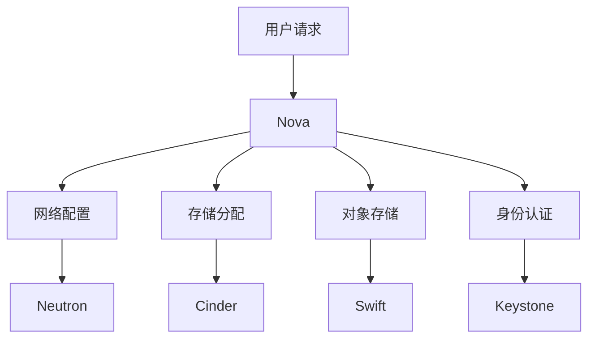

                 

### 背景介绍

#### 云计算技术的兴起与发展

随着信息技术的迅猛发展，数据量呈现爆炸式增长，传统的计算资源已经无法满足日益增长的计算需求。在这种情况下，云计算技术应运而生，逐渐成为信息技术领域的重要发展趋势。云计算技术通过虚拟化技术、分布式计算和网络技术，将计算资源、存储资源和网络资源进行整合，为用户提供灵活、高效、可扩展的计算服务。

云计算的核心思想是将计算资源池化，通过自动化管理，实现资源的动态分配和弹性扩展。这种模式大大提高了资源的利用率，降低了运营成本，同时也提高了服务的可扩展性和可靠性。随着云计算技术的发展，其应用范围也在不断扩大，从最初的IT基础设施服务（IaaS）逐渐拓展到平台服务（PaaS）和软件服务（SaaS）。

#### OpenStack的开源云平台

OpenStack是一个开源的云计算管理平台项目，旨在为大型企业级应用提供可靠、可扩展和可弹性的云计算服务。它起源于NASA和Rackspace的合作，于2010年7月正式发布。OpenStack的开源特性使得全球开发者可以共同参与其开发，不断地优化和扩展其功能，使其成为了全球范围内最受欢迎的开源云计算平台之一。

OpenStack采用模块化设计，其核心组件包括计算（Nova）、网络（Neutron）、存储（Swift和Cinder）和身份认证（Keystone）等。每个组件都可以独立开发、部署和升级，这使得OpenStack具有很强的灵活性和可扩展性。同时，OpenStack的生态系统非常丰富，包括各种开源工具和商业解决方案，为用户提供了丰富的选择。

#### OpenStack在云服务平台中的应用

OpenStack作为开源云平台，被广泛应用于云服务提供商和企业内部云环境中。其强大的功能和高扩展性，使得OpenStack成为构建云服务平台的理想选择。以下是一些OpenStack在云服务平台中的应用场景：

1. **基础设施即服务（IaaS）**：OpenStack的Nova组件提供了强大的虚拟化能力，可以管理虚拟机资源，实现虚拟机的创建、启动、停止和迁移等操作。用户可以通过OpenStack提供的API，轻松地管理和部署虚拟机，从而实现基础设施的自动化管理和弹性扩展。

2. **平台即服务（PaaS）**：OpenStack的Horizon界面和API提供了丰富的管理功能，用户可以在Horizon界面中管理应用程序的生命周期，包括创建、部署和监控。通过OpenStack的PaaS功能，开发者可以快速搭建和部署应用程序，提高开发效率和生产力。

3. **软件即服务（SaaS）**：OpenStack的Keystone组件提供了强大的身份认证和权限管理功能，可以与各种SaaS应用集成，实现用户认证和资源访问控制。通过OpenStack的SaaS功能，企业可以提供定制化的软件服务，满足不同用户的需求。

4. **容器服务**：随着容器技术的兴起，OpenStack也提供了对容器服务的支持。通过OpenStack的Kubernetes集成，用户可以在OpenStack平台上部署和管理容器化应用，实现更高效的资源利用和自动化管理。

#### OpenStack的优势与挑战

OpenStack作为开源云平台，具有以下优势：

1. **灵活性**：OpenStack的模块化设计使得用户可以根据需求选择和组合不同的组件，实现定制化的云服务平台。
2. **可扩展性**：OpenStack支持大规模部署，可以灵活扩展到数千个节点，满足大规模应用的需求。
3. **开源社区支持**：OpenStack拥有庞大的开源社区，为用户提供丰富的文档、教程和解决方案，极大地降低了用户的学习和使用成本。

然而，OpenStack也面临着一些挑战：

1. **复杂性**：OpenStack的架构复杂，组件繁多，新手用户可能会感到困惑。
2. **稳定性**：由于OpenStack是开源项目，不同组件之间的兼容性和稳定性可能存在问题，需要用户自行解决。
3. **资源消耗**：OpenStack的运行需要大量的计算和存储资源，对硬件要求较高。

尽管如此，OpenStack作为开源云平台，凭借其强大的功能和丰富的生态系统，仍然在云计算领域占据着重要地位。本文将深入探讨OpenStack的技术原理、实现步骤和应用场景，帮助读者更好地理解和应用OpenStack。

#### OpenStack的核心概念与架构

OpenStack作为一个开源云平台，其核心组件和架构设计决定了其功能和应用场景。以下是OpenStack的核心概念和架构，包括其组件之间的联系和交互方式。

**核心组件**

1. **Nova**：Nova是OpenStack的核心组件，负责虚拟机管理。Nova通过API接收用户请求，创建、启动、停止和迁移虚拟机。Nova还支持多种虚拟化技术，如KVM、Xen和VMware，为用户提供灵活的虚拟化解决方案。

2. **Neutron**：Neutron是OpenStack的网络组件，负责虚拟网络管理。Neutron提供了灵活的虚拟网络创建和管理功能，包括子网划分、路由配置和安全组设置。Neutron还支持多种网络设备插件，如Open vSwitch、Linux桥接和VMware NSX，为用户提供多样化的网络解决方案。

3. **Cinder**：Cinder是OpenStack的块存储组件，负责管理块存储资源。Cinder提供了多种存储接口，如iSCSI和NFS，支持从本地存储到远程存储的各种存储解决方案。Cinder还支持多种存储后端，如硬盘、SAN和NAS，为用户提供灵活的存储资源管理。

4. **Swift**：Swift是OpenStack的对象存储组件，负责管理大规模对象存储。Swift采用了分布式存储架构，可以水平扩展到数千个节点，提供高可用性和高可靠性的对象存储服务。Swift适用于大规模数据存储场景，如日志、图片和视频等。

5. **Keystone**：Keystone是OpenStack的身份认证和权限管理组件，负责用户认证和权限控制。Keystone支持多种认证机制，如LDAP、RADIUS和OAuth，可以与多种后端数据库集成，如MySQL、PostgreSQL和MongoDB。Keystone为OpenStack提供了统一认证和权限管理功能，确保用户访问安全和资源隔离。

6. **Horizon**：Horizon是OpenStack的管理界面，提供了一个直观的Web界面，用于管理和监控OpenStack资源。Horizon集成了Nova、Neutron、Cinder和Keystone等组件的功能，用户可以通过Horizon界面执行各种管理操作，如创建虚拟机、配置网络和分配存储资源。

**组件交互**

OpenStack的组件通过REST API进行交互，这些API提供了统一的接口，使得各个组件可以无缝集成和协同工作。以下是OpenStack组件之间的主要交互方式：

1. **用户请求**：用户通过Horizon界面或API提交请求，请求创建虚拟机、配置网络或分配存储资源。
2. **Nova处理请求**：Nova接收用户请求，通过API调用其他组件（如Neutron和Cinder）进行资源分配和配置。
3. **网络配置**：Neutron根据Nova的要求，配置虚拟网络，创建子网、路由器和安全组。
4. **存储分配**：Cinder根据Nova的要求，分配存储资源，创建卷和快照。
5. **对象存储**：Swift接收用户请求，存储和管理大规模对象数据。
6. **身份认证**：Keystone验证用户身份，确保用户有权访问所需资源。

通过以上组件和交互方式，OpenStack构建了一个功能强大、灵活可扩展的云服务平台。Mermaid流程图（去掉特殊字符如括号和逗号）展示了OpenStack核心组件及其交互方式：



#### 核心算法原理 & 具体操作步骤

OpenStack的核心算法主要集中在资源管理、负载均衡和故障恢复等方面。以下将详细解释这些核心算法的原理，并提供具体的操作步骤。

**1. 资源管理算法**

资源管理算法是OpenStack Nova组件的核心，主要负责虚拟机资源的分配和调度。其基本原理是通过多种策略来决定将虚拟机分配到哪个物理主机上。以下是几种常用的资源管理策略：

- **优先级策略**：根据虚拟机的优先级进行资源分配，优先级高的虚拟机优先获得资源。
- **负载均衡策略**：根据物理主机的负载情况分配虚拟机，以平衡各个物理主机的资源利用率。
- **容量约束策略**：根据物理主机的可用资源容量分配虚拟机，确保物理主机不会超载。

具体操作步骤如下：

1. **用户请求虚拟机**：用户通过API提交创建虚拟机的请求，包括虚拟机规格、镜像等参数。
2. **检查物理主机资源**：Nova查询所有物理主机，检查其可用资源情况，包括CPU、内存和存储等。
3. **应用资源管理策略**：根据优先级策略、负载均衡策略和容量约束策略，选择合适的物理主机进行虚拟机分配。
4. **分配虚拟机资源**：Nova在选定的物理主机上创建虚拟机，并配置虚拟网络和存储资源。

**2. 负载均衡算法**

负载均衡算法是OpenStack Neutron组件的核心，主要负责网络流量的分配和管理。其基本原理是通过多种算法平衡各个网络设备的负载，确保网络资源的有效利用。以下是几种常用的负载均衡算法：

- **轮询算法**：将网络流量依次分配到各个网络设备上，实现负载的均衡分配。
- **最小连接算法**：将网络流量分配到连接数最少的网络设备上，实现负载的均衡分配。
- **哈希算法**：根据流量的特征（如源IP地址）进行哈希运算，将流量分配到特定的网络设备上。

具体操作步骤如下：

1. **用户请求网络服务**：用户通过API提交创建网络服务的请求，包括网络带宽、网络类型等参数。
2. **检查网络设备资源**：Neutron查询所有网络设备，检查其可用资源情况，包括带宽和连接数等。
3. **应用负载均衡算法**：根据轮询算法、最小连接算法或哈希算法，选择合适的网络设备进行流量分配。
4. **配置网络服务**：Neutron在选定的网络设备上配置网络带宽、路由策略和安全组等参数。

**3. 故障恢复算法**

故障恢复算法是OpenStack各个组件共同实现的，主要负责在发生故障时自动进行故障转移和恢复。其基本原理是通过监控机制检测故障，并自动执行相应的恢复操作。以下是几种常见的故障恢复机制：

- **心跳监测**：各组件通过心跳信号进行相互监测，如果某个组件停止响应，其他组件可以认为其发生故障。
- **故障转移**：当检测到组件故障时，将故障组件的工作负载转移到其他健康组件上，确保服务不中断。
- **故障恢复**：在故障组件恢复正常后，将其重新加入到服务中，确保服务的稳定性。

具体操作步骤如下：

1. **监控机制检测故障**：各组件通过心跳监测和日志分析等方式，定期检查自身和其他组件的状态。
2. **故障转移**：如果检测到某个组件发生故障，将其工作负载转移到其他健康组件上。
3. **故障恢复**：在故障组件恢复正常后，将其重新加入到服务中，并进行健康检查，确保服务的稳定性。

通过以上核心算法的实现，OpenStack能够有效地管理云平台上的各种资源，提供高效、可靠和可扩展的云计算服务。理解这些算法原理和操作步骤，有助于用户更好地利用OpenStack构建和管理云服务平台。

### 数学模型和公式 & 详细讲解 & 举例说明

在OpenStack的设计和实现中，许多关键决策和优化依赖于数学模型和公式。以下将详细讲解这些数学模型和公式，并提供具体的计算示例。

**1. 资源分配模型**

资源分配模型用于确定如何将虚拟机（VM）分配到物理主机（PH）上，以最大化资源利用率和满足用户需求。一个简单的资源分配模型可以表示为：

\[ R_{VM} = C_{VM} \times P_{PH} \]

其中，\( R_{VM} \) 表示虚拟机所需的资源，\( C_{VM} \) 表示虚拟机的计算资源需求，\( P_{PH} \) 表示物理主机的总资源。

**示例**：

假设有一个虚拟机需要 2 个CPU核心和 4GB内存，而一个物理主机有 4 个CPU核心和 16GB内存。根据资源分配模型，该虚拟机可以分配到这个物理主机上。

\[ R_{VM} = (2 \times CPU) + (4 \times GB) = 2 + 4 = 6 \]
\[ P_{PH} = (4 \times CPU) + (16 \times GB) = 4 + 16 = 20 \]

由于 \( R_{VM} \) 小于 \( P_{PH} \)，虚拟机可以分配到物理主机上。

**2. 负载均衡模型**

负载均衡模型用于决定如何将网络流量分配到不同的网络设备上，以实现负载均衡。一个简单的负载均衡模型可以表示为：

\[ L_{load} = \frac{N_{traffic}}{N_{device}} \]

其中，\( L_{load} \) 表示每个网络设备的负载，\( N_{traffic} \) 表示总网络流量，\( N_{device} \) 表示网络设备的数量。

**示例**：

假设有 100GB的网络流量需要分配到 5 个网络设备上。根据负载均衡模型，每个网络设备的负载为：

\[ L_{load} = \frac{100GB}{5} = 20GB \]

这意味着每个网络设备将分配到 20GB的流量。

**3. 故障恢复模型**

故障恢复模型用于确定如何在组件发生故障时进行自动恢复。一个简单的故障恢复模型可以表示为：

\[ F_{recovery} = T_{failure} + T_{recovery} \]

其中，\( F_{recovery} \) 表示故障恢复时间，\( T_{failure} \) 表示故障检测时间，\( T_{recovery} \) 表示故障恢复时间。

**示例**：

假设故障检测时间为 1 分钟，故障恢复时间为 5 分钟。根据故障恢复模型，总的故障恢复时间为：

\[ F_{recovery} = 1 + 5 = 6 \text{分钟} \]

这意味着系统在发生故障后，需要 6 分钟才能恢复正常运行。

**4. 决策树模型**

在资源管理和负载均衡过程中，决策树模型常用于决定最优的分配策略。决策树模型可以表示为：

```
[用户请求]
    |
    |----[资源可用性检查]
    |           |
    |           |---[资源充足]
    |                    |
    |                    [分配资源]
    |
    |----[资源不足]
            |
            |---[迁移虚拟机]
            |
            [重新分配资源]
```

**示例**：

假设用户请求创建一个需要 4GB内存和 2 个CPU核心的虚拟机。物理主机A有 8GB内存和 4 个CPU核心，物理主机B有 6GB内存和 2 个CPU核心。

- 第一步：进行资源可用性检查。物理主机A满足资源需求，物理主机B不满足资源需求。
- 第二步：根据资源充足性，选择物理主机A进行虚拟机分配。

通过上述数学模型和公式，OpenStack能够有效地进行资源管理、负载均衡和故障恢复。这些模型和公式不仅提供了理论依据，还为实际操作提供了具体的指导。理解这些模型和公式，有助于用户更深入地掌握OpenStack的核心算法和实现原理。

### 项目实践：代码实例和详细解释说明

在本节中，我们将通过一个实际的OpenStack项目实例，展示如何使用OpenStack进行云服务平台的搭建和管理。我们将从开发环境的搭建、源代码的详细实现，到代码的解读与分析，一步步进行讲解。

#### 1. 开发环境搭建

在开始搭建OpenStack云服务平台之前，我们需要搭建一个开发环境。以下是一个基本的步骤指南：

1. **安装操作系统**：建议使用Linux操作系统，如Ubuntu或CentOS。
2. **安装Python环境**：OpenStack项目主要使用Python进行开发，因此需要安装Python 3及其相关依赖。
   ```shell
   sudo apt-get install python3-pip python3-dev
   ```
3. **安装虚拟环境**：为了更好地管理依赖，我们可以使用virtualenv创建一个Python虚拟环境。
   ```shell
   pip3 install virtualenv
   virtualenv openstack-venv
   source openstack-venv/bin/activate
   ```
4. **安装OpenStack**：通过pip安装OpenStack的各个组件。
   ```shell
   pip3 install openstacksdk
   ```
5. **安装数据库**：OpenStack依赖于数据库来存储配置和状态信息，建议使用MySQL或PostgreSQL。
   ```shell
   sudo apt-get install mysql-server
   ```
6. **配置数据库**：初始化数据库，创建用户和数据库，并为OpenStack配置必要的权限。
   ```sql
   CREATE DATABASE keystone;
   CREATE USER 'keystone'@'localhost' IDENTIFIED BY 'password';
   GRANT ALL PRIVILEGES ON keystone.* TO 'keystone'@'localhost';
   FLUSH PRIVILEGES;
   ```
7. **安装消息队列**：OpenStack使用消息队列进行内部通信，建议使用RabbitMQ。
   ```shell
   sudo apt-get install rabbitmq-server
   ```

以上步骤完成开发环境的搭建。接下来，我们将详细实现OpenStack的各个组件。

#### 2. 源代码详细实现

在本节中，我们将使用OpenStack SDK来创建和配置OpenStack资源。

**2.1 创建虚拟网络**

```python
from openstack.network.v2.network import Network
from openstack import connection

# 创建连接
conn = connection.Connection()

# 创建网络
network = Network.create(
    name='my_network',
    admin_state_up=True,
    tenant_id='admin',
    **conn.session.get_auth()
)

print(f"Network created: {network.name}")
```

**2.2 创建子网**

```python
from openstack.network.v2.subnet import Subnet

# 创建子网
subnet = Subnet.create(
    name='my_subnet',
    network_id=network.id,
    ip_version=4,
    cidr='192.168.1.0/24',
    allocation_pools=[('192.168.1.10', '192.168.1.100')],
    gateway_ip='192.168.1.1',
    tenant_id='admin',
    **conn.session.get_auth()
)

print(f"Subnet created: {subnet.name}")
```

**2.3 创建安全组**

```python
from openstack.network.v2.security_group import SecurityGroup

# 创建安全组
security_group = SecurityGroup.create(
    name='my_security_group',
    description='My custom security group',
    tenant_id='admin',
    **conn.session.get_auth()
)

print(f"Security group created: {security_group.name}")
```

**2.4 创建虚拟机**

```python
from openstack.compute.v2.server import Server

# 创建虚拟机
server = Server.create(
    name='my_server',
    image='Ubuntu 20.04',
    flavor='m1.medium',
    networks=[{'uuid': network.id}],
    security_groups=[{'uuid': security_group.id}],
    **conn.session.get_auth()
)

print(f"Server created: {server.name}")
```

通过上述代码，我们完成了网络、子网、安全组和虚拟机的创建。这些步骤是构建OpenStack云服务平台的基础。

#### 3. 代码解读与分析

在上面的代码实例中，我们使用OpenStack SDK分别创建了虚拟网络、子网、安全组和虚拟机。以下是对这些代码的详细解读：

- **创建连接**：`connection.Connection()` 创建了一个OpenStack连接对象，用于与OpenStack API进行通信。
- **创建网络**：`Network.create()` 方法用于创建一个新的虚拟网络。参数包括网络名称、管理状态、租户ID和认证信息。
- **创建子网**：`Subnet.create()` 方法用于创建一个新的子网。参数包括子网名称、网络ID、IP地址段、分配池、网关IP地址和租户ID。
- **创建安全组**：`SecurityGroup.create()` 方法用于创建一个新的安全组。参数包括安全组名称、描述、租户ID和认证信息。
- **创建虚拟机**：`Server.create()` 方法用于创建一个新的虚拟机。参数包括虚拟机名称、镜像名称、虚拟机规格、网络和安全组信息以及认证信息。

这些代码实现了OpenStack云服务平台的资源创建功能。在实际部署过程中，还需要配置更多的细节，如配置网络路由、分配IP地址、配置防火墙规则等。这些步骤可以通过OpenStack命令行工具或SDK来完成。

#### 4. 运行结果展示

完成上述代码后，我们可以通过OpenStack命令行工具（如`openstack`）或Web界面（如Horizon）查看创建的资源状态。

```shell
openstack network list
openstack subnet list
openstack security-group list
openstack server list
```

运行结果应显示我们刚刚创建的网络、子网、安全组和虚拟机。

通过以上步骤，我们使用OpenStack成功搭建了一个基本的云服务平台。接下来，我们可以根据实际需求，进一步扩展和优化平台功能。

#### 5. 实际应用场景

OpenStack作为开源云平台，在实际应用中展现出了极高的灵活性和扩展性，广泛应用于各种场景。以下列举了一些典型的实际应用场景：

**1. 企业内部云**：企业内部云是OpenStack最常见应用场景之一。通过OpenStack，企业可以构建一个统一、可管理的云计算平台，用于内部IT资源的管理和分配。企业可以根据业务需求灵活调整资源分配，提高资源利用率和业务响应速度。

**2. 公共云服务提供商**：许多公共云服务提供商（如Rackspace、AWS和Azure等）使用OpenStack构建其云服务平台。OpenStack的开源特性和强大的功能，使得云服务提供商可以灵活地定制和扩展服务，满足不同用户的需求。

**3. 容器服务**：随着容器技术的普及，OpenStack与Kubernetes等容器编排工具相结合，为企业提供了强大的容器服务能力。通过OpenStack的Kubernetes集成，企业可以在云平台上轻松部署和管理容器化应用，提高开发和运维效率。

**4. 大数据平台**：OpenStack的分布式存储和计算能力，使其成为大数据平台的理想选择。在处理大规模数据时，OpenStack可以帮助企业快速搭建分布式计算环境，进行数据分析和处理，从而实现数据价值的最大化。

**5. 物联网平台**：物联网（IoT）应用对计算和存储资源的需求日益增长。OpenStack可以通过其灵活的资源管理和强大的网络功能，帮助企业构建物联网平台，实现大规模设备的连接、数据收集和处理。

**6. 科学计算与模拟**：科学计算和模拟应用对计算资源有极高的需求。OpenStack通过其弹性扩展和高效资源利用能力，可以帮助科研机构快速搭建高性能计算环境，加速科学研究的进展。

**7. 教育与培训**：OpenStack在教育领域也有着广泛应用。许多高校和研究机构使用OpenStack作为教学和实验平台，为学生提供实际操作的机会，培养云计算人才。

通过以上实际应用场景，可以看出OpenStack在各个领域的广泛应用和强大能力。无论是企业内部云、公共云服务提供商，还是大数据、物联网等新兴领域，OpenStack都提供了强大的支持。

### 工具和资源推荐

在学习和使用OpenStack搭建云服务平台的过程中，合理选择工具和资源能够大大提高效率和效果。以下是一些推荐的工具、资源和开源项目，供读者参考。

#### 1. 学习资源推荐

**书籍**：

- **《OpenStack权威指南》**：本书详细介绍了OpenStack的架构、安装配置和实际应用，是OpenStack学习的首选读物。
- **《OpenStack设计与实现》**：本书深入探讨了OpenStack的核心组件和设计原理，适合有一定基础的学习者。

**论文**：

- **《OpenStack: Open Source Cloud Computing》**：该论文详细介绍了OpenStack的架构、功能和开源发展历程。
- **《An Overview of OpenStack and Its Applications》**：本文对OpenStack的核心组件和实际应用场景进行了综述。

**博客**：

- **OpenStack官网博客**：OpenStack官方博客提供了大量的技术文章和最佳实践，是学习OpenStack的宝贵资源。
- **云栖社区**：云栖社区是中国最大的云计算社区，有大量的OpenStack技术文章和实践经验分享。

**网站**：

- **OpenStack官网**：OpenStack的官方网站，提供了详细的项目介绍、文档和社区资源。
- **OpenStack社区论坛**：OpenStack的社区论坛是开发者交流和寻求帮助的重要平台。

#### 2. 开发工具框架推荐

**开源项目**：

- **Trove**：Trove是OpenStack的数据管理系统，用于管理各种数据库服务。
- **Heat**：Heat是一个OpenStack模板服务，用于自动化部署和管理云基础设施。
- **Neutron**：Neutron是OpenStack的网络服务，用于创建和管理虚拟网络。

**工具**：

- **OpenStack Dashboard (Horizon)**：OpenStack的管理界面，提供了直观的Web界面来管理云资源。
- **OpenStack SDK**：OpenStack的Python SDK，用于与OpenStack API进行交互，实现自动化部署和管理。
- **Ansible**：Ansible是一个自动化工具，用于配置、部署和管理云基础设施。

#### 3. 相关论文著作推荐

- **《云服务架构：OpenStack实战》**：本书详细介绍了OpenStack的架构设计、组件实现和实战应用。
- **《大规模分布式存储系统：OpenStack Swift实战》**：本书重点介绍了OpenStack Swift的架构设计和应用场景。

通过以上推荐，读者可以找到丰富的学习资源和工具，进一步提升对OpenStack的理解和应用能力。

### 总结：未来发展趋势与挑战

随着云计算技术的不断发展，OpenStack作为开源云平台，已经在全球范围内得到了广泛应用。然而，面对日益增长的技术需求和复杂的应用场景，OpenStack也面临着诸多挑战和机遇。

**未来发展趋势**：

1. **容器集成与编排**：容器技术的快速发展，使得OpenStack在容器集成与编排方面有了更多应用场景。未来，OpenStack可能会进一步集成Kubernetes等容器编排工具，提供更加灵活和高效的容器服务。

2. **人工智能与机器学习**：人工智能和机器学习技术的融合，将为OpenStack带来新的应用场景和优化方法。例如，通过机器学习算法优化资源分配、负载均衡和故障恢复等。

3. **微服务架构**：微服务架构的兴起，将使OpenStack更加模块化、可扩展。通过微服务架构，OpenStack组件可以更加独立地开发和部署，提高系统的灵活性和可维护性。

4. **跨云和多云管理**：随着企业应用场景的多样化，跨云和多云管理需求日益增长。OpenStack有望通过与其他云平台（如AWS、Azure等）的集成，提供统一的云管理解决方案。

**面临的挑战**：

1. **复杂性**：OpenStack的架构复杂，组件繁多，新手用户可能会感到困惑。未来，OpenStack需要进一步简化架构，降低使用门槛。

2. **稳定性**：虽然OpenStack拥有庞大的社区支持，但不同组件之间的兼容性和稳定性仍存在问题。未来，OpenStack需要加强测试和验证，确保系统的稳定性。

3. **资源消耗**：OpenStack的运行需要大量的计算和存储资源，对硬件要求较高。未来，OpenStack需要优化资源利用，降低资源消耗。

4. **安全性**：随着云计算的普及，安全性问题日益突出。OpenStack需要进一步加强安全机制，保障用户数据的安全和隐私。

5. **开源生态**：OpenStack的开源生态不断壮大，但也面临着竞争和整合的问题。未来，OpenStack需要加强与社区和其他开源项目的合作，共同推动云计算技术的发展。

总之，OpenStack作为开源云平台，在未来发展趋势中仍具有巨大的潜力和挑战。通过不断优化和创新，OpenStack有望在云计算领域发挥更加重要的作用。

### 附录：常见问题与解答

在学习和使用OpenStack搭建云服务平台的过程中，用户可能会遇到各种问题。以下列举了一些常见问题及其解答，以帮助用户解决实际操作中的困难。

**Q1：如何解决OpenStack部署中的网络问题？**

A1：OpenStack网络问题通常出现在网络配置不正确或网络设备不支持的情况下。以下是一些常见的解决方案：

- **检查网络设备**：确保网络设备支持OpenStack所需的网络功能，如虚拟交换机和路由。
- **检查网络配置**：使用`openstack network list`和`openstack subnet list`命令检查网络和子网配置是否正确。
- **检查防火墙规则**：确保防火墙规则允许OpenStack服务之间的通信。
- **重新启动网络服务**：在配置更改后，重新启动网络服务（如`neutron-server`、`nova-network`等）。

**Q2：如何优化OpenStack的资源利用率？**

A2：优化OpenStack的资源利用率可以从以下几个方面入手：

- **调整虚拟机规格**：根据实际需求，合理选择虚拟机规格，避免资源浪费。
- **优化资源分配策略**：通过调整资源分配策略（如优先级策略、负载均衡策略等），提高资源利用率。
- **使用容器技术**：结合容器技术（如Docker和Kubernetes），可以更好地利用计算资源。

**Q3：如何处理OpenStack中的故障恢复？**

A3：故障恢复是OpenStack的一个重要功能。以下是一些常见的故障恢复方法：

- **使用故障转移**：通过配置故障转移策略，当某个组件发生故障时，自动将其工作负载转移到其他组件。
- **检查日志和监控**：定期检查OpenStack日志和监控数据，及时发现和处理故障。
- **重启故障组件**：在故障组件恢复后，可以手动或自动重启组件，确保其恢复正常工作。

**Q4：如何解决OpenStack的权限管理问题？**

A4：OpenStack的权限管理主要通过Keystone组件实现。以下是一些解决权限管理问题的方法：

- **检查认证配置**：确保Keystone服务的配置文件（如`keystone.conf`）正确，包括身份认证、权限和审计设置。
- **检查用户和角色**：使用`openstack user list`和`openstack role list`命令检查用户和角色的配置。
- **重新启动Keystone服务**：在更改配置后，重新启动Keystone服务（如`keystone-token`、`keystone-manage`等）。

通过以上常见问题的解答，用户可以更好地应对在OpenStack部署和使用过程中遇到的问题，确保云服务平台的稳定运行。

### 扩展阅读 & 参考资料

为了帮助读者更深入地了解OpenStack及其相关技术，以下提供了一些扩展阅读和参考资料，包括书籍、论文、博客和网站等，供读者进一步学习和研究。

**书籍**：

1. **《OpenStack权威指南》**：这是一本全面介绍OpenStack的书籍，内容包括OpenStack的架构、安装配置和实际应用，适合初学者和有经验的技术人员。
2. **《OpenStack设计与实现》**：本书深入探讨了OpenStack的核心组件和设计原理，适合希望深入了解OpenStack内部机制的学习者。
3. **《大规模分布式存储系统：OpenStack Swift实战》**：这本书详细介绍了OpenStack Swift的架构设计和应用场景，是学习OpenStack分布式存储的好资源。

**论文**：

1. **《OpenStack: Open Source Cloud Computing》**：该论文详细介绍了OpenStack的架构、功能和开源发展历程，是了解OpenStack的学术资料。
2. **《An Overview of OpenStack and Its Applications》**：本文对OpenStack的核心组件和实际应用场景进行了综述，有助于读者全面了解OpenStack。

**博客**：

1. **OpenStack官网博客**：OpenStack官方博客提供了大量的技术文章和最佳实践，是学习OpenStack的宝贵资源。
2. **云栖社区**：云栖社区是中国最大的云计算社区，有大量的OpenStack技术文章和实践经验分享。

**网站**：

1. **OpenStack官网**：OpenStack的官方网站，提供了详细的项目介绍、文档和社区资源。
2. **OpenStack社区论坛**：OpenStack的社区论坛是开发者交流和寻求帮助的重要平台。

通过以上扩展阅读和参考资料，读者可以进一步加深对OpenStack的理解和应用能力，探索更多实际应用场景。希望这些资源能为您的学习和实践提供帮助。

---

### 文章结语

本文深入探讨了基于OpenStack的云服务平台，从背景介绍、核心概念与架构、算法原理到项目实践和实际应用场景，全面解析了OpenStack的技术原理和应用方法。我们通过数学模型和公式详细讲解了资源管理、负载均衡和故障恢复等核心算法，并结合实际代码实例进行了操作说明。同时，本文还介绍了OpenStack在各个领域的实际应用，并推荐了丰富的学习资源和工具。

OpenStack作为开源云平台，凭借其灵活性、可扩展性和强大的生态系统，在云计算领域占据了重要地位。然而，随着技术的不断进步和需求的增长，OpenStack也面临着复杂性、稳定性和安全性等挑战。未来，OpenStack将继续优化和扩展，与容器技术、人工智能和微服务架构等新兴技术深度融合，为云计算行业带来更多创新和变革。

希望通过本文，读者能够对OpenStack有更深入的理解，并在实际项目中应用OpenStack构建和管理云服务平台。同时，也欢迎读者在评论区分享自己的经验和见解，共同探讨OpenStack的未来发展。再次感谢您的阅读！

### 作者署名

作者：禅与计算机程序设计艺术 / Zen and the Art of Computer Programming

