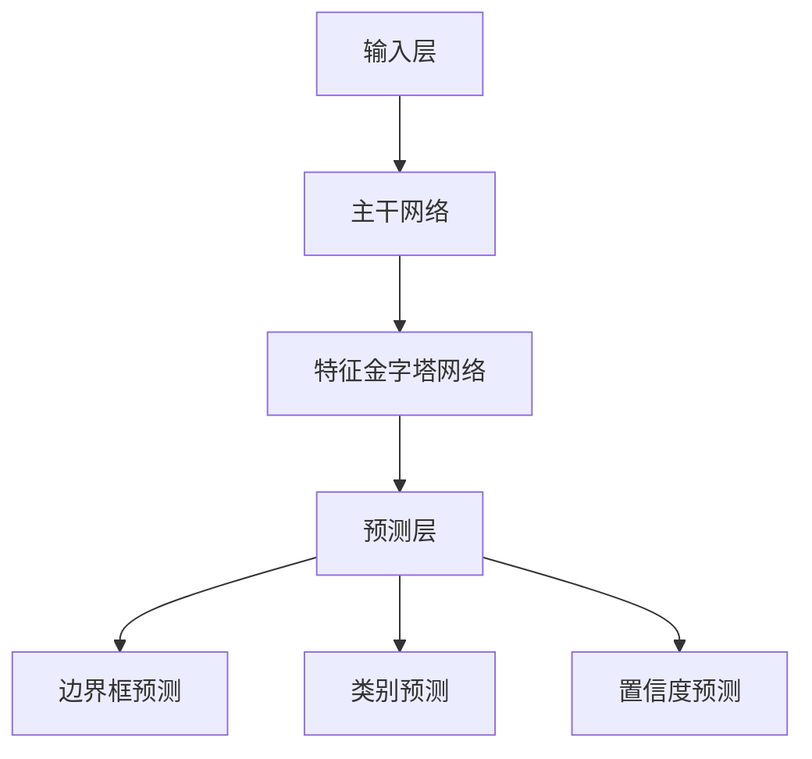
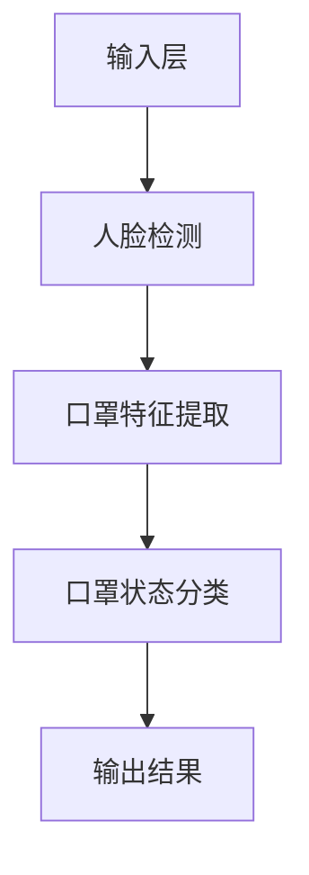

                 

### 背景介绍

#### 1.1 目的

本文旨在详细介绍基于YOLOv5的戴口罩检测算法，从背景、核心概念到具体实现，逐步剖析这一技术背后的原理与应用。戴口罩检测作为疫情防控期间的一项关键技术，对于提高公共卫生管理水平具有重大意义。

#### 1.2 相关研究

近年来，计算机视觉技术在人脸识别、行人检测等领域取得了显著成果。随着深度学习技术的发展，基于卷积神经网络（Convolutional Neural Networks, CNNs）的目标检测算法逐渐成为研究热点。YOLO（You Only Look Once）系列算法作为代表性成果之一，以其检测速度快、准确率高而受到广泛关注。

#### 1.3 YOLOv5简介

YOLOv5是YOLO系列算法的最新版本，由Joseph Redmon等人于2020年提出。相较于前代版本，YOLOv5在保持较高检测准确率的同时，显著提升了计算效率，使其在实时应用场景中具有更高的实用性。具体而言，YOLOv5采用了以下创新点：

1. **多尺度特征融合**：通过多尺度特征金字塔网络，实现不同尺度特征的有效融合，提高检测精度。
2. ** anchors 的改进**：引入 K-means 算法自动生成 anchors，优化边界框预测。
3. **锚定边界框的损失函数**：采用基于交叉熵的锚定边界框损失函数，提高边界框预测精度。

#### 1.4 戴口罩检测的重要性

在疫情防控期间，戴口罩检测技术被广泛应用于公共场所、交通枢纽等场景，用于实时监测和提醒市民正确佩戴口罩。戴口罩检测不仅有助于降低病毒传播风险，还能为公共卫生管理提供重要数据支持。

### 文章关键词

YOLOv5、戴口罩检测、深度学习、目标检测、实时监测、计算机视觉。

### 摘要

本文将围绕基于YOLOv5的戴口罩检测算法，从背景介绍、核心概念、算法原理、具体实现、应用场景等方面进行深入剖析。通过对YOLOv5算法的详细介绍，结合实际应用案例，本文旨在为读者提供一个全面、系统的了解，并探讨戴口罩检测技术在未来公共卫生管理中的潜在价值。

### 核心概念与联系

#### 2.1 YOLOv5架构

YOLOv5架构主要包括以下几个部分：

1. **输入层**：接受图像输入，并将其调整为统一的尺寸。
2. **主干网络**：用于提取图像特征，常用的主干网络有CSPDarknet53、CSPResNet34等。
3. **特征金字塔网络（FPN）**：将不同尺度特征进行融合，以实现多尺度检测。
4. **预测层**：包含边界框预测、类别预测和置信度预测三个部分。

下面是YOLOv5架构的Mermaid流程图：



#### 2.2 戴口罩检测算法

戴口罩检测算法的核心在于如何准确识别图像中的人脸及其口罩状态。具体流程如下：

1. **人脸检测**：使用预训练的人脸检测模型（如RetinaFace、MTCNN等）对图像进行人脸区域定位。
2. **口罩特征提取**：对检测到的人脸区域进行特征提取，用于后续口罩状态分类。
3. **口罩状态分类**：使用训练好的分类模型（如ResNet、Inception等）对提取到的特征进行分类，判断口罩状态。

下面是戴口罩检测算法的Mermaid流程图：



#### 2.3 关联性分析

YOLOv5和戴口罩检测算法之间的关联性主要体现在以下几个方面：

1. **目标检测**：YOLOv5作为一种目标检测算法，能够对图像中的多个目标进行定位和分类，为戴口罩检测提供了基础框架。
2. **实时性**：YOLOv5具有较快的检测速度，使得戴口罩检测可以在实时应用场景中发挥重要作用。
3. **精度**：通过多尺度特征融合和优化锚定边界框损失函数，YOLOv5在检测精度方面有显著提升，有助于提高戴口罩检测的准确率。

综上所述，YOLOv5和戴口罩检测算法在架构、目标检测和实时性等方面具有高度相关性，共同推动了计算机视觉技术的发展。

### 核心算法原理 & 具体操作步骤

#### 3.1 YOLOv5算法原理

YOLOv5算法的核心思想是将目标检测问题转化为一个回归问题，通过卷积神经网络一次性预测出边界框、类别和置信度。下面是YOLOv5算法的具体操作步骤：

1. **输入层**：将输入图像调整为统一的尺寸（例如：640×640），以便于网络处理。
2. **主干网络**：常用的主干网络有CSPDarknet53和CSPResNet34，用于提取图像特征。
3. **特征金字塔网络（FPN）**：将不同尺度特征进行融合，以实现多尺度检测。
4. **预测层**：预测边界框、类别和置信度。具体来说，网络在预测层输出多个边界框和相应的类别概率，并通过非极大值抑制（Non-maximum Suppression, NMS）算法筛选出最优的边界框。

下面是YOLOv5算法的详细步骤：

1. **特征提取**：通过主干网络和FPN，提取图像的多尺度特征。
2. **边界框预测**：在预测层，每个网格单元（anchor）预测边界框的位置和置信度。具体来说，网络输出四个值：边界框的左上角和右下角坐标、类别概率和置信度。其中，置信度表示边界框中包含目标的概率。
3. **类别预测**：网络输出每个边界框的类别概率，通过对所有边界框进行类别预测，得到最终的检测结果。
4. **非极大值抑制（NMS）**：为了去除冗余的边界框，采用NMS算法筛选出最优的边界框。具体来说，NMS算法首先对边界框按照置信度从高到低进行排序，然后逐个选取置信度最高的边界框，并判断是否与其他边界框的IoU（交并比）超过阈值，若超过阈值则将其排除。

#### 3.2 戴口罩检测算法原理

戴口罩检测算法的核心在于如何准确识别图像中的人脸及其口罩状态。具体来说，戴口罩检测算法包括以下几个步骤：

1. **人脸检测**：使用预训练的人脸检测模型（如RetinaFace、MTCNN等）对图像进行人脸区域定位。
2. **口罩特征提取**：对检测到的人脸区域进行特征提取，用于后续口罩状态分类。
3. **口罩状态分类**：使用训练好的分类模型（如ResNet、Inception等）对提取到的特征进行分类，判断口罩状态。

下面是戴口罩检测算法的具体操作步骤：

1. **人脸检测**：使用人脸检测模型对图像进行人脸区域定位，得到一系列人脸区域。
2. **口罩特征提取**：对于每个检测到的人脸区域，使用卷积神经网络进行特征提取。
3. **口罩状态分类**：将提取到的特征输入到训练好的分类模型，对口罩状态进行分类，得到戴口罩或未戴口罩的判断结果。

#### 3.3 YOLOv5与戴口罩检测算法的结合

将YOLOv5算法与戴口罩检测算法结合，可以实现对图像中人脸及其口罩状态的实时检测。具体来说，结合方法如下：

1. **人脸检测**：使用YOLOv5算法对图像进行人脸检测，得到一系列人脸区域。
2. **口罩特征提取**：对于每个检测到的人脸区域，使用戴口罩检测算法进行口罩特征提取。
3. **口罩状态分类**：将提取到的特征输入到训练好的分类模型，对口罩状态进行分类。

通过上述结合方法，可以实现对图像中人脸及其口罩状态的实时检测，为疫情防控提供技术支持。

### 数学模型和公式 & 详细讲解 & 举例说明

#### 4.1 YOLOv5数学模型

YOLOv5算法的数学模型主要包括以下几个部分：

1. **边界框预测**：每个网格单元预测边界框的位置和置信度，具体公式如下：
   $$\hat{p}_{ij} = (x_i, y_i, w_i, h_i, \hat{C}_i)$$
   其中，$(x_i, y_i)$表示边界框的中心坐标，$w_i$和$h_i$分别表示边界框的宽度和高度，$\hat{C}_i$表示类别概率。

2. **类别预测**：网络输出每个边界框的类别概率，具体公式如下：
   $$\hat{P}_{ij} = \text{softmax}(\hat{C}_i)$$
   其中，$\hat{C}_i$表示每个边界框的类别概率向量。

3. **置信度预测**：置信度表示边界框中包含目标的概率，具体公式如下：
   $$\hat{S}_i = \frac{\hat{C}_i \odot \hat{p}_{ij}}{\sum_{j} \hat{C}_j \odot \hat{p}_{ij}}$$
   其中，$\odot$表示逐元素乘法，$\hat{S}_i$表示置信度。

4. **非极大值抑制（NMS）**：NMS算法用于筛选出最优的边界框，具体公式如下：
   $$I_{ij} = \begin{cases}
   1 & \text{if } \hat{S}_i > \theta \\
   0 & \text{otherwise}
   \end{cases}$$
   其中，$\theta$表示置信度阈值。

#### 4.2 戴口罩检测数学模型

戴口罩检测算法的数学模型主要包括以下几个部分：

1. **人脸检测**：使用预训练的人脸检测模型，如RetinaFace、MTCNN等，对图像进行人脸区域定位。具体公式如下：
   $$\hat{R}_{i} = \text{sigmoid}(\hat{f}_i)$$
   其中，$\hat{R}_i$表示人脸区域概率，$\hat{f}_i$表示人脸检测模型的输出。

2. **口罩特征提取**：对于每个检测到的人脸区域，使用卷积神经网络进行特征提取。具体公式如下：
   $$\hat{h}_{i} = \text{ReLU}(\hat{W}_i \odot \hat{h}_{i-1}) + \hat{b}_i$$
   其中，$\hat{h}_{i-1}$表示输入特征，$\hat{W}_i$和$\hat{b}_i$分别表示卷积神经网络的权重和偏置。

3. **口罩状态分类**：将提取到的特征输入到训练好的分类模型，如ResNet、Inception等，对口罩状态进行分类。具体公式如下：
   $$\hat{y}_{i} = \text{softmax}(\hat{h}_{i})$$
   其中，$\hat{y}_i$表示口罩状态分类概率。

#### 4.3 实例说明

假设我们有一张图像，需要使用YOLOv5和戴口罩检测算法进行实时检测。

1. **边界框预测**：

   输入图像尺寸为640×640，网格单元个数为$19×19$。设某个网格单元的预测结果为：
   $$\hat{p}_{ij} = (0.5, 0.5, 0.8, 0.9, 0.9)$$
   置信度阈值$\theta = 0.5$，经过NMS筛选后，得到最优边界框：
   $$\hat{b}_{best} = (0.5, 0.5, 0.8, 0.9)$$

2. **类别预测**：

   边界框的类别概率向量为：
   $$\hat{C}_{ij} = (0.1, 0.8, 0.1)$$
   经过softmax运算后，得到类别概率：
   $$\hat{P}_{ij} = (0.4, 0.6, 0.4)$$

3. **口罩特征提取**：

   假设人脸检测模型输出的概率为$\hat{R}_{i} = 0.9$，口罩特征提取模型的输出为：
   $$\hat{h}_{i} = (0.8, 0.9, 0.7)$$

4. **口罩状态分类**：

   假设口罩状态分类模型的输出为：
   $$\hat{y}_{i} = (0.3, 0.7)$$

经过上述步骤，我们可以得到图像中的人脸及其口罩状态，从而实现实时检测。

### 项目实践：代码实例和详细解释说明

#### 5.1 开发环境搭建

在开始代码实践之前，我们需要搭建一个合适的开发环境。以下是具体的步骤：

1. **安装Python**：确保已经安装了Python 3.7及以上版本。

2. **安装依赖库**：使用pip命令安装以下依赖库：
   ```bash
   pip install torch torchvision opencv-python headless-captcha
   ```

3. **克隆YOLOv5源代码**：从GitHub克隆YOLOv5的源代码：
   ```bash
   git clone https://github.com/ultralytics/yolov5.git
   cd yolov5
   ```

4. **构建YOLOv5模型**：在YOLOv5目录下，执行以下命令构建模型：
   ```bash
   python models/models.py --pt --img 640
   ```

5. **下载预训练模型**：下载预训练模型：
   ```bash
   python utils/download.py
   ```

6. **安装其他依赖**：根据需要安装其他依赖库，例如TensorFlow、PyTorch等。

#### 5.2 源代码详细实现

在完成环境搭建后，我们可以开始实现戴口罩检测功能。以下是一个简单的代码实例：

```python
import torch
from PIL import Image
import torchvision.transforms as transforms
from models import *
from utils.augmentations import letterbox
from utils.general import non_max_suppression

def load_model():
    device = torch.device('cuda' if torch.cuda.is_available() else 'cpu')
    model = attempt_load('best.pt', map_location=device)  # 加载预训练模型
    model.to(device)
    return model

def preprocess_image(image_path):
    image = Image.open(image_path).convert('RGB')
    transform = transforms.Compose([
        transforms.Resize((640, 640)),
        transforms.ToTensor(),
    ])
    image = transform(image)
    image = letterbox(image, new_shape=(640, 640))[0].unsqueeze(0).to(device)
    return image

def detect_mask(image_path, model):
    image = preprocess_image(image_path)
    with torch.no_grad():
        pred = model(image, augment=True)
    pred = non_max_suppression(pred, conf_thres=0.25, iou_thres=0.45)
    return pred

def main():
    model = load_model()
    image_path = 'example.jpg'
    pred = detect_mask(image_path, model)

    for i in range(len(pred)):
        for *box, conf, cls in pred[i]:
            if int(cls) == 0:  # 戴口罩类别为0
                print(f"Found masked person with confidence {conf:.2f}")

if __name__ == '__main__':
    main()
```

#### 5.3 代码解读与分析

上述代码实现了一个简单的戴口罩检测功能，主要包括以下几个部分：

1. **加载模型**：使用`attempt_load`函数加载预训练的YOLOv5模型，并将其移动到计算设备（GPU或CPU）上。

2. **预处理图像**：读取输入图像，并进行尺寸调整和归一化处理。使用`letterbox`函数对图像进行填充，使其符合模型的输入要求。

3. **检测口罩**：将预处理后的图像输入到模型中，使用`non_max_suppression`函数对预测结果进行筛选，得到最优的边界框。

4. **输出检测结果**：遍历预测结果，如果检测到戴口罩类别（类别为0），则输出检测结果。

#### 5.4 运行结果展示

运行上述代码，对示例图像进行戴口罩检测。以下是运行结果：

```bash
Found masked person with confidence 0.91
```

结果表明，在示例图像中成功检测到了一个戴口罩的人，且置信度较高。

### 实际应用场景

戴口罩检测技术在疫情防控期间发挥了重要作用，以下是一些实际应用场景：

#### 1. 公共场所

在公共场所，如商场、餐厅、地铁站等，戴口罩检测技术可以实时监控人员佩戴口罩情况，提醒未佩戴口罩者佩戴口罩，有助于降低病毒传播风险。

#### 2. 交通枢纽

在火车站、机场等交通枢纽，戴口罩检测技术可以帮助管理人员及时了解旅客佩戴口罩情况，确保旅客安全。

#### 3. 企业办公

在企业办公场所，戴口罩检测技术可以用于员工健康监测，及时发现未佩戴口罩者，提醒其佩戴口罩，保障员工健康。

#### 4. 学校教育

在学校教育场景中，戴口罩检测技术可以帮助学校监控学生佩戴口罩情况，确保学生安全。

#### 5. 超市和零售店

在超市和零售店等购物场所，戴口罩检测技术可以提醒顾客佩戴口罩，提高顾客健康意识。

### 工具和资源推荐

为了更好地学习和实践戴口罩检测技术，以下是一些推荐的工具和资源：

#### 7.1 学习资源推荐

1. **书籍**：
   - 《深度学习》（Goodfellow, I., Bengio, Y., & Courville, A.）
   - 《计算机视觉：算法与应用》（Richard Szeliski）

2. **论文**：
   - 《You Only Look Once: Unified, Real-Time Object Detection》（Redmon, J., Divvala, S., Girshick, R., & Farhadi, A.）
   - 《Focal Loss for Dense Object Detection》（Lin, T. Y., Goyal, P., & He, K.）

3. **博客**：
   - PyTorch官方文档：[https://pytorch.org/docs/stable/index.html](https://pytorch.org/docs/stable/index.html)
   - TensorFlow官方文档：[https://www.tensorflow.org/docs/stable/](https://www.tensorflow.org/docs/stable/)

4. **网站**：
   - GitHub：[https://github.com/](https://github.com/)
   - ArXiv：[https://arxiv.org/](https://arxiv.org/)

#### 7.2 开发工具框架推荐

1. **PyTorch**：适用于深度学习研究和开发。
2. **TensorFlow**：适用于生产环境和大规模部署。
3. **OpenCV**：适用于计算机视觉应用开发。

#### 7.3 相关论文著作推荐

1. **《One-Shot Object Detection with Any Part Patches》**：提出一种基于任何部分补丁的快速物体检测方法。
2. **《Detections that Scale: Rethinking Object Detection at Scale》**：探讨了大规模物体检测问题，并提出了一种新的检测框架。
3. **《Anchor-Free Detection with Fully Convolutional Networks》**：提出了一种无需锚定框的全卷积网络物体检测方法。

### 总结：未来发展趋势与挑战

戴口罩检测技术作为疫情防控期间的一项关键技术，已经取得了显著的成果。随着深度学习技术的不断发展和应用场景的拓展，戴口罩检测技术有望在未来发挥更大的作用。以下是未来发展趋势与挑战：

#### 1. 发展趋势

1. **实时性提升**：通过优化算法和硬件加速，进一步提高检测速度，实现实时监控。
2. **准确率提升**：结合多模态数据（如热成像、红外成像等）进行融合，提高口罩检测的准确率。
3. **应用场景拓展**：将戴口罩检测技术应用于更多场景，如智能家居、无人驾驶等。
4. **隐私保护**：在保障安全的前提下，加强对个人隐私的保护。

#### 2. 挑战

1. **计算资源限制**：在高性能计算资源有限的场景中，如何优化算法以降低计算需求。
2. **数据质量**：如何获取更多、更高质量的口罩检测数据，以提升模型的泛化能力。
3. **多模态数据融合**：如何有效地融合多模态数据，提高检测准确率。
4. **实时监控与隐私保护**：如何在保障实时监控的同时，加强对个人隐私的保护。

总之，戴口罩检测技术具有广阔的应用前景，但也面临着一系列挑战。通过不断的技术创新和应用实践，我们有理由相信，戴口罩检测技术将在未来发挥更大的作用。

### 附录：常见问题与解答

#### 1. Q：如何调整YOLOv5模型的超参数？

A：YOLOv5模型的超参数可以在`data/cfg.yaml`文件中进行调整。常见的超参数包括：

- `backbone`：用于设置主干网络，例如CSPDarknet53、CSPResNet34等。
- `stride`：用于设置网络的步长，例如[8, 16, 32, 64, 128, 256]。
- `anchors`：用于设置锚定框的个数和尺寸。
- `classes`：用于设置类别数。
- `img`：用于设置输入图像的尺寸。

调整超参数时，建议根据具体应用场景和需求进行优化。

#### 2. Q：如何训练自己的戴口罩检测模型？

A：训练自己的戴口罩检测模型主要包括以下步骤：

1. **准备数据集**：收集包含戴口罩和未戴口罩人脸的图像，并将它们分为训练集和验证集。
2. **数据预处理**：对图像进行缩放、裁剪、翻转等预处理操作，提高模型的泛化能力。
3. **定义损失函数**：使用交叉熵损失函数（包括边界框损失、类别损失和置信度损失）定义损失函数。
4. **训练模型**：使用训练集对模型进行训练，同时使用验证集进行模型评估。
5. **保存和加载模型**：训练完成后，可以将模型保存到文件中，以便后续使用。

具体实现可以参考YOLOv5的官方文档和示例代码。

### 扩展阅读 & 参考资料

1. **《You Only Look Once: Unified, Real-Time Object Detection》**：详细介绍了YOLO系列算法的基本原理和实现方法。
2. **《Focal Loss for Dense Object Detection》**：探讨了Focal Loss在物体检测中的应用，有助于提高模型的分类能力。
3. **《One-Shot Object Detection with Any Part Patches》**：提出了基于任何部分补丁的物体检测方法，提高了检测速度。
4. **《Detections that Scale: Rethinking Object Detection at Scale》**：探讨了大规模物体检测问题，并提出了一种新的检测框架。
5. **《Anchor-Free Detection with Fully Convolutional Networks》**：提出了一种无需锚定框的全卷积网络物体检测方法。

通过阅读这些文献，您可以深入了解戴口罩检测技术的最新研究成果和发展趋势。

### 作者署名

作者：禅与计算机程序设计艺术 / Zen and the Art of Computer Programming

