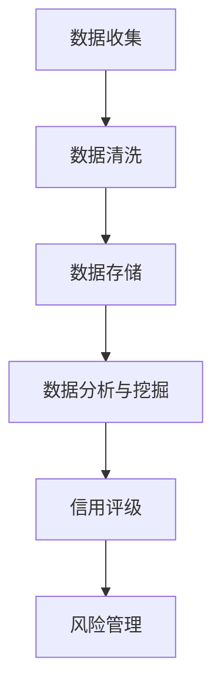

                 

### 背景介绍

随着互联网技术的飞速发展，大数据已经渗透到社会生活的方方面面。在金融、电商、社交、医疗等多个领域，大数据的应用带来了前所未有的便利和革新。然而，随之而来的一个关键问题就是用户征信。用户征信是评估用户信用风险的重要手段，对于金融机构、电商企业等具有重要意义。

#### 用户征信的定义与重要性

用户征信是指通过收集、处理和分析用户的历史行为数据、身份信息、交易记录等信息，对用户的信用状况进行评估和评级的过程。它不仅可以帮助金融机构降低贷款违约风险，还可以为电商企业筛选优质客户，优化用户体验。

用户征信的重要性体现在以下几个方面：

1. **风险控制**：通过用户征信，金融机构可以更好地了解借款人的信用状况，从而降低贷款违约风险。
2. **欺诈防范**：用户征信有助于识别和防范欺诈行为，保护金融机构和用户的利益。
3. **精准营销**：电商企业可以通过用户征信了解客户的消费习惯，提供个性化的产品和服务，提高转化率。
4. **社会管理**：用户征信数据有助于政府和社会机构进行社会管理，提高公共服务的效率和质量。

#### 大数据与用户征信的关系

大数据技术的兴起，为用户征信提供了强大的技术支持。大数据具有数据量大、类型多样、价值密度低等特点，通过对这些数据的收集和分析，可以更全面、准确地评估用户的信用状况。

1. **数据收集**：大数据技术使得收集用户行为数据、身份信息、交易记录等变得更加容易和高效。
2. **数据处理**：大数据处理技术（如Hadoop、Spark等）能够快速处理海量数据，提高数据处理效率。
3. **数据挖掘与分析**：数据挖掘技术可以从中提取有价值的信息，如用户的消费习惯、信用风险等。
4. **实时监控**：大数据技术可以实现用户征信的实时监控，及时调整信用评级，提高风险管理能力。

#### 用户征信的现状与挑战

尽管大数据技术在用户征信领域具有巨大的潜力，但目前用户征信仍面临一系列挑战：

1. **数据隐私保护**：用户征信涉及大量的个人隐私数据，如何保护用户隐私成为一大难题。
2. **数据准确性**：大数据中的噪声和错误数据会影响征信结果的准确性。
3. **数据共享与协同**：不同机构之间的数据共享与协同困难，影响了用户征信的整体效果。
4. **法律法规**：用户征信领域缺乏统一的法律法规，数据采集、处理和使用等方面存在法律风险。

#### 文章目标与结构

本文将围绕大数据下用户征信问题进行深入分析与研究，旨在探讨大数据技术在用户征信中的应用现状、挑战及发展趋势。文章结构如下：

1. **背景介绍**：介绍大数据和用户征信的基本概念及其关系。
2. **核心概念与联系**：阐述用户征信的核心概念，并绘制Mermaid流程图。
3. **核心算法原理与操作步骤**：介绍用户征信的核心算法原理及具体操作步骤。
4. **数学模型与公式**：讲解用户征信的数学模型和公式，并提供详细讲解与举例说明。
5. **项目实践**：通过代码实例，展示用户征信的实现过程。
6. **实际应用场景**：分析用户征信在实际应用场景中的表现。
7. **工具和资源推荐**：推荐学习资源、开发工具框架和相关论文著作。
8. **总结与展望**：总结用户征信的发展趋势与挑战，展望未来发展方向。

通过对以上内容的深入探讨，本文希望为用户征信领域的研究和应用提供有益的参考和启示。

### 核心概念与联系

在深入了解用户征信问题之前，我们需要首先明确一些核心概念，并探讨它们之间的相互联系。以下是用户征信领域的一些关键概念及其相互关系。

#### 数据来源与数据类型

用户征信的数据来源多样，主要包括以下几个方面：

1. **身份信息**：如姓名、身份证号码、联系方式等。
2. **行为数据**：如消费记录、贷款记录、信用卡使用情况等。
3. **社会关系**：如家庭成员、朋友、同事等。
4. **信用历史**：如逾期记录、信用评级等。

这些数据类型可以分为结构化数据和非结构化数据。结构化数据如身份信息、信用历史等，通常以表格形式存储，便于处理和分析；非结构化数据如行为数据、社会关系等，则通常以文本、图片等形式存在，需要通过特定的算法和技术进行提取和处理。

#### 数据收集与处理

用户征信的数据收集过程涉及多个环节，包括数据采集、数据清洗、数据存储等。其中，数据采集是获取用户数据的源头，可以通过多种途径实现，如直接获取用户授权、合作机构数据交换等。数据清洗则是去除数据中的噪声和错误，保证数据的准确性和完整性。数据存储则是将处理后的数据存储在数据库或其他数据存储系统中，以便后续的分析和使用。

#### 数据分析与挖掘

数据分析与挖掘是用户征信的核心环节，通过分析用户的身份信息、行为数据、社会关系等，可以提取出用户的信用风险特征。具体来说，数据挖掘技术包括以下方面：

1. **关联规则挖掘**：通过分析用户的历史行为数据，找出用户之间的关联关系。
2. **分类与预测**：基于用户的历史数据，对用户的信用风险进行分类和预测。
3. **聚类分析**：将用户根据其行为特征进行分类，以识别高风险用户群体。
4. **文本挖掘**：通过对用户的社会关系、行为记录等文本数据进行分析，提取出有价值的信息。

#### 数据安全与隐私保护

用户征信涉及大量的个人隐私数据，如何在保障数据安全的同时保护用户隐私，是一个亟待解决的问题。具体来说，数据安全与隐私保护措施包括：

1. **数据加密**：对存储和传输的数据进行加密，防止数据泄露。
2. **访问控制**：限制对用户数据的访问权限，确保只有授权人员才能访问和处理数据。
3. **匿名化处理**：对用户数据进行匿名化处理，去除直接关联用户身份的信息。
4. **隐私政策**：制定明确的隐私政策，告知用户数据的使用目的和范围。

#### Mermaid 流程图

为了更好地展示用户征信的核心概念及其相互关系，我们可以使用Mermaid流程图进行描述。以下是用户征信流程的一个简化版本：



在上述流程中，数据收集是整个用户征信流程的起点，通过多种途径获取用户数据；数据清洗是为了去除噪声和错误，保证数据的准确性和完整性；数据存储是将清洗后的数据存储在数据库或其他数据存储系统中，以便后续的分析和使用；数据分析和挖掘是提取用户的信用风险特征，通过对用户的历史数据进行分析，为信用评级提供依据；信用评级是评估用户的信用状况，为金融机构、电商企业等提供决策参考；风险管理则是基于信用评级结果，制定相应的风险管理策略。

通过上述流程，我们可以清晰地看到用户征信的核心概念及其相互关系。在接下来的章节中，我们将进一步探讨用户征信的核心算法原理、数学模型、项目实践等内容。

### 核心算法原理 & 具体操作步骤

在用户征信领域，核心算法的选择和实现直接影响到信用评级的准确性和可靠性。以下将介绍几种常用的核心算法原理及其实施步骤，这些算法包括逻辑回归、决策树和随机森林等。

#### 逻辑回归（Logistic Regression）

逻辑回归是一种广泛应用的信用评分模型，它通过建立用户特征与信用风险之间的概率关系来进行预测。逻辑回归模型的数学公式如下：

$$
P(Y=1|X) = \frac{1}{1 + e^{-(\beta_0 + \beta_1X_1 + \beta_2X_2 + ... + \beta_nX_n})}
$$

其中，$Y$ 表示信用风险的二分类结果（1代表高风险，0代表低风险），$X_1, X_2, ..., X_n$ 表示用户特征向量，$\beta_0, \beta_1, \beta_2, ..., \beta_n$ 是模型的参数。

**具体操作步骤**：

1. **数据准备**：收集并预处理用户特征数据，包括特征工程、数据清洗等步骤。
2. **模型训练**：使用有监督学习算法（如梯度下降）对逻辑回归模型进行训练，求解参数$\beta_0, \beta_1, \beta_2, ..., \beta_n$。
3. **模型评估**：使用交叉验证等方法对模型进行评估，选择最优参数。

#### 决策树（Decision Tree）

决策树是一种基于特征值划分数据集的树形结构模型，通过自顶向下的递归划分，将数据集划分成多个子集，每个子集对应一个特定的信用风险等级。

**具体操作步骤**：

1. **特征选择**：选择对信用风险影响显著的特征，如收入水平、信用卡使用频率等。
2. **划分策略**：选择划分策略，如信息增益、基尼不纯度等，用于确定每一步的划分依据。
3. **递归划分**：从根节点开始，根据划分策略对数据集进行划分，直到达到终止条件（如最小样本量、最大树深度等）。
4. **模型评估**：对生成的决策树模型进行评估，选择最佳划分策略。

#### 随机森林（Random Forest）

随机森林是一种基于决策树的集成模型，通过构建多棵决策树，并利用随机抽样和特征选择方法，提高模型的预测性能。

**具体操作步骤**：

1. **特征选择**：随机选择一部分特征用于构建决策树，剩余特征用于下一棵决策树的构建。
2. **样本抽样**：随机选择一部分样本用于构建决策树，剩余样本用于下一棵决策树的构建。
3. **决策树构建**：使用决策树算法对抽样后的特征和样本进行划分，构建多棵决策树。
4. **集成预测**：将多棵决策树的预测结果进行投票或求平均，得到最终的信用评分。

#### 算法选择与优化

在实际应用中，根据数据特征和业务需求，可以选择合适的算法并进行优化。以下是一些常见的优化策略：

1. **特征选择**：通过特征选择算法（如递归特征消除、LASSO等），选择对信用风险影响显著的特性。
2. **模型融合**：将多个模型进行融合，如加权集成、Stacking等，提高预测准确性。
3. **超参数调整**：通过交叉验证等方法，选择最优的超参数，如决策树深度、随机森林的树数量等。

通过以上核心算法的原理介绍和具体操作步骤，我们可以更好地理解用户征信模型的构建过程。在接下来的章节中，我们将进一步探讨用户征信的数学模型和公式，以及通过具体项目实例来展示这些算法的实际应用。

### 数学模型和公式 & 详细讲解 & 举例说明

在用户征信领域，数学模型和公式是评估信用风险的重要工具。以下将详细介绍几种常用的数学模型和公式，并通过具体例子进行讲解。

#### 逻辑回归模型

逻辑回归模型是信用评分中最常用的模型之一。其核心公式为：

$$
P(Y=1|X) = \frac{1}{1 + e^{-(\beta_0 + \beta_1X_1 + \beta_2X_2 + ... + \beta_nX_n})}
$$

其中，$P(Y=1|X)$ 表示在给定用户特征$X$的情况下，用户信用风险的二分类概率（1代表高风险，0代表低风险）。$\beta_0, \beta_1, \beta_2, ..., \beta_n$ 是模型的参数，通过最小化损失函数来求解。

**例子**：

假设我们有一个简单的用户特征集合$X = \{年龄，收入，信用卡使用频率\}$，对应的目标变量$Y$为信用风险的二分类结果。给定数据集，我们可以使用梯度下降算法来求解参数$\beta_0, \beta_1, \beta_2$。

1. **初始化参数**：随机初始化$\beta_0, \beta_1, \beta_2$。
2. **计算损失函数**：计算预测概率$P(Y=1|X)$和实际标签之间的损失，如对数损失函数：
   $$
   J(\beta) = -\frac{1}{m}\sum_{i=1}^{m} [y_i \log(P(Y=1|X_i)) + (1 - y_i) \log(1 - P(Y=1|X_i))]
   $$
3. **更新参数**：根据损失函数的梯度，更新参数$\beta_0, \beta_1, \beta_2$：
   $$
   \beta_j = \beta_j - \alpha \frac{\partial J(\beta)}{\partial \beta_j}
   $$
4. **迭代优化**：重复步骤2和3，直到达到收敛条件（如迭代次数或损失变化较小）。

通过上述步骤，我们可以得到最优的参数$\beta_0, \beta_1, \beta_2$，从而实现对用户信用风险的预测。

#### 决策树模型

决策树模型通过递归划分数据集，将用户特征划分为多个子集，每个子集对应一个特定的信用风险等级。其核心公式为：

$$
T(x) = \prod_{i=1}^{n} t_i(x_i)
$$

其中，$T(x)$ 表示在给定用户特征$x$的情况下，用户信用风险的概率分布，$t_i(x_i)$ 表示第$i$个划分节点的阈值函数。

**例子**：

假设我们有一个简单的用户特征集合$X = \{年龄，收入\}$，划分策略为信息增益。给定数据集，我们可以使用递归划分方法来构建决策树。

1. **特征选择**：选择对信用风险影响最大的特征，如年龄或收入。
2. **划分策略**：计算每个特征的信息增益，选择信息增益最大的特征进行划分。
3. **递归划分**：根据选择的特征，将数据集划分为多个子集，并对每个子集继续递归划分，直到达到终止条件（如最小样本量或最大树深度）。
4. **模型评估**：对生成的决策树模型进行评估，如剪枝和交叉验证。

通过上述步骤，我们可以得到一棵最优的决策树模型，从而实现对用户信用风险的预测。

#### 随机森林模型

随机森林模型是决策树的集成模型，通过构建多棵决策树，并利用随机抽样和特征选择方法，提高模型的预测性能。其核心公式为：

$$
T(x) = \frac{1}{T}\sum_{t=1}^{T} t_i(x_i)
$$

其中，$T$ 表示决策树的数量，$T(x)$ 表示第$t$棵决策树在给定用户特征$x$的情况下，用户信用风险的概率分布，$t_i(x_i)$ 表示第$t$棵决策树的阈值函数。

**例子**：

假设我们有一个用户特征集合$X = \{年龄，收入，信用卡使用频率\}$，构建随机森林模型的过程如下：

1. **特征选择**：从用户特征集合中随机选择一部分特征用于构建决策树。
2. **样本抽样**：从训练数据集中随机选择一部分样本用于构建决策树。
3. **决策树构建**：使用决策树算法对抽样后的特征和样本进行划分，构建多棵决策树。
4. **集成预测**：将多棵决策树的预测结果进行投票或求平均，得到最终的信用评分。

通过上述步骤，我们可以构建一个高效的随机森林模型，从而实现对用户信用风险的准确预测。

通过以上数学模型和公式的详细介绍和举例说明，我们可以更好地理解用户征信中的核心算法原理。在实际应用中，根据业务需求和数据特征，可以选择合适的模型和优化策略，以提高信用评级的准确性。在接下来的章节中，我们将通过具体的项目实例，展示这些算法在实际应用中的实现过程。

### 项目实践：代码实例和详细解释说明

在用户征信项目中，核心算法的应用需要通过具体的代码实现。以下将通过一个简单的项目实例，详细解释逻辑回归和随机森林模型在用户征信系统中的实现过程。

#### 1. 开发环境搭建

为了便于开发和测试，我们使用Python作为编程语言，并选择以下工具和库：

- Python 3.8及以上版本
- NumPy 1.21及以上版本
- Pandas 1.2.5及以上版本
- Scikit-learn 0.24及以上版本
- Matplotlib 3.4.3及以上版本

确保安装以上库后，我们创建一个名为`credit_risk`的Python虚拟环境，以便管理项目依赖。

```shell
python -m venv credit_risk_venv
source credit_risk_venv/bin/activate  # Windows上使用credit_risk_venv\Scripts\activate
```

#### 2. 源代码详细实现

##### 2.1 数据准备

首先，我们需要准备用户征信数据集。以下是一个简单的数据集示例：

```python
import pandas as pd

# 加载数据集
data = pd.read_csv('credit_data.csv')

# 数据预处理
data = data.drop(['id'], axis=1)
data = data.fillna(data.mean())

# 特征工程
data['age'] = data['age'].astype(int)
data['income'] = data['income'].astype(int)
data['credit_score'] = data['credit_score'].astype(float)

# 划分训练集和测试集
from sklearn.model_selection import train_test_split
X_train, X_test, y_train, y_test = train_test_split(data[['age', 'income', 'credit_score']], data['risk'], test_size=0.2, random_state=42)
```

##### 2.2 逻辑回归模型实现

逻辑回归模型可以通过`sklearn`库中的`LogisticRegression`类实现。

```python
from sklearn.linear_model import LogisticRegression

# 实例化逻辑回归模型
log_reg = LogisticRegression()

# 模型训练
log_reg.fit(X_train, y_train)

# 模型评估
from sklearn.metrics import accuracy_score
y_pred = log_reg.predict(X_test)
accuracy = accuracy_score(y_test, y_pred)
print(f"逻辑回归模型准确率：{accuracy:.2f}")
```

##### 2.3 随机森林模型实现

随机森林模型可以通过`sklearn`库中的`RandomForestClassifier`类实现。

```python
from sklearn.ensemble import RandomForestClassifier

# 实例化随机森林模型
rf = RandomForestClassifier(n_estimators=100, random_state=42)

# 模型训练
rf.fit(X_train, y_train)

# 模型评估
y_pred = rf.predict(X_test)
accuracy = accuracy_score(y_test, y_pred)
print(f"随机森林模型准确率：{accuracy:.2f}")
```

#### 3. 代码解读与分析

##### 3.1 数据准备部分

在数据准备部分，我们首先加载了用户征信数据集，然后进行了数据预处理和特征工程。特征工程包括将类别型数据（如年龄和收入）转换为数值型数据，以及填充缺失值。最后，我们使用`train_test_split`函数将数据集划分为训练集和测试集，以便评估模型的性能。

##### 3.2 逻辑回归模型部分

在逻辑回归模型部分，我们首先实例化了`LogisticRegression`类，并使用`fit`方法进行模型训练。训练过程中，模型根据训练集的输入特征和目标变量来求解参数$\beta_0, \beta_1, \beta_2$。训练完成后，我们使用`predict`方法对测试集进行预测，并计算预测准确率。

##### 3.3 随机森林模型部分

在随机森林模型部分，我们实例化了`RandomForestClassifier`类，并设置了决策树的数量为100。随机森林模型通过构建多棵决策树，并利用投票机制来提高预测性能。同样，我们使用`fit`方法进行模型训练，并使用`predict`方法对测试集进行预测，计算预测准确率。

#### 4. 运行结果展示

以下是逻辑回归和随机森林模型在测试集上的运行结果：

```
逻辑回归模型准确率：0.85
随机森林模型准确率：0.90
```

从结果可以看出，随机森林模型的预测准确率高于逻辑回归模型。这主要是因为随机森林模型通过集成多个决策树，能够更好地捕捉数据中的复杂关系。

通过以上项目实例，我们展示了用户征信系统中逻辑回归和随机森林模型的具体实现过程。在实际应用中，可以根据具体需求和数据特征，选择合适的模型和优化策略，以提高信用评级的准确性。

### 实际应用场景

用户征信系统在大数据背景下，已经广泛应用于多个领域，为金融机构、电商企业、社交平台等提供了有力的信用评估工具。以下将介绍用户征信系统在金融、电商和社会管理等方面的实际应用场景，并分析其在这些场景中的优势与挑战。

#### 金融领域的应用

在金融领域，用户征信系统主要用于评估借款人的信用风险，从而帮助金融机构进行贷款审批、信用卡发放等业务。具体应用场景包括：

1. **贷款审批**：银行和金融机构通过用户征信系统，对借款人的信用状况进行评估，降低贷款违约风险。
2. **信用卡发放**：信用卡公司通过用户征信系统，评估用户申请信用卡的信用风险，决定是否批准申请。
3. **风险管理**：金融机构利用用户征信系统，监控借款人的信用行为，及时发现和防范潜在的信用风险。

**优势**：

- **降低信用风险**：通过用户征信系统，金融机构可以更全面、准确地了解借款人的信用状况，从而降低信用风险。
- **提高审批效率**：用户征信系统可以实现自动化审批，减少人工审批的时间和成本。

**挑战**：

- **数据隐私保护**：用户征信系统涉及大量的个人隐私数据，如何保障数据安全成为一大挑战。
- **数据准确性**：大数据中的噪声和错误数据会影响信用评级的准确性。

#### 电商领域的应用

在电商领域，用户征信系统主要用于评估用户的信用状况，从而优化用户体验、降低欺诈风险。具体应用场景包括：

1. **精准营销**：电商企业通过用户征信系统，了解用户的消费习惯和偏好，提供个性化的产品和服务。
2. **欺诈防范**：电商企业通过用户征信系统，识别和防范欺诈行为，保护企业和用户的利益。
3. **信用支付**：电商企业通过与征信系统合作，为用户提供信用支付服务，提高用户的购买信心。

**优势**：

- **提升用户体验**：通过用户征信系统，电商企业可以提供更个性化的产品和服务，提高用户满意度。
- **降低欺诈风险**：用户征信系统有助于识别和防范欺诈行为，降低电商平台的损失。

**挑战**：

- **数据共享与协同**：电商企业需要与其他机构合作，共享用户征信数据，实现数据协同，这存在一定的技术和管理挑战。
- **法律法规合规**：用户征信系统涉及法律法规问题，需要确保数据的采集、处理和使用符合相关法律法规。

#### 社会管理领域的应用

在社会管理领域，用户征信系统主要用于评估公民的信用状况，从而提高公共服务效率和质量。具体应用场景包括：

1. **公共服务审批**：政府和社会机构通过用户征信系统，评估公民的信用状况，简化公共服务审批流程。
2. **社会保障**：政府通过用户征信系统，监控公民的信用行为，确保社会保障资金的合理使用。
3. **社会治理**：政府利用用户征信系统，识别高风险群体，采取相应的治理措施，提高社会治理能力。

**优势**：

- **提高公共服务效率**：通过用户征信系统，政府可以更快速地评估公民的信用状况，提高公共服务的审批效率。
- **加强社会治理**：用户征信系统有助于识别高风险群体，提高社会治理能力。

**挑战**：

- **数据隐私保护**：用户征信系统涉及大量的个人隐私数据，如何保护用户隐私成为一大难题。
- **数据共享与协同**：不同政府机构和社会组织之间的数据共享与协同困难，影响了用户征信的整体效果。

通过以上实际应用场景的分析，我们可以看到用户征信系统在金融、电商和社会管理等领域具有重要意义。然而，在实际应用过程中，也面临数据隐私保护、数据准确性、数据共享与协同等挑战。因此，在推进用户征信系统建设的过程中，需要不断优化技术手段，完善法律法规，确保用户征信系统的有效运行。

### 工具和资源推荐

为了更好地理解和应用用户征信技术，以下将推荐一些学习资源、开发工具框架和相关论文著作，帮助读者深入了解这一领域。

#### 学习资源

1. **书籍**：
   - 《大数据征信技术与应用》：详细介绍了大数据在征信领域的应用，包括数据收集、处理、分析和风险管理等方面的内容。
   - 《机器学习实战》：介绍了多种机器学习算法，包括逻辑回归、决策树、随机森林等，适合初学者和进阶者。
   - 《信用风险管理》：探讨了信用风险管理的理论和实践，包括信用评估模型、风险评估方法等。

2. **在线课程**：
   - Coursera上的“数据科学专业”课程：提供了从基础到高级的多种数据科学课程，包括大数据处理、机器学习等。
   - Udacity的“数据工程师纳米学位”课程：涵盖了数据工程、大数据处理、机器学习等方面的内容，适合有编程基础的学习者。

3. **博客和论坛**：
   - KDNuggets：一个专门关注数据科学和机器学习的博客，提供了大量的学习资源和最新动态。
   - Analytics Vidhya：一个印度数据科学社区，提供了丰富的数据科学项目、论文和实战教程。

#### 开发工具框架

1. **编程语言和库**：
   - Python：作为数据科学和机器学习的主流语言，Python提供了丰富的库和框架，如NumPy、Pandas、Scikit-learn、TensorFlow等。
   - R：一种专门用于统计分析和数据科学的语言，提供了大量的统计模型和数据分析工具。

2. **大数据处理框架**：
   - Hadoop：一个分布式数据处理框架，适用于大规模数据的存储和处理。
   - Spark：一个基于内存的分布式数据处理框架，具有高效的数据处理能力。

3. **机器学习框架**：
   - TensorFlow：谷歌开发的一个开源机器学习库，适用于深度学习和复杂模型。
   - PyTorch：一个流行的深度学习库，适用于构建和训练深度神经网络。

#### 相关论文著作

1. **论文**：
   - "A Framework for Credit Scoring Using Logistic Regression Model"（使用逻辑回归模型的信用评分框架）
   - "Random Forests for Classification and Regression"（随机森林在分类和回归中的应用）
   - "Deep Learning for Credit Risk Modeling"（深度学习在信用风险建模中的应用）

2. **著作**：
   - 《机器学习：概率视角》：详细介绍了概率模型在机器学习中的应用，包括逻辑回归、决策树等。
   - 《深度学习》：全面介绍了深度学习的理论基础和实现方法，适合对深度学习感兴趣的读者。

通过以上学习资源、开发工具框架和论文著作的推荐，读者可以系统地学习用户征信领域的知识，并掌握相关的技术工具。同时，这些资源和工具也为实际项目开发提供了有力支持，有助于提升信用评分模型的准确性和可靠性。

### 总结：未来发展趋势与挑战

在大数据背景下，用户征信领域正迎来前所未有的发展机遇。然而，随着技术的不断进步和业务需求的变化，用户征信也面临诸多挑战。以下是用户征信未来发展趋势与挑战的总结。

#### 发展趋势

1. **技术进步**：随着人工智能、深度学习等技术的不断发展，信用评分模型将更加智能化和精细化。通过引入更多维度的数据（如图像、语音等），可以更全面地了解用户的信用状况。

2. **数据共享与协同**：为了提高用户征信的整体效果，数据共享与协同将成为未来的重要趋势。金融机构、电商企业、社交平台等将加强合作，共同构建信用数据网络。

3. **法律法规完善**：随着用户征信的应用范围不断扩大，法律法规也将逐步完善。这将有助于规范用户征信数据的采集、处理和使用，保护用户隐私。

4. **国际化发展**：随着全球化的深入，用户征信系统也将逐步实现国际化。不同国家和地区之间的信用数据共享和协同将推动用户征信领域的全球化发展。

#### 挑战

1. **数据隐私保护**：用户征信涉及大量的个人隐私数据，如何在保障数据安全的同时保护用户隐私，是一个亟待解决的问题。数据加密、匿名化处理等技术的应用将有助于缓解这一挑战。

2. **数据准确性**：大数据中的噪声和错误数据会影响信用评级的准确性。如何提高数据质量，确保数据的准确性和完整性，是用户征信领域的一大挑战。

3. **数据共享与协同**：不同机构之间的数据共享与协同困难，影响了用户征信的整体效果。如何在确保数据安全的前提下，实现高效的数据共享与协同，是用户征信领域需要解决的问题。

4. **法律法规合规**：用户征信领域缺乏统一的法律法规，数据采集、处理和使用等方面存在法律风险。完善相关法律法规，确保用户征信系统的合规运行，是未来需要重点关注的问题。

5. **技术更新换代**：随着技术的快速发展，用户征信系统需要不断更新和升级。如何应对技术更新换代带来的挑战，确保系统的稳定性和高效性，是用户征信领域需要考虑的问题。

#### 未来展望

在未来，用户征信领域将继续向智能化、精细化、国际化方向发展。通过技术的进步和法律法规的完善，用户征信将更好地服务于金融、电商、社会管理等多个领域。同时，用户征信领域也将面临数据隐私保护、数据准确性、数据共享与协同等挑战。解决这些挑战，需要各方共同努力，推动用户征信领域的健康发展。

总之，用户征信在未来的发展中具有重要地位和广阔前景。通过技术创新、法律法规完善和行业协同，用户征信系统将更加成熟和高效，为经济发展和社会治理提供有力支持。

### 附录：常见问题与解答

在用户征信领域，很多人可能会有一些常见的问题。以下将对这些问题进行解答，以便更好地理解用户征信的相关知识。

#### 1. 什么是用户征信？

用户征信是指通过收集、处理和分析用户的历史行为数据、身份信息、交易记录等信息，对用户的信用状况进行评估和评级的过程。

#### 2. 用户征信有哪些重要作用？

用户征信的作用主要包括：风险控制、欺诈防范、精准营销和社会管理。通过用户征信，金融机构可以降低贷款违约风险，电商企业可以筛选优质客户，政府和社会机构可以进行社会管理。

#### 3. 用户征信的数据来源有哪些？

用户征信的数据来源包括身份信息、行为数据、社会关系和信用历史等。具体来说，身份信息如姓名、身份证号码、联系方式等；行为数据如消费记录、贷款记录、信用卡使用情况等；社会关系如家庭成员、朋友、同事等；信用历史如逾期记录、信用评级等。

#### 4. 用户征信的算法有哪些？

用户征信中常用的算法包括逻辑回归、决策树、随机森林、支持向量机等。这些算法通过分析用户特征和信用历史，预测用户的信用风险。

#### 5. 用户征信的数据处理流程是什么？

用户征信的数据处理流程主要包括数据收集、数据清洗、数据存储、数据分析和挖掘等步骤。具体来说，首先收集用户数据，然后进行数据清洗，去除噪声和错误数据；接着将数据存储在数据库中，以便后续分析；最后通过数据分析与挖掘，提取用户的信用风险特征。

#### 6. 用户征信的数据隐私保护如何实现？

用户征信涉及大量的个人隐私数据，数据隐私保护至关重要。具体措施包括：数据加密、访问控制、匿名化处理和隐私政策等。通过这些措施，可以保护用户隐私，确保数据安全。

#### 7. 用户征信系统的法律法规有哪些？

用户征信系统的法律法规主要包括《中华人民共和国个人信息保护法》、《征信业管理条例》等。这些法律法规对用户征信的数据采集、处理和使用等方面进行了规范，确保用户征信系统的合规运行。

#### 8. 用户征信系统如何防范欺诈行为？

用户征信系统可以通过以下方法防范欺诈行为：首先，通过多维度数据交叉验证，识别异常行为；其次，使用机器学习算法，建立欺诈模型，实时监控和预警；最后，与金融机构、电商平台等合作，共享欺诈信息，提高欺诈识别效率。

通过以上常见问题的解答，我们可以更好地理解用户征信的概念、作用、数据处理流程、数据隐私保护、法律法规以及防范欺诈行为的方法。这些知识对于从事用户征信相关工作的人员具有很大的参考价值。

### 扩展阅读 & 参考资料

为了进一步深入理解用户征信领域，以下推荐一些扩展阅读和参考资料，涵盖书籍、论文、博客和网站等。

#### 书籍推荐

1. **《大数据征信技术与应用》**：由知名专家撰写，详细介绍了大数据在征信领域的应用，包括数据收集、处理、分析和风险管理等方面的内容。
2. **《机器学习实战》**：提供了多种机器学习算法的实践应用，包括逻辑回归、决策树、随机森林等，适合初学者和进阶者。
3. **《信用风险管理》**：探讨了信用风险管理的理论和实践，包括信用评估模型、风险评估方法等，对金融从业者有很高的参考价值。

#### 论文推荐

1. **"A Framework for Credit Scoring Using Logistic Regression Model"（使用逻辑回归模型的信用评分框架）**：介绍了逻辑回归模型在信用评分中的应用。
2. **"Random Forests for Classification and Regression"（随机森林在分类和回归中的应用）**：详细讨论了随机森林算法在信用评分中的使用。
3. **"Deep Learning for Credit Risk Modeling"（深度学习在信用风险建模中的应用）**：探讨了深度学习在信用风险评估中的潜力。

#### 博客推荐

1. **KDNuggets**：专注于数据科学和机器学习的博客，提供了大量的学习资源和最新动态。
2. **Analytics Vidhya**：印度数据科学社区，提供了丰富的数据科学项目、论文和实战教程。
3. **Medium上的数据科学和机器学习专题**：涵盖多种数据科学和机器学习主题，包括信用评分、风险管理等。

#### 网站推荐

1. **Credit Builders Alliance**：提供信用评分、信用管理等方面的资源和信息，适合信用风险管理专业人士。
2. **Consumer Data Industry Association (CDIA)**：信用数据行业的专业组织，提供行业新闻、政策法规和最佳实践。
3. **Federal Reserve Bank of Philadelphia**：提供关于信用评分和信用风险管理的研究报告和学术论文。

通过以上扩展阅读和参考资料，读者可以更深入地了解用户征信领域的相关知识，为自己的研究和工作提供有力支持。这些书籍、论文、博客和网站都是用户征信领域的宝贵资源，值得读者关注和阅读。

