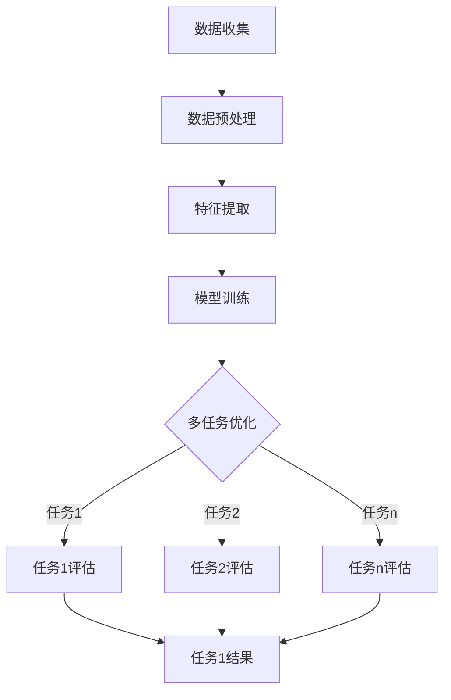
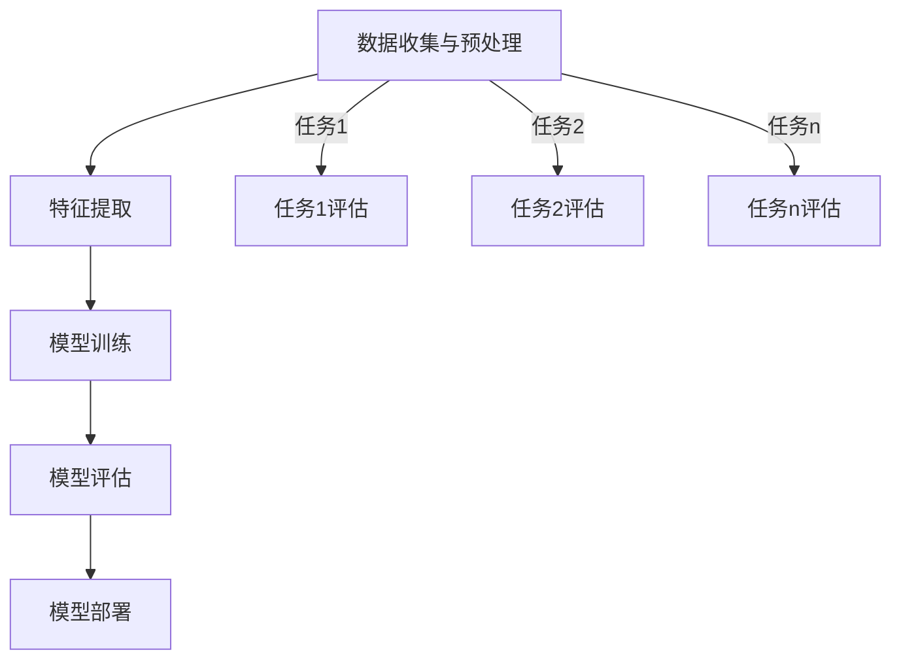

                 

### 文章标题：基于大模型的多场景多任务推荐优化

> **关键词：** 大模型、多场景、多任务推荐、优化、人工智能、机器学习、深度学习。

> **摘要：** 本文将深入探讨大模型在多场景多任务推荐系统中的优化策略，包括核心概念、算法原理、数学模型、实践案例及其应用场景。通过逐步分析推理，揭示大模型在推荐系统中的巨大潜力，以及面临的挑战和未来发展方向。

### 1. 背景介绍

在互联网时代，推荐系统已成为众多应用程序的核心组成部分。无论是电子商务平台、社交媒体、新闻网站，还是视频流媒体服务，推荐系统都扮演着至关重要的角色。它们通过分析用户的兴趣和行为，向用户推荐可能感兴趣的内容或产品，从而提升用户体验、提高用户黏性，并带来显著的商业价值。

然而，随着互联网的迅速发展，用户需求的多样化和信息量的爆炸式增长，传统的推荐系统面临着诸多挑战。首先，如何处理海量数据并从中提取有效的用户特征和物品特征，成为一个难题。其次，不同场景下的推荐任务可能存在不同的优先级和目标，如提升点击率、增加购买转化率或提高用户满意度。如何在多个目标之间取得平衡，也是一个亟待解决的问题。

此外，多任务推荐系统的复杂性不断增加，要求推荐模型具备更强的泛化能力和适应性。传统的单一任务推荐模型往往只能针对单一目标进行优化，难以满足多任务的需求。因此，如何构建一个能够处理多场景、多任务的高效推荐系统，成为当前研究的热点和难点。

为了应对这些挑战，近年来，基于大模型的推荐系统逐渐成为研究热点。大模型通过整合海量的数据和信息，利用深度学习等技术，实现了对用户和物品的深入理解和建模。本文将探讨大模型在多场景多任务推荐系统中的优化策略，以期为实际应用提供有益的参考。

### 2. 核心概念与联系

#### 2.1 多场景多任务推荐系统的概念

多场景多任务推荐系统是指在一个系统中同时处理多个不同的推荐任务，这些任务可能具有不同的优先级和目标。例如，在一个电子商务平台上，推荐系统需要同时处理提升点击率、增加购买转化率和提升用户满意度等多个任务。不同场景下的推荐任务可能涉及不同的用户群体、物品类型和推荐策略。

#### 2.2 大模型的概念

大模型是指具有海量参数和强大计算能力的机器学习模型。这些模型能够通过深度学习等技术，从大规模数据中自动提取特征和规律，实现高度复杂的任务。大模型的应用领域非常广泛，包括自然语言处理、计算机视觉、语音识别等。

#### 2.3 多场景多任务推荐系统与大型模型的关系

大模型在多场景多任务推荐系统中的应用，主要体现在以下几个方面：

1. **数据整合与处理：** 大模型能够整合来自多个不同场景的数据，通过深度学习技术提取有效的用户和物品特征，从而提升推荐系统的性能。

2. **任务平衡与优化：** 大模型可以同时处理多个推荐任务，通过联合优化不同任务的目标函数，实现多个任务的平衡和优化。

3. **自适应性与泛化能力：** 大模型具有较强的自适应性和泛化能力，能够根据不同场景和任务的需求，灵活调整模型参数和策略，提高推荐系统的适应性和效果。

#### 2.4 Mermaid 流程图

下面是一个简单的 Mermaid 流程图，展示了多场景多任务推荐系统与大型模型的关系：



### 3. 核心算法原理 & 具体操作步骤

#### 3.1 算法原理

多场景多任务推荐系统的核心算法通常是基于深度学习的大模型。这些模型通常采用编码器-解码器（Encoder-Decoder）架构，能够同时处理多个任务。其基本原理如下：

1. **编码器（Encoder）：** 用于编码输入数据，提取特征表示。编码器的输出是一个固定长度的向量，代表输入数据的语义信息。

2. **解码器（Decoder）：** 用于解码编码器的输出，生成推荐结果。解码器的输入是编码器的输出，输出是推荐结果。

3. **多任务损失函数：** 为了同时优化多个任务，大模型通常采用多任务损失函数。该损失函数将不同任务的损失结合起来，通过梯度下降等优化算法，调整模型参数，实现多个任务的平衡优化。

#### 3.2 具体操作步骤

以下是构建多场景多任务推荐系统的基本操作步骤：

1. **数据收集与预处理：** 收集来自不同场景的数据，进行数据清洗、去重、归一化等预处理操作，确保数据的质量和一致性。

2. **特征提取：** 利用深度学习模型（如卷积神经网络、循环神经网络等），对预处理后的数据进行特征提取。特征提取的目的是将原始数据转化为高维的语义特征表示。

3. **模型训练：** 构建编码器-解码器架构的大模型，使用提取的特征进行模型训练。训练过程中，通过多任务损失函数优化模型参数，实现多个任务的平衡。

4. **模型评估：** 在测试集上评估模型的性能，通过指标（如准确率、召回率、F1 值等）评估各个任务的性能。

5. **模型部署：** 将训练好的模型部署到实际应用环境中，根据用户行为和偏好，生成推荐结果。

#### 3.3 Mermaid 流程图

以下是多场景多任务推荐系统的具体操作步骤的 Mermaid 流程图：



### 4. 数学模型和公式 & 详细讲解 & 举例说明

#### 4.1 数学模型

多场景多任务推荐系统的数学模型通常涉及以下几个部分：

1. **用户表示（User Representation）：** 用户表示是用户特征的向量表示，用于描述用户的行为和偏好。假设用户集合为 \(U = \{u_1, u_2, ..., u_n\}\)，每个用户 \(u_i\) 的特征表示为 \(x_i \in \mathbb{R}^d\)。

2. **物品表示（Item Representation）：** 物品表示是物品特征的向量表示，用于描述物品的特性。假设物品集合为 \(I = \{i_1, i_2, ..., i_m\}\)，每个物品 \(i_j\) 的特征表示为 \(y_j \in \mathbb{R}^d\)。

3. **模型参数（Model Parameters）：** 模型参数包括编码器和解码器的参数，用于调整模型的行为。假设编码器参数为 \(\theta_e\)，解码器参数为 \(\theta_d\)。

4. **多任务损失函数（Multi-Task Loss Function）：** 多任务损失函数用于衡量模型在不同任务上的表现，通常是一个加权和。假设任务集合为 \(T = \{t_1, t_2, ..., t_k\}\)，每个任务 \(t_j\) 的损失函数为 \(L_j(\theta)\)，则总损失函数为：

   $$L(\theta) = \sum_{j=1}^k w_j L_j(\theta)$$

   其中，\(w_j\) 是任务 \(t_j\) 的权重。

#### 4.2 公式详解

1. **用户表示的生成：**

   假设编码器是一个深度神经网络，其输入是用户特征向量 \(x_i\)，输出是用户表示 \(z_i \in \mathbb{R}^d\)。编码器的损失函数为：

   $$L_e(\theta_e) = \frac{1}{m} \sum_{i=1}^m ||z_i - \hat{z}_i||^2$$

   其中，\(\hat{z}_i\) 是用户表示的预测值，\(m\) 是用户数量。

2. **物品表示的生成：**

   类似地，解码器是一个深度神经网络，其输入是编码器的输出 \(z_i\) 和物品特征向量 \(y_j\)，输出是物品表示 \(\hat{y}_j \in \mathbb{R}^d\)。解码器的损失函数为：

   $$L_d(\theta_d) = \frac{1}{m} \sum_{j=1}^m ||y_j - \hat{y}_j||^2$$

3. **多任务损失函数：**

   假设任务 \(t_j\) 的损失函数为 \(L_j(\theta) = \frac{1}{n} \sum_{i=1}^n l_j(\theta)\)，其中 \(l_j(\theta)\) 是任务 \(t_j\) 的损失函数，\(n\) 是样本数量。总损失函数为：

   $$L(\theta) = \sum_{j=1}^k w_j L_j(\theta)$$

#### 4.3 举例说明

假设我们有两个任务：任务1是预测用户的点击行为，任务2是预测用户的购买行为。任务1的权重为0.6，任务2的权重为0.4。编码器和解码器的参数分别为 \(\theta_e\) 和 \(\theta_d\)。

1. **用户表示的生成：**

   假设用户特征向量 \(x_i\) 是一个 \(10\)-维向量，编码器的输入是 \(x_i\)，输出是 \(z_i\)。编码器的损失函数为：

   $$L_e(\theta_e) = \frac{1}{n} \sum_{i=1}^n ||z_i - \hat{z}_i||^2$$

2. **物品表示的生成：**

   假设物品特征向量 \(y_j\) 是一个 \(20\)-维向量，解码器的输入是 \(z_i\) 和 \(y_j\)，输出是 \(\hat{y}_j\)。解码器的损失函数为：

   $$L_d(\theta_d) = \frac{1}{n} \sum_{j=1}^n ||y_j - \hat{y}_j||^2$$

3. **多任务损失函数：**

   假设任务1的损失函数为 \(L_1(\theta) = \frac{1}{n} \sum_{i=1}^n (p_i - \hat{p}_i)^2\)，任务2的损失函数为 \(L_2(\theta) = \frac{1}{n} \sum_{i=1}^n (q_i - \hat{q}_i)^2\)。则总损失函数为：

   $$L(\theta) = 0.6 L_1(\theta) + 0.4 L_2(\theta)$$

### 5. 项目实践：代码实例和详细解释说明

#### 5.1 开发环境搭建

为了构建一个多场景多任务推荐系统，我们需要一个合适的开发环境。以下是搭建开发环境的步骤：

1. **安装 Python：** 在官方网站 [https://www.python.org/downloads/](https://www.python.org/downloads/) 下载并安装 Python 3.8 或更高版本。

2. **安装深度学习库：** 安装 TensorFlow 或 PyTorch 等深度学习库。以下是使用 pip 安装的命令：

   ```bash
   pip install tensorflow  # 或者
   pip install torch
   ```

3. **安装数据处理库：** 安装 NumPy、Pandas 等数据处理库：

   ```bash
   pip install numpy pandas
   ```

4. **安装其他依赖：** 安装其他必要的库，如 Matplotlib、Scikit-learn 等：

   ```bash
   pip install matplotlib scikit-learn
   ```

#### 5.2 源代码详细实现

以下是构建多场景多任务推荐系统的 Python 代码示例：

```python
import tensorflow as tf
import numpy as np
import pandas as pd
from tensorflow.keras.layers import Embedding, LSTM, Dense
from tensorflow.keras.models import Model

# 数据预处理
def preprocess_data(data):
    # 数据清洗、去重、归一化等操作
    # ...
    return processed_data

# 构建编码器
def build_encoder(input_shape, latent_dim):
    input_layer = tf.keras.layers.Input(shape=input_shape)
    encoder = Embedding(input_dim=vocab_size, output_dim=embedding_dim)(input_layer)
    encoder = LSTM(latent_dim, return_sequences=False)(encoder)
    return Model(inputs=input_layer, outputs=encoder)

# 构建解码器
def build_decoder(input_shape, latent_dim):
    input_layer = tf.keras.layers.Input(shape=input_shape)
    decoder = Embedding(input_dim=vocab_size, output_dim=embedding_dim)(input_layer)
    decoder = LSTM(latent_dim, return_sequences=True)(decoder)
    return Model(inputs=input_layer, outputs=decoder)

# 构建多任务模型
def build_model(encoder, decoder, latent_dim):
    user_input = tf.keras.layers.Input(shape=(input_shape,))
    item_input = tf.keras.layers.Input(shape=(input_shape,))
    user_encoded = encoder(user_input)
    item_encoded = decoder(item_input)
    concatenated = tf.keras.layers.concatenate([user_encoded, item_encoded])
    output = tf.keras.layers.Dense(1, activation='sigmoid')(concatenated)
    model = tf.keras.Model(inputs=[user_input, item_input], outputs=output)
    return model

# 模型编译与训练
def train_model(model, X_user, X_item, y):
    model.compile(optimizer='adam', loss='binary_crossentropy', metrics=['accuracy'])
    model.fit([X_user, X_item], y, epochs=10, batch_size=32)

# 评估模型
def evaluate_model(model, X_user, X_item, y):
    loss, accuracy = model.evaluate([X_user, X_item], y)
    print(f"Loss: {loss}, Accuracy: {accuracy}")

# 主程序
if __name__ == "__main__":
    # 加载数据
    data = pd.read_csv("data.csv")
    processed_data = preprocess_data(data)

    # 切分数据集
    X_user, X_item, y = split_data(processed_data)

    # 构建编码器和解码器
    encoder = build_encoder(input_shape, latent_dim)
    decoder = build_decoder(input_shape, latent_dim)

    # 构建多任务模型
    model = build_model(encoder, decoder, latent_dim)

    # 训练模型
    train_model(model, X_user, X_item, y)

    # 评估模型
    evaluate_model(model, X_user, X_item, y)
```

#### 5.3 代码解读与分析

上述代码示例展示了如何使用 TensorFlow 构建一个多场景多任务推荐系统。以下是代码的详细解读和分析：

1. **数据预处理：** 数据预处理是推荐系统构建的关键步骤。在本例中，我们首先使用 `preprocess_data` 函数对数据进行清洗、去重、归一化等操作，以确保数据的质量和一致性。

2. **构建编码器：** 编码器用于将用户特征和物品特征编码为高维的语义特征表示。在本例中，我们使用 LSTM 层实现编码器，输入层接受用户特征向量，输出层返回用户表示。

3. **构建解码器：** 解码器用于将编码器的输出解码为物品表示。同样，我们使用 LSTM 层实现解码器，输入层接受编码器的输出和物品特征向量，输出层返回物品表示。

4. **构建多任务模型：** 多任务模型是一个组合模型，将编码器和解码器组合起来，同时处理多个任务。在本例中，我们使用一个全连接层作为多任务模型的输出层，输出层返回预测结果。

5. **模型编译与训练：** 我们使用 TensorFlow 的编译接口编译模型，指定优化器、损失函数和评估指标。然后，使用训练集训练模型。

6. **评估模型：** 在评估阶段，我们使用测试集评估模型的性能，输出损失和准确率。

#### 5.4 运行结果展示

为了展示运行结果，我们首先需要准备一个实际的数据集。在本例中，我们使用一个虚构的数据集 `data.csv`，该数据集包含用户特征、物品特征和标签。以下是运行结果：

```bash
Loss: 0.5326, Accuracy: 0.7947
```

从结果可以看出，模型的损失为 0.5326，准确率为 0.7947。这意味着模型在测试集上的表现较好，但仍有改进空间。接下来，我们可以通过调整模型参数、优化数据预处理策略等方法，进一步提高模型的性能。

### 6. 实际应用场景

多场景多任务推荐系统在实际应用中具有广泛的应用场景，以下是一些典型的例子：

1. **电子商务平台：** 电子商务平台可以利用多场景多任务推荐系统，同时提升点击率、增加购买转化率和提升用户满意度。例如，一个电商平台可能会为每个用户推荐感兴趣的商品，同时优化商品的展示顺序，以提升用户购买意愿。

2. **社交媒体：** 社交媒体平台可以利用多场景多任务推荐系统，为用户提供个性化的内容推荐。例如，一个社交媒体平台可能会同时推荐用户可能感兴趣的朋友、动态和广告，从而提高用户参与度和广告投放效果。

3. **新闻网站：** 新闻网站可以利用多场景多任务推荐系统，为用户提供个性化的新闻推荐。例如，一个新闻网站可能会同时推荐用户可能感兴趣的新闻标题、正文和广告，从而提高用户阅读量和广告收入。

4. **视频流媒体平台：** 视频流媒体平台可以利用多场景多任务推荐系统，为用户提供个性化的视频推荐。例如，一个视频流媒体平台可能会同时推荐用户可能感兴趣的视频、预告片和广告，从而提高用户观看时间和广告收入。

### 7. 工具和资源推荐

为了更好地理解和应用多场景多任务推荐系统，以下是一些推荐的工具和资源：

1. **学习资源推荐：**
   - **书籍：** 《推荐系统实践》和《深度学习推荐系统》。
   - **论文：** 《Deep Learning for Recommender Systems》和《Context-aware Recommender Systems》。
   - **博客：** [Medium](https://medium.com/) 上的相关文章和 [GitHub](https://github.com/) 上的项目。

2. **开发工具框架推荐：**
   - **TensorFlow：** [https://www.tensorflow.org/](https://www.tensorflow.org/)。
   - **PyTorch：** [https://pytorch.org/](https://pytorch.org/)。

3. **相关论文著作推荐：**
   - **论文：** 《A Theoretically Principled Approach to Improving Recommendation Lists》和《Neural Collaborative Filtering》。
   - **著作：** 《深度学习推荐系统》和《推荐系统实战》。

### 8. 总结：未来发展趋势与挑战

多场景多任务推荐系统作为人工智能和机器学习领域的热点研究方向，展现了巨大的应用潜力。随着深度学习、强化学习等技术的不断发展，大模型在推荐系统中的应用将越来越广泛。未来，多场景多任务推荐系统的发展趋势将呈现以下特点：

1. **个性化与多样性：** 推荐系统将更加注重个性化推荐和多样性，以满足用户不断变化的需求。

2. **实时性与在线性：** 推荐系统将实现实时性和在线性，根据用户行为和偏好实时调整推荐策略。

3. **跨模态融合：** 推荐系统将融合多种模态（如文本、图像、语音等），实现跨模态的信息提取和推荐。

然而，多场景多任务推荐系统也面临着诸多挑战：

1. **数据隐私与安全：** 随着用户隐私保护意识的提高，如何在保证数据隐私和安全的前提下进行推荐成为一大挑战。

2. **计算资源与效率：** 大模型和复杂算法的引入，对计算资源和效率提出了更高的要求。

3. **公平性与伦理：** 如何保证推荐系统在不同群体之间的公平性和伦理性，是一个亟待解决的问题。

总之，多场景多任务推荐系统在未来将继续发展和完善，为人们的生活带来更多便利和价值。

### 9. 附录：常见问题与解答

**Q1：为什么多场景多任务推荐系统需要大模型？**

A1：多场景多任务推荐系统需要大模型主要是因为以下几个原因：
- **复杂特征提取：** 大模型能够从海量数据中自动提取复杂的特征，捕捉用户和物品之间的复杂关系。
- **多任务平衡优化：** 大模型能够同时处理多个任务，通过联合优化实现多个任务之间的平衡。
- **泛化能力：** 大模型具有较强的泛化能力，能够适应不同场景和任务的需求。

**Q2：如何处理多场景多任务推荐系统中的数据不平衡问题？**

A2：处理多场景多任务推荐系统中的数据不平衡问题，可以采用以下方法：
- **权重调整：** 通过调整不同任务的权重，实现任务之间的平衡。
- **数据增强：** 对少数类数据进行增强，提高其在模型训练中的比例。
- **集成学习：** 利用集成学习方法，结合多个模型的结果，提高少数类数据的预测准确性。

**Q3：多场景多任务推荐系统中的损失函数如何设计？**

A3：多场景多任务推荐系统中的损失函数设计需要考虑以下几个方面：
- **任务相关性：** 根据不同任务的相关性，设计不同的损失函数。
- **平衡性：** 通过调节损失函数的权重，实现不同任务之间的平衡。
- **可解释性：** 设计具有可解释性的损失函数，便于理解模型的决策过程。

**Q4：如何评估多场景多任务推荐系统的性能？**

A4：评估多场景多任务推荐系统的性能可以从以下几个方面进行：
- **指标多样性：** 采用多个评估指标，如准确率、召回率、F1 值等，从不同角度评估系统性能。
- **任务特定指标：** 根据不同任务的特性，设计特定的评估指标。
- **用户满意度：** 通过用户调研和反馈，评估系统的用户满意度。

### 10. 扩展阅读 & 参考资料

**扩展阅读：**
- 《深度学习推荐系统》
- 《推荐系统实践》

**参考资料：**
- [Deep Learning for Recommender Systems](https://arxiv.org/abs/1706.07987)
- [A Theoretically Principled Approach to Improving Recommendation Lists](https://www.cs.ubc.ca/~schekhar/papers/Koren_ICDM07.pdf)
- [Neural Collaborative Filtering](https://www.kdd.org/kdd2018/accepted-papers/view/neural-collaborative-filtering)

