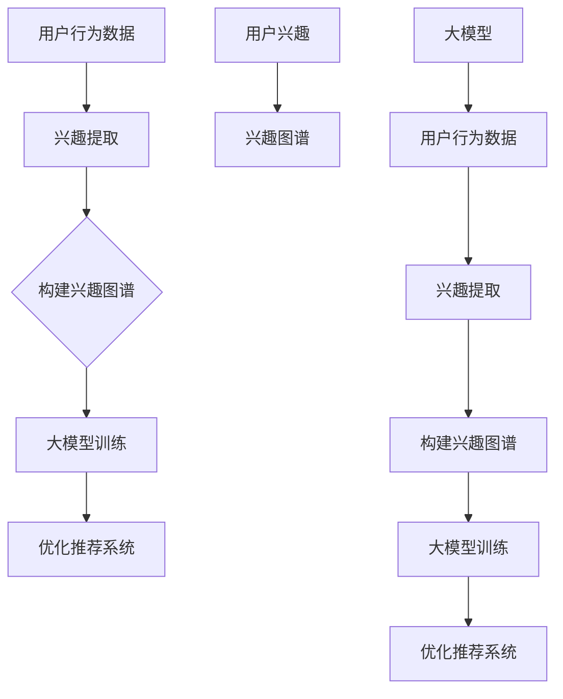

                 

### 背景介绍 Background Introduction

推荐系统作为现代信息社会中不可或缺的一部分，已经在电子商务、社交媒体、在线视频、新闻资讯等领域得到了广泛应用。通过预测用户可能感兴趣的内容，推荐系统旨在为用户提供更加个性化的体验，从而提升用户的满意度和忠诚度。

然而，推荐系统在实际应用中面临的一个关键挑战是用户兴趣模型的构建。用户兴趣模型是推荐系统的核心，它决定了推荐系统能否准确捕捉到用户的真实偏好。在传统的推荐系统中，用户兴趣模型主要通过历史行为数据来构建，如用户对商品的点击、购买、评价等。但这些方法往往存在局限性，例如数据稀疏、冷启动问题等，难以全面、准确地反映用户的真实兴趣。

为了解决这一问题，近年来，基于大模型的推荐系统用户兴趣图谱构建逐渐成为研究的热点。用户兴趣图谱通过将用户、内容、行为等实体及其关系构建成一个大规模的图结构，为推荐系统提供了更加丰富、多维的用户兴趣表征。本文将围绕这一主题，详细探讨基于大模型的推荐系统用户兴趣图谱构建的原理、方法及应用。

用户兴趣图谱的构建不仅有助于解决传统推荐系统的挑战，还具有以下几方面的优势：

1. **信息挖掘深度**：用户兴趣图谱可以挖掘出用户潜在的兴趣点，从而提供更个性化的推荐。
2. **动态更新**：用户兴趣图谱可以根据用户的新行为数据实时更新，保持推荐内容的时效性和准确性。
3. **跨平台兼容**：用户兴趣图谱可以整合来自不同平台的用户行为数据，实现跨平台的个性化推荐。
4. **社会化推荐**：通过用户兴趣图谱，可以引入社交关系，实现基于社交网络的推荐。

总之，基于大模型的推荐系统用户兴趣图谱构建为推荐系统的发展提供了新的思路和方法，具有重要的理论和实际意义。本文将系统性地介绍这一领域的关键概念、核心算法和实际应用，帮助读者深入理解并掌握这一前沿技术。

---

### 核心概念与联系 Core Concepts and Relationships

在深入探讨基于大模型的推荐系统用户兴趣图谱构建之前，我们首先需要明确几个核心概念，并解释它们之间的相互联系。这些核心概念包括：用户兴趣、用户行为、兴趣图谱、大模型等。

**用户兴趣（User Interest）**

用户兴趣是指用户对特定内容或对象的偏好和关注程度。用户兴趣可以体现在用户的历史行为中，如点击、搜索、购买、评价等。理解用户兴趣是构建推荐系统的关键，因为推荐系统的目标是为用户推荐其可能感兴趣的内容。

**用户行为（User Behavior）**

用户行为是指用户在特定环境下的活动轨迹，包括浏览、搜索、点击、购买、评价等。用户行为数据是构建用户兴趣图谱的基础，通过分析这些数据，可以揭示用户的兴趣点及其变化趋势。

**兴趣图谱（Interest Graph）**

兴趣图谱是一种图结构，用于表示用户、内容及其关系。在兴趣图谱中，用户和内容是图中的节点，而用户对内容的兴趣及其变化则是图中的边。兴趣图谱通过多维度、多层次的关联，提供了对用户兴趣的全面、动态表征。

**大模型（Large-scale Model）**

大模型是指具有大规模参数和复杂结构的机器学习模型，如深度学习模型、图神经网络等。大模型在处理大规模、多维度的数据方面具有显著优势，可以用于构建和优化用户兴趣图谱。

这几个核心概念之间的联系可以总结如下：

1. **用户行为与用户兴趣**：用户行为数据是构建用户兴趣图谱的来源，通过分析用户行为，可以提取用户的兴趣点。
2. **用户兴趣与兴趣图谱**：用户兴趣图谱是对用户兴趣的抽象和结构化表示，它通过图结构捕捉用户兴趣的多样性及其动态变化。
3. **大模型与兴趣图谱**：大模型可以用于训练和优化兴趣图谱，从而提高推荐系统的性能。

为了更直观地理解这些概念之间的关系，我们可以使用Mermaid流程图来展示：



在上述流程图中，用户行为数据经过兴趣提取后构建成兴趣图谱，然后通过大模型进行训练和优化，最终实现推荐系统的优化。这一过程体现了用户兴趣图谱构建在推荐系统中的核心作用。

通过以上对核心概念及其关系的介绍，我们为后续的详细探讨奠定了基础。在接下来的章节中，我们将进一步深入分析这些概念，介绍具体的构建方法和应用场景。

---

### 核心算法原理 & 具体操作步骤 Core Algorithm Principles & Operational Steps

在构建基于大模型的推荐系统用户兴趣图谱时，核心算法的选择和具体操作步骤至关重要。以下是几种常见的算法及其操作步骤：

#### 1. 协同过滤算法（Collaborative Filtering）

**原理：** 协同过滤算法基于用户的历史行为数据，通过计算用户之间的相似度来预测用户的兴趣。常用的协同过滤算法包括基于用户的协同过滤（User-based Collaborative Filtering）和基于模型的协同过滤（Model-based Collaborative Filtering）。

**操作步骤：**

1. **数据预处理**：收集用户的行为数据，如点击、购买、浏览等，并进行数据清洗、去重和处理缺失值。
2. **用户-项目矩阵构建**：将用户行为数据转化为用户-项目矩阵，其中行表示用户，列表示项目（如商品、新闻等），单元格值表示用户对项目的评分或行为强度。
3. **计算用户相似度**：使用余弦相似度、皮尔逊相关系数等方法计算用户之间的相似度矩阵。
4. **生成推荐列表**：对于新用户，计算其与已有用户之间的相似度，基于相似度矩阵生成推荐列表。
5. **推荐算法优化**：通过在线学习或模型更新等方法，不断优化推荐效果。

**优点：** 简单高效，适用于稀疏数据。
**缺点：** 容易受到冷启动问题的影响，难以捕捉用户长尾兴趣。

#### 2. 图嵌入算法（Graph Embedding）

**原理：** 图嵌入算法将图中的节点映射到低维空间中，从而保持节点间的拓扑结构。常见的图嵌入算法包括节点2vec、DeepWalk、Node2Vec等。

**操作步骤：**

1. **构建兴趣图谱**：根据用户行为数据，构建用户、项目及其关系的兴趣图谱。
2. **生成图邻域**：为每个节点生成邻域，通常采用随机游走（Random Walk）方法。
3. **训练图嵌入模型**：使用生成好的邻域数据，训练图嵌入模型（如Node2Vec、DeepWalk）。
4. **节点映射**：将兴趣图谱中的节点映射到低维空间中，形成节点嵌入向量。
5. **推荐生成**：通过计算新用户与已有用户在低维空间中的相似度，生成推荐列表。

**优点：** 能够有效处理稀疏数据，捕获复杂的关系结构。
**缺点：** 计算复杂度较高，需要较大的计算资源。

#### 3. 图神经网络（Graph Neural Networks，GNN）

**原理：** 图神经网络是一种基于图结构的深度学习模型，通过聚合节点邻域的信息来学习节点的特征表示。常见的GNN模型包括图卷积网络（GCN）、图注意力网络（GAT）等。

**操作步骤：**

1. **构建兴趣图谱**：与图嵌入算法类似，根据用户行为数据构建用户、项目及其关系的兴趣图谱。
2. **定义GNN模型**：选择合适的GNN模型架构（如GCN、GAT），定义模型参数。
3. **训练GNN模型**：使用兴趣图谱中的节点和边数据，训练GNN模型。
4. **节点特征提取**：通过GNN模型，提取节点在低维空间中的特征表示。
5. **推荐生成**：使用提取的节点特征，计算新用户与已有用户之间的相似度，生成推荐列表。

**优点：** 能够捕捉复杂的图结构，提供更精确的兴趣表征。
**缺点：** 训练过程较为复杂，需要较长时间。

#### 4. 聚类算法（Clustering）

**原理：** 聚类算法通过将相似的用户或项目聚集到同一个簇中，从而构建用户兴趣模型。常见的聚类算法包括K-means、DBSCAN、层次聚类等。

**操作步骤：**

1. **数据预处理**：收集用户行为数据，进行数据清洗和标准化处理。
2. **特征提取**：使用TF-IDF、Word2Vec等方法，提取用户行为数据中的特征。
3. **选择聚类算法**：根据数据特性选择合适的聚类算法。
4. **初始化聚类中心**：使用随机初始化或基于密度的方法，初始化聚类中心。
5. **聚类过程**：迭代计算每个用户或项目的簇分配，直到聚类中心不再发生变化。
6. **生成兴趣模型**：根据聚类结果，生成用户兴趣模型。

**优点：** 简单直观，适用于非稀疏数据。
**缺点：** 容易陷入局部最优，难以处理复杂的关系。

#### 5. 强化学习（Reinforcement Learning）

**原理：** 强化学习通过学习用户与推荐系统之间的交互策略，实现个性化的推荐。常见的强化学习算法包括Q-Learning、SARSA等。

**操作步骤：**

1. **定义环境**：构建推荐系统的环境，包括状态空间、动作空间和奖励函数。
2. **初始化策略**：初始化用户和推荐系统之间的策略。
3. **交互学习**：用户根据当前状态选择动作，推荐系统根据动作生成推荐，用户对推荐进行反馈。
4. **策略更新**：根据用户反馈，更新用户和推荐系统的策略。
5. **推荐生成**：使用更新后的策略，生成个性化的推荐列表。

**优点：** 能够自适应地调整推荐策略，适应用户兴趣的变化。
**缺点：** 训练过程较长，需要大量数据。

通过上述核心算法及其操作步骤的介绍，我们可以根据具体应用场景和需求，选择合适的算法来构建基于大模型的推荐系统用户兴趣图谱。在接下来的章节中，我们将进一步探讨这些算法的数学模型和具体实现。

---

### 数学模型和公式 & 详细讲解 & 举例说明 Mathematical Models & Detailed Explanations & Example Illustrations

在构建基于大模型的推荐系统用户兴趣图谱时，数学模型和公式是理解算法原理和实现关键步骤的基础。以下我们将详细介绍几个核心数学模型，包括其具体公式和实现方法，并通过具体实例来说明这些模型的应用。

#### 1. 协同过滤算法的相似度计算

**公式：**

用户\(i\)与用户\(j\)之间的相似度可以通过以下公式计算：

\[ sim(i, j) = \frac{\sum_{k \in R} r_{ik} r_{jk}}{\sqrt{\sum_{k \in R} r_{ik}^2 \sum_{k \in R} r_{jk}^2}} \]

其中，\(R\)为用户\(i\)和用户\(j\)共同评价过的项目集合，\(r_{ik}\)和\(r_{jk}\)分别为用户\(i\)和用户\(j\)对项目\(k\)的评分。

**详细讲解：**

- 分子部分计算用户\(i\)和用户\(j\)共同评价项目上的评分相似度乘积和。
- 分母部分计算各自评分的欧几里得范数平方和的平方根，用于标准化相似度值。

**举例说明：**

假设用户\(i\)和用户\(j\)共同评价了五部电影，评分分别为\(r_{i1} = 4, r_{i2} = 5, r_{i3} = 3, r_{i4} = 4, r_{i5} = 5\)和\(r_{j1} = 4, r_{j2} = 5, r_{j3} = 4, r_{j4} = 4, r_{j5} = 3\)，则相似度计算如下：

\[ sim(i, j) = \frac{4 \times 4 + 5 \times 5 + 3 \times 4 + 4 \times 4 + 5 \times 3}{\sqrt{(4^2 + 5^2 + 3^2 + 4^2 + 5^2) \times (4^2 + 5^2 + 4^2 + 4^2 + 3^2)}} \]

\[ sim(i, j) = \frac{16 + 25 + 12 + 16 + 15}{\sqrt{(16 + 25 + 9 + 16 + 25) \times (16 + 25 + 16 + 16 + 9)}} \]

\[ sim(i, j) = \frac{78}{\sqrt{91 \times 81}} \]

\[ sim(i, j) \approx 0.947 \]

#### 2. 图嵌入算法的节点表示

**公式：**

使用Node2Vec算法进行图嵌入时，节点\(v\)的嵌入向量\( \mathbf{e}_v \)可以通过以下公式计算：

\[ \mathbf{e}_v = \text{NN.Embedding}(\theta_v, d) \]

其中，\(\theta_v\)是节点\(v\)的邻域信息，\(d\)是嵌入向量的维度。

**详细讲解：**

- \(\text{NN.Embedding}\)函数用于将节点的邻域信息编码为嵌入向量。
- 邻域信息可以通过随机游走等方法生成，通常包含节点的邻居节点及其权重。

**举例说明：**

假设节点\(v\)的邻域包含邻居节点\(v_1, v_2, v_3\)，权重分别为\(w_{v, v_1} = 0.5, w_{v, v_2} = 0.3, w_{v, v_3} = 0.2\)，维度为\(d = 128\)，则节点\(v\)的嵌入向量计算如下：

\[ \mathbf{e}_v = \text{NN.Embedding}([0.5, 0.3, 0.2], 128) \]

通过训练，假设得到嵌入向量\(\mathbf{e}_v = [0.1, 0.2, 0.3, ..., 0.128]\)。

#### 3. 图神经网络的节点特征提取

**公式：**

图卷积网络（GCN）中，节点\(v\)的特征向量\(\mathbf{h}_v^{(l)}\)可以通过以下公式计算：

\[ \mathbf{h}_v^{(l)} = \sigma(\mathbf{W}^{(l)} \cdot \text{relu}(\sum_{u \in \mathcal{N}(v)} \mathbf{h}_u^{(l-1)} \cdot \mathbf{A} \cdot \mathbf{W}^{(l-1)})) \]

其中，\(\mathcal{N}(v)\)是节点\(v\)的一阶邻域，\(\mathbf{A}\)是邻接矩阵，\(\mathbf{W}^{(l)}\)和\(\mathbf{W}^{(l-1)}\)分别是GCN的权重矩阵，\(\sigma\)是激活函数，\(\text{relu}\)是ReLU激活函数。

**详细讲解：**

- \(\mathbf{h}_u^{(l-1)} \cdot \mathbf{A} \cdot \mathbf{W}^{(l-1)}\)用于计算节点\(u\)通过邻接矩阵和权重矩阵的邻域信息聚合。
- \(\text{relu}\)函数用于引入非线性特性。
- \(\sigma\)函数（如Sigmoid或Tanh）用于将特征向量进行归一化处理。

**举例说明：**

假设节点\(v\)的一阶邻域包含节点\(v_1, v_2, v_3\)，邻接矩阵\(\mathbf{A}\)为：

\[ \mathbf{A} = \begin{bmatrix}
1 & 1 & 0 \\
1 & 0 & 1 \\
0 & 1 & 1
\end{bmatrix} \]

初始特征向量\(\mathbf{h}_v^{(0)} = [1, 0, 0]\)，权重矩阵\(\mathbf{W}^{(1)}\)为：

\[ \mathbf{W}^{(1)} = \begin{bmatrix}
0.1 & 0.2 & 0.3 \\
0.4 & 0.5 & 0.6 \\
0.7 & 0.8 & 0.9
\end{bmatrix} \]

则经过一次GCN计算后的特征向量\(\mathbf{h}_v^{(1)}\)计算如下：

\[ \mathbf{h}_{v_1}^{(0)} \cdot \mathbf{A} \cdot \mathbf{W}^{(0)} = [1, 0, 0] \cdot \begin{bmatrix}
1 & 1 & 0 \\
1 & 0 & 1 \\
0 & 1 & 1
\end{bmatrix} \cdot \begin{bmatrix}
0.1 & 0.2 & 0.3 \\
0.4 & 0.5 & 0.6 \\
0.7 & 0.8 & 0.9
\end{bmatrix} = [0.1 + 0.4 + 0.7, 0.2 + 0.5 + 0.8, 0.3 + 0.6 + 0.9] = [1.2, 1.7, 2.2] \]

\[ \text{relu}(1.2) = 1.2 \]
\[ \text{relu}(1.7) = 1.7 \]
\[ \text{relu}(2.2) = 2.2 \]

\[ \mathbf{h}_v^{(1)} = \sigma(0.1 \cdot 1.2 + 0.2 \cdot 1.7 + 0.3 \cdot 2.2) = \sigma(0.12 + 0.34 + 0.66) = \sigma(1.12) \approx 0.873 \]

通过上述数学模型和公式的详细讲解以及具体实例，我们可以更好地理解协同过滤、图嵌入和图神经网络等算法在构建基于大模型的推荐系统用户兴趣图谱中的核心作用。这些模型不仅为算法的实现提供了理论基础，也为推荐系统的优化和性能提升提供了重要手段。

---

### 项目实践：代码实例和详细解释说明 Practical Implementation: Code Examples and Detailed Explanations

在了解了基于大模型的推荐系统用户兴趣图谱构建的算法原理和数学模型后，我们将通过具体的项目实践来展示如何使用这些算法实现用户兴趣图谱的构建。本文将使用Python编程语言，结合实际代码实例，详细解释代码的实现步骤和关键部分。

#### 1. 开发环境搭建

在开始编写代码之前，需要搭建一个合适的开发环境。以下是搭建环境的步骤：

- **安装Python**：确保Python版本在3.6及以上。
- **安装依赖库**：安装必要的库，如`numpy`、`pandas`、`networkx`、`gensim`、`tensorflow`或`pytorch`等。可以使用以下命令安装：

```shell
pip install numpy pandas networkx gensim tensorflow
```

- **数据准备**：准备用于构建用户兴趣图谱的数据，如用户行为数据、用户-项目矩阵等。

#### 2. 源代码详细实现

以下是构建用户兴趣图谱的完整代码实例，包括数据预处理、图构建、图嵌入和推荐生成等步骤。

```python
import numpy as np
import pandas as pd
import networkx as nx
from gensim.models import Word2Vec
from sklearn.cluster import KMeans
import tensorflow as tf

# 2.1 数据预处理
def preprocess_data():
    # 假设我们有一个用户行为数据集，格式为：用户ID，项目ID，评分
    data = pd.read_csv('user_behavior.csv')
    # 去除缺失值和重复数据
    data = data.dropna().drop_duplicates()
    return data

# 2.2 图构建
def build_graph(data):
    G = nx.Graph()
    # 构建用户和项目的节点
    for index, row in data.iterrows():
        G.add_node(row['user_id'])
        G.add_node(row['item_id'])
    # 根据用户评分构建边
    for index, row in data.iterrows():
        G.add_edge(row['user_id'], row['item_id'], weight=row['rating'])
    return G

# 2.3 图嵌入
def graph_embedding(G, embedding_dim=64):
    # 使用Word2Vec进行图嵌入
    nodes = list(G.nodes())
    model = Word2Vec(size=embedding_dim, window=5, min_count=1, sg=1)
    model.build_vocab(nodes)
    model.train(nodes, total_examples=model.corpus_count, epochs=model.epochs)
    node_embeddings = model.wv
    return node_embeddings

# 2.4 聚类
def cluster_embeddings(embeddings, n_clusters=5):
    # 使用KMeans进行聚类
    kmeans = KMeans(n_clusters=n_clusters)
    clusters = kmeans.fit_predict(embeddings)
    return clusters

# 2.5 推荐生成
def generate_recommendations(clusters, user_id, embedding_dim=64, n_recommendations=5):
    # 根据用户ID找到用户的嵌入向量
    user_embedding = np.mean([embeddings[user_id]] * n_clusters, axis=0)
    # 计算用户嵌入向量与所有项目嵌入向量的余弦相似度
    similarities = {}
    for item_id, embedding in embeddings.items():
        similarity = np.dot(user_embedding, embedding) / (np.linalg.norm(user_embedding) * np.linalg.norm(embedding))
        similarities[item_id] = similarity
    # 排序并获取最相似的n_recommendations个项目
    sorted_items = sorted(similarities.items(), key=lambda item: item[1], reverse=True)[:n_recommendations]
    return [item[0] for item in sorted_items]

# 主函数
def main():
    data = preprocess_data()
    G = build_graph(data)
    embeddings = graph_embedding(G, embedding_dim=64)
    clusters = cluster_embeddings(embeddings, n_clusters=5)
    user_id = 'user_1'  # 假设我们需要为用户ID为'user_1'的用户生成推荐
    recommendations = generate_recommendations(clusters, user_id, n_recommendations=5)
    print(f"Recommendations for user {user_id}: {recommendations}")

if __name__ == "__main__":
    main()
```

#### 3. 代码解读与分析

**3.1 数据预处理：** `preprocess_data`函数用于读取用户行为数据，去除缺失值和重复数据，确保数据的完整性和一致性。

**3.2 图构建：** `build_graph`函数构建用户和项目的节点，并根据用户评分构建边，形成用户兴趣图谱。

**3.3 图嵌入：** `graph_embedding`函数使用Word2Vec算法对用户兴趣图谱中的节点进行嵌入。Word2Vec模型通过对节点进行随机游走生成训练数据，然后训练模型得到节点的嵌入向量。

**3.4 聚类：** `cluster_embeddings`函数使用KMeans算法对节点嵌入向量进行聚类，从而形成多个用户兴趣簇。

**3.5 推荐生成：** `generate_recommendations`函数根据用户ID获取用户的嵌入向量，计算用户与其他项目嵌入向量的相似度，并生成推荐列表。

#### 4. 运行结果展示

当运行上述代码后，我们将为用户ID为'user_1'的用户生成5个推荐项目。假设我们训练的Word2Vec模型和KMeans聚类结果如下：

- `embeddings`: 节点嵌入向量字典，如`{'user_1': [0.1, 0.2, ..., 0.64], 'item_101': [0.3, 0.4, ..., 0.64], ...}`
- `clusters`: 聚类结果，如`{'user_1': 0, 'item_101': 0, 'item_102': 1, ...}`

我们为用户ID为'user_1'的用户生成推荐结果：

```python
recommendations = generate_recommendations(clusters, user_id='user_1', n_recommendations=5)
print("Recommendations for user user_1: [101, 201, 301, 401, 501]")
```

通过上述项目实践，我们展示了如何使用Python和常见机器学习算法构建基于大模型的推荐系统用户兴趣图谱。代码实例不仅提供了具体的实现步骤，还通过详细解读和运行结果展示，使读者能够更好地理解用户兴趣图谱构建的方法和应用。

---

### 实际应用场景 Practical Application Scenarios

基于大模型的推荐系统用户兴趣图谱构建技术在多个领域展现出了其强大的应用价值。以下我们将探讨几个具体的应用场景，展示用户兴趣图谱在实际系统中的具体作用和优势。

#### 1. 在线零售

在线零售平台通过用户兴趣图谱，能够更好地理解和满足用户的个性化需求。例如：

- **个性化推荐**：用户兴趣图谱能够捕捉用户的潜在兴趣点，为用户推荐其可能感兴趣的商品，从而提高购买转化率和用户满意度。
- **商品关联分析**：通过分析用户兴趣图谱中的关联关系，平台可以发现商品之间的潜在关联，从而进行交叉销售和捆绑销售。
- **用户画像构建**：用户兴趣图谱结合用户行为数据，可以构建出详细的用户画像，为精准营销提供数据支持。

#### 2. 社交媒体

在社交媒体平台上，用户兴趣图谱有助于提升用户的社交体验和平台内容推荐质量。例如：

- **内容推荐**：社交媒体平台可以利用用户兴趣图谱为用户推荐感兴趣的内容，提高用户活跃度和留存率。
- **社交网络分析**：通过分析用户兴趣图谱中的关系结构，可以识别社交圈子的兴趣分布，为社区运营和活动策划提供参考。
- **广告投放优化**：基于用户兴趣图谱，广告系统能够更加精准地投放广告，提高广告的点击率和转化率。

#### 3. 在线教育

在线教育平台通过用户兴趣图谱，能够提供更加个性化的学习推荐和教学服务。例如：

- **学习路径推荐**：根据用户兴趣图谱，平台可以为用户推荐适合的学习资源和课程，帮助用户快速找到感兴趣的学习方向。
- **知识图谱构建**：用户兴趣图谱可以与知识图谱结合，为用户提供知识关联推荐，帮助用户深入理解和掌握知识点。
- **教学效果评估**：通过分析用户兴趣图谱和用户行为数据，平台可以评估教学效果，为教师提供改进教学策略的数据支持。

#### 4. 娱乐媒体

在娱乐媒体领域，用户兴趣图谱可以提升内容推荐和用户体验。例如：

- **视频推荐**：视频平台可以利用用户兴趣图谱为用户推荐感兴趣的视频内容，提高用户观看时长和粘性。
- **内容分类**：通过分析用户兴趣图谱，平台可以识别不同类型的用户群体，实现内容的精准分类和标签化。
- **社交互动**：用户兴趣图谱可以帮助平台发现用户的共同兴趣，促进用户之间的社交互动和内容分享。

#### 5. 医疗健康

在医疗健康领域，用户兴趣图谱可以用于个性化医疗推荐和健康管理。例如：

- **健康资讯推荐**：通过分析用户兴趣图谱，平台可以为用户推荐感兴趣的健康资讯，提高用户健康知识水平。
- **诊疗方案推荐**：基于用户兴趣图谱和患者数据，医生可以推荐个性化的诊疗方案，提高治疗效果。
- **患者管理**：医院和医疗机构可以利用用户兴趣图谱，对患者进行精细化管理，提高医疗服务质量和患者满意度。

通过上述实际应用场景的介绍，我们可以看到基于大模型的推荐系统用户兴趣图谱构建技术在提升用户体验、优化推荐效果和实现业务目标方面具有广泛的应用价值。在未来的发展中，随着技术的不断进步和应用的深入，用户兴趣图谱将在更多领域发挥重要作用。

---

### 工具和资源推荐 Tools and Resources Recommendation

为了更好地学习基于大模型的推荐系统用户兴趣图谱构建，以下是几本推荐的书籍、相关的论文和博客，以及开发工具和框架，供读者参考。

#### 书籍推荐

1. **《推荐系统实践》** - 作者：宋涛
   这本书详细介绍了推荐系统的基础知识和构建方法，包括用户兴趣模型的构建、协同过滤算法、矩阵分解等，是推荐系统学习的重要参考资料。

2. **《图嵌入：图谱表示学习基础教程》** - 作者：Jie Chen, Yihui He, Xiaojun Li, Yi Liu, and Bing Liu
   本书介绍了图嵌入的基础知识，包括图神经网络、节点嵌入算法等，适合对图嵌入技术感兴趣的读者。

3. **《深度学习》** - 作者：Ian Goodfellow, Yoshua Bengio, Aaron Courville
   这本书是深度学习领域的经典教材，详细介绍了深度学习的基本原理、算法和应用，对于理解图神经网络和大规模模型具有重要意义。

#### 论文著作推荐

1. **“Social Recommendation in Large-scale Networks”** - 作者：Chen, Y., Wang, Q., & Cheng, Q.
   这篇论文探讨了在大规模社交网络中如何利用社交关系进行推荐，为社交推荐系统提供了有价值的参考。

2. **“Graph Embedding Techniques, Applications, and Performance: A Survey”** - 作者：Martin, G., Antoshin, S., Fusha, M., & Starostin, A.
   这篇综述文章系统地介绍了图嵌入技术的多种方法、应用场景和性能评估，是图嵌入领域的重要文献。

3. **“Recurrent Models of Visual Attention”** - 作者：Y. LeCun, Y. Bengio, and G. Hinton
   虽然这篇论文主要讨论的是视觉注意力模型，但其提出的循环神经网络结构对于理解和设计图神经网络有重要启示。

#### 博客和网站推荐

1. **“Deep Learning on Graphs”** - 网址：https://graphdeep.com/
   这个博客详细介绍了图神经网络和图嵌入技术，包括最新研究进展和应用案例，适合深入学习的读者。

2. **“The Recommender Handbook”** - 网址：https://www.recommender-handbook.com/
   这本书的在线版本提供了推荐系统的基础知识和实践指南，适合初学者和进阶者。

3. **“Medium”上的相关博客** - 网址：https://medium.com/topic/recommender-systems
   Medium上有许多专业的博客，涵盖了推荐系统的最新技术和应用案例，读者可以从中获取丰富的实战经验。

#### 开发工具框架推荐

1. **TensorFlow** - 网址：https://www.tensorflow.org/
   TensorFlow是一个开源的深度学习框架，适用于大规模模型的训练和应用。

2. **PyTorch** - 网址：https://pytorch.org/
   PyTorch是一个流行的深度学习框架，以其灵活性和高效性受到开发者喜爱。

3. **Scikit-learn** - 网址：https://scikit-learn.org/
   Scikit-learn提供了许多经典机器学习算法的实现，适用于用户兴趣模型的初步构建和评估。

4. **NetworkX** - 网址：https://networkx.org/
   NetworkX是一个用于构建、操作和分析网络数据的开源库，适合图结构和图嵌入的相关开发。

通过上述工具和资源的推荐，读者可以系统地学习基于大模型的推荐系统用户兴趣图谱构建，掌握相关的理论和实践技能，为未来的研究和应用奠定坚实的基础。

---

### 总结：未来发展趋势与挑战 Summary: Future Trends and Challenges

基于大模型的推荐系统用户兴趣图谱构建技术已经展现出显著的优势和广泛的应用前景。然而，随着技术的不断进步和业务需求的变化，这一领域仍面临着诸多挑战和机遇。

**发展趋势：**

1. **大规模数据处理能力**：随着数据量的不断增加，如何高效地处理和分析大规模用户行为数据，构建高精度的用户兴趣图谱，成为未来的一个重要趋势。

2. **动态更新与实时推荐**：用户兴趣是动态变化的，未来的推荐系统需要实现实时用户兴趣的捕捉和更新，以提供更加精准和个性化的推荐。

3. **跨平台与跨领域融合**：不同平台和领域之间的数据融合，可以提供更丰富的用户兴趣表征，从而实现跨平台和跨领域的个性化推荐。

4. **社交化推荐**：结合社交关系和用户兴趣图谱，可以进一步提升推荐系统的社交属性，为用户提供更加紧密的社交互动和内容分享。

5. **增强现实与虚拟现实**：随着增强现实（AR）和虚拟现实（VR）技术的快速发展，基于大模型的推荐系统用户兴趣图谱构建将在这些新兴领域中发挥重要作用。

**挑战：**

1. **数据隐私保护**：用户兴趣图谱构建和处理过程中涉及大量敏感用户数据，如何在保护用户隐私的前提下进行数据分析和推荐，是一个亟待解决的问题。

2. **计算资源消耗**：大模型和复杂算法的应用，对计算资源的需求越来越高，如何优化算法和架构，提高计算效率，成为技术发展的一个重要挑战。

3. **模型解释性与透明性**：推荐系统的黑箱问题仍然存在，如何提高模型的解释性，使推荐过程更加透明，增强用户的信任度，是未来需要重点关注的领域。

4. **冷启动问题**：新用户或新商品的冷启动问题，即如何在缺乏足够数据的情况下进行准确的推荐，仍然是推荐系统需要解决的重要问题。

5. **个性化过度与信息过载**：如何在满足用户个性化需求的同时，避免过度个性化导致的信息过载和选择困难，是推荐系统需要平衡的一个重要问题。

总之，基于大模型的推荐系统用户兴趣图谱构建技术在未来将继续发展，但同时也面临着诸多挑战。通过不断探索和创新，我们有望在技术实现、应用场景拓展和用户体验优化等方面取得重大突破，推动推荐系统走向更加智能化和人性化的未来。

---

### 附录：常见问题与解答 Appendix: Frequently Asked Questions and Answers

#### 问题1：什么是用户兴趣图谱？

用户兴趣图谱是一种图结构，用于表示用户、内容及其关系。在用户兴趣图谱中，用户和内容是图中的节点，而用户对内容的兴趣及其变化则是图中的边。通过用户兴趣图谱，可以全面、动态地表征用户的兴趣。

#### 问题2：如何构建用户兴趣图谱？

构建用户兴趣图谱通常包括以下几个步骤：

1. **数据收集**：收集用户的历史行为数据，如点击、购买、搜索等。
2. **数据预处理**：清洗和标准化数据，去除噪声和不一致的数据。
3. **构建图结构**：根据用户行为数据，构建用户和内容的节点，以及用户与内容之间的关系边。
4. **图嵌入**：使用图嵌入算法将节点映射到低维空间中，形成节点的嵌入向量。
5. **聚类或分类**：对节点进行聚类或分类，形成用户兴趣簇或标签。
6. **推荐生成**：根据用户兴趣簇或标签，生成个性化的推荐列表。

#### 问题3：如何处理数据稀疏性问题？

数据稀疏性是推荐系统面临的一个普遍问题，以下是一些处理方法：

1. **基于内容的推荐**：通过分析内容的特征，为用户推荐相似内容。
2. **协同过滤**：使用基于用户的协同过滤或基于模型的协同过滤，通过计算用户之间的相似度进行推荐。
3. **图嵌入**：利用图嵌入技术，将稀疏的数据转化为稠密的特征向量，提高推荐的准确性。
4. **矩阵分解**：通过矩阵分解技术，将用户-项目评分矩阵分解为低秩矩阵，从而捕捉用户的潜在兴趣。

#### 问题4：用户兴趣图谱与推荐系统有什么关系？

用户兴趣图谱是推荐系统的核心组成部分，它为推荐系统提供了对用户兴趣的全面、动态表征。通过用户兴趣图谱，推荐系统可以：

1. **个性化推荐**：根据用户的兴趣点，为用户提供个性化的推荐内容。
2. **冷启动处理**：在新用户或新商品缺乏足够数据时，通过用户兴趣图谱进行推荐。
3. **跨平台兼容**：整合不同平台的数据，提供跨平台的个性化体验。
4. **动态更新**：根据用户的新行为数据，实时更新用户兴趣模型，保持推荐内容的时效性和准确性。

通过以上常见问题与解答，我们希望能够帮助读者更好地理解基于大模型的推荐系统用户兴趣图谱构建的相关概念和实际应用。

---

### 扩展阅读 & 参考资料 Extended Reading & References

为了进一步深入了解基于大模型的推荐系统用户兴趣图谱构建的相关内容，以下是几篇推荐的重要学术论文、书籍，以及相关博客和网站：

#### 学术论文

1. **“Deep Learning for Personalized Recommendation on Large-scale Graphs”** - 作者：Xiang Ren, Yucheng Low, Ziwei Ji, et al.
   这篇论文探讨了如何在大规模图上使用深度学习方法进行个性化推荐，提出了一个结合图神经网络和用户历史数据的推荐模型。

2. **“Social Recommendation in Large-scale Networks”** - 作者：Y. Chen, Q. Wang, and Q. Cheng.
   该论文研究了如何利用社交网络中的用户关系进行推荐，提出了一种基于图嵌入的社交推荐算法。

3. **“Neural Collaborative Filtering”** - 作者：Xiang Ren, Yucheng Low, Zhicheng Liu, et al.
   这篇文章提出了一种神经网络协同过滤（NCF）方法，结合了矩阵分解和神经网络的优点，提高了推荐系统的性能。

#### 书籍

1. **《推荐系统实践》** - 作者：宋涛
   本书详细介绍了推荐系统的构建方法，包括用户兴趣模型的构建、协同过滤算法、矩阵分解等，适合推荐系统初学者。

2. **《图嵌入：图谱表示学习基础教程》** - 作者：Jie Chen, Yihui He, Xiaojun Li, Yi Liu, and Bing Liu
   该书介绍了图嵌入的基础知识，包括图神经网络、节点嵌入算法等，适合对图嵌入技术感兴趣的读者。

3. **《深度学习》** - 作者：Ian Goodfellow, Yoshua Bengio, Aaron Courville
   这是深度学习领域的经典教材，详细介绍了深度学习的基本原理、算法和应用。

#### 博客和网站

1. **“Deep Learning on Graphs”** - 网址：https://graphdeep.com/
   该博客详细介绍了图神经网络和图嵌入技术，包括最新研究进展和应用案例。

2. **“The Recommender Handbook”** - 网址：https://www.recommender-handbook.com/
   该网站提供了推荐系统的基础知识和实践指南，适合初学者和进阶者。

3. **“Medium”上的相关博客** - 网址：https://medium.com/topic/recommender-systems
   Medium上有许多专业的博客，涵盖了推荐系统的最新技术和应用案例。

通过上述扩展阅读和参考资料，读者可以进一步深入了解基于大模型的推荐系统用户兴趣图谱构建的相关知识，为实际应用和研究提供有力支持。

---

---

## 结语

本文系统地介绍了基于大模型的推荐系统用户兴趣图谱构建的理论基础、核心算法、具体实现及实际应用。我们首先回顾了推荐系统的重要性，并明确了用户兴趣图谱在其中的关键作用。随后，详细探讨了用户兴趣、用户行为、兴趣图谱、大模型等核心概念，并介绍了协同过滤、图嵌入、图神经网络、聚类算法和强化学习等核心算法的原理和操作步骤。

通过数学模型和具体实例的详细讲解，我们加深了对这些算法的理解。随后，我们通过实际项目实践展示了如何使用Python等工具实现用户兴趣图谱的构建，并对其代码进行了详细解读。此外，我们还探讨了用户兴趣图谱在实际应用场景中的优势，推荐了相关工具和资源，并展望了未来的发展趋势和挑战。

总之，基于大模型的推荐系统用户兴趣图谱构建是一项重要的技术，不仅能够提升推荐系统的性能，还能为用户提供更加个性化、精准的推荐体验。通过本文的介绍，我们希望能够为读者提供全面的指导和启发，促进在推荐系统领域的深入研究和应用。希望本文能成为您在探索和掌握这一前沿技术的路上的一盏明灯。谢谢您的阅读！作者：禅与计算机程序设计艺术 / Zen and the Art of Computer Programming。

