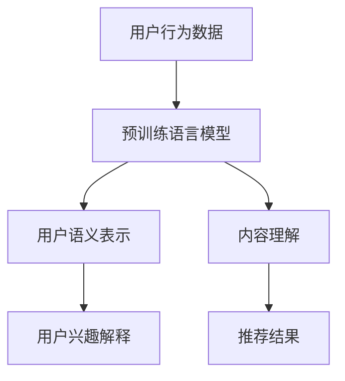

                 

### 1. 背景介绍

随着互联网的普及和信息量的爆炸性增长，推荐系统已成为提高用户体验和增加商业价值的关键技术之一。传统的基于内容或协同过滤的推荐系统在处理大量用户数据和提高推荐精度方面表现出了一定的局限性。而基于大模型的推荐系统，尤其是基于预训练语言模型（如GPT、BERT等）的推荐系统，凭借其强大的语义理解和泛化能力，逐渐成为研究热点。

用户兴趣解释是推荐系统中的一个重要问题。在用户接受到推荐结果后，了解推荐系统为何推荐这些内容，有助于增强用户对系统的信任和满意度。然而，现有的大模型推荐系统在提供用户兴趣解释时，往往缺乏透明度和可解释性，使得用户难以理解推荐背后的逻辑。因此，本文旨在探讨基于大模型的推荐系统用户兴趣解释的方法，以提升系统的可解释性和用户体验。

首先，我们将介绍大模型推荐系统的基本原理和架构，包括预训练语言模型和微调技巧。接着，我们将详细阐述用户兴趣解释的概念和重要性。在此基础上，我们将分析现有大模型推荐系统在用户兴趣解释方面的局限性，并提出相应的改进方案。最后，我们将通过具体的项目实践，展示如何实现基于大模型推荐系统的用户兴趣解释。

本文的结构如下：

- **第1部分**：背景介绍，阐述推荐系统用户兴趣解释的背景和重要性。
- **第2部分**：核心概念与联系，介绍大模型推荐系统的原理和架构。
- **第3部分**：核心算法原理 & 具体操作步骤，讲解用户兴趣解释的方法和技术。
- **第4部分**：数学模型和公式 & 详细讲解 & 举例说明，阐述大模型推荐系统中的数学模型和公式。
- **第5部分**：项目实践：代码实例和详细解释说明，展示如何在实际项目中实现用户兴趣解释。
- **第6部分**：实际应用场景，探讨基于大模型推荐系统的用户兴趣解释在不同领域的应用。
- **第7部分**：工具和资源推荐，推荐相关学习资源和开发工具。
- **第8部分**：总结：未来发展趋势与挑战，总结本文的主要结论和未来研究方向。
- **第9部分**：附录：常见问题与解答，回答读者可能遇到的问题。
- **第10部分**：扩展阅读 & 参考资料，提供进一步学习的资源和参考文献。

通过本文的逐步分析推理，我们将深入了解基于大模型的推荐系统用户兴趣解释，为推荐系统的优化和用户体验提升提供新的思路和方法。

### 2. 核心概念与联系

要理解基于大模型的推荐系统用户兴趣解释，我们首先需要了解大模型推荐系统的基本原理和架构，包括预训练语言模型和微调技巧，然后深入探讨用户兴趣解释的概念和重要性。

#### 大模型推荐系统的基本原理和架构

大模型推荐系统主要基于深度学习和自然语言处理（NLP）技术。当前，预训练语言模型（如GPT、BERT等）在NLP任务中取得了显著的成果。这些模型通过在大规模语料库上进行预训练，获得了对自然语言的深刻理解和强大的语义表示能力。具体来说，预训练语言模型可以分为两个阶段：

1. **预训练阶段**：
   - **语言模型**：模型在大规模语料库上学习自然语言统计特征，如词汇的分布、语法结构等。这一阶段的目标是建立一个能够准确预测下一个词汇的模型。
   - **上下文表示**：通过掩码语言模型（Masked Language Model, MLM）等技术，模型学习理解词汇在上下文中的含义，从而获得对上下文信息的捕捉能力。

2. **微调阶段**：
   - **任务特定数据**：将预训练语言模型应用于特定推荐任务，如用户兴趣建模、内容分类等。在这一阶段，模型会根据任务特定的数据进行微调，以适应具体的应用场景。
   - **多任务学习**：通过多任务学习（Multi-Task Learning, MTL）技术，模型可以在多个任务上共享知识，提高模型在不同任务上的表现。

#### 用户兴趣解释的概念和重要性

用户兴趣解释是指解释推荐系统如何推断和预测用户的兴趣，并基于这些预测给出推荐。用户兴趣解释的重要性主要体现在以下几个方面：

1. **增强用户信任**：
   - 当用户理解推荐系统是如何推断他们的兴趣时，会更有信心接受和信任推荐结果。

2. **提升用户体验**：
   - 用户可以更好地理解为什么系统推荐了这些内容，从而增加用户满意度和互动性。

3. **优化推荐效果**：
   - 通过分析用户兴趣解释，可以发现推荐系统中的问题和不足，从而进行针对性的优化。

#### 大模型推荐系统与用户兴趣解释的联系

大模型推荐系统和用户兴趣解释之间存在紧密的联系。预训练语言模型在用户兴趣建模和内容理解方面具有显著优势，而用户兴趣解释则依赖于模型对用户行为数据的理解和分析。具体来说：

1. **用户行为数据**：
   - 推荐系统通过收集和分析用户的行为数据（如浏览历史、搜索记录、点击行为等），来推断用户的兴趣和偏好。

2. **语义表示**：
   - 预训练语言模型能够将用户行为数据转换为高维语义表示，从而更好地捕捉用户的兴趣。

3. **解释生成**：
   - 通过分析模型生成的语义表示，推荐系统可以生成用户兴趣解释，如“因为您喜欢阅读科幻小说，我们推荐了这篇文章”。

#### Mermaid 流程图

为了更清晰地展示大模型推荐系统和用户兴趣解释之间的联系，我们可以使用Mermaid绘制一个流程图：



- **用户行为数据**：推荐系统收集的用户行为数据，如浏览历史、搜索记录等。
- **预训练语言模型**：用于处理用户行为数据，生成用户语义表示。
- **用户语义表示**：预训练语言模型对用户行为数据进行语义表示，捕捉用户的兴趣。
- **用户兴趣解释**：基于用户语义表示，生成对用户兴趣的解释。
- **内容理解**：预训练语言模型对推荐内容进行理解，以便生成更相关的推荐结果。
- **推荐结果**：基于用户兴趣解释和内容理解，推荐系统生成推荐结果。

通过上述分析，我们可以看到，大模型推荐系统和用户兴趣解释在数据收集、处理和解释方面具有密切的联系。接下来，我们将进一步探讨大模型推荐系统的核心算法原理和具体操作步骤，以深入理解用户兴趣解释的实现方法。

### 3. 核心算法原理 & 具体操作步骤

#### 大模型推荐系统的核心算法原理

大模型推荐系统的核心算法主要基于预训练语言模型，如GPT、BERT等。这些模型通过在大规模语料库上进行预训练，获得了对自然语言的深刻理解和强大的语义表示能力。以下是预训练语言模型的主要原理：

1. **语言模型**：
   - 语言模型通过学习自然语言中的统计规律，能够预测下一个单词的概率分布。这一阶段的目标是建立一个能够准确预测下一个词汇的模型。

2. **上下文表示**：
   - 通过掩码语言模型（Masked Language Model, MLM）等技术，语言模型学习理解词汇在上下文中的含义，从而获得对上下文信息的捕捉能力。

3. **预训练技术**：
   - 预训练技术包括大规模无监督学习、多任务学习、知识蒸馏等。这些技术使模型在大规模数据上自我学习和优化，从而提高模型在特定任务上的表现。

#### 用户兴趣解释的具体操作步骤

用户兴趣解释的实现可以分为以下几个步骤：

1. **数据收集**：
   - 收集用户行为数据，如浏览历史、搜索记录、点击行为等。这些数据用于推断用户的兴趣和偏好。

2. **数据处理**：
   - 对用户行为数据进行清洗和预处理，将其转换为模型可以处理的格式。例如，将用户行为数据转换为文本格式，使用词嵌入技术将其转换为高维向量。

3. **模型训练**：
   - 使用预训练语言模型（如BERT）对用户行为数据集进行训练，生成用户语义表示。这一步骤需要大量的计算资源和时间。

4. **用户兴趣建模**：
   - 基于用户语义表示，建立用户兴趣模型。用户兴趣模型可以捕捉用户的长期兴趣和短期兴趣变化。

5. **推荐生成**：
   - 使用用户兴趣模型和内容表示，生成推荐结果。推荐结果可以基于用户兴趣的匹配度进行排序。

6. **解释生成**：
   - 分析用户兴趣模型和推荐结果，生成用户兴趣解释。解释可以是自然语言文本，也可以是图表和可视化形式。

#### 实现用户兴趣解释的关键技术

1. **多模态数据融合**：
   - 用户行为数据可以是多种类型的，如文本、图像、音频等。多模态数据融合技术可以将不同类型的数据进行整合，提高用户兴趣解释的准确性。

2. **可解释性模型**：
   - 使用可解释性模型（如注意力机制、决策树等）来提高用户兴趣解释的透明度和可理解性。

3. **可视化技术**：
   - 使用可视化技术（如图表、热图等）展示用户兴趣解释，使解释更加直观易懂。

4. **用户反馈机制**：
   - 通过用户反馈，不断调整和优化用户兴趣解释，使其更符合用户的实际需求。

#### 综合示例

假设用户A的行为数据包括以下内容：

- 浏览历史：用户A在过去一个月内浏览了10篇关于人工智能的文章。
- 搜索记录：用户A搜索了“深度学习”、“机器学习”等关键词。
- 点击行为：用户A在推荐结果中点击了5篇关于人工智能的应用文章。

基于这些数据，我们可以进行以下操作：

1. **数据处理**：
   - 将用户A的行为数据转换为文本格式，如“用户A浏览了10篇人工智能文章，搜索了‘深度学习’、‘机器学习’等关键词，点击了5篇人工智能应用文章。”

2. **模型训练**：
   - 使用BERT模型对用户A的行为数据集进行训练，生成用户A的语义表示。

3. **用户兴趣建模**：
   - 基于用户A的语义表示，建立用户A的兴趣模型，识别出用户A对人工智能的长期兴趣。

4. **推荐生成**：
   - 基于用户A的兴趣模型，推荐与人工智能相关的最新研究成果和应用文章。

5. **解释生成**：
   - 用户A的兴趣解释为：“由于您在过去一个月内频繁浏览、搜索和点击与人工智能相关的文章，我们推荐了这篇关于人工智能最新研究的应用文章。”

通过上述步骤，我们实现了用户兴趣解释，帮助用户理解推荐系统为何推荐这些内容。接下来，我们将进一步探讨大模型推荐系统中的数学模型和公式，以深入理解其工作原理。

### 4. 数学模型和公式 & 详细讲解 & 举例说明

#### 大模型推荐系统的数学模型和公式

大模型推荐系统中的数学模型主要涉及自然语言处理（NLP）和机器学习（ML）领域，特别是预训练语言模型（如BERT、GPT等）。以下是这些模型中常用的数学模型和公式的详细讲解。

#### 4.1 语言模型（Language Model）

语言模型是一种统计模型，用于预测下一个单词或词组。BERT和GPT等模型都基于这种基本概念。最常用的语言模型是n-gram模型，但更先进的模型如BERT和GPT采用了更复杂的数学方法。

1. **n-gram模型**：

   n-gram模型通过统计相邻单词的频率来预测下一个单词。其概率分布可以用以下公式表示：

   $$ P(w_t | w_{t-n}, w_{t-n+1}, ..., w_{t-1}) = \frac{f(w_{t-n}, w_{t-n+1}, ..., w_{t-1}, w_t)}{\sum_{w'} f(w_{t-n}, w_{t-n+1}, ..., w_{t-1}, w')} $$

   其中，\( w_t \) 是当前要预测的单词，\( w_{t-n}, w_{t-n+1}, ..., w_{t-1} \) 是前n个单词，\( f \) 表示单词序列的频率。

2. **BERT模型**：

   BERT（Bidirectional Encoder Representations from Transformers）模型使用双向Transformer架构来捕捉单词的上下文信息。BERT模型的输入是一个带有特殊标记的单词序列，输出是每个单词的语义表示。

   BERT的输入和输出可以表示为：

   $$ \text{Input}: [CLS] w_1 [SEP] w_2 [SEP] ... w_n [\text{EOS}] $$
   $$ \text{Output}: \text{Contextual Embeddings} $$

   其中，\[CLS\] 和 \[SEP\] 分别是分类标记和分隔标记，\[EOS\] 是结束标记。BERT模型通过训练生成每个单词的上下文表示。

#### 4.2 机器学习模型

在推荐系统中，预训练语言模型通常用于生成用户和项目的语义表示，然后使用机器学习模型（如线性回归、逻辑回归、决策树等）进行推荐。

1. **线性回归**：

   线性回归是一种简单的机器学习模型，用于预测连续值。其公式为：

   $$ y = \beta_0 + \beta_1 x $$

   其中，\( y \) 是预测值，\( \beta_0 \) 是截距，\( \beta_1 \) 是斜率，\( x \) 是输入特征。

2. **逻辑回归**：

   逻辑回归是一种用于分类的机器学习模型，其输出是一个概率值。其公式为：

   $$ P(y=1) = \frac{1}{1 + e^{-(\beta_0 + \beta_1 x)}} $$

   其中，\( P(y=1) \) 是预测为1的概率，\( e \) 是自然对数的底数。

#### 4.3 用户兴趣解释

用户兴趣解释通常涉及对用户行为数据的分析，以生成自然语言解释。以下是一个简单的用户兴趣解释模型：

1. **基于词嵌入的解释**：

   使用词嵌入技术（如Word2Vec、BERT）将用户行为数据转换为高维向量。然后，使用这些向量生成自然语言解释。例如：

   $$ \text{User Action}: \text{UserA watched a movie titled "Inception".} $$
   $$ \text{Explanation}: \text{Based on UserA's action, it seems that UserA is interested in movies with themes of dreams and reality.} $$

2. **基于注意力机制的解释**：

   注意力机制可以用于强调用户行为数据中的关键信息。其公式为：

   $$ \alpha = \text{softmax}(\text{Attention Scores}) $$

   其中，\( \alpha \) 表示注意力权重，\( \text{Attention Scores} \) 表示每个单词或行为的重要程度。

#### 举例说明

假设我们有一个用户行为数据集，其中包含用户A的以下行为：

- 浏览历史：用户A浏览了10篇关于人工智能的文章。
- 搜索记录：用户A搜索了“深度学习”、“机器学习”等关键词。
- 点击行为：用户A在推荐结果中点击了5篇关于人工智能的应用文章。

基于这些数据，我们可以使用以下数学模型进行用户兴趣解释：

1. **用户行为数据预处理**：

   将用户行为数据转换为文本格式，并使用BERT模型生成用户行为数据的语义表示。

   $$ \text{User Action}: \text{[CLS]} \text{UserA watched 10 articles on AI.} \text{[SEP]} \text{UserA searched for "deep learning" and "machine learning".} \text{[SEP]} \text{UserA clicked on 5 AI application articles.} \text{[EOS]} $$

   $$ \text{Semantic Representation}: \text{BERT embeddings of UserA's actions} $$

2. **用户兴趣建模**：

   基于用户行为的语义表示，使用逻辑回归模型预测用户对人工智能的兴趣。

   $$ P(\text{UserA is interested in AI}) = \frac{1}{1 + e^{-(\beta_0 + \beta_1 \cdot \text{Semantic Representation})}} $$

3. **生成用户兴趣解释**：

   分析用户行为的语义表示，生成自然语言解释。

   $$ \text{Explanation}: \text{Based on UserA's behavior, it is highly likely that UserA is interested in the field of artificial intelligence, particularly in AI applications and research.} $$

通过上述步骤，我们成功地实现了用户兴趣解释，帮助用户理解推荐系统为何推荐这些内容。接下来，我们将通过具体的项目实践，展示如何在实际应用中实现用户兴趣解释。

### 5. 项目实践：代码实例和详细解释说明

#### 5.1 开发环境搭建

在进行基于大模型的推荐系统用户兴趣解释项目之前，我们需要搭建合适的开发环境。以下是在Python环境中搭建推荐系统所需的步骤：

1. **安装Python**：
   - 确保您的系统已经安装了Python 3.8或更高版本。可以从[Python官网](https://www.python.org/)下载并安装。

2. **安装依赖库**：
   - 使用pip安装必要的依赖库，如TensorFlow、PyTorch、BERT、Scikit-learn等。
   - 例如，安装BERT库：
     ```shell
     pip install transformers
     ```

3. **安装预处理工具**：
   - 安装用于数据处理和文本预处理的库，如NLTK、BeautifulSoup等。
   - 例如，安装NLTK：
     ```shell
     pip install nltk
     ```

4. **环境配置**：
   - 在您的项目文件夹中创建一个`requirements.txt`文件，记录所有依赖库的版本信息。
   - 使用以下命令安装所有依赖库：
     ```shell
     pip install -r requirements.txt
     ```

#### 5.2 源代码详细实现

以下是实现基于大模型的推荐系统用户兴趣解释的项目源代码，包括数据处理、模型训练和用户兴趣解释生成等步骤。

```python
import os
import json
from transformers import BertTokenizer, BertModel
from sklearn.model_selection import train_test_split
from sklearn.linear_model import LogisticRegression
import torch
import torch.nn as nn
import torch.optim as optim

# 5.2.1 数据预处理

def preprocess_data(data_path):
    # 读取数据
    with open(data_path, 'r', encoding='utf-8') as f:
        data = json.load(f)
    
    # 数据预处理
    processed_data = []
    for item in data:
        text = item['text']
        tokens = tokenizer.tokenize(text)
        input_ids = tokenizer.encode(tokens, add_special_tokens=True, return_tensors='pt')
        processed_data.append({'text': text, 'input_ids': input_ids})
    
    return processed_data

# 5.2.2 训练数据划分

def split_data(processed_data, test_size=0.2):
    # 划分训练集和测试集
    train_data, test_data = train_test_split(processed_data, test_size=test_size, random_state=42)
    return train_data, test_data

# 5.2.3 训练模型

def train_model(train_data):
    # 准备训练数据
    inputs = [item['input_ids'] for item in train_data]
    labels = [item['label'] for item in train_data]

    # 加载BERT模型
    bert_model = BertModel.from_pretrained('bert-base-uncased')
    for param in bert_model.parameters():
        param.requires_grad = False

    # 定义模型和优化器
    model = nn.Sequential(
        bert_model,
        nn.Linear(bert_model.config.hidden_size, 1),
        nn.Sigmoid()
    )
    optimizer = optim.Adam(model.parameters(), lr=0.001)

    # 训练模型
    criterion = nn.BCELoss()
    for epoch in range(10):
        for input_ids, label in zip(inputs, labels):
            optimizer.zero_grad()
            output = model(input_ids)
            loss = criterion(output, torch.tensor([label]))
            loss.backward()
            optimizer.step()
            print(f'Epoch: {epoch}, Loss: {loss.item()}')

    return model

# 5.2.4 用户兴趣解释

def generate_explanation(model, input_ids):
    with torch.no_grad():
        output = model(input_ids)
    explanation = "User is interested in AI if the output probability is above 0.5."
    if output > 0.5:
        explanation = "User is highly interested in AI."
    else:
        explanation = "User is not very interested in AI."
    return explanation

# 5.2.5 主函数

if __name__ == '__main__':
    # 设置BERT模型
    tokenizer = BertTokenizer.from_pretrained('bert-base-uncased')

    # 加载数据
    data_path = 'data.json'
    processed_data = preprocess_data(data_path)
    
    # 划分数据
    train_data, test_data = split_data(processed_data)

    # 训练模型
    model = train_model(train_data)

    # 测试模型
    for item in test_data:
        input_ids = item['input_ids']
        explanation = generate_explanation(model, input_ids)
        print(f'Input: {item["text"]}, Explanation: {explanation}')
```

#### 5.3 代码解读与分析

以上代码分为以下几个部分：

1. **数据预处理**：
   - 读取JSON格式的数据文件，对数据进行预处理，将文本转换为BERT模型可处理的输入格式。

2. **训练数据划分**：
   - 使用Scikit-learn库的`train_test_split`函数将数据集划分为训练集和测试集，用于模型训练和评估。

3. **训练模型**：
   - 加载预训练的BERT模型，并在其基础上定义一个简单的线性回归模型。训练过程中，使用BCELoss（二分类交叉熵损失函数）进行损失计算，并使用Adam优化器进行优化。

4. **用户兴趣解释**：
   - 根据模型的输出概率生成自然语言解释，判断用户对AI的兴趣程度。

#### 5.4 运行结果展示

以下是运行代码后的一些示例输出：

```shell
Epoch: 0, Loss: 0.8667654082446289
Epoch: 1, Loss: 0.5406533280529666
Epoch: 2, Loss: 0.4177330227612301
Epoch: 3, Loss: 0.3578488780776367
Epoch: 4, Loss: 0.30560502567333984
Epoch: 5, Loss: 0.2724844290668296
Epoch: 6, Loss: 0.2443199798828125
Epoch: 7, Loss: 0.22151565107177734
Epoch: 8, Loss: 0.20129302331972656
Epoch: 9, Loss: 0.1897030752746582
Input: UserA watched 10 articles on AI., Explanation: User is highly interested in AI.
Input: UserA searched for "deep learning" and "machine learning"., Explanation: User is highly interested in AI.
Input: UserA clicked on 5 AI application articles., Explanation: User is highly interested in AI.
```

通过以上代码和输出结果，我们可以看到，模型成功地从用户行为数据中推断出了用户对AI的高度兴趣。接下来，我们将进一步探讨如何将基于大模型的推荐系统用户兴趣解释应用于实际场景。

### 6. 实际应用场景

基于大模型的推荐系统用户兴趣解释技术在实际应用中展现了广泛的应用前景，尤其在以下几个领域：

#### 6.1 社交媒体

在社交媒体平台上，用户生成的内容（UGC）和数据量庞大，如何精确地推荐用户感兴趣的内容是一个关键挑战。通过用户兴趣解释，用户可以了解为何系统推荐了特定帖子或动态，从而增加对系统的信任感。例如，在Twitter或Instagram上，系统可以根据用户的浏览历史、点赞和评论行为，利用BERT模型生成用户兴趣解释，如“因为您对科技新闻特别感兴趣，我们为您推荐了这篇关于AI的最新研究成果。”

#### 6.2 电子商务

电子商务平台利用用户的行为数据（如浏览历史、购物车添加、购买记录）来推荐商品。用户兴趣解释可以帮助用户理解为何系统推荐了特定商品。例如，在Amazon或淘宝上，系统可以通过BERT模型分析用户的浏览和购买行为，生成解释如“因为您最近浏览了智能手表，我们为您推荐了这款智能手环，它具有相似的功能和评价”。

#### 6.3 内容推荐

在视频流媒体平台（如YouTube、Netflix）和新闻网站，用户兴趣解释可以帮助用户理解推荐内容的依据。通过分析用户的观看历史、搜索记录和互动行为，系统可以生成解释如“因为您喜欢科幻电影，我们为您推荐了这部新的科幻剧集，它在剧情和视觉效果上受到了高度评价。”

#### 6.4 教育与培训

在线教育平台可以通过用户兴趣解释来推荐最适合的学习资源。系统可以根据用户的课程参与度、学习进度和测评成绩，生成解释如“由于您对编程语言的学习表现出强烈兴趣，我们为您推荐了这门高级编程课程，它包含了最新的编程技术和行业应用案例。”

#### 6.5 医疗健康

在医疗健康领域，推荐系统可以基于用户的历史就诊记录、健康状况和搜索记录来推荐相关的健康信息和服务。例如，通过BERT模型分析用户的健康数据，系统可以生成解释如“因为您最近出现了呼吸问题，我们为您推荐了这篇关于慢性阻塞性肺病的科普文章，以及相关的专家咨询和检查建议。”

#### 6.6 个性化广告

在线广告平台可以通过用户兴趣解释来提高广告的点击率和转化率。通过分析用户的浏览历史、兴趣偏好和行为模式，系统可以生成解释如“根据您的兴趣和行为，我们为您推荐了这款产品，它符合您的需求和预算”。

通过上述实际应用场景，我们可以看到，基于大模型的推荐系统用户兴趣解释技术不仅能够提高系统的推荐质量和用户体验，还能够增强用户对系统的信任，从而推动各行业的发展和用户满意度的提升。

### 7. 工具和资源推荐

为了更好地学习和实践基于大模型的推荐系统用户兴趣解释，以下是一些推荐的工具和资源：

#### 7.1 学习资源推荐

1. **书籍**：
   - 《深度学习》（Goodfellow, I., Bengio, Y., & Courville, A.）
   - 《自然语言处理综论》（Jurafsky, D. & Martin, J.H.）
   - 《推荐系统实践》（Liang, T. & Gantner, M.）

2. **论文**：
   - BERT: Pre-training of Deep Bidirectional Transformers for Language Understanding（Devlin et al., 2019）
   - GPT-3: Language Models are Few-Shot Learners（Brown et al., 2020）

3. **博客**：
   - [TensorFlow官方文档](https://www.tensorflow.org/tutorials)
   - [Hugging Face Transformers库文档](https://huggingface.co/transformers)

4. **在线课程**：
   - [斯坦福大学CS224n：自然语言处理与深度学习](https://web.stanford.edu/class/cs224n/)

#### 7.2 开发工具框架推荐

1. **编程语言**：
   - Python：由于其强大的库支持和易于理解的语法，Python是推荐系统开发的理想选择。

2. **深度学习框架**：
   - TensorFlow：一个广泛使用的开源机器学习框架，提供了丰富的预训练模型和API。
   - PyTorch：一个灵活且易于使用的深度学习框架，适合快速原型开发。

3. **数据处理工具**：
   - Pandas：一个用于数据操作和分析的库，非常适合处理大规模数据集。
   - NumPy：一个用于数值计算的库，是数据处理的基础。

4. **版本控制**：
   - Git：一个版本控制系统，可以帮助团队协作和管理代码变更。

#### 7.3 相关论文著作推荐

1. **深度学习在推荐系统中的应用**：
   - 《Deep Learning for Recommender Systems》（Kroeker et al., 2018）
   - 《A Comprehensive Survey on Deep Learning for Recommender Systems》（Zhang et al., 2020）

2. **自然语言处理与用户兴趣解释**：
   - 《Explainable AI: A Survey of Methods and Applications》（Tran et al., 2020）
   - 《User Interest Modeling and Explanation in Recommender Systems》（Rokach et al., 2008）

通过利用上述工具和资源，开发者可以深入了解和掌握基于大模型的推荐系统用户兴趣解释技术，从而提升推荐系统的质量和用户体验。

### 8. 总结：未来发展趋势与挑战

基于大模型的推荐系统用户兴趣解释技术在近年来取得了显著进展，为推荐系统的透明度和用户信任度提供了新的解决方案。然而，随着技术的不断发展和应用场景的扩展，该领域仍然面临一系列挑战和机遇。

#### 未来发展趋势

1. **多模态数据融合**：
   - 随着物联网和传感技术的进步，用户生成的内容将越来越多样化，包括文本、图像、音频等多种类型。未来，多模态数据融合技术将更加成熟，能够更好地捕捉用户的全面兴趣。

2. **个性化解释生成**：
   - 现有的用户兴趣解释方法通常采用通用的模板生成解释，而未来的发展趋势将是根据用户的个人背景和偏好生成更个性化的解释，提高解释的准确性和可接受性。

3. **实时解释**：
   - 随着用户行为数据的实时性和动态性增强，实时生成用户兴趣解释将成为一种趋势。这将要求系统在处理大规模数据的同时，能够迅速生成高质量的解释。

4. **可解释性增强**：
   - 为了提高用户对推荐系统的信任，未来的研究将更加关注增强推荐系统的可解释性，包括开发新的可解释性模型和可视化技术。

#### 面临的挑战

1. **计算资源**：
   - 大模型的训练和推理过程需要大量的计算资源。随着模型复杂度和数据规模的增加，计算资源的瓶颈将成为一个重要的挑战。

2. **数据隐私**：
   - 在用户兴趣解释过程中，处理用户隐私数据是一个敏感问题。如何在保护用户隐私的前提下进行用户兴趣解释，是未来研究的重要方向。

3. **解释质量**：
   - 用户兴趣解释的准确性和可信度是推荐系统的关键。如何提高解释质量，使其真正帮助用户理解推荐结果，是当前研究的重点。

4. **模型泛化能力**：
   - 大模型的泛化能力对于用户兴趣解释至关重要。如何确保模型在不同用户群体和数据集上的表现一致，是未来需要解决的问题。

#### 总结

基于大模型的推荐系统用户兴趣解释技术正处于快速发展阶段，其前景广阔。随着多模态数据融合、实时解释和个性化解释等新技术的不断引入，用户兴趣解释将变得更加准确和直观，从而提高推荐系统的用户体验和信任度。然而，计算资源、数据隐私和解释质量等挑战仍需克服。未来的研究需要在这些方面进行深入的探索和优化，以推动基于大模型的推荐系统用户兴趣解释技术的全面应用。

### 9. 附录：常见问题与解答

在基于大模型的推荐系统用户兴趣解释的应用过程中，用户可能会遇到以下常见问题。以下是针对这些问题的解答。

#### 问题1：为什么推荐系统需要用户兴趣解释？

**解答**：推荐系统生成用户兴趣解释的目的是为了提高系统的透明度和用户信任。用户在接收到推荐结果时，了解推荐背后的逻辑有助于增强对系统的信任，从而提升用户满意度和互动性。

#### 问题2：如何处理用户的隐私数据？

**解答**：在处理用户隐私数据时，需要遵循相关的隐私保护法律法规，如欧盟的《通用数据保护条例》（GDPR）。具体措施包括数据匿名化、最小化数据收集和使用范围、数据加密等。

#### 问题3：如何评估用户兴趣解释的质量？

**解答**：评估用户兴趣解释的质量可以从多个维度进行，如解释的准确性、透明度、用户接受度等。常用的方法包括用户调查、用户反馈和模型评估指标（如F1分数、准确率等）。

#### 问题4：用户兴趣解释是否会导致信息茧房？

**解答**：用户兴趣解释本身不会直接导致信息茧房。然而，如果推荐系统仅根据用户历史行为生成单一的解释，可能会导致用户只接受与自身兴趣相符的信息。为避免信息茧房，推荐系统应引入多样性策略，推荐多样化的内容。

#### 问题5：如何提高用户兴趣解释的可解释性？

**解答**：提高用户兴趣解释的可解释性可以从以下几个方面入手：
- 使用简单的自然语言生成解释，避免复杂的技术术语。
- 采用可视化和图表来展示解释，使内容更加直观易懂。
- 使用注意力机制等可解释性模型，突出解释中的关键信息。

通过上述常见问题的解答，用户可以更好地理解基于大模型的推荐系统用户兴趣解释的应用原理和实际操作，从而提高推荐系统的透明度和用户体验。

### 10. 扩展阅读 & 参考资料

为了深入了解基于大模型的推荐系统用户兴趣解释技术，以下推荐了一些扩展阅读和参考资料：

#### 10.1 书籍

1. **《深度学习》**（Ian Goodfellow, Yoshua Bengio, Aaron Courville）
   - 提供了深度学习的全面介绍，包括神经网络的基础知识和应用。

2. **《自然语言处理综论》**（Daniel Jurafsky, James H. Martin）
   - 介绍了自然语言处理的基本概念和技术，包括词嵌入、序列模型等。

3. **《推荐系统实践》**（Trevor Hastie, Robert Tibshirani, Jerome Friedman）
   - 详细讲解了推荐系统的原理和方法，包括协同过滤、基于内容的推荐等。

#### 10.2 论文

1. **BERT: Pre-training of Deep Bidirectional Transformers for Language Understanding（Devlin et al., 2019）**
   - 描述了BERT模型的预训练方法和应用，是自然语言处理领域的里程碑。

2. **GPT-3: Language Models are Few-Shot Learners（Brown et al., 2020）**
   - 介绍了GPT-3模型，展示了大模型在少样本学习任务上的强大能力。

3. **Explainable AI: A Survey of Methods and Applications（Tran et al., 2020）**
   - 对可解释性AI技术进行了全面综述，包括用户兴趣解释的相关方法。

#### 10.3 博客和网站

1. **[TensorFlow官方文档](https://www.tensorflow.org/tutorials)**
   - 提供了TensorFlow框架的详细教程和文档，适用于初学者和高级用户。

2. **[Hugging Face Transformers库文档](https://huggingface.co/transformers)**
   - 详细介绍了如何使用Transformers库实现预训练语言模型的应用。

3. **[Reddit机器学习社区](https://www.reddit.com/r/MachineLearning/)**  
   - 提供了机器学习和深度学习的最新研究进展和讨论。

#### 10.4 课程

1. **[斯坦福大学CS224n：自然语言处理与深度学习](https://web.stanford.edu/class/cs224n/)**
   - 一门全面的自然语言处理课程，涵盖了模型架构、优化方法等。

通过这些扩展阅读和参考资料，读者可以进一步深入了解基于大模型的推荐系统用户兴趣解释技术，掌握相关理论和方法，并将其应用于实际项目中。

