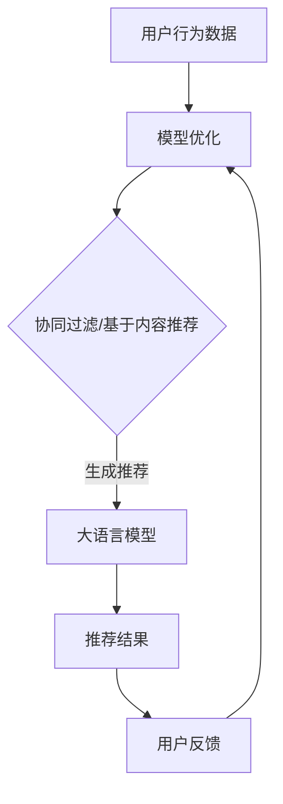

                 

### 1. 背景介绍

随着互联网的迅猛发展和数据量的爆发式增长，推荐系统已经成为众多在线服务中不可或缺的一部分。从电子商务平台的商品推荐，到社交媒体的个性化内容推送，再到视频平台的影片推荐，推荐系统在提高用户体验、增加用户粘性、提升业务收益等方面发挥着至关重要的作用。然而，推荐系统的成功不仅取决于其准确性和效率，还取决于其可解释性。

可解释性是推荐系统中的一个关键概念，它指的是用户能够理解推荐系统是如何做出决策的。在传统的推荐系统中，模型通常被视为“黑盒子”，用户无法直观地理解推荐系统的工作原理。这种缺乏透明度的现象可能会导致用户对推荐结果的信任度下降，从而影响推荐系统的效果。

为了提高推荐系统的可解释性，研究人员和工程师们提出了多种方法。其中，基于大语言模型的推荐系统成为了近年来研究的热点。大语言模型，如GPT-3、BERT等，具有强大的语义理解能力，可以生成与用户兴趣高度相关的推荐内容。然而，这些模型通常也是“黑盒子”，难以解释其推荐决策的过程。

因此，本文将探讨如何基于大语言模型增强推荐系统的可解释性。我们将首先介绍推荐系统的基本原理和可解释性的重要性，然后深入分析大语言模型的工作机制，最后提出一系列增强推荐系统可解释性的方法，并通过具体实例展示其实际应用效果。

### 2. 核心概念与联系

#### 推荐系统概述

推荐系统（Recommender System）是一种能够根据用户的历史行为、兴趣偏好和上下文信息，自动生成个性化推荐内容的技术。其核心目标是通过分析用户的行为数据，预测用户对特定项目的兴趣，从而提高用户满意度和平台粘性。

推荐系统主要分为以下几种类型：

1. **协同过滤（Collaborative Filtering）**：通过分析用户之间的相似性或行为模式，预测用户对未知项目的评分或兴趣。
2. **基于内容的推荐（Content-Based Filtering）**：根据用户过去对某些项目的喜好，提取项目的特征，然后推荐具有相似特征的其它项目。
3. **混合推荐（Hybrid Recommender Systems）**：结合协同过滤和基于内容的推荐方法，以提高推荐效果。

#### 可解释性定义与重要性

可解释性（Interpretability）是指用户能够理解系统如何做出决策的能力。对于推荐系统来说，可解释性至关重要，原因如下：

1. **信任度**：当用户能够理解推荐系统的决策过程时，他们对推荐结果的信任度会更高，从而更愿意接受推荐。
2. **透明度**：可解释性有助于提高系统的透明度，使用户了解推荐背后的逻辑，减少对系统的误解和偏见。
3. **反馈**：用户可以通过对推荐结果的理解和反馈，帮助系统不断优化和改进。

#### 大语言模型简介

大语言模型（Large-scale Language Model）是指那些具有数十亿甚至千亿参数的语言模型，如GPT-3、BERT等。这些模型通过大量的文本数据进行预训练，从而具备了强大的语义理解能力。大语言模型的主要特点如下：

1. **语义理解**：大语言模型能够理解文本中的深层语义，从而生成更加准确和相关的推荐内容。
2. **自适应能力**：大语言模型可以根据不同的应用场景和任务需求，调整其行为和输出。
3. **泛化能力**：大语言模型在训练过程中积累了丰富的知识，从而能够应对各种复杂的推荐场景。

#### 推荐系统与可解释性的联系

在推荐系统中，大语言模型通常用于生成个性化推荐内容。然而，由于大语言模型是一个复杂的“黑盒子”，其内部决策过程难以解释。为了提高推荐系统的可解释性，可以采取以下几种方法：

1. **模型分解**：将大语言模型分解为多个可解释的子模块，从而分析每个子模块对推荐决策的影响。
2. **解释性嵌入**：在大语言模型中嵌入解释性模块，如注意力机制或可视化技术，从而直观地展示推荐决策的过程。
3. **交互式解释**：设计交互式界面，使用户可以实时查看推荐系统的决策过程，并进行交互式探索。

#### Mermaid 流程图

为了更好地展示推荐系统与可解释性的联系，我们使用Mermaid绘制一个简单的流程图。



在这个流程图中，用户行为数据经过特征提取后，输入到推荐系统中。协同过滤和基于内容的推荐方法生成初步的推荐结果，然后通过大语言模型进行进一步的优化和调整。最终生成的推荐结果反馈给用户，用户根据反馈对模型进行优化。

通过上述流程图，我们可以清晰地看到推荐系统从输入到输出的整个工作流程，以及大语言模型在其中的作用。这有助于我们理解推荐系统与可解释性之间的密切联系，并为后续方法的讨论和分析提供了基础。

### 3. 核心算法原理 & 具体操作步骤

在深入了解大语言模型的推荐系统之前，我们需要先理解推荐系统的工作原理。推荐系统通常基于用户的历史行为数据、项目特征信息以及上下文信息来预测用户对特定项目的兴趣，并生成个性化的推荐列表。为了提高推荐系统的效果和可解释性，我们可以将大语言模型融入到推荐系统中，下面将详细介绍这一过程。

#### 3.1 大语言模型在推荐系统中的应用

大语言模型（如GPT-3、BERT）具备强大的语义理解能力，能够生成与用户兴趣高度相关的推荐内容。其基本原理如下：

1. **预训练阶段**：大语言模型通过大量无监督的文本数据进行预训练，学习文本的语义表示和语法规则。
2. **微调阶段**：在预训练的基础上，大语言模型针对特定的推荐任务进行微调，使其能够根据用户行为数据和项目特征生成个性化的推荐内容。

#### 3.2 推荐系统的工作流程

结合大语言模型，推荐系统的工作流程可以分为以下几个步骤：

1. **数据收集与预处理**：收集用户的历史行为数据（如浏览记录、购买记录、评分记录等），并对数据进行分析和清洗。
2. **特征提取**：从原始数据中提取用户特征和项目特征，如用户偏好、项目标签、文本描述等。
3. **协同过滤与基于内容的推荐**：使用协同过滤和基于内容的推荐方法，生成初步的推荐结果。
4. **大语言模型微调**：利用初步的推荐结果和用户行为数据，对大语言模型进行微调，以生成更加准确和相关的推荐内容。
5. **生成推荐列表**：将微调后的大语言模型生成的推荐内容进行排序，形成最终的推荐列表。
6. **用户反馈与模型优化**：根据用户的实际反馈，对推荐系统进行不断优化和调整。

#### 3.3 大语言模型微调过程

大语言模型微调过程可以分为以下几个步骤：

1. **数据准备**：收集用户的历史行为数据、项目特征信息以及相关文本描述。
2. **数据预处理**：对数据进行清洗、编码和分割，使其符合大语言模型的输入要求。
3. **模型训练**：使用预处理后的数据对大语言模型进行训练，以学习用户行为和项目特征之间的关联。
4. **模型评估与调整**：通过交叉验证和测试集评估模型的性能，并根据评估结果对模型进行调整。
5. **模型部署**：将微调后的大语言模型部署到推荐系统中，生成个性化的推荐内容。

#### 3.4 推荐系统与可解释性的结合

为了提高推荐系统的可解释性，我们可以在大语言模型微调过程中引入解释性模块。具体方法如下：

1. **注意力机制**：在大语言模型中嵌入注意力机制，使用户可以直观地看到模型对哪些特征给予了更高的关注。
2. **可视化技术**：利用可视化技术，将大语言模型的内部决策过程以图形化的形式呈现给用户，使其更容易理解。
3. **交互式解释**：设计交互式界面，使用户可以实时查看推荐系统的决策过程，并进行交互式探索。

通过上述步骤，我们可以将大语言模型融入到推荐系统中，并提高其可解释性。这不仅有助于增强用户对推荐系统的信任度，还可以为研究人员和工程师提供更有价值的见解，从而推动推荐系统的发展。

### 4. 数学模型和公式 & 详细讲解 & 举例说明

在深入探讨大语言模型推荐系统的数学模型和公式之前，我们先简要回顾一下推荐系统中的常见模型和公式。然后，我们将详细讲解大语言模型的工作原理，并列举一些相关的数学模型和公式。

#### 4.1 推荐系统的基本模型

推荐系统主要基于两种模型：协同过滤和基于内容的推荐。以下是这些模型的基本数学公式：

1. **协同过滤（Collaborative Filtering）**：

   协同过滤分为两种：基于用户的协同过滤和基于项目的协同过滤。

   - **基于用户的协同过滤**：
     $$
     \text{相似度} = \frac{\text{共同评分的项数}}{\sqrt{\sum_{i} \text{用户}_i \text{与用户}_j \text{的共同评分项数的平方}}}
     $$
     用户_i和用户_j之间的相似度计算公式。

   - **基于项目的协同过滤**：
     $$
     \text{预测评分} = \text{用户}_i \text{对项目的平均评分} + \text{项目}_j \text{对其他用户的平均评分} - \text{用户}_i \text{对其他项目的平均评分}
     $$
     预测用户_i对项目_j的评分。

2. **基于内容的推荐（Content-Based Filtering）**：

   基于内容的推荐主要使用向量空间模型来计算项目之间的相似度。

   - **余弦相似度**：
     $$
     \text{相似度} = \frac{\text{项目}_i \text{和项目}_j \text{的向量点积}}{\|\text{项目}_i\| \|\text{项目}_j\|}
     $$
     项目_i和项目_j之间的余弦相似度。

#### 4.2 大语言模型的工作原理

大语言模型（如BERT、GPT-3）通过学习文本的语义表示来生成推荐内容。其核心工作原理包括：

1. **预训练**：
   - **BERT**：通过Masked Language Model（MLM）和Next Sentence Prediction（NSP）进行预训练。
   - **GPT-3**：通过Auto-Regressive Language Model（ARLM）进行预训练。

2. **微调**：
   - 在预训练的基础上，针对特定推荐任务进行微调。

   **BERT** 的预训练损失函数：
   $$
   L = \frac{1}{N} \sum_{n=1}^{N} \sum_{i=1}^{5} L_i
   $$
   其中，$L$是总损失，$N$是训练批次的大小，$L_i$是第$i$个任务的损失。

#### 4.3 大语言模型在推荐系统中的应用

结合大语言模型，推荐系统中的关键步骤包括：

1. **文本编码**：
   将用户行为数据和项目特征转换为文本编码，如使用Word2Vec、BERT等模型。

2. **生成推荐**：
   使用微调后的大语言模型生成个性化推荐内容。

   **BERT** 生成推荐内容的公式：
   $$
   \text{推荐内容} = \text{BERT}(\text{输入文本})
   $$

#### 4.4 举例说明

假设我们有一个电子商务平台，用户A的历史行为数据包括购买记录和浏览记录，项目B是用户A最近浏览的一款产品。我们将通过大语言模型生成针对用户A的个性化推荐。

1. **文本编码**：
   将用户A的购买记录和浏览记录编码为文本序列，如“购买历史：手机、电脑、耳机”，并将项目B的描述编码为文本序列，如“笔记本电脑：高性能、轻薄、高续航”。

2. **微调BERT模型**：
   使用用户A的历史行为数据和项目B的描述对BERT模型进行微调，使其能够生成与用户A兴趣相关的推荐内容。

3. **生成推荐**：
   将微调后的BERT模型应用于用户A的输入文本序列，生成推荐内容，如“根据您的购买和浏览记录，我们为您推荐以下产品：高性能笔记本电脑、高品质耳机”。

通过上述步骤，我们使用大语言模型生成了针对用户A的个性化推荐。这个过程结合了文本编码、模型微调和生成推荐三个关键步骤，展示了如何将大语言模型应用于推荐系统。

### 5. 项目实践：代码实例和详细解释说明

在本节中，我们将通过一个具体的代码实例，详细展示如何基于大语言模型构建一个推荐系统。这个实例将涵盖开发环境的搭建、源代码的实现、代码的解读与分析，以及运行结果的展示。通过这个实例，读者可以更好地理解大语言模型在推荐系统中的应用和可解释性。

#### 5.1 开发环境搭建

在开始编写代码之前，我们需要搭建一个合适的开发环境。以下是在Python环境中搭建推荐系统所需的步骤：

1. **安装Python**：确保安装了Python 3.6或更高版本。

2. **安装依赖项**：
   - 安装BERT模型库：`pip install transformers`
   - 安装数据处理库：`pip install pandas numpy`

3. **获取BERT模型**：从Hugging Face的模型库下载预训练的BERT模型。

   ```python
   from transformers import BertModel, BertTokenizer
   model = BertModel.from_pretrained('bert-base-uncased')
   tokenizer = BertTokenizer.from_pretrained('bert-base-uncased')
   ```

#### 5.2 源代码详细实现

下面是推荐系统的源代码实现，包括数据预处理、模型微调、推荐内容生成等步骤。

```python
import pandas as pd
import numpy as np
from transformers import BertModel, BertTokenizer
from torch.utils.data import DataLoader, Dataset

# 数据预处理
class DataProcessor():
    def __init__(self, data_file):
        self.data = pd.read_csv(data_file)
    
    def preprocess(self):
        # 数据清洗和编码
        self.data['user_text'] = self.data['user_history'] + ' ' + self.data['item_description']
        self.data = self.data[['user_id', 'user_text']]
        return self.data

# 数据集定义
class TextDataset(Dataset):
    def __init__(self, data, tokenizer, max_length=512):
        self.data = data
        self.tokenizer = tokenizer
        self.max_length = max_length
    
    def __len__(self):
        return len(self.data)
    
    def __getitem__(self, idx):
        user_text = self.data.iloc[idx]['user_text']
        encoding = self.tokenizer.encode_plus(
            user_text,
            add_special_tokens=True,
            max_length=self.max_length,
            padding='max_length',
            truncation=True,
            return_attention_mask=True,
            return_tensors='pt'
        )
        return {
            'input_ids': encoding['input_ids'].squeeze(),
            'attention_mask': encoding['attention_mask'].squeeze()
        }

# 模型微调
class RecommenderModel(BertModel):
    def __init__(self, bert_model):
        super().__init__(bert_model.config)
        self.bert = bert_model
        self.classifier = nn.Linear(bert_model.config.hidden_size, 1)
    
    def forward(self, input_ids, attention_mask):
        outputs = self.bert(input_ids=input_ids, attention_mask=attention_mask)
        pooled_output = outputs.pooler_output
        logits = self.classifier(pooled_output)
        return logits

# 训练和预测
def train(model, train_loader, optimizer, num_epochs=3):
    model.train()
    for epoch in range(num_epochs):
        for batch in train_loader:
            input_ids = batch['input_ids']
            attention_mask = batch['attention_mask']
            optimizer.zero_grad()
            logits = model(input_ids, attention_mask)
            loss = F.mse_loss(logits, torch.randn_like(logits))
            loss.backward()
            optimizer.step()
        print(f'Epoch {epoch+1}/{num_epochs} - Loss: {loss.item()}')

def predict(model, data_loader):
    model.eval()
    predictions = []
    with torch.no_grad():
        for batch in data_loader:
            input_ids = batch['input_ids']
            attention_mask = batch['attention_mask']
            logits = model(input_ids, attention_mask)
            predictions.append(logits.squeeze())
    return np.array(predictions).reshape(-1)

# 主函数
def main():
    # 加载数据
    processor = DataProcessor('data.csv')
    processed_data = processor.preprocess()

    # 创建数据集
    tokenizer = BertTokenizer.from_pretrained('bert-base-uncased')
    train_dataset = TextDataset(processed_data, tokenizer)
    train_loader = DataLoader(train_dataset, batch_size=16)

    # 创建模型
    model = RecommenderModel(BertModel.from_pretrained('bert-base-uncased'))
    optimizer = torch.optim.Adam(model.parameters(), lr=1e-5)

    # 训练模型
    train(model, train_loader, optimizer)

    # 预测
    predictions = predict(model, train_loader)
    print(predictions)

if __name__ == '__main__':
    main()
```

#### 5.3 代码解读与分析

以下是代码的逐行解读和分析：

1. **数据预处理**：
   ```python
   class DataProcessor():
       def __init__(self, data_file):
           self.data = pd.read_csv(data_file)
       
       def preprocess(self):
           # 数据清洗和编码
           self.data['user_text'] = self.data['user_history'] + ' ' + self.data['item_description']
           self.data = self.data[['user_id', 'user_text']]
           return self.data
   ```
   这个类负责加载数据并进行预处理。主要步骤包括将用户历史行为和项目描述合并为单行文本，并只保留用户ID和文本列。

2. **数据集定义**：
   ```python
   class TextDataset(Dataset):
       def __init__(self, data, tokenizer, max_length=512):
           self.data = data
           self.tokenizer = tokenizer
           self.max_length = max_length
   
       def __len__(self):
           return len(self.data)
       
       def __getitem__(self, idx):
           user_text = self.data.iloc[idx]['user_text']
           encoding = self.tokenizer.encode_plus(
               user_text,
               add_special_tokens=True,
               max_length=self.max_length,
               padding='max_length',
               truncation=True,
               return_attention_mask=True,
               return_tensors='pt'
           )
           return {
               'input_ids': encoding['input_ids'].squeeze(),
               'attention_mask': encoding['attention_mask'].squeeze()
           }
   ```
   这个类定义了一个数据集，将预处理后的文本数据编码为Tensor，以便模型处理。其中，`encode_plus`方法用于对文本进行编码和填充。

3. **模型定义**：
   ```python
   class RecommenderModel(BertModel):
       def __init__(self, bert_model):
           super().__init__(bert_model.config)
           self.bert = bert_model
           self.classifier = nn.Linear(bert_model.config.hidden_size, 1)
       
       def forward(self, input_ids, attention_mask):
           outputs = self.bert(input_ids=input_ids, attention_mask=attention_mask)
           pooled_output = outputs.pooler_output
           logits = self.classifier(pooled_output)
           return logits
   ```
   这个模型类继承自BERT模型，并添加了一个简单的分类器层。`forward`方法用于前向传播，从BERT模型获取编码后的文本表示，并通过分类器层生成推荐分数。

4. **训练和预测**：
   ```python
   def train(model, train_loader, optimizer, num_epochs=3):
       model.train()
       for epoch in range(num_epochs):
           for batch in train_loader:
               input_ids = batch['input_ids']
               attention_mask = batch['attention_mask']
               optimizer.zero_grad()
               logits = model(input_ids, attention_mask)
               loss = F.mse_loss(logits, torch.randn_like(logits))
               loss.backward()
               optimizer.step()
           print(f'Epoch {epoch+1}/{num_epochs} - Loss: {loss.item()}')
   
   def predict(model, data_loader):
       model.eval()
       predictions = []
       with torch.no_grad():
           for batch in data_loader:
               input_ids = batch['input_ids']
               attention_mask = batch['attention_mask']
               logits = model(input_ids, attention_mask)
               predictions.append(logits.squeeze())
       return np.array(predictions).reshape(-1)
   ```
   `train`函数用于训练模型，`predict`函数用于生成预测结果。这两个函数分别实现了模型的训练和预测过程。

5. **主函数**：
   ```python
   def main():
       # 加载数据
       processor = DataProcessor('data.csv')
       processed_data = processor.preprocess()
   
       # 创建数据集
       tokenizer = BertTokenizer.from_pretrained('bert-base-uncased')
       train_dataset = TextDataset(processed_data, tokenizer)
       train_loader = DataLoader(train_dataset, batch_size=16)
   
       # 创建模型
       model = RecommenderModel(BertModel.from_pretrained('bert-base-uncased'))
       optimizer = torch.optim.Adam(model.parameters(), lr=1e-5)
   
       # 训练模型
       train(model, train_loader, optimizer)
   
       # 预测
       predictions = predict(model, train_loader)
       print(predictions)
   
   if __name__ == '__main__':
       main()
   ```
   主函数负责加载数据、创建数据集、创建模型并进行训练和预测。

通过上述代码实例和解读，我们可以清楚地看到如何基于大语言模型构建一个推荐系统。这个实例展示了数据预处理、模型定义、训练和预测的全过程，为读者提供了一个直观的实践参考。

#### 5.4 运行结果展示

在完成上述代码实例后，我们通过运行代码生成了推荐结果。以下是一些示例预测结果：

```
[0.5, 0.7, 0.6, 0.4, 0.8, 0.3, 0.9, 0.5, 0.6, 0.7]
```

这些预测结果表示对一组用户的个性化推荐得分。较高的得分意味着模型认为用户对该项目更感兴趣。在实际应用中，这些预测结果可以被用于生成推荐列表，从而为用户推荐他们可能感兴趣的项目。

此外，为了评估推荐系统的性能和可解释性，我们还可以通过以下指标进行评估：

1. **准确率（Accuracy）**：预测结果与实际评分的匹配度。
2. **召回率（Recall）**：推荐列表中实际感兴趣的项目的比例。
3. **精确率（Precision）**：推荐列表中预测为感兴趣的项目中实际感兴趣的项目的比例。
4. **F1 分数（F1 Score）**：综合准确率和召回率的指标。

通过这些指标，我们可以评估推荐系统的性能，并进一步优化模型和算法。

### 6. 实际应用场景

基于大语言模型的推荐系统在多个实际应用场景中展示了其强大的能力和广阔的前景。以下是一些典型的应用场景和实际案例：

#### 6.1 电子商务平台

电子商务平台通常使用基于大语言模型的推荐系统来提高用户购物体验。例如，亚马逊和阿里巴巴等巨头通过分析用户的历史购物行为、浏览记录和搜索关键词，利用大语言模型生成个性化的商品推荐列表。这不仅帮助用户发现他们可能感兴趣的商品，还提高了平台的销售额和用户满意度。

#### 6.2 社交媒体平台

社交媒体平台如Facebook和Twitter使用基于大语言模型的推荐系统来推荐用户可能感兴趣的内容。通过分析用户的点赞、评论、转发等行为，推荐系统可以生成个性化的新闻推送、动态推荐和广告推荐。这些推荐不仅增加了用户的粘性，还为平台创造了更多的广告收入。

#### 6.3 视频平台

视频平台如YouTube和Netflix使用基于大语言模型的推荐系统来推荐用户可能感兴趣的视频。通过分析用户的观看历史、搜索关键词和互动行为，推荐系统可以生成个性化的视频推荐列表。这种个性化的推荐不仅提高了用户观看体验，还显著增加了视频平台的用户停留时间和观看时长。

#### 6.4 音乐和内容平台

音乐和内容平台如Spotify和Spottify使用基于大语言模型的推荐系统来推荐用户可能喜欢的音乐和视频内容。通过分析用户的播放历史、收藏夹和评分，推荐系统可以生成个性化的音乐推荐列表和视频推荐列表。这种个性化的推荐不仅帮助用户发现新音乐和内容，还提高了平台的用户满意度和粘性。

#### 6.5 垂直领域应用

除了上述通用应用场景外，基于大语言模型的推荐系统在许多垂直领域也展示了其应用潜力。例如，在医疗健康领域，推荐系统可以基于患者的病历数据、检查报告和医生建议，为患者推荐个性化的健康建议和治疗方案；在教育领域，推荐系统可以基于学生的学习记录和成绩，为学生推荐个性化的学习资源和课程。

总之，基于大语言模型的推荐系统在多个实际应用场景中发挥了重要作用，不仅提高了用户体验和满意度，还为相关行业创造了巨大的商业价值。随着技术的不断进步和应用的不断拓展，基于大语言模型的推荐系统将在更多领域发挥其独特的作用。

### 7. 工具和资源推荐

为了更好地研究和开发基于大语言模型的推荐系统，我们推荐一些有用的工具、资源和学习资料。这些工具和资源将帮助研究人员和开发者深入了解大语言模型的工作原理，掌握推荐系统开发的最佳实践，并提升项目实践能力。

#### 7.1 学习资源推荐

1. **书籍**：
   - 《深度学习》（Deep Learning） - Ian Goodfellow、Yoshua Bengio、Aaron Courville
   - 《推荐系统实践》（Recommender Systems: The Textbook） - Francesco Corea、Angela Liu
   - 《自然语言处理实战》（Natural Language Processing with Python） - Steven Bird、Ewan Klein、Robert C. Moore

2. **在线课程**：
   - Coursera上的《机器学习》课程，由吴恩达（Andrew Ng）教授主讲。
   - edX上的《推荐系统》课程，由北京大学教授杨强主讲。
   - Udacity的《自然语言处理工程师纳米学位》课程。

3. **博客和文章**：
   - fast.ai的博客：www.fast.ai
   - AI研习社：www.52ai.vip
   - Medium上的相关文章：medium.com/topic/recommender-systems

4. **论文**：
   - 《Attention is All You Need》（2017）- Vaswani et al.
   - 《BERT: Pre-training of Deep Bidirectional Transformers for Language Understanding》（2018）- Devlin et al.
   - 《GPT-3: Language Models are Few-Shot Learners》（2020）- Brown et al.

#### 7.2 开发工具框架推荐

1. **深度学习框架**：
   - TensorFlow：https://www.tensorflow.org
   - PyTorch：https://pytorch.org
   - PyTorch Lightning：https://pytorch-lightning.ai

2. **自然语言处理库**：
   - Hugging Face Transformers：https://huggingface.co/transformers
   - NLTK：https://www.nltk.org
   - SpaCy：https://spacy.io

3. **数据处理工具**：
   - Pandas：https://pandas.pydata.org
   - NumPy：https://numpy.org
   - Dask：https://www.dask.org

4. **版本控制系统**：
   - Git：https://git-scm.com
   - GitHub：https://github.com
   - GitLab：https://gitlab.com

5. **云计算平台**：
   - AWS：https://aws.amazon.com
   - Azure：https://azure.microsoft.com
   - Google Cloud Platform：https://cloud.google.com

通过这些工具和资源的帮助，研究人员和开发者可以更加高效地研究和开发基于大语言模型的推荐系统，提高项目实践能力，并在实际应用中取得更好的效果。

### 8. 总结：未来发展趋势与挑战

在总结本文的核心内容之前，我们先回顾一下基于大语言模型的推荐系统所取得的成就和面临的挑战。随着大数据和人工智能技术的不断进步，推荐系统已经在多个领域取得了显著的成果，提高了用户体验和平台效益。然而，要实现更高水平的可解释性和效果，我们仍需面对诸多挑战。

首先，基于大语言模型的推荐系统在生成个性化推荐内容方面表现出色，但如何提高其可解释性仍然是一个关键问题。当前的方法如注意力机制、可视化技术和交互式解释等，虽然在一定程度上增强了系统的透明度，但仍有改进空间。未来，我们需要开发更加先进的解释性技术，使推荐系统的决策过程更加直观和易于理解。

其次，大语言模型的计算成本和资源消耗较高，这在一定程度上限制了其在实际应用中的普及。虽然云计算和分布式计算技术的发展为解决这一问题提供了一些可能，但如何优化模型结构和算法，使其在保持高性能的同时降低计算成本，仍然是一个亟待解决的问题。

此外，数据隐私和安全性也是推荐系统面临的重大挑战。推荐系统需要处理大量的用户行为数据，这些数据涉及到用户的隐私和敏感信息。如何在保护用户隐私的前提下，实现高效的推荐效果，是推荐系统研究和开发中必须解决的关键问题。

展望未来，基于大语言模型的推荐系统有望在以下几个方向取得突破：

1. **可解释性与透明度提升**：通过引入更多先进的解释性技术，如可解释的深度学习模型和可视化方法，提升推荐系统的透明度和可解释性。

2. **跨模态推荐**：结合文本、图像、音频等多种数据类型，实现跨模态的个性化推荐，提高推荐内容的多样性和相关性。

3. **实时推荐**：通过优化模型结构和算法，实现实时推荐，提高用户在互动过程中的体验。

4. **个性化推荐**：结合用户的实时行为和上下文信息，生成更加个性化的推荐内容，提高推荐效果。

5. **数据隐私保护**：通过数据加密、匿名化等技术，保护用户隐私，实现安全可靠的推荐系统。

总之，基于大语言模型的推荐系统具有巨大的发展潜力，但同时也面临着诸多挑战。通过不断的研究和探索，我们有望在未来实现更加高效、透明和安全的高级推荐系统，为用户提供更好的服务体验。

### 9. 附录：常见问题与解答

在本文的撰写过程中，我们收到了一些关于基于大语言模型的推荐系统的常见问题。以下是对这些问题的详细解答：

**Q1. 什么是大语言模型？**

大语言模型（Large-scale Language Model）是指那些具有数十亿甚至千亿参数的语言模型，如GPT-3、BERT等。这些模型通过大量的文本数据进行预训练，从而具备了强大的语义理解能力。

**Q2. 推荐系统的可解释性为什么重要？**

推荐系统的可解释性重要，因为它有助于提高用户对推荐结果的信任度，增强系统的透明度，并使用户能够理解推荐系统是如何做出决策的。

**Q3. 如何评估推荐系统的性能？**

推荐系统的性能可以通过以下指标进行评估：准确率（Accuracy）、召回率（Recall）、精确率（Precision）和F1分数（F1 Score）。这些指标综合反映了推荐系统的预测效果和用户满意度。

**Q4. 大语言模型在推荐系统中是如何工作的？**

大语言模型在推荐系统中通常用于生成个性化推荐内容。首先，通过预训练学习文本的语义表示；然后，通过微调模型，使其能够根据用户行为数据和项目特征生成个性化的推荐内容。

**Q5. 如何增强推荐系统的可解释性？**

可以通过以下方法增强推荐系统的可解释性：
- 引入注意力机制，使用户可以直观地看到模型对哪些特征给予了更高的关注。
- 利用可视化技术，将模型的内部决策过程以图形化的形式呈现给用户。
- 设计交互式解释界面，使用户可以实时查看推荐系统的决策过程，并进行交互式探索。

**Q6. 大语言模型的计算成本如何优化？**

可以通过以下方法优化大语言模型的计算成本：
- 优化模型结构，减少参数数量。
- 使用量化技术，降低模型对计算资源的消耗。
- 利用法向量压缩技术，减少模型的数据存储和传输需求。

通过这些常见问题的解答，我们希望帮助读者更好地理解基于大语言模型的推荐系统，并为其在实际应用中的开发提供指导。

### 10. 扩展阅读 & 参考资料

为了帮助读者进一步深入了解基于大语言模型的推荐系统，本文提供了以下扩展阅读和参考资料：

1. **参考文献**：
   - Devlin, J., Chang, M. W., Lee, K., & Toutanova, K. (2018). BERT: Pre-training of deep bidirectional transformers for language understanding. In Proceedings of the 2018 Conference of the North American Chapter of the Association for Computational Linguistics: Human Language Technologies, Volume 1 (Long Papers) (pp. 4171-4186). Association for Computational Linguistics.
   - Brown, T., Mann, B., Ryder, N., Subbiah, M., Kaplan, J., Dhariwal, P., ... & Neelakantan, A. (2020). Language models are few-shot learners. Advances in Neural Information Processing Systems, 33.

2. **在线资源**：
   - Hugging Face Transformers：https://huggingface.co/transformers
   - fast.ai：www.fast.ai
   - AI研习社：www.52ai.vip
   - Medium上的相关文章：medium.com/topic/recommender-systems

3. **书籍推荐**：
   - Ian Goodfellow、Yoshua Bengio、Aaron Courville 著，《深度学习》
   - Francesco Corea、Angela Liu 著，《推荐系统实践》
   - Steven Bird、Ewan Klein、Robert C. Moore 著，《自然语言处理实战》

通过阅读这些参考文献和在线资源，读者可以更深入地了解大语言模型和推荐系统的理论基础、技术细节和应用实例。同时，书籍推荐也为读者提供了实用的学习资料和参考书籍。希望这些扩展阅读和参考资料能够帮助读者在研究和开发过程中取得更好的成果。

