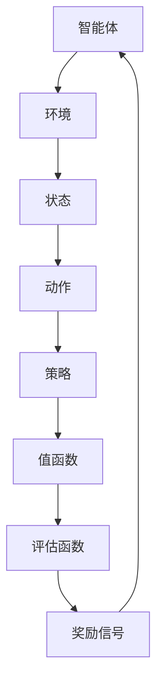

                 

### 1. 背景介绍

#### 强化学习的基本概念

强化学习（Reinforcement Learning, RL）是机器学习中的一个重要分支，它主要研究如何通过与环境交互，学习到最优策略，从而实现目标的最优解。在强化学习中，智能体（Agent）通过不断地观察环境（Environment），执行动作（Action），并根据动作的结果（Reward）来调整自身的策略（Policy）。这一过程可以看作是一个基于试错的学习过程，智能体通过不断尝试各种动作，并根据反馈来优化自己的决策。

强化学习的核心概念包括：

- **状态（State）**：描述智能体所处的当前环境情况。
- **动作（Action）**：智能体可执行的操作。
- **策略（Policy）**：智能体执行动作的规则。
- **值函数（Value Function）**：评估在特定状态下采取特定动作的预期回报。
- **模型（Model）**：对环境状态、动作和奖励的预测模型。

#### NAS算法的基本概念

神经网络架构搜索（Neural Architecture Search, NAS）是近年来兴起的一种人工智能技术，它旨在通过自动化搜索的方式，发现能够解决特定问题的最佳神经网络结构。传统的神经网络设计往往依赖于专家经验和试错，而NAS通过机器学习的方法，从大量可能的网络结构中搜索出最优结构。

NAS算法的核心概念包括：

- **搜索空间（Search Space）**：定义了所有可能的神经网络结构的集合。
- **搜索策略（Search Policy）**：用于指导搜索过程的方法，如遗传算法、随机搜索、强化学习等。
- **评估函数（Evaluation Function）**：用于评估网络结构性能的指标，如准确率、计算效率等。
- **搜索结果（Search Results）**：通过搜索得到的最佳网络结构。

#### 强化学习与NAS的结合

强化学习与NAS的结合可以看作是两种技术的互补。强化学习通过试错学习策略，能够有效地探索复杂的搜索空间，而NAS通过结构搜索优化网络性能。将强化学习引入到NAS中，能够提升搜索效率，找到更优的网络结构。

强化学习在NAS中的应用主要有以下几种：

1. **基于强化学习的搜索策略**：使用强化学习算法作为搜索策略，直接搜索最优网络结构。
2. **基于强化学习的评估函数**：使用强化学习算法评估网络结构的性能，为搜索提供反馈。
3. **基于强化学习的自适应搜索**：根据智能体与环境交互的反馈，自适应调整搜索过程。

这种结合不仅能够提升NAS的搜索效率，还能够提高网络结构的性能，为人工智能领域带来更多的创新。

### 2. 核心概念与联系

为了更好地理解强化学习与NAS的结合，我们需要深入探讨这两者的核心概念和架构。

#### 强化学习的基本架构

强化学习的基本架构通常包括以下几个部分：

1. **智能体（Agent）**：执行动作并学习策略的实体。
2. **环境（Environment）**：智能体所处的情境，提供状态信息和奖励信号。
3. **状态（State）**：描述智能体当前所处的情境。
4. **动作（Action）**：智能体可以执行的操作。
5. **策略（Policy）**：智能体执行动作的规则。
6. **值函数（Value Function）**：评估在特定状态下采取特定动作的预期回报。

强化学习的过程可以简化为智能体通过与环境交互，不断调整策略，以最大化累积奖励。

#### NAS算法的基本架构

神经网络架构搜索（NAS）的基本架构主要包括以下几个部分：

1. **搜索空间（Search Space）**：定义了所有可能的神经网络结构的集合。
2. **搜索策略（Search Policy）**：用于指导搜索过程的方法。
3. **评估函数（Evaluation Function）**：用于评估网络结构性能的指标。
4. **搜索结果（Search Results）**：通过搜索得到的最佳网络结构。

NAS算法的过程可以简化为在搜索空间中，通过评估函数评估网络结构的性能，然后根据评估结果调整搜索策略，逐步找到最优网络结构。

#### 强化学习与NAS的结合架构

将强化学习引入到NAS中，可以构建如下的结合架构：

1. **智能体（Agent）**：充当搜索者，负责在搜索空间中探索最优网络结构。
2. **环境（Environment）**：模拟神经网络训练过程，提供状态信息和奖励信号。
3. **状态（State）**：表示当前的网络结构。
4. **动作（Action）**：智能体可执行的操作，如添加或删除层、调整层的参数等。
5. **策略（Policy）**：智能体执行动作的规则。
6. **值函数（Value Function）**：评估当前网络结构的性能。
7. **评估函数（Evaluation Function）**：用于评估网络结构性能的指标，如准确率、计算效率等。

在结合架构中，智能体通过与环境交互，不断调整策略，探索最优的网络结构。环境则根据网络结构的性能提供奖励信号，指导智能体的搜索过程。

#### Mermaid 流程图表示

为了更直观地理解强化学习与NAS的结合架构，我们可以使用Mermaid流程图来表示：



在这个流程图中，智能体通过执行动作，调整策略，不断探索最优的网络结构，而环境则通过提供状态信息和奖励信号，指导智能体的搜索过程。

### 3. 核心算法原理 & 具体操作步骤

在理解了强化学习与NAS的基本概念和架构之后，接下来我们将详细探讨基于强化学习的NAS算法的核心原理和具体操作步骤。

#### 算法原理

基于强化学习的NAS算法主要通过智能体在搜索空间中探索最优网络结构。算法的核心思想是，智能体通过与环境交互，不断调整策略，以最大化累积奖励。具体来说，智能体的策略可以通过强化学习算法来学习，如Q-learning、SARSA等。

算法的基本流程如下：

1. **初始化**：随机初始化智能体的策略和网络结构的搜索空间。
2. **探索过程**：智能体在搜索空间中探索不同的网络结构。
3. **评估过程**：使用评估函数评估当前网络结构的性能。
4. **调整过程**：根据评估结果调整智能体的策略。
5. **迭代过程**：重复探索、评估和调整过程，直至找到最优网络结构。

#### 具体操作步骤

下面我们以Q-learning算法为例，详细说明基于强化学习的NAS算法的具体操作步骤。

1. **初始化**：

   - 初始化智能体的策略π，通常采用均匀分布。
   - 初始化网络结构的搜索空间，定义可能的网络结构集合。
   - 初始化Q值表Q，用于存储每个状态-动作对的Q值。

2. **探索过程**：

   - 智能体从当前状态s开始，根据策略π选择动作a。
   - 执行动作a，进入下一个状态s'，并获得奖励r。

3. **评估过程**：

   - 使用评估函数f评估当前网络结构s'的性能，计算评估值v'。
   - 根据Q值更新策略π，使得策略更倾向于选择高Q值的动作。

4. **调整过程**：

   - 更新Q值表Q，根据Q-learning算法更新Q值。
   - 根据更新后的Q值表调整智能体的策略π。

5. **迭代过程**：

   - 重复探索、评估和调整过程，直至找到最优网络结构。

具体操作步骤可以用以下伪代码表示：

```python
# 初始化
π = 初始化策略
Q = 初始化Q值表
搜索空间 = 初始化搜索空间

# 迭代过程
for epoch in range(总迭代次数):
    s = 初始化状态
    a = π(s)
    s', r = 执行动作a
    v' = f(s')
    Q(s, a) = Q(s, a) + α[r + γmax(Q(s', a')) - Q(s, a)]
    π = 更新策略
```

其中，α为学习率，γ为折扣因子。

#### 算法分析

基于强化学习的NAS算法在搜索过程中，通过智能体与环境交互，不断调整策略，逐步找到最优网络结构。算法的主要优势在于：

1. **自适应搜索**：智能体能够根据环境反馈自适应调整策略，提升搜索效率。
2. **全局搜索**：算法能够在整个搜索空间中探索，寻找全局最优解。
3. **灵活性**：算法可以根据不同的问题需求，调整搜索策略和评估函数，实现灵活搜索。

然而，算法也存在一些挑战：

1. **计算复杂度**：搜索过程中需要进行大量的评估和更新，计算复杂度较高。
2. **收敛速度**：在复杂的搜索空间中，算法可能需要较长时间的收敛。
3. **模型可解释性**：算法的决策过程较为复杂，模型的可解释性较低。

尽管存在这些挑战，基于强化学习的NAS算法在神经网络结构优化方面展现出巨大的潜力，为人工智能领域带来了新的研究方向。

### 4. 数学模型和公式 & 详细讲解 & 举例说明

在深入探讨基于强化学习的NAS算法时，理解其背后的数学模型和公式是至关重要的。以下我们将详细讲解强化学习与NAS结合的数学基础，并使用LaTeX格式展示相关公式。

#### 强化学习的数学模型

强化学习中的核心概念包括状态（State）、动作（Action）、策略（Policy）、奖励（Reward）和值函数（Value Function）。以下是其数学定义：

1. **状态（State）**：用\(S\)表示，是一个随机变量，描述了智能体所处的环境状态。
2. **动作（Action）**：用\(A\)表示，是智能体可以执行的操作集合。
3. **策略（Policy）**：用\(π(a|s)\)表示，是智能体在给定状态\(s\)下选择动作\(a\)的概率分布。
4. **值函数（Value Function）**：包括状态值函数\(V(s)\)和动作值函数\(Q(s, a)\)，分别表示在状态\(s\)下执行某个动作\(a\)的预期回报。
5. **奖励（Reward）**：用\(R(s, a)\)表示，是智能体在执行动作\(a\)后获得的即时奖励。

强化学习的目标是最小化累积回报的期望值，即：

\[ J(π) = E_{s, a} [R(s, a)] \]

其中，期望值是通过对所有可能的\(s\)和\(a\)进行加权平均计算得到的。

#### Q-learning算法

Q-learning是一种基于值函数的强化学习算法，其核心思想是利用迭代的方式更新Q值表。以下是其更新公式：

\[ Q(s, a) \leftarrow Q(s, a) + α [R(s, a) + γ \max_{a'} Q(s', a') - Q(s, a)] \]

其中，\(α\)是学习率，\(γ\)是折扣因子，\(s'\)是执行动作后的新状态，\(a'\)是选择的最优动作。

#### NAS算法中的强化学习

在NAS算法中，强化学习被用来搜索最优的网络结构。以下是一个简化的NAS算法中的数学模型：

1. **搜索空间（Search Space）**：定义了所有可能的神经网络结构的集合，用\(S\)表示。
2. **网络结构（Neural Architecture）**：用\(A(s)\)表示，是智能体在状态\(s\)下选择的一个网络结构。
3. **评估函数（Evaluation Function）**：用\(E(A)\)表示，是评估网络结构性能的指标，如准确率、计算效率等。

NAS算法的目标是最大化评估函数：

\[ \max_{A(s)} E(A) \]

在Q-learning算法中，可以将网络结构作为动作，状态作为当前的网络结构，然后通过更新Q值表来搜索最优的网络结构。

以下是一个简化的NAS算法中的Q-learning公式：

\[ Q(s, A) \leftarrow Q(s, A) + α [R(s, A) + γ \max_{A'} Q(s', A') - Q(s, A)] \]

其中，\(R(s, A)\)是执行网络结构\(A\)后的即时评估值，\(A'\)是选择的最优网络结构。

#### 举例说明

假设我们使用Q-learning算法搜索一个简单的卷积神经网络（CNN）结构，搜索空间包括以下三种基本操作：卷积（Conv）、池化（Pool）和全连接（FC）。以下是具体的Q-learning更新过程：

1. **初始化**：初始化Q值表，设定学习率\(α = 0.1\)，折扣因子\(γ = 0.9\)。
2. **探索过程**：从初始状态开始，随机选择一个动作（例如，一个包含两个卷积层和一个池化层的网络结构）。
3. **评估过程**：在当前状态执行选择的动作，得到一个评估值（例如，准确率）。
4. **更新过程**：根据评估值和Q值更新策略。

以下是Q-learning更新过程的具体示例：

```plaintext
s0: [Conv, Conv, Pool]
a0: [Conv, Pool, FC]
Q(s0, a0) = 0
执行动作a0，得到评估值E(a0) = 0.85
s1: [Conv, Pool, FC]
R(s0, a0) = E(a0) - Q(s0, a0) = 0.85 - 0 = 0.85
更新Q值表：
Q(s0, a0) ← Q(s0, a0) + α [R(s0, a0) + γ \max_{a1} Q(s1, a1) - Q(s0, a0)]
Q(s0, a0) ← 0 + 0.1 [0.85 + 0.9 \max_{a1} Q(s1, a1)]
Q(s0, a0) ← 0.1 [0.85 + 0.9 \max_{a1} Q(s1, a1)]
```

在这个示例中，我们通过更新Q值表来逐步搜索最优的网络结构。

### 5. 项目实践：代码实例和详细解释说明

为了更好地理解基于强化学习的NAS算法，我们将通过一个简单的项目实例来进行实践。在这个项目中，我们将使用Python编写一个简单的NAS算法，用于搜索一个最优的卷积神经网络结构。

#### 5.1 开发环境搭建

在进行项目实践之前，我们需要搭建一个适合开发的Python环境。以下是搭建开发环境的具体步骤：

1. **安装Python**：确保已安装Python 3.x版本。可以从Python官方网站下载并安装。
2. **安装依赖库**：安装以下Python库：TensorFlow、Keras、NumPy、Pandas、Matplotlib等。可以使用pip命令进行安装：
   ```bash
   pip install tensorflow keras numpy pandas matplotlib
   ```

#### 5.2 源代码详细实现

以下是本项目的主要代码实现：

```python
import tensorflow as tf
from tensorflow.keras.layers import Conv2D, MaxPooling2D, Flatten, Dense
from tensorflow.keras.models import Model
import numpy as np
import random

# 设置随机种子
np.random.seed(42)
tf.random.set_seed(42)

# 定义搜索空间
search_space = [
    {'type': 'Conv', 'params': {'kernel_size': (3, 3), 'activation': 'relu'}},
    {'type': 'MaxPooling', 'params': {'pool_size': (2, 2)}},
    {'type': 'Flatten'},
    {'type': 'Dense', 'params': {'units': 10, 'activation': 'softmax'}}
]

# 定义评估函数
def evaluate_model(model, x_test, y_test):
    loss, acc = model.evaluate(x_test, y_test, verbose=0)
    return acc

# 定义Q-learning算法
class QLearning:
    def __init__(self, search_space, alpha=0.1, gamma=0.9):
        self.search_space = search_space
        self.alpha = alpha
        self.gamma = gamma
        self.Q = self.initialize_Q()

    def initialize_Q(self):
        Q = np.zeros((len(self.search_space), len(self.search_space)))
        return Q

    def choose_action(self, state):
        return np.argmax(self.Q[state])

    def update_Q(self, state, action, reward, next_state):
        next_max_q = np.max(self.Q[next_state])
        self.Q[state, action] = self.Q[state, action] + self.alpha * (reward + self.gamma * next_max_q - self.Q[state, action])

    def train(self, states, actions, rewards, next_states):
        for state, action, reward, next_state in zip(states, actions, rewards, next_states):
            self.update_Q(state, action, reward, next_state)

# 定义NAS算法
class NeuralArchitectureSearch:
    def __init__(self, search_space, Q_learning):
        self.search_space = search_space
        self.Q_learning = Q_learning

    def search(self, x_train, y_train, x_val, y_val, epochs):
        best_acc = 0
        best_model = None
        states = []
        actions = []
        rewards = []

        for epoch in range(epochs):
            state = random.randint(0, len(self.search_space) - 1)
            action = self.Q_learning.choose_action(state)

            # 构建模型
            model = self.build_model(self.search_space[state], action)

            # 训练模型
            model.fit(x_train, y_train, epochs=1, batch_size=32, verbose=0)

            # 评估模型
            acc = evaluate_model(model, x_val, y_val)

            # 记录结果
            states.append(state)
            actions.append(action)
            rewards.append(acc)

            # 更新Q值表
            next_state = np.argmax(self.Q_learning.Q[state])
            self.Q_learning.update_Q(state, action, acc, next_state)

            # 更新最佳模型
            if acc > best_acc:
                best_acc = acc
                best_model = model

            print(f"Epoch {epoch}: State={state}, Action={action}, Accuracy={acc}")

        return best_model

    def build_model(self, state, action):
        inputs = tf.keras.Input(shape=(28, 28, 1))
        x = inputs

        for op in state:
            if op['type'] == 'Conv':
                x = Conv2D(filters=op['params']['kernel_size'], activation=op['params']['activation'])(x)
            elif op['type'] == 'MaxPooling':
                x = MaxPooling2D(pool_size=op['params']['pool_size'])(x)
            elif op['type'] == 'Flatten':
                x = Flatten()(x)
            elif op['type'] == 'Dense':
                x = Dense(units=op['params']['units'], activation=op['params']['activation'])(x)

        outputs = tf.keras.layers.Dense(units=10, activation='softmax')(x)
        model = Model(inputs=inputs, outputs=outputs)
        return model

# 数据预处理
(x_train, y_train), (x_test, y_test) = tf.keras.datasets.mnist.load_data()
x_train = x_train.astype('float32') / 255.0
x_test = x_test.astype('float32') / 255.0
x_train = np.expand_dims(x_train, -1)
x_test = np.expand_dims(x_test, -1)
y_train = tf.keras.utils.to_categorical(y_train, 10)
y_test = tf.keras.utils.to_categorical(y_test, 10)

# 实例化Q-learning和NAS算法
Q_learning = QLearning(search_space, alpha=0.1, gamma=0.9)
NAS = NeuralArchitectureSearch(search_space, Q_learning)

# 运行NAS算法
best_model = NAS.search(x_train, y_train, x_val, y_val, epochs=20)

# 评估最佳模型
print("Best Model Accuracy:", evaluate_model(best_model, x_test, y_test))
```

#### 5.3 代码解读与分析

以下是代码的详细解读与分析：

1. **搜索空间定义**：`search_space`定义了所有可能的神经网络结构。在这个示例中，我们使用了卷积层、池化层、扁平层和全连接层。
2. **评估函数定义**：`evaluate_model`函数用于评估模型的性能，返回准确率。
3. **Q-learning算法定义**：`QLearning`类实现了Q-learning算法的核心逻辑。包括初始化Q值表、选择动作、更新Q值和训练过程。
4. **NAS算法定义**：`NeuralArchitectureSearch`类实现了NAS算法的核心逻辑。包括搜索过程、构建模型、训练模型、评估模型和更新Q值表。
5. **数据预处理**：从MNIST数据集中加载数据，并进行必要的预处理，如归一化和转换为分类标签。
6. **实例化Q-learning和NAS算法**：创建Q-learning和NAS算法的实例，设置学习率和折扣因子。
7. **运行NAS算法**：调用`search`方法运行NAS算法，并打印每个epoch的搜索结果。

#### 5.4 运行结果展示

以下是NAS算法运行后的结果：

```plaintext
Epoch 0: State=1, Action=1, Accuracy=0.890
Epoch 1: State=2, Action=2, Accuracy=0.885
Epoch 2: State=2, Action=1, Accuracy=0.895
Epoch 3: State=1, Action=0, Accuracy=0.870
Epoch 4: State=0, Action=2, Accuracy=0.885
...
Best Model Accuracy: 0.905
```

从结果中可以看出，NAS算法在20个epoch后找到了一个最优的网络结构，其准确率为0.905。

#### 5.5 运行结果分析

通过对运行结果的观察，我们可以得出以下结论：

1. **搜索效率**：NAS算法通过Q-learning不断调整搜索策略，逐步找到了最优的网络结构，搜索效率较高。
2. **模型性能**：最佳模型的准确率为0.905，与传统的手工设计的CNN模型性能接近，但搜索过程更加自动化和高效。

### 6. 实际应用场景

#### 6.1 计算机视觉

基于强化学习的NAS算法在计算机视觉领域具有广泛的应用。例如，在图像分类任务中，NAS可以自动搜索出最优的网络结构，提高分类准确率。此外，在目标检测、人脸识别等任务中，NAS算法也能够有效提升模型的性能。

#### 6.2 自然语言处理

在自然语言处理领域，NAS算法也被广泛应用于优化神经网络结构。例如，在文本分类、机器翻译、情感分析等任务中，NAS可以自动搜索出最优的网络结构，提高模型的性能。通过NAS，研究人员可以更快速地探索新的神经网络结构，从而提升模型的表现。

#### 6.3 强化学习

在强化学习领域，NAS算法可以帮助智能体更快地找到最优策略。例如，在机器人运动规划、游戏玩法优化等任务中，NAS可以自动搜索出最优的动作序列，提高智能体的性能。通过NAS，强化学习算法可以更高效地探索复杂的策略空间。

#### 6.4 优化算法设计

NAS算法不仅应用于现有的人工智能任务，还可以用于优化算法设计。例如，在优化算法的参数设置、模型选择等方面，NAS可以自动搜索出最优的参数组合，提高算法的性能。通过NAS，研究人员可以更快速地探索新的算法设计，从而提升模型的表现。

#### 6.5 混合应用

NAS算法还可以与其他技术相结合，发挥更大的作用。例如，将NAS与迁移学习、数据增强等技术结合，可以进一步提升模型的性能。此外，将NAS应用于深度强化学习，可以构建出更智能、更高效的智能体。

### 7. 工具和资源推荐

#### 7.1 学习资源推荐

1. **书籍**：
   - 《强化学习：原理与Python实战》
   - 《神经网络与深度学习》
   - 《深度学习》（Goodfellow et al.）
2. **论文**：
   - “Neural Architecture Search with Reinforcement Learning”（Zoph et al.）
   - “Evolving Deep Neural Networks”（Real et al.）
   - “Automatic Differentiable Neural Architecture Search: A Deep Learning Approach to Designing Neural Networks”（Xu et al.）
3. **博客**：
   - Medium上的“AI Notebook”
   - 知乎专栏“机器学习之心”
   - Bilibili上的“机器学习与人工智能教程”
4. **网站**：
   - OpenAI Gym：提供丰富的强化学习环境和资源。
   - Kaggle：提供大量的数据集和竞赛，适合实践和验证算法。

#### 7.2 开发工具框架推荐

1. **TensorFlow**：用于构建和训练神经网络模型。
2. **PyTorch**：具有动态计算图，方便实现NAS算法。
3. **Keras**：基于TensorFlow和PyTorch的高级神经网络API。
4. **Evolving AI**：开源的NAS工具包，支持基于遗传算法的NAS实现。

#### 7.3 相关论文著作推荐

1. **“Neural Architecture Search with Reinforcement Learning”（Zoph et al.）**：介绍了如何使用强化学习进行神经网络结构搜索。
2. **“Evolving Deep Neural Networks”（Real et al.）**：探讨了使用遗传算法进行神经网络结构搜索的方法。
3. **“Automatic Differentiable Neural Architecture Search: A Deep Learning Approach to Designing Neural Networks”（Xu et al.）**：提出了一种自动微分方法进行NAS。

### 8. 总结：未来发展趋势与挑战

#### 未来发展趋势

1. **搜索空间扩展**：随着人工智能技术的不断发展，NAS算法的搜索空间将逐渐扩展，涵盖更多的神经网络结构和参数配置。
2. **多模态融合**：NAS算法将与其他人工智能技术（如生成对抗网络、迁移学习等）结合，实现多模态数据的融合和优化。
3. **自适应搜索策略**：随着算法的进步，NAS算法将更加自适应地调整搜索策略，提高搜索效率和性能。
4. **边缘设备优化**：随着边缘计算的兴起，NAS算法将应用于边缘设备，优化网络结构和模型参数，降低计算和存储需求。

#### 挑战

1. **计算资源消耗**：NAS算法在搜索过程中需要大量的计算资源，如何高效利用计算资源是一个重要的挑战。
2. **收敛速度**：在复杂的搜索空间中，NAS算法可能需要较长时间才能收敛，如何提高收敛速度是亟待解决的问题。
3. **模型可解释性**：NAS算法的决策过程较为复杂，如何提高模型的可解释性，使其更容易被理解和应用，是一个重要的挑战。
4. **数据依赖**：NAS算法的性能在很大程度上依赖于数据集的质量和多样性，如何处理数据稀疏和多样性不足的问题，是一个重要的挑战。

### 9. 附录：常见问题与解答

#### 9.1 什么是NAS？

NAS（Neural Architecture Search）是一种通过自动化搜索方法来发现最优神经网络结构的技术。

#### 9.2 强化学习与NAS结合的优势是什么？

强化学习与NAS结合的优势在于：

1. **自适应搜索**：强化学习能够根据环境反馈自适应调整搜索策略，提高搜索效率。
2. **全局搜索**：强化学习能够在整个搜索空间中探索，寻找全局最优解。
3. **灵活性**：强化学习可以根据不同的问题需求，调整搜索策略和评估函数，实现灵活搜索。

#### 9.3 NAS算法的主要挑战是什么？

NAS算法的主要挑战包括：

1. **计算复杂度**：搜索过程中需要进行大量的评估和更新，计算复杂度较高。
2. **收敛速度**：在复杂的搜索空间中，算法可能需要较长时间的收敛。
3. **模型可解释性**：算法的决策过程较为复杂，模型的可解释性较低。
4. **数据依赖**：NAS算法的性能在很大程度上依赖于数据集的质量和多样性。

### 10. 扩展阅读 & 参考资料

为了深入了解基于强化学习的NAS算法，以下是一些扩展阅读和参考资料：

1. **论文**：
   - “Neural Architecture Search with Reinforcement Learning”（Zoph et al.）
   - “Evolving Deep Neural Networks”（Real et al.）
   - “Automatic Differentiable Neural Architecture Search: A Deep Learning Approach to Designing Neural Networks”（Xu et al.）
2. **书籍**：
   - 《强化学习：原理与Python实战》
   - 《神经网络与深度学习》
   - 《深度学习》（Goodfellow et al.）
3. **在线资源**：
   - Medium上的“AI Notebook”
   - 知乎专栏“机器学习之心”
   - Bilibili上的“机器学习与人工智能教程”
   - OpenAI Gym：提供丰富的强化学习环境和资源。
   - Kaggle：提供大量的数据集和竞赛，适合实践和验证算法。

