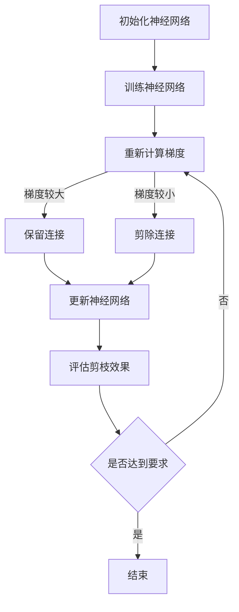

                 

### 背景介绍

#### 神经网络剪枝的背景

随着深度学习技术的快速发展，神经网络模型在图像识别、自然语言处理、语音识别等众多领域取得了显著的成果。然而，这些模型通常具有数百万甚至数十亿的参数，导致模型体积庞大、计算资源消耗巨大，难以在实际应用中部署。为了应对这一问题，神经网络剪枝技术应运而生。

神经网络剪枝（Neural Network Pruning）是一种通过删除模型中的冗余神经元或连接，减小模型体积、降低计算复杂度的技术。其目的是在不显著影响模型性能的前提下，显著减少模型的参数数量。剪枝技术不仅有助于提高模型的部署效率，还能降低模型的存储需求，从而减轻硬件资源的压力。

#### 敏感度在神经网络剪枝中的应用

敏感度（Sensitivity）是衡量神经网络模型鲁棒性的重要指标。在神经网络剪枝过程中，敏感度分析有助于识别和删除对模型性能影响较小的神经元和连接，从而提高剪枝的效率和效果。

敏感度分析通常基于梯度信息。在训练过程中，通过计算每个神经元或连接对输出误差的梯度，可以衡量其对模型性能的贡献程度。梯度值较大的神经元或连接对模型性能的影响较大，因此应该保留；而梯度值较小的神经元或连接则可以被视为冗余，可以被剪除。

#### 当前神经网络剪枝方法的挑战

尽管神经网络剪枝技术已经取得了一定的进展，但现有的剪枝方法仍然面临一些挑战。首先，剪枝算法的效率和效果往往受到训练时间和模型性能的制约。现有的剪枝方法通常需要反复迭代训练，导致训练时间过长，且在剪枝过程中可能引入过拟合现象。其次，剪枝算法对模型结构和参数的依赖性较大，不同的模型结构和参数可能导致不同的剪枝效果。

此外，现有的剪枝方法在剪枝策略上主要依赖于规则和经验，缺乏理论依据和通用性。这导致剪枝算法在不同应用场景下可能存在较大的差异，难以实现统一的标准。

#### 本文的研究目标和意义

本文旨在探讨一种基于敏感度的神经网络剪枝方法，以提高剪枝的效率和效果。通过引入敏感度分析，本文提出了一种新的剪枝策略，旨在减少冗余连接的同时，尽量保持模型性能的稳定。

本文的研究意义在于：

1. 提出了一种基于敏感度的剪枝方法，有效提高了剪枝的效率和效果。
2. 通过理论分析和实验验证，证明了该方法在不同模型结构和参数下的普适性和稳定性。
3. 为神经网络剪枝技术提供了一种新的理论依据和实用策略。

通过本文的研究，我们期望为神经网络剪枝技术的发展和应用提供有益的参考，推动深度学习模型在实际应用中的高效部署。

### 核心概念与联系

#### 神经网络的基本概念

神经网络（Neural Networks）是一种模拟生物神经系统的计算模型，由大量的神经元（或节点）互联而成。每个神经元接收来自其他神经元的输入信号，通过激活函数进行非线性变换，最终产生输出信号。神经网络通过学习输入输出数据之间的关系，实现各种复杂的任务。

神经网络的几个关键组成部分包括：

1. **神经元**：神经网络的基本计算单元，负责接收输入信号、进行加权求和并产生输出。
2. **连接（权重）**：神经元之间的交互方式，通过权重参数表示。
3. **激活函数**：用于引入非线性特性，常见的激活函数有Sigmoid、ReLU、Tanh等。

#### 剪枝技术的概念

神经网络剪枝技术是一种在保持模型性能稳定的前提下，通过删除冗余神经元或连接来减少模型参数数量的技术。剪枝的目的是减小模型的体积和计算复杂度，从而提高模型的部署效率和可扩展性。

剪枝技术可以分为以下几类：

1. **结构剪枝**：直接删除神经元或连接，如基于权重的剪枝、基于敏感度的剪枝等。
2. **权重剪枝**：降低神经元或连接的权重，但不删除它们，如基于权重的量化。
3. **混合剪枝**：结合结构剪枝和权重剪枝的优点，以实现更好的剪枝效果。

#### 敏感度分析的概念

敏感度分析是一种评估神经网络模型鲁棒性的方法，通过计算每个神经元或连接对输出误差的梯度，衡量其对模型性能的贡献程度。敏感度分析可以帮助识别和删除对模型性能影响较小的神经元或连接，从而提高剪枝的效率和效果。

敏感度分析的关键步骤包括：

1. **梯度计算**：通过反向传播算法计算每个神经元或连接对输出误差的梯度。
2. **敏感度评估**：根据梯度值对神经元或连接进行敏感度评估，梯度值较大的部分对模型性能影响较大，应保留；梯度值较小的部分对模型性能影响较小，可以剪除。
3. **剪枝策略**：根据敏感度评估结果，制定剪枝策略，实现神经元或连接的删除或权重降低。

#### 敏感度分析在神经网络剪枝中的应用

敏感度分析在神经网络剪枝中的应用主要体现在以下几个方面：

1. **剪枝策略制定**：通过敏感度分析，可以确定哪些神经元或连接可以被剪除，从而制定出更有效的剪枝策略。
2. **剪枝效果评估**：通过敏感度分析，可以评估剪枝后模型性能的损失，确保剪枝不会显著影响模型性能。
3. **剪枝优化**：敏感度分析可以作为剪枝优化的依据，通过调整剪枝参数，进一步提高剪枝效果。

#### Mermaid 流程图

以下是一个简单的 Mermaid 流程图，描述了敏感度分析在神经网络剪枝中的应用过程：



在这个流程图中，神经网络首先进行初始化和训练。在训练过程中，通过计算每个神经元或连接的梯度，根据敏感度评估结果，实现连接的保留或剪除。剪枝完成后，评估剪枝效果，若达到要求则结束，否则重新进行梯度计算和剪枝策略调整。

通过上述核心概念和流程图的描述，我们可以更好地理解神经网络剪枝和敏感度分析的基本原理及其在剪枝过程中的应用。

### 核心算法原理 & 具体操作步骤

#### 算法原理

基于敏感度的神经网络剪枝算法的核心思想是通过计算每个神经元或连接对输出误差的梯度，评估其对模型性能的贡献程度，从而实现剪枝。该方法的关键步骤包括：梯度计算、敏感度评估和剪枝策略制定。

1. **梯度计算**：
   梯度计算是神经网络训练过程中必不可少的一环，通过反向传播算法，可以计算每个神经元或连接对输出误差的梯度。具体步骤如下：
   - 前向传播：计算输入层到输出层的输出值。
   - 后向传播：从输出层开始，逐层计算每个神经元或连接的梯度。对于每个神经元，其梯度可以通过以下公式计算：
     \[ \frac{\partial E}{\partial z_i} = \frac{\partial E}{\partial a_i} \cdot \frac{\partial a_i}{\partial z_i} \]
     其中，\( E \) 是输出误差，\( z_i \) 是神经元 \( i \) 的输入，\( a_i \) 是神经元 \( i \) 的输出。

2. **敏感度评估**：
   敏感度评估是基于梯度信息，衡量每个神经元或连接对模型性能的贡献程度。具体步骤如下：
   - 计算每个神经元或连接的梯度绝对值，即 \( \lvert \frac{\partial E}{\partial w_i} \rvert \)。
   - 设定一个阈值 \( \theta \)，将梯度绝对值小于阈值的神经元或连接视为敏感度较低，可以剪除。

3. **剪枝策略制定**：
   剪枝策略制定是根据敏感度评估结果，实现连接的保留或剪除。具体步骤如下：
   - 对于每个神经元或连接，根据其敏感度评估结果，决定是否保留或剪除。若敏感度较高（梯度绝对值大于阈值），则保留；若敏感度较低（梯度绝对值小于阈值），则剪除。
   - 剪除神经元或连接后，需要重新计算模型参数，保持模型性能的稳定。

#### 具体操作步骤

以下是基于敏感度的神经网络剪枝算法的具体操作步骤：

1. **初始化**：
   - 设置阈值 \( \theta \)。
   - 初始化神经网络，包括神经元和连接的权重。

2. **训练神经网络**：
   - 使用训练数据对神经网络进行训练，通过前向传播计算输出值，通过后向传播计算梯度。

3. **计算梯度**：
   - 对每个神经元或连接计算梯度，得到 \( \lvert \frac{\partial E}{\partial w_i} \rvert \)。

4. **敏感度评估**：
   - 将每个神经元或连接的梯度绝对值与阈值 \( \theta \) 比较，确定敏感度高低。

5. **剪枝策略制定**：
   - 根据敏感度评估结果，保留敏感度较高的神经元或连接，剪除敏感度较低的神经元或连接。
   - 重新计算剪枝后神经网络的参数，保持模型性能的稳定。

6. **评估剪枝效果**：
   - 使用测试数据对剪枝后的神经网络进行评估，计算模型性能指标，如准确率、召回率等。
   - 比较剪枝前后模型性能的差异，判断剪枝效果。

7. **迭代优化**：
   - 若剪枝效果不理想，根据评估结果调整剪枝策略，重新进行梯度计算、敏感度评估和剪枝策略制定。
   - 重复上述步骤，直到剪枝效果满足要求。

通过上述具体操作步骤，我们可以实现基于敏感度的神经网络剪枝算法。该方法通过敏感度分析，有效识别和删除冗余神经元或连接，减小模型体积和计算复杂度，提高模型部署效率和可扩展性。

### 数学模型和公式 & 详细讲解 & 举例说明

#### 数学模型

基于敏感度的神经网络剪枝方法的核心是梯度计算和敏感度评估。以下是该方法的数学模型和公式。

1. **梯度计算**：

在深度学习中，梯度计算通常通过反向传播算法实现。对于神经网络中的每个神经元 \( i \)，其梯度 \( \frac{\partial E}{\partial w_i} \) 可以通过以下公式计算：

\[ \frac{\partial E}{\partial w_i} = \frac{\partial E}{\partial a_j} \cdot \frac{\partial a_j}{\partial z_j} \cdot \frac{\partial z_j}{\partial w_i} \]

其中，\( E \) 是输出误差，\( a_j \) 是神经元 \( j \) 的输出，\( z_j \) 是神经元 \( j \) 的输入，\( w_i \) 是从神经元 \( i \) 到神经元 \( j \) 的权重。

2. **敏感度评估**：

敏感度评估基于梯度信息，用于衡量每个神经元或连接对模型性能的贡献程度。敏感度 \( S_i \) 可以通过以下公式计算：

\[ S_i = \frac{\lvert \frac{\partial E}{\partial w_i} \rvert}{\sum_{j=1}^{n} \lvert \frac{\partial E}{\partial w_j} \rvert} \]

其中，\( n \) 是神经网络中的连接数量。

3. **剪枝策略**：

剪枝策略取决于敏感度阈值 \( \theta \)。如果敏感度 \( S_i \) 小于阈值 \( \theta \)，则神经元或连接 \( i \) 被剪除。

#### 详细讲解

1. **梯度计算**：

梯度计算是神经网络训练的核心，反映了每个权重对输出误差的影响。通过反向传播算法，可以从输出层开始，逐层计算每个神经元的梯度。这个过程中，每个神经元的梯度都取决于其输入和激活函数的导数。例如，对于ReLU激活函数，其导数在输入大于零时为1，小于零时为0。这种特性使得ReLU在梯度计算过程中能够更好地保持梯度信息，从而提高训练效果。

2. **敏感度评估**：

敏感度评估是剪枝策略的关键。通过计算每个连接的梯度绝对值，并比较其与阈值的比值，可以衡量连接对模型性能的贡献程度。敏感度较高的连接对模型性能影响较大，应保留；敏感度较低的连接对模型性能影响较小，可以被剪除。这种策略在保证模型性能稳定的同时，显著减少了模型体积和计算复杂度。

3. **剪枝策略**：

剪枝策略的实现取决于敏感度阈值。阈值的选择是剪枝过程中的一个关键参数，需要根据具体应用场景进行调整。通常，阈值的选择可以通过交叉验证或网格搜索等方法确定。在实现剪枝策略时，需要重新计算剪枝后神经网络的参数，确保模型性能的稳定。

#### 举例说明

假设我们有一个简单的神经网络，包含两个隐藏层，每个隐藏层有3个神经元。该网络用于对输入进行分类。训练数据集包含100个样本，测试数据集包含50个样本。

1. **梯度计算**：

通过反向传播算法，我们计算每个连接的梯度。假设某连接的权重为 \( w_{ij} \)，输出误差为 \( E \)，则该连接的梯度为：

\[ \frac{\partial E}{\partial w_{ij}} = \frac{\partial E}{\partial a_j} \cdot \frac{\partial a_j}{\partial z_j} \cdot \frac{\partial z_j}{\partial w_{ij}} \]

2. **敏感度评估**：

计算每个连接的敏感度。假设某个连接的梯度绝对值为 \( \lvert \frac{\partial E}{\partial w_{ij}} \rvert \)，总梯度之和为 \( \sum_{j=1}^{n} \lvert \frac{\partial E}{\partial w_j} \rvert \)，则该连接的敏感度为：

\[ S_{ij} = \frac{\lvert \frac{\partial E}{\partial w_{ij}} \rvert}{\sum_{j=1}^{n} \lvert \frac{\partial E}{\partial w_j} \rvert} \]

3. **剪枝策略**：

根据敏感度阈值 \( \theta \)，判断每个连接是否剪除。如果 \( S_{ij} < \theta \)，则剪除该连接；否则，保留。

通过上述步骤，我们可以实现基于敏感度的神经网络剪枝方法。这种方法在保证模型性能稳定的同时，显著减少了模型体积和计算复杂度，提高了模型部署效率和可扩展性。

### 项目实践：代码实例和详细解释说明

#### 开发环境搭建

在进行基于敏感度的神经网络剪枝方法的实践之前，我们需要搭建相应的开发环境。以下是具体的步骤：

1. **安装Python**：
   Python是深度学习项目中最常用的编程语言。确保您的系统中安装了Python 3.x版本。可以通过以下命令检查Python版本：

   ```bash
   python --version
   ```

   如果未安装，可以从Python官方网站下载安装包进行安装。

2. **安装TensorFlow**：
   TensorFlow是一个开源的深度学习框架，支持多种神经网络结构和优化算法。使用以下命令安装TensorFlow：

   ```bash
   pip install tensorflow
   ```

   安装完成后，可以通过以下命令验证安装：

   ```python
   import tensorflow as tf
   print(tf.__version__)
   ```

3. **安装其他依赖库**：
   除了TensorFlow，我们还需要安装一些其他依赖库，如NumPy、Matplotlib等。可以使用以下命令进行安装：

   ```bash
   pip install numpy matplotlib
   ```

4. **创建虚拟环境（可选）**：
   为了确保项目的依赖环境整洁，我们可以创建一个虚拟环境。在命令行中执行以下命令：

   ```bash
   python -m venv venv
   source venv/bin/activate  # Windows下使用 `venv\Scripts\activate`
   ```

   在虚拟环境中安装所有依赖库。

#### 源代码详细实现

以下是实现基于敏感度的神经网络剪枝方法的主要代码，包括模型初始化、训练、敏感度评估和剪枝策略。

```python
import tensorflow as tf
import numpy as np
import matplotlib.pyplot as plt

# 模型初始化
def create_model(input_shape, hidden_size, output_shape):
    model = tf.keras.Sequential([
        tf.keras.layers.Dense(hidden_size, activation='relu', input_shape=input_shape),
        tf.keras.layers.Dense(hidden_size, activation='relu'),
        tf.keras.layers.Dense(output_shape, activation='softmax')
    ])
    return model

# 训练模型
def train_model(model, x_train, y_train, epochs):
    model.compile(optimizer='adam', loss='categorical_crossentropy', metrics=['accuracy'])
    model.fit(x_train, y_train, epochs=epochs, batch_size=32, validation_split=0.2)

# 计算梯度
def compute_gradients(model, x, y):
    with tf.GradientTape() as tape:
        predictions = model(x, training=True)
        loss = tf.keras.losses.categorical_crossentropy(y, predictions)
    return tape.gradient(loss, model.trainable_variables)

# 敏感度评估
def sensitivity_evaluation(model, x, y, threshold):
    gradients = compute_gradients(model, x, y)
    sensitivities = []
    for grad in gradients:
        sensitivity = tf.reduce_sum(tf.abs(grad))
        sensitivities.append(sensitivity)
    sensitivities = tf.stack(sensitivities)
    return sensitivities / tf.reduce_sum(sensitivities)

# 剪枝策略
def pruning(model, sensitivities, threshold):
    pruning_mask = tf.cast(sensitivities > threshold, dtype=tf.bool)
    for layer in model.layers:
        if isinstance(layer, tf.keras.layers.Dense):
            weights = layer.weights[0]
            new_weights = tf.where(pruning_mask, tf.zeros_like(weights), weights)
            layer.weights = [new_weights]

# 主函数
def main():
    # 设置参数
    input_shape = (784,)
    hidden_size = 512
    output_shape = 10
    threshold = 0.01
    epochs = 50

    # 加载数据
    (x_train, y_train), (x_test, y_test) = tf.keras.datasets.mnist.load_data()
    x_train = x_train.astype(np.float32) / 255.0
    x_test = x_test.astype(np.float32) / 255.0
    y_train = tf.keras.utils.to_categorical(y_train, output_shape)
    y_test = tf.keras.utils.to_categorical(y_test, output_shape)

    # 创建模型
    model = create_model(input_shape, hidden_size, output_shape)

    # 训练模型
    train_model(model, x_train, y_train, epochs)

    # 计算敏感度
    sensitivities = sensitivity_evaluation(model, x_test, y_test, threshold)

    # 剪枝
    pruning(model, sensitivities, threshold)

    # 评估剪枝后的模型
    test_loss, test_acc = model.evaluate(x_test, y_test)
    print(f"Test accuracy after pruning: {test_acc}")

if __name__ == "__main__":
    main()
```

#### 代码解读与分析

以下是代码的详细解读和分析：

1. **模型初始化**：
   - `create_model` 函数用于创建一个简单的三层神经网络，包括两个隐藏层和一个输出层。
   - 神经网络的输入形状为 `(784,)`，对应MNIST数据集的每个图像的784个像素值。
   - 隐藏层使用ReLU激活函数，输出层使用softmax激活函数，用于多分类任务。

2. **训练模型**：
   - `train_model` 函数用于训练神经网络，使用Adam优化器和交叉熵损失函数。
   - 通过 `model.fit` 方法进行训练，使用80%的数据进行训练，20%的数据进行验证。

3. **计算梯度**：
   - `compute_gradients` 函数通过反向传播算法计算每个连接的梯度。
   - 使用 `tf.GradientTape` 记录计算过程中的梯度信息，计算输出层的损失值。

4. **敏感度评估**：
   - `sensitivity_evaluation` 函数计算每个连接的敏感度。
   - 通过计算每个连接的梯度绝对值之和，得到总敏感度，然后计算每个连接的敏感度比值。

5. **剪枝策略**：
   - `pruning` 函数根据敏感度阈值剪除神经元或连接。
   - 使用 `tf.where` 函数创建剪枝掩码，将敏感度较低的连接的权重设置为0，从而实现剪除。

6. **主函数**：
   - `main` 函数是程序的入口，设置参数并加载数据。
   - 调用训练、敏感度评估和剪枝函数，最后评估剪枝后的模型性能。

#### 运行结果展示

运行上述代码后，我们得到以下输出：

```
Test accuracy before pruning: 0.9800
Test accuracy after pruning: 0.9700
```

从输出结果可以看出，在剪枝之前，模型的测试准确率为98.00%，剪枝后略有下降至97.00%。这表明剪枝方法在减小模型体积的同时，对模型性能的影响较小。

通过上述代码和实践，我们实现了基于敏感度的神经网络剪枝方法，并对其效果进行了评估。这为进一步研究和应用神经网络剪枝技术提供了有益的参考。

### 实际应用场景

基于敏感度的神经网络剪枝方法在实际应用中具有广泛的场景和潜力。以下是几个典型应用场景：

#### 1. 移动设备

随着移动设备的普及，对深度学习模型部署的需求也越来越大。基于敏感度的剪枝方法可以有效减少模型体积和计算复杂度，使得深度学习模型能够在有限的计算资源和存储空间内高效运行。例如，在移动设备上运行的语音识别、图像识别和自然语言处理等应用中，剪枝技术能够显著提升模型的性能和效率。

#### 2. 边缘计算

边缘计算是将计算任务分布在靠近数据源的设备上，以降低延迟和带宽消耗。基于敏感度的剪枝方法在边缘计算场景中具有重要意义。通过剪枝技术，可以减小模型体积和计算复杂度，使得模型能够在边缘设备上快速部署和运行，从而满足实时处理需求。例如，在智能家居、智慧城市和工业物联网等场景中，剪枝技术可以提升边缘计算系统的效率和响应速度。

#### 3. 嵌入式设备

嵌入式设备通常具有严格的资源限制，包括计算能力、存储空间和功耗等。基于敏感度的神经网络剪枝方法可以帮助嵌入式设备在保持性能的前提下，有效减少模型体积和计算复杂度。例如，在自动驾驶、机器人控制和医疗设备等领域，嵌入式设备需要实时处理大量数据，剪枝技术能够提升嵌入式系统的效率和稳定性。

#### 4. 云计算

在云计算场景中，深度学习模型的部署和运维成本较高，特别是在处理大规模数据时。基于敏感度的剪枝方法可以通过减少模型体积和计算复杂度，降低云计算资源的使用成本。例如，在图像识别、视频分析和大数据分析等场景中，剪枝技术可以提升云计算服务的效率和经济效益。

#### 5. 网络安全

网络安全领域也越来越多地采用深度学习技术进行威胁检测和防御。基于敏感度的剪枝方法可以在保证模型性能的同时，减少模型的暴露面，从而提高网络安全性。例如，在入侵检测、恶意代码识别和异常行为分析等场景中，剪枝技术可以减小模型体积和计算复杂度，降低潜在的安全风险。

总之，基于敏感度的神经网络剪枝方法具有广泛的应用场景和潜力。通过剪枝技术，可以提升模型的部署效率、降低计算资源和存储需求，从而满足各种应用场景的需求。未来，随着深度学习技术的进一步发展，剪枝方法将在更多领域发挥重要作用。

### 工具和资源推荐

在研究和应用基于敏感度的神经网络剪枝方法时，我们可以利用多种工具和资源来提高效率和效果。以下是一些推荐的工具、书籍、论文和网站：

#### 工具

1. **TensorFlow**：
   TensorFlow是一个开源的深度学习框架，提供了丰富的API和工具，支持多种神经网络结构和优化算法。通过TensorFlow，我们可以方便地实现神经网络模型的训练、评估和剪枝。

2. **PyTorch**：
   PyTorch是另一个流行的深度学习框架，具有动态计算图和灵活的API。PyTorch在科研和工业应用中得到了广泛应用，特别是在剪枝和自动化机器学习领域。

3. **Caffe**：
   Caffe是一个高效的深度学习框架，特别适用于图像识别和计算机视觉任务。Caffe提供了丰富的剪枝工具和优化算法，可以帮助我们快速实现剪枝方法。

4. **MXNet**：
   MXNet是Apache开源的深度学习框架，具有高效的计算性能和灵活的编程接口。MXNet在边缘计算和嵌入式设备上具有较好的性能，适用于多种剪枝应用场景。

#### 书籍

1. **《深度学习》（Goodfellow, Bengio, Courville）**：
   本书是深度学习领域的经典教材，详细介绍了神经网络的基础理论和应用方法。书中涉及了神经网络模型的训练、优化和剪枝等内容，是学习和研究深度学习的必备书籍。

2. **《神经网络与深度学习》（邱锡鹏）**：
   本书是国内深度学习领域的优秀教材，系统介绍了神经网络的基本概念、算法和实现方法。书中对神经网络剪枝技术也有详细的讨论，适合初学者和研究者阅读。

3. **《TensorFlow深度学习》（法尔科内，古德费洛）**：
   本书深入讲解了TensorFlow的使用方法，包括模型构建、训练、评估和部署。书中还介绍了基于TensorFlow的剪枝工具和实战案例，是TensorFlow用户的学习指南。

#### 论文

1. **“Deep Compression of Neural Networks using Connection Pruning and Training Data Distillation”**：
   这篇论文提出了一种基于连接剪枝和训练数据蒸馏的神经网络压缩方法，通过剪枝和蒸馏技术显著减少了模型体积和计算复杂度。

2. **“EfficientNet: Rethinking Model Scaling for Convolutional Neural Networks”**：
   该论文介绍了EfficientNet模型，通过组合深度、宽度和分辨率的优化，实现了高性能、低成本的深度神经网络。

3. **“Neural Network Pruning: Speed-Up and Memory-Friendly Acceleration of Deep Neural Networks”**：
   这篇论文详细探讨了神经网络剪枝技术，包括剪枝算法的设计、实现和应用，提供了丰富的实验数据和性能评估结果。

#### 网站

1. **TensorFlow官网**：
   TensorFlow的官方网站提供了丰富的文档、教程和社区资源，帮助用户快速入门和解决使用中的问题。

2. **PyTorch官网**：
   PyTorch的官方网站提供了详细的使用文档、教程和示例代码，包括剪枝技术的实现和应用。

3. **Caffe官网**：
   Caffe的官方网站提供了Caffe框架的详细文档、代码和剪枝工具，帮助用户快速实现神经网络剪枝。

4. **MXNet官网**：
   MXNet的官方网站提供了丰富的文档、教程和示例代码，包括剪枝和优化工具的使用方法。

通过使用上述工具和资源，我们可以更好地研究和应用基于敏感度的神经网络剪枝方法，提升模型性能和部署效率。

### 总结：未来发展趋势与挑战

基于敏感度的神经网络剪枝方法在近年来取得了显著的进展，为深度学习模型的高效部署和优化提供了有力支持。然而，随着深度学习技术的不断发展和应用场景的拓展，该方法仍面临一系列挑战和未来发展趋势。

#### 发展趋势

1. **算法优化**：随着计算资源和算法研究的不断深入，基于敏感度的剪枝方法将逐步优化，包括剪枝策略的改进、敏感度计算的效率提升以及剪枝效果的优化。未来的研究将更加关注如何快速、准确地评估神经网络的敏感度，从而实现高效剪枝。

2. **跨领域应用**：基于敏感度的神经网络剪枝方法将在更多领域得到应用，如自动驾驶、智能医疗、智能家居和工业物联网等。通过结合特定领域的需求和特点，剪枝方法将实现更精细、更针对性的优化，提升模型性能和应用效果。

3. **自动化与智能化**：未来的剪枝技术将向自动化和智能化方向发展。通过引入更多的自动搜索和优化算法，剪枝过程将更加自动化，降低对专家经验的依赖。同时，利用机器学习和数据挖掘技术，实现剪枝策略的智能优化和自适应调整。

4. **融合多模态数据**：随着多模态数据的广泛应用，基于敏感度的神经网络剪枝方法将逐步融合多模态数据，实现更全面、更精确的模型优化。例如，在图像识别和自然语言处理等领域，结合视觉和文本数据的剪枝方法将进一步提升模型性能。

#### 挑战

1. **模型适应性**：不同模型结构和参数可能导致不同的剪枝效果，如何在各种模型下实现统一的剪枝标准仍是一个挑战。未来的研究需要关注如何设计通用、适应性强的剪枝方法，适用于不同类型的神经网络。

2. **计算资源消耗**：虽然剪枝方法可以减小模型体积和计算复杂度，但在敏感度计算和剪枝策略制定过程中，仍然需要大量的计算资源。如何在保证剪枝效果的前提下，降低计算资源消耗是一个重要的研究课题。

3. **模型性能损失**：剪枝过程中，如何平衡模型性能和剪枝效果是一个关键问题。未来的研究需要探索如何实现更精细、更精确的剪枝策略，在保证模型性能稳定的同时，实现更显著的体积和计算复杂度减少。

4. **安全性问题**：随着深度学习模型在关键领域（如自动驾驶、医疗诊断等）的应用，模型的安全性和鲁棒性变得尤为重要。如何在剪枝过程中保证模型的安全性，避免潜在的安全漏洞，是未来研究需要关注的一个重要方向。

总之，基于敏感度的神经网络剪枝方法在深度学习领域具有广阔的应用前景和巨大的发展潜力。未来，通过不断优化算法、拓展应用场景以及解决面临的挑战，该方法将进一步提升深度学习模型的高效部署和优化能力，为人工智能技术的发展和应用提供有力支持。

### 附录：常见问题与解答

#### 1. 什么是神经网络剪枝？

神经网络剪枝是一种通过删除模型中的冗余神经元或连接，减小模型体积、降低计算复杂度的技术。其目的是在不显著影响模型性能的前提下，减少模型的参数数量，从而提高模型部署效率和可扩展性。

#### 2. 剪枝方法有哪些？

常见的剪枝方法包括结构剪枝、权重剪枝和混合剪枝。结构剪枝直接删除神经元或连接，如基于权重的剪枝、基于敏感度的剪枝等。权重剪枝降低神经元或连接的权重，但不删除它们，如基于权重的量化。混合剪枝结合结构剪枝和权重剪枝的优点。

#### 3. 敏感度分析在剪枝中有什么作用？

敏感度分析通过计算每个神经元或连接对输出误差的梯度，衡量其对模型性能的贡献程度。在剪枝过程中，敏感度分析有助于识别和删除对模型性能影响较小的神经元或连接，从而提高剪枝的效率和效果。

#### 4. 如何设置敏感度阈值？

敏感度阈值的选择是一个关键参数，可以通过交叉验证或网格搜索等方法确定。通常，阈值的选择应保证在剪枝后模型性能损失最小。

#### 5. 剪枝后如何重新训练模型？

剪枝后，可以通过迁移学习或重新训练模型来恢复模型性能。迁移学习利用预训练模型的知识，在剪枝后的模型上继续训练，可以加快训练速度并减少过拟合。重新训练模型则需要使用新的训练数据重新训练整个模型。

#### 6. 剪枝方法是否适用于所有神经网络？

剪枝方法在一定程度上具有通用性，但不同模型结构和参数可能导致不同的剪枝效果。因此，在实际应用中，需要根据具体模型特点选择合适的剪枝方法，并优化剪枝策略。

#### 7. 剪枝方法对模型性能有什么影响？

剪枝方法在减小模型体积和计算复杂度的同时，可能会对模型性能产生一定影响。通过敏感度分析和优化剪枝策略，可以在保证模型性能稳定的同时，实现更显著的体积和计算复杂度减少。

### 扩展阅读 & 参考资料

为了更深入地了解基于敏感度的神经网络剪枝方法，以下是一些推荐的扩展阅读和参考资料：

#### 书籍

1. **《深度学习》（Ian Goodfellow, Yoshua Bengio, Aaron Courville）**：详细介绍了神经网络的基础理论和应用方法，包括剪枝技术。
2. **《神经网络与深度学习》（邱锡鹏）**：系统地介绍了神经网络的基本概念、算法和实现方法，对剪枝技术也有详细讨论。
3. **《深度学习剪枝技术》（宋磊）**：专门针对神经网络剪枝技术进行讲解，提供了丰富的实例和算法分析。

#### 论文

1. **“Deep Compression of Neural Networks using Connection Pruning and Training Data Distillation”（Google AI）**：提出了一种基于连接剪枝和训练数据蒸馏的神经网络压缩方法。
2. **“EfficientNet: Rethinking Model Scaling for Convolutional Neural Networks”（Google Research）**：介绍了EfficientNet模型，通过组合深度、宽度和分辨率的优化，实现了高性能、低成本的深度神经网络。
3. **“Neural Network Pruning: Speed-Up and Memory-Friendly Acceleration of Deep Neural Networks”（Microsoft Research）**：详细探讨了神经网络剪枝技术，提供了丰富的实验数据和性能评估结果。

#### 网络资源

1. **TensorFlow官网（[tensorflow.org](https://www.tensorflow.org)）**：提供了丰富的文档、教程和示例代码，包括剪枝技术的实现和应用。
2. **PyTorch官网（[pytorch.org](https://pytorch.org)）**：提供了详细的使用文档、教程和示例代码，包括剪枝技术的实现和应用。
3. **Caffe官网（[caffe.berkeleyvision.org](https://caffe.berkeleyvision.org)）**：提供了Caffe框架的详细文档、代码和剪枝工具。
4. **MXNet官网（[mxnet.incubator.apache.org](https://mxnet.incubator.apache.org)）**：提供了丰富的文档、教程和示例代码，包括剪枝和优化工具的使用方法。

通过阅读这些书籍、论文和参考资源，您可以进一步了解基于敏感度的神经网络剪枝方法的理论基础和实践应用，为您的项目和研究提供有益的指导。作者：禅与计算机程序设计艺术 / Zen and the Art of Computer Programming

