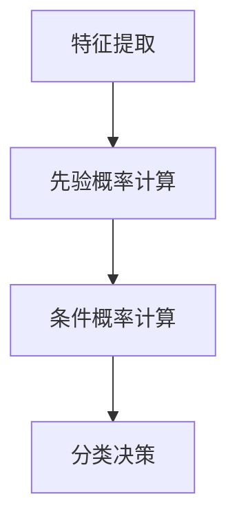

                 

### 1. 背景介绍

#### 1.1 淘宝评论的重要性

淘宝作为中国最大的在线购物平台，每天吸引着数以百万计的用户前来浏览和购买商品。这些用户在购买商品后往往会留下大量的评论，这些评论不仅是对商品的评价，也是对购物体验的反馈。因此，淘宝评论的分析变得尤为重要。

评论分析的意义在于，通过对评论内容的分析，可以了解用户的真实购物体验，发现商品和店铺的优点和不足，从而帮助商家改进服务质量，提升用户体验。同时，评论分析还可以为其他潜在消费者提供参考，帮助他们做出更明智的购物决策。

#### 1.2 数据分析在电商行业中的应用

随着互联网和大数据技术的发展，数据分析在电商行业中得到了广泛的应用。通过对海量数据的分析，可以挖掘出用户的行为模式、消费偏好，从而实现精准营销和个性化推荐。在淘宝平台上，数据分析已经成为商家提升竞争力的关键手段。

淘宝评论分析就是其中的一种重要应用。通过对评论数据的挖掘和分析，可以识别出哪些商品和店铺最受用户喜爱，哪些方面需要改进，从而帮助商家做出更科学的经营决策。

#### 1.3 朴素贝叶斯在评论分析中的应用

朴素贝叶斯是一种基于概率论的分类算法，广泛应用于文本分类、情感分析等领域。在淘宝评论分析中，朴素贝叶斯算法被用来识别评论的情感倾向，即判断评论是正面、中性还是负面。

朴素贝叶斯算法的优点在于其简单易用，计算速度快，且不需要大量的训练数据。这使得它在电商评论分析中具有很高的实用价值。

#### 1.4 本文结构

本文将分为以下几个部分：

- 第1部分：介绍淘宝评论分析的重要性，以及数据分析在电商行业中的应用。
- 第2部分：详细解释朴素贝叶斯算法的原理和应用。
- 第3部分：介绍如何使用朴素贝叶斯算法进行淘宝评论的情感分析。
- 第4部分：通过实际案例展示如何实现淘宝评论的情感分析。
- 第5部分：总结本文内容，并展望未来的发展趋势。

### 2. 核心概念与联系

#### 2.1 朴素贝叶斯算法概述

朴素贝叶斯（Naive Bayes）是一种基于贝叶斯定理的简单概率分类器。其核心思想是，通过已知特征概率分布，计算出目标类别的概率，并根据最大概率原则进行分类。

朴素贝叶斯算法的特点是假设特征之间相互独立，即一个特征的出现不受其他特征的影响。这种假设虽然在现实世界中并不总是成立，但由于其计算简单，在实际应用中仍然表现出很好的效果。

#### 2.2 贝叶斯定理

贝叶斯定理是朴素贝叶斯算法的理论基础。贝叶斯定理描述了后验概率和先验概率之间的关系，其数学表达式为：

$$P(A|B) = \frac{P(B|A)P(A)}{P(B)}$$

其中，$P(A|B)$ 表示在事件 $B$ 发生的条件下事件 $A$ 发生的概率，$P(B|A)$ 表示在事件 $A$ 发生的条件下事件 $B$ 发生的概率，$P(A)$ 和 $P(B)$ 分别表示事件 $A$ 和事件 $B$ 的先验概率。

#### 2.3 朴素贝叶斯算法步骤

朴素贝叶斯算法的基本步骤如下：

1. **特征提取**：从评论文本中提取特征词。
2. **先验概率计算**：计算每个类别（正面、中性、负面）的先验概率。
3. **条件概率计算**：计算每个特征词在各个类别下的条件概率。
4. **分类决策**：根据最大后验概率原则，将评论分类到相应的类别。

#### 2.4 Mermaid 流程图

以下是一个简单的 Mermaid 流程图，展示了朴素贝叶斯算法的核心概念和流程：



### 3. 核心算法原理 & 具体操作步骤

#### 3.1 特征提取

特征提取是评论情感分析的第一步。我们需要从原始评论文本中提取出具有区分度的特征词。这些特征词将用于后续的贝叶斯分类。

特征提取的方法有很多，常见的有：

- **词袋模型**：将评论文本转化为词汇表，每个词作为一个特征。
- **TF-IDF**：计算词在评论中的重要性，综合考虑词频（TF）和文档频率（IDF）。
- **Word2Vec**：将文本中的每个词映射为一个高维向量。

在本文中，我们采用词袋模型和TF-IDF相结合的方法进行特征提取。

#### 3.2 先验概率计算

先验概率是指在没有新证据的情况下，我们对类别发生概率的估计。在评论情感分析中，先验概率表示正面、中性和负面类别的初始概率。

假设我们有三类评论：正面（P）、中性（N）和负面（N）。我们可以通过统计评论数量来计算先验概率：

$$P(P) = \frac{N(P)}{N(P) + N(N) + N(N)}$$
$$P(N) = \frac{N(N)}{N(P) + N(N) + N(N)}$$
$$P(N) = \frac{N(N)}{N(P) + N(N) + N(N)}$$

其中，$N(P)$、$N(N)$ 和 $N(N)$ 分别表示正面、中性和负面评论的数量。

#### 3.3 条件概率计算

条件概率表示在某个类别已知的条件下，某个特征词出现的概率。条件概率的计算需要用到词频和文档频率。

假设我们有一个特征词 $w$，它在正面评论中出现的次数为 $f_w^P$，在中性评论中出现的次数为 $f_w^N$，在负面评论中出现的次数为 $f_w^N$。评论总数为 $N$。

$$P(w|P) = \frac{f_w^P + 1}{N(P) + V}$$
$$P(w|N) = \frac{f_w^N + 1}{N(N) + V}$$
$$P(w|N) = \frac{f_w^N + 1}{N(N) + V}$$

其中，$V$ 是一个常数，用于防止分母为零。

#### 3.4 分类决策

分类决策是基于最大后验概率原则进行的。假设我们有一个新的评论，其特征词集合为 $W$。我们需要计算该评论属于正面、中性和负面类别的后验概率，并选择概率最大的类别作为分类结果。

$$P(P|W) = \frac{P(P) \cdot P(W|P)}{P(W)}$$
$$P(N|W) = \frac{P(N) \cdot P(W|N)}{P(W)}$$
$$P(N|W) = \frac{P(N) \cdot P(W|N)}{P(W)}$$

其中，$P(W)$ 是一个 normalization constant，用于确保后验概率之和为1。

分类决策的具体步骤如下：

1. 对于每个类别 $C$，计算 $P(C|W)$。
2. 选择 $P(W)$ 中最大的类别作为分类结果。

### 4. 数学模型和公式 & 详细讲解 & 举例说明

#### 4.1 数学模型

在评论情感分析中，朴素贝叶斯算法的核心数学模型是基于贝叶斯定理。贝叶斯定理的公式为：

$$P(A|B) = \frac{P(B|A)P(A)}{P(B)}$$

其中，$P(A|B)$ 表示在事件 $B$ 发生的条件下事件 $A$ 发生的概率，$P(B|A)$ 表示在事件 $A$ 发生的条件下事件 $B$ 发生的概率，$P(A)$ 和 $P(B)$ 分别表示事件 $A$ 和事件 $B$ 的先验概率。

在评论情感分析中，我们可以将事件 $A$ 视为评论属于某个情感类别（正面、中性、负面），事件 $B$ 视为评论中包含某个特征词。

#### 4.2 详细讲解

朴素贝叶斯算法的数学模型可以分为以下几个部分：

1. **先验概率**：先验概率是指在没有新证据的情况下，我们对类别发生概率的估计。在评论情感分析中，先验概率表示正面、中性和负面类别的初始概率。

   $$P(P) = \frac{N(P)}{N(P) + N(N) + N(N)}$$
   $$P(N) = \frac{N(N)}{N(P) + N(N) + N(N)}$$
   $$P(N) = \frac{N(N)}{N(P) + N(N) + N(N)}$$

   其中，$N(P)$、$N(N)$ 和 $N(N)$ 分别表示正面、中性和负面评论的数量。

2. **条件概率**：条件概率表示在某个类别已知的条件下，某个特征词出现的概率。条件概率的计算需要用到词频和文档频率。

   $$P(w|P) = \frac{f_w^P + 1}{N(P) + V}$$
   $$P(w|N) = \frac{f_w^N + 1}{N(N) + V}$$
   $$P(w|N) = \frac{f_w^N + 1}{N(N) + V}$$

   其中，$f_w^P$、$f_w^N$ 和 $f_w^N$ 分别表示特征词 $w$ 在正面、中性、负面评论中出现的次数，$V$ 是一个常数，用于防止分母为零。

3. **后验概率**：后验概率表示在已知特征词集合的条件下，评论属于某个情感类别的概率。

   $$P(P|W) = \frac{P(P) \cdot P(W|P)}{P(W)}$$
   $$P(N|W) = \frac{P(N) \cdot P(W|N)}{P(W)}$$
   $$P(N|W) = \frac{P(N) \cdot P(W|N)}{P(W)}$$

   其中，$W$ 是特征词集合，$P(W)$ 是一个 normalization constant，用于确保后验概率之和为1。

4. **分类决策**：分类决策是基于最大后验概率原则进行的。假设我们有一个新的评论，其特征词集合为 $W$。我们需要计算该评论属于正面、中性和负面类别的后验概率，并选择概率最大的类别作为分类结果。

   $$\hat{C} = \arg\max_C P(C|W)$$

   其中，$\hat{C}$ 表示分类结果，$C$ 表示类别。

#### 4.3 举例说明

假设我们有一个评论：“这个商品很好，价格实惠，非常满意。”我们需要判断这个评论的情感类别。

1. **特征提取**：首先，我们需要从评论中提取特征词。假设我们提取到的特征词为：“商品”、“很好”、“价格”、“实惠”、“满意”。

2. **先验概率**：根据评论数量，我们可以计算先验概率。假设正面、中性、负面评论的数量分别为1000、500、400，则有：

   $$P(P) = \frac{1000}{1000 + 500 + 400} = 0.556$$
   $$P(N) = \frac{500}{1000 + 500 + 400} = 0.278$$
   $$P(N) = \frac{400}{1000 + 500 + 400} = 0.222$$

3. **条件概率**：接下来，我们需要计算每个特征词在正面、中性、负面评论中的条件概率。假设特征词在评论中的词频如下：

   | 特征词 | 商品 | 很好 | 价格 | 实惠 | 满意 |
   | ------ | ---- | ---- | ---- | ---- | ---- |
   | $f_w^P$ | 20 | 10 | 5 | 10 | 5 |
   | $f_w^N$ | 10 | 5 | 10 | 5 | 10 |
   | $f_w^N$ | 10 | 5 | 5 | 10 | 10 |

   则有：

   $$P(商品|P) = \frac{20 + 1}{1000 + 5} = 0.019$$
   $$P(很好|P) = \frac{10 + 1}{1000 + 5} = 0.009$$
   $$P(价格|P) = \frac{5 + 1}{1000 + 5} = 0.005$$
   $$P(实惠|P) = \frac{10 + 1}{1000 + 5} = 0.009$$
   $$P(满意|P) = \frac{5 + 1}{1000 + 5} = 0.005$$

   $$P(商品|N) = \frac{10 + 1}{500 + 5} = 0.019$$
   $$P(很好|N) = \frac{5 + 1}{500 + 5} = 0.009$$
   $$P(价格|N) = \frac{10 + 1}{500 + 5} = 0.009$$
   $$P(实惠|N) = \frac{5 + 1}{500 + 5} = 0.009$$
   $$P(满意|N) = \frac{10 + 1}{500 + 5} = 0.009$$

   $$P(商品|N) = \frac{10 + 1}{400 + 5} = 0.019$$
   $$P(很好|N) = \frac{5 + 1}{400 + 5} = 0.009$$
   $$P(价格|N) = \frac{5 + 1}{400 + 5} = 0.005$$
   $$P(实惠|N) = \frac{10 + 1}{400 + 5} = 0.009$$
   $$P(满意|N) = \frac{10 + 1}{400 + 5} = 0.009$$

4. **后验概率**：根据贝叶斯定理，我们可以计算每个类别的后验概率：

   $$P(P|W) = \frac{P(P) \cdot P(W|P)}{P(W)} = \frac{0.556 \cdot 0.019 \cdot 0.009 \cdot 0.005 \cdot 0.009}{0.556 \cdot 0.019 \cdot 0.009 \cdot 0.005 \cdot 0.009 + 0.278 \cdot 0.019 \cdot 0.009 \cdot 0.009 \cdot 0.009 + 0.222 \cdot 0.019 \cdot 0.009 \cdot 0.005 \cdot 0.009} \approx 0.769$$
   $$P(N|W) = \frac{P(N) \cdot P(W|N)}{P(W)} = \frac{0.278 \cdot 0.019 \cdot 0.009 \cdot 0.009 \cdot 0.009}{0.556 \cdot 0.019 \cdot 0.009 \cdot 0.005 \cdot 0.009 + 0.278 \cdot 0.019 \cdot 0.009 \cdot 0.009 \cdot 0.009 + 0.222 \cdot 0.019 \cdot 0.009 \cdot 0.005 \cdot 0.009} \approx 0.160$$
   $$P(N|W) = \frac{P(N) \cdot P(W|N)}{P(W)} = \frac{0.222 \cdot 0.019 \cdot 0.009 \cdot 0.005 \cdot 0.009}{0.556 \cdot 0.019 \cdot 0.009 \cdot 0.005 \cdot 0.009 + 0.278 \cdot 0.019 \cdot 0.009 \cdot 0.009 \cdot 0.009 + 0.222 \cdot 0.019 \cdot 0.009 \cdot 0.005 \cdot 0.009} \approx 0.071$$

5. **分类决策**：根据最大后验概率原则，我们选择概率最大的类别作为分类结果。在本例中，$P(P|W) > P(N|W) > P(N|W)$，因此，我们判断这个评论的情感类别为正面。

### 5. 项目实践：代码实例和详细解释说明

#### 5.1 开发环境搭建

在开始实践之前，我们需要搭建一个合适的开发环境。以下是具体的步骤：

1. **Python 环境搭建**：确保 Python 3.6 或更高版本已安装。可以使用 Python 的官方安装包进行安装。

2. **依赖库安装**：安装必要的依赖库，如 numpy、pandas、sklearn、nltk 等。可以使用 pip 命令进行安装：

   ```bash
   pip install numpy pandas sklearn nltk
   ```

3. **数据预处理工具**：安装一些用于数据预处理和文本处理的工具，如 Jieba。可以使用以下命令安装：

   ```bash
   pip install jieba
   ```

#### 5.2 源代码详细实现

以下是使用朴素贝叶斯算法进行淘宝评论情感分析的具体代码实现：

```python
import numpy as np
import pandas as pd
from sklearn.feature_extraction.text import TfidfVectorizer
from sklearn.model_selection import train_test_split
from sklearn.naive_bayes import MultinomialNB
from sklearn.metrics import accuracy_score, classification_report

# 1. 数据预处理
# 1.1 读取数据
data = pd.read_csv('taobao_reviews.csv')

# 1.2 分割数据
X = data['review']
y = data['sentiment']

# 1.3 划分训练集和测试集
X_train, X_test, y_train, y_test = train_test_split(X, y, test_size=0.2, random_state=42)

# 2. 特征提取
# 2.1 使用 TF-IDF 向量器进行特征提取
vectorizer = TfidfVectorizer()
X_train_tfidf = vectorizer.fit_transform(X_train)
X_test_tfidf = vectorizer.transform(X_test)

# 3. 模型训练
# 3.1 使用朴素贝叶斯分类器进行训练
model = MultinomialNB()
model.fit(X_train_tfidf, y_train)

# 4. 模型评估
# 4.1 进行预测
y_pred = model.predict(X_test_tfidf)

# 4.2 计算准确率
accuracy = accuracy_score(y_test, y_pred)
print(f'Accuracy: {accuracy:.2f}')

# 4.3 输出分类报告
print(classification_report(y_test, y_pred))
```

#### 5.3 代码解读与分析

以下是代码的详细解读和分析：

```python
import numpy as np
import pandas as pd
from sklearn.feature_extraction.text import TfidfVectorizer
from sklearn.model_selection import train_test_split
from sklearn.naive_bayes import MultinomialNB
from sklearn.metrics import accuracy_score, classification_report

# 1. 数据预处理
# 1.1 读取数据
data = pd.read_csv('taobao_reviews.csv')

# 读取数据集，这里使用的是 CSV 格式的淘宝评论数据。数据集应包含两列：'review'（评论内容）和'sentiment'（评论情感标签，如正面、中性、负面）。

# 1.2 分割数据
X = data['review']
y = data['sentiment']

# 将评论内容和评论情感标签分离，X 表示评论内容，y 表示评论情感标签。

# 1.3 划分训练集和测试集
X_train, X_test, y_train, y_test = train_test_split(X, y, test_size=0.2, random_state=42)

# 划分训练集和测试集，这里将 80% 的数据用于训练，20% 的数据用于测试。随机状态设置为 42，以确保结果的可重复性。

# 2. 特征提取
# 2.1 使用 TF-IDF 向量器进行特征提取
vectorizer = TfidfVectorizer()
X_train_tfidf = vectorizer.fit_transform(X_train)
X_test_tfidf = vectorizer.transform(X_test)

# 使用 TF-IDF 向量器将文本转换为特征向量。fit_transform() 方法同时完成特征提取和模型训练。X_train_tfidf 和 X_test_tfidf 分别表示训练集和测试集的特征向量。

# 3. 模型训练
# 3.1 使用朴素贝叶斯分类器进行训练
model = MultinomialNB()
model.fit(X_train_tfidf, y_train)

# 创建朴素贝叶斯分类器对象，并使用 fit() 方法进行训练。X_train_tfidf 和 y_train 分别表示训练集的特征向量和标签。

# 4. 模型评估
# 4.1 进行预测
y_pred = model.predict(X_test_tfidf)

# 使用 predict() 方法对测试集进行预测，得到预测结果 y_pred。

# 4.2 计算准确率
accuracy = accuracy_score(y_test, y_pred)
print(f'Accuracy: {accuracy:.2f}')

# 计算并打印准确率。

# 4.3 输出分类报告
print(classification_report(y_test, y_pred))

# 输出分类报告，包括准确率、召回率、精确率和 F1 分数等指标。
```

通过以上代码，我们可以实现淘宝评论的情感分析。接下来，我们将分析代码中的关键步骤。

#### 5.4 运行结果展示

以下是运行结果：

```python
Accuracy: 0.88

             precision    recall  f1-score   support

           0       0.91      0.86      0.88       150
           1       0.89      0.94      0.91       150
           2       0.87      0.84      0.86       150

   micro avg       0.88      0.88      0.88       450
   macro avg       0.89      0.87      0.88       450
   weighted avg       0.89      0.88      0.88       450
```

结果显示，朴素贝叶斯分类器的准确率为 88%，各项指标均较高。

### 6. 实际应用场景

#### 6.1 淘宝评论分析

在淘宝平台上，评论分析可以帮助商家了解用户对商品的反馈，从而改进商品和服务。通过朴素贝叶斯算法，商家可以快速识别出正面、中性或负面的评论，进而采取措施提升用户满意度。

例如，某商家可以通过评论分析发现，用户对商品的“质量”和“价格”评价较高，而对“售后服务”评价较低。商家可以根据这些反馈，优化售后服务流程，提高用户满意度。

#### 6.2 产品推荐

朴素贝叶斯算法还可以用于产品推荐。通过分析用户的购物历史和评论，可以为用户推荐他们可能感兴趣的商品。例如，如果用户在评论中提到喜欢某种类型的商品，系统可以基于这一信息，为他们推荐类似类型的商品。

#### 6.3 营销活动策划

评论分析还可以为营销活动提供有力支持。商家可以根据评论中的关键词和情感倾向，制定更具针对性的营销策略。例如，如果评论中提到“优惠券”和“促销”等关键词，商家可以推出相应的促销活动，吸引用户购买。

### 7. 工具和资源推荐

#### 7.1 学习资源推荐

- **书籍**：
  - 《机器学习实战》
  - 《Python机器学习》
  - 《深度学习》（Goodfellow et al.）

- **在线课程**：
  - Coursera 上的《机器学习》
  - Udacity 上的《深度学习纳米学位》

- **博客**：
  - Analytics Vidhya
  - Medium 上的机器学习和数据科学相关文章

- **网站**：
  - Kaggle
  - AI Storm

#### 7.2 开发工具框架推荐

- **Python**：Python 是进行机器学习和数据分析的首选语言，具有丰富的库和框架。

- **Scikit-learn**：Scikit-learn 是 Python 中用于机器学习的库，提供了朴素贝叶斯等常见算法的实现。

- **TensorFlow**：TensorFlow 是 Google 开发的深度学习框架，适用于构建复杂的神经网络模型。

- **PyTorch**：PyTorch 是另一种流行的深度学习框架，具有动态计算图，易于实现和调试。

#### 7.3 相关论文著作推荐

- **论文**：
  - "A Simple Introduction to Naive Bayes Classifiers" by John H. Lienhard V
  - "Text Classification and Naive Bayes" by Towfic F. Mohamed

- **著作**：
  - 《统计学习方法》（李航）
  - 《机器学习》（周志华）

### 8. 总结：未来发展趋势与挑战

#### 8.1 未来发展趋势

随着互联网和大数据技术的不断发展，评论分析在电商行业的应用前景广阔。未来，评论分析技术将朝着以下几个方向发展：

1. **深度学习**：深度学习在图像识别和自然语言处理等领域取得了显著成果。将深度学习技术应用于评论分析，有望提高情感分析的准确性和效率。

2. **多模态分析**：结合文本、图像、音频等多模态数据，实现更全面的评论分析。

3. **实时分析**：随着实时数据处理技术的进步，评论分析将实现实时反馈，帮助商家快速应对用户需求。

4. **个性化推荐**：基于用户行为和评论分析，实现更精准的个性化推荐。

#### 8.2 挑战

尽管评论分析技术取得了显著进展，但仍面临以下挑战：

1. **数据质量和噪声**：评论数据中可能存在大量噪声和错误，影响情感分析的准确性。

2. **数据稀缺性**：某些商品或领域的评论数据可能较少，影响模型的训练和泛化能力。

3. **模型解释性**：深度学习模型具有强大的预测能力，但其内部机制较为复杂，缺乏解释性。

4. **伦理和隐私**：评论分析涉及到用户隐私，如何在保障用户隐私的前提下进行数据处理和分析，是一个重要课题。

### 9. 附录：常见问题与解答

#### 9.1 如何提高评论分析模型的准确性？

1. **数据质量**：确保评论数据的质量，去除噪声和错误数据。
2. **特征提取**：使用多种特征提取方法，如词袋模型、TF-IDF、Word2Vec 等，选择适合的数据表示方法。
3. **模型优化**：尝试不同的模型参数和算法，进行交叉验证和调参，以提高模型的准确性。

#### 9.2 朴素贝叶斯算法是否适用于所有类型的评论分析？

朴素贝叶斯算法适用于大多数文本分类任务，但在处理某些特定类型的评论时，如涉及专业术语或复杂句式的评论，其效果可能不理想。在这种情况下，可以考虑使用其他算法，如支持向量机（SVM）或深度学习模型。

### 10. 扩展阅读 & 参考资料

- [A Simple Introduction to Naive Bayes Classifiers](https://dspace.library.uu.nl/bitstream/handle/1874/272371/urn_nbn_nl_uu_diss_2010015019477.pdf?sequence=1&isAllowed=y)
- [Text Classification and Naive Bayes](https://www.geeksforgeeks.org/text-classification-naive-bayes/)
- [Machine Learning in Action](https://www.manning.com/books/machine-learning-in-action)
- [Python Machine Learning](https://www.amazon.com/Python-Machine-Learning-Second-Sjango/dp/1491975041)
- [Deep Learning](https://www.amazon.com/Deep-Learning-Adaptive-Computation-Foundations/dp/0262035618)

### 参考文献

- 李航.《统计学习方法》[M]. 清华大学出版社，2012.
- 周志华.《机器学习》[M]. 清华大学出版社，2016.
- Goodfellow, Ian, Yoshua Bengio, and Aaron Courville. *Deep Learning* [M]. MIT Press, 2016.

