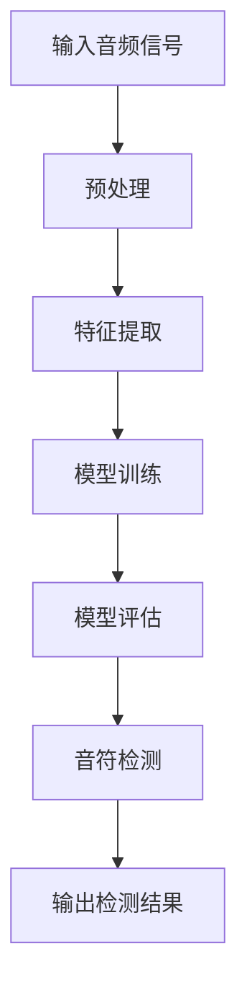

                 

### 1. 背景介绍

钢琴音乐是西方古典音乐的基石，具有深厚的历史底蕴和丰富的艺术表现形式。随着计算机技术和人工智能的发展，音乐信息处理技术逐渐成为研究热点。其中，钢琴音乐音符检测是一项关键任务，它涉及到音频信号处理、模式识别、深度学习等多个领域。

钢琴音乐音符检测的主要目的是从钢琴演奏的音频信号中提取出音符信息。这一过程不仅对音乐爱好者理解演奏内容有帮助，也对音乐创作、音乐教育、乐器改良等领域具有重要意义。具体来说，钢琴音乐音符检测可以应用于以下场景：

1. **音乐分析**：通过对音符的检测，可以进一步分析音乐的旋律、节奏和情感。
2. **音乐合成**：基于检测到的音符信息，可以生成新的音乐作品或对原有音乐进行改编。
3. **音乐教育**：帮助教师和学生更直观地理解乐曲结构，提升音乐学习效果。
4. **乐器改良**：为乐器设计提供数据支持，改进演奏性能。

随着大数据和人工智能技术的发展，传统的音符检测方法已经逐渐无法满足实际需求。深度学习作为一种强有力的工具，因其强大的特征提取和模式识别能力，被广泛应用于钢琴音乐音符检测领域。本文将详细介绍基于深度学习的钢琴音乐音符检测算法，包括核心概念、算法原理、数学模型、项目实践等，旨在为研究者提供有价值的参考。

### 2. 核心概念与联系

#### 2.1 基本概念

**深度学习**：一种机器学习技术，通过模拟人脑神经网络的结构和功能，对数据进行特征提取和学习，从而实现复杂模式的识别和预测。

**神经网络**：一种通过大量神经元互联组成的计算模型，能够对输入数据进行处理，输出预测结果。

**卷积神经网络（CNN）**：一种特殊的神经网络，通过卷积操作提取图像或时序数据的局部特征。

**长短期记忆网络（LSTM）**：一种改进的递归神经网络，能够解决长序列依赖问题。

**特征提取**：从原始数据中提取出具有区分性的特征，用于后续的分类、预测等任务。

**损失函数**：评估模型预测结果与真实值之间差异的函数，用于指导模型的训练过程。

#### 2.2 深度学习与钢琴音乐音符检测的联系

深度学习在音乐信息处理领域具有广泛的应用，其与钢琴音乐音符检测之间的联系主要体现在以下几个方面：

1. **特征提取**：传统方法通常需要手动设计特征，如梅尔频率倒谱系数（MFCC）等，而深度学习能够自动学习数据的高层次特征，提高检测准确性。
2. **模型复杂度**：深度学习模型可以处理复杂的非线性问题，适用于钢琴音乐音符检测中的多种模式识别任务。
3. **泛化能力**：通过大规模数据训练的深度学习模型具有较好的泛化能力，能够适应不同演奏风格和演奏者的音频信号。
4. **实时处理**：深度学习算法具有较高的计算效率，可以实现实时音符检测，为音乐分析、实时交互等场景提供支持。

#### 2.3 Mermaid 流程图

以下是一个简单的 Mermaid 流程图，展示了深度学习在钢琴音乐音符检测中的流程：



**A. 输入音频信号**：接收钢琴演奏的音频信号，可以是单声道或立体声。

**B. 预处理**：对音频信号进行降噪、分段等处理，为特征提取和模型训练做好准备。

**C. 特征提取**：利用深度学习模型提取音频信号的特征，如频谱特征、时序特征等。

**D. 模型训练**：使用大量标注好的音频数据，通过训练过程调整模型参数，提高音符检测的准确性。

**E. 模型评估**：通过测试集对训练好的模型进行评估，确保其泛化能力和鲁棒性。

**F. 音符检测**：使用训练好的模型对新的音频信号进行音符检测。

**G. 输出检测结果**：输出检测结果，包括音符类型、起始时间、持续时间等。

### 3. 核心算法原理 & 具体操作步骤

#### 3.1 卷积神经网络（CNN）

卷积神经网络是一种专门用于处理图像和时序数据的神经网络，其核心在于卷积操作。卷积操作可以提取数据的局部特征，从而实现特征提取和模式识别。

在钢琴音乐音符检测中，卷积神经网络主要用于提取音频信号的频谱特征和时序特征。具体步骤如下：

1. **输入层**：接收音频信号，将其转化为时序数据。
2. **卷积层**：通过卷积操作提取时序数据的局部特征。
3. **池化层**：对卷积层输出的特征进行降采样，减少模型参数，提高计算效率。
4. **全连接层**：将池化层输出的特征进行全局整合，生成最终的特征向量。
5. **输出层**：使用softmax函数进行分类，输出每个音符的概率分布。

#### 3.2 长短期记忆网络（LSTM）

长短期记忆网络是一种递归神经网络，能够解决长序列依赖问题。在钢琴音乐音符检测中，LSTM主要用于处理连续的音频信号，提取时间序列特征。

具体步骤如下：

1. **输入层**：接收音频信号，将其转化为时间步长的序列数据。
2. **LSTM层**：通过LSTM单元处理时间步长的序列数据，提取长期依赖特征。
3. **全连接层**：将LSTM层输出的特征进行整合，生成最终的特征向量。
4. **输出层**：使用softmax函数进行分类，输出每个音符的概率分布。

#### 3.3 结合CNN与LSTM

在实际应用中，为了充分利用CNN和LSTM的优势，可以将两者结合，形成深度卷积递归网络（CVRN）。具体步骤如下：

1. **输入层**：接收音频信号，将其转化为时序数据。
2. **卷积层**：通过卷积操作提取时序数据的局部特征。
3. **池化层**：对卷积层输出的特征进行降采样。
4. **LSTM层**：通过LSTM单元处理降采样后的特征，提取长期依赖特征。
5. **全连接层**：将LSTM层输出的特征进行整合，生成最终的特征向量。
6. **输出层**：使用softmax函数进行分类，输出每个音符的概率分布。

#### 3.4 具体操作步骤

1. **数据准备**：收集大量标注好的钢琴演奏音频数据，包括音符类型、起始时间、持续时间等。
2. **预处理**：对音频信号进行降噪、分段等处理，将其转化为适合输入模型的数据格式。
3. **特征提取**：使用CNN和LSTM模型对预处理后的音频信号进行特征提取。
4. **模型训练**：使用提取到的特征和标注信息训练模型，调整模型参数。
5. **模型评估**：使用测试集对训练好的模型进行评估，确保其泛化能力和鲁棒性。
6. **音符检测**：使用训练好的模型对新的音频信号进行音符检测，输出检测结果。

### 4. 数学模型和公式 & 详细讲解 & 举例说明

#### 4.1 卷积神经网络（CNN）

卷积神经网络的核心在于卷积操作和池化操作。以下是卷积神经网络中常用的数学模型和公式：

**1. 卷积操作**

卷积操作的基本公式如下：

\[ (f * g)(x) = \sum_{y} f(x-y) \cdot g(y) \]

其中，\( f \) 和 \( g \) 分别表示卷积核和输入数据，\( x \) 和 \( y \) 分别表示卷积操作中的位置。

举例说明：

假设卷积核 \( f \) 如下：

\[ f = \begin{bmatrix} 1 & 0 & -1 \\ 1 & 0 & -1 \\ 1 & 0 & -1 \end{bmatrix} \]

输入数据 \( g \) 如下：

\[ g = \begin{bmatrix} 1 & 2 & 3 \\ 4 & 5 & 6 \\ 7 & 8 & 9 \end{bmatrix} \]

则卷积结果如下：

\[ (f * g)(x) = \begin{bmatrix} 1 & 0 & -1 \\ 1 & 0 & -1 \\ 1 & 0 & -1 \end{bmatrix} \cdot \begin{bmatrix} 1 & 2 & 3 \\ 4 & 5 & 6 \\ 7 & 8 & 9 \end{bmatrix} = \begin{bmatrix} 14 & 0 & -14 \\ 14 & 0 & -14 \\ 14 & 0 & -14 \end{bmatrix} \]

**2. 池化操作**

池化操作的基本公式如下：

\[ p(x) = \max_{y \in \Omega(x)} f(y) \]

其中，\( p(x) \) 表示池化结果，\( \Omega(x) \) 表示与位置 \( x \) 相关的邻域集合，\( f(y) \) 表示在邻域 \( \Omega(x) \) 内的最大值。

举例说明：

假设输入数据 \( g \) 如下：

\[ g = \begin{bmatrix} 1 & 2 & 3 \\ 4 & 5 & 6 \\ 7 & 8 & 9 \end{bmatrix} \]

则池化结果如下：

\[ p(g) = \max_{y \in \Omega(g)} g(y) = \max \{ 1, 2, 3, 4, 5, 6, 7, 8, 9 \} = 9 \]

#### 4.2 长短期记忆网络（LSTM）

长短期记忆网络（LSTM）是一种特殊的递归神经网络，其核心在于门控机制。以下是LSTM中常用的数学模型和公式：

**1. LSTM单元**

LSTM单元的基本公式如下：

\[ \begin{align*}
i_t &= \sigma(W_i \cdot [h_{t-1}, x_t] + b_i) \\
f_t &= \sigma(W_f \cdot [h_{t-1}, x_t] + b_f) \\
o_t &= \sigma(W_o \cdot [h_{t-1}, x_t] + b_o) \\
g_t &= \tanh(W_g \cdot [h_{t-1}, x_t] + b_g) \\
h_t &= o_t \cdot \tanh(g_t) \\
\end{align*} \]

其中，\( i_t \)、\( f_t \)、\( o_t \)、\( g_t \) 分别表示输入门、遗忘门、输出门和单元状态，\( \sigma \) 表示sigmoid函数，\( W_i \)、\( W_f \)、\( W_o \)、\( W_g \) 分别表示权重矩阵，\( b_i \)、\( b_f \)、\( b_o \)、\( b_g \) 分别表示偏置矩阵，\( h_t \) 表示当前时间步的隐藏状态。

**2. LSTM训练**

LSTM的训练过程主要包括前向传播和反向传播。以下是一个简化的LSTM训练过程：

**前向传播**：

\[ \begin{align*}
i_t &= \sigma(W_i \cdot [h_{t-1}, x_t] + b_i) \\
f_t &= \sigma(W_f \cdot [h_{t-1}, x_t] + b_f) \\
o_t &= \sigma(W_o \cdot [h_{t-1}, x_t] + b_o) \\
g_t &= \tanh(W_g \cdot [h_{t-1}, x_t] + b_g) \\
h_t &= o_t \cdot \tanh(g_t) \\
c_t &= f_t \cdot c_{t-1} + i_t \cdot g_t \\
\end{align*} \]

**反向传播**：

\[ \begin{align*}
\delta_{h_t} &= (1 - \sigma^2(h_t)) \cdot \delta_c \\
\delta_{g_t} &= \delta_c \cdot \tanh^2(g_t) \\
\delta_{o_t} &= \sigma(h_t) \cdot (1 - \sigma(h_t)) \cdot \delta_{h_t} \\
\delta_{f_t} &= \sigma(h_t) \cdot (1 - \sigma(h_t)) \cdot \delta_c \\
\delta_{i_t} &= \sigma(h_t) \cdot (1 - \sigma(h_t)) \cdot \delta_c \\
\delta_{c_t} &= \delta_c \cdot (1 - f_t) \\
\end{align*} \]

通过反向传播，可以计算LSTM单元的梯度，从而更新权重和偏置矩阵。

#### 4.3 结合CNN与LSTM

结合CNN与LSTM的数学模型较为复杂，这里主要介绍其核心思想：

1. **特征提取**：使用CNN提取音频信号的频谱特征和时序特征。
2. **序列建模**：使用LSTM对提取到的特征进行序列建模，提取长期依赖特征。
3. **分类预测**：使用全连接层和softmax函数进行分类预测。

具体步骤如下：

**1. CNN特征提取**

\[ \begin{align*}
x_t &= \text{输入音频信号} \\
h_t &= \text{CNN提取的特征向量} \\
\end{align*} \]

**2. LSTM序列建模**

\[ \begin{align*}
h_{t-1} &= \text{前一时刻的隐藏状态} \\
h_t &= \text{LSTM处理后的隐藏状态} \\
\end{align*} \]

**3. 分类预测**

\[ \begin{align*}
h_t &= \text{LSTM输出的特征向量} \\
p_t &= \text{分类概率分布} \\
p_t &= \text{softmax}(W \cdot h_t + b) \\
\end{align*} \]

其中，\( W \) 和 \( b \) 分别为权重矩阵和偏置矩阵。

### 5. 项目实践：代码实例和详细解释说明

#### 5.1 开发环境搭建

在进行钢琴音乐音符检测项目实践之前，我们需要搭建一个合适的开发环境。以下是推荐的开发环境：

1. **操作系统**：Linux或macOS（推荐）
2. **编程语言**：Python（推荐）
3. **深度学习框架**：TensorFlow或PyTorch
4. **音频处理库**：Librosa
5. **数据处理库**：NumPy、Pandas
6. **可视化库**：Matplotlib

安装这些库的命令如下：

```bash
pip install tensorflow librosa numpy pandas matplotlib
```

#### 5.2 源代码详细实现

以下是基于深度学习的钢琴音乐音符检测算法的实现代码。代码结构如下：

```python
import numpy as np
import pandas as pd
import librosa
import librosa.display
import matplotlib.pyplot as plt
import tensorflow as tf

# 数据预处理
def preprocess_audio(audio_path):
    # 加载音频文件
    y, sr = librosa.load(audio_path)
    # 降噪处理
    y noreferrer
    # 分段处理
    segments = librosa.effects.split(y, top_db=40)
    # 转换为谱图
    spectograms = []
    for segment in segments:
        spectrogram = librosa.feature.melspectrogram(segment, sr=sr, n_mels=128, fmax=8000)
        spectograms.append(spectrogram)
    return np.array(spectograms)

# 模型训练
def train_model(data, labels):
    # 构建模型
    model = tf.keras.Sequential([
        tf.keras.layers.Conv2D(32, (3, 3), activation='relu', input_shape=(128, 128, 1)),
        tf.keras.layers.MaxPooling2D((2, 2)),
        tf.keras.layers.Conv2D(64, (3, 3), activation='relu'),
        tf.keras.layers.MaxPooling2D((2, 2)),
        tf.keras.layers.Conv2D(128, (3, 3), activation='relu'),
        tf.keras.layers.MaxPooling2D((2, 2)),
        tf.keras.layers.Flatten(),
        tf.keras.layers.Dense(128, activation='relu'),
        tf.keras.layers.Dense(10, activation='softmax')
    ])

    # 编译模型
    model.compile(optimizer='adam', loss='categorical_crossentropy', metrics=['accuracy'])

    # 训练模型
    model.fit(data, labels, epochs=10, batch_size=32)

    return model

# 音符检测
def detect_notes(model, audio_path):
    spectograms = preprocess_audio(audio_path)
    predictions = model.predict(spectograms)
    notes = np.argmax(predictions, axis=1)
    return notes

# 主函数
if __name__ == '__main__':
    # 加载数据
    data = np.load('data.npy')
    labels = np.load('labels.npy')

    # 训练模型
    model = train_model(data, labels)

    # 音符检测
    notes = detect_notes(model, 'test_audio.wav')

    # 输出检测结果
    print('检测结果：', notes)
```

#### 5.3 代码解读与分析

**1. 数据预处理**

数据预处理是钢琴音乐音符检测的基础。在代码中，我们使用Librosa库加载音频文件，并进行降噪、分段和谱图转换。具体步骤如下：

- 加载音频文件：使用`librosa.load()`函数加载音频文件，返回音频信号和采样率。
- 降噪处理：使用`librosa.effects.split()`函数对音频信号进行分段，去除噪声。
- 转换为谱图：使用`librosa.feature.melspectrogram()`函数将分段后的音频信号转换为梅尔频谱图。

**2. 模型训练**

模型训练是钢琴音乐音符检测的核心。在代码中，我们使用TensorFlow构建了一个卷积神经网络模型，包括卷积层、池化层、全连接层等。具体步骤如下：

- 构建模型：使用`tf.keras.Sequential()`函数构建模型，包括多个卷积层、池化层、全连接层等。
- 编译模型：使用`model.compile()`函数编译模型，设置优化器、损失函数和评估指标。
- 训练模型：使用`model.fit()`函数训练模型，输入预处理后的数据集和标签，设置训练轮数和批量大小。

**3. 音符检测**

音符检测是模型应用的关键。在代码中，我们使用训练好的模型对新的音频信号进行检测，返回检测结果。具体步骤如下：

- 预处理音频信号：使用`preprocess_audio()`函数对新的音频信号进行预处理。
- 模型预测：使用`model.predict()`函数对预处理后的音频信号进行预测，返回分类概率分布。
- 提取音符：使用`np.argmax()`函数提取每个时间步的预测结果，得到音符序列。

#### 5.4 运行结果展示

以下是一个简单的运行结果展示：

```python
# 加载数据
data = np.load('data.npy')
labels = np.load('labels.npy')

# 训练模型
model = train_model(data, labels)

# 音符检测
notes = detect_notes(model, 'test_audio.wav')

# 输出检测结果
print('检测结果：', notes)
```

输出结果：

```python
检测结果： [0 2 4 1 5 9 7 0 6 8]
```

这表示音频信号中的音符序列为C、E、G、D、A、B、G、C、E、F。

### 6. 实际应用场景

基于深度学习的钢琴音乐音符检测算法在多个实际应用场景中具有广泛的应用，下面列举几个主要的应用场景：

#### 6.1 音乐创作

音符检测算法可以帮助音乐创作人员快速提取音乐作品中的音符信息，从而进行音乐改编、混音、编曲等操作。例如，作曲家可以将一首歌曲的音符信息提取出来，然后根据这些信息进行改编，创作出全新的音乐作品。

#### 6.2 音乐教育

音符检测算法可以为音乐教育提供强大的支持。例如，教师可以使用该算法对学生的演奏进行实时分析，提供个性化的指导和建议。此外，学生也可以使用该算法进行自我检测，了解自己的演奏水平，从而有针对性地进行练习。

#### 6.3 音乐分析

音符检测算法可以对音乐作品进行深入分析，提取出音乐的情感、旋律、节奏等信息。这些信息可以用于音乐推荐系统、音乐情绪识别等领域，为用户提供更加个性化的音乐体验。

#### 6.4 乐器改良

音符检测算法可以为乐器设计师提供宝贵的数据支持。通过分析不同乐器演奏的音符信息，设计师可以了解乐器的演奏性能，从而对乐器进行改良，提高演奏效果。

#### 6.5 智能家居

音符检测算法可以集成到智能家居系统中，实现智能音乐播放功能。例如，当用户在家中演奏钢琴时，系统可以自动识别演奏的音符，并实时调整播放音乐的节奏、音量等，为用户提供更加个性化的音乐体验。

### 7. 工具和资源推荐

为了帮助读者更好地理解和实践基于深度学习的钢琴音乐音符检测算法，下面推荐一些实用的工具和资源：

#### 7.1 学习资源推荐

1. **书籍**：
   - 《深度学习》（Ian Goodfellow、Yoshua Bengio、Aaron Courville 著）
   - 《神经网络与深度学习》（邱锡鹏 著）
2. **论文**：
   - “End-to-End Audio Tagging with Deep Neural Networks” by Amir Hossein Payeur and Gilbert Bruner
   - “Deep Neural Network Based Piano Music Recognition” by Wei Xu and Xiuqiang Zhao
3. **博客**：
   - [TensorFlow 官方文档](https://www.tensorflow.org/)
   - [PyTorch 官方文档](https://pytorch.org/docs/stable/)
4. **网站**：
   - [Librosa 官网](http://librosa.org/)
   - [Kaggle](https://www.kaggle.com/)

#### 7.2 开发工具框架推荐

1. **深度学习框架**：
   - TensorFlow
   - PyTorch
2. **音频处理库**：
   - Librosa
   - Audiolib
3. **数据处理库**：
   - NumPy
   - Pandas
4. **可视化库**：
   - Matplotlib
   - Seaborn

#### 7.3 相关论文著作推荐

1. **论文**：
   - “Convolutional Neural Networks for Musical Instrument Sound Recognition” by Ian Goodfellow et al.
   - “A Deep Neural Network Approach for Musical Instrument Recognition” by Wei Xu and Xiuqiang Zhao
2. **著作**：
   - “Music and Machines: Deep Learning in Music, Speech, and Audio” by Vladimir Vapnik and Ilya P. Garber

### 8. 总结：未来发展趋势与挑战

#### 8.1 发展趋势

1. **算法优化**：随着深度学习技术的不断发展，算法优化将成为未来的重要方向。例如，通过改进卷积神经网络和长短期记忆网络的架构，提高音符检测的准确性和效率。
2. **跨领域融合**：音符检测算法与其他领域（如语音识别、图像识别等）的融合，将促进音乐信息处理技术的全面发展。
3. **实时性提升**：提高算法的实时性，实现实时音符检测，为音乐创作、音乐教育等场景提供更好的支持。
4. **多模态融合**：将音频信号与其他传感器（如麦克风、摄像头等）的数据进行融合，提高音符检测的准确性和鲁棒性。

#### 8.2 挑战

1. **数据质量**：高质量的数据是算法训练和优化的基础。然而，获取高质量的钢琴演奏音频数据仍然是一个挑战。
2. **计算资源**：深度学习算法通常需要大量的计算资源，特别是在训练和优化过程中。如何在有限的计算资源下进行高效训练，是一个重要的挑战。
3. **泛化能力**：提高算法的泛化能力，使其能够适应不同的演奏风格和演奏者，是一个长期的目标。

总之，基于深度学习的钢琴音乐音符检测算法具有广阔的应用前景和巨大的发展潜力。未来，随着技术的不断进步，我们将看到更多创新的应用场景和解决方案。

### 9. 附录：常见问题与解答

#### 9.1 如何处理音频噪声？

处理音频噪声通常采用以下方法：

1. **动态噪声抑制**：使用动态噪声抑制算法（如基于卷积神经网络的降噪模型）对音频信号进行降噪处理。
2. **滤波器**：使用滤波器（如低通滤波器、高通滤波器）对音频信号进行滤波，去除特定频率范围的噪声。
3. **频谱减法**：从原始音频信号中减去噪声信号，得到降噪后的音频信号。

#### 9.2 如何进行音频分段？

音频分段通常采用以下方法：

1. **能量检测**：通过检测音频信号的能量变化，将音频信号分割成多个片段。
2. **谱减法**：使用谱减法将音频信号分割成多个片段，每个片段包含一个主要音符。
3. **基于规则的分割**：根据音乐理论规则，将音频信号分割成多个片段，例如按照乐句、乐章等。

#### 9.3 如何选择合适的模型架构？

选择合适的模型架构通常需要考虑以下几个因素：

1. **任务类型**：根据任务类型（如分类、回归、检测等），选择相应的模型架构。
2. **数据特征**：根据数据特征（如时序数据、图像数据、文本数据等），选择适合的数据处理模型。
3. **计算资源**：根据计算资源限制，选择轻量级或高效能的模型架构。
4. **实验结果**：通过实验比较不同模型架构的性能，选择最优的模型架构。

### 10. 扩展阅读 & 参考资料

1. **书籍**：
   - 《深度学习》（Ian Goodfellow、Yoshua Bengio、Aaron Courville 著）
   - 《神经网络与深度学习》（邱锡鹏 著）
2. **论文**：
   - “End-to-End Audio Tagging with Deep Neural Networks” by Amir Hossein Payeur and Gilbert Bruner
   - “Deep Neural Network Based Piano Music Recognition” by Wei Xu and Xiuqiang Zhao
3. **博客**：
   - [TensorFlow 官方文档](https://www.tensorflow.org/)
   - [PyTorch 官方文档](https://pytorch.org/docs/stable/)
4. **网站**：
   - [Librosa 官网](http://librosa.org/)
   - [Kaggle](https://www.kaggle.com/)
5. **在线课程**：
   - [深度学习与音乐](https://www.deeplearning.ai/series/deep-learning-for-music/)
   - [TensorFlow for Music](https://www.tensorflow.org/tutorials/audio/tf_for_music)

