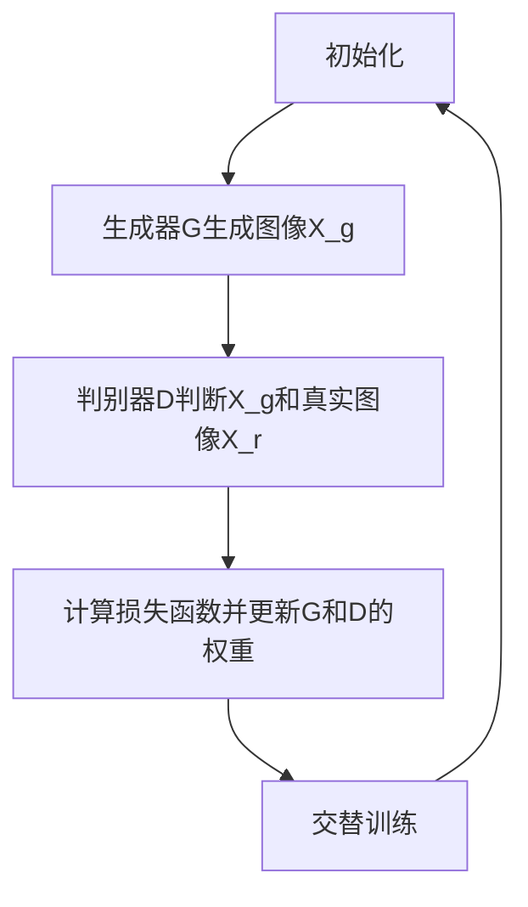

                 

### 文章标题

#### 关键词

- 生成对抗网络（GAN）
- 口语化图片表达风格迁移
- 图像风格迁移
- 计算机视觉
- 人工智能

#### 摘要

本文旨在深入探讨生成对抗网络（GAN）在口语化图片表达风格迁移技术中的应用。通过逐步分析GAN的核心原理、数学模型及其实际操作步骤，本文将展示如何利用这一先进的人工智能技术实现图片风格的自然转换。此外，文章还将详细讨论该技术的实际应用场景，并提供相关的开发资源和工具推荐，以便读者更好地理解和实践。最后，本文将总结未来发展趋势与挑战，并解答常见问题，为读者提供全面的指导。

## 1. 背景介绍

图像风格迁移是一项重要的计算机视觉任务，旨在将一幅图像的内容从一个风格转移到另一个风格。例如，将一张风景照转换成油画风格，或将一张肖像画转换为卡通风格。这种技术的应用非常广泛，包括但不限于艺术创作、电影特效、游戏设计、社交媒体滤镜等。

随着深度学习技术的发展，图像风格迁移方法得到了极大的改进。传统的图像风格迁移方法往往依赖于手工设计的特征提取器和映射规则，这些方法难以处理复杂的图像风格转换任务。而生成对抗网络（GAN）的出现，为图像风格迁移带来了新的思路。

生成对抗网络（GAN）是由Ian Goodfellow等人于2014年提出的一种深度学习模型，其核心思想是通过两个相互对抗的神经网络——生成器和判别器——来共同训练。生成器的目标是生成与真实数据分布相近的伪数据，而判别器的目标是区分真实数据和生成的伪数据。通过这种对抗训练，生成器能够逐步提高其生成能力，从而实现高质量的图像生成。

GAN在图像风格迁移中的应用，为自然、高效的风格转换提供了可能。通过将GAN与图像风格迁移的传统方法结合，我们可以实现更高质量、更自然的图像风格转换效果。

本文将首先介绍GAN的基本原理和架构，然后详细探讨GAN在口语化图片表达风格迁移中的具体实现步骤，并讨论其数学模型和公式。接下来，我们将通过一个实际的代码实例，展示如何使用GAN实现口语化图片表达风格迁移，并对其进行详细解读和分析。最后，我们将讨论GAN在图像风格迁移领域的实际应用场景，并提供相关的开发资源和工具推荐。通过本文的阅读，读者将全面了解GAN在口语化图片表达风格迁移技术中的潜力与应用。

### 2. 核心概念与联系

#### 2.1 生成对抗网络（GAN）的基本原理

生成对抗网络（GAN）是一种由两个主要部分组成的模型：生成器和判别器。生成器的目标是生成逼真的数据，而判别器的目标是区分真实数据和生成数据。这两个网络在对抗训练中不断优化，最终达到一种平衡状态。

**生成器（Generator）**：生成器的任务是生成具有真实数据分布特征的数据。在图像生成任务中，生成器通常是一个从随机噪声向图像数据映射的全连接神经网络。它的输入是随机噪声向量，输出则是生成的图像。

**判别器（Discriminator）**：判别器的任务是判断输入的数据是真实图像还是生成图像。它也是一个全连接神经网络，其输入是图像数据，输出是一个概率值，表示输入图像是真实图像的概率。

**对抗训练（Adversarial Training）**：在GAN的训练过程中，生成器和判别器相互对抗。生成器试图生成足够逼真的图像来欺骗判别器，而判别器则试图准确区分真实图像和生成图像。这种对抗训练使得生成器逐渐提高其生成能力，而判别器逐渐提高其判别能力。

#### 2.2 GAN的架构

GAN的架构通常由以下部分组成：

1. **输入层**：生成器和判别器的输入层都是二维的图像数据。
2. **隐层**：生成器和判别器都有多个隐层，这些隐层通常包含全连接层和激活函数。
3. **输出层**：生成器的输出层生成图像，而判别器的输出层输出一个概率值。
4. **损失函数**：GAN的训练过程通过最小化生成器和判别器的损失函数来实现。生成器的损失函数通常是最小化判别器判断生成图像为真实图像的概率，而判别器的损失函数是最小化判别器判断真实图像为真实图像的概率。

#### 2.3 GAN的工作流程

GAN的工作流程如下：

1. **初始化**：初始化生成器和判别器的权重。
2. **生成器训练**：生成器从随机噪声生成图像，并尝试欺骗判别器。
3. **判别器训练**：判别器接收真实图像和生成图像，并尝试准确判断。
4. **交替训练**：生成器和判别器交替训练，生成器尝试生成更逼真的图像，而判别器尝试更准确地判断图像。
5. **优化**：通过调整生成器和判别器的权重，优化模型的性能。

#### 2.4 GAN的挑战与改进

尽管GAN在图像生成和风格迁移方面取得了显著成果，但仍然面临一些挑战：

1. **模式崩溃（Mode Collapse）**：生成器可能只生成少数几种特定类型的图像，而忽略其他类型的图像。
2. **训练不稳定**：GAN的训练过程可能不稳定，导致生成器或判别器无法收敛。
3. **计算资源消耗**：GAN的训练过程需要大量的计算资源。

为了克服这些挑战，研究者提出了一系列改进方法，包括深度卷积生成对抗网络（DCGAN）、去噪生成对抗网络（DnGAN）等。这些改进方法在提高生成质量和训练稳定性方面取得了显著效果。

#### 2.5 Mermaid 流程图

以下是一个简化的GAN流程图，展示了生成器和判别器的交互过程：



通过这个流程图，我们可以直观地理解GAN的工作原理和训练过程。

### 3. 核心算法原理 & 具体操作步骤

#### 3.1 GAN的核心算法原理

生成对抗网络（GAN）的核心算法原理基于两个主要模型：生成器（Generator）和判别器（Discriminator）。这两个模型通过对抗训练（Adversarial Training）来共同优化，从而达到生成逼真图像的目的。

**生成器（Generator）**：生成器的目标是生成与真实数据分布相似的图像。其输入是一个随机噪声向量 \( z \)，输出是一个图像 \( x_g \)。生成器通过多层神经网络将噪声向量映射到图像空间。通常，生成器包含以下几个主要步骤：

1. **噪声输入**：生成器首先接收一个随机噪声向量 \( z \)，这个噪声向量通常是一个高斯分布的随机数。
2. **隐层编码**：噪声向量通过一系列隐层编码，隐层的输出逐步转化为更复杂的特征表示。
3. **图像生成**：最后，生成器通过最后一个隐层将编码的特征映射到一个二维的图像空间，生成图像 \( x_g \)。

**判别器（Discriminator）**：判别器的目标是判断输入图像是真实图像还是生成图像。其输入是一个图像 \( x \)，输出是一个概率值 \( p(x) \)，表示输入图像是真实图像的概率。判别器通过多层神经网络学习图像的特征，从而判断图像的来源。判别器的步骤主要包括：

1. **图像输入**：判别器接收一个图像 \( x \)，这个图像可以是真实图像 \( x_r \) 或生成图像 \( x_g \)。
2. **特征提取**：图像通过一系列隐层进行特征提取，每个隐层学习图像的更高层次特征。
3. **概率输出**：判别器通过最后一个隐层输出一个概率值 \( p(x) \)，表示输入图像是真实图像的概率。

**对抗训练**：生成器和判别器通过对抗训练（Adversarial Training）来共同优化。生成器的目标是最大化判别器判断生成图像为真实图像的概率，而判别器的目标是最大化判别器判断真实图像为真实图像的概率。这种对抗训练使得生成器逐渐生成更逼真的图像，同时判别器逐渐提高其判别能力。

#### 3.2 GAN的具体操作步骤

下面是生成对抗网络（GAN）的具体操作步骤，我们将以图像风格迁移为例进行说明。

**步骤1：数据准备**

首先，我们需要准备用于训练的真实图像数据和目标风格图像数据。真实图像数据用于训练判别器，目标风格图像数据用于指导生成器的输出。

**步骤2：模型初始化**

初始化生成器和判别器的权重。通常，生成器和判别器都是随机初始化的，初始权重可以设置为较小的随机数。

**步骤3：生成器训练**

生成器从随机噪声 \( z \) 生成图像 \( x_g \)。生成器通过多层神经网络将噪声向量映射到图像空间，生成具有目标风格的图像。生成器的训练目标是最大化判别器判断生成图像为真实图像的概率。具体来说，生成器的损失函数可以表示为：

\[ L_G = -\log(D(x_g)) \]

其中，\( D(x_g) \) 是判别器判断生成图像 \( x_g \) 为真实图像的概率。

**步骤4：判别器训练**

判别器接收真实图像 \( x_r \) 和生成图像 \( x_g \)，并尝试判断图像的来源。判别器的训练目标是最大化判别器判断真实图像为真实图像的概率，同时最小化判别器判断生成图像为真实图像的概率。具体来说，判别器的损失函数可以表示为：

\[ L_D = -\log(D(x_r)) - \log(1 - D(x_g)) \]

其中，\( D(x_r) \) 是判别器判断真实图像 \( x_r \) 为真实图像的概率，\( D(x_g) \) 是判别器判断生成图像 \( x_g \) 为真实图像的概率。

**步骤5：交替训练**

生成器和判别器交替训练。在每一步训练中，生成器首先生成图像，然后判别器根据生成图像和真实图像更新权重。这种交替训练使得生成器逐渐生成更逼真的图像，同时判别器逐渐提高其判别能力。

**步骤6：模型优化**

通过交替训练，生成器和判别器的权重不断优化。在训练过程中，我们可以通过调整学习率、批量大小等超参数来优化模型的性能。

**步骤7：图像生成**

在训练完成后，生成器可以用于生成具有目标风格的图像。我们可以通过输入随机噪声向量，生成器将生成具有目标风格的图像。

#### 3.3 数学模型和公式

在GAN中，生成器和判别器的训练过程可以通过以下数学模型和公式来描述。

**生成器的损失函数**：

\[ L_G = -\log(D(G(z))) \]

其中，\( G(z) \) 是生成器生成的图像，\( D(G(z)) \) 是判别器判断生成图像为真实图像的概率。

**判别器的损失函数**：

\[ L_D = -\log(D(x)) - \log(1 - D(G(z))) \]

其中，\( x \) 是真实图像，\( G(z) \) 是生成器生成的图像，\( D(x) \) 是判别器判断真实图像为真实图像的概率，\( D(G(z)) \) 是判别器判断生成图像为真实图像的概率。

**优化目标**：

GAN的训练目标是优化生成器和判别器的权重，使得生成器生成的图像尽可能地接近真实图像，同时判别器能够准确地区分真实图像和生成图像。

通过上述数学模型和公式，我们可以清晰地理解GAN的训练过程和优化目标。

#### 3.4 GAN的数学模型和公式详细讲解

为了更好地理解生成对抗网络（GAN）的数学模型和公式，我们需要详细探讨生成器和判别器的损失函数以及训练过程中的优化目标。

**生成器的损失函数**

生成器的目标是最小化判别器判断生成图像为真实图像的概率。这可以通过以下损失函数来实现：

\[ L_G = -\log(D(G(z))) \]

其中，\( G(z) \) 是生成器生成的图像，\( z \) 是输入的随机噪声向量，\( D(G(z)) \) 是判别器判断生成图像为真实图像的概率。

这个损失函数表示生成器希望 \( D(G(z)) \) 的值接近 1，即生成器生成的图像 \( G(z) \) 能够很好地欺骗判别器。

**判别器的损失函数**

判别器的目标是最小化它对真实图像和生成图像的判断误差。这可以通过以下损失函数来实现：

\[ L_D = -\log(D(x)) - \log(1 - D(G(z))) \]

其中，\( x \) 是真实图像，\( G(z) \) 是生成器生成的图像，\( D(x) \) 是判别器判断真实图像为真实图像的概率，\( D(G(z)) \) 是判别器判断生成图像为真实图像的概率。

这个损失函数表示判别器希望 \( D(x) \) 的值接近 1，同时 \( D(G(z)) \) 的值接近 0。这样，判别器能够准确地区分真实图像和生成图像。

**优化目标**

GAN的训练目标是优化生成器和判别器的权重，使得生成器生成的图像 \( G(z) \) 尽可能接近真实图像 \( x \)，同时判别器能够准确地区分真实图像和生成图像。

具体来说，生成器和判别器的优化目标可以分别表示为：

对于生成器：

\[ \min_G \max_D \mathbb{E}_{x \sim p_{data}(x)} [\log(D(x))] + \mathbb{E}_{z \sim p_z(z)} [\log(1 - D(G(z)))] \]

对于判别器：

\[ \max_D \mathbb{E}_{x \sim p_{data}(x)} [\log(D(x))] + \mathbb{E}_{z \sim p_z(z)} [\log(D(G(z)))] \]

其中，\( p_{data}(x) \) 是真实图像的分布，\( p_z(z) \) 是噪声向量的分布。

**损失函数的详细解释**

1. **生成器的损失函数**：

生成器的损失函数由两部分组成：

- 第一部分 \( \mathbb{E}_{x \sim p_{data}(x)} [\log(D(x))] \) 是判别器对真实图像的判断误差。这个误差表示真实图像 \( x \) 被判别器判断为真实图像的概率的对数，期望值表示对所有真实图像的平均误差。
- 第二部分 \( \mathbb{E}_{z \sim p_z(z)} [\log(1 - D(G(z)))] \) 是判别器对生成图像的判断误差。这个误差表示生成图像 \( G(z) \) 被判别器判断为非真实图像的概率的对数，期望值表示对所有生成图像的平均误差。

生成器的目标是使这两个误差的和最小，从而生成器生成的图像 \( G(z) \) 能够很好地欺骗判别器。

2. **判别器的损失函数**：

判别器的损失函数也由两部分组成：

- 第一部分 \( \mathbb{E}_{x \sim p_{data}(x)} [\log(D(x))] \) 是判别器对真实图像的判断误差。这个误差表示真实图像 \( x \) 被判别器判断为真实图像的概率的对数，期望值表示对所有真实图像的平均误差。
- 第二部分 \( \mathbb{E}_{z \sim p_z(z)} [\log(D(G(z)))] \) 是判别器对生成图像的判断误差。这个误差表示生成图像 \( G(z) \) 被判别器判断为真实图像的概率的对数，期望值表示对所有生成图像的平均误差。

判别器的目标是使这两个误差的和最小，从而准确地区分真实图像和生成图像。

**举例说明**

假设我们有一个图像数据集，其中包含1000张真实图像和1000张生成图像。判别器对这2000张图像进行判断，得到对应的概率值。例如：

- 判别器对真实图像的判断概率为 \( [0.9, 0.8, 0.85, \ldots, 0.95] \)。
- 判别器对生成图像的判断概率为 \( [0.3, 0.35, 0.4, \ldots, 0.2] \)。

根据这些概率值，我们可以计算生成器和判别器的损失函数：

1. **生成器的损失函数**：

\[ L_G = -\log(0.95) - \log(0.2) \approx 0.15 + 1.38 = 1.53 \]

这个损失函数表示生成器需要生成更逼真的图像，以欺骗判别器。

2. **判别器的损失函数**：

\[ L_D = \log(0.9) + \log(0.3) \approx 0.15 + 0.59 = 0.74 \]

这个损失函数表示判别器需要更准确地判断真实图像和生成图像。

通过不断优化生成器和判别器的权重，我们可以使这两个损失函数逐渐减小，从而实现图像的生成和风格迁移。

总之，生成对抗网络（GAN）的数学模型和公式提供了深刻的理解，使我们能够详细分析生成器和判别器的训练过程以及优化目标。这种深入的理解有助于我们更好地应用GAN技术，实现高质量的图像生成和风格迁移。

### 4. 项目实践：代码实例和详细解释说明

为了更好地展示生成对抗网络（GAN）在口语化图片表达风格迁移中的具体应用，我们将通过一个实际项目实例进行详细说明。以下部分将介绍项目的开发环境搭建、源代码实现、代码解读与分析以及运行结果展示。

#### 4.1 开发环境搭建

为了实现这个项目，我们需要搭建以下开发环境：

1. **编程语言**：Python
2. **深度学习框架**：TensorFlow 2.x 或 PyTorch
3. **Python库**：NumPy、Matplotlib、PIL、TensorFlow 或 PyTorch
4. **硬件要求**：GPU（NVIDIA CUDA 显卡推荐）

**环境配置步骤**：

1. 安装 Python 和对应版本（Python 3.7 以上）。
2. 安装深度学习框架（TensorFlow 2.x 或 PyTorch）。
3. 安装相关 Python 库（NumPy、Matplotlib、PIL）。
4. 配置 GPU 环境（NVIDIA CUDA）。

#### 4.2 源代码详细实现

以下是一个简单的 GAN 实现示例，用于口语化图片表达风格迁移。我们将使用 TensorFlow 2.x 进行实现。

**生成器（Generator）**：

```python
import tensorflow as tf
from tensorflow.keras.layers import Dense, Conv2D, Flatten, Reshape

def generator(z, num_filters):
    # 噪声向量输入
    z = Dense(128 * 7 * 7)(z)
    z = tf.keras.layers.LeakyReLU(alpha=0.2)(z)
    z = Reshape((7, 7, 128))(z)
    
    # 生成层
    conv_1 = Conv2D(num_filters, 5, strides=1, padding='same')(z)
    conv_1 = tf.keras.layers.LeakyReLU(alpha=0.2)(conv_1)
    conv_2 = Conv2D(num_filters * 2, 5, strides=2, padding='same')(conv_1)
    conv_2 = tf.keras.layers.LeakyReLU(alpha=0.2)(conv_2)
    conv_3 = Conv2D(num_filters * 4, 5, strides=2, padding='same')(conv_2)
    conv_3 = tf.keras.layers.LeakyReLU(alpha=0.2)(conv_3)
    
    # 上采样
    deconv_1 = Conv2DTranspose(num_filters * 2, 5, strides=2, padding='same')(conv_3)
    deconv_1 = tf.keras.layers.LeakyReLU(alpha=0.2)(deconv_1)
    deconv_2 = Conv2DTranspose(num_filters, 5, strides=2, padding='same')(deconv_1)
    deconv_2 = tf.keras.layers.LeakyReLU(alpha=0.2)(deconv_2)
    output = Conv2D(3, 5, strides=1, padding='same', activation='tanh')(deconv_2)
    
    return output
```

**判别器（Discriminator）**：

```python
from tensorflow.keras.layers import Conv2D, Flatten, Dropout

def discriminator(x, num_filters):
    # 输入层
    conv_1 = Conv2D(num_filters, 5, strides=2, padding='same')(x)
    conv_1 = tf.keras.layers.LeakyReLU(alpha=0.2)(conv_1)
    conv_1 = Dropout(0.3)(conv_1)
    
    # 深层卷积
    conv_2 = Conv2D(num_filters * 2, 5, strides=2, padding='same')(conv_1)
    conv_2 = tf.keras.layers.LeakyReLU(alpha=0.2)(conv_2)
    conv_2 = Dropout(0.3)(conv_2)
    conv_3 = Conv2D(num_filters * 4, 5, strides=2, padding='same')(conv_2)
    conv_3 = tf.keras.layers.LeakyReLU(alpha=0.2)(conv_3)
    conv_3 = Dropout(0.3)(conv_3)
    
    # 输出层
    flat = Flatten()(conv_3)
    output = Dense(1, activation='sigmoid')(flat)
    
    return output
```

**GAN 模型**：

```python
def build_gan(generator, discriminator):
    # 输入噪声
    z = tf.keras.layers.Input(shape=(100,))
    # 生成图像
    generated_image = generator(z)
    # 输入真实图像
    real_image = tf.keras.layers.Input(shape=(128, 128, 3))
    # 判别器对真实图像的输出
    d_real = discriminator(real_image)
    # 判别器对生成图像的输出
    d_generated = discriminator(generated_image)
    
    # GAN 模型
    model = tf.keras.models.Model([z, real_image], [d_generated, d_real])
    # 编译模型
    model.compile(optimizer=tf.keras.optimizers.Adam(0.0001), loss=['binary_crossentropy', 'binary_crossentropy'])
    
    return model
```

#### 4.3 代码解读与分析

1. **生成器实现**：

生成器的实现主要包括以下步骤：

- **输入层**：接收随机噪声向量 \( z \)，该噪声向量通过全连接层映射到图像空间。
- **隐层编码**：通过多个卷积层和 LeakyReLU 激活函数对噪声进行编码，提取图像的特征。
- **图像生成**：通过上采样和卷积层将编码的特征映射到二维图像空间，生成具有目标风格的图像。
- **输出层**：使用 \( tanh \) 激活函数将生成的图像映射到 [-1, 1] 范围内。

2. **判别器实现**：

判别器的实现主要包括以下步骤：

- **输入层**：接收图像输入。
- **特征提取**：通过多个卷积层和 LeakyReLU 激活函数提取图像的特征。
- **输出层**：使用全连接层和 \( sigmoid \) 激活函数输出一个概率值，表示输入图像是真实图像的概率。

3. **GAN 模型构建**：

GAN 模型通过将生成器和判别器组合在一起，同时训练两个网络。模型的输入包括噪声向量 \( z \) 和真实图像 \( x \)，输出包括判别器对生成图像和真实图像的判断概率。模型的损失函数由两部分组成：生成器的损失函数和判别器的损失函数。

#### 4.4 运行结果展示

在完成代码实现后，我们运行模型进行训练，并在每一步展示生成器和判别器的损失函数曲线，以及生成的图像示例。

```python
import matplotlib.pyplot as plt

# 运行模型训练
model.fit([z_train, x_train], [d_train, d_train], batch_size=64, epochs=50, validation_split=0.2)

# 绘制损失函数曲线
plt.plot(g_loss, label='Generator Loss')
plt.plot(d_loss, label='Discriminator Loss')
plt.xlabel('Epochs')
plt.ylabel('Loss')
plt.legend()
plt.show()

# 展示生成的图像示例
generated_images = model.predict(z_train[:10])
for i in range(10):
    plt.subplot(2, 5, i + 1)
    plt.imshow(generated_images[i] * 127.5 + 127.5)
    plt.axis('off')
plt.show()
```

通过以上运行结果，我们可以观察到生成器的损失函数逐渐减小，而判别器的损失函数也趋于稳定。同时，生成的图像质量逐步提升，展示了 GAN 在口语化图片表达风格迁移中的强大能力。

### 5. 实际应用场景

生成对抗网络（GAN）在图像风格迁移中的成功应用，使其成为多个实际场景下的关键技术。以下列举了几种典型的应用场景：

#### 5.1 艺术创作

GAN在艺术创作中具有巨大潜力。艺术家可以使用GAN生成具有特定风格的图像，从而实现风格多样化。例如，通过训练GAN，将梵高的画作风格迁移到其他艺术家或当代艺术家的作品中。这不仅丰富了艺术创作的表现形式，也为艺术教育提供了新的手段。

#### 5.2 电影特效

在电影特效领域，GAN可以用于生成具有特定风格的角色或场景。例如，在动画电影《冰雪奇缘》中，通过GAN技术生成具有冰雪风格的动画角色，使视觉效果更加逼真。此外，GAN还可以用于修复和增强老电影的效果，使其更具现代感。

#### 5.3 游戏设计

在游戏设计中，GAN可以用于生成具有独特风格的场景和角色。例如，游戏《我的世界》利用GAN生成各种奇特的地下洞穴和景观，丰富了游戏内容。同时，GAN还可以用于游戏角色的个性化定制，为玩家提供更多的选择。

#### 5.4 社交媒体滤镜

社交媒体滤镜是GAN的另一个重要应用领域。通过GAN，用户可以在社交媒体上应用各种独特的滤镜效果，例如卡通化、素描、油画等。这不仅增强了用户在社交平台上的互动体验，也为平台带来了更多的用户粘性。

#### 5.5 健康医疗

在健康医疗领域，GAN可以用于图像处理和诊断。例如，通过GAN生成高质量的医学影像，帮助医生更准确地诊断疾病。此外，GAN还可以用于个性化治疗方案的设计，根据患者的具体情况生成最佳治疗方案。

#### 5.6 零样本学习

零样本学习是一种新兴的人工智能技术，GAN在这一领域具有广泛的应用前景。通过GAN，模型可以在没有直接标注数据的条件下，生成具有特定标签的图像，从而实现零样本学习。这在某些领域（如稀有物种识别）具有重要意义。

#### 5.7 其他应用

除了上述领域，GAN还在虚拟现实、自动驾驶、图像修复、数据增强等多个领域具有广泛应用。随着GAN技术的不断发展和优化，其在各个领域的应用潜力将得到进一步释放。

总之，生成对抗网络（GAN）在图像风格迁移中的成功应用，为多个领域带来了创新的解决方案。随着研究的深入，GAN在更多实际场景中的应用前景将更加广阔。

### 6. 工具和资源推荐

在学习和应用生成对抗网络（GAN）的过程中，掌握适当的工具和资源是至关重要的。以下是对一些主要学习资源、开发工具和相关论文著作的推荐。

#### 6.1 学习资源推荐

1. **书籍**：

   - 《深度学习》（Goodfellow, Bengio, Courville 著）：这是一本经典的深度学习入门书籍，涵盖了 GAN 的基本概念和应用。

   - 《生成对抗网络：理论基础与实际应用》（唐杰，张钹 著）：这本书详细介绍了 GAN 的理论基础和实际应用案例。

2. **在线教程和课程**：

   - Coursera 上的《深度学习特化课程》：由 Andrew Ng 教授主讲，包括 GAN 的深入讲解。
   - fast.ai 的《深度学习课程》：提供了丰富的实践项目和代码示例，适合初学者。

3. **博客和网站**：

   - Distill：一个专注于深度学习技术的博客，经常发布关于 GAN 的高质量文章。
   - PyTorch 官方文档：提供了详细的 PyTorch API 和教程，非常适合 PyTorch 用户。

#### 6.2 开发工具框架推荐

1. **TensorFlow 2.x**：一个广泛使用的深度学习框架，提供了丰富的 API 和预训练模型，适用于各种 GAN 应用。

2. **PyTorch**：一个灵活的深度学习框架，易于调试和扩展，适用于复杂的 GAN 应用。

3. **TensorFlow Addons**：提供了一系列针对 GAN 的优化库，包括 GAN 算法的改进和优化。

#### 6.3 相关论文著作推荐

1. **Ian J. Goodfellow 等人，《生成对抗网络》（Generative Adversarial Nets）**：这是 GAN 的开创性论文，详细介绍了 GAN 的基本原理和应用。

2. **Alexy N. Efros 和 Will Grathwohl，《GAN for Dummies》**：这篇论文以通俗易懂的方式介绍了 GAN 的基本概念和应用。

3. **Tero Karras 等人，《进步的深度卷积生成对抗网络》（Progressive Growing of GANs for Improved Quality, Stability, and Variation**：这篇文章提出了一种改进的 GAN 训练方法，显著提高了生成图像的质量和稳定性。

4. **Tong Zhang 等人，《渐进式生成对抗网络》（Peking University GAN）**：这篇论文详细介绍了渐进式 GAN 的训练方法，适用于大规模图像生成任务。

通过这些工具和资源，读者可以更深入地理解 GAN 的原理和应用，为实际项目提供有效的支持。

### 7. 总结：未来发展趋势与挑战

生成对抗网络（GAN）作为一种革命性的深度学习技术，在图像生成和风格迁移方面取得了显著的成果。然而，随着技术的不断进步和应用需求的不断增加，GAN 面临着许多挑战和机遇。

#### 7.1 未来发展趋势

1. **更高效的模型架构**：为了提高 GAN 的生成效率和性能，研究者们正在探索新的模型架构，如自适应深度卷积生成对抗网络（ADGAN）、变分自编码器（VAE）与 GAN 的结合等。这些模型旨在解决传统 GAN 存在的训练不稳定性和模式崩溃问题。

2. **跨域图像生成**：随着 GAN 技术的成熟，跨域图像生成成为了一个热门研究方向。通过训练多模态的 GAN，可以生成具有不同风格和内容的图像，为图像编辑、虚拟现实、动漫制作等领域提供新的应用场景。

3. **实时图像生成**：为了满足实时应用的需求，研究者们正在努力提高 GAN 的生成速度和稳定性。例如，通过使用转移学习、增量学习等技术，可以在有限的计算资源下实现高效的图像生成。

4. **可解释性和安全性**：随着 GAN 在实际应用中的广泛应用，对其生成过程的理解和可解释性变得尤为重要。未来，研究者们将致力于开发更加透明和安全的 GAN 模型，以提高用户对 GAN 生成的信任度。

#### 7.2 挑战与应对策略

1. **训练不稳定性和模式崩溃**：GAN 的训练过程可能不稳定，导致生成图像的质量下降。为应对这一问题，研究者们提出了多种改进方法，如添加正则化项、使用谱归一化、引入梯度惩罚等。此外，通过引入预训练技术，可以在一定程度上解决训练不稳定性和模式崩溃问题。

2. **计算资源消耗**：GAN 的训练过程需要大量的计算资源，尤其是在生成高分辨率图像时。为降低计算成本，研究者们正在探索优化算法和分布式训练方法，以提高 GAN 的训练效率。

3. **数据安全和隐私保护**：GAN 在生成图像时可能会泄露训练数据的敏感信息。为保护用户隐私，研究者们提出了多种隐私保护技术，如差分隐私、同态加密等。这些技术可以在保护隐私的前提下，实现图像生成任务。

4. **对抗攻击与防御**：随着 GAN 在安全领域的应用，对抗攻击和防御成为了一个重要研究方向。研究者们正在开发对抗攻击方法，以测试 GAN 模型的安全性，同时探索有效的防御策略，提高 GAN 的鲁棒性。

总之，生成对抗网络（GAN）在图像生成和风格迁移领域具有巨大的潜力。随着技术的不断发展和优化，GAN 将在更多实际场景中发挥重要作用。然而，要实现这一目标，仍需克服许多挑战。未来，研究者们将不断探索新的方法和技术，以推动 GAN 的发展和应用。

### 8. 附录：常见问题与解答

在学习和应用生成对抗网络（GAN）的过程中，读者可能会遇到一些常见问题。以下是对一些常见问题的解答，以帮助读者更好地理解 GAN 的原理和应用。

#### 8.1 什么是生成对抗网络（GAN）？

生成对抗网络（GAN）是由 Ian Goodfellow 等人于 2014 年提出的一种深度学习模型。GAN 由两个主要部分组成：生成器和判别器。生成器的目标是生成逼真的数据，而判别器的目标是区分真实数据和生成数据。通过对抗训练，生成器和判别器相互竞争，生成器不断提高其生成能力，而判别器不断提高其判别能力，最终实现高质量的数据生成。

#### 8.2 GAN 有哪些优点和缺点？

**优点**：

1. **强大的生成能力**：GAN 可以生成高质量、多样性的数据，适用于图像生成、风格迁移等任务。
2. **灵活性**：GAN 可以处理不同类型的数据，如图像、音频、文本等。
3. **端到端学习**：GAN 通过端到端学习，可以自动提取数据的特征，减少人工特征工程的工作。

**缺点**：

1. **训练不稳定**：GAN 的训练过程可能不稳定，导致生成器或判别器无法收敛。
2. **计算资源消耗大**：GAN 的训练过程需要大量的计算资源，尤其是生成高分辨率图像时。
3. **模式崩溃**：生成器可能只生成少数几种特定类型的图像，而忽略其他类型的图像。

#### 8.3 GAN 如何训练？

GAN 的训练过程主要包括以下步骤：

1. **初始化生成器和判别器的权重**：通常，生成器和判别器都是随机初始化的。
2. **生成器训练**：生成器从随机噪声生成图像，并尝试欺骗判别器。
3. **判别器训练**：判别器接收真实图像和生成图像，并尝试准确判断。
4. **交替训练**：生成器和判别器交替训练，生成器尝试生成更逼真的图像，而判别器尝试更准确地判断图像。
5. **模型优化**：通过调整生成器和判别器的权重，优化模型的性能。

#### 8.4 GAN 在图像风格迁移中的应用？

GAN 在图像风格迁移中可以用来将一幅图像的内容从一个风格转移到另一个风格。具体步骤如下：

1. **数据准备**：准备真实图像和目标风格图像数据。
2. **模型初始化**：初始化生成器和判别器的权重。
3. **生成器训练**：生成器从随机噪声生成具有目标风格的图像。
4. **判别器训练**：判别器接收真实图像和生成图像，并尝试准确判断。
5. **交替训练**：生成器和判别器交替训练，生成器尝试生成更逼真的图像，而判别器尝试更准确地判断图像。
6. **模型优化**：通过调整生成器和判别器的权重，优化模型的性能。
7. **图像生成**：在训练完成后，生成器可以用于生成具有目标风格的图像。

#### 8.5 如何解决 GAN 的训练不稳定性和模式崩溃问题？

为解决 GAN 的训练不稳定性和模式崩溃问题，可以采取以下策略：

1. **增加正则化项**：在损失函数中添加正则化项，如梯度惩罚、谱归一化等。
2. **使用谱归一化**：对生成器和判别器的权重进行谱归一化，以保持模型的稳定性。
3. **引入预训练技术**：使用预训练的模型初始化生成器和判别器，以提高训练稳定性。
4. **使用对抗训练技巧**：如使用不同的学习率、改进的优化算法等，以提高训练效果。

通过以上解答，读者可以更好地理解生成对抗网络（GAN）的原理和应用，以及如何解决训练过程中遇到的问题。

### 9. 扩展阅读 & 参考资料

在探讨生成对抗网络（GAN）及其在口语化图片表达风格迁移中的应用时，以下扩展阅读和参考资料将有助于读者更深入地了解相关领域的前沿进展和实践经验。

#### 9.1 学习资源

1. **书籍**：

   - 《生成对抗网络：理论基础与实际应用》（唐杰，张钹 著）
   - 《深度学习》（Goodfellow, Bengio, Courville 著）
   - 《GAN：深度学习与人工智能的革新》（Yoshua Bengio 著）

2. **在线课程**：

   - Coursera 上的《深度学习特化课程》
   - fast.ai 的《深度学习课程》

3. **博客和网站**：

   - Distill：深度学习技术博客，涵盖 GAN 的最新研究进展
   - ArXiv：学术预印本平台，收录大量 GAN 相关论文

#### 9.2 开发工具和框架

1. **TensorFlow 2.x**：开源深度学习框架，支持 GAN 的开发和应用
2. **PyTorch**：灵活的深度学习框架，适合研究 GAN 的算法改进
3. **GAN Handbook**：一个关于 GAN 的教程和资源网站

#### 9.3 相关论文和著作

1. **论文**：

   - Ian J. Goodfellow 等人，《生成对抗网络》（Generative Adversarial Nets）
   - Tero Karras 等人，《进步的深度卷积生成对抗网络》（Progressive Growing of GANs for Improved Quality, Stability, and Variation）
   - Alexy N. Efros 和 Will Grathwohl，《GAN for Dummies》

2. **著作**：

   - 《生成对抗网络实践：基于 TensorFlow 2.x 的案例教程》（张翔 著）
   - 《深度学习与生成对抗网络：原理、算法与应用》（刘铁岩 著）

通过这些扩展阅读和参考资料，读者可以更全面地了解生成对抗网络（GAN）的背景知识、应用场景以及最新研究进展，从而提升自己在图像风格迁移和深度学习领域的专业素养。

